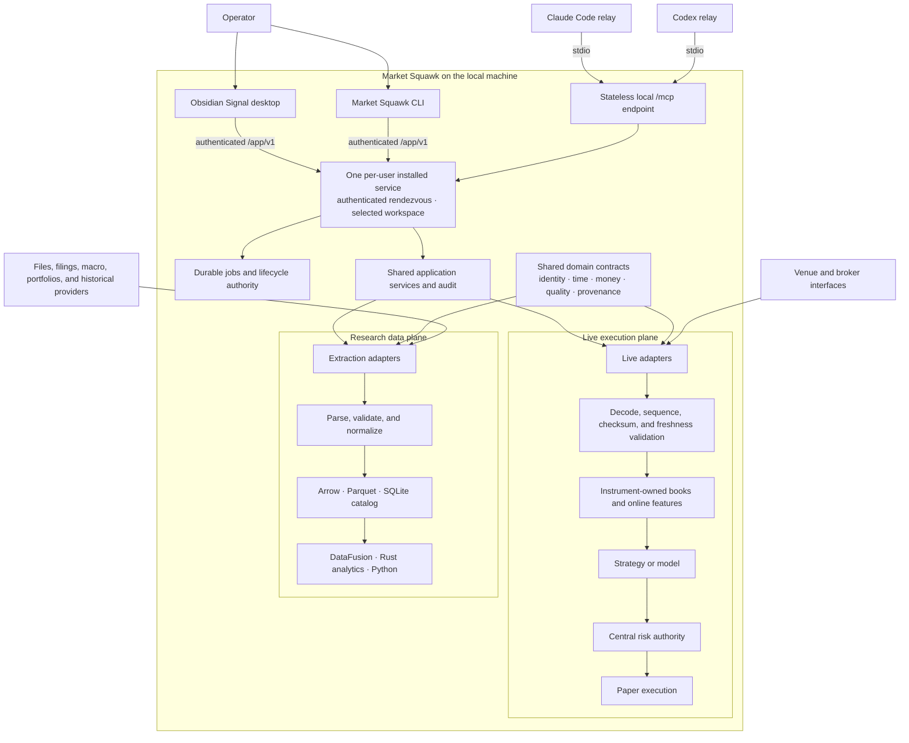

# Market Squawk

**Turn market noise into market state.**

[](https://github.com/Sawmonabo/market-squawk/actions/workflows/ci.yml)
[](rust-toolchain.toml)
[](#license)

Market Squawk is a self-hosted platform for live market data, investment research, financial
analytics, modeling, portfolio analysis, fair-value work, and risk-controlled paper execution. It
keeps its catalog, analytical datasets, models, artifacts, and audit records on the operator's
machine and requires no paid software, paid API, cloud service, hosted database, container runtime,
or telemetry service.

The Obsidian Signal desktop application is the primary interactive experience. One per-user Market
Squawk service owns the selected workspace, live and research runtimes, durable jobs, risk,
artifacts, and audit state. The Desktop and CLI connect to that service; Claude Code and Codex use
separate authenticated stdio relays into its shared local
[Model Context Protocol (MCP)](docs/reference/mcp.md) endpoint.

## Table of contents

- [What Market Squawk provides](#what-market-squawk-provides)
- [Architecture](#architecture)
- [Quick start](#quick-start)
- [Use Market Squawk](#use-market-squawk)
- [Documentation](#documentation)
- [Development](#development)
- [Local data, privacy, and cost](#local-data-privacy-and-cost)
- [Security](#security)
- [License](#license)
- [Financial-use notice](#financial-use-notice)

## What Market Squawk provides

| Area | Capabilities |
| --- | --- |
| Live markets | Coinbase and Kraken adapters, trades, quotes, price-level books, source integrity, online features, deterministic instrument sharding, freshness checks, and fail-closed quality transitions |
| Research data | Local files, SEC EDGAR, BLS, US Treasury, FRED/ALFRED inspection, versioned Arrow interchange, Parquet datasets, DataFusion queries, lineage, revisions, and point-in-time filtering |
| Analytics and models | Returns, risk, regression, fundamentals, macro features, native and ONNX inference, managed Python research and training, and governed point-in-time backtesting |
| Portfolios | Holdings and transaction imports, cost basis, gains, income, performance, exposure, attribution, scenarios, and portfolio risk |
| Risk and execution | Typed order intents, mandatory central risk checks, realistic local paper execution, fees, latency, slippage, partial fills, cancellation, reconciliation, and recovery |
| Fair value | Evidence-backed ASC 820 and IFRS 13 measurements with separate Level 1, Level 2, Level 3, and unclassified outcomes |
| Local interfaces | The Obsidian Signal Tauri desktop, a cohesive CLI, and distinct Claude Code/Codex stdio relays into one authenticated local MCP service |

Provider coverage, authentication needs, data quality, and current limitations are documented in
[Source coverage](docs/reference/source-coverage.md). Only observations that satisfy the complete
`DirectVerified` qualification contract are eligible for immediate automated action; connecting to
a provider does not grant that quality or execution authority.

## Architecture

Market Squawk separates latency-sensitive live processing from historical and analytical research.
The two planes share domain contracts and mathematical kernels, but neither depends on the other's
data pipeline.



SQLite, DataFusion, Parquet, Python, MCP requests, and arbitrary filesystem work remain outside the
live event-to-action path. Strategies and models emit intents; only central risk can approve an
order for the execution adapter.

Start with the [architecture overview](docs/architecture/overview.md) for the system context,
runtime boundaries, failure behavior, and links to the focused architecture pages and decisions.

## Quick start

### Installation

Public V1 installation packages have not been published. Until they are available from GitHub
Releases, run Market Squawk from source using [Development](#development). Do not run
`distribution/install.sh` from the source tree; it is a release-builder template and intentionally
exits before publication.

The complete distribution contains the Obsidian Signal desktop, CLI, per-user service, MCP relay,
capture helper, ONNX worker, model validator, training driver, installer/maintenance authority, uv,
managed CPython 3.14.6 and its locked analytics/modeling environment, schemas, notices, trust/update
metadata, and lifecycle assets. Ordinary users do not need Rust, Node.js, pnpm, system Python, a
database, a container runtime, or a paid service preinstalled.

### What happens after installation

The native application or local terminal bootstrap registers one per-user service, activates one
immutable product version, and publishes stable Desktop, CLI, relay, and maintenance entrypoints.
The first Desktop launch opens the permanent Obsidian Signal shell and its guided setup. Setup keeps
skipped or unfinished work visible and resumable; accepting a plan does not falsely mark a source,
model, backup, or client integration complete.

Use the installed CLI path reported by the installer:

```bash
MSQ="/path/reported/by/the/installer/market-squawk"

"$MSQ" service status
"$MSQ" service start
"$MSQ" doctor
"$MSQ" setup status
```

The service owns the selected workspace and survives individual Desktop, CLI, Claude Code, and
Codex sessions. For target-specific verification, repair, data-preserving removal, and recovery,
use the [installation runbook](docs/operations/installation-and-bootstrap.md).

## Use Market Squawk

### Set up a first source

The desktop guides this flow. From the CLI, Treasury Fiscal Data is a practical first source
because it requires no provider account or API key:

```bash
"$MSQ" source setup treasury.fiscal-data --confirm
```

Keep the launching terminal open while the protected temporary setup page is active. Then verify
the local source state:

```bash
"$MSQ" source status treasury.fiscal-data
"$MSQ" source coverage treasury.fiscal-data
"$MSQ" source health treasury.fiscal-data
```

Continue with [Source operations](docs/operations/source-operations.md) and
[Research ingestion](docs/operations/research-ingestion.md).

### Use the dashboard

The permanent Obsidian Signal shell turns the service's typed operations into user-facing
workspaces rather than exposing every raw command:

- **Overview and Markets** show market state, source quality, freshness, provenance, watchlists,
  and bounded lookup.
- **Research, Models, Decisions, and Backtests** connect point-in-time data, forecasts, future price
  ranges, buy/sell targets, model evidence, candidate dossiers, and historical strategy results.
- **Portfolios, Paper Execution, and Risk** connect imported holdings and transactions to exposure,
  performance, scenarios, orders, fills, limits, and kill-switch state.
- **Fair Value** keeps measurement evidence, hierarchy, approvals, overrides, and audit history
  separate from execution-quality data.
- **Sources, MCP, Updates, Backup & Recovery, Logs, and Settings** provide guided setup and bounded
  lifecycle controls with explicit confirmation and durable progress.

Every workspace reads the one installed service. Freshness, data quality, point-in-time identity,
limits, authority, and recovery state come from domain owners; the browser view does not invent
completion or financial evidence.

### Explore the CLI

```bash
"$MSQ" --help
"$MSQ" source --help
"$MSQ" dataset --help
"$MSQ" portfolio --help
"$MSQ" model --help
```

The top-level hierarchy covers configuration, sources, capture, ingestion, datasets, queries,
features, models, portfolios, backtests, bots, execution, fair value, MCP, and readiness checks.
The [CLI reference](docs/reference/cli.md) documents the complete command surface and confirmation
rules.

### Capture a public market-data sample

This command captures a bounded, single-venue Coinbase Exchange diagnostic stream:

```bash
"$MSQ" capture --products BTC-USD,ETH-USD --seconds 30
```

Public diagnostic capture does not establish execution-quality data. Use
[Source operations](docs/operations/source-operations.md) for the authenticated and
quality-qualified provider workflows.

### Run research and analytics

Market Squawk supports two primary research entry points:

- Import user-owned files and portfolios through the bounded local adapters.
- Discover and ingest supported official provider datasets after guided source setup.

Published observations flow through the local catalog into Arrow and Parquet datasets, bounded
DataFusion queries, point-in-time feature construction, models, and backtests. Follow these
task-oriented guides:

- [Research ingestion](docs/operations/research-ingestion.md)
- [Datasets and query](docs/operations/datasets-and-query.md)
- [Model training and inference](docs/operations/model-inference.md)
- [Portfolio and paper execution](docs/operations/portfolio-and-paper-execution.md)

### Connect Claude Code and Codex

Guided setup is the normal integration path. It discovers each supported client and registers one
owned user-level entry named `market-squawk`. Claude Code and Codex receive distinct credentials and
stateless relay processes, but both use the same installed service, selected workspace, models,
datasets, portfolios, jobs, and artifacts. Repeated setup verifies or repairs the owned entry rather
than creating duplicate product servers.

The installed compatibility diagnostics are:

```bash
"$MSQ" mcp serve --client claude-code
"$MSQ" mcp serve --client codex
```

Each command starts a named stdio relay, not another Market Squawk backend. The shared service must
already be ready; the relay resolves its authenticated loopback `/mcp` endpoint and credential from
installed local authorities. Do not copy tokens, ports, or generic server JSON into client settings.
See the [MCP reference](docs/reference/mcp.md) for registration, schemas, limits, audit behavior,
controlled artifacts, and repair.

## Documentation

The [documentation portal](docs/README.md) is the complete entry point. Use these direct routes:

| I want to… | Read |
| --- | --- |
| Understand the system and its boundaries | [Architecture](docs/architecture/README.md) |
| Install and initialize Market Squawk | [Installation and bootstrap](docs/operations/installation-and-bootstrap.md) |
| Configure local paths and secrets | [Configuration and secrets](docs/operations/configuration-and-secrets.md) |
| Set up and operate data sources | [Source operations](docs/operations/source-operations.md) |
| Ingest filings, macro data, files, and portfolios | [Research ingestion](docs/operations/research-ingestion.md) |
| Build and query analytical datasets | [Datasets and query](docs/operations/datasets-and-query.md) |
| Train or run local models | [Model inference](docs/operations/model-inference.md) |
| Import portfolios or run paper execution | [Portfolio and paper execution](docs/operations/portfolio-and-paper-execution.md) |
| Look up exact CLI, MCP, configuration, quality, or time contracts | [Reference](docs/reference/README.md) |
| See current release blockers and accepted evidence | [Delivery ledger](docs/plans/delivery-ledger.md) |
| Review release verification requirements | [Exact-head release gate](docs/verification/usable-release-gate.md) |

Architecture pages explain design and decisions. Operations pages contain runnable procedures.
Reference pages define exact current interfaces. Plans, reports, research, and verification retain
delivery and evidence history.

## Development

The workspace uses Rust Edition 2024, Cargo resolver 3, inherited workspace lints, and a committed
lockfile. Crates are grouped by product responsibility:

| Path | Responsibility |
| --- | --- |
| `apps/market-squawk/` | CLI, application composition, local portal, and process lifecycle |
| `apps/market-squawk-desktop/` | Tauri 2 desktop shell, bounded presentation bridge, and React interface |
| `crates/` | Shared domain, live, storage, analytics, modeling, portfolio, execution, valuation, services, and MCP |
| `adapters/` | Provider, file, portfolio, and paper-execution boundaries |
| `python/` | Optional point-in-time research, finance, visualization, and deterministic training |
| `docs/` | Architecture, operations, reference, research, plans, reports, and verification |

### Build from source

Source development requires Git, the repository-pinned Rust `1.97.1` toolchain, Node.js `24.18.0`,
pnpm `10.31.0`, and the official
[Tauri prerequisites](https://v2.tauri.app/start/prerequisites/) for the host platform.

```bash
git clone https://github.com/Sawmonabo/market-squawk.git
cd market-squawk
rustup show active-toolchain
pnpm --dir apps/market-squawk-desktop install --frozen-lockfile
CARGO_INCREMENTAL=0 pnpm --dir apps/market-squawk-desktop \
  tauri dev -- -- --data-dir "$PWD/.market-squawk"
```

Build the headless Rust application and its required helpers with:

```bash
CARGO_INCREMENTAL=0 cargo build --locked --release \
  --package market-squawk \
  --bin market-squawk \
  --bin market-squawk-capture-helper

CARGO_INCREMENTAL=0 cargo build --locked --release \
  --package market-squawk-modeling \
  --features onnx-tract \
  --bin market-squawk-onnx-worker
```

Before contributing:

1. Read [CONTRIBUTING.md](CONTRIBUTING.md) and the binding
   [project memory](docs/project-memory.md).
2. Keep provider-specific schemas in adapters and keep analytical or control-plane work outside the
   live event-to-action path.
3. Run focused checks while developing.
4. Run the repository gate before submitting an integration change:

```bash
CARGO_INCREMENTAL=0 ./scripts/verify.sh
```

The verification entry point runs repository-input and workspace-boundary checks, dependency and
license policy, vulnerability and credential scanning, formatting, strict Clippy, locked tests,
concurrency-model checks, release builds, and local CLI/MCP smoke checks while enforcing the
repository's build-storage ceiling.

See [CHANGELOG.md](CHANGELOG.md) for noteworthy changes.

## Local data, privacy, and cost

- No telemetry or analytics beacon is enabled.
- Product state, research datasets, models, portfolios, controlled artifacts, and audit records are
  local by default.
- No paid software, paid API, cloud service, hosted database, container runtime, or external
  telemetry infrastructure is mandatory.
- Some optional provider modes require a user-owned free account or API key. Public and local-file
  workflows remain available without a paid subscription.
- External providers retain their own availability, coverage, terms, rate limits, and data-quality
  constraints. Market Squawk records those separately from fair-value hierarchy and market depth.

Configuration precedence is:

```text
safe defaults
→ explicit local configuration file
→ MARKET_SQUAWK_* environment variables
→ CLI overrides
```

Credentials are entered only through supported local setup flows and are redacted from
configuration, logs, CLI/MCP results, and release evidence. See
[Configuration and secrets](docs/operations/configuration-and-secrets.md).

## Security

Please report vulnerabilities privately according to [SECURITY.md](SECURITY.md). Do not place
provider credentials, portfolio data, proprietary datasets, or sensitive logs in a public issue,
pull request, command line, configuration file, or chat.

Market Squawk currently provides paper execution only. No live-money broker adapter or unchecked
order-submission path is enabled.

## License

Market Squawk is available under your choice of the
[Apache License 2.0](LICENSE-APACHE) or the [MIT License](LICENSE-MIT)
(`Apache-2.0 OR MIT`).

## Financial-use notice

Market Squawk is financial research infrastructure, not investment advice. Free market data may be
incomplete, delayed, venue-specific, revised, or unavailable. Validate source quality, data rights,
model assumptions, fees, slippage, liquidity, portfolio inputs, and risk controls before relying on
any result. No software can guarantee investment outcomes or universal market-data accuracy.
