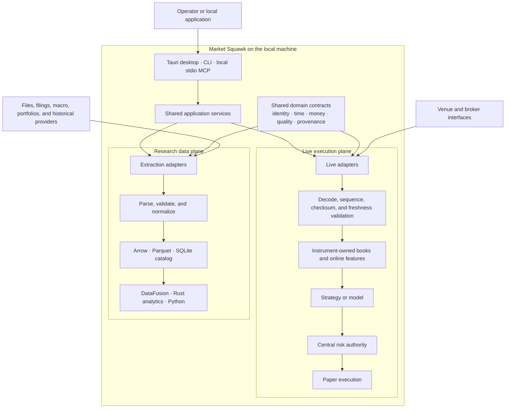

# Market Squawk

**Turn market noise into market state.**

[](https://github.com/Sawmonabo/market-squawk/actions/workflows/ci.yml)
[](rust-toolchain.toml)
[](Cargo.toml)
[](#license)

Market Squawk is a self-hosted platform for live market data, investment research, financial
analytics, modeling, portfolio analysis, fair-value work, and risk-controlled paper execution. It
keeps its catalog, analytical datasets, models, artifacts, and audit records on the operator's
machine and requires no paid software, paid API, cloud service, hosted database, container runtime,
or telemetry service.

The Obsidian Signal desktop application is the primary interactive experience. The same Rust
application services remain available through the complete command-line interface and local stdio
[Model Context Protocol (MCP)](docs/reference/mcp.md) server. Provider setup runs inside the
desktop where supported and can open the protected, temporary loopback portal as a fallback.

> [!IMPORTANT]
> Market Squawk has not published `v1.0.0`. The workspace currently carries the `0.2.0`
> development candidate; the existing `v0.1.0` tag is a historical development snapshot. Provider
> acceptance and the final unchanged-candidate release verification still block the first complete
> release. See the [delivery ledger](docs/plans/delivery-ledger.md) for current details.

## Table of contents

- [What Market Squawk provides](#what-market-squawk-provides)
- [Architecture](#architecture)
- [Quick start](#quick-start)
- [Use Market Squawk](#use-market-squawk)
- [Documentation](#documentation)
- [Development](#development)
- [Local data, privacy, and cost](#local-data-privacy-and-cost)
- [Security](#security)
- [License](#license)
- [Financial-use notice](#financial-use-notice)

## What Market Squawk provides

| Area | Capabilities |
| --- | --- |
| Live markets | Coinbase and Kraken adapters, trades, quotes, price-level books, source integrity, online features, deterministic instrument sharding, freshness checks, and fail-closed quality transitions |
| Research data | Local files, SEC EDGAR, BLS, US Treasury, FRED/ALFRED inspection, versioned Arrow interchange, Parquet datasets, DataFusion queries, lineage, revisions, and point-in-time filtering |
| Analytics and models | Returns, risk, regression, fundamentals, macro features, native and ONNX inference, optional Python research and training, and governed point-in-time backtesting |
| Portfolios | Holdings and transaction imports, cost basis, gains, income, performance, exposure, attribution, scenarios, and portfolio risk |
| Risk and execution | Typed order intents, mandatory central risk checks, realistic local paper execution, fees, latency, slippage, partial fills, cancellation, reconciliation, and recovery |
| Fair value | Evidence-backed ASC 820 and IFRS 13 measurements with separate Level 1, Level 2, Level 3, and unclassified outcomes |
| Local interfaces | The Obsidian Signal Tauri desktop, a cohesive CLI, and a typed local stdio MCP server over the same Rust application services |

Provider coverage, authentication needs, data quality, and current limitations are documented in
[Source coverage](docs/reference/source-coverage.md). Only observations that satisfy the complete
`DirectVerified` qualification contract are eligible for immediate automated action; connecting to
a provider does not grant that quality or execution authority.

## Architecture

Market Squawk separates latency-sensitive live processing from historical and analytical research.
The two planes share domain contracts and mathematical kernels, but neither depends on the other's
data pipeline.



SQLite, DataFusion, Parquet, Python, MCP requests, and arbitrary filesystem work remain outside the
live event-to-action path. Strategies and models emit intents; only central risk can approve an
order for the execution adapter.

Start with the [architecture overview](docs/architecture/overview.md) for the system context,
runtime boundaries, failure behavior, and links to the focused architecture pages and decisions.

## Quick start

The commands below build and start the current source checkout. For a versioned production-style
installation, supported-platform details, and success checks, follow
[Installation and local bootstrap](docs/operations/installation-and-bootstrap.md).

### 1. Get the source and toolchain

```bash
git clone https://github.com/Sawmonabo/market-squawk.git
cd market-squawk
rustup show active-toolchain
```

The repository pins Rust `1.97.1` with `rustfmt` and Clippy in
[`rust-toolchain.toml`](rust-toolchain.toml).

### 2. Launch the desktop application

Building the desktop from source also requires Node.js `24.18.0`, pnpm `10.31.0`, and the
[Tauri platform prerequisites](https://v2.tauri.app/start/prerequisites/) for the current operating
system. These are build tools; an installed desktop package does not require Node.js, pnpm, or
Rust.

```bash
pnpm --dir apps/market-squawk-desktop install --frozen-lockfile
CARGO_INCREMENTAL=0 pnpm --dir apps/market-squawk-desktop \
  tauri dev -- -- --data-dir "$PWD/.market-squawk"
```

This opens the permanent Obsidian Signal shell with guided setup, source onboarding, and bounded
views over the local application services. The final `--` separates Tauri runner arguments from
Market Squawk desktop arguments. An installed desktop uses the operating system's
application-local data directory when no configuration layer supplies another path, so a
double-click launch does not depend on its working directory. The production paper service is
available through the typed Bot and Execution operations, starts stopped, remains paper-only, and
cannot bypass central risk.

Native packages use the package-only Tauri overlay, which compiles and installs the CLI, capture
helper, and ONNX worker beside the desktop executable:

```bash
CARGO_INCREMENTAL=0 pnpm --dir apps/market-squawk-desktop exec tauri build \
  --config src-tauri/tauri.bundle.conf.json
```

Choose host-specific package types and the current unsigned-package safety options from the
[installation runbook](docs/operations/installation-and-bootstrap.md#build-the-desktop-package).
The desktop reports local MCP as available only after verifying the packaged CLI sibling and the
bounded MCP tool contract. Guided setup then renders client JSON with a durable installed launcher,
and the required workspace identity paths. Close the desktop before an MCP client starts it because
the two processes must not own the same workspace concurrently.

### 3. Build the local headless bundle

```bash
CARGO_INCREMENTAL=0 cargo build --locked --release \
  --package market-squawk \
  --bin market-squawk \
  --bin market-squawk-capture-helper

CARGO_INCREMENTAL=0 cargo build --locked --release \
  --package market-squawk-modeling \
  --features onnx-tract \
  --bin market-squawk-onnx-worker
```

The three executables are written to `target/release/`. The application, capture helper, and ONNX
worker should remain sibling files when installed.

### 4. Initialize a local instance

```bash
MSQ="$PWD/target/release/market-squawk"
DATA_ROOT="$PWD/.market-squawk"

"$MSQ" --data-dir "$DATA_ROOT" config validate
"$MSQ" --data-dir "$DATA_ROOT" init
"$MSQ" --data-dir "$DATA_ROOT" doctor
```

The CLI safe default is `.market-squawk/`, which is ignored by Git; the commands above select that
path explicitly. Use an absolute, operator-owned `--data-dir` for a durable headless installation.
The installed desktop's separate native default is described above.

### 5. Open guided provider setup from the CLI

Treasury Fiscal Data is a practical first source because it requires no provider account or API
key:

```bash
"$MSQ" --data-dir "$DATA_ROOT" \
  source setup treasury.fiscal-data --confirm
```

Market Squawk opens a temporary portal at `http://127.0.0.1:<port>`. Keep the launching terminal
open, complete the guided setup in the browser, and then press Ctrl-C after the portal reports a
successful activation. If the browser does not open automatically, use the exact loopback URL
printed to stderr.

Verify the local provider state:

```bash
"$MSQ" --data-dir "$DATA_ROOT" source status treasury.fiscal-data
"$MSQ" --data-dir "$DATA_ROOT" source coverage treasury.fiscal-data
"$MSQ" --data-dir "$DATA_ROOT" source health treasury.fiscal-data
```

Continue with [Source operations](docs/operations/source-operations.md) to set up other providers
and [Research ingestion](docs/operations/research-ingestion.md) to discover, ingest, publish, and
query provider data.

## Use Market Squawk

### Explore the CLI

```bash
"$MSQ" --help
"$MSQ" source --help
"$MSQ" dataset --help
"$MSQ" portfolio --help
"$MSQ" model --help
```

The top-level hierarchy covers configuration, sources, capture, ingestion, datasets, queries,
features, models, portfolios, backtests, bots, execution, fair value, MCP, and readiness checks.
The [CLI reference](docs/reference/cli.md) documents the complete command surface and confirmation
rules.

### Capture a public market-data sample

This command captures a bounded, single-venue Coinbase Exchange diagnostic stream:

```bash
"$MSQ" --data-dir "$DATA_ROOT" \
  capture --products BTC-USD,ETH-USD --seconds 30
```

Public diagnostic capture does not establish execution-quality data. Use
[Source operations](docs/operations/source-operations.md) for the authenticated and
quality-qualified provider workflows.

### Run research and analytics

Market Squawk supports two primary research entry points:

- Import user-owned files and portfolios through the bounded local adapters.
- Discover and ingest supported official provider datasets after guided source setup.

Published observations flow through the local catalog into Arrow and Parquet datasets, bounded
DataFusion queries, point-in-time feature construction, models, and backtests. Follow these
task-oriented guides:

- [Research ingestion](docs/operations/research-ingestion.md)
- [Datasets and query](docs/operations/datasets-and-query.md)
- [Model training and inference](docs/operations/model-inference.md)
- [Portfolio and paper execution](docs/operations/portfolio-and-paper-execution.md)

### Start the local MCP server

```bash
"$MSQ" --data-dir "$DATA_ROOT" mcp serve
```

Generic MCP client configuration:

```json
{
  "mcpServers": {
    "market-squawk": {
      "command": "/absolute/path/to/market-squawk",
      "args": [
        "--data-dir",
        "/absolute/path/to/market-squawk-data",
        "mcp",
        "serve"
      ]
    }
  }
}
```

The server communicates over local stdio. Protocol responses use stdout and operational logs use
stderr. The desktop's guided setup generates the corresponding client JSON from installed,
required workspace identity state; it does not start the server or configure a client. Advanced
policy supplied only through environment variables must also be supplied to the MCP client. See the
[MCP reference](docs/reference/mcp.md) for tool domains, schemas, limits, audit behavior, controlled
artifacts, and client integration.

## Documentation

The [documentation portal](docs/README.md) is the complete entry point. Use these direct routes:

| I want to… | Read |
| --- | --- |
| Understand the system and its boundaries | [Architecture](docs/architecture/README.md) |
| Install and initialize Market Squawk | [Installation and bootstrap](docs/operations/installation-and-bootstrap.md) |
| Configure local paths and secrets | [Configuration and secrets](docs/operations/configuration-and-secrets.md) |
| Set up and operate data sources | [Source operations](docs/operations/source-operations.md) |
| Ingest filings, macro data, files, and portfolios | [Research ingestion](docs/operations/research-ingestion.md) |
| Build and query analytical datasets | [Datasets and query](docs/operations/datasets-and-query.md) |
| Train or run local models | [Model inference](docs/operations/model-inference.md) |
| Import portfolios or run paper execution | [Portfolio and paper execution](docs/operations/portfolio-and-paper-execution.md) |
| Look up exact CLI, MCP, configuration, quality, or time contracts | [Reference](docs/reference/README.md) |
| See current release blockers and accepted evidence | [Delivery ledger](docs/plans/delivery-ledger.md) |
| Review release verification requirements | [Exact-head release gate](docs/verification/usable-release-gate.md) |

Architecture pages explain design and decisions. Operations pages contain runnable procedures.
Reference pages define exact current interfaces. Plans, reports, research, and verification retain
delivery and evidence history.

## Development

The workspace uses Rust Edition 2024, Cargo resolver 3, inherited workspace lints, and a committed
lockfile. Crates are grouped by product responsibility:

| Path | Responsibility |
| --- | --- |
| `apps/market-squawk/` | CLI, application composition, local portal, and process lifecycle |
| `apps/market-squawk-desktop/` | Tauri 2 desktop shell, bounded presentation bridge, and React interface |
| `crates/` | Shared domain, live, storage, analytics, modeling, portfolio, execution, valuation, services, and MCP |
| `adapters/` | Provider, file, portfolio, and paper-execution boundaries |
| `python/` | Optional point-in-time research, finance, visualization, and deterministic training |
| `docs/` | Architecture, operations, reference, research, plans, reports, and verification |

Before contributing:

1. Read [CONTRIBUTING.md](CONTRIBUTING.md) and the binding
   [project memory](docs/project-memory.md).
2. Keep provider-specific schemas in adapters and keep analytical or control-plane work outside the
   live event-to-action path.
3. Run focused checks while developing.
4. Run the repository gate before submitting an integration change:

```bash
CARGO_INCREMENTAL=0 ./scripts/verify.sh
```

The verification entry point runs repository-input and workspace-boundary checks, dependency and
license policy, vulnerability and credential scanning, formatting, strict Clippy, locked tests,
concurrency-model checks, release builds, and local CLI/MCP smoke checks while enforcing the
repository's build-storage ceiling.

See [CHANGELOG.md](CHANGELOG.md) for noteworthy changes.

## Local data, privacy, and cost

- No telemetry or analytics beacon is enabled.
- Product state, research datasets, models, portfolios, controlled artifacts, and audit records are
  local by default.
- No paid software, paid API, cloud service, hosted database, container runtime, or external
  telemetry infrastructure is mandatory.
- Some optional provider modes require a user-owned free account or API key. Public and local-file
  workflows remain available without a paid subscription.
- External providers retain their own availability, coverage, terms, rate limits, and data-quality
  constraints. Market Squawk records those separately from fair-value hierarchy and market depth.

Configuration precedence is:

```text
safe defaults
→ explicit local configuration file
→ MARKET_SQUAWK_* environment variables
→ CLI overrides
```

Credentials are entered only through supported local setup flows and are redacted from
configuration, logs, CLI/MCP results, and release evidence. See
[Configuration and secrets](docs/operations/configuration-and-secrets.md).

## Security

Please report vulnerabilities privately according to [SECURITY.md](SECURITY.md). Do not place
provider credentials, portfolio data, proprietary datasets, or sensitive logs in a public issue,
pull request, command line, configuration file, or chat.

Market Squawk currently provides paper execution only. No live-money broker adapter or unchecked
order-submission path is enabled.

## License

Market Squawk is available under your choice of the
[Apache License 2.0](LICENSE-APACHE) or the [MIT License](LICENSE-MIT)
(`Apache-2.0 OR MIT`).

## Financial-use notice

Market Squawk is financial research infrastructure, not investment advice. Free market data may be
incomplete, delayed, venue-specific, revised, or unavailable. Validate source quality, data rights,
model assumptions, fees, slippage, liquidity, portfolio inputs, and risk controls before relying on
any result. No software can guarantee investment outcomes or universal market-data accuracy.
