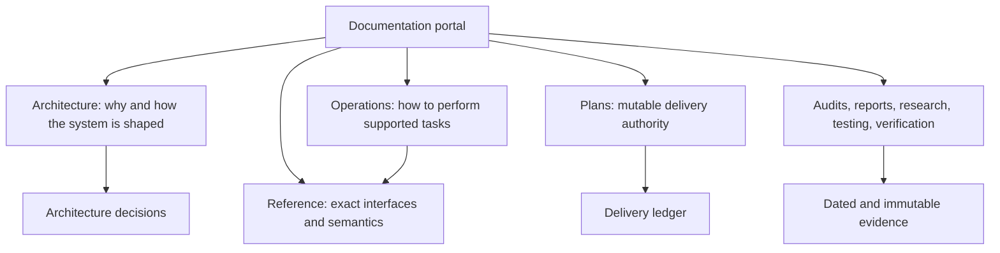

# Market Squawk documentation

This portal is the maintained entry point for understanding, operating, integrating, and reviewing
Market Squawk. It separates architectural explanation, task-oriented operations, factual reference,
delivery status, research, and historical evidence so each page has one clear job.

| Field | Value |
| --- | --- |
| Document type | Documentation portal index |
| Audience | Operators, users, integrators, maintainers, reviewers, and contributors |
| Status | Current |
| Last substantive review | 2026-07-23 |
| Reviewed product commit | `836aae662dfbbc3cf40e94e6da6c5c37cd3b57bd` |

## Start by intent

| I want to… | Start here |
| --- | --- |
| Understand the system and its boundaries | [Architecture](architecture/README.md) |
| Install, configure, ingest, query, model, or operate it | [Operations](operations/README.md) |
| Look up an exact command, setting, MCP tool, source capability, quality class, or time field | [Reference](reference/README.md) |
| See what is runnable and what still blocks the first complete release | [Delivery ledger](plans/delivery-ledger.md) |
| Review the current requirements audit | [Gap analysis](plans/gap-analysis.md) |
| Follow the approved implementation sequence | [Implementation plan](plans/implementation-plan.md) |
| Inspect original research and primary-source decisions | [Research](research/) |
| Inspect historical architecture baselines | [Architecture audits](audits/architecture/) |
| Review test design or release evidence | [Testing](testing/) and [verification](verification/) |

## Documentation map

## Maintained documentation

### Architecture

The [architecture portal](architecture/README.md) moves from system context and building blocks
through the live, research, and control planes, then into time/provenance, trust boundaries,
deployment, quality attributes, and decision records. Architecture pages explain durable design and
current implementation boundaries; they do not track day-to-day completion percentages.

### Operations

The [operations portal](operations/README.md) contains current procedures with prerequisites,
authority checks, exact commands, success evidence, and recovery behavior. A page describes a
workflow only when the reviewed product commit supports it. Mandatory capabilities that are not
runnable remain in the delivery ledger rather than receiving fictional instructions.

### Reference

The [reference portal](reference/README.md) is the factual contract for CLI, configuration, MCP,
source coverage, data quality, and time/provenance semantics. Reference pages state defaults,
bounds, exact names, schemas, classifications, and failure behavior without becoming tutorials.

### Delivery authority

The [delivery ledger](plans/delivery-ledger.md) is the sole mutable summary of accepted product
evidence, active work, blockers, and release checkpoints. The
[gap analysis](plans/gap-analysis.md) classifies every product requirement, and the
[implementation plan](plans/implementation-plan.md) retains the approved delivery sequence.

Use only these release-status labels in maintained product summaries:

- **Runnable now** — implemented behavior that can be exercised at the reviewed commit;
- **Required but missing** — mandatory product capability with no accepted complete implementation;
- **Release blocked until implemented** — missing or incomplete acceptance evidence that prevents
  the first complete local release.

## Evidence and history

| Area | Purpose | Maintenance rule |
| --- | --- | --- |
| [`audits/`](audits/) | Dated current-state and target-state baselines | Preserve historical wording and file history; correct only broken maintained navigation |
| [`reports/`](reports/) | Generated or authored review outcomes and measurements | Bind claims to an exact commit/tree and measurement context |
| [`research/`](research/) | Source-backed technical, provider, standards, and ecosystem research | Record dates, direct sources, and inference boundaries |
| [`testing/`](testing/) | Explanatory testing strategy and formal-model guidance | Keep focused on high-value behavior and acceptance risk |
| [`verification/`](verification/) | Machine-readable policies and accepted release evidence | Treat as evidence, not narrative documentation |
| [`superpowers/specs/`](superpowers/specs/) | Approved design specifications | Preserve decision context after implementation |
| [`superpowers/plans/`](superpowers/plans/) | Detailed implementation plans | Preserve task history; current completion state belongs in the delivery ledger |

Historical evidence can describe a state that is no longer current. Its date and reviewed commit
are part of its meaning. Do not copy an old gap classification into a current architecture or
operations page.

## Reading paths

### New operator

1. [Installation and bootstrap](operations/installation-and-bootstrap.md)
2. [Configuration and secrets](operations/configuration-and-secrets.md)
3. [Source operations](operations/source-operations.md)
4. [Research ingestion](operations/research-ingestion.md)
5. [Datasets and query](operations/datasets-and-query.md)
6. [Troubleshooting](operations/troubleshooting.md)

### Architecture or security review

1. [Architecture overview](architecture/overview.md)
2. [Building blocks](architecture/building-blocks.md)
3. [Live execution plane](architecture/live-execution-plane.md)
4. [Research data plane](architecture/research-data-plane.md)
5. [Local control plane](architecture/control-plane.md)
6. [Data, time, and provenance](architecture/data-time-and-provenance.md)
7. [Security and trust boundaries](architecture/security-and-trust-boundaries.md)
8. [Quality attributes](architecture/quality-attributes.md)
9. [Architecture decisions](architecture/decisions/README.md)

### Integration author

1. [CLI reference](reference/cli.md)
2. [Configuration reference](reference/configuration.md)
3. [MCP reference](reference/mcp.md)
4. [Source coverage](reference/source-coverage.md)
5. [Data quality](reference/data-quality.md)
6. [Time and provenance](reference/time-and-provenance.md)

## Documentation contract

Substantive maintained pages identify their document type, audience, status, last review date, and
reviewed product commit. Long pages provide a contents list. Architecture and operations pages link
to relevant code and direct primary sources. Mermaid diagrams use stable flowchart, sequence, state,
and entity-relationship syntax that renders on GitHub.

When behavior changes, update the owning code and its factual reference or runbook in the same
accepted lane. Update mutable completion state in the delivery ledger. Preserve dated audits and
plans as evidence instead of rewriting history.
