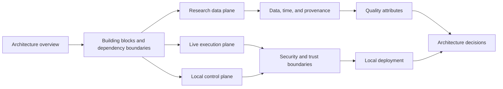

# Market Squawk architecture

This index is the maintained entry point to Market Squawk's current architecture. It moves from
system context and dependency structure into the live, research, and control planes, then into
cross-cutting semantics, trust, deployment, quality, and accepted decisions.

| Field | Value |
| --- | --- |
| Document type | Architecture index |
| Audience | Operators, maintainers, integrators, reviewers, and contributors |
| Status | Current |
| Last substantive review | 2026-07-23 |
| Reviewed commit | `836aae662dfbbc3cf40e94e6da6c5c37cd3b57bd` |

## Reading path

Start with the [overview](overview.md) for the system boundary, architectural drivers, local-first
cost model, and runtime containers. The pages below are current explanations of the reviewed
implementation, not release-status journals or operator runbooks.

## Current architecture pages

| Page | Primary question |
| --- | --- |
| [Overview](overview.md) | What is inside the Market Squawk boundary, and why are the major planes separate? |
| [Building blocks](building-blocks.md) | Which crate or adapter owns each responsibility, dependency, and authority boundary? |
| [Live execution plane](live-execution-plane.md) | How do current provider frames become qualified instrument state and risk-evaluated paper actions? |
| [Research data plane](research-data-plane.md) | How do source objects become immutable, queryable, point-in-time analytical generations? |
| [Local control plane](control-plane.md) | How do CLI and stdio MCP share typed application services, lifecycle, audit, and local capabilities? |
| [Data, time, and provenance](data-time-and-provenance.md) | How are identity, knowledge time, source precision, revisions, and lineage preserved? |
| [Security and trust boundaries](security-and-trust-boundaries.md) | Where do requests, bytes, credentials, evidence, and financial authority change trust level? |
| [Local deployment](deployment.md) | Which processes, endpoints, directories, startup stages, and recovery surfaces exist on one host? |
| [Quality attributes](quality-attributes.md) | Which measurable integrity, resource, recovery, privacy, and performance scenarios define acceptance? |
| [Architecture decisions](decisions/README.md) | Which significant structural choices are accepted, and what trade-offs do they carry? |

## Architectural invariants

- Live execution and research are independent pipelines over shared invariant-preserving domain
  contracts.
- `FairValueHierarchy`, `MarketDepth`, `DataQuality`, stream integrity, and current execution
  authority remain separate concepts.
- Mutable live state has deterministic single-writer ownership and bounded ingress.
- Research publication is schema-bound, content-verified, immutable, manifest-driven, and
  point-in-time aware.
- Strategies and models emit intents; central risk owns approval; the dispatcher owns the sole
  adapter submission boundary.
- CLI and MCP invoke the same typed application operations, while CLI-only producer and analytical
  workflows retain their narrower local capabilities.
- Current authority is process-local, generation-bound, deadline-bound, revocable, and not
  recreated by archived evidence.

## Other documentation domains

- [Operations](../operations/README.md) provides current runnable procedures and recovery steps.
- [Reference](../reference/README.md) specifies commands, configuration, MCP, source coverage,
  quality, and temporal contracts.
- [Delivery ledger](../plans/delivery-ledger.md) owns mutable implementation and release-blocker
  state.
- [Historical architecture audits](../audits/architecture/) preserve superseded evidence and are
  not current architecture authority.

## Implementation anchors

- [Workspace manifest](../../Cargo.toml)
- [Application composition](../../apps/market-squawk/src/local_product/mod.rs)
- [Canonical domain](../../crates/market-squawk-domain/src/lib.rs)
- [Live runtime](../../crates/market-squawk-live/src/lib.rs)
- [Research data authority](../../crates/market-squawk-data/src/lib.rs)
- [Execution authority](../../crates/market-squawk-execution/src/lib.rs)
- [Typed application services](../../crates/market-squawk-services/src/lib.rs)

## Documentation basis

| Source | Applied guidance | Reviewed |
| --- | --- | --- |
| [C4 model diagrams](https://c4model.com/diagrams) | Context and container views retain one abstraction level and label material relationships | 2026-07-23 |
| [arc42 building blocks](https://docs.arc42.org/section-5/) | Static decomposition, responsibilities, dependencies, and interfaces are documented separately from runtime behavior | 2026-07-23 |
| [arc42 runtime view](https://docs.arc42.org/section-6/) | Runtime pages use scenarios to explain collaboration and failure behavior | 2026-07-23 |
| [GitHub diagram documentation](https://docs.github.com/en/get-started/writing-on-github/working-with-advanced-formatting/creating-diagrams) | Stable Mermaid diagrams render directly in the repository portal | 2026-07-23 |
