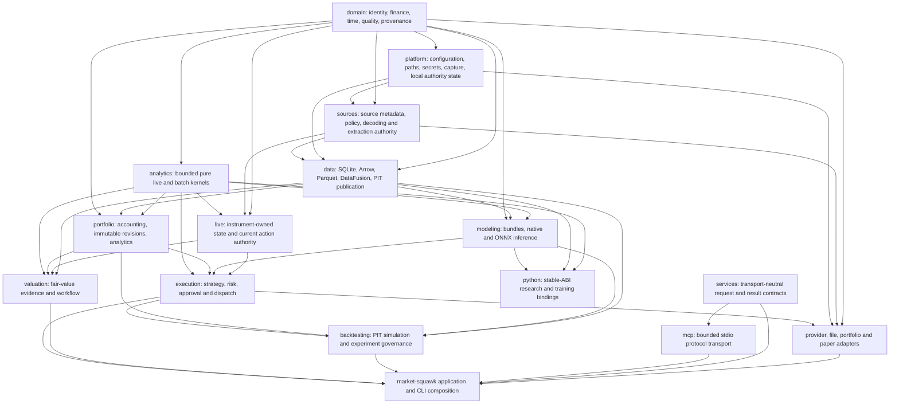

# Building Blocks and Dependency Boundaries

This page maps Market Squawk's runtime responsibilities to its cohesive Rust crates and adapters.
It also defines the allowed dependency direction and the work that is prohibited from the live
event-to-decision path.

| Metadata | Value |
| --- | --- |
| Document type | Building-block architecture |
| Audience | Maintainers, reviewers, adapter authors, and integrators |
| Status | Current |
| Last substantive review | 2026-07-25 |
| Reviewed commit | `041175590bd2e4a357ea28d75c675c252d3b3746` |

## Contents

- [Scope](#scope)
- [Workspace structure](#workspace-structure)
- [Dependency direction](#dependency-direction)
- [Crate responsibilities](#crate-responsibilities)
- [Adapter responsibilities](#adapter-responsibilities)
- [Live hot-path boundary](#live-hot-path-boundary)
- [Interfaces and authority ownership](#interfaces-and-authority-ownership)
- [Failure consequences](#failure-consequences)
- [Related documentation and code](#related-documentation-and-code)
- [External sources](#external-sources)

## Scope

This page describes compile-time package boundaries and their corresponding runtime
responsibilities. It does not reproduce public API inventories, protocol sequences, or operator
procedures. The root [workspace manifest](../../Cargo.toml) is the exact dependency source of
truth; this page explains that graph at the reviewed commit.

Crates are not deployment units. Most run inside the `market-squawk` process, while restricted
capture and ONNX binaries provide specific helper-process boundaries. Adapters are concrete
provider/file/execution integrations, not independent services.

## Workspace structure

The repository is a virtual Cargo workspace with resolver 3 and three member families:

```text
apps/*      composition roots and shipping binaries
crates/*    domain and product capabilities
adapters/*  concrete source and execution integrations
```

Every member inherits the workspace package metadata and lints. One committed `Cargo.lock` fixes
the dependency solution. The application is the only package that depends across the complete
product graph.

The following view answers: how do dependency-light contracts grow into product capabilities and
finally into the application composition?



Arrows point from a dependency toward its consumer. The diagram intentionally summarizes
families: not every consumer uses every lower package, and adapters select only the contracts they
need. The exact direct edges are declared in member manifests.

## Dependency direction

### Foundation contracts

`market-squawk-domain` is the financial and identity foundation. It performs no provider network,
database, filesystem, MCP, Python, or model-runtime work. `market-squawk-services` is a separate
transport-neutral foundation for typed operations, schemas, cancellation, deadlines, bounds, and
results; it contains no business-domain handler.

`market-squawk-platform`, `market-squawk-sources`, and `market-squawk-analytics` add local
infrastructure, source authority, and pure mathematical kernels. The current source framework uses
platform contracts for durable authority and network-policy evidence, so the actual edge is
`sources -> platform -> domain`, in addition to `sources -> domain`.

### Plane implementations

`market-squawk-live` depends on domain, sources, and analytics. It does not depend on the data,
platform catalog, modeling, portfolio, valuation, MCP, application, or Python packages.

`market-squawk-data` depends on domain, sources, and platform and owns the analytical storage
stack. Modeling and portfolio consume data and analytics; neither makes the data crate depend on a
higher-level consumer.

Execution depends on the live, modeling, portfolio, analytics, and domain contracts because it
owns the one legal strategy-to-risk-to-dispatch path. Backtesting reuses execution assumptions,
modeling, portfolio accounting, and point-in-time data but cannot mint current live authority.
Valuation consumes producer evidence from data, live, and portfolio while retaining classification
authority separate from execution.

### Transport and composition

`market-squawk-mcp` depends only on `market-squawk-services` for business-facing contracts. The
application supplies concrete domain services and composes the protocol transport. CLI routes
through the same `Application` and `LocalProduct`; neither transport is a second composition root.

The stable-ABI Python crate consumes analytical, data, domain, and modeling contracts. It has no
edge into live or execution. Concrete adapters depend inward on source/platform/domain or
execution contracts. The shipping application imports adapters and all product crates, resolves
their ownership, and controls lifecycle.

The graph remains acyclic. A new dependency is acceptable only when the lower package can describe
the contract without knowing the higher-level consumer. Cross-package test-only edges do not grant
production call authority.

## Crate responsibilities

| Package | Responsibility and invariant |
| --- | --- |
| [`market-squawk-domain`](../../crates/market-squawk-domain/src/lib.rs) | Private invariant-preserving identities, fixed-point financial values, canonical live/research records, time, quality, provenance, and type separation. |
| [`market-squawk-platform`](../../crates/market-squawk-platform/src/lib.rs) | Configuration precedence, confined local paths, OS-first secrets, authority-state persistence, compatible journals, and bounded asynchronous capture. |
| [`market-squawk-sources`](../../crates/market-squawk-sources/src/lib.rs) | Separate live/extraction contracts, immutable source metadata, provider/network policy, decoding evidence, health, budgets, registration, onboarding, and current source authority. |
| [`market-squawk-analytics`](../../crates/market-squawk-analytics/src/lib.rs) | Dependency-light, bounded live and batch features with explicit units, policies, warm-up, null behavior, and semantic identities. |
| [`market-squawk-live`](../../crates/market-squawk-live/src/lib.rs) | Stable sharding, order books, sequence/checksum/precision/freshness validation, online state, immutable snapshots, and opaque current action authority. |
| [`market-squawk-data`](../../crates/market-squawk-data/src/lib.rs) | SQLite catalog, revision/rights admission, Arrow conversion, Parquet publication/recovery, DataFusion queries, point-in-time selection, manifests, and lineage. Never queried from the live event-to-action path. |
| [`market-squawk-modeling`](../../crates/market-squawk-modeling/src/lib.rs) | Immutable model bundles/generations and bounded native or admitted ONNX inference. Inference performs no filesystem, database, network, Python, plugin, LLM, or remote-code work. The ONNX backend uses a bounded protocol to a pre-admitted, prewarmed, model-owned worker. |
| [`market-squawk-portfolio`](../../crates/market-squawk-portfolio/src/lib.rs) | Immutable source-evidenced accounting, reconciliation, performance, exposure, attribution, risk, scenarios, and proposal-only rebalancing. It has no order authority. |
| [`market-squawk-execution`](../../crates/market-squawk-execution/src/lib.rs) | Typed strategies and intents, portfolio-bound pre-trade risk, private approval construction, one-use bounded dispatch, reconciliation, and execution audit. |
| [`market-squawk-backtesting`](../../crates/market-squawk-backtesting/src/lib.rs) | Point-in-time research simulation, admitted strategies, execution assumptions, reconciled accounting, immutable artifacts, and bounded experiment governance. |
| [`market-squawk-valuation`](../../crates/market-squawk-valuation/src/lib.rs) | ASC 820/IFRS 13 evidence, methods, classification, overrides, approval/revocation, access decisions, recovery, and bounded queries. |
| [`market-squawk-python`](../../crates/market-squawk-python/src/lib.rs) | Stable-ABI Python access to admitted point-in-time datasets and bounded Rust analytical/training contracts, outside the live path. |
| [`market-squawk-services`](../../crates/market-squawk-services/src/lib.rs) | Transport-neutral typed operation descriptors, JSON admission, deadlines, cancellation, authorization, artifact policy, bounds, progress, and result metadata. |
| [`market-squawk-mcp`](../../crates/market-squawk-mcp/src/lib.rs) | Bounded local stdio MCP framing, protocol lifecycle, output backpressure, audit, and opaque artifact references over `ToolServices`. |
| [`market-squawk`](../../apps/market-squawk/src/lib.rs) | Shipping binaries and sole product composition: application domains, CLI/MCP, live source/runtime ownership, research, portfolio, model, fair value, backtest, and paper execution. |

## Adapter responsibilities

Adapters terminate an external representation or execution protocol. They may normalize
provider-specific evidence, but they do not assign canonical execution quality or bypass a
consumer-owned authority.

| Adapter | Current boundary |
| --- | --- |
| [Coinbase](../../adapters/market-squawk-adapter-coinbase/src/lib.rs) | Separate bounded public `ws-feed` and authenticated `ws-direct`/REST level-3 profiles. Public observations remain `DirectUnverified`; the Direct profile supplies unqualified evidence to the central runtime, which alone can derive `DirectVerified`. |
| [Kraken](../../adapters/market-squawk-adapter-kraken/src/lib.rs) | Spot WebSocket v2 books/trades, checksum evidence, session recovery, and provider-normalized observations; current execution qualification remains unavailable. |
| [SEC](../../adapters/market-squawk-adapter-sec/src/lib.rs) | Bounded EDGAR submissions, filings, Company Facts, inline XBRL, raw evidence, and revision-aware normalization. |
| [FRED/ALFRED](../../adapters/market-squawk-adapter-fred/src/lib.rs) | Series/vintage extraction with per-series rights admission and credential boundary. |
| [BLS](../../adapters/market-squawk-adapter-bls/src/lib.rs) | Public v1 and user-credentialed v2 extraction with deterministic request chunking and vintage evidence. |
| [Treasury](../../adapters/market-squawk-adapter-treasury/src/lib.rs) | Fiscal Data pagination and official yield/rate representations under separate surface evidence. |
| [Files](../../adapters/market-squawk-adapter-files/src/lib.rs) | Capability-confined CSV/TSV, JSON/NDJSON, XML, Excel, SQLite export, OFX/QFX, and Parquet extraction with shared bounds. |
| [Portfolio](../../adapters/market-squawk-adapter-portfolio/src/lib.rs) | Raw-preserving holdings/transaction extraction, normalization, supplied-total reconciliation, and durable source evidence. |
| [Paper](../../adapters/market-squawk-adapter-paper/src/lib.rs) | Deterministic realistic paper matching, fees, latency, slippage, lifecycle, balances, checkpoints, recovery, and reconciliation. Accepts only execution-owned dispatch values. |

Provider availability, authentication, rights, and release state remain source-specific. The
[source-coverage reference](../reference/source-coverage.md) owns the factual matrix; the
[delivery ledger](../plans/delivery-ledger.md) owns unresolved release outcomes.

## Live hot-path boundary

The event-to-decision path is deliberately small and synchronous after bounded ingress:


The path from frame application through risk and dispatch admission remains a bounded,
memory-resident computation. SQLite, DataFusion, Arrow conversion, Parquet, Python, MCP,
language-model, persistence, and control-plane network work stays outside it. Capture persistence
is asynchronous, and every queue or collection on the decision path has a fixed admission bound.

Inference is permitted only through a pre-admitted, prewarmed model generation. Native inference
uses immutable in-memory state; admitted ONNX inference uses bounded IPC to an already-running,
model-owned worker. Model loading, validation, helper admission, and warm-up are control-plane work
completed before a model generation is published.

Raw capture is a bounded side branch. The source reader does not wait for disk completion, but a
capture-admission failure degrades the exact source generation so that the same frame cannot
produce executable action. Qualified market exports, snapshots, execution submission, and audit
handoffs are also bounded, nonblocking boundaries with explicit failure dispositions.

## Interfaces and authority ownership

| Boundary | Producer | Consumer | Authority rule |
| --- | --- | --- | --- |
| Raw market frame | Live adapter using a restricted generation factory | Capture and source registry | Frame ordinal, generation, receive time, and bytes are bound before decode. |
| Decoded provider batch | Source-specific bounded decoder | Registry and owning live route | Provider-normalized evidence is not yet a canonical event or quality grant. |
| Current live batch | Authoritative source registry | Bound shard ingress | Exact source, capture receipt, generation, route, and health must agree. |
| Committed action context | Owning live shard | Execution-owned action hook | Only current applied state and ready features can request action authority. |
| Order intent | Strategy or admitted model mapper | Risk service | Intent is descriptive and has no adapter authority. |
| Approved order | Risk service | One-use dispatcher | Private construction binds current market, portfolio, limits, and expiry. |
| Extraction batch | Extraction adapter under request permit | Research ingest authority | Rights, revision, source, count, bytes, and cancellation are checked before publication. |
| Dataset generation | Data publication coordinator | Query/Python/backtest consumers | Catalog authority and immutable manifest identify complete objects. |
| Producer evidence | Live/research/analytics/portfolio services | Fair-value service | Producer receipt proves origin; classification never changes data quality. |
| Typed tool request | CLI or MCP descriptor admission | Application domain service | Same schema, authorization, deadline, cancellation, and result bounds apply to both transports. |

## Failure consequences

Boundary failure is part of the contract:

- invalid provider bytes are rejected or quarantine the affected stream before canonical state is
  published;
- book or feature transition failure retains last-good state and suppresses action;
- full count/byte queues refuse admission; execution-critical saturation invalidates or suppresses
  the affected authority rather than dropping a message silently;
- model or strategy failure returns no intents;
- risk rejection returns no approval; dispatch saturation returns no adapter call;
- extraction, catalog, object-store, or query failure cannot alter current live state;
- incomplete dataset publication leaves no current manifest generation;
- invalid portfolio, model, backtest, or valuation evidence cannot be reconstructed by CLI/MCP;
  and
- transport failure cancels or bounds the request but does not gain business-domain ownership.

## Related documentation and code

- [Architecture overview](overview.md)
- [Live execution plane](live-execution-plane.md)
- [Research data plane](research-data-plane.md)
- [Local control plane](control-plane.md)
- [Security and trust boundaries](security-and-trust-boundaries.md)
- [Central risk and execution authority ADR](decisions/0005-central-risk-and-execution-authority.md)
- [Application package manifest](../../apps/market-squawk/Cargo.toml)
- [Application composition](../../apps/market-squawk/src/application.rs)
- [Live actor processing boundary](../../crates/market-squawk-live/src/runtime/actor/processing.rs)
- [Execution dispatch boundary](../../crates/market-squawk-execution/src/dispatcher.rs)

## External sources

| Source | Relevance | Reviewed |
| --- | --- | --- |
| [Cargo workspaces](https://doc.rust-lang.org/cargo/reference/workspaces.html) | Defines workspace membership, shared lockfile/metadata, and virtual-workspace behavior used by the repository. | 2026-07-23 |
| [Cargo dependency specification](https://doc.rust-lang.org/cargo/reference/specifying-dependencies.html) | Member manifests are the authoritative direct dependency graph. | 2026-07-23 |
| [Tokio bounded `mpsc`](https://docs.rs/tokio/latest/tokio/sync/mpsc/) | Bounded channels expose finite capacity and backpressure instead of an unbounded handoff. | 2026-07-23 |
| [Apache Arrow columnar format](https://arrow.apache.org/docs/format/Columnar.html) | Supports the data crate's typed in-memory analytical interchange boundary. | 2026-07-23 |
