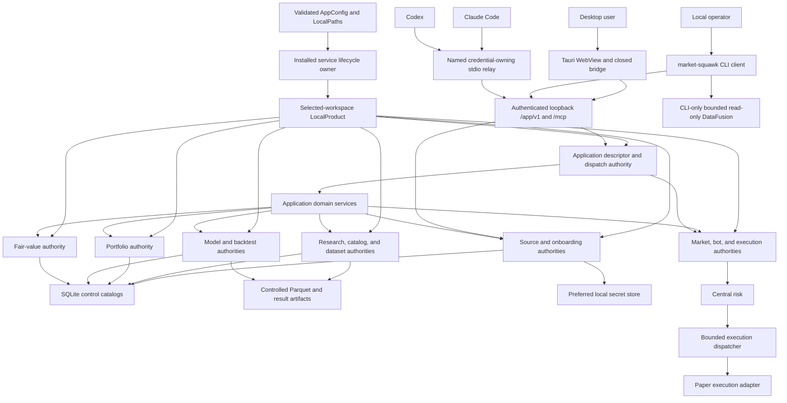
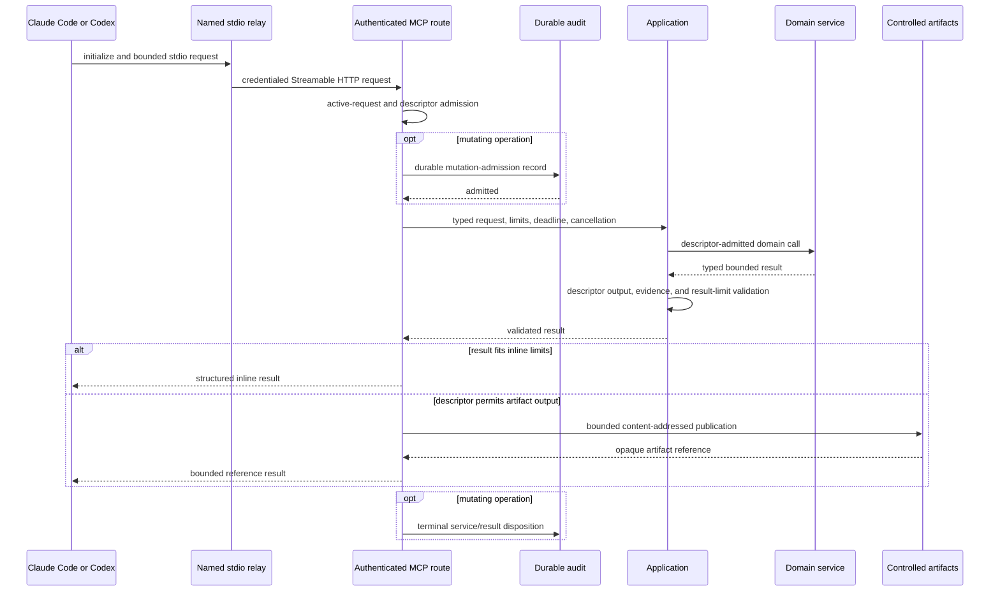
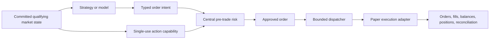

# Local control plane

Market Squawk's local control plane composes product authorities once in the per-user installed
service and exposes them through the Obsidian Signal Desktop, CLI, and named-client MCP relays.
`LocalProduct` owns the selected-workspace capabilities; `Application` is the transport-neutral
operation boundary shared by every presentation. Source admission, dataset authority, durable jobs,
model admission, central risk, and execution lifecycle remain product-owned regardless of client.

| Metadata | Value |
| --- | --- |
| Document type | Architecture |
| Audience | Maintainers, desktop/CLI/MCP authors, operators, security reviewers |
| Status | Current |
| Last substantive review | 2026-08-03 |

## Contents

- [Scope](#scope)
- [Composition](#composition)
- [Application contract](#application-contract)
- [Presentation request paths](#presentation-request-paths)
- [Local state and artifact authority](#local-state-and-artifact-authority)
- [Central risk and execution authority](#central-risk-and-execution-authority)
- [Cancellation and lifecycle](#cancellation-and-lifecycle)
- [Failure and recovery](#failure-and-recovery)
- [Security and trust boundaries](#security-and-trust-boundaries)
- [Related documentation and code](#related-documentation-and-code)
- [External sources](#external-sources)

## Scope

The control plane owns:

- construction and lifecycle of one per-user service, its selected workspace, and product capabilities;
- the closed, typed application operation registry;
- desktop bootstrap, a typed application client, and provider-setup presentation boundary;
- CLI request admission and local operator workflows through the private application client;
- authenticated Streamable HTTP MCP initialization, tool discovery/calls, framing, cancellation,
  result rendering, named-client relay, and shutdown;
- SQLite catalog/control state, source activation state, secrets, and controlled artifacts;
- durable service/MCP audit and bounded mutation admission;
- cancellation, deadlines, result limits, and reverse-order shutdown;
- central risk and the sole dispatch route into paper execution.

It does not process a market event inside SQLite, a desktop WebView, MCP, or the CLI. It also does
not turn presentation access into financial authority: a well-formed command still has to satisfy
the product-domain contract and all applicable confirmation, rights, evidence, risk, and lifecycle
gates.

## Composition

`InstalledService::start` selects and fences one active workspace, opens hardened local paths, and
builds source, research, portfolio, analysis/backtest, model, fair-value, paper, jobs, operations,
and audit authorities. It composes exactly one `Application` from the required domain services,
binds private `/app/v1` and authenticated `/mcp` routes, probes readiness, then publishes the
owner-only rendezvous. Desktop and CLI use separate native credentials to call `/app/v1`; Claude
Code and Codex each use a distinct credential through their own stateless stdio relay to `/mcp`.

The service owns bounded producer/admission workflows requiring stronger local capabilities:
provider activation, controlled file ingestion, point-in-time dataset publication, model admission,
portfolio import, and governed backtest registration. CLI requests those workflows through the
service; they are not duplicate implementations. General read-only DataFusion SQL remains an
explicit CLI-only operator path. The Desktop bridge uses the private application client for generic
requests and delegates confirmed provider setup to the service's source/onboarding authorities.

## Application contract

The installed service exposes an immutable typed application capability registry across the core
financial domains and installed-product domains, including durable job, setup, workspace, backup,
update, logs, and settings operations:

| Domain | Responsibility |
| --- | --- |
| `Source` | Registration, onboarding/setup, coverage, status, and health |
| `Market` | Bounded snapshots, trades, quotes, books, quality, and comparisons |
| `Research` | Ingestion, dataset manifests, and bounded history |
| `Fundamental` | Filings, statements, facts, and ratios |
| `Macro` | Series, observations, and vintages |
| `Portfolio` | Imports, holdings, transactions, performance, exposure, and risk |
| `Analysis` | Returns, factors, valuation, scenarios, features, and governed backtests |
| `Model` | Bundle metadata, evaluation, and predictions |
| `FairValue` | Measurements, classification, evidence, access assessments, and approval |
| `Bot` | Status, kill switch, and controlled paper-operation lifecycle |
| `Execution` | Orders, fills, cancellation, and reconciliation |
| `Job` and installed operations | Durable work plus setup, workspace, backup, update, logs, and typed settings |

Every descriptor defines a version, closed input schema, operation-specific structured-output
schema, domain, effects, authorization/confirmation policy, source-evidence policy, scope, result
bounds, and artifact policy. `Application` admits an operation only through its exact descriptor,
dispatches it to the one service owning that domain, and validates the typed result against the
request limits, source-evidence policy, and output schema before returning it.

Eligible application descriptors are mapped into MCP tools with their complete `inputSchema`,
`outputSchema`, effect annotations, and bounded contract metadata; the service does not maintain a
separate handwritten tool catalog. The capability check proves the complete `tools/list` response
fits the configured frame before the MCP route is published. Desktop and CLI request paths use the
same application admission through `/app/v1`, while explicit local producer and provider-setup
workflows retain their stronger, narrower capabilities. This prevents schema and authorization drift
between presentations.

## Presentation request paths

### Shared application request

Each native application request resolves the current authenticated rendezvous and constructs a
request context with installation, service-generation, workspace, client, request/correlation
identity, cancellation, absolute deadline, and result limits. The runtime rejects stale
generations, replayed mutations, invalid payloads, and unauthorized clients before the application
validates the operation and arguments. Domain services return transport-neutral typed results rather
than writing directly to a presentation.

### Desktop request

The desktop WebView validates bootstrap and result payloads at its Zod boundary. Its Rust bridge
holds the Desktop credential, calls the private application route, applies fixed request and result
ceilings plus a deadline, and returns redacted typed failures. The WebView never receives the
service token or direct network authority. Provider setup uses a separate tagged command with
explicit confirmation and the durable onboarding/activation authorities. The system browser
receives only an exact code-owned official-provider URL or a validated loopback portal URL.

### MCP request

The service exposes MCP through its authenticated loopback Streamable HTTP route. The named
`market-squawk mcp serve --client` process uses inherited stdin/stdout only as a stateless
compatibility relay. It reads the named client's credential through native secret authority, adapts
one bounded request to the endpoint, and exits without affecting the shared service. Stdio locality
does not authenticate the client; service credential, Origin/Host, protocol, request metadata,
limits, and audit policy do.

Frame and JSON structure, concurrent requests, channel items/bytes, inline items/bytes, total result
items/bytes, artifact size, request duration, write duration, and shutdown duration all have
process-owned ceilings. A cancellation notification reaches the request's child token and the
domain operation; a late cancellation is handled as a race rather than permitting request identity
reuse.

The MCP artifact repository writes only beneath its controlled namespace, uses content-derived
identity and atomic publication, and returns an opaque reference instead of a local path. The
shipping composition caps one MCP artifact at 64 MiB.

### CLI-only SQL

`market-squawk query sql` resolves one immutable dataset generation and calls the bounded read-only
DataFusion service. This path accepts a single validated read-only statement against the fixed
dataset relation. It is intentionally not one of the 62 application/MCP operations.

## Local state and artifact authority

SQLite and the artifact root have different responsibilities:

| Authority | Owns | Does not establish by itself |
| --- | --- | --- |
| SQLite control stores | Source registration and rights, reservations, runs, artifact records, manifests, lineage, and model/portfolio/fair-value control state | Parquet object contents or live market freshness |
| Controlled artifact root | Content-addressed Parquet datasets, query/model artifacts, and bounded MCP large results | Dataset publication, source rights, or operation approval |
| Source authority store | Durable source generation, activation, coverage, and health identities | Execution eligibility without qualifying live evidence |
| Preferred secret store | Provider credentials referenced by onboarding/activation services | Provider registration, coverage, or request authorization |
| MCP audit | Request/session evidence and durable mutation admission/outcome records | Domain success when the domain transaction failed |

The catalog is opened at the local control path with an exclusive writer authority and explicit
busy/result limits. Artifact references are confined beneath pre-opened local roots. Dataset readers
require catalog/manifest authority plus verified object content; neither directory enumeration nor
an unreferenced file creates a dataset.

SQLite is outside the live event-to-action path. Live state uses instrument-owned memory and bounded
queues; catalog updates, audits, artifacts, reports, and research publication occur on control or
research paths.

## Central risk and execution authority

Every order submission follows this authority chain:

Bot commands control lifecycle and observe status; execution commands query/cancel/reconcile through
the owned execution services. They do not receive an execution adapter handle. Strategies and
models emit intents only. Central risk alone can create an approved order, and the dispatcher alone
can call the adapter. Data quality, freshness, account/instrument eligibility, notional, exposure,
leverage, position, rate, duplication, slippage, loss, drawdown, and expiration policies remain in
force regardless of which transport initiated the surrounding operation.

## Cancellation and lifecycle

`LocalProduct` is the lifecycle owner of its domain capabilities. `Application` closes request
admission atomically and begins domain shutdown in reverse dependency order. Completion uses one
absolute deadline; each domain receives its terminal barrier even when another domain reports a
failure, and the resulting report retains per-domain evidence.

For the installed service and its MCP route:

1. platform termination listeners are installed before product composition so Unix
   `SIGINT`/`SIGTERM` and Windows console termination events cannot bypass the async drain after
   startup admission;
2. session cancellation closes bounded ingress and propagates child cancellation tokens;
3. route/runtime tasks stop under configured deadlines;
4. durable jobs stop at their declared fence and the application begins reverse-order shutdown and
   reconciliation;
5. durable audit records are flushed and the rendezvous is retired; and
6. the service returns a controlled exit only after route, job, audit, and application outcomes
   have been combined.

Dropped application ownership invokes fail-safe admission closure. This is not a substitute for
normal asynchronous drain, but it prevents a partially torn-down composition from accepting new
work.

## Failure and recovery

| Failure | Immediate consequence | Recovery |
| --- | --- | --- |
| Mandatory domain missing, duplicated, or misplaced | `Application` composition fails before desktop/CLI/MCP publication | Correct composition; all 11 domains are mandatory |
| Unknown operation or invalid closed-schema argument | Request is rejected before domain dispatch | Correct the command/tool input |
| Domain service rejects an actionable tool call | MCP returns a bounded `isError: true` tool result and audits `service_rejected` | Correct the request or restore the named domain authority, then retry with a new request identity |
| Request cancelled or deadline elapsed | Domain sees cancellation; late output is not admitted as a successful result | Issue a new request with a new identity |
| Result violates its output schema or exceeds descriptor/request limits | Invalid output fails as a protocol/server error; valid overflow is published only when the descriptor permits a bounded artifact | Correct the service contract defect, narrow the request, or retrieve the returned valid artifact reference |
| MCP frame, JSON, concurrency, or queue limit exceeded | Session/request fails closed without unbounded buffering | Correct the client or restart a fresh bounded session |
| Durable mutation-audit admission fails | Mutation does not reach the application service | Repair private local audit storage, then retry explicitly |
| Controlled artifact publication fails | No artifact reference is returned | Repair local storage and repeat the read-only operation if safe |
| SQLite busy, integrity, or authority mismatch | Owning domain operation fails; live path continues independently | Reconcile catalog/root authority and retry through the service |
| Domain service failure | Typed failure returns; other domains retain their own state | Use the domain's reconciliation or recovery operation |
| Paper adapter/dispatcher uncertainty | New execution is constrained and reconciliation owns truth | Run execution reconciliation before further lifecycle changes |
| Shutdown deadline missed | Report identifies incomplete domains; success is not claimed | Inspect local logs/state, reconcile, then restart |

## Security and trust boundaries

- Local paths are converted into narrow catalog, input-root, artifact-root, and control-root
  capabilities before services receive them.
- Secrets remain behind the local secret-store interface and are not returned through application
  results, CLI output, MCP tools, or audit records.
- MCP tool annotations do not replace server-side descriptor admission, confirmation policy, or
  domain authorization.
- Named stdio relay locality is not treated as user authentication; the service authenticates its
  separately scoped client credential and request metadata before dispatch.
- Mutating MCP operations require durable admission evidence before domain execution and a bounded
  terminal disposition.
- CLI file-based producer workflows validate an explicitly authorized input root, regular-file
  identity, size, content, confirmation, and, where applicable, signatures/evidence before
  publication.
- Read-only DataFusion SQL is confined to the CLI and one immutable dataset relation.
- The desktop, CLI, and MCP relays remain outside the live event-to-action path; execution-related
  operations retain central risk and dispatcher-owned adapter authority.

## Related documentation and code

Architecture:

- [Architecture overview](overview.md)
- [Building blocks](building-blocks.md)
- [Live execution plane](live-execution-plane.md)
- [Research data plane](research-data-plane.md)
- [Security and trust boundaries](security-and-trust-boundaries.md)
- [Deployment](deployment.md)
- [Quality attributes](quality-attributes.md)
- [ADR 0004: Local analytical storage stack](decisions/0004-local-analytical-storage-stack.md)
- [ADR 0005: Central risk and execution authority](decisions/0005-central-risk-and-execution-authority.md)

Current implementation anchors:

- [Desktop composition root](../../apps/market-squawk-desktop/src-tauri/src/lib.rs)
- [Desktop presentation bridge](../../apps/market-squawk-desktop/src-tauri/src/bridge.rs)
- [Desktop main-window capability](../../apps/market-squawk-desktop/src-tauri/capabilities/main.json)
- [Local product composition](../../apps/market-squawk/src/local_product/mod.rs)
- [Transport-neutral application](../../apps/market-squawk/src/application.rs)
- [Closed operation descriptors](../../apps/market-squawk/src/application/contracts.rs)
- [CLI transport](../../apps/market-squawk/src/local_product/cli_transport.rs)
- [CLI-only DataFusion query path](../../apps/market-squawk/src/local_product/cli_transport/query.rs)
- [Shipping MCP composition](../../apps/market-squawk/src/mcp.rs)
- [Hardened MCP server](../../crates/market-squawk-mcp/src/server.rs)
- [Durable MCP audit](../../apps/market-squawk/src/mcp/audit.rs)
- [Controlled artifact repository](../../apps/market-squawk/src/artifact_repository.rs)
- [Catalog path authority](../../crates/market-squawk-platform/src/paths/catalog.rs)
- [Central risk service](../../crates/market-squawk-execution/src/risk.rs)
- [Bounded execution dispatcher](../../crates/market-squawk-execution/src/dispatcher.rs)

Operations and reference:

- [Installation and bootstrap](../operations/installation-and-bootstrap.md)
- [Configuration and secrets](../operations/configuration-and-secrets.md)
- [Backup and recovery](../operations/backup-and-recovery.md)
- [Troubleshooting](../operations/troubleshooting.md)
- [CLI reference](../reference/cli.md)
- [Configuration reference](../reference/configuration.md)
- [MCP reference](../reference/mcp.md)
- [Project memory and delivery invariants](../project-memory.md)
- [Delivery ledger](../plans/delivery-ledger.md)

## External sources

These sources define dependency/protocol semantics; the reviewed code remains authoritative for
Market Squawk behavior.

| Source | Architectural use | Reviewed |
| --- | --- | --- |
| [MCP 2026-07-28 base protocol](https://modelcontextprotocol.io/specification/2026-07-28/basic) | Initialization, capability negotiation, operation, timeout, and request metadata semantics selected by the service facade | 2026-08-03 |
| [MCP Streamable HTTP transport](https://modelcontextprotocol.io/specification/2026-07-28/basic/transports/streamable-http) | Stateless endpoint, Host/Origin validation, POST handling, and bounded response transport | 2026-08-03 |
| [MCP tools](https://modelcontextprotocol.io/specification/2026-07-28/server/tools) | Tool discovery, input/output schema, structured results, tool errors, and security requirements | 2026-08-03 |
| [SQLite transaction documentation](https://www.sqlite.org/lang_transaction.html) | Transaction boundaries and single-writer behavior for local catalog state | 2026-07-23 |
| [Tauri capabilities](https://v2.tauri.app/security/capabilities/) | Window-scoped permission composition for the desktop presentation bridge | 2026-07-28 |
