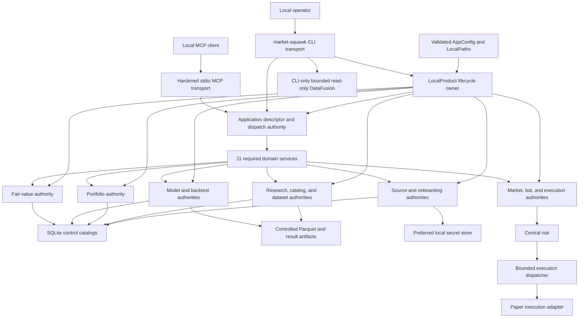
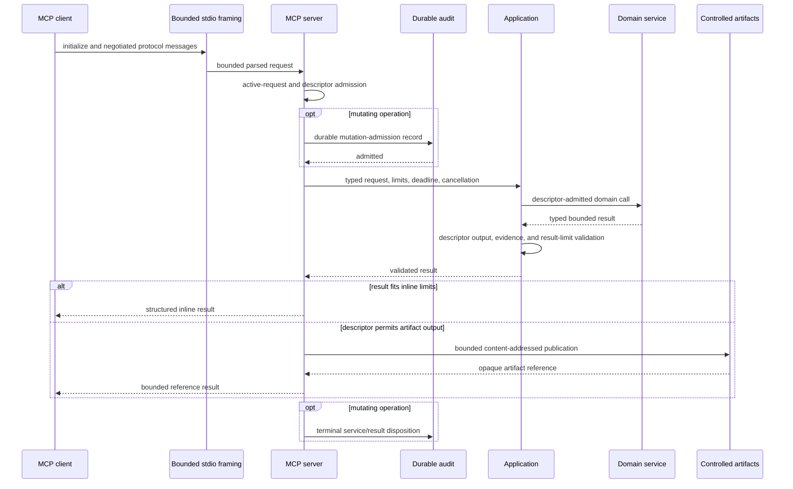
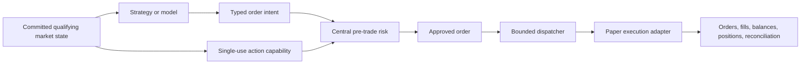

# Local control plane

Market Squawk's local control plane composes product authorities once and exposes them through the
CLI and local stdio MCP. `LocalProduct` owns the local capabilities; `Application` is the
transport-neutral operation boundary shared by both transports. Source admission, dataset
authority, model admission, central risk, and execution lifecycle remain product-owned regardless
of transport.

| Metadata | Value |
| --- | --- |
| Document type | Architecture |
| Audience | Maintainers, CLI and MCP authors, operators, security reviewers |
| Status | Current |
| Last substantive review | 2026-07-26 |
| Reviewed commit | `93f79a830765781242ce824e0db84f38d04c0b63` |

## Contents

- [Scope](#scope)
- [Composition](#composition)
- [Application contract](#application-contract)
- [CLI and MCP request paths](#cli-and-mcp-request-paths)
- [Local state and artifact authority](#local-state-and-artifact-authority)
- [Central risk and execution authority](#central-risk-and-execution-authority)
- [Cancellation and lifecycle](#cancellation-and-lifecycle)
- [Failure and recovery](#failure-and-recovery)
- [Security and trust boundaries](#security-and-trust-boundaries)
- [Related documentation and code](#related-documentation-and-code)
- [External sources](#external-sources)

## Scope

The control plane owns:

- construction and lifecycle of local product services and their capabilities;
- the closed, typed application operation registry;
- CLI request admission and local operator workflows;
- MCP initialization, tool discovery/calls, framing, cancellation, result rendering, and shutdown;
- SQLite catalog/control state, source activation state, secrets, and controlled artifacts;
- durable MCP audit and bounded mutation admission;
- cancellation, deadlines, result limits, and reverse-order shutdown;
- central risk and the sole dispatch route into paper execution.

It does not process a market event inside SQLite, MCP, or the CLI. It also does not turn transport
access into financial authority: a well-formed command still has to satisfy the product-domain
contract and all applicable confirmation, rights, evidence, risk, and lifecycle gates.

## Composition

`LocalProduct::try_new` opens the hardened local paths and builds the source, research, portfolio,
analysis/backtest, model, fair-value, and paper authorities. It then composes exactly one
`Application` from all required domain services. The CLI borrows this product composition. The MCP
composition receives an `Arc<Application>` plus the same controlled path capabilities for its
audit and large-result repository.

The CLI-to-`LocalProduct` edge represents bounded producer/admission workflows that need explicit
local capabilities: provider activation, controlled file ingestion, point-in-time dataset
publication, model admission, portfolio import, and governed backtest registration. These
workflows still call the same owned domain authorities; they are not duplicate service
implementations. General read-only DataFusion SQL is likewise an explicit CLI-only operator path.

## Application contract

At the reviewed implementation, the immutable application capability registry contains **62 typed
operation descriptors** across exactly 11 required domains:

| Domain | Responsibility |
| --- | --- |
| `Source` | Registration, onboarding/setup, coverage, status, and health |
| `Market` | Bounded snapshots, trades, quotes, books, quality, and comparisons |
| `Research` | Ingestion, dataset manifests, and bounded history |
| `Fundamental` | Filings, statements, facts, and ratios |
| `Macro` | Series, observations, and vintages |
| `Portfolio` | Imports, holdings, transactions, performance, exposure, and risk |
| `Analysis` | Returns, factors, valuation, scenarios, features, and governed backtests |
| `Model` | Bundle metadata, evaluation, and predictions |
| `FairValue` | Measurements, classification, evidence, access assessments, and approval |
| `Bot` | Status, kill switch, and controlled paper-operation lifecycle |
| `Execution` | Orders, fills, cancellation, and reconciliation |

Every descriptor defines a version, closed input schema, operation-specific structured-output
schema, domain, effects, authorization/confirmation policy, source-evidence policy, scope, result
bounds, and artifact policy. `Application` admits an operation only through its exact descriptor,
dispatches it to the one service owning that domain, and validates the typed result against the
request limits, source-evidence policy, and output schema before returning it.

All 62 application descriptors are mapped into MCP tools with their complete `inputSchema`,
`outputSchema`, effect annotations, task prohibition, and bounded contract metadata; the server does
not maintain a separate handwritten tool catalog. The pure MCP capability check performs that exact
conversion and proves the complete `tools/list` response fits the configured frame before a server
can be published. CLI commands representing application operations call
`Application::invoke` with the same descriptor admission. This prevents schema and authorization
drift between transports while allowing the explicit local producer workflows described above to
retain their stronger path, file, signing, or publication capabilities.

## CLI and MCP request paths

### Shared application request

Both transports construct a `RequestContext` with a request identity, cancellation token, absolute
deadline, and result limits. The application validates the operation and arguments before a domain
service sees them. Domain services return transport-neutral typed results rather than writing
directly to a terminal or protocol stream.

### MCP request

The shipping MCP process uses inherited stdin/stdout and the MCP initialization lifecycle. Inherited
stdio establishes a local process transport but does not authenticate the peer; the session records
that identity class rather than claiming more trust.

Frame and JSON structure, concurrent requests, channel items/bytes, inline items/bytes, total result
items/bytes, artifact size, request duration, write duration, and shutdown duration all have
process-owned ceilings. A cancellation notification reaches the request's child token and the
domain operation; a late cancellation is handled as a race rather than permitting request identity
reuse.

The MCP artifact repository writes only beneath its controlled namespace, uses content-derived
identity and atomic publication, and returns an opaque reference instead of a local path. The
shipping composition caps one MCP artifact at 64 MiB.

### CLI-only SQL

`market-squawk query sql` resolves one immutable dataset generation and calls the bounded read-only
DataFusion service. This path accepts a single validated read-only statement against the fixed
dataset relation. It is intentionally not one of the 62 application/MCP operations.

## Local state and artifact authority

SQLite and the artifact root have different responsibilities:

| Authority | Owns | Does not establish by itself |
| --- | --- | --- |
| SQLite control stores | Source registration and rights, reservations, runs, artifact records, manifests, lineage, and model/portfolio/fair-value control state | Parquet object contents or live market freshness |
| Controlled artifact root | Content-addressed Parquet datasets, query/model artifacts, and bounded MCP large results | Dataset publication, source rights, or operation approval |
| Source authority store | Durable source generation, activation, coverage, and health identities | Execution eligibility without qualifying live evidence |
| Preferred secret store | Provider credentials referenced by onboarding/activation services | Provider registration, coverage, or request authorization |
| MCP audit | Request/session evidence and durable mutation admission/outcome records | Domain success when the domain transaction failed |

The catalog is opened at the local control path with an exclusive writer authority and explicit
busy/result limits. Artifact references are confined beneath pre-opened local roots. Dataset readers
require catalog/manifest authority plus verified object content; neither directory enumeration nor
an unreferenced file creates a dataset.

SQLite is outside the live event-to-action path. Live state uses instrument-owned memory and bounded
queues; catalog updates, audits, artifacts, reports, and research publication occur on control or
research paths.

## Central risk and execution authority

Every order submission follows this authority chain:

Bot commands control lifecycle and observe status; execution commands query/cancel/reconcile through
the owned execution services. They do not receive an execution adapter handle. Strategies and
models emit intents only. Central risk alone can create an approved order, and the dispatcher alone
can call the adapter. Data quality, freshness, account/instrument eligibility, notional, exposure,
leverage, position, rate, duplication, slippage, loss, drawdown, and expiration policies remain in
force regardless of which transport initiated the surrounding operation.

## Cancellation and lifecycle

`LocalProduct` is the lifecycle owner of its domain capabilities. `Application` closes request
admission atomically and begins domain shutdown in reverse dependency order. Completion uses one
absolute deadline; each domain receives its terminal barrier even when another domain reports a
failure, and the resulting report retains per-domain evidence.

For MCP:

1. session cancellation closes bounded ingress and propagates child cancellation tokens;
2. protocol/runtime tasks stop under configured deadlines;
3. the application begins reverse-order shutdown and reconciliation;
4. durable audit records are flushed;
5. the process returns a controlled exit only after server, audit, and application outcomes have
   been combined.

Dropped application ownership invokes fail-safe admission closure. This is not a substitute for
normal asynchronous drain, but it prevents a partially torn-down composition from accepting new
work.

## Failure and recovery

| Failure | Immediate consequence | Recovery |
| --- | --- | --- |
| Mandatory domain missing, duplicated, or misplaced | `Application` composition fails before CLI/MCP service publication | Correct composition; all 11 domains are mandatory |
| Unknown operation or invalid closed-schema argument | Request is rejected before domain dispatch | Correct the command/tool input |
| Domain service rejects an actionable tool call | MCP returns a bounded `isError: true` tool result and audits `service_rejected` | Correct the request or restore the named domain authority, then retry with a new request identity |
| Request cancelled or deadline elapsed | Domain sees cancellation; late output is not admitted as a successful result | Issue a new request with a new identity |
| Result violates its output schema or exceeds descriptor/request limits | Invalid output fails as a protocol/server error; valid overflow is published only when the descriptor permits a bounded artifact | Correct the service contract defect, narrow the request, or retrieve the returned valid artifact reference |
| MCP frame, JSON, concurrency, or queue limit exceeded | Session/request fails closed without unbounded buffering | Correct the client or restart a fresh bounded session |
| Durable mutation-audit admission fails | Mutation does not reach the application service | Repair private local audit storage, then retry explicitly |
| Controlled artifact publication fails | No artifact reference is returned | Repair local storage and repeat the read-only operation if safe |
| SQLite busy, integrity, or authority mismatch | Owning domain operation fails; live path continues independently | Reconcile catalog/root authority and retry through the service |
| Domain service failure | Typed failure returns; other domains retain their own state | Use the domain's reconciliation or recovery operation |
| Paper adapter/dispatcher uncertainty | New execution is constrained and reconciliation owns truth | Run execution reconciliation before further lifecycle changes |
| Shutdown deadline missed | Report identifies incomplete domains; success is not claimed | Inspect local logs/state, reconcile, then restart |

## Security and trust boundaries

- Local paths are converted into narrow catalog, input-root, artifact-root, and control-root
  capabilities before services receive them.
- Secrets remain behind the local secret-store interface and are not returned through application
  results, CLI output, MCP tools, or audit records.
- MCP tool annotations do not replace server-side descriptor admission, confirmation policy, or
  domain authorization.
- Inherited stdio is recorded as an unverified local-process identity; transport locality is not
  treated as user authentication.
- Mutating MCP operations require durable admission evidence before domain execution and a bounded
  terminal disposition.
- CLI file-based producer workflows validate an explicitly authorized input root, regular-file
  identity, size, content, confirmation, and, where applicable, signatures/evidence before
  publication.
- Read-only DataFusion SQL is confined to the CLI and one immutable dataset relation.
- Neither CLI nor MCP is present in the live event-to-action path; execution-related operations
  retain central risk and dispatcher-owned adapter authority.

## Related documentation and code

Architecture:

- [Architecture overview](overview.md)
- [Building blocks](building-blocks.md)
- [Live execution plane](live-execution-plane.md)
- [Research data plane](research-data-plane.md)
- [Security and trust boundaries](security-and-trust-boundaries.md)
- [Deployment](deployment.md)
- [Quality attributes](quality-attributes.md)
- [ADR 0004: Local analytical storage stack](decisions/0004-local-analytical-storage-stack.md)
- [ADR 0005: Central risk and execution authority](decisions/0005-central-risk-and-execution-authority.md)

Current implementation anchors:

- [Local product composition](../../apps/market-squawk/src/local_product/mod.rs)
- [Transport-neutral application](../../apps/market-squawk/src/application.rs)
- [Closed operation descriptors](../../apps/market-squawk/src/application/contracts.rs)
- [CLI transport](../../apps/market-squawk/src/local_product/cli_transport.rs)
- [CLI-only DataFusion query path](../../apps/market-squawk/src/local_product/cli_transport/query.rs)
- [Shipping MCP composition](../../apps/market-squawk/src/mcp.rs)
- [Hardened MCP server](../../crates/market-squawk-mcp/src/server.rs)
- [Durable MCP audit](../../apps/market-squawk/src/mcp/audit.rs)
- [Controlled MCP artifact repository](../../apps/market-squawk/src/mcp/artifact.rs)
- [Catalog path authority](../../crates/market-squawk-platform/src/paths/catalog.rs)
- [Central risk service](../../crates/market-squawk-execution/src/risk.rs)
- [Bounded execution dispatcher](../../crates/market-squawk-execution/src/dispatcher.rs)

Operations and reference:

- [Installation and bootstrap](../operations/installation-and-bootstrap.md)
- [Configuration and secrets](../operations/configuration-and-secrets.md)
- [Backup and recovery](../operations/backup-and-recovery.md)
- [Troubleshooting](../operations/troubleshooting.md)
- [CLI reference](../reference/cli.md)
- [Configuration reference](../reference/configuration.md)
- [MCP reference](../reference/mcp.md)
- [Project memory and delivery invariants](../project-memory.md)
- [Delivery ledger](../plans/delivery-ledger.md)

## External sources

These sources define dependency/protocol semantics; the reviewed code remains authoritative for
Market Squawk behavior.

| Source | Architectural use | Reviewed |
| --- | --- | --- |
| [MCP 2025-11-25 lifecycle](https://modelcontextprotocol.io/specification/2025-11-25/basic/lifecycle) | Initialization, capability negotiation, operation, timeout, and stdio shutdown semantics | 2026-07-23 |
| [MCP 2025-11-25 tools](https://modelcontextprotocol.io/specification/2025-11-25/server/tools) | Tool discovery, input/output schema, structured results, tool errors, and security requirements | 2026-07-26 |
| [MCP 2025-11-25 schema](https://modelcontextprotocol.io/specification/2025-11-25/schema) | Exact `Tool.outputSchema`, `CallToolResult.structuredContent`, and `CallToolResult.isError` wire contracts | 2026-07-26 |
| [MCP 2025-11-25 cancellation](https://modelcontextprotocol.io/specification/2025-11-25/basic/utilities/cancellation) | Request-identity cancellation and late-cancellation race semantics | 2026-07-23 |
| [SQLite transaction documentation](https://www.sqlite.org/lang_transaction.html) | Transaction boundaries and single-writer behavior for local catalog state | 2026-07-23 |
