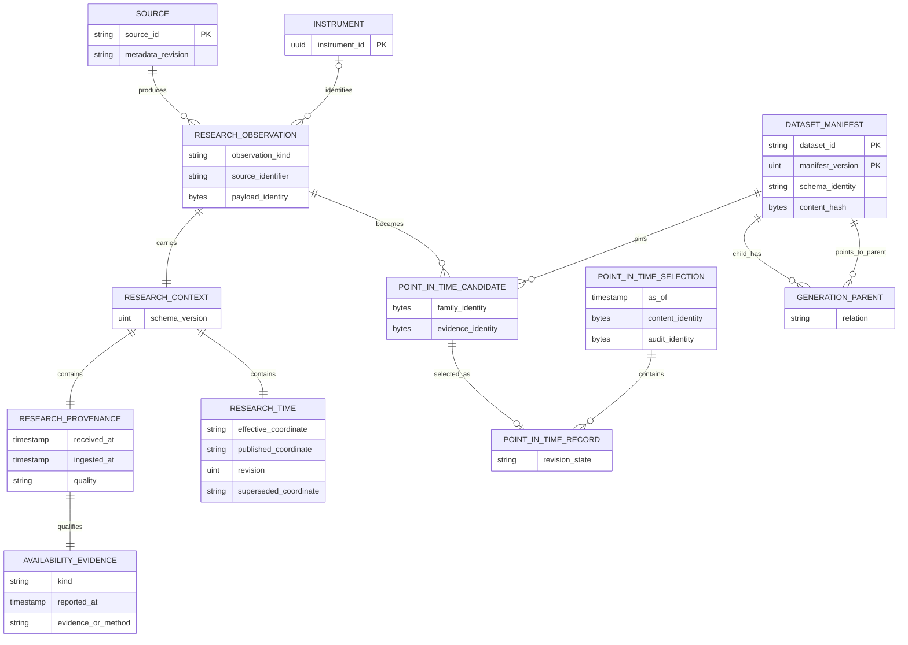

# Data, Time, and Provenance

Market Squawk keeps identity, observation time, knowledge time, revision state, and dataset lineage
separate so a research result can be reproduced without admitting information that was unavailable
at the decision cutoff. This page explains the current canonical contracts and the conservative
point-in-time policy implemented at the reviewed source head.

| Field | Value |
| --- | --- |
| Document type | Architecture explanation |
| Audience | Research engineers, model authors, portfolio analysts, reviewers, and maintainers |
| Status | Current |
| Last substantive review | 2026-07-23 |
| Reviewed commit | `836aae662dfbbc3cf40e94e6da6c5c37cd3b57bd` |

## Contents

- [Scope and non-goals](#scope-and-non-goals)
- [Identity and evidence](#identity-and-evidence)
- [Time model](#time-model)
- [Point-in-time selection](#point-in-time-selection)
- [Point-in-time sequence](#point-in-time-sequence)
- [Provenance and lineage relationships](#provenance-and-lineage-relationships)
- [Invariants and failure consequences](#invariants-and-failure-consequences)
- [Recovery and reproducibility](#recovery-and-reproducibility)
- [Security and authority](#security-and-authority)
- [Related documentation and code](#related-documentation-and-code)
- [External sources](#external-sources)

## Scope and non-goals

This page covers canonical live and research provenance, research temporal coordinates, availability
evidence, revision and supersession, immutable dataset-generation identity, and point-in-time
selection. It also explains how those records preserve the source-to-result lineage needed by
analytics, modeling, backtesting, portfolio analysis, and fair-value work.

It does not:

- claim that a source timestamp proves when information became knowable;
- coerce a calendar date or provider period into an invented UTC instant;
- require historical datasets to originate from, mirror, or replay the live feed;
- make a directory listing, filename, or mutable provider URL a dataset identity;
- turn archival provenance into current live execution authority; or
- define operating commands, CLI schemas, or mutable release status.

## Identity and evidence

Internal identity is independent of provider notation. `InstrumentId` remains stable while
provider identifiers, venue symbols, effective intervals, corporate actions, contract rolls, and
source-specific records change. A canonical observation names its source and source-native
identifier and, when applicable, its internal instrument and venue.

Evidence identity is explicit:

- payload evidence retains an algorithm-qualified digest or a clearly identified opaque source
  reference;
- live evidence additionally binds source, venue, instrument, connection generation, provider
  product/channel, event class, and canonical state;
- research candidates retain the exact source `DatasetManifestRef`, including dataset, generation,
  schema name/version/fingerprint, and content hash; and
- derived analytical generations retain typed parent edges to exact immutable input generations.

The source locator answers where bytes were obtained. The content digest answers which bytes were
used. The manifest reference answers which admitted analytical generation supplied a row. None is
silently substituted for another.

Live and research provenance are deliberately different:

| Contract | Purpose | Authority limit |
| --- | --- | --- |
| `LiveProvenance` | Archive-safe source, binding, timestamps, coverage, quality, and payload evidence | Always reports archive-facing execution eligibility as `Ineligible`; current requalification is mandatory |
| `ResearchProvenance` | Source identity, receive/ingest time, quality, payload evidence, and explicit availability evidence | Supports research admission only; it cannot mint live authority |
| `ResearchTime` | Effective/reference coordinate, optional publication coordinate, one-based revision, and optional supersession coordinate | Preserves source precision and refuses incomparable temporal claims |
| `DatasetManifestRef` | Exact immutable analytical generation and schema identity | Must be resolved through the closed local schema/catalog authority before use |

## Time model

Market Squawk does not collapse all time fields into an ambiguous `timestamp`. Each coordinate
answers a different question.

| Coordinate | Question answered | Point-in-time meaning |
| --- | --- | --- |
| Effective or reference | What economic date, instant, or provider period does the observation describe? | Constrains the feature, label, reporting, or measurement window; it does not prove knowledge |
| Published | When did the source identify the release or revision as published? | A known exact publication after `as_of` is excluded; publication alone does not prove local availability |
| Available | When does source or audit evidence establish that the information was usable by a consumer? | `Evidenced` availability is admitted when it is at or before `as_of` |
| Local first observed | When did this installation first obtain the object when earlier availability cannot be proved? | A conservative local lower bound admitted as availability for this installation |
| Received | When did the source payload reach the local process? | Transport provenance; it is not automatically the provider's publication time |
| Ingested | When did the canonical record enter local research storage? | Must not precede received or reported availability; it is not used to backdate knowledge |
| Revision | Which one-based source revision is this within its natural observation family? | Selects or labels a knowable revision; it is an identity, not a clock |
| Superseded | When did this revision cease to be current under the source's revision semantics? | Affects `LatestKnown` only when supersession is knowable at the cutoff |

Effective, published, and superseded values use `ResearchTemporalCoordinate`. The coordinate keeps
one of three precisions:

- an exact UTC timestamp;
- a civil calendar date with no fabricated time of day or zone; or
- a source-qualified named period with its original scheme, year, ordinal, and code.

Only coordinates with compatible precision are ordered. Provider periods additionally require the
same scheme. An incomparable predicate fails closed; it is not resolved by assuming midnight or by
lexically comparing provider codes.

Availability is a closed evidence type:

- `Evidenced` retains the time and source/audit evidence identity;
- `LocalFirstObserved` retains this installation's conservative first-observed time;
- `Inferred` retains a method and reported time for analysis but is not admitted by the default
  point-in-time policy; and
- `Unknown` records the absence of defensible historical availability.

For exact timestamps, canonical construction rejects availability before publication. Research
provenance also rejects received or reported availability after ingestion. Effective time is not
forced into this local-processing order because it commonly precedes publication by design.

## Point-in-time selection

One selection binds all of the following:

- a versioned closed policy;
- exact `as_of` knowledge time;
- optional publication cutoff;
- precision-preserving effective cutoff;
- optional label-window upper cutoff;
- count, conflict, result, and retained-byte limits;
- cancellation and a monotonic deadline; and
- candidates pinned to exact source manifest generations.

The conservative policy applies these rules:

1. `Evidenced` or `LocalFirstObserved` availability must be at or before `as_of`.
2. `Inferred` and `Unknown` availability are excluded by default.
3. A known exact publication time must not be after `as_of`; an explicit publication cutoff must
   be comparable and satisfied.
4. Feature observations must be effective at or before the effective cutoff. Label observations
   must fall strictly after the feature cutoff and at or before the label cutoff.
5. Incomparable publication, effective, or supersession coordinates are excluded rather than
   coerced.
6. `LatestKnown` removes revisions superseded by the knowledge cutoff and retains the highest
   remaining revision in each natural-identity family.
7. `AllKnown` retains every knowable revision and labels whether it is current, superseded, or
   incomparable under the supplied cutoffs.
8. Divergent payloads for the same natural family and revision produce a bounded conflict report
   and fail the selection. The selector never chooses one by iteration order.

The selector derives canonical family, payload, provenance, evidence, selected-content, and audit
identities. Exclusions and their reason counts remain inspectable, so a smaller result cannot be
mistaken for a complete universe.

## Point-in-time sequence

The diagram answers: how does a source observation become a result that was knowable at a stated
cutoff?

```mermaid
sequenceDiagram
    participant Provider as Provider or local source
    participant Adapter as Extraction adapter
    participant Normalize as Canonical normalizer
    participant Catalog as Catalog and publication authority
    participant Dataset as Immutable dataset generation
    participant Selector as Point-in-time selector
    participant Consumer as Research consumer

    Provider->>Adapter: Bounded source bytes and source metadata
    Adapter->>Normalize: Parsed record with exact source fields
    Normalize->>Normalize: Preserve effective, published, availability, revision, and supersession
    Normalize->>Catalog: Research observation, provenance, payload evidence
    Catalog->>Dataset: Publish schema-bound Arrow and Parquet generation
    Consumer->>Selector: as_of, temporal cutoffs, policy, limits, cancellation, deadline
    Selector->>Dataset: Read candidates pinned to exact manifest
    Dataset-->>Selector: Observations and source generation references
    loop Every bounded candidate
        Selector->>Selector: Check availability and publication against knowledge cutoff
        Selector->>Selector: Check effective or label window without precision coercion
        Selector->>Selector: Resolve revision and supersession within natural family
    end
    alt Divergent same-family revision
        Selector-->>Consumer: Bounded conflict report; no selection
    else Valid selection
        Selector-->>Consumer: Selected rows, exclusions, lineage, content identity, audit identity
    end
```

In prose: adapters parse bounded bytes but do not decide point-in-time eligibility. Normalization
preserves the source's separate temporal claims and availability evidence. Publication creates an
immutable, schema-bound dataset generation. A later consumer supplies an explicit knowledge cutoff
and temporal policy. The selector reads only the pinned generation, excludes unavailable or
incomparable records, resolves revisions deterministically, and returns either a conflict or a
fully identified result plus exclusions.

## Provenance and lineage relationships

The diagram answers: which identities bind a canonical observation to its selected and derived
analytical outputs?



In prose: a source produces a canonical observation, optionally for an instrument. The observation
carries a research context split into provenance and research time, and provenance owns explicit
availability evidence. A point-in-time candidate couples the observation to an exact dataset
manifest. A selection records only admitted candidates and binds its content and audit identities.
Derived manifests retain typed parent edges, allowing a consumer to traverse from an output
generation back to every exact input generation.

## Invariants and failure consequences

| Invariant | Failure consequence |
| --- | --- |
| Live archive records never carry a reusable authority token | A deserialized, replayed, or copied record remains execution-ineligible |
| Research availability is explicit and cannot be defaulted from effective or publication time | Missing evidence remains `Unknown` or `Inferred` and is excluded by conservative PIT selection |
| Source precision is preserved | Cross-precision predicates are incomparable and excluded |
| Revisions are positive and divergent same-revision payloads are conflicts | Selection fails with bounded conflict evidence instead of selecting nondeterministically |
| Every candidate names an exact source manifest | Unknown, altered, or unregistered schema/content identity is rejected |
| Derived outputs retain bounded exact parent edges | Incomplete or conflicting lineage prevents authoritative publication |
| Result work is count-, byte-, time-, and cancellation-bounded | Exhaustion returns a typed failure without a partial authoritative selection |
| Fair-value hierarchy, market depth, data quality, stream integrity, and execution authority are independent | No conversion or similarly named level can promote research or valuation evidence into live authority |

The five independent concepts in the final row answer different questions:

- fair-value hierarchy classifies valuation inputs under accounting rules;
- market depth describes top-of-book, price-level, or order-level granularity;
- data quality classifies observation evidence;
- stream integrity records live synchronization, freshness, gap, checksum, or quarantine state; and
- process-local execution authority is an opaque, current, single-use capability issued only by the
  live plane and consumed by central risk.

## Recovery and reproducibility

Recovery follows identity rather than filenames:

- SQLite catalog state is migrated and recovered before new analytical authority is issued.
- Parquet publication stages immutable objects and binds their hashes before catalog commit.
- Readers pin one manifest generation; they do not infer completeness from whichever files happen
  to exist.
- An exact idempotent replay of already published content returns the same logical generation;
  conflicting bytes at the same coordinate are rejected.
- Derived generation parents, point-in-time policy/cutoffs, selected-content identity, and audit
  identity are retained so a result can be reconstructed from the same admitted inputs.
- Unknown historical availability is not repaired by guessing. A later evidenced revision is a new
  evidence state, not a silent rewrite of the earlier record.

Recovery can restore durable research and audit state, but it cannot restore a live execution
capability. Live sources must establish a current session, capture, stream, freshness, and shard
state again after restart.

## Security and authority

Source bytes, timestamps, revision claims, and filenames are untrusted inputs. Adapters perform
bounded parsing; canonical constructors validate chronology, precision, identities, and evidence;
the catalog resolves closed schemas and immutable generations; and the point-in-time selector
applies the knowledge policy. Each transition can reduce or reject authority but cannot create
authority owned by another plane.

Payload and lineage digests provide content identity and tamper evidence, not signer identity by
themselves. Provider authorization, source rights, catalog publication, model admission,
fair-value approval, and live execution each require their own authority boundary.

## Related documentation and code

- [Research data plane](research-data-plane.md)
- [Live execution plane](live-execution-plane.md)
- [Security and trust boundaries](security-and-trust-boundaries.md)
- [Time and provenance reference](../reference/time-and-provenance.md)
- [Data-quality reference](../reference/data-quality.md)
- [ADR 0001: Separate live and research planes](decisions/0001-separate-live-and-research-planes.md)
- [ADR 0002: Evidence-derived execution quality](decisions/0002-evidence-derived-execution-quality.md)
- [Research provenance contracts](../../crates/market-squawk-domain/src/provenance/research.rs)
- [Archive-safe live provenance](../../crates/market-squawk-domain/src/provenance/live.rs)
- [Point-in-time policy and limits](../../crates/market-squawk-data/src/pit/model.rs)
- [Point-in-time selection](../../crates/market-squawk-data/src/pit/select.rs)
- [Dataset manifest and lineage identity](../../crates/market-squawk-data/src/manifest.rs)
- [Closed Arrow schema registry](../../crates/market-squawk-data/src/schema.rs)
- [Delivery ledger](../plans/delivery-ledger.md)

## External sources

These sources inform the representation and storage choices; current product behavior is defined by
the reviewed code above.

| Source | Relevance | Reviewed |
| --- | --- | --- |
| [W3C PROV-DM Recommendation](https://www.w3.org/TR/prov-dm/) | Separates entities, activities, derivations, revisions, responsibility, and provenance relationships | 2026-07-23 |
| [Apache Arrow columnar format](https://arrow.apache.org/docs/format/Columnar.html) | Defines the language-independent in-memory columnar representation and typed metadata model | 2026-07-23 |
| [Apache Parquet file format](https://parquet.apache.org/docs/file-format/) | Defines durable column chunks, row groups, and file metadata used by analytical generations | 2026-07-23 |
| [SQLite transaction documentation](https://www.sqlite.org/lang_transaction.html) | Defines the local transaction behavior used by catalog authority | 2026-07-23 |
