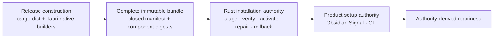

# 0006: Install Complete Versioned Release Bundles

Status: Accepted

Decision date: 2026-07-29

## Context

Market Squawk now has a permanent Tauri desktop, a complete CLI and stdio MCP server, native
capture and ONNX helpers, and a sealed Python analytics and training product. The existing Tauri
packages contain the desktop and three Rust executables, but they do not yet contain uv, managed
Python, the locked Python environment, an installation lifecycle, or a public stable release
surface. Source-build instructions are not a suitable beginner installation path.

No single reviewed tool owns the required combination of native packaging, sealed Python,
whole-bundle integrity, immutable activation, repair, rollback, data-preserving uninstall, guided
provider setup, and release evidence. Duplicating those responsibilities across shell, PowerShell,
Tauri configuration, and product code would create inconsistent installations and recovery paths.

## Decision

Market Squawk separates three authorities:

cargo-dist 0.32.0 coordinates the four native release targets and GitHub publication. Tauri builds
the signed native desktop packages. A repository-owned builder combines those outputs with the CLI,
capture helper, ONNX worker, model validator, training driver, Market Squawk installer, uv 0.12.0,
standard managed CPython 3.14.6, the exact locked Python environment, licenses, notices, and
metadata. One closed release manifest binds the repository, tag, commit, tree, target, archive, and
every component identity.

The Rust installer is the sole program-lifecycle authority. It downloads or accepts one complete
bundle, rejects unsafe or unlisted archive entries, verifies all sizes and SHA-256 identities,
stages into a controlled per-user root, and atomically changes one active-version selector only
after full admission. The active version and one prior known-good version remain immutable.
Repair, update, rollback, status, and data-preserving uninstall use the same manifest and store.

The public POSIX `install.sh` detects only the supported Unix target, downloads and verifies the
small Rust bootstrap, and transfers control to it. The script does not own extraction, Python,
provider setup, PATH policy, updates, rollback, or uninstall.

The Obsidian Signal desktop and CLI remain the product-setup authorities. They distinguish
installed software from provider activation and derive readiness from the existing Rust services.
Native packages and the curl path install the same complete capability set.

The V1 targets are:

- Ubuntu 24.04-compatible x64 Linux;
- Windows 10 version 1809 or newer on x64;
- macOS 12 or newer on Intel; and
- macOS 12 or newer on Apple Silicon.

Stable publication requires native platform signing/notarization where applicable, GitHub release
attestation, exact installed-product evidence on all four targets, and the unchanged release gate.
Unsigned pull-request artifacts remain verification inputs and cannot be presented as stable.

## Consequences

- Users can install without Rust, Node.js, pnpm, Python, uv, containers, cloud services, or paid
  subscriptions.
- Clickable DMG, NSIS/MSI, AppImage/DEB packages and the curl path converge on one complete product.
- A component cannot be upgraded independently into an unreviewed application/Python/helper mix.
- Interrupted downloads or extraction cannot replace the active version.
- Repair and rollback are deterministic because prior program versions are immutable.
- Ordinary uninstall preserves configuration, credentials, catalogs, portfolios, datasets, models,
  logs, and artifacts; deleting those classes requires separate explicit choices.
- Native packages become larger because they carry the complete offline-capable Python product.
- Stable macOS and Windows publication remains blocked until protected signing credentials and
  native signature evidence exist.
- Data-schema compatibility must be admitted before program activation; program rollback does not
  silently rewind catalogs or analytical datasets.

## Rejected alternatives

- Keeping source-build commands as the ordinary installation path.
- Publishing a curl command before its stable release asset exists.
- Making a shell or PowerShell script the full installation authority.
- Installing only the desktop and downloading required product components after readiness.
- Resolving Python dependencies from the network during installation.
- Using or modifying system Python.
- Overwriting the active installation in place.
- Treating checksums alone as complete release provenance.
- Allowing Tauri frontend code to acquire arbitrary process, path, URL, or deletion authority.
- Deleting user data during ordinary uninstall.

## Related architecture

- [Deployment](../deployment.md)
- [Control plane](../control-plane.md)
- [Security and trust boundaries](../security-and-trust-boundaries.md)
- [Quality attributes](../quality-attributes.md)
- [Installation research](../../research/2026-07-28-cross-platform-installation-and-guided-setup.md)
- [Complete installation plan](../../superpowers/plans/2026-07-29-complete-installation-and-public-release.md)

## Evidence and sources

- Approved implementation anchor
  `e6f77d564b00a6e6911c30be60d441f0576e9e08`, reviewed 2026-07-29. It includes the native
  desktop matrix and exact sibling CLI, capture, and ONNX programs but not the complete installer.
- [cargo-dist 0.32.0 immutable release](https://github.com/axodotdev/cargo-dist/releases/tag/v0.32.0)
  and [configuration](https://axodotdev.github.io/cargo-dist/book/reference/config.html), reviewed
  2026-07-29.
- [uv 0.12.0 immutable release](https://github.com/astral-sh/uv/releases/tag/0.12.0),
  [managed Python](https://docs.astral.sh/uv/concepts/python-versions/), and
  [Python support](https://docs.astral.sh/uv/reference/policies/python/), reviewed 2026-07-29.
- [Python 3.14.6](https://www.python.org/downloads/release/python-3146/), reviewed 2026-07-29.
- [GitHub immutable releases](https://docs.github.com/en/code-security/concepts/supply-chain-security/immutable-releases)
  and
  [release verification](https://docs.github.com/en/code-security/how-tos/secure-your-supply-chain/secure-your-dependencies/verify-release-integrity),
  reviewed 2026-07-29.
- [Tauri distribution](https://v2.tauri.app/distribute/) and
  [GitHub release pipeline](https://v2.tauri.app/distribute/pipelines/github/), reviewed
  2026-07-29.

