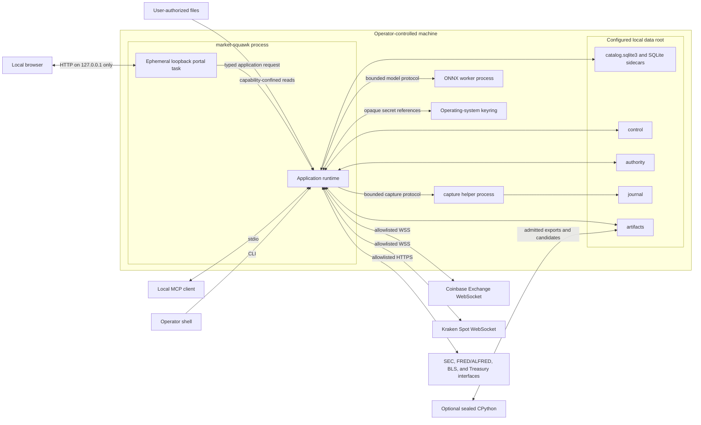

# Local Deployment

Market Squawk deploys as operator-controlled local processes and on-disk stores. This page defines
the supported topology, process boundaries, network exposure, durable layout, startup/shutdown
order, and recovery surfaces at the reviewed commit.

| Metadata | Value |
| --- | --- |
| Document type | Deployment architecture |
| Audience | Operators, maintainers, security reviewers, and integrators |
| Status | Current |
| Last substantive review | 2026-07-24 |
| Reviewed commit | `3ef05dc8724ec2be808f98543e0bc695f2ae0937` |

## Contents

- [Scope](#scope)
- [Supported topology](#supported-topology)
- [Process and network view](#process-and-network-view)
- [On-disk layout](#on-disk-layout)
- [Startup and shutdown](#startup-and-shutdown)
- [Failure and recovery](#failure-and-recovery)
- [Security and authority considerations](#security-and-authority-considerations)
- [Capacity and operability](#capacity-and-operability)
- [Related documentation and code](#related-documentation-and-code)
- [External sources](#external-sources)

## Scope

This page covers the current single-host deployment. It does not prescribe a container image,
system service manager, remote control server, clustered database, or distributed topology. Those
are not required by the product.

Exact installation steps, configuration keys, backup commands, and troubleshooting procedures
belong in the corresponding [operations](../operations/README.md) and
[reference](../reference/README.md) pages. This page explains which resources those procedures
operate and why.

## Supported topology

The baseline topology is one operator-owned machine:

- `market-squawk` is the CLI and local MCP application process;
- Tokio tasks inside that process own source supervision, live shards, research services,
  application requests, risk, paper execution, and lifecycle;
- a validated sibling `market-squawk-capture-helper` process performs killable durable raw-capture
  I/O for a production live generation;
- a validated sibling `market-squawk-onnx-worker` process may execute an admitted bounded ONNX
  model when that model generation requires it;
- an optional sealed CPython environment performs research, visualization, and training outside
  the live path; and
- SQLite, journals, authority records, Parquet datasets, model/backtest/portfolio/paper artifacts,
  and audits remain under local operator control.

CLI commands usually create a process for the duration of one operation. `market-squawk mcp serve`
keeps the same `LocalProduct` and `Application` alive for the stdio session. Production live
capture or paper-bot commands own their source/runtime workers until cancellation and bounded
shutdown complete.

The provider onboarding command may start an ephemeral HTTP server on an operating-system-selected
IPv4 loopback port and open the local browser. The listener has a bounded lifetime, request count,
connection count, per-request deadline, body size, session token, Host/Origin enforcement, and
CSRF token. It never binds a non-loopback address.

## Process and network view

The deployment view answers: which processes, local directories, and external connections exist at
runtime?



MCP uses stdio, helper IPC is private to the parent process, and the sole HTTP listener is the
loopback-scoped onboarding task. Source endpoints are selected through immutable adapter metadata
and configuration allowlists. Local structured logs and explicit provider operations account for
the product's operational output and network activity.

The ONNX worker is not a generic executable hook. When a signed training release is selected,
startup verifies that the running application and bounded regular sibling worker are the canonical
installed paths and match the signed release-manifest digests. Model admission then fixes
graph/operator/tensor/resource policy before publication. The capture helper is likewise a
validated sibling and receives one confined journal destination.

## On-disk layout

The default data root is `.market-squawk`, overridden through the documented configuration
precedence. `LocalPaths::prepare` canonicalizes and opens the root, creates its controlled
subdirectories, and retains directory capabilities.

```text
<data-root>/
├── catalog.sqlite3                 SQLite control and analytical catalog
├── catalog.sqlite3-wal             SQLite WAL sidecar while active
├── catalog.sqlite3-shm             SQLite shared-memory sidecar while active
├── journal/                        bounded raw-capture journals
├── artifacts/                      immutable analytical and result artifacts
│   ├── Parquet dataset objects and authority records
│   ├── Python dataset exports and other authority-published results
│   ├── portfolio import evidence
│   ├── paper-checkpoints/v1/
│   ├── governed backtest artifacts
│   └── admitted model-related artifacts
├── control/                        local authority, audit, and recovery state
│   ├── sources/research-runtime/
│   ├── portfolio/
│   ├── model/runtime-admissions/
│   ├── analysis/governed-backtest-inputs/
│   ├── analysis/governed-backtests/
│   └── mcp-audit.jsonl
└── authority/                      production live-source authority by source
```

The diagram is a responsibility map, not a promise that every optional directory exists in an
empty installation. A service creates its namespace when it first obtains that authority.
Artifact names are relative, portable references under an already-open root capability. A caller
must supply a reference that validates within that retained capability.

The analytical query engine supports controlled export only when its caller supplies publication
and reservation authority. The reviewed public CLI and fixed-template application/MCP query paths
do not compose that authority, so they remain inline-only and fail closed when a result would
require an artifact. The layout above therefore does not claim a currently runnable public query-
export workflow.

Configuration files are operator-selected and need not live under the data root. Effective
configuration retains the origin of each value and redacts secret references from reports.

The reviewed `LocalProduct` composes `PreferredSecretStore` with the OS keyring and no encrypted
fallback instance. The platform includes an explicit, separately unlocked encrypted-file fallback
implementation, but it is not activated by this application composition. Therefore the current
supported credential-persistence deployment requires the OS keyring; complete onboarding
acceptance remains tracked in the [delivery ledger](../plans/delivery-ledger.md).

## Startup and shutdown

### Application startup

For a production product command or MCP session, startup proceeds in authority order:

1. load and validate safe defaults, optional file, supplied `MARKET_SQUAWK_*` environment, and CLI
   overrides;
2. prepare the local root and open the catalog, object-store authority, and durable source state;
3. recover provider onboarding/activation recipes, portfolio revisions, governed backtests, and
   model admissions;
4. require the configured signed training release if durable model admissions exist, and when one
   is configured verify the running application and sibling ONNX worker against it;
5. construct every required application-domain service;
6. admit the exact complete application descriptor; and
7. expose the CLI operation or MCP transport only after composition succeeds.

Partial composition is not published. Corrupt or unverifiable durable state produces a typed
startup failure or quarantines only the affected provider where that isolation is safe.

### Live startup

Production live startup adds a stricter sequence:

1. admit routes, capacities, retained-memory estimates, action hooks, and paper execution state;
2. start every instrument shard and publish its initial immutable snapshot;
3. create one current source session and generation;
4. create the bounded capture channel and complete the capture-helper readiness handshake;
5. reserve each live route and bind current source authority before the provider connection opens;
6. open the WebSocket and perform source-specific subscription/snapshot synchronization; and
7. allow action evaluation only after qualification evidence is current and complete.

### Shutdown

Shutdown is ownership-driven:

1. stop accepting new CLI/MCP/domain work;
2. cancel provider and portal admission;
3. invalidate live and execution authority before queues drain;
4. stop source producers, finish route workers, flush or terminate capture under deadline;
5. reconcile and checkpoint paper/execution state;
6. join or transfer bounded ownership of helper and blocking tasks; and
7. return success only when the relevant shutdown report is complete.

Dropping an incomplete helper owner initiates termination and retains a terminal owner; it does
not intentionally detach the child. If termination cannot be proved, the affected resource remains
unavailable until recovery.

## Failure and recovery

| Failure | Immediate effect | Recovery boundary |
| --- | --- | --- |
| Provider disconnect, gap, checksum mismatch, or stale market state | Affected generation loses executable authority; other planes continue. | Start a new generation, obtain the required snapshot, and requalify current evidence. |
| Capture helper or journal failure | Exact capture allocation becomes incomplete; the frame cannot remain execution-eligible. | Terminate/reap the helper, reconcile journal state, and start a new source generation. |
| SQLite transaction or catalog integrity failure | Publication or request fails; no directory scan is promoted to authority. | Use catalog integrity/backup evidence and the bounded analytical restore service. |
| Interrupted Parquet publication | Staged objects remain non-current; prior manifest generation remains authoritative. | Orphan recovery verifies authority records and either finalizes or removes bounded residue. |
| Invalid provider activation recipe | Only the matching provider surface is disabled/quarantined. | Refresh evidence and perform explicit foreground activation/resume. |
| Missing signed training release for durable models | Application startup refuses to represent durable admissions as empty. | Restore the exact release or intentionally repair the durable model authority. |
| ONNX worker deadline or uncertain termination | Inference fails closed and produces no model output/action. | Reap the worker and reopen a verified model generation; fallback is allowed only when termination is certain and policy permits it. |
| Portfolio, backtest, fair-value, or paper checkpoint mismatch | The affected immutable generation is not published or resumed. | Reconcile from producer receipts and the corresponding durable authority/checkpoint protocol. |
| Disk full or permission/identity change | New writes and publications fail without changing current authority. | Stop mutation, restore capacity/ownership, verify retained identities, then retry through the owning service. |

Backup and restore must treat the SQLite snapshot, artifact inventory, authority evidence, and
active writers as one consistency problem. Copying `catalog.sqlite3` while ignoring WAL and
manifest/object state is not a valid application backup procedure.

## Security and authority considerations

- The local host and operating-system account are inside the deployment trust boundary; provider
  bytes, browser requests, user files, model files, MCP input, and on-disk residue are not trusted
  merely because they are local.
- Prepared paths use canonical roots, directory capabilities, no-follow/regular-file checks, stable
  identities, bounded reads, no-clobber publication, and explicit locks.
- Secrets reside in the OS keyring for the current composition. The catalog and artifacts retain
  only opaque references and non-secret evidence.
- Loopback does not remove web risks. The portal verifies peer address, Host, Origin, session,
  expiry, CSRF, request count, connection count, timeout, and body limits.
- Helper executables and model artifacts are admitted by exact identity before use.
- Provider access uses explicit endpoints, TLS policy, timeouts, response-size limits, shared
  budgets, and health transitions.
- Live execution authority never crosses disk, stdio MCP, JSON, Python, replay, or snapshot
  serialization.

See [Security and trust boundaries](security-and-trust-boundaries.md) for the complete authority
map.

## Capacity and operability

Runtime resource ceilings are code-owned or configuration-validated, including live queue count
and bytes, capture bytes, source controls, shard peak memory, snapshot retention, application
results, MCP framing/results/artifacts, catalog rows/record bytes/result bytes, dataset staging,
model graph/tensor/work, portfolio history/results, experiment artifacts, and fair-value records.

Generated Cargo output is a regenerable development cache, not product state. Its active
worktree-local disk budget and cleanup invariant are maintained in
[project memory](../project-memory.md), separately from the data root, credentials, evidence, and
unique Git state.

No live throughput or event-to-decision latency target is claimed by this page. Those measurements
must be produced on documented hardware by the final release evidence lane described in
[Quality attributes](quality-attributes.md).

## Related documentation and code

- [Architecture overview](overview.md)
- [Building blocks](building-blocks.md)
- [Local control plane](control-plane.md)
- [Research data plane](research-data-plane.md)
- [Backup and recovery](../operations/backup-and-recovery.md)
- [Configuration and secrets](../operations/configuration-and-secrets.md)
- [Controlled local paths](../../crates/market-squawk-platform/src/paths.rs)
- [Configuration composition](../../crates/market-squawk-platform/src/config.rs)
- [Local product startup](../../apps/market-squawk/src/local_product/mod.rs)
- [Application lifecycle](../../apps/market-squawk/src/application.rs)
- [Production source supervisor](../../apps/market-squawk/src/live_source/supervisor.rs)
- [Capture helper configuration](../../crates/market-squawk-platform/src/capture/process_journal/config.rs)
- [Provider onboarding portal](../../apps/market-squawk/src/provider_onboarding/portal.rs)
- [ONNX helper admission](../../apps/market-squawk/src/local_product/executable.rs)

## External sources

| Source | Relevance | Reviewed |
| --- | --- | --- |
| [SQLite write-ahead logging](https://sqlite.org/wal.html) | Explains the WAL and shared-memory sidecars that must be included in a coherent live catalog backup strategy. | 2026-07-23 |
| [SQLite backup API](https://sqlite.org/backup.html) | Defines the supported SQLite snapshot mechanism used as a basis for consistent backup handling. | 2026-07-23 |
| [Apache Parquet documentation](https://parquet.apache.org/docs/) | Parquet is the local durable analytical file format beneath manifest authority. | 2026-07-23 |
| [Apache DataFusion introduction](https://datafusion.apache.org/user-guide/introduction.html) | DataFusion is embedded in the local process and operates over Arrow and admitted local data. | 2026-07-23 |
| [Tokio runtime documentation](https://docs.rs/tokio/latest/tokio/) | Defines asynchronous tasks, timers, cancellation-related primitives, and blocking-work separation used by the process topology. | 2026-07-23 |
