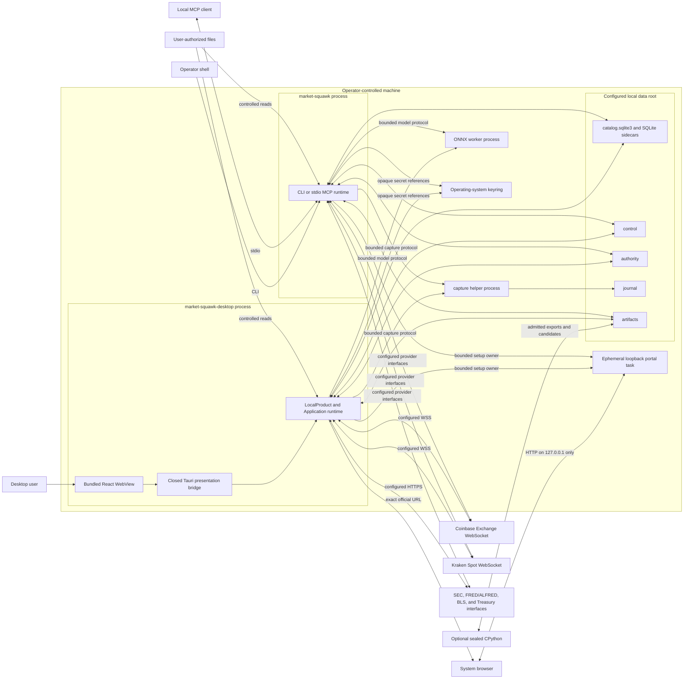
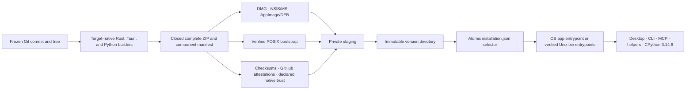

# Self-hosted deployment

Market Squawk deploys as operator-controlled local processes and on-disk stores. This page defines
the supported topology, process boundaries, network exposure, durable layout, startup/shutdown
order, complete release boundary, and recovery surfaces.

| Metadata | Value |
| --- | --- |
| Document type | Deployment architecture |
| Audience | Operators, maintainers, security reviewers, and integrators |
| Status | Current |
| Last substantive review | 2026-07-30 |
| Implementation review base | `da35ef2ca1f9e1d936d5c88014f11eb9304bcca3` |

## Contents

- [Scope](#scope)
- [Supported topology](#supported-topology)
- [Process and network view](#process-and-network-view)
- [Release and installation topology](#release-and-installation-topology)
- [Desktop distribution boundary](#desktop-distribution-boundary)
- [On-disk layout](#on-disk-layout)
- [Startup and shutdown](#startup-and-shutdown)
- [Failure and recovery](#failure-and-recovery)
- [Security and authority considerations](#security-and-authority-considerations)
- [Capacity and operability](#capacity-and-operability)
- [Related documentation and code](#related-documentation-and-code)
- [External sources](#external-sources)

## Scope

This page covers the current single-host deployment. It does not prescribe a container image,
system service manager, remote control server, clustered database, or distributed topology. Those
are not required by the product.

Exact installation steps, configuration keys, backup commands, and troubleshooting procedures
belong in the corresponding [operations](../operations/README.md) and
[reference](../reference/README.md) pages. This page explains which resources those procedures
operate and why.

## Supported topology

The baseline topology is one operator-owned machine:

- `market-squawk-desktop` is the Tauri 2 interactive application. Its bundled React WebView owns
  presentation only; a five-command bridge composes the existing `LocalProduct` and `Application`
  services in the same process. Native packages also install the exact CLI, capture helper, and
  ONNX worker as sibling executables;
- `market-squawk` is the CLI and local MCP application process;
- Tokio tasks inside that process own source supervision, live shards, research services,
  application requests, risk, paper execution, and lifecycle;
- a validated sibling `market-squawk-capture-helper` process performs killable durable raw-capture
  I/O for a production live generation;
- a validated sibling `market-squawk-onnx-worker` process may execute an admitted bounded ONNX
  model when that model generation requires it;
- the installed sealed CPython 3.14.6 environment performs optional research, visualization, and
  training outside the live path; and
- SQLite, journals, authority records, Parquet datasets, model/backtest/portfolio/paper artifacts,
  and audits remain under local operator control.

CLI commands usually create a process for the duration of one operation. `market-squawk mcp serve`
keeps the same `LocalProduct` and `Application` alive for the stdio session. Production live
capture or paper-bot commands own their source/runtime workers until cancellation and bounded
shutdown complete.

The desktop loads only bundled application assets and opens official provider pages in the system
browser. Providers whose supported workflow uses the protected browser fallback start the same
ephemeral HTTP server used by the CLI on an operating-system-selected IPv4 loopback port. The
listener has a bounded lifetime, request count, connection count, per-request deadline, body size,
session token, Host/Origin enforcement, and CSRF token. It never binds a non-loopback address.

## Process and network view

The deployment view answers: which processes, local directories, and external connections exist at
runtime?



The desktop and CLI are alternative process owners and must not concurrently claim the same
single-writer data root. MCP uses stdio, Tauri uses window-scoped IPC, helper IPC is private to the
parent process, and the sole HTTP listener is the loopback-scoped onboarding task. Source endpoints
are selected through immutable adapter metadata and validated configuration. Local structured logs
and explicit provider operations account for the product's operational output and network
activity.

The desktop exposes local MCP only after validating the installed CLI and bounded tool contract.
Installed formats generate client JSON with the absolute CLI path. A portable Linux AppImage uses
its durable outer image path and a hidden typed dispatch that `exec`-replaces the payload with the
fixed CLI before Tauri or local state opens; it never persists the temporary AppImage mount path.
Both forms include the canonical workspace, optional explicit configuration and training-release
paths. Generation starts no server, establishes no client identity, and does not infer Paper
runtime authority from the legacy diagnostic-capture setting. The operator must close the desktop
before the client starts MCP against that workspace. Other policy supplied only through environment
variables is not serialized and must be supplied to the client separately.

The ONNX worker is not a generic executable hook. When a verified training release is selected,
startup verifies that the installed `market-squawk` application identity and bounded regular
sibling worker are the canonical installed paths and match the release-manifest digests.
When the desktop owns the runtime, it selects that packaged CLI sibling rather than substituting
the desktop executable's digest. Model admission then fixes graph/operator/tensor/resource policy
before publication. The capture helper is likewise a validated sibling and receives one confined
journal destination.

## Release and installation topology

The v1.0.0 release transaction produces one closed component manifest for each supported target
and one cross-platform index. Native packages and the terminal bootstrap consume the same complete
target bundle. The application cannot compose a partial desktop-only or Python-free installation.



The installer retains the active version, at most one previous known-good version, and each
version's exact manifest and bundle. Update, repair, rollback, and status operate under one
exclusive installation lock. Repair may reconstruct only the exact selected version. Update may
activate only a strictly newer admitted release. Rollback must revalidate the retained previous
version before selection.

Program state and mutable financial data have separate roots. Ordinary uninstall removes the
program store and managed entrypoints while preserving configuration, credentials, catalogs,
portfolios, datasets, models, logs, and artifacts. Each optional data-class deletion requires its
own exact absolute path and explicit confirmation.

The release manifest records one trust mode per platform. `developer-id-signed-and-notarized` and
`authenticode-signed` are admitted only when the corresponding external authority verifies.
`provenance-only` remains a supported zero-cost distribution mode and is never presented as native
publisher identity; it relies on the immutable release, exact checksums, closed manifest, installed
product verification, and GitHub attestations.

## Desktop distribution boundary

The tracked Tauri configuration produces one resizable desktop window whose HTML, JavaScript,
styles, fonts, and icons are bundled with the application. Node.js, pnpm, Vite, and the Rust
toolchain are build-time inputs only. At runtime the desktop uses the operating system's WebView:
WebKit on macOS, WebView2 on Windows, and WebKitGTK 4.1 on Linux.

Ordinary Cargo and Tauri development use the base `tauri.conf.json`, where native bundling is
inactive. The supported package command adds `tauri.bundle.conf.json` as an official Tauri
configuration overlay. Its pre-build step compiles the exact CLI, capture helper, and tract-enabled
ONNX worker, then stages the host-triple filenames required by `externalBin`. This separation keeps
package-only generated files out of source control and allows direct workspace Cargo checks to run
without fake sidecar placeholders.

The supported package-build matrix is:

| Host | Native output |
| --- | --- |
| Ubuntu 24.04 x86-64 | Debian package and AppImage |
| macOS 15 Apple Silicon | Application bundle and DMG |
| macOS 15 Intel | Application bundle and DMG |
| Windows Server 2025 x86-64 | NSIS and MSI installers |

Each native package carries the desktop shell plus an embedded complete release: CLI, capture
helper, ONNX worker, model validator, training driver, versioned installer, uv 0.12.0, managed
CPython 3.14.6, the locked Python environment, licenses, notices, checksums, and manifest. First
desktop launch admits that embedded release into the program store before composing
`LocalProduct`.

Native publisher signing is conditional release evidence. A macOS linker-created ad-hoc Mach-O
signature is not Developer ID distribution signing. The workflow verifies the exact declared mode
and does not infer signing, notarization, installation, launch, or release acceptance from bundle
creation alone.

Linux AppImage construction uses Tauri's target-local tools directory. Before the bundler runs,
Market Squawk verifies or reacquires all five external AppImage tools against reviewed immutable
asset/commit identities, exact byte lengths, and SHA-256 digests. A cache restore is never trusted
without revalidation, and a missing architecture lock or changed upstream byte stops packaging.

## On-disk layout

The per-user program root is an installer-owned store:

```text
<program-root>/
├── installation.json               active and previous complete-release identities
├── bin/                            stable verified Unix desktop, CLI, and installer copies
├── versions/
│   ├── <active-version>-<manifest-sha256>/
│   └── <previous-version>-<manifest-sha256>/   optional rollback generation
├── releases/
│   └── <manifest-sha256>/
│       ├── manifest.json
│       └── bundle.zip
└── staging/                        private interrupted-operation workspace
```

Windows native packages own their operating-system application entrypoints. On Unix, `bin/`
contains derived regular executable copies whose digests must equal the selected immutable
component receipts. They are refreshed on install, update, repair, and rollback and are part of
installation health.

The CLI's safe default data root is `.market-squawk`. An installed desktop launch instead supplies
Tauri's operating-system application-local data directory as its safe-default value, so a
double-click launch never depends on a launcher-selected working directory. The optional local
file, `MARKET_SQUAWK_DATA_DIR`, and `--data-dir` layers retain their documented precedence and
origin. `LocalPaths::prepare` canonicalizes and opens the effective root, creates its controlled
subdirectories, and retains directory capabilities. The production Paper controller is a separate
application authority: it starts stopped, exposes only paper Bot and Execution operations, and
remains subject to central risk.

```text
<data-root>/
├── catalog.sqlite3                 SQLite control and analytical catalog
├── catalog.sqlite3-wal             SQLite WAL sidecar while active
├── catalog.sqlite3-shm             SQLite shared-memory sidecar while active
├── journal/                        bounded raw-capture journals
├── artifacts/                      immutable analytical and result artifacts
│   ├── Parquet dataset objects and authority records
│   ├── Python dataset exports and other authority-published results
│   ├── mcp/v1/ durable content-addressed terminal result artifacts
│   ├── portfolio import evidence
│   ├── paper-checkpoints/v1/
│   ├── governed backtest artifacts
│   └── admitted model-related artifacts
├── control/                        local authority, audit, and recovery state
│   ├── sources/research-runtime/
│   ├── secrets/provider-credentials/
│   ├── portfolio/
│   ├── model/runtime-admissions/
│   ├── analysis/governed-backtest-inputs/
│   ├── analysis/governed-backtests/
│   └── mcp-audit.jsonl
└── authority/                      production live-source authority by source
```

The diagram is a responsibility map, not a promise that every optional directory exists in an
empty installation. A service creates its namespace when it first obtains that authority.
Artifact names are relative, portable references under an already-open root capability. A caller
must supply a reference that validates within that retained capability.

The operator SQL and fixed-template application/MCP query compositions supply bounded transient
publication authority. When a verified result crosses its admitted inline ceiling but remains
within the complete-result ceiling, the composition reads it back through the analytical authority
and republishes it under `artifacts/mcp/v1/` as opaque
`application/vnd.apache.parquet`. This terminal repository is durable and SHA-256
content-addressed. Its public reference does not expose a path, transient owner, or reservation
expiry; consumers retrieve bounded verified chunks through `query artifact` or
`Analysis.ReadArtifact`.

Configuration files are operator-selected and need not live under the data root. Effective
configuration retains the origin of each value and redacts secret references from reports.

The reviewed `LocalProduct` composes `PreferredSecretStore` with the OS keyring as primary and a
code-owned encrypted-file fallback rooted under `control/secrets/provider-credentials/`. The
fallback starts locked in every process and accepts its bounded unlock only through the foreground
loopback portal. It becomes eligible only when the primary cannot provide its exact lifecycle;
retained references never migrate between backends. Provider release availability and clean-machine
onboarding acceptance remain tracked in the [delivery ledger](../plans/delivery-ledger.md).

## Startup and shutdown

### Application startup

For a production product command or MCP session, startup proceeds in authority order:

1. load and validate safe defaults, optional file, supplied `MARKET_SQUAWK_*` environment, and CLI
   overrides;
2. prepare the local root and open the catalog, object-store authority, and durable source state;
3. recover provider onboarding/activation recipes, portfolio revisions, governed backtests, and
   model admissions;
4. require the configured verified training release if durable model admissions exist, and when one
   is configured verify the running application and sibling ONNX worker against it;
5. construct every required application-domain service;
6. admit the exact complete application descriptor; and
7. expose the CLI operation or MCP transport only after composition succeeds.

Partial composition is not published. Corrupt or unverifiable durable state produces a typed
startup failure or quarantines only the affected provider where that isolation is safe.

### Desktop startup

Before this sequence, the hidden Linux AppImage `--stdio-mcp` transport either rejects a
non-AppImage context or validates the canonical image/mount/current-program relationship and
`exec`-replaces the unopened desktop payload with its exact CLI sibling. It accepts no arbitrary
command or trailing arguments, does not initialize Tauri or `LocalProduct`, and is absent from
ordinary help. It is a package transport, not a user configuration option or WebView command.

The desktop follows the same composition order with a presentation boundary around it:

1. parse the three user-facing desktop options and construct the Tauri application runtime without
   publishing its window;
2. admit, install, update, or repair the complete packaged release and obtain its active immutable
   root;
3. resolve the operating-system application-local data directory and load normal validated
   configuration precedence with that value only as the desktop safe default;
4. remove CLI logging and release-evidence environment controls from ambient desktop
   configuration;
5. supply the active complete release as the default training/modeling authority;
6. construct `LocalProduct` and install its state before the Tauri event loop begins;
7. register the closed presentation commands and the main-window capability;
8. load the bundled React application under the configured content-security policy; and
9. publish setup, navigation, and bootstrap facts only after the owning Rust authorities return
   them.

If argument parsing, configuration, path preparation, authority recovery, or application
composition fails, no ready desktop state is shown. Closing the window first cancels new desktop
work and then completes the existing bounded application shutdown.

### Live startup

Production live startup adds a stricter sequence:

1. admit routes, capacities, retained-memory estimates, action hooks, and paper execution state;
2. start every instrument shard and publish its initial immutable snapshot;
3. create one current source session and generation;
4. create the bounded capture channel and complete the capture-helper readiness handshake;
5. reserve each live route and bind current source authority before the provider connection opens;
6. open the WebSocket and perform source-specific subscription/snapshot synchronization; and
7. allow action evaluation only after qualification evidence is current and complete.

### Shutdown

Shutdown is ownership-driven:

1. stop accepting new CLI/MCP/domain work;
2. cancel provider and portal admission;
3. invalidate live and execution authority before queues drain;
4. stop source producers, finish route workers, flush or terminate capture under deadline;
5. reconcile and checkpoint paper/execution state;
6. join or transfer bounded ownership of helper and blocking tasks; and
7. return success only when the relevant shutdown report is complete.

Dropping an incomplete helper owner initiates termination and retains a terminal owner; it does
not intentionally detach the child. If termination cannot be proved, the affected resource remains
unavailable until recovery.

## Failure and recovery

| Failure | Immediate effect | Recovery boundary |
| --- | --- | --- |
| Release manifest, bundle, or component mismatch | Candidate never becomes active. | Reacquire the exact immutable release; do not edit the manifest or staged tree. |
| Active version or Unix entrypoint mismatch | Installation status becomes unhealthy; product readiness is withheld. | Close running processes and reconstruct the same release with installer repair. |
| Interrupted update | The last durable selector remains authoritative or the new selector reports unhealthy ancillary state. | Run status and repair under the installation lock; retained exact bundles remain recovery authority. |
| Provider disconnect, gap, checksum mismatch, or stale market state | Affected generation loses executable authority; other planes continue. | Start a new generation, obtain the required snapshot, and requalify current evidence. |
| Capture helper or journal failure | Exact capture allocation becomes incomplete; the frame cannot remain execution-eligible. | Terminate/reap the helper, reconcile journal state, and start a new source generation. |
| SQLite transaction or catalog integrity failure | Publication or request fails; no directory scan is promoted to authority. | Use catalog integrity/backup evidence and the bounded analytical restore service. |
| Interrupted Parquet publication | Staged objects remain non-current; prior manifest generation remains authoritative. | Orphan recovery verifies authority records and either finalizes or removes bounded residue. |
| Invalid provider activation recipe | Only the matching provider surface is disabled/quarantined. | Refresh evidence and perform explicit foreground activation/resume. |
| Missing verified training release for durable models | Application startup refuses to represent durable admissions as empty. | Restore the exact release or intentionally repair the durable model authority. |
| ONNX worker deadline or uncertain termination | Inference fails closed and produces no model output/action. | Reap the worker and reopen a verified model generation; fallback is allowed only when termination is certain and policy permits it. |
| Portfolio, backtest, fair-value, or paper checkpoint mismatch | The affected immutable generation is not published or resumed. | Reconcile from producer receipts and the corresponding durable authority/checkpoint protocol. |
| Disk full or permission/identity change | New writes and publications fail without changing current authority. | Stop mutation, restore capacity/ownership, verify retained identities, then retry through the owning service. |

Backup and restore must treat the SQLite snapshot, artifact inventory, authority evidence, and
active writers as one consistency problem. Copying `catalog.sqlite3` while ignoring WAL and
manifest/object state is not a valid application backup procedure.

## Security and authority considerations

- The local host and operating-system account are inside the deployment trust boundary; provider
  bytes, browser requests, user files, model files, MCP input, and on-disk residue are not trusted
  merely because they are local.
- Prepared paths use canonical roots, directory capabilities, no-follow/regular-file checks, stable
  identities, bounded reads, no-clobber publication, and explicit locks.
- Secrets reside in the OS keyring for the current composition. The catalog and artifacts retain
  only opaque references and non-secret evidence.
- Loopback does not remove web risks. The portal verifies peer address, Host, Origin, session,
  expiry, CSRF, request count, connection count, timeout, and body limits.
- The desktop WebView loads bundled assets under a strict CSP and receives only the five
  window-scoped presentation commands; business authority remains in the Rust application.
- Helper executables and model artifacts are admitted by exact identity before use.
- Provider access uses explicit endpoints, TLS policy, timeouts, response-size limits, shared
  budgets, and health transitions.
- Live execution authority never crosses disk, stdio MCP, JSON, Python, replay, or snapshot
  serialization.

See [Security and trust boundaries](security-and-trust-boundaries.md) for the complete authority
map.

## Capacity and operability

Runtime resource ceilings are code-owned or configuration-validated, including live queue count
and bytes, capture bytes, source controls, shard peak memory, snapshot retention, application
results, MCP framing/results/artifacts, catalog rows/record bytes/result bytes, dataset staging,
model graph/tensor/work, portfolio history/results, experiment artifacts, and fair-value records.

Generated Cargo output is a regenerable development cache, not product state. Its active
worktree-local disk budget and cleanup invariant are maintained in
[project memory](../project-memory.md), separately from the data root, credentials, evidence, and
unique Git state.

No live throughput or event-to-decision latency target is claimed by this page. Those measurements
must be produced on documented hardware by the final release evidence lane described in
[Quality attributes](quality-attributes.md).

## Related documentation and code

- [Architecture overview](overview.md)
- [Building blocks](building-blocks.md)
- [Local control plane](control-plane.md)
- [Research data plane](research-data-plane.md)
- [Backup and recovery](../operations/backup-and-recovery.md)
- [Configuration and secrets](../operations/configuration-and-secrets.md)
- [Installation and maintenance](../operations/installation-and-bootstrap.md)
- [Versioned installer lifecycle](../../apps/market-squawk-installer/src/lifecycle.rs)
- [Installer store](../../apps/market-squawk-installer/src/store.rs)
- [Controlled local paths](../../crates/market-squawk-platform/src/paths.rs)
- [Configuration composition](../../crates/market-squawk-platform/src/config.rs)
- [Desktop Tauri configuration](../../apps/market-squawk-desktop/src-tauri/tauri.conf.json)
- [Desktop package overlay](../../apps/market-squawk-desktop/src-tauri/tauri.bundle.conf.json)
- [Desktop external-program staging](../../apps/market-squawk-desktop/scripts/stage-sidecars.mjs)
- [Desktop capability](../../apps/market-squawk-desktop/src-tauri/capabilities/main.json)
- [Desktop composition root](../../apps/market-squawk-desktop/src-tauri/src/lib.rs)
- [Desktop presentation bridge](../../apps/market-squawk-desktop/src-tauri/src/bridge.rs)
- [Local product startup](../../apps/market-squawk/src/local_product/mod.rs)
- [Application lifecycle](../../apps/market-squawk/src/application.rs)
- [Production source supervisor](../../apps/market-squawk/src/live_source/supervisor.rs)
- [Capture helper configuration](../../crates/market-squawk-platform/src/capture/process_journal/config.rs)
- [Provider onboarding portal](../../apps/market-squawk/src/provider_onboarding/portal.rs)
- [ONNX helper admission](../../apps/market-squawk/src/local_product/executable.rs)
- [Tauri packaging research](../research/2026-07-28-tauri-packaging-and-runtime-boundaries.md)

## External sources

| Source | Relevance | Reviewed |
| --- | --- | --- |
| [SQLite write-ahead logging](https://sqlite.org/wal.html) | Explains the WAL and shared-memory sidecars that must be included in a coherent live catalog backup strategy. | 2026-07-23 |
| [SQLite backup API](https://sqlite.org/backup.html) | Defines the supported SQLite snapshot mechanism used as a basis for consistent backup handling. | 2026-07-23 |
| [Apache Parquet documentation](https://parquet.apache.org/docs/) | Parquet is the local durable analytical file format beneath manifest authority. | 2026-07-23 |
| [Apache DataFusion introduction](https://datafusion.apache.org/user-guide/introduction.html) | DataFusion is embedded in the local process and operates over Arrow and admitted local data. | 2026-07-23 |
| [Tokio runtime documentation](https://docs.rs/tokio/latest/tokio/) | Defines asynchronous tasks, timers, cancellation-related primitives, and blocking-work separation used by the process topology. | 2026-07-23 |
| [Tauri architecture](https://v2.tauri.app/concept/architecture/) | Defines the Rust core, system WebView, and IPC boundaries used by the desktop process. | 2026-07-28 |
| [Tauri capabilities](https://v2.tauri.app/security/capabilities/) | Defines window-scoped permission composition for the five-command presentation bridge. | 2026-07-28 |
| [Tauri content-security policy](https://v2.tauri.app/security/csp/) | Defines the CSP control applied to bundled desktop content. | 2026-07-28 |
| [Tauri distribution](https://v2.tauri.app/distribute/) | Defines platform packaging and the separate signing/distribution lifecycle. | 2026-07-30 |
| [Tauri sidecars](https://v2.tauri.app/develop/sidecar/) | Defines target-triple external-program staging and native-bundle placement. | 2026-07-28 |
| [Tauri CLI](https://v2.tauri.app/reference/cli/) | Defines ordered configuration overlays used to isolate package-only settings. | 2026-07-28 |
| [Tauri path API](https://docs.rs/tauri/2.11.5/tauri/path/struct.PathResolver.html#method.app_local_data_dir) | Defines the native application-local data resolver used as the installed desktop default. | 2026-07-28 |
| [GitHub artifact attestations](https://docs.github.com/en/actions/security-for-github-actions/using-artifact-attestations) | Defines the public build-provenance evidence attached to release assets. | 2026-07-30 |
| [GitHub immutable releases](https://docs.github.com/en/code-security/concepts/supply-chain-security/immutable-releases) | Defines the immutable tag and release-asset boundary. | 2026-07-30 |
| [`directories` 6.0.0](https://docs.rs/directories/6.0.0/directories/struct.ProjectDirs.html) | Defines platform-native per-user program-root derivation. | 2026-07-30 |
