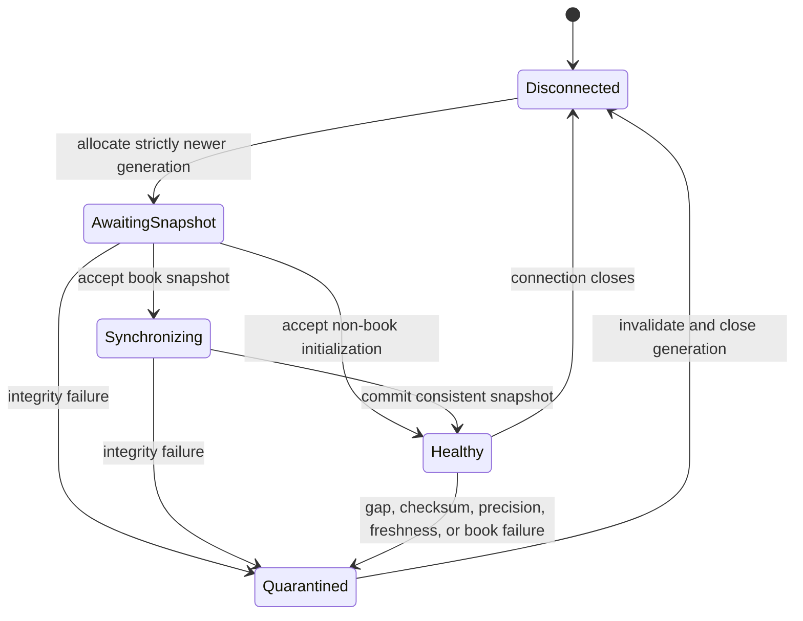

# Live execution plane

Market Squawk's live execution plane turns provider frames into instrument-owned state and, only
when the evidence supports it, risk-evaluated paper orders. It is independent of the research data
plane and keeps storage, analytical queries, Python, MCP, and other control-plane work outside the
event-to-action path.

| Metadata | Value |
| --- | --- |
| Document type | Architecture |
| Audience | Maintainers, adapter authors, strategy and risk engineers, operators, reviewers |
| Status | Current |
| Last substantive review | 2026-07-25 |
| Reviewed commit | `041175590bd2e4a357ea28d75c675c252d3b3746` |

## Contents

- [Scope](#scope)
- [Runtime flow](#runtime-flow)
- [Integrity lifecycle](#integrity-lifecycle)
- [Building blocks](#building-blocks)
- [Execution authority](#execution-authority)
- [Hot-path boundary](#hot-path-boundary)
- [Failure and recovery](#failure-and-recovery)
- [Current provider qualification boundaries](#current-provider-qualification-boundaries)
- [Related documentation and code](#related-documentation-and-code)
- [External sources](#external-sources)

## Scope

This plane owns:

- provider connection generations, raw-frame admission, decoding, and source evidence;
- sequence, snapshot, checksum, timestamp, precision, and book-integrity validation;
- bounded routing into deterministic, instrument-owned shards;
- order books, online features, strategy/model callbacks, and local live state;
- single-use execution capability issuance, central pre-trade risk, dispatch, and paper execution;
- quarantine, resynchronization, and source-health consequences.

It does not own historical extraction, point-in-time datasets, DataFusion queries, Python training,
portfolio import, fair-value measurement, or MCP transport. Raw capture is an asynchronous audit
branch; a trading decision never waits for a filesystem write to complete. Live execution remains
optional, and the current shipping execution adapter is paper execution.

## Runtime flow

The source supervisor allocates a connection generation and exact capture session before opening a
provider stream. Each frame is admitted to a bounded capture writer, decoded against the sealed
provider profile, validated against the current source-registry generation, and offered
non-blockingly to the route actor. A route actor serializes all mutation for its allocation.

```mermaid
sequenceDiagram
    participant Venue as Venue or broker
    participant Reader as Socket or protocol reader
    participant Capture as Bounded raw capture
    participant Decoder as Decoder and provider integrity
    participant Registry as Qualification and source registry
    participant Route as Bounded route actor
    participant Shard as Instrument-owned shard
    participant Features as Online features
    participant Strategy as Strategy or model
    participant Gate as Execution-owned live action gate
    participant Risk as Central risk
    participant Dispatch as Bounded dispatcher
    participant Paper as Paper adapter

    Venue->>Reader: frame for current connection generation
    Reader->>Capture: bounded capture admission
    Capture-->>Reader: capture receipt
    Note over Capture: Disk writing continues asynchronously
    Reader->>Decoder: exact raw frame and sealed source profile
    Decoder->>Decoder: decode, exact values, timestamp, provider checksum
    Decoder->>Registry: normalized evidence and capture receipt
    Registry-->>Decoder: current generation, coverage, quality, and route authority
    Decoder->>Route: non-blocking bounded batch
    Route->>Shard: serialized candidate update
    Shard->>Shard: validate sequence, snapshot/delta, precision, and book; commit atomically
    Shard->>Features: committed market observation
    Features->>Strategy: committed state and feature context
    alt DirectVerified, fresh, eligible, and action ready
        Strategy->>Gate: typed intent only
        Gate->>Risk: typed intent and current single-use capability
        Risk->>Risk: quality, account, exposure, loss, and order limits
        Risk->>Dispatch: approved order
        Dispatch->>Paper: adapter-only submission
        Paper-->>Dispatch: receipt and state transition
    else no executable authority
        Strategy-->>Gate: no action or typed failure
    end
```

Capture admission is part of evidence provenance, but capture persistence is not a synchronous
dependency of strategy or risk evaluation. If the bounded capture or route admission fails, the
allocation degrades or is invalidated; the system does not silently discard execution-relevant
frames.

## Integrity lifecycle

Integrity is scoped to a source allocation and connection generation. A disconnected or
quarantined generation cannot be made healthy by a late message. Recovery requires a strictly
newer generation and fresh initialization.



The transition rules are deliberately asymmetric:

- only `AwaitingSnapshot` may begin synchronization;
- only a consistent initialization may establish `Healthy`;
- a sequence gap, regression, snapshot-order violation, checksum mismatch, crossed book, invalid
  tick/lot precision, or stale/invalid evidence prevents the candidate update from committing;
- quarantine is terminal for that allocation generation;
- the supervisor closes the failed generation, applies bounded reconnect policy, and creates a new
  capture/session generation before resynchronization;
- a heartbeat may update connection liveness, but never refreshes market-price freshness.

Book mutation is transactional. Validation runs against a candidate state, and the last known-good
book remains intact when the candidate is rejected.

## Building blocks

| Building block | Responsibility | Boundary or invariant |
| --- | --- | --- |
| Production source composition | Seals provider configuration, endpoint, metadata, instrument mapping, and quality ceiling | A runtime source cannot self-promote beyond its registered profile |
| Source supervisor | Owns session/generation allocation, capture lifecycle, provider reconnect, and resynchronization | A failed generation is reaped before a newer one is admitted |
| Production raw-market sink | Enforces capture-first processing, decode receipts, registry authority, and route admission | Capture, decoded evidence, source identity, and generation must agree |
| Provider decoder | Preserves exact numeric lexemes and emits provider-normalized observations | Boundary conversion is checked; malformed or unsupported frames are rejected |
| Source registry | Owns current source health, coverage, generation, and qualification evidence | Stale leases and stale generations cannot route events |
| Route actor | Applies count and byte budgets and serializes a route's work | `try_send` failure is explicit; no unbounded backlog exists |
| Instrument-owned shard | Owns books, rolling state, feature state, and action hook for its instruments | One writer mutates an instrument's live state |
| Integrity processor | Validates snapshots, deltas, sequence, checksum, precision, timestamps, and book consistency | State commits only after all applicable checks succeed |
| Live action hook | Publishes committed observations, updates features, and invokes strategy/model code synchronously | It performs no blocking I/O and cannot grant execution authority |
| Capability gate and risk | Issues and consumes single-use capabilities, then evaluates every intent | Only `DirectVerified` evidence can support immediate automated action |
| Dispatcher | Accepts only approved orders and is the sole execution-adapter seam | Strategy, CLI, MCP, and model code cannot submit directly |
| Paper adapter | Models order lifecycle, latency, fees, slippage, fills, cancellation, balances, and positions | State transitions follow adapter receipts; reconciliation remains authoritative |

The shard assignment is deterministic over venue and instrument identity. This preserves
single-writer ownership while allowing independent shards to run concurrently. Queue capacity is
configured and bounded in both item count and bytes so burst behavior has a defined failure
consequence rather than an implicit memory-growth policy.

## Execution authority

`DataQuality`, `MarketDepth`, and `FairValueHierarchy` are separate classifications. A deep book is
not necessarily trustworthy, and an analytical Level 1 candidate is not automatically execution
evidence.

Immediate automated action requires a committed `DirectVerified` observation backed by all
applicable evidence:

- registered source, venue, instrument, endpoint, coverage, and connection generation;
- consistent snapshot/update ordering and valid sequence progression;
- provider checksum validation where the protocol supplies a checksum;
- valid exchange/source and receive timestamps within configured freshness limits;
- valid instrument tick and lot precision;
- valid book, trading status, and venue status;
- a capture receipt and qualification assessment bound to the same observation;
- ready features and a non-expired intent whose required quality is satisfied.

The action gate creates a narrow, single-use capability only after the observation commits. The
strategy receives context but no broker handle. Central risk is the only component that can turn an
intent into an approved order, and the bounded dispatcher is the only component that can call the
execution adapter. Inference, strategy, risk, or dispatch failure produces no automated order.

## Hot-path boundary

The event-to-action path is a bounded, memory-resident sequence of state transitions and
non-blocking queue admission. SQLite, DataFusion, Parquet, Python, MCP, language-model,
persistence, reporting, audit-compaction, and control-plane network work runs outside that path.
Raw-capture disk persistence is asynchronous and cannot delay a decision. These placement rules
are architectural invariants, not performance claims. Throughput and latency are reported only
from exact-head measurements on documented hardware.

## Failure and recovery

| Failure | Immediate consequence | Recovery authority |
| --- | --- | --- |
| Malformed frame or invalid decimal/precision | Frame is rejected; candidate state is not committed | Provider decoder and source supervisor |
| Duplicate, regression, gap, or snapshot-order violation | Allocation is degraded or quarantined according to the integrity outcome | Fresh snapshot on a strictly newer generation |
| Kraken checksum mismatch | Entire message candidate is rejected; book remains at the last good commit | Close, reconnect, snapshot, and checksum revalidation |
| Crossed or otherwise inconsistent book | Candidate book is rejected and cannot reach features or action | New valid state through the integrity lifecycle |
| Capture admission or writer failure | Evidence chain is invalidated; the frame cannot support action | Repair storage condition and create a new admitted session |
| Route item/byte capacity exhausted | Non-blocking send fails closed; no silent loss | Invalidate affected allocation and resynchronize |
| Stale market evidence | Execution capability is not issued or risk rejects the intent | A fresh qualifying market observation |
| Strategy or inference error | No intent proceeds | Later committed event after the component remains healthy |
| Risk rejection or expired capability | No order reaches the adapter; decision is recorded | New intent and new evidence; never reuse the capability |
| Dispatcher or adapter failure | Typed failure and reconciliation-required state | Execution reconciliation through the lifecycle owner |
| Shutdown deadline | Ingress closes first; bounded components drain or report incomplete shutdown | Operator restarts from durable source and execution state |

## Current provider qualification boundaries

At the reviewed commit, public compatibility sources remain below execution eligibility while the
separate authenticated Coinbase Direct runtime can satisfy the evidence-derived gate:

| Adapter | Implemented integrity evidence | Current ceiling | Automated-action consequence |
| --- | --- | --- | --- |
| Coinbase Exchange public | Public WebSocket frames, sealed source metadata, capture provenance, provider decoding, timestamp/precision checks, and route ownership | `DirectUnverified` because the public profile does not provide the complete sequence evidence required by Market Squawk's qualification contract | Cannot mint the `DirectVerified` capability required by central risk |
| Coinbase Exchange Direct | Exact active onboarding generation, View-only signer, authenticated full-channel acknowledgement, capture-first sequenced frames, REST level-3 snapshot, bounded contiguous replay, product status, precision, freshness, coverage, and generation health | `DirectVerified` only while every applicable runtime assessment remains current; checksum is explicitly unsupported by the provider profile | May issue a short-lived single-use live capability to central risk; any failed assessment cancels/quarantines before further action |
| Kraken Spot WebSocket v2 | Direct book frames, exact decimal lexemes, message-atomic updates, snapshot handling, and Kraken top-ten CRC32 verification | `DirectUnverified` because the v2 book profile does not provide a book-update sequence that satisfies the platform's continuity requirement | Cannot mint the `DirectVerified` capability required by central risk |

These are evidence boundaries, not adapter-completeness claims. Public Coinbase and Kraken support
capture, validated local books, health reporting, comparison, and non-executable analysis without
crossing the production gate. Coinbase Direct uses the same central strategy, risk, dispatcher, and
paper authority only after qualification; its credential, liveness, sequence, snapshot, status,
freshness, precision, and coverage evidence remains continuously revocable.

## Related documentation and code

Architecture:

- [Architecture overview](overview.md)
- [Building blocks](building-blocks.md)
- [Data, time, and provenance](data-time-and-provenance.md)
- [Security and trust boundaries](security-and-trust-boundaries.md)
- [Quality attributes](quality-attributes.md)
- [ADR 0001: Separate live and research planes](decisions/0001-separate-live-and-research-planes.md)
- [ADR 0002: Evidence-derived execution quality](decisions/0002-evidence-derived-execution-quality.md)
- [ADR 0003: Single-writer live state](decisions/0003-single-writer-live-state.md)
- [ADR 0005: Central risk and execution authority](decisions/0005-central-risk-and-execution-authority.md)

Current implementation anchors:

- [Production live-source composition](../../apps/market-squawk/src/live_source/composition.rs)
- [Source supervisor](../../apps/market-squawk/src/live_source/supervisor.rs)
- [Capture-first production sink](../../apps/market-squawk/src/live_source/sink.rs)
- [Bounded route actor](../../apps/market-squawk/src/live_source/route_actor.rs)
- [Live runtime composition](../../apps/market-squawk/src/live_runtime.rs)
- [Generation integrity state](../../crates/market-squawk-live/src/state.rs)
- [Transactional live processor](../../crates/market-squawk-live/src/processor.rs)
- [Live action contract](../../crates/market-squawk-live/src/action.rs)
- [Risk-owned live hook](../../crates/market-squawk-execution/src/live_hook.rs)
- [Central risk service](../../crates/market-squawk-execution/src/risk.rs)
- [Kraken decoder and checksum](../../adapters/market-squawk-adapter-kraken/src/decoder.rs)
- [Coinbase public source profile](../../adapters/market-squawk-adapter-coinbase/src/config.rs)
- [Coinbase Direct profile and transport](../../adapters/market-squawk-adapter-coinbase/src/direct.rs)
- [Coinbase Direct application owner](../../apps/market-squawk/src/live_source/direct.rs)

Evidence and operations:

- [Project memory and delivery invariants](../project-memory.md)
- [Delivery ledger](../plans/delivery-ledger.md)
- [Provider activation evidence validation](../research/2026-07-23-provider-activation-evidence-validation.md)
- [Source operations](../operations/source-operations.md)
- [Portfolio and paper execution](../operations/portfolio-and-paper-execution.md)
- [Data-quality reference](../reference/data-quality.md)

## External sources

These sources define provider or dependency semantics; the reviewed code remains authoritative for
Market Squawk behavior.

| Source | Architectural use | Reviewed |
| --- | --- | --- |
| [Coinbase Exchange WebSocket channels](https://docs.cdp.coinbase.com/exchange/websocket-feed/channels) | Channel-specific heartbeat, sequence, snapshot, and order-book semantics | 2026-07-23 |
| [Coinbase Exchange WebSocket authentication](https://docs.cdp.coinbase.com/exchange/websocket-feed/authentication) | Signed subscription inputs and authenticated feed boundary | 2026-07-25 |
| [Kraken Spot WebSocket v2 book checksum](https://docs.kraken.com/exchange/guides/websockets/book-checksum-v2) | Message-atomic level application, delete-on-zero, exact decimal handling, and top-ten CRC32 calculation | 2026-07-23 |
