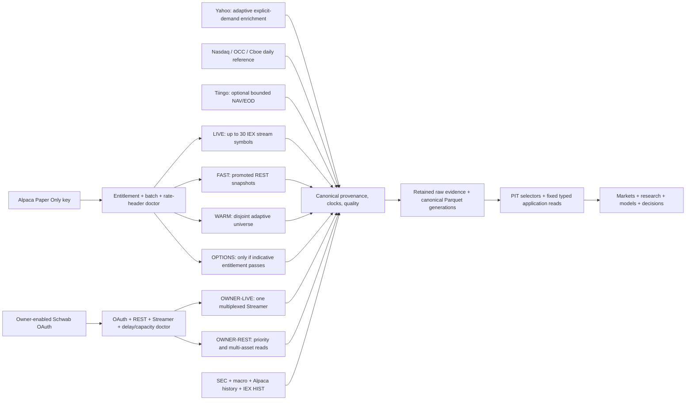
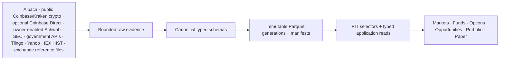
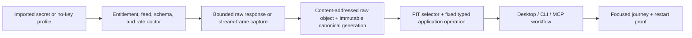

# Free-first market-data provider architecture

This page defines Market Squawk's maintained selected market-data target. The base product must
remain useful on zero-subscription provider plans, while accurately disclosing narrower feeds and
automatically reducing breadth or cadence when measured capacity is insufficient.

**Selected stack:** Alpaca Paper Only/Basic is the governed no-brokerage current and
historical stock/ETF core. An owner-authorized Schwab Trader API connection is an optional,
account-backed complementary market-data surface for multi-asset REST and Streamer data; the base
product cannot depend on it. Public Coinbase Advanced Trade and Kraken Spot are retained no-key
crypto-specialist sources; they add venue-qualified crypto books and trades but provide none of the
stock, ETF, index, bond, mutual-fund, or REIT breadth assigned elsewhere. Coinbase Direct is an
optional authenticated crypto market-data surface and grants no account or order authority.
Yahoo/yfinance remains adaptive explicit-demand enrichment, Tiingo is the optional daily
mutual-fund NAV/EOD source, Nasdaq Trader/OCC/Cboe provide reference identity, and SEC plus
government APIs provide fundamentals, holdings, rates, and macro evidence. No source enters a
recurring lane unless its official contract and account-specific measurements fit that lane's
complete workload. Tradier remains outside this selected stack; retained dormant support does not
authorize new import, activation, scheduling, fallback, product composition, or release-gate use.

| Field | Value |
| --- | --- |
| Document type | Target architecture and implementation boundary |
| Audience | Operators, financial-data engineers, quantitative researchers, application integrators, product owners, and reviewers |
| Status | Durable planning and paused-goal resumption authority; implementation and authenticated acceptance remain incomplete |
| Last substantive review | 2026-08-11 |
| Implementation review basis | `3a2f24ddbe88a886d9ba6458dd141774e3716a9d` plus the preserved shared working-tree overlay |

Every numeric contract or capacity statement uses one of these labels:

- **VERIFIED PROVIDER FACT** — stated in linked current first-party documentation.
- **APPLICATION POLICY** — a Market Squawk target, budget, or safety choice.
- **RUNTIME-MEASURED VALUE** — observed by a receipt that binds provider account, entitlement,
  build, machine, configuration, and measurement window.
- **UNVERIFIED ENTITLEMENT/ASSUMPTION** — requires an authenticated read-only probe or benchmark.

Requested symbols, returned symbols, stream events, endpoint rows, and normalized observations are
different units. A free subscription price does not imply consolidated coverage or unlimited use.
An active provider must either prove enough documented capacity for its assigned workload or pass a
retained normal-session benchmark at that workload. A low-volume free plan is not admitted merely
because it is free.

## Contents

1. [Selected provider matrix](#1-selected-provider-matrix)
2. [Alpaca Paper Only entitlement matrix](#2-alpaca-paper-only-entitlement-matrix)
3. [Exact provider endpoints](#3-exact-provider-endpoints)
4. [Official limits and application budgets](#4-official-limits-and-application-budgets)
5. [Live, fast, warm, options, and cold scheduling](#5-live-fast-warm-options-and-cold-scheduling)
6. [Batch-size sensitivity](#6-batch-size-sensitivity)
7. [Low, base, and high capacity scenarios](#7-low-base-and-high-capacity-scenarios)
8. [Fallback and degradation policy](#8-fallback-and-degradation-policy)
9. [Runtime telemetry](#9-runtime-telemetry)
10. [Canonical data and storage architecture](#10-canonical-data-and-storage-architecture)
11. [Data-to-workflow completion contract](#11-data-to-workflow-completion-contract)
12. [Remaining data-quality limitations](#12-remaining-data-quality-limitations)
13. [Repository integration changes required](#13-repository-integration-changes-required)

## 1. Selected provider matrix

| Provider or plane | Admission | Responsibility |
| --- | --- | --- |
| Alpaca Paper Only / Basic | Core | IEX equity/ETF live and latest data, stock history, gap repair, and option data only after an entitlement probe |
| Coinbase Advanced Trade public market data | Core crypto, no key | Venue-qualified public crypto price-level books and trades for the admitted product set; `DirectUnverified`, never non-crypto coverage, consolidated crypto coverage, account data, or trading authority |
| Kraken Spot WebSocket v2 public channels | Core crypto, no key | Independent venue-qualified public crypto price-level books and trades for the admitted pair set; `DirectUnverified`, never non-crypto coverage, consolidated crypto coverage, account data, or trading authority |
| Coinbase Exchange Direct market data | Owner-enabled crypto complement, optional and runtime-gated | Authenticated direct crypto market data for an exact admitted account generation; distinct from the public feed and never granted account, position, order, or money-movement authority |
| Nasdaq Trader, OCC, and Cboe reference files | Core, no key | Current listed equity/ETF/bond identifiers, listed option products/series, symbology, contract-reference events, and exchange status; never current consolidated quotes or a complete open-interest/volume source |
| SEC EDGAR/XBRL/N-PORT/N-CEN | Core, no key | Company filings/facts and fund/ETF holdings/metadata |
| FRED/ALFRED, BLS, BEA, Board, Census, EIA, Treasury | Core macro/release plane | Point-in-time macro, rates, fiscal, labor, national-account, demographic/trade, and energy evidence |
| Yahoo Finance through a pinned `yfinance` contract | Default adaptive enrichment, no key | Explicit-demand quote enrichment, index history, supported mutual-fund daily prices, and option chains; breadth is runtime-admitted, never the broad scheduled or sole decision feed |
| IEX HIST | Default on-demand cold, no key | Selected, byte-admitted T+1 IEX feed/date artifacts for microstructure research and validation; never live data, consolidated history, or an automatic archive download |
| Tiingo Starter | Optional but uniquely useful | Curated daily EOD and supported mutual-fund NAV; absence remains visible when disabled |
| Charles Schwab Trader API — Individual | Owner-enabled complementary provider; account-backed, optional, and runtime-gated | Read-only multi-asset REST quotes, option chains, history, instruments, hours, movers, and one multiplexed Streamer connection; never required by the no-brokerage base and never granted account/order authority |

**VERIFIED PROVIDER FACT:** the current SEC N-CEN derived bulk dataset omits accepted schema 3.1
filings. **APPLICATION POLICY:** mark that bulk generation as incomplete for schema 3.1 and retain
full-filing evidence when the workflow requires complete coverage.

**VERIFIED PROVIDER FACT:** Alpaca Paper Only is free, can be opened with an email address, and is
entitled to IEX market data. Alpaca Basic costs zero and covers U.S. stocks/ETFs with IEX current
data. [Paper Trading](https://docs.alpaca.markets/us/docs/paper-trading) and
[Market Data plans](https://docs.alpaca.markets/us/docs/about-market-data-api) are authoritative.

### Owner-enabled Schwab boundary

**VERIFIED PROVIDER FACT:** Trader API — Individual requires a Schwab brokerage relationship,
app/product approval, user consent/account selection, 30-minute access tokens, seven-day refresh
tokens, and one simultaneous Streamer connection per user. Market-data REST paths are not
account-number scoped. See the
[Schwab Individual developer product](https://developer.schwab.com/products/trader-api--individual),
[Streamer guide](https://www.schwab.com/content/how-to-use-streaming-data), and official API
contracts linked below.

**RUNTIME-MEASURED VALUE:** this approved app/account returned equities, ETFs, indexes, mutual
funds, forex, futures, options, history, hours, movers, and fundamentals; accepted 500/500 symbols
in one quote call; and accepted five tested Streamer services.

**UNVERIFIED ENTITLEMENT/ASSUMPTION:** no official numeric market-data REST rate, REST batch
maximum, or Streamer symbol maximum is published, and normal-session sustainable throughput is not
yet proven.

Current community Schwab clients are useful differential references for request shapes and test
fixtures, but they are not provider-contract authority. Their recurring `120 requests/minute` and
`300`/`500` symbol claims are not admitted market-data limits. **VERIFIED PROVIDER FACT:** Schwab's
documented `0–120 requests/minute/account` value applies to excluded order mutations, not market
data. **APPLICATION POLICY:** Schwab capacity is governed by one shared adaptive provider queue,
actual requested/returned rows, partial results, latency, bytes, HTTP 429/retry evidence, stream
acknowledgements, queue pressure, and normal-session soak results.

**APPLICATION POLICY:** The selected stack remains usable with IEX, indicative, provider-qualified,
and partial evidence. It must never advertise unavailable SIP, NBBO, OPRA, complete index/bond
coverage, or consolidated full-depth semantics.

**VERIFIED PROVIDER FACT:** Yahoo publishes display coverage and delay information, including
real-time Nasdaq Stock Exchange values and 15-minute OPRA values, but Yahoo's current developer API
catalog does not publish a Yahoo Finance market-data API. See
[Yahoo's coverage table](https://help.yahoo.com/kb/account/exchanges-data-providers-yahoo-finance-sln2310.html),
[Yahoo's API catalog](https://developer.yahoo.com/api/).

Pinned-client implementation evidence, not a Yahoo provider fact: the selected `yfinance` source
connects to a public Yahoo WebSocket and decodes bid, ask, sizes, exchange, market-hours, and
event-time fields. The exact inspected surfaces are the
[`yfinance` stream](https://github.com/ranaroussi/yfinance/blob/beac22d981ab37362a70c9e4e49261ac622acbe4/yfinance/live.py#L15-L29)
and
[`PricingData` schema](https://github.com/ranaroussi/yfinance/blob/beac22d981ab37362a70c9e4e49261ac622acbe4/yfinance/pricing.proto#L23-L29).

**RUNTIME-MEASURED VALUE:** A 2026-08-11 closed-market probe on this development host completed 25
concurrent `Ticker.get_info()` reads in 1.171 seconds and returned positive bid and ask fields for
all 25 symbols, but 4 of 25 were crossed. Separate probes returned five daily rows for `^GSPC` and
`VTSAX`, plus AAPL option contracts with bid, ask, volume, open interest, and implied volatility.
A ten-second WebSocket probe received no messages while the market was closed. These observations
prove useful shapes and fragility, not a provider limit, normal-session completeness, NBBO, or an
admitted production cadence.

## 2. Alpaca Paper Only entitlement matrix

| Capability | Current status | Product treatment |
| --- | --- | --- |
| Account creation | **VERIFIED PROVIDER FACT:** Paper Only is free and email-only | Core account; use the `paper` credential realm |
| Current stocks/ETFs | **VERIFIED PROVIDER FACT:** IEX only | Preserve `ALPACA_IEX`; never label SIP or consolidated |
| Equity WebSocket | **VERIFIED PROVIDER FACT:** Basic permits 30 symbols | Reserve for the highest-priority instruments |
| Stock history | **VERIFIED PROVIDER FACT:** Basic history begins in 2016 and restricts the latest 15 minutes | Use for bounded backfill and repair with the restriction retained |
| Stock latest quotes/snapshots | **VERIFIED PROVIDER FACT:** multi-symbol IEX routes exist; no stock-symbol maximum is published. **RUNTIME-MEASURED VALUE:** this Paper credential returned complete 50, 100, 200, 500, and 1,000-symbol snapshot probes. | Retain those dated observations, start conservatively, and let returned rows/headers/latency determine recurring breadth; one successful batch is not a permanent provider maximum |
| Options indicative REST/WebSocket | **VERIFIED PROVIDER FACT:** Basic advertises indicative options and 200 quote subscriptions. **RUNTIME-MEASURED VALUE:** this Paper credential returned a paginated SPY indicative option-chain page. | Admit the REST option lane for this credential generation; separately prove the option WebSocket, page completeness, and normal-session behavior. HTTP 403 or entitlement loss returns the workspace to Unavailable |
| Fixed-income latest prices/quotes | **VERIFIED PROVIDER FACT:** routes exist. **RUNTIME-MEASURED VALUE:** this Paper credential returned HTTP 403. | Fixed income is unavailable from Alpaca for this credential generation; never retry it as a required lane until entitlement changes and a fresh doctor proves it |
| Direct index values | **VERIFIED PROVIDER FACT:** the proposed index endpoints were removed on 2026-07-24 before public availability | Do not implement or count indexes in the Alpaca WARM universe |
| Corporate actions | **VERIFIED PROVIDER FACT:** a route exists, but Alpaca warns creation may be delayed | Treat as partial validation, not complete point-in-time authority |
| Trading | **APPLICATION POLICY:** outside this data plane | Use only `data.alpaca.markets` and market-data WebSockets; grant no order authority |

The index removal is recorded in Alpaca's
[2026-06-03 changelog update](https://docs.alpaca.markets/us/changelog/2026-06-03-market-data-9dddd18).

## 3. Exact provider endpoints

Only read-only routes belong in provider profiles. Endpoints and hard caps remain code-owned.

| Source | Exact reviewed endpoint or family |
| --- | --- |
| Alpaca IEX stream | `wss://stream.data.alpaca.markets/v2/iex` |
| Alpaca stock latest quotes | `GET https://data.alpaca.markets/v2/stocks/quotes/latest` |
| Alpaca stock snapshots | `GET https://data.alpaca.markets/v2/stocks/snapshots` — latest trade, quote, minute bar, daily bar, and previous daily bar ([reference](https://docs.alpaca.markets/us/reference/stocksnapshots-1)) |
| Alpaca stock history | `GET https://data.alpaca.markets/v2/stocks/bars` and single-symbol/paginated variants |
| Alpaca indicative option stream | `wss://stream.data.alpaca.markets/v1beta1/indicative` after entitlement proof |
| Alpaca option snapshots | `GET https://data.alpaca.markets/v1beta1/options/snapshots` — at most 100 requested contracts ([reference](https://docs.alpaca.markets/us/v1.4.2/reference/optionsnapshots)) |
| Alpaca option chain | `GET https://data.alpaca.markets/v1beta1/options/snapshots/{underlying_symbol}` — paginated, at most 1,000 returned data points/page ([reference](https://docs.alpaca.markets/us/v1.4.2/reference/optionchain)) |
| Alpaca fixed income | `GET https://data.alpaca.markets/v1beta1/fixed_income/latest/prices` and `/latest/quotes` ([prices](https://docs.alpaca.markets/us/reference/fixedincomelatestprices), [quotes](https://docs.alpaca.markets/us/reference/fixedincomelatestquotes)). **RUNTIME-MEASURED VALUE:** the configured Paper credential returned HTTP 403, so this lane is unavailable for that credential generation. |
| Alpaca corporate actions | `GET https://data.alpaca.markets/v1/corporate-actions` |
| Coinbase Advanced Trade public market data | `wss://advanced-trade-ws.coinbase.com`; admitted public channels are `level2`, `market_trades`, and `heartbeats` for the exact configured product |
| Coinbase Exchange public/direct market data | `wss://ws-feed.exchange.coinbase.com` is the unauthenticated Exchange market-data feed; `wss://ws-direct.exchange.coinbase.com` is the separately authenticated Direct market-data feed |
| Kraken Spot public market data | `wss://ws.kraken.com/v2`; admitted public channels are exact `book` and `trade` subscriptions for configured pairs |
| Schwab read-only REST | **RUNTIME-MEASURED VALUE:** the configured read-only probe exercised server `https://api.schwabapi.com/marketdata/v1` and the `GET /quotes`, `GET /chains`, `GET /expirationchain`, `GET /pricehistory`, `GET /movers/{symbol_id}`, `GET /markets`, and `GET /instruments` families. **UNVERIFIED ENTITLEMENT/ASSUMPTION:** freeze the current authenticated official OpenAPI—including `/{symbol_id}/quotes`, `/markets/{market_id}`, and `/instruments/{cusip_id}`—before mapper implementation because later anonymous schema access returned `unauthorized`. |
| Schwab Streamer bootstrap | **VERIFIED PROVIDER FACT:** use the minimum read-only `GET https://api.schwabapi.com/trader/v1/userPreference`, extract only Streamer/offer fields, obtain the WebSocket URL and login coordinates dynamically, and discard all unrelated returned fields. Do not hard-code a copied socket URL. |
| Schwab Streamer services | **VERIFIED PROVIDER FACT:** admitted market-data families are `LEVELONE_EQUITIES`, `LEVELONE_OPTIONS`, `LEVELONE_FUTURES`, `LEVELONE_FUTURES_OPTIONS`, `LEVELONE_FOREX`, `NYSE_BOOK`, `NASDAQ_BOOK`, `OPTIONS_BOOK`, `CHART_EQUITY`, `CHART_FUTURES`, `SCREENER_EQUITY`, and `SCREENER_OPTION`. `SUBS` replaces one service's set; one serialized desired-state controller owns the sole connection. Account activity is excluded. |
| Schwab OAuth | `GET https://api.schwabapi.com/v1/oauth/authorize` and `POST https://api.schwabapi.com/v1/oauth/token`. **APPLICATION POLICY:** the code-owned callback is exactly `https://127.0.0.1:8182` with no trailing slash; it is not an environment value. Access/refresh tokens live only in the protected secret store. |
| Yahoo experimental quote enrichment | Undocumented Yahoo surfaces encapsulated behind one pinned provider contract; the inspected `yfinance` revision uses `wss://streamer.finance.yahoo.com/?version=2`. No Yahoo URL is treated as stable configuration. |
| Nasdaq listed equities/ETFs | `https://www.nasdaqtrader.com/dynamic/SymDir/nasdaqlisted.txt` and `https://www.nasdaqtrader.com/dynamic/SymDir/otherlisted.txt` ([field definitions](https://nasdaqtrader.com/Trader.aspx?id=SymbolDirDefs)) |
| Nasdaq listed bonds/options | `ftp://ftp.nasdaqtrader.com/symboldirectory/bondslist.txt` and `https://www.nasdaqtrader.com/dynamic/SymDir/options.txt` |
| OCC listed products/series | Official [Directory of Listed Products](https://www.theocc.com/market-data/market-data-reports/series-and-trading-data/directory-of-listed-products) and [batch-processing](https://www.theocc.com/market-data/market-data-reports/other-market-data-info/batch-processing) downloads |
| Cboe option-series reference | Daily exchange files from the official [options reference-data page](https://www.cboe.com/markets/us/options/market-statistics/reference-data), including `https://cdn.cboe.com/data/us/options/market_statistics/symbol_reference/{cone,opt,ctwo,exo}-all-series.csv` |
| IEX HIST | Official [HIST product/download surface](https://www.iex.io/products/equities/market-data-connectivity) for T+1 IEX messages. Product prose describes the most recent 12 months; the separately labeled 2026-08-11 served-catalog measurement below exposed a broader range. Neither is a permanent retention guarantee. |
| SEC | `https://data.sec.gov/submissions/CIK##########.json`, XBRL API families, official bulk ZIPs, and N-PORT/N-CEN datasets ([EDGAR APIs](https://www.sec.gov/search-filings/edgar-application-programming-interfaces)) |
| BLS | `https://api.bls.gov/publicAPI/v2/timeseries/data/` |
| BEA | `https://apps.bea.gov/api/data` |
| Census | `https://api.census.gov/data/{year}/{dataset}` |
| EIA | `https://api.eia.gov/v2/{route}` |
| FRED/ALFRED | `https://api.stlouisfed.org/fred/...` and `GET https://api.stlouisfed.org/fred/v2/release/observations` |
| Treasury | Fiscal Data `https://api.fiscaldata.treasury.gov/services/api/fiscal_service/...` and daily-rate XML `https://home.treasury.gov/resource-center/data-chart-center/interest-rates/pages/xml` |

## 4. Official limits and application budgets

| Provider | Verified provider contract | Market Squawk policy |
| --- | --- | --- |
| Alpaca Basic | **VERIFIED PROVIDER FACT:** 200 historical calls/minute; 30 equity WebSocket symbols; 200 option quote subscriptions | **APPLICATION POLICY:** provisional 150-RPM maximum and 120-RPM recurring target across admitted Alpaca data work, lowered whenever headers or pressure require |
| Alpaca latest/snapshot pool | **UNVERIFIED ENTITLEMENT/ASSUMPTION:** no reviewed page proves that the 200 historical-call number is a universal shared latest/snapshot/options allowance | **APPLICATION POLICY:** provider doctor must read `X-RateLimit-*`, HTTP 429, and `Retry-After`; no 8,000-symbol schedule is admitted before this proof |
| Coinbase public market data | **VERIFIED PROVIDER FACT:** the public WebSocket channels require no authentication; Coinbase Exchange documents 8 requests/second/IP, bursts to 20, and 100 client messages/second/IP for its Exchange WebSocket feed | **APPLICATION POLICY:** one bounded connection per admitted public profile, one configured product on the current profile, exact snapshot/sequence health, adaptive reconnect, and no use as a non-crypto fallback |
| Kraken Spot public market data | **VERIFIED PROVIDER FACT:** Spot WebSocket v2 exposes public `book` and `trade` channels with explicit subscription acknowledgements; the book carries snapshot/update checksums | **APPLICATION POLICY:** use only the configured pairs/depths through the existing bounded public profile; runtime pressure and provider refusal can only lower work, and no unreviewed numeric capacity is assumed |
| Yahoo/yfinance | **UNVERIFIED ENTITLEMENT/ASSUMPTION:** Yahoo publishes display timing but no Finance API, watchlist, batch, request-rate, daily-volume, or WebSocket subscription contract; pinned yfinance history fans out per ticker | **APPLICATION POLICY:** enabled for explicit-demand, runtime-admitted enrichment; one shared bounded lane owns cache/coalescing, actual-attempt accounting, and the 429 circuit; never WARM, bulk, or sole-decision authority |
| Nasdaq Trader/OCC/Cboe reference | **UNVERIFIED ENTITLEMENT/ASSUMPTION:** the reviewed public downloads publish no numeric automated-request ceiling | **APPLICATION POLICY:** fetch each applicable daily/reference file once per provider publication cycle, cache by content digest, and never poll it as a quote source |
| IEX HIST | **VERIFIED PROVIDER FACT:** HIST is a free T+1, versioned IEX feed-file surface; current product prose describes the most recent 12 months, while no numeric download/day or bandwidth limit is published | **APPLICATION POLICY:** enabled only for explicitly selected feed/date cold imports; pre-admit bytes/storage/decoder capacity and never use it as a live fallback or automatic archive job |
| [Tiingo Starter](https://www.tiingo.com/about/pricing) | **VERIFIED PROVIDER FACT:** 50 requests/hour, 1,000/day, 500 unique symbols/month, and 1 GB/month | **APPLICATION POLICY:** 40/hour, 800/day, 400 symbols/month, and 800 MB/month in a persistent ledger |
| [Schwab Trader API — Individual](https://developer.schwab.com/products/trader-api--individual), owner-enabled | **VERIFIED PROVIDER FACT:** one Streamer connection/user; access token 30 minutes; refresh token seven days; a symbol ceiling exists but its number is unpublished. **UNVERIFIED ENTITLEMENT/ASSUMPTION:** no official numeric market-data REST rate, REST symbol-batch maximum, command rate, or numeric Streamer symbol ceiling was found. **RUNTIME-MEASURED VALUE:** one quote request returned 500/500 requested symbols and the five tested Streamer services returned data. | **APPLICATION POLICY:** one code-owned adaptive queue and one Streamer owner serve every local consumer. Start with priority/explicit-demand work, expand only through normal-session evidence, and reduce immediately on partial returns, latency, 429/retry signals, disconnects, queue lag, or write pressure. No Schwab capacity value belongs in the credential file. |
| SEC | **VERIFIED PROVIDER FACT:** automated traffic must stay at or below 10 requests/second | **APPLICATION POLICY:** 2/second and bulk first |
| BLS registered v2 | **VERIFIED PROVIDER FACT:** 500 queries/day, 50 series/query, 50 requests/10 seconds; the same official FAQ conflicts between 20 and 10 years/query | **APPLICATION POLICY:** 400/day, 1/second, and at most 10 years/query until the provider conflict is resolved |
| BEA | **VERIFIED PROVIDER FACT:** prior-minute ceilings are 100 requests, 100 MB, and 30 errors | **APPLICATION POLICY:** 60 requests, 60 MB, and 10 errors/minute |
| FRED/ALFRED | **VERIFIED PROVIDER FACT:** v1 series observations allow 1–100,000 rows/page with offset pagination; no reviewed v1 page publishes a numeric request-rate ceiling. V2 release observations allow 1–500,000 rows/page, default to 500,000, use `has_more`/`next_cursor`, and permit up to 2 requests/second before HTTP 429. | **APPLICATION POLICY:** one shared 1-request/second v1/v2 queue; version-specific pagination remains separate and runtime pressure may only lower the shared rate |

The 150/120 Alpaca values are safety policies, not free-plan guarantees. A runtime limit below them
wins immediately; an observed limit above them does not automatically raise the policy.

**RUNTIME-MEASURED VALUE:** On 2026-08-11, the first-party served HIST catalog at
[`https://iextrading.com/api/1.0/hist`](https://iextrading.com/api/1.0/hist) returned 2,443 date
objects spanning `20161212` through `20260810`, 5,261 files, and 22,257,553,998,469 advertised
compressed bytes. The newest date's three feed files totaled 32,439,134,082 bytes. Response
SHA-256: `fe397b0c70fb0a01b0e529c129c0431fbf1e645e2e18368800125aa4d469ac9a`.
This dated catalog snapshot is neither a stable endpoint contract nor a retention, quota, transfer,
decoder-throughput, or storage-expansion guarantee; it is why enablement cannot mean automatic
archive acquisition.

Tiingo's selected lane is once-daily NAV/EOD for at most 400 curated symbols, so the
**APPLICATION POLICY** workload fits inside 800 calls/day and the documented 500-symbol monthly
boundary. It is not used for WARM or interactive market reads.

## 5. Live, fast, warm, options, and cold scheduling



All values in this table are **APPLICATION POLICY** planning targets, not entitlements.

| Tier | Initial target |
| --- | --- |
| LIVE | At most 30 highest-priority equities/ETFs on the Alpaca IEX WebSocket |
| OWNER-LIVE | When currently authorized, one application-owned Schwab Streamer connection multiplexes only the admitted priority symbols/services; no fixed symbol promise until a normal-session soak establishes the account ceiling |
| OWNER-REST | Schwab priority/multi-asset snapshots, options, history, instruments, hours, and validation under one adaptive queue; broad recurring breadth is admitted only from measured accepted/returned work, never the successful 500-symbol probe alone |
| FAST | Up to 300 promoted WARM-1 symbols at 15 seconds using information-dense snapshots |
| WARM-1 | 500 total high-priority equities/ETFs at 60 seconds; FAST members are removed from this request set |
| WARM-2 | 7,500 remaining equities/ETFs at 120 seconds |
| OPTIONS | About 50 researched underlyings at 300 seconds, using chains rather than duplicate chain/snapshot/Greek workloads |
| INTERACTIVE-EXPERIMENTAL | Explicit-demand watchlist/search enrichment through Yahoo only while runtime admission and the shared provider circuit are healthy; no numeric provider capacity is assumed and no recurring broad scan is allowed |
| REFERENCE | One content-addressed fetch per Nasdaq Trader/OCC/Cboe publication cycle |
| COLD | Alpaca history, selected byte-admitted IEX HIST feed/date jobs, SEC, fund data, macro releases, Tiingo NAV/EOD, and repair |

The total governed WARM universe is 8,000 equities/ETFs; Alpaca direct index values are not
included. Schwab may reduce load or add multi-asset evidence when authorized, but the base WARM
plan cannot require it. Active positions, watchlists, interactive reads, and gap repair outrank
broad background refresh.

Generate `1s,5s,15s,30s,1m,5m,15m,1h,1d` aggregates locally only from sufficiently complete
admitted events. A periodic snapshot cannot be presented as a complete event-derived bar.

## 6. Batch-size sensitivity

The illustrated base schedule uses 300 FAST symbols at 15 seconds, the remaining 200 WARM-1 symbols
at 60 seconds, 7,500 WARM-2 symbols at 120 seconds, and 50 one-page option chains at 300 seconds.
FAST is coalesced with WARM rather than polled twice.

| Effective stock batch | Stock requests/minute | One-page option-chain requests/minute | Total recurring requests/minute | Admission |
| ---: | ---: | ---: | ---: | --- |
| 25 | 206 | 10 | 216 | **APPLICATION POLICY:** reject; above the provisional envelope |
| 50 | 103 | 10 | 113 | **APPLICATION POLICY:** base candidate with 7 RPM recurring headroom |
| 100 | 51.5 | 10 | 61.5 | **UNVERIFIED ENTITLEMENT/ASSUMPTION:** attractive only if the endpoint accepts and completely returns this batch |

**APPLICATION POLICY:** begin at 50 requested stock symbols. The illustrated base fits the 120-RPM
recurring target only when effective batch is at least 49; policy rounds that admission floor to 50.
If 50 is rejected, partially returned, too large, or too slow, reduce cadence and breadth before
retrying. Never increase request rate to preserve a fixed 8,000-symbol promise.

For every batch record requested symbols, returned symbols, missing symbols, payload bytes,
latency, provider/event age, HTTP 429, `Retry-After`, validation failures, partial results, and the
effective batch. Requested slots never count as successful observations.

## 7. Low, base, and high capacity scenarios

These are **APPLICATION POLICY** projections across a 390-minute regular session at an effective
stock batch of 50. They are not **RUNTIME-MEASURED VALUE** results.

| Scenario | Total WARM | FAST promotion | Options | Stock requests/session | Option requests/session | Total requests/session | Average RPM | Requested stock slots |
| --- | ---: | --- | --- | ---: | ---: | ---: | ---: | ---: |
| Low | 4,000 | 100 at 15s; 150 remaining WARM-1 | 20 underlyings at 10m, one page | 18,915 | 780 | 19,695 | 50.5 | 945,750 |
| Base | 8,000 | 300 at 15s; 200 remaining WARM-1 | 50 underlyings at 5m, one page | 40,170 | 3,900 | 44,070 | 113 | 2,008,500 |
| High pressure | 8,000 | 300 at 10s; 200 remaining WARM-1 | 50 underlyings at 5m, two pages average | 44,850 | 7,800 | 52,650 | 135 | 2,242,500 |

The high-pressure scenario exceeds the recurring target and is not a sustained default. Actual
capacity is reported using:

- returned stock observations = actual valid returned symbols and components, not requested slots;
- option observations = actual accepted contracts across all pages;
- stream events = actual decoded, deduplicated, accepted events;
- local bars = actual complete generated buckets with source-window evidence;
- SEC, fund, and macro observations = actual accepted rows recorded in immutable manifests.

No success ratio, stream-event rate, option-chain cardinality, target-machine throughput, or daily
byte volume is currently a **RUNTIME-MEASURED VALUE**.

The observation side of the same projection is deliberately expressed as formulas until a retained
normal-session run supplies measurements:

| Observation family | Low/base/high planning bound | Required runtime result |
| --- | --- | --- |
| Stock snapshot slots | **APPLICATION POLICY:** requested upper bounds are 945,750 / 2,008,500 / 2,242,500 symbol slots | **APPLICATION POLICY:** measure `sum(valid returned symbol components)` with returned, missing, stale, crossed, one-sided, and invalid components separate. Actual low/base/high values: not yet measured. |
| Option-chain contracts and Greeks | **APPLICATION POLICY:** request bounds are 780 / 3,900 / 7,800 one-page-equivalent chain requests; contract cardinality is not assumed | **APPLICATION POLICY:** measure `sum(valid contracts across complete accepted pages)` and `sum(non-null valid Greek components)`. Actual low/base/high values: not yet measured. |
| Stream events | **UNVERIFIED ENTITLEMENT/ASSUMPTION:** no provider-independent numeric projection is defensible before a normal-session soak | **APPLICATION POLICY:** measure decoded minus malformed, duplicate, cancelled, rejected, and unrepaired-gap events by provider/feed/service. Actual low/base/high values: not yet measured. |
| Locally generated bars | **APPLICATION POLICY:** only complete buckets may be emitted; requested symbols or snapshots are not bars | **APPLICATION POLICY:** measure complete generated buckets by interval plus incomplete/repaired/unavailable buckets. Actual low/base/high values: not yet measured. |
| SEC, fund, and macro rows | **UNVERIFIED ENTITLEMENT/ASSUMPTION:** release-, filing-, page-, and dataset-driven; no common daily cardinality is established | **APPLICATION POLICY:** measure accepted canonical rows and revisions from immutable manifests with missing/conflict/rejected rows. Actual daily scenarios: not yet measured. |
| Persisted data volume | **UNVERIFIED ENTITLEMENT/ASSUMPTION:** no bytes-per-day projection is established before payload and stream measurements | **APPLICATION POLICY:** measure raw, canonical, derived, manifest, compaction, and total bytes written per provider/day. Actual low/base/high values: not yet measured. |

These formulas prevent requested slots, chain calls, or decoded frames from being reported as
successful observations. The scheduler and Console capacity view must show both request consumption
and the actual accepted-data disposition.

Yahoo enrichment, daily reference-file downloads, release-driven government data, and Tiingo EOD
are intentionally excluded from Alpaca request arithmetic because they use independent queues and
do not increase the admitted Alpaca WARM ceiling. Their returned observations are still measured
and manifested separately.

## 8. Fallback and degradation policy

When provider utilization, 429s, latency, queue lag, or incomplete returns rise, apply this
**APPLICATION POLICY** order:

1. stop background catch-up and historical work;
2. reduce FAST cadence;
3. reduce WARM-2 cadence;
4. reduce WARM-2 breadth;
5. reduce option-chain cadence or tracked expirations;
6. preserve active positions, watchlist, interactive reads, gap repair, LIVE, and WARM-1 as long as
   the provider remains healthy;
7. never burst above the configured maximum to repay lag.

Yahoo may enrich an explicit watchlist read, but it is not a scheduled fallback and never silently
replaces Alpaca. Missing timestamps, crossed/one-sided quotes, HTTP 401/429, a changed schema, or an
unbounded response fail closed; crossed or one-sided quotes do not yield a midpoint. Tiingo may fill
daily NAV/EOD gaps, not intraday gaps. A fallback always emits its provider, feed, freshness, and
quality downgrade; IEX never becomes SIP, Yahoo never becomes NBBO, indicative options never become
OPRA, TRACE trades never become bond quotes, and top-of-book never becomes Level II/III.

If Alpaca Paper Only fails the option, fixed-income, batch, or shared-rate probe, that capability is
Unavailable or reduced. Schwab becomes an eligible complementary source only after its
normal-session benchmark passes; it is never assumed to replace missing feed semantics.

## 9. Runtime telemetry

The scheduler and operator surfaces must expose:

- `provider_requests_total`, `provider_requests_per_minute`,
  `provider_utilization_percent`, `provider_rate_limit_remaining`, HTTP 429, `Retry-After`, request
  and response bytes, status, endpoint, latency, source-contract version, and response-schema
  digest;
- `requested_symbols_total`, `returned_symbols_total`, `missing_symbols_total`, effective batch,
  partial responses, validation failures, pages, and entitlement failures;
- `stream_events_total`, `stream_events_per_second`, subscriptions, disconnects, gap seconds,
  reconnects, duplicates, out-of-order events, corrections, and repair outcomes;
- `quotes_ingested_total`, `trades_ingested_total`, `bars_generated_total`,
  `option_snapshots_ingested_total`, `greeks_observations_total`, fundamentals, holdings, NAV, and
  macro observations, plus one-sided/crossed/stale/untimestamped quote counts and feed-provenance
  downgrade counts;
- `queue_depth`, `ingestion_lag_ms`, `write_latency_ms`, `records_written_per_second`,
  `bytes_written_per_day`, partition/compaction counts, checkpoint age, and manifest lag.

A value becomes a **RUNTIME-MEASURED VALUE** only when retained evidence identifies the account
realm, exact feed, application build, machine, configuration, and observation window.

## 10. Canonical data and storage architecture

The sources are complementary layers. No single provider is expected to supply the whole product,
and the frontend never calls a provider directly. Desktop, CLI, and MCP consume only fixed typed
application operations over admitted canonical data.

Provider identity and provider-runtime plumbing stop at the application boundary for ordinary
product reads. Home, Markets, Opportunities, Portfolio, Paper Execution, Research, Models,
Forecasts, Backtests, Valuation, and Risk receive canonical domain results and plain-language data
confidence only. They do not receive or render provider names, provider/source IDs, provider
operation names, credential/session identities, quota or circuit state, retry timestamps, raw
manifest coordinates, or provider-specific controls. Connections & Sources owns setup, credentials,
entitlements, and provider health; Logs & Diagnostics owns exact technical provenance and runtime
evidence. The application still retains complete source-qualified evidence internally for
point-in-time selection, audit, and reproducibility.

The exact cross-provider envelope, family schemas, clocks, precision, revision, Arrow/Parquet,
manifest, PIT-selection, feature/model binding, and typed-read requirements are maintained in the
[canonical schema and evidence contract](../reference/market-data-canonical-schemas.md). This page
owns provider roles and scheduling; that reference owns the shared data contract.



### Source-to-product mapping

| Source | What it supplies | Canonical destination | Product workflows |
| --- | --- | --- | --- |
| Alpaca Paper Only/Basic | IEX quotes/trades, snapshots, stock/ETF history, and gap repair | `market_squawk.market_events`, historical `market_squawk.research_observations`, and local bars/features | Markets current view and charts, model inputs, backtests, portfolio marks, and virtual paper |
| Coinbase Advanced Trade public and Kraken Spot public | Venue-qualified crypto price-level books and trades with explicit public-feed, sequence/checksum, freshness, and `DirectUnverified` evidence | `market_squawk.market_events` and bounded current book projections for exact canonical crypto instruments | Crypto rows in Markets, cross-venue comparison, liquidity/microstructure research, model inputs, and virtual paper only when the separate instrument/risk requirements admit them |
| Coinbase Exchange Direct, while owner-authorized and healthy | Authenticated direct crypto market data bound to an exact credential and runtime generation | Provider-native raw receipts and `market_squawk.market_events` with its distinct direct-feed evidence | Optional higher-authority crypto Markets evidence and virtual paper; never personal account/position data or real trading |
| Schwab, while owner-authorized and healthy | Provider-qualified multi-asset quotes; option chains; equity/ETF history; instrument/fundamental lookup; market hours/movers; Level-1 equity/option/futures/forex; venue-book, chart, and screener events | Provider-native raw receipts, `market_squawk.market_events`, `market_squawk.option_snapshots`, historical observations, and typed reference candidates with explicit Schwab quality/delay state | Complementary Markets current/history/options, source comparison, liquidity/microstructure research, model inputs, and paper-market evidence; never personal Portfolio data or real trading |
| Alpaca options after the Paper key passes entitlement | Indicative option chains, quotes, trades, IV, and Greeks | `market_squawk.option_snapshots` | Options workspace, option research, and volatility features |
| Nasdaq Trader | Listed equities, ETFs, bonds, symbols, and exchanges | `market_squawk.instrument_lifecycle` | Search, instrument identity, and provider-symbol resolution |
| OCC and Cboe | Listed option products, contracts, and series | `market_squawk.instrument_lifecycle` plus option-contract identity | Option discovery, expiration/strike selection, and chain validation |
| SEC EDGAR/XBRL | Filings, Company Facts, and exact context-bound fundamental facts | `market_squawk.research_observations` | Fundamentals, filings, valuation, models, and recommendation evidence |
| SEC N-PORT/N-CEN | Fund/ETF holdings and investment-company metadata | `market_squawk.fund_holdings` | Holdings, issuer/asset exposure, concentration, overlap, and derivatives research |
| FRED/ALFRED | Macro series, releases, and historical vintages | Macro `market_squawk.research_observations` | Forecast features, backtests, valuation context, and economic-regime evidence |
| BLS, BEA, Census, EIA, Federal Reserve Board, and Treasury | Direct labor, inflation, GDP, rates, fiscal, demographic, trade, and energy evidence | Macro/rate `market_squawk.research_observations` | Macro research and point-in-time model features |
| Tiingo, optional | Supported mutual-fund daily NAV and curated EOD data | `ResearchObservation::FundNav(FundNavObservation)` for NAV; separate raw/adjusted `MarketBarObservation` rows for EOD | Mutual-fund detail/history and independent EOD validation |
| Yahoo/yfinance | Explicit-demand quote, index, fund, history, and option enrichment | Experimental market/history evidence with strict source and quality labels | On-demand Markets enrichment only; never broad scheduled or sole decision evidence |
| IEX HIST | Explicitly selected T+1 IEX feed files | Raw PCAP evidence, then validated `market_squawk.market_events` and derived bars | Microstructure research, validation, and selected historical studies |

Schwab expands an owner-authorized installation, while Alpaca and the no-account research/reference
sources keep the base product usable when Schwab is unlinked, expired, or degraded.

Provider documentation, a filled credential file, and a successful HTTP response are three
different things. Market Squawk must not enable a product capability until the complete evidence
path is live:



### Readiness states

These states are closed and monotonic for one exact provider contract and product build. A later
credential, entitlement, schema, feed, or build change creates new evidence rather than silently
reusing an older state.

| State | Required retained evidence | Product treatment |
| --- | --- | --- |
| Documented | Current first-party contract or explicitly pinned experimental source contract | Planning only |
| Configured | Strict import receipt or enabled no-key profile; no secret in the receipt | Setup may show “configured,” never “available” |
| Entitled | Read-only doctor proves account realm, feed, endpoint shape, clocks, limits/headers, and requested-versus-returned behavior | Provider may accept bounded work |
| Producing | Runtime captures validated observations under the admitted contract | Operator health only; capture is not publication |
| Published | Raw evidence and canonical rows are durably committed under an immutable manifest | Eligible for selection |
| Queryable | A fixed typed operation selects the exact generation with freshness and PIT checks | CLI/MCP/application read is available |
| Composed | The intended workflow consumes that operation and preserves unavailable/degraded states | Frontend capability may be enabled |
| Release-proven | Restart and the thin critical journey pass on one unchanged exact head | Advertised as accepted product behavior |

Connections and workflow surfaces expose exactly these user-facing readiness states:

| User-facing state | Meaning |
| --- | --- |
| Configured | Credentials or a no-key profile were imported, but later proof is incomplete |
| Probe required | The source needs current entitlement, feed, rate, batch, or schema evidence |
| Available | The exact workflow is composed over current admitted data and remains healthy |
| Degraded | The workflow is composed, but its freshness, breadth, feed quality, or provider health is reduced and disclosed |
| Unavailable | Required source evidence, entitlement, publication, typed operation, or workflow composition is absent |

An enabled flag requests configuration or a probe. It does not skip any later state. This is
especially important for owner-enabled Schwab, Alpaca Paper options/fixed income, Yahoo, and IEX
HIST. Schwab unlink/revocation changes its exact authorization generation to Unavailable; it does
not disable unrelated providers or authorize reuse of an old token.

### Evidence envelope

Every canonical source observation must retain these meanings without rebuilding them from a
symbol, URL, free-form identifier, or frontend label:

- provider, provider account/realm binding where applicable, source contract version, feed, venue,
  asset class, provider symbol, canonical `InstrumentId`, and listing/security identity;
- exact request identity plus redacted endpoint family, page/cursor identity, response status,
  response/body digest, received bytes, and raw-object digest/location;
- effective, provider-published, locally available, received, and ingested times; original date or
  timestamp precision; revision/amendment/supersession evidence; and the relevant market session;
- exact decimal value representation, unit, currency, explicit missing state, delay/indicative
  state, completeness, correction/cancel state where supplied, and structured quality flags;
- schema identity/version, canonical payload digest, dataset generation, manifest identity,
  parents, and transformation/implementation identities for derived data.

The current research envelope and PIT rules already establish most of this boundary in
[`schema.rs`](../../crates/market-squawk-data/src/schema.rs),
[`research/observations.rs`](../../crates/market-squawk-domain/src/research/observations.rs), and
[data time and provenance](data-time-and-provenance.md). New source families extend those
authorities; they must not introduce a parallel generic JSON DTO or infer missing evidence as zero.

### Canonical families

| Data family | Existing foundation to reuse | Required closure before a workflow can depend on it |
| --- | --- | --- |
| Security, listing, and provider identity | Typed instrument/company-security and catalog authorities | Ingest Nasdaq/OCC/Cboe/provider records; retain aliases, successor/lifecycle edges, listing intervals, share class, and exact/ambiguous/missing resolution |
| Live quote, trade, and top-of-book | [`MarketEvent`](../../crates/market-squawk-domain/src/market.rs), live snapshots, feature snapshots, and market-selection receipts | Add the admitted producer/archive projection; preserve bid/ask sides, sizes, event/receive clocks, conditions, corrections, feed, venue, staleness, and selection receipt |
| Historical bars | Existing `MarketBarObservation` and PIT dataset path | Complete Alpaca pagination/calendar/adjustment/session composition, retained raw pages, immutable generations, and typed history/chart reads at the required intervals |
| Option contract, chain, quote, and Greeks | Security identity and generic market evidence | Add one closed option family for underlying, OCC identity, expiry, strike, side, multiplier, quote/trade, volume, open interest, IV/Greeks, feed, entitlement, page completeness, and snapshot time; do not duplicate chain/snapshot/Greek work |
| Filing and fundamental facts | Existing filing/fundamental observations and strict XBRL fact context | Finish SEC submissions/company facts plus derived statement/ratio projections that retain exact facts, units, fiscal context, publication/availability, amendments, and derivation lineage |
| Fund/ETF holdings and NAV | Instrument identity, SEC filing evidence, and exact `Money`/calendar-date authorities | Add N-PORT/N-CEN report/holding families and `ResearchObservation::FundNav(FundNavObservation)`. NAV binds exact fund/share class, provider instrument, NAV date, value/currency or closed missing state, publication/availability/receipt clocks, revision/supersession, raw lineage, and PIT family key. Keep optional Tiingo EOD as separate market bars; never invent intraday NAV or substitute price for NAV. |
| Fixed income and rates | Instrument identity plus Treasury/macro foundations | Add typed bond/reference/quote/trade evidence with issuer, identifier, coupon, maturity, call features, price/yield convention, source/feed, event/effective time, and explicit coverage gaps; TRACE-like trades are never quotes |
| Macro and vintages | Existing `MacroObservation` plus FRED and Treasury foundations | Complete FRED/ALFRED v1/v2 and direct-government adapters with series/release identity, observation date, published/available time, vintage interval, units, frequency, missing marker, revision, and exact source |
| Corporate actions and universe membership | Existing `CorporateActionObservation` and `UniverseMembershipObservation` | Extend in place with source-supported announcement/record/pay/effective dates, revisions, lifecycle links, membership/weight intervals, and conflict states; do not create duplicate foundations |
| Features, forecasts, valuations, backtests, candidates, and outcomes | Existing feature-component schema, live feature snapshots, `MarketInvestmentObservation`, forecast evidence/outcomes, candidate records, and immutable decision artifacts | Compose and persist exact selected source generations and PIT cutoffs; distinguish derived facts from source observations; add currentness/supersession and the workflow-owned projection instead of duplicating evidence types |

### Schema registry target

The common evidence envelope is reusable, but high-volume or structurally different data must not
be hidden in one open `payload_json` catch-all. Extend the existing closed registry with these
logical code-owned schemas:

| Schema identity | Required typed payload beyond the common evidence envelope |
| --- | --- |
| `market_squawk.research_observations` | Keep the current closed filing, fundamental, macro, bar, portfolio, transaction, corporate-action, universe-membership, and alternative-data kinds; add the closed `FundNavObservation` kind/tag, codec, natural-family/PIT key, exact NAV/missing-state payload, and manifest/read support as one code-owned schema change |
| `market_squawk.instrument_lifecycle` | Instrument/security/listing/provider-symbol IDs; asset kind; name; venue; currency; typed external identifiers; validity interval; active/delisted/renamed/merged/successor event; predecessor/successor; exact source and revision |
| `market_squawk.market_events` | Trade/quote/top-of-book/status/auction/halt kind; event and receive clocks; sequence; price/size; bid/ask sides and venues; conditions; cumulative volume; cancel/correction; session; delay/indicative and quality state |
| `market_squawk.option_snapshots` | Option and underlying IDs; OCC/provider symbols; expiry; exact strike; call/put; multiplier; snapshot/page identity; quote/trade; volume/open interest; nullable IV and individual Greeks; entitlement/feed/completeness state |
| `market_squawk.fund_holdings` | Fund/share-class ID; filing/accession/report identity; report/filed/available times; holding/security/issuer identity; quantity/value/currency/percentage; asset, issuer, country, and derivative classifications; omitted/confidential/missing state |
| `market_squawk.fixed_income_observations` | Bond/security ID; issuer; identifier kind/value; coupon/rate type; maturity/call features; observation kind; price/yield and convention; quote/trade side/size; venue/feed; effective/event/available clocks; coverage state |
| `market_squawk.feature_label_components` | Keep the current fixed-width component schema and exact source/target/split lineage; derived datasets must pin every source generation |

All nullable fields distinguish provider-absent, not-applicable, redacted/omitted, invalid, and
unresolved where those meanings affect use. Prices, strikes, money, NAV, yields, quantities, and
percentages use the repository's exact numeric/value authorities; provider-supplied binary floating
statistics retain their exact encoded representation and are never converted through a display
string. Each schema has one current version, fingerprint, semantic identity, and implementation
identity in the registry.

### Physical storage and publication

The durable layout extends the existing [research data plane](research-data-plane.md); it does not
replace it with a second database or a new data application.

| Layer | Authority and storage rule |
| --- | --- |
| Live hot state | Bounded actor-owned memory for current subscriptions, latest observations, sequence/gap state, and feature windows. It is restartable state, not the durable archive. |
| Raw evidence | Exact bounded HTTP response/page bytes or bounded stream-frame micro-batches, written atomically and addressed by digest with a secret-free request/receipt. Never one file per event and never an unbounded response. |
| Canonical batches | Code-owned Arrow schemas and validators convert one exact raw receipt into typed rows. Conversion rejects schema drift, impossible clocks/values, unresolved required identity, and partial pagination represented as complete. |
| Durable analytical data | Immutable, content-addressed Parquet generations with ZSTD, code-owned schema metadata, exact parents, row/time bounds, quality summary, and manifests. Compaction creates a new generation; it never mutates an admitted one. |
| SQLite control plane | Provider declarations, entitlements, quota windows, permits, jobs, cursors/checkpoints, raw-object indexes, dataset/manifest authority, pins, health, and recovery. It is not a synchronous per-tick warehouse. |
| Derived datasets | Separate immutable Parquet generations for local bars, features, statements/ratios, model inputs/outputs, backtests, and decision evidence. Each binds all source generations and implementation identities. |
| Product reads | Fixed, bounded typed application operations over exact pins/PIT selectors. Desktop receives closed results; operator DataFusion/Python access cannot become an unbounded frontend query path. |

Logical partition keys are data family, effective/session date, provider/feed where material, and a
bounded instrument bucket. They improve locality but never define identity; identity remains in the
row and manifest. The writer micro-batches by bounded bytes/records/time, seals atomically, and
compacts small objects later under a new manifest. A raw capture receipt is not a disk
acknowledgement, and a physical file that is not admitted by the SQLite/manifest authority is not a
published dataset.

The logical local layout is:

```text
raw/provider=<provider>/contract=<contract>/family=<family>/received_date=<date>/<digest>.bin
canonical/schema=<schema>/version=<version>/effective_date=<date>/bucket=<id>/part-<digest>.parquet
derived/dataset=<dataset>/generation=<generation>/part-<digest>.parquet
```

The installed product owns the physical root and never accepts it from the credential file. Every
admitted raw object that supports a pinned dataset remains retained. Garbage collection may remove
only unpinned, superseded objects after proving that no manifest, decision, model, backtest, or
recovery record references them. IEX HIST is still selected and byte-admitted before download; this
retention rule never authorizes a full-catalog mirror.

Before the first V1 release, this greenfield repository updates unreleased schema/tag versions in
place and updates all writers/readers together. No compatibility reader or migration is added for
an unreleased shape. After a release accepts a schema, later incompatible changes require an
explicit new version and lineage-preserving rebuild from retained raw evidence.

### Provider contract, quota, and checkpoint authority

The existing durable provider-rate authority in
[`provider_rate.rs`](../../crates/market-squawk-data/src/provider_rate.rs) and the source policy in
[`provider_rate.rs`](../../crates/market-squawk-sources/src/policy/provider_rate.rs) remain the one
request-admission boundary. Extend them in place where a provider requires more dimensions:

- official fact, application budget, and runtime-measured limit remain distinct fields;
- one provider/account queue owns request windows, concurrency, `Retry-After`, circuit state,
  request/response bytes, and returned/missing cardinality across its endpoint families;
- daily, monthly unique-symbol, and bandwidth ledgers survive restart where the assigned source
  requires them;
- paginated and streamed work records exact cursor/sequence, terminal completeness, retry count,
  last admitted raw receipt, and repair/disposition state;
- interactive work, active positions/watchlists, and repair outrank backfill, but no priority can
  exceed the admitted provider envelope;
- limits, endpoints, feed meanings, and callback URLs remain code-owned. The credential file may
  contain only the documented operator choices and secrets.

## 11. Data-to-workflow completion contract

The provider replacement is complete only when its data is usable by the workflows that caused
this work to pause. An adapter or a green provider-health light is not that outcome.

| Workflow | Required published data and typed operation | Honest unavailable boundary |
| --- | --- | --- |
| Connections/setup | Strict credential import, no-key profile admission, redacted receipt, provider doctor, entitlement/limit/feed evidence, and recovery state | Configured but unproven sources remain “Setup required” or “Probe required” |
| Markets search and universe | Canonical security/listing/provider-symbol catalog from Nasdaq/OCC/Cboe and admitted provider assets, with Schwab instrument lookup retained only as provider-qualified reference evidence and exact/ambiguous/missing resolution | No ticker-only identity, silent first match, or provider search result promoted directly to canonical identity |
| Markets current view | Deterministic selection among Alpaca IEX and available owner-enabled Schwab observations with exact source/feed/delay/depth/freshness/generation evidence; Yahoo is optional explicit-demand enrichment | IEX is not SIP/NBBO; Schwab provider/book data is not silently called consolidated Level II/III; crossed, one-sided, stale, untimestamped, or conflicting evidence is labeled or rejected |
| Markets charts and history | Complete paginated Alpaca generations plus optional Schwab price-history generations, each with calendar/session/adjustment/source evidence and fixed range/timeframe reads | A current snapshot is not historical coverage; source windows are not merged as if identical; incomplete ranges remain unavailable |
| Options workspace | OCC/Cboe contract identity plus entitlement-proven Alpaca indicative chains/snapshots/Greeks and/or owner-enabled Schwab chain/Level-1/book generations through bounded typed reads | Indicative is not OPRA; Schwab feed/depth semantics remain provider-qualified; missing entitlement, identity, or page completeness yields unavailable |
| Funds and ETFs | SEC N-PORT/N-CEN holdings/metadata, exact fund/share-class identity, separately typed price history, and optional Tiingo `FundNavObservation` daily NAV | Mutual-fund NAV is unavailable when Tiingo is disabled, not yet published, or the symbol is unsupported; no fabricated intraday NAV and no market-price substitution |
| Fundamentals and filings | SEC filing/company-fact observations, strict context-aware PIT selection, and lineage-bound statement/ratio projections | Missing fiscal/context/publication evidence produces unavailable/conflict, not guessed values |
| Macro and rates | FRED/ALFRED plus direct-government vintage/release generations selectable at the model cutoff | Current revised macro values cannot be substituted for unavailable historical vintages |
| Forecast, valuation, and backtest | Exact historical/current/fundamental/macro feature generations, model/implementation identities, complete artifacts, and latest-valid selectors | Unsupported probability, currency, cost, benchmark, or PIT evidence forces abstention |
| Opportunities and recommendations | Current eligible universe, selected market/features, ranking run, policy/profile, portfolio context, forecast/valuation/backtest/risk evidence, immutable proposal/no-action result, and currentness/supersession read | Append order is not rank/currentness; no button is enabled until the generation controller exists |
| Portfolio and risk | Provider/broker symbol-to-`InstrumentId` resolver, explicit account/profile, positions/cash/settlement evidence, selected market data, candidate impact, and non-reserving risk advisory | Personal brokerage-data ingestion is not required; settlement cash and active breach state remain unavailable without exact producers |
| Virtual paper | The same admitted Alpaca/Schwab market observations, supported-instrument set, central risk evidence, virtual ledger, fills/fees/slippage, reconciliation, and restart receipts | Schwab and Alpaca are market-data sources only here: no brokerage order endpoint, money movement, account data, or recommendation-to-order authority |

### Point-in-time evidence to nontechnical investment decisions

Providers never feed a recommendation directly. The product first proves and freezes the exact
information set that existed at the decision cutoff, then evaluates it through independently
versioned analytical stages:


The default workflow must bind the exact universe, source generations, availability cutoffs,
feature/label implementations, train/validation/test partitions, benchmarks, transaction costs,
slippage, turnover, calibration evidence, forecast horizon, valuation method, portfolio revision,
and risk-policy identity. Later filing amendments, macro revisions, security membership, corporate
actions, or corrected market records create new generations; they never rewrite the information
set used by an earlier result.

Recommendation confidence is its own calibrated contract. It is not a provider-quality label, a
model score, a backtest return, or a VaR percentile. A high-confidence label requires
horizon-aligned out-of-sample coverage, calibration, realistic costs, stable result cohorts,
uncertainty ranges, and no unresolved required-data conflict. Otherwise the result must be
lower-confidence, `No action`, or a typed abstention. The Console presents action, horizon, seven
ranges, expected return or dollar impact only when supported, evidence reliability, reasons,
principal risks, assumptions, expiry, invalidators, and missing-data explanations in plain
language. Every result remains `analysis_only` with `execution_authority = none`.

A workflow is enabled only when every clause is true:

```text
source configured
AND entitlement proven
AND exact data produced
AND data durably published
AND typed application read exists
AND Desktop/CLI/MCP consumes that read
AND the focused restart journey passes
```

Provider clients remain below the application boundary. Frontend code receives no provider secret,
constructs no provider URL, interprets no provider payload, and performs no financial calculation
that belongs to the canonical or application layer.

The first resumed implementation order is therefore vertical:

1. import credentials through existing onboarding, admit no-key profiles, run doctors, and expose
   redacted setup/health reads;
2. compose Alpaca IEX plus reference identity through raw publication, canonical selection, and the
   Markets search/current workflow;
3. add the owner-enabled Schwab market-data profile and adapter behind the strict read-only route
   allowlist; complete protected OAuth/refresh, one Streamer owner, REST/stream raw capture,
   provider-qualified canonical publication, adaptive capacity telemetry, unlink/revocation, and a
   Markets source-comparison/current-data journey without making Schwab a base prerequisite;
4. compose Alpaca and qualified Schwab history/calendar through immutable generations and Markets
   charts, then reuse
   those exact generations for features, forecasts, and backtests;
5. compose SEC and macro sources through identity/PIT selection and the fundamentals/research
   workflow;
6. compose entitlement-gated Alpaca/Schwab options and optional Tiingo funds only where their exact
   data passes;
7. add Yahoo enrichment and selected IEX HIST jobs as specialized lanes, never as prerequisites for
   the core workflow; and
8. finish recommendation, portfolio/risk, and virtual-paper consumers over those same
   typed reads before claiming the data gap is closed.

Each vertical gets only the thinnest critical proof: one source-contract/mapper case, one
publication/restart or rate/degradation case, and one focused typed workflow journey. Broad CI and
the complete installed-product gate wait for the unchanged release candidate.

## 12. Remaining data-quality limitations

The free/no-brokerage base does not close these gaps:

| Gap | Honest product result |
| --- | --- |
| Consolidated SIP/NBBO equity and ETF streaming | The no-brokerage base is Alpaca IEX; owner-enabled Schwab rows retain provider `realtime`/`delayed` and surface semantics and are not promoted to SIP/NBBO without exact feed proof |
| Consolidated OPRA options | Alpaca is indicative; Schwab option observations remain provider-qualified until the exact feed/consolidation entitlement is proven; otherwise Unavailable |
| Consolidated full-depth Level II/III/order-level books | Schwab can expose venue/provider whole-book services while authorized, but they are not a trustworthy consolidated all-market full-depth book and never inherit that label |
| Authoritative current index levels plus historical membership/weights | Schwab can supply provider-qualified current index quotes and Yahoo experimental enrichment, but complete point-in-time membership/weight authority remains unavailable; ETF proxies remain labeled proxies |
| Comprehensive expired-options discovery/history | Partial history plus forward archive |
| Complete point-in-time corporate actions | Partial sources with known-date/revision evidence |
| Complete survivorship-safe security lifecycle | Preserve dated aliases/successors and fail closed on ambiguity |
| Comprehensive fixed-income quotes, history, and trade tape | Alpaca is not entitled for this key; Schwab/OpenAPI may provide provider-qualified current bond rows, but complete instrument history and TRACE-like transaction evidence remain unavailable |
| Analyst estimates and revision history | Unavailable until a qualified source is admitted |
| Broad daily mutual-fund NAV | Available only for supported Tiingo symbols when its optional token and quota lane are enabled |

Yahoo closes none of these hard gaps by itself. It adds useful, explicitly experimental shapes for
interactive research, but its undocumented capacity and market semantics prevent it from becoming
the scheduled canonical source.

## 13. Repository integration changes required

This architecture change is the durable resumption contract. It does not itself resume the paused
implementation goal; when that goal resumes, work begins at the first incomplete item below and
continues through the data-to-workflow outcomes rather than stopping at adapters.

### Data-plane implementation DAG

1. Reconcile the preserved dirty tree at its exact audit base. Serialize shared manifests,
   application composition, persistence schemas, Tauri contracts, and lockfiles; preserve all
   unique work before changing the data plane.
2. Reuse the existing provider-onboarding and protected-secret-store path for one thin
   `market-squawk-provider-credentials/v1` import. Do not add another configuration system,
   credential adapter, service, authority, profile registry, or store. Importing an enabled field
   creates configured/probe intent, never automatic activation.
3. Extend the existing provider profiles, capability registry, and durable rate authority with the
   exact source contracts, no-key profiles, quota dimensions, returned/missing accounting,
   checkpoints, and readiness states defined above.
4. Make Alpaca Paper Only the default free market profile and use only market-data hosts. Add a
   read-only doctor for exact realm, IEX stocks, stock batch acceptance, returned cardinality,
   option/fixed-income entitlement, `X-RateLimit-*`, 429, and `Retry-After` evidence.
5. Add the raw-object publication and canonical family/schema extensions inside the existing
   capture, SQLite authority, Arrow/Parquet, manifest, PIT, and analytical-read boundaries. Prove
   atomic publication and restart before a producer is treated as durable.
6. Add Nasdaq Trader, OCC, and Cboe content-addressed reference ingestion and compose exact
   provider-symbol/listing/security resolution. Then extend the existing Alpaca actor/runtime for
   LIVE/FAST/WARM capture, adaptive coalescing, selection, and the typed Markets search/current
   workflow.
7. Add owner-enabled Schwab through one existing-framework provider profile/adapter and no new
   credential system. Implement code-owned callback/OAuth continuation, transactional token
   rotation in the protected secret store, the read-only REST/User Preference route allowlist, one
   serialized Streamer desired-state controller, provider-native raw/canonical schemas, adaptive
   capacity, unlink/revocation, and a focused Markets journey. Do not call account, position,
   transaction, order, preview, replace, cancel, or money-movement paths.
8. Complete the in-progress Alpaca historical calendar/preflight/final-plan composition and the
   qualified Schwab history lane,
   pagination, retained raw pages, immutable bar generations, and fixed chart/history reads. Reuse
   those exact generations for features, forecasts, valuation, and backtests.
9. Complete SEC company/fund data and FRED/ALFRED, BLS, BEA, Board, Census, EIA, and both Treasury
   lanes through the same capture/publication/PIT path. Compose fundamentals, fund holdings, and
   macro/rate evidence into typed research and model reads.
10. Admit Alpaca and Schwab options only for currently proven entitlement/feed generations; prefer
    paginated chain snapshots and avoid duplicate full-chain, full-contract-snapshot, and
    separate-Greek collection. Add optional Tiingo only through the existing profile, activation,
    quota, and raw/canonical publication boundaries; implement the closed
    `ResearchObservation::FundNav(FundNavObservation)` variant, revision/PIT selection, and bounded
    fund-history read before reporting NAV as available.
11. Add one narrow default-enabled Yahoo enrichment profile; admit only explicit-demand work after
    a regular-session benchmark measures actual HTTP attempts, returned/missing symbols, latency,
    timestamps, partial/crossed handling, 429 recovery, the shared circuit breaker, and the pinned
    schema. No reviewed source establishes a numeric Yahoo capacity, so adapt rather than enforce a
    guessed symbol maximum. Do not put a Python/yfinance subprocess in the quote hot path.
12. Implement IEX HIST as resumable, explicitly selected feed/date jobs that pre-admit advertised
    bytes and fail closed until integrity, storage, expansion, continuity, and decoder-throughput
    benchmarks pass. Enablement must never schedule the complete catalog.
13. Compose the typed data reads into Markets charts/options/funds/fundamentals, recommendation
    generation/current ranking, portfolio/risk, forecast/valuation/backtest journeys, and
    virtual paper. A missing operation remains an implementation-unavailable state; a
    missing source remains a data-unavailable state.
14. Enforce the selected-source allowlist across credential import, activation, scheduling,
    fallback, failure summaries, and release gates. Do not implement Alpaca's withdrawn index
    endpoints. Retained dormant code is not an advertised capability.

The pinned `yfinance` integration follows the same provider-isolation boundary: normalize through
one typed evidence model, retain source/feed provenance, and tolerate provider-specific absence
without rewriting the Rust/Tauri application around that client.

### Separate product-composition gaps

Provider accounts alone do not close the incomplete Markets charts/options/funds/bonds views,
opportunity generation/current ranking, forecast and backtest journey, valuation, portfolio risk,
settlement cash, or virtual-paper composition. Those remain separate delivery-ledger
barriers.

Keep provider tests thin and critical: one contract/mapper proof per new response family, one
rate/degradation proof, and one focused Desktop journey. Run broad CI/CD once on the unchanged
release candidate, not after every provider lane.

The fill-in input is the
[provider credential template](../reference/market-squawk-provider-credentials.env.example), and
account steps are in [provider account setup](../operations/provider-account-setup.md). The current
dirty candidate can consume that format through the existing protected one-time importer. A focused
real Alpaca Paper/IEX journey imported a protected bundle and exercised the doctor, activation,
native and MCP Markets reads, clean shutdown, and restart. That result is dirty-candidate
implementation evidence only: it is not clean exact-head or release acceptance, and it does not
prove the other selected providers or downstream data-to-workflow capabilities.
