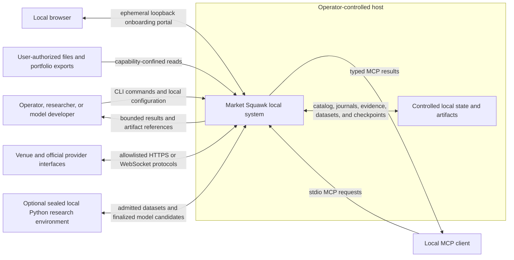
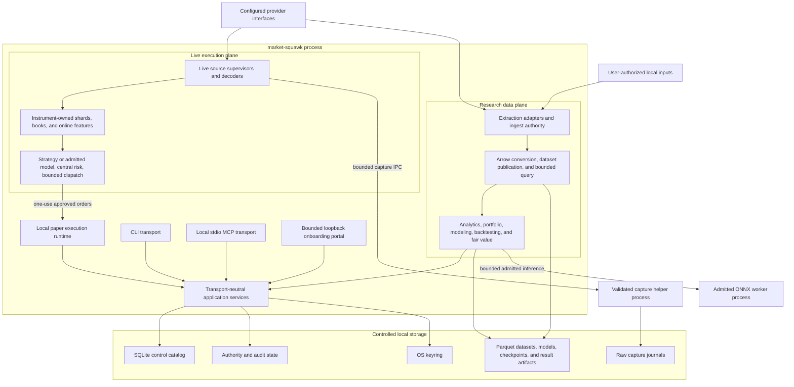

# Architecture Overview

Market Squawk is a local-first market-data, research, analytics, modeling, portfolio, valuation,
and paper-execution system. This page defines its system boundary, architectural drivers, and
runtime containers before the reader descends into crate or protocol detail.

| Metadata | Value |
| --- | --- |
| Document type | Architecture overview |
| Audience | Operators, maintainers, integrators, security reviewers, and research users |
| Status | Current |
| Last substantive review | 2026-07-25 |
| Reviewed commit | `041175590bd2e4a357ea28d75c675c252d3b3746` |

## Contents

- [Scope](#scope)
- [Architectural drivers](#architectural-drivers)
- [System context](#system-context)
- [Runtime containers](#runtime-containers)
- [Cross-plane invariants](#cross-plane-invariants)
- [Failure and recovery posture](#failure-and-recovery-posture)
- [Trust and authority](#trust-and-authority)
- [Related documentation and code](#related-documentation-and-code)
- [External sources](#external-sources)

## Scope

This page covers:

- the people, external interfaces, and local resources that cross the Market Squawk boundary;
- the live, research, and control-plane separation;
- the runtime responsibilities inside the local process; and
- system-wide safety, persistence, and authority invariants.

It does not define command syntax, provider coverage, tool schemas, detailed event sequencing, or
operating procedures. Those contracts belong in the focused architecture, operations, and
reference pages. The [delivery ledger](../plans/delivery-ledger.md) is the sole mutable authority
for release blockers and acceptance state.

## Architectural drivers

### Local-first cost and deployment boundary

The complete release requires no paid software, paid API, cloud service, external database
service, container runtime, or telemetry infrastructure. Hardware, local storage, electricity, and
internet access are outside that software-cost boundary. A provider may require a free account,
credential, contact identity, or provider-controlled consent step; that requirement is recorded
separately from software and API cost.

All durable product state is local by default. Network access is limited to explicitly configured
provider interfaces and provider-controlled onboarding handoffs. The baseline analytical database
is embedded SQLite plus local Parquet, not a remote service. MCP uses local stdio. Structured logs
remain local process output, and the application emits no analytics beacon.

The adapter boundary is replaceable. Provider availability, coverage, rights, and protocol
differences are represented as metadata and evidence rather than hidden behind a universal source
claim.

### Independent live and research pipelines

The live execution plane and research data plane share invariant-preserving identities, financial
types, time semantics, quality classifications, provenance, and pure mathematical kernels. They do
not share ingestion lifecycles:

- live processing begins with current source-session and capture authority, owns mutable
  instrument state, and may reach strategy and central risk;
- research processing begins with discovery/extraction authority, publishes immutable analytical
  generations, and supports historical analysis, Python, models, and backtests; and
- historical data is not required to originate from or reproduce the live feed.

That separation prevents storage, query, and training workloads from entering the live
event-to-decision path while allowing both planes to agree on financial meaning.

### Evidence-derived authority

A quality label, connection heartbeat, computed price, fair-value classification, or historical
observation is not an execution capability. Current automated action requires evidence owned and
revalidated by the live runtime, then an intent admitted by central risk and a private one-use
dispatch boundary. At the reviewed commit, Coinbase and Kraken remain capped at
`DirectUnverified` on their public compatibility paths. The distinct authenticated Coinbase Direct
container can derive `DirectVerified` authority only from an exact current onboarding generation
and complete runtime evidence; revocation or any integrity/liveness failure cancels that authority
before further market or execution operations.

### Bounded ownership

Count, retained-byte, time, and result limits are fixed before work begins. Mutable live state is
single-writer. Control-plane requests carry deadlines and cancellation. Saturation and uncertain
termination have explicit fail-closed consequences rather than silent loss or detached work.

## System context

The context view answers: who and what exchanges information with the local Market Squawk system?

The system has no required inbound network service. The only current HTTP listener is an
ephemeral IPv4 loopback provider-onboarding portal with a bounded lifetime, request count,
connection count, request body, session cookie, and CSRF check. MCP is not a network listener; it
uses the process's standard input and output. Provider feeds and official research interfaces are
outbound, allowlisted connections.

User files enter through an explicitly authorized root and stable file identity. Python operates
outside the live path and consumes only catalog-authorized point-in-time exports. Finalized model
candidates must cross the Rust admission boundary before they can become an immutable model
generation.

The reviewed release has no live broker-order adapter. The execution endpoint is the local,
risk-enforced paper engine. Any future live-money adapter must preserve the same private
approval/dispatch boundary and require explicit configuration.

## Runtime containers

The runtime-container view answers: which local runtimes and stores own the major responsibilities?

CLI and MCP are transports over the same immutable set of 11 application-domain services. They do
not call adapters or storage engines directly. The application composition fails before either
transport is published if a required domain implementation is missing or duplicated.

The live runtime starts its shards and initial immutable snapshots before feed ingress escapes.
Each source generation obtains current registry and capture authority, binds its routes before the
provider connection is opened, and emits provider-normalized evidence to the owning shard. A
synchronous action hook may run in-memory strategy/model logic and risk, but it hands an approved
order to a bounded dispatcher; the adapter call occurs in the execution worker rather than the
shard actor.

The research runtime discovers and extracts bounded source objects, normalizes canonical
observations, publishes versioned Arrow/Parquet generations under catalog authority, and exposes
bounded DataFusion or typed application reads. Portfolio, modeling, backtesting, and fair-value
services retain their own producer evidence rather than manufacturing values at the application
boundary.

Capture and ONNX helpers are restricted sibling executables, not general plugin hosts. Capture I/O
is isolated so a blocked writer can be terminated and reaped without waiting in the market-event
path. The ONNX helper receives only an admitted bounded model protocol and is used only when a
validated model generation requires it.

## Cross-plane invariants

| Invariant | Consequence |
| --- | --- |
| Financial values retain currency, tick/lot scale, or analytical units | Inexact conversion or incompatible units fail at the boundary rather than rounding silently. |
| Fair-value hierarchy, market depth, data quality, and execution authority remain separate | A Level 1 valuation or deep book never becomes execution eligibility by implication. |
| Live and research pipelines share semantics, not mutable runtime state | Research I/O or revision history cannot block or recreate current live authority. |
| Every execution path crosses central risk | Strategies, models, CLI, MCP, and adapters cannot construct an approved or dispatch order. |
| Current authority is opaque, non-serializable, generation-bound, and revocable | Replayed, archived, stale, or caller-authored evidence cannot authorize an action. |
| Mutable live state has deterministic single-writer ownership | Book, feature, and strategy transitions are ordered per instrument route. |
| Queues and result surfaces are bounded | Saturation returns a typed failure and invalidates or suppresses the affected action where integrity requires it. |
| Publication is lease-controlled and manifest-driven | Durable objects are verified before reader authority is committed; readers pin a known generation and directory contents alone never establish completeness. |
| CLI and MCP share application descriptors | Transport differences cannot create a second business-authority path. |

## Failure and recovery posture

Market Squawk fails closed at authority boundaries and isolates recoverable failures by plane:

- a live sequence gap, checksum mismatch, freshness failure, capture failure, queue overflow, or
  source-generation change prevents executable action and requires source-specific
  resynchronization;
- a strategy, model, risk, audit, or dispatch-admission failure produces no adapter call;
- a provider outage or quarantined onboarding recipe disables that provider without preventing
  unrelated research, portfolio, valuation, or control domains from starting;
- an interrupted research publication is recovered from catalog and object-store authority; a
  partially staged file is not inferred to be a committed dataset;
- model, portfolio, backtest, fair-value, and paper-execution state is reopened through
  digest-bound local authority and explicit recovery contracts; and
- shutdown first stops admission and invalidates authority, then drains or reaps owned tasks under
  deadlines. Uncertain helper termination remains unavailable rather than being detached.

These are architectural behaviors, not a release-approval claim. Prior exact-head and current
focused evidence are summarized in the [delivery ledger](../plans/delivery-ledger.md); final
integrated performance, fuzz, security, and release evidence remains a separate release gate.

## Trust and authority

The operator controls the host, configuration, local data root, and provider credentials. Provider
responses, WebSocket frames, local input files, model artifacts, MCP requests, and browser requests
are untrusted until admitted by their bounded parser and evidence contract.

Secrets are represented by opaque references and resolved through the OS keyring in the reviewed
application composition. Secret values are redacted and zeroized and do not enter MCP results,
artifacts, or logs. Provider onboarding keeps credential state, rights evidence, technical
connectivity, and activation authority independent.

The local state directory is trusted only through retained directory/file capabilities, exact
identity checks, no-follow opens, immutable digests, and transactional or crash-consistent
publication. A path string or serialized quality record is never sufficient authority.

See [Security and trust boundaries](security-and-trust-boundaries.md) for the detailed boundary
map and [Data, time, and provenance](data-time-and-provenance.md) for evidence and point-in-time
semantics.

## Related documentation and code

Architecture:

- [Building blocks and dependency boundaries](building-blocks.md)
- [Live execution plane](live-execution-plane.md)
- [Research data plane](research-data-plane.md)
- [Local control plane](control-plane.md)
- [Deployment](deployment.md)
- [Quality attributes](quality-attributes.md)

Primary implementation anchors:

- [Workspace manifest](../../Cargo.toml)
- [Shared domain contracts](../../crates/market-squawk-domain/src/lib.rs)
- [Local product composition](../../apps/market-squawk/src/local_product/mod.rs)
- [Transport-neutral application services](../../apps/market-squawk/src/application.rs)
- [Live runtime ownership](../../apps/market-squawk/src/live_runtime.rs)
- [Research service composition](../../apps/market-squawk/src/research_service.rs)
- [Execution-owned live action hook](../../crates/market-squawk-execution/src/live_hook.rs)
- [Controlled local paths](../../crates/market-squawk-platform/src/paths.rs)
- [Provider activation evidence validation](../research/2026-07-23-provider-activation-evidence-validation.md)

## External sources

| Source | Relevance | Reviewed |
| --- | --- | --- |
| [C4 model: diagrams](https://c4model.com/diagrams) | Context and container views use one abstraction level and label material relationships. | 2026-07-23 |
| [GitHub: creating diagrams](https://docs.github.com/en/get-started/writing-on-github/working-with-advanced-formatting/creating-diagrams) | GitHub renders the stable Mermaid flowcharts used on this page. | 2026-07-23 |
| [Tokio runtime documentation](https://docs.rs/tokio/latest/tokio/) | The local asynchronous runtime owns tasks, cancellation, channels, and blocking boundaries. | 2026-07-23 |
| [Apache DataFusion introduction](https://datafusion.apache.org/user-guide/introduction.html) | DataFusion is an embeddable Arrow-based analytical query engine rather than an external database service. | 2026-07-23 |
