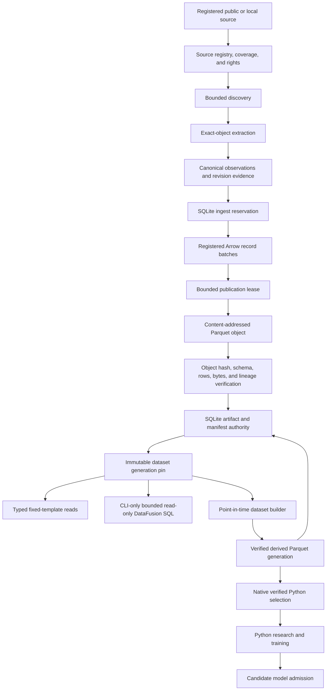
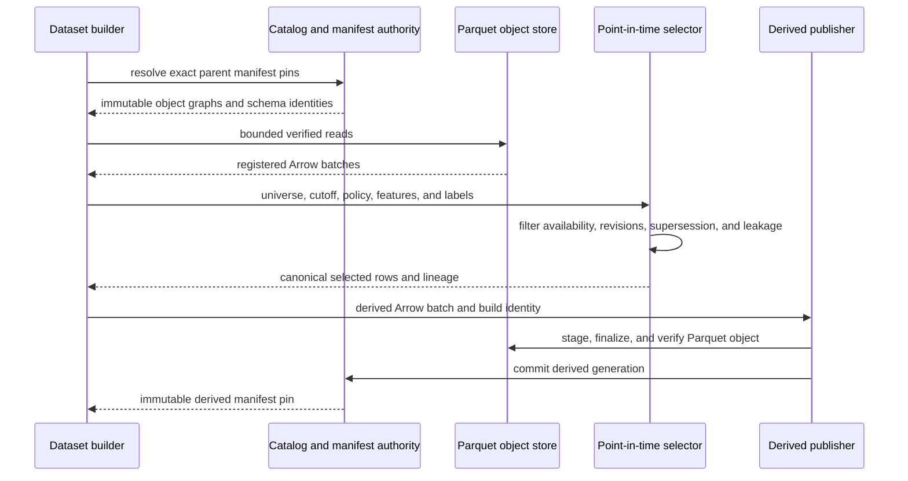

# Research data plane

Market Squawk's research data plane acquires source objects, preserves revision and provenance
semantics, publishes immutable Parquet generations, and serves bounded analytical and modeling
workflows. It is deliberately separate from the live execution plane: research data does not have
to originate from the live feed and cannot acquire live execution authority through publication.

| Metadata | Value |
| --- | --- |
| Document type | Architecture |
| Audience | Data engineers, quantitative researchers, adapter authors, model engineers, reviewers |
| Status | Current |
| Last substantive review | 2026-07-23 |
| Reviewed commit | `836aae662dfbbc3cf40e94e6da6c5c37cd3b57bd` |

## Contents

- [Scope](#scope)
- [Publication and consumption flow](#publication-and-consumption-flow)
- [Building blocks](#building-blocks)
- [Publication authority](#publication-authority)
- [Point-in-time construction](#point-in-time-construction)
- [Query and Python boundaries](#query-and-python-boundaries)
- [Failure and recovery](#failure-and-recovery)
- [Security and authority](#security-and-authority)
- [Related documentation and code](#related-documentation-and-code)
- [External sources](#external-sources)

## Scope

This plane owns:

- registered extraction-source discovery and exact-object extraction;
- source rights, coverage, bounded requests, and revision evidence;
- canonical research observations and registered Arrow schemas;
- immutable, content-addressed Parquet objects and versioned dataset manifests;
- SQLite catalog authority for sources, reservations, artifacts, manifests, lineage, and run state;
- fixed-template reads and bounded CLI-only DataFusion SQL;
- point-in-time dataset construction, corporate-action policy, leakage checks, and reproducible
  derived generations;
- verified native export to Python research/training and admission of model candidates.

It does not own live socket processing, live order books, immediate signal authority, pre-trade risk,
or execution-adapter calls. It also does not make a historical provider mirror a live provider.
Replay can consume captured evidence for diagnostics, but it is not the organizing principle of
research storage.

## Publication and consumption flow

The coordinator discovers a bounded set of objects and then extracts one exact selected object. The
extraction batch is bound to source metadata, rights, content identity, and explicit revision
evidence before Arrow conversion. Publication writes and verifies a content-addressed Parquet
object, then commits artifact and manifest authority. Readers select an immutable manifest pin
rather than scanning whatever files happen to be present.

The production coordinator currently composes SEC, FRED/ALFRED, BLS, US Treasury, file, and
portfolio extraction authorities. Provider-specific adapters retain their own discovery,
extraction, revision, and coverage semantics; the shared plane begins at the registered extraction
contracts and canonical observations.

## Building blocks

| Building block | Responsibility | Boundary or invariant |
| --- | --- | --- |
| Production research coordinator | Selects a registered adapter, validates source registration and rights, and applies discovery/extraction bounds | An extraction request identifies one registered source and exact source object |
| Extraction adapter | Discovers source objects and returns an `ExtractionBatch` with source-specific evidence | Provider formats do not become canonical records without checked conversion |
| Revision authority | Assigns revisions from provider evidence or explicit local observation | Network sources require explicit revision evidence; local file and portfolio sources use locally observed revisions |
| Catalog authority | Reserves idempotent ingest identities, persists source rights, and owns terminal run state | A reservation is bound to source, operation, payload digest, and request identity |
| Arrow conversion registry | Converts validated observations to registered schemas and computes lineage | Accounting values retain decimal semantics; schema/version mismatches fail |
| Parquet object store | Stages, finalizes, verifies, reads, compacts, and quarantines controlled objects | Objects are content-addressed and confined to the authorized artifact root |
| Manifest catalog | Plans and commits immutable dataset generations | A generation identifies its schema and complete object graph |
| Query service | Executes one validated read-only statement against one immutable pin | Relations, rows, bytes, memory, partitions, AST, plan, deadline, and cancellation are bounded |
| Dataset builder | Selects historical universes, performs point-in-time joins, applies policies, and publishes derived rows | Build inputs, policy, feature/label versions, universe, and source generations are digest-bound |
| Python dataset authority | Revalidates catalog, manifest, objects, selected rows, values, and lineage before export | Python receives bounded immutable data, not catalog or artifact-root authority |
| Model admission boundary | Accepts a candidate only after independent native validation of bundle identity and evidence | Training output is a candidate, never self-authorizing live runtime state |

Arrow is the in-memory interchange layer, Parquet is the durable analytical object format,
DataFusion is the embedded query engine, and SQLite owns control-plane authority. None of these
components is queried or written per live event.

## Publication authority

Physical file existence is not publication authority. A successful ingest has three distinct
states:

1. A rights-bound ingest reservation establishes the exact source operation and payload identity.
2. A publication lease creates and verifies the content-addressed Parquet object under the
   controlled root.
3. Catalog artifact authority and the immutable manifest generation are committed, after which the
   ingest run is completed successfully.

Readers discover data through the committed manifest, not directory enumeration. A Parquet object
that exists without a committed manifest is therefore not a readable dataset generation. Recovery
reconciles idempotent committed runs and quarantines eligible orphan objects after the configured
grace and validation rules.

The publication contract preserves:

- registered schema name, version, and fingerprint;
- dataset and manifest generation identity;
- object content hash, row count, byte count, and lineage digest;
- source, extraction, rights, revision, and run identities;
- immutable object graph and generation kind (`Ingest`, `Compaction`, or `Derived`);
- terminal success/failure state that prevents conflicting replay.

Compaction produces a new immutable generation from an exact pinned parent. It does not mutate the
parent or weaken lineage. Consumers can continue reading a prior pin while a later generation is
being published.

## Point-in-time construction

The dataset builder consumes exact parent manifest pins and a digest-bound build specification. It
selects each fact using its information-availability semantics, not only its economic effective
date.

Selection distinguishes `effective_at`, `published_at`, `available_at`, `ingested_at`, revision,
and `superseded_at`. The builder also binds historical-universe membership, delistings,
corporate-action treatment, label definition, train/validation/test boundaries, warm-up and null
policies, and feature versions. A row that was not available at its cutoff cannot be selected
merely because its effective date is earlier.

The output is a reproducible Parquet generation whose manifest, universe digest, policy digest,
build-spec digest, feature/label identity, and lineage can be revalidated before query, Python
export, model admission, or backtesting.

## Query and Python boundaries

### DataFusion

The local query service accepts one statement and one exact manifest generation. It permits
read-only `SELECT`, common-table-expression, subquery, and `EXPLAIN` forms after syntax-tree and
relation validation. It applies explicit limits to SQL bytes, result rows and bytes, retained
memory, partitions, syntax-tree nodes, plan nodes, elapsed time, and cancellation.

General read-only DataFusion SQL is a CLI-only operator capability. MCP exposes typed application
operations with closed schemas and bounded results; it does not expose a general SQL operation.
The query engine has an authority-gated artifact-publication mode for large results. The reviewed
public CLI and fixed-template application/MCP query compositions do not supply that authority:
they return inline results within their configured bounds and reject a result that would require
artifact publication with `ArtifactAuthorityRequired`.

### Python

Python is a research and training consumer, not a live runtime dependency. Native Rust code first:

- resolves the exact admitted dataset generation;
- verifies catalog and artifact-root identity;
- reopens and hashes the pinned object set;
- validates registered Arrow schemas and selected row identities;
- preserves decimal mantissa/scale and explicit missing-value reasons;
- enforces aggregate row, byte, deadline, and cancellation bounds.

The Python layer performs deterministic data loading, financial research, and model training from
that verified selection. It emits a candidate model and evidence. Independent native admission
validates the model bundle before it can enter the model registry; Python never calls a live
strategy, risk service, or execution adapter.

## Failure and recovery

| Failure | Immediate consequence | Recovery |
| --- | --- | --- |
| Unknown source, object, or expired rights | Discovery/extraction or reservation is rejected | Correct source registration/rights and issue a new bounded request |
| Discovery or extraction bound exceeded | Operation stops without publication | Narrow the request or select a smaller exact source object |
| Payload or revision evidence mismatch | Reservation cannot be consumed | Re-extract the exact object with valid evidence |
| Canonical conversion or schema failure | No Arrow batch is published | Correct the adapter boundary or register an intentional schema version |
| Cancellation or deadline before commit | No new manifest becomes readable | Retry idempotently with the same exact input or begin a new request |
| Parquet write, hash, or metadata failure | Object is not bound into a readable generation | Repair local storage and retry; orphan recovery handles abandoned objects |
| Artifact committed but manifest/run reconciliation interrupted | Readers retain prior pins; partial state is reconciled by exact identity | Idempotent recovery completes the matching run or reports conflict |
| Conflicting replay | Operation fails rather than appending ambiguous history | Investigate source/object/payload identity and use the correct revision |
| Point-in-time leakage or policy violation | Derived generation is not admitted | Correct the build specification or source time semantics |
| DataFusion limit, cancellation, or invalid SQL | Query stops; source generation remains unchanged | Use a bounded valid read-only query |
| Python object or row verification failure | Export/training is rejected | Restore the admitted object set or rebuild a valid immutable generation |
| Model-candidate validation failure | Candidate remains outside the admitted registry | Retrain or correct bundle evidence, then repeat native admission |

Backup and recovery treat the SQLite catalog, its transactional companion files when present, and
the controlled artifact root as one authority set. Restoring only Parquet files does not recreate
published manifests; restoring only the catalog does not recreate verified object content.

## Security and authority

- Source endpoints, credentials where applicable, rights, coverage, and provider identity are
  validated before extraction.
- Local file and portfolio adapters receive explicit path capabilities, and dataset code operates
  only through those confined roots and selected objects.
- Catalog and artifact roots are opened through hardened local-path authority, with writer
  serialization and controlled relative references.
- Content hashes prove identity and detect mismatch; they do not replace source-rights or schema
  validation.
- Every expensive stage accepts cancellation and enforces bounded rows, objects, bytes, memory, or
  elapsed time as applicable.
- Query and Python consumers receive immutable pins and constrained readers rather than mutable
  catalog, raw SQLite connection, or artifact-root capabilities.
- Research quality remains research evidence. Neither a successful publication nor a favorable
  model result can create the `DirectVerified` capability required by live risk.

## Related documentation and code

Architecture:

- [Architecture overview](overview.md)
- [Building blocks](building-blocks.md)
- [Live execution plane](live-execution-plane.md)
- [Data, time, and provenance](data-time-and-provenance.md)
- [Security and trust boundaries](security-and-trust-boundaries.md)
- [Quality attributes](quality-attributes.md)
- [ADR 0001: Separate live and research planes](decisions/0001-separate-live-and-research-planes.md)
- [ADR 0004: Local analytical storage stack](decisions/0004-local-analytical-storage-stack.md)

Current implementation anchors:

- [Production research-ingest coordinator](../../apps/market-squawk/src/application/research/ingest.rs)
- [Research service composition](../../apps/market-squawk/src/research_service.rs)
- [Rights-bound analytical ingestion](../../crates/market-squawk-data/src/ingest.rs)
- [Registered Arrow conversion](../../crates/market-squawk-data/src/arrow_convert.rs)
- [Controlled Parquet object store](../../crates/market-squawk-data/src/parquet_store.rs)
- [Immutable manifest catalog](../../crates/market-squawk-data/src/manifest.rs)
- [Point-in-time dataset builder](../../crates/market-squawk-data/src/dataset_builder.rs)
- [Point-in-time selection](../../crates/market-squawk-data/src/pit.rs)
- [Bounded DataFusion query service](../../crates/market-squawk-data/src/query.rs)
- [Native Python-dataset authority](../../crates/market-squawk-data/src/python_dataset.rs)
- [Python dataset consumer](../../python/market_squawk/data.py)
- [Python training boundary](../../python/market_squawk/training.py)

Evidence and operations:

- [Project memory and delivery invariants](../project-memory.md)
- [Delivery ledger](../plans/delivery-ledger.md)
- [Research ingestion](../operations/research-ingestion.md)
- [Datasets and query](../operations/datasets-and-query.md)
- [Model inference](../operations/model-inference.md)
- [Time and provenance reference](../reference/time-and-provenance.md)

## External sources

These sources define dependency semantics; the reviewed code remains authoritative for Market
Squawk behavior.

| Source | Architectural use | Reviewed |
| --- | --- | --- |
| [Apache Arrow columnar format](https://arrow.apache.org/docs/format/Columnar.html) | Language-independent in-memory schema, array, and record-batch semantics | 2026-07-23 |
| [Apache Parquet format documentation](https://parquet.apache.org/docs/) | Durable columnar file and metadata semantics | 2026-07-23 |
| [Apache DataFusion SQL reference](https://datafusion.apache.org/user-guide/sql/) | Embedded analytical SQL surface; Market Squawk applies a smaller read-only grammar and stricter local bounds | 2026-07-23 |
| [SQLite transaction documentation](https://www.sqlite.org/lang_transaction.html) | Transaction and single-writer semantics for local catalog authority | 2026-07-23 |
