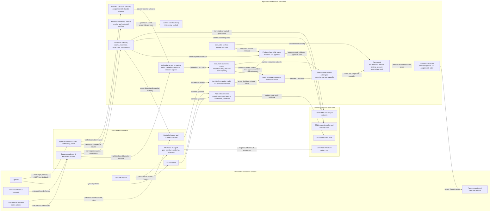

# Security and Trust Boundaries

Market Squawk is self-hosted, but local does not mean trusted. Provider responses, imported files,
model artifacts, CLI/MCP requests, browser-originated onboarding requests, persisted state, and
execution intent all cross explicit validation or authority boundaries before they can affect
durable state or an order adapter.

| Field | Value |
| --- | --- |
| Document type | Security architecture explanation |
| Audience | Maintainers, security reviewers, operators, adapter authors, and integrators |
| Status | Current |
| Last substantive review | 2026-07-23 |
| Reviewed commit | `836aae662dfbbc3cf40e94e6da6c5c37cd3b57bd` |

## Contents

- [Scope and non-goals](#scope-and-non-goals)
- [Trust model](#trust-model)
- [Trust-boundary flow](#trust-boundary-flow)
- [Boundary responsibilities](#boundary-responsibilities)
- [Credential boundary](#credential-boundary)
- [Source and parser authority](#source-and-parser-authority)
- [Model, portfolio, and fair-value authority](#model-portfolio-and-fair-value-authority)
- [Mandatory risk and execution authority](#mandatory-risk-and-execution-authority)
- [CLI, MCP, artifacts, and audit](#cli-mcp-artifacts-and-audit)
- [Failure and recovery](#failure-and-recovery)
- [Security invariants](#security-invariants)
- [Related documentation and code](#related-documentation-and-code)
- [External sources](#external-sources)

## Scope and non-goals

This page describes the current process and data trust boundaries for credentials, source bytes,
normalization, source authority, model admission and inference, portfolio and fair-value evidence,
central risk, local CLI/MCP transports, controlled artifacts, audit, and local stores.

It does not claim:

- that inherited stdio authenticates an MCP peer;
- that an ordinary local process can defend against a fully compromised operating-system account,
  kernel, compiler, or hardware;
- that a digest alone establishes who authored content;
- that loopback binding replaces host/origin/session/CSRF and request-bound checks;
- that an archived `DirectVerified` value is a bearer credential; or
- that a fair-value classification, market-depth level, or healthy connection grants execution
  authority.

The deployment trusts the operator to control the local account and installation roots. Within that
boundary, Market Squawk still treats data and requests as untrusted and confines authority by type,
lifecycle, exact identity, resource limits, and durable evidence.

## Trust model

Authority is narrow and non-transitive:

- A parser may create a validated value, but it cannot register a source.
- A registered source may produce a current captured batch, but it cannot mint a live execution
  capability.
- A model may produce a score or no-action result, but it cannot submit an order.
- A strategy may produce a bounded `OrderIntent`, but it cannot construct an `ApprovedOrder`.
- Risk may approve after consuming live authority and reserving account/portfolio state, but only
  the dispatcher can construct the adapter-facing `DispatchOrder`.
- MCP and CLI may invoke registered application services; secret storage, capability-confined file
  access, catalog publication, risk approval, and adapter submission remain with their dedicated
  services.

Serializable evidence explains what happened. Process-local capabilities authorize what may happen
now. Serialization, replay, restart, copying, or a matching enum value cannot reconstruct a
process-local capability.

## Trust-boundary flow

The diagram answers: where do untrusted data and local requests cross into progressively narrower
Market Squawk authorities?

In prose: requests and bytes enter through bounded transports and parsers. Application services
admit only registered operations and route them to domain authorities. Source registration and
current-session evidence precede live qualification; research publication requires catalog and
manifest authority. Models, portfolios, and valuations retain independent evidence chains.
Strategies emit intents only. Central risk consumes current live authority, binds the current
portfolio revision, reserves account capacity, and writes audit evidence. The dispatcher performs
the final rechecks and alone creates the value accepted by an execution adapter. Durable output is
restricted to capability-confined catalog, dataset, artifact, authority-state, and audit stores.

## Boundary responsibilities

| Boundary | Untrusted or lesser-authority input | Required transition | Failure consequence |
| --- | --- | --- | --- |
| Credential | Submitted secret value, platform prompt outcome, opaque reference | Generation-bound store operation under owner, interaction policy, cancellation, deadline, and exact backend | No source activation; indeterminate mutation requires reconciliation |
| Provider/file | Network frame, response body, imported bytes, provider timestamps and identifiers | Size/framing limits, strict parse, exact decimal/identifier conversion, evidence digest, schema validation | Reject object or quarantine affected stream; no publication |
| Source authority | Parsed live candidate and caller configuration | Code-owned metadata/rights/coverage, endpoint and protocol profile, current session, capture receipt, health and generation leases | No current batch; stale or conflicting authority remains disabled |
| Live qualification | Current captured batch | Sequence/snapshot/checksum/freshness/status/precision/book checks in the owning shard | `Stale` or `Quarantined`; executable signals and capabilities are revoked |
| Research publication | Canonical observations and extraction evidence | Rights admission, idempotent ingest reservation, Arrow schema, manifest/hash, catalog-controlled publication | No authoritative dataset generation |
| Model | Bundle, authority document, dataset selection, optional runtime | Exact hashes, closed feature/schema identity, controlled roots, graph/tensor/resource policy, warm-up | No model generation or audited no-action; no intent |
| Portfolio | Source records and calculated accounting state | Preserve raw record, reconcile, publish immutable revision and content identity | Import or publication rejected; risk cannot bind the account |
| Fair value | Live/research/analytics/portfolio producer evidence | Producer-specific receipt, time/evidence verification, code-owned ruleset, approval/revocation | `Unclassified` or rejected approval; never promotes execution quality |
| Risk and dispatch | Intent, current live capability, market state, portfolio/account state | Mandatory audit admission, policy checks, reservation, expiry/revocation rechecks, one-use dispatch | Rejection, released reservation, or reconciliation-required state; no unchecked adapter call |
| CLI/MCP | Local arguments or JSON-RPC bytes | Closed descriptor, structural/result bounds, cancellation/deadline, domain service, audit | Typed error or controlled session exit |
| Artifact/audit/store | Result bytes or state transition | Capability-relative no-follow path, immutable/content-addressed publication, durable reservation/transaction | No overwrite or partial authority; recovery is exact and bounded |

## Credential boundary

Credential material is not ordinary configuration:

- `SecretValue` is redacted, zeroized on drop, bounded in memory, and not serializable as a
  reusable credential record.
- `SecretRef` exposes only backend class and generation; its backend locator is opaque in debug and
  catalog-safe metadata.
- Creation, read, replacement, and deletion use exact generations. Replacement does not silently
  erase the current generation before the candidate is known.
- The reviewed `LocalProduct` composes the operating-system keyring first and a code-owned,
  initially locked encrypted-file fallback. Only an explicit foreground loopback-portal operation
  can submit the fallback unlock; configuration, environment, command arguments, disk, and
  background restart cannot.
- A new secret can use the unlocked fallback only after the primary backend proves unavailable or
  unable to provide the exact lifecycle.
- Once a reference exists, its backend is authoritative. The router does not probe another backend
  with that reference or copy secret bytes between stores.
- Interaction policy distinguishes a forbidden prompt from an explicitly permitted
  platform-managed prompt.
- Cancellation and deadlines are checked at operation boundaries. If a mutation may have completed
  when cancellation or expiry is observed, the result is `IndeterminateCompletion`, not a false
  rollback claim.

The onboarding portal binds only an ephemeral IPv4 loopback port. It additionally validates host
and origin, uses independently generated session and CSRF tokens, limits lifetime, connections,
requests, body sizes, and request duration, and cancels in-flight work on shutdown. Loopback is one
control, not the sole control.

## Source and parser authority

Provider and file bytes remain untrusted through parsing. Source-specific decoders retain numeric
lexemes, sequence/snapshot/checksum fields, timestamps, and status evidence; they do not pre-assert
a canonical book or executable quality. Research adapters normalize into `ResearchObservation`
with source-authored time precision and explicit availability evidence.

The authoritative source registry independently validates:

- immutable metadata and revision evidence;
- rights and authorization subject;
- provider-wide budget identity and durable budget state;
- explicit venue/instrument/event/depth coverage;
- endpoint and protocol profile;
- session generation, health epoch, and current deadlines; and
- the exact capture receipt for the frame and payload digest.

Only then can it produce an owned, non-serializable current batch. The live shard repeats the
stateful integrity and precision checks before it can issue a process-local execution capability.
Stream gaps, checksum mismatch, staleness, invalid precision, crossed books, capture degradation,
queue saturation, actor exit, or authority rollover invalidate the affected allocation and require
source-specific resynchronization.

## Model, portfolio, and fair-value authority

### Model admission and inference

Model admission binds exact artifact and metadata hashes to the code-owned feature registry,
training environment, catalog-backed point-in-time dataset selection, and an independently hashed
authority document. Restart recovery revalidates the retained authorities and dataset rather than
trusting an in-memory registration.

Native inference reads one admitted immutable bundle and performs bounded finite arithmetic. ONNX
inference preflights graph/tensor/element limits, uses a model-owned bounded helper, and binds
warm-up and runtime-semantics evidence. An input mismatch, non-finite value, worker failure,
deadline, or uncertain termination produces no model action. Model output remains an input to a
strategy, never an order authority.

### Portfolio evidence

Portfolio imports preserve exact source artifacts, normalize evidence, reconcile supplied totals,
and publish immutable account revisions. Execution risk reads through a bounded capability,
captures the current revision token, content digest, account/currency identity, and publication
generation, then rechecks the binding before reservation and dispatch. Rollback, resurrection,
revocation, or successor mismatch fails closed.

### Fair-value evidence

Fair-value input publishers accept producer-derived receipts from live, research, analytics, or
portfolio authorities. Each input retains its source, payload digest, producer-specific origin,
time fields, verification state, and evidence hash. The code-owned ruleset evaluates measurement
date, identity, quoted/unadjusted price, activity, access, freshness, currency/scale/amount, venue,
and source evidence.

`FairValueHierarchy`, `MarketDepth`, `DataQuality`, `StreamIntegrityState`, and the live
process-local execution capability remain separate. A valid Level 1 conclusion is accounting
evidence; it is neither `DirectVerified` nor an executable capability. Level 2, Level 3, modeled,
proxy, stale, adjusted, or unverified inputs remain available for governed analysis without
promotion.

## Mandatory risk and execution authority

The execution boundary is enforced by type construction and ownership:

1. A strategy receives authority-free committed market context and emits a fixed-capacity set of
   validated `OrderIntent` values or an audited no-action fact.
2. An automated intent must require `DataQuality::DirectVerified`, but that enum requirement alone
   is insufficient.
3. `RiskService::evaluate` consumes the actor-issued `LiveExecutionCapability` through the current
   authority gate, admits audit capacity, obtains trusted time, applies policy and market limits,
   binds current portfolio state, evaluates account exposure, and atomically reserves capacity.
4. Only risk can construct the non-cloneable, non-serializable `ApprovedOrder`.
5. The dispatcher moves the approval through bounded count/byte admission, rechecks live authority,
   reservation, expiry, portfolio binding, and idempotency, and alone constructs `DispatchOrder`.
6. `ExecutionAdapter::submit` accepts only `DispatchOrder`. Known rejection, known no-attempt
   failure, and uncertain outcome are separate states; uncertain attempts require reconciliation.

Central risk is a logical process-local authority, not a claim that risk is a separate network
service. Strategies, models, adapters, CLI, MCP, replay, and persisted records have no alternate
constructor or direct submission path.

## CLI, MCP, artifacts, and audit

CLI and MCP share the same lifecycle-owned `Application` and its complete set of eleven domain
services. Each operation is defined by a closed descriptor and admitted before dispatch to a domain
service. Services own their financial, persistence, and authority invariants; transports own only
framing and presentation.

The production MCP server:

- uses inherited local stdio and honestly records the peer identity as unverified;
- incrementally bounds frames and JSON structure before service execution;
- bounds active request count, aggregate body/result memory, writer queues, inline results,
  progress, deadlines, and shutdown;
- propagates cancellation into transport-neutral request contexts;
- reserves durable audit evidence before a governed mutation;
- gives MCP only a path-free artifact repository; and
- returns opaque content identity and metadata, never an ambient path or directory handle.

The application artifact repository publishes content-addressed immutable files below the retained
`ArtifactRoot`, uses capability-relative no-follow operations, private file creation, durable
synchronization, and post-publication content verification. `ArtifactRoot` rejects absolute,
noncanonical, escaping, device-name, alternate-separator, or over-depth references.

MCP audit records omit payloads. They retain hashed request identity/content, the registered
operation and version, bounds, local identity class, lifecycle phase, time, and terminal result.
Mutation admission reserves admission, service-completion, and delivery-completion records before
authority is granted.

## Failure and recovery

| Failure | Recovery boundary |
| --- | --- |
| Secret mutation completion is indeterminate | Reconcile the exact backend and generation before retry; never create a new inferred generation |
| Provider parse, sequence, snapshot, checksum, freshness, or capture failure | Quarantine the affected stream, invalidate current authority, obtain a fresh snapshot/session, and requalify |
| Catalog or local authority predecessor is unclean | Recover or reject the retained state before issuing new writer/source authority |
| Parquet or artifact publication is interrupted | Inspect exact staged/final content identity and complete or discard only through the owning publication protocol |
| Model bundle/runtime fails validation or execution | Keep the generation unadmitted or emit audited no-action; no fallback may weaken the admitted policy |
| Portfolio publication changes after risk evaluation | Recheck fails, order is rejected, and reserved account capacity is released |
| Audit capacity or persistence is unavailable | Mutation or risk approval is rejected before authority is issued |
| Adapter outcome is uncertain | Quarantine dispatch state and reconcile exact order identities before account replacement or retry |
| MCP frame/result/deadline bound is exceeded | Return a controlled resource/deadline result or end the session; do not emit a truncated authoritative result |
| Fair-value evidence is incomplete | Retain unverified evidence where allowed and classify conservatively; do not infer Level 1 or execution quality |

Recovery restores durable state and re-establishes authority; it does not deserialize old authority.
Live capabilities, risk approvals, secret-operation ownership, catalog writers, and artifact
publication contexts are process-local and must be newly admitted.

## Security invariants

- The live event-to-action path remains memory-resident; SQLite, DataFusion, Parquet, Python, MCP,
  LLM, persistence, and control-plane I/O stay outside that path.
- All execution-critical queues are count- and byte-bounded; saturation has an explicit
  invalidation or rejection consequence.
- Credentials are accessed only through exact secret-store operations and never returned by CLI,
  MCP, audit, or artifacts.
- Source metadata, rights, coverage, session, capture, and stream evidence are code-validated before
  executable quality is possible.
- Model admission and inference failure produces no automated action.
- Portfolio and fair-value evidence remain producer-bound and revision-bound.
- Every order adapter call follows intent, current live authority, central risk, account/portfolio
  reservation, audit, approval, and final dispatcher revalidation.
- MCP exposes only registered typed tools, bounded results, controlled artifacts, and durable audit.
- Local path authority is held as a directory capability; display paths and opaque references do
  not become ambient filesystem authority.

## Related documentation and code

- [Architecture overview](overview.md)
- [Live execution plane](live-execution-plane.md)
- [Research data plane](research-data-plane.md)
- [Control plane](control-plane.md)
- [Data, time, and provenance](data-time-and-provenance.md)
- [ADR 0002: Evidence-derived execution quality](decisions/0002-evidence-derived-execution-quality.md)
- [ADR 0005: Central risk and execution authority](decisions/0005-central-risk-and-execution-authority.md)
- [Secret-store contracts](../../crates/market-squawk-platform/src/secrets.rs)
- [Controlled local paths and artifacts](../../crates/market-squawk-platform/src/paths.rs)
- [Authoritative source registry](../../crates/market-squawk-sources/src/registry/catalog.rs)
- [Live execution capability](../../crates/market-squawk-live/src/authority.rs)
- [Model candidate admission](../../crates/market-squawk-modeling/src/admission.rs)
- [Portfolio execution binding](../../crates/market-squawk-execution/src/portfolio.rs)
- [Fair-value evidence](../../crates/market-squawk-valuation/src/evidence.rs)
- [Risk service](../../crates/market-squawk-execution/src/risk.rs)
- [Execution adapter boundary](../../crates/market-squawk-execution/src/adapter.rs)
- [MCP server and limits](../../crates/market-squawk-mcp/src/server.rs)
- [Production MCP audit sink](../../apps/market-squawk/src/mcp/audit.rs)
- [Provider activation evidence validation](../research/2026-07-23-provider-activation-evidence-validation.md)
- [Delivery ledger](../plans/delivery-ledger.md)

## External sources

These sources inform the threat-boundary and protocol/measurement treatment; the reviewed code
defines Market Squawk's current controls.

| Source | Relevance | Reviewed |
| --- | --- | --- |
| [OWASP threat-modeling guidance](https://owasp.org/www-project-security-culture/stable/6-Threat_Modelling/) | Uses data-flow diagrams and trust boundaries to identify where data changes trust level | 2026-07-23 |
| [Model Context Protocol transports specification](https://modelcontextprotocol.io/specification/2025-11-25/basic/transports) | Defines stdio transport responsibilities and process-bound message exchange | 2026-07-23 |
| [Model Context Protocol security best practices](https://modelcontextprotocol.io/docs/tutorials/security/security_best_practices) | Documents MCP-specific request, credential, and trust threats | 2026-07-23 |
| [FASB ASU 2011-04, Fair Value Measurement (Topic 820)](https://fasb.org/page/document?pdf=ASU2011-04.pdf&title=UPDATE+NO.+2011-04%E2%80%94FAIR+VALUE+MEASUREMENT+%28TOPIC+820%29%3A+AMENDMENTS+TO+ACHIEVE+COMMON+FAIR+VALUE+MEASUREMENT+AND+DISCLOSURE+REQUIREMENTS+IN+U.S.+GAAP+AND+IFRSS) | Establishes the accounting fair-value framework that remains separate from market-data execution authority | 2026-07-23 |
| [IFRS 13 Fair Value Measurement](https://www.ifrs.org/issued-standards/list-of-standards/ifrs-13-fair-value-measurement/) | Defines fair value and the input hierarchy independently of delivery quality and execution eligibility | 2026-07-23 |
