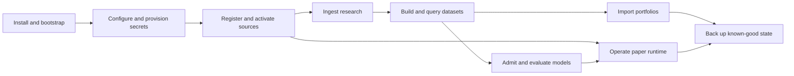

# Operations

These runbooks describe supported local Market Squawk tasks at the reviewed product commit. Each
procedure states preconditions, authority and safety checks, exact operations, success evidence, and
recovery behavior.

| Field | Value |
| --- | --- |
| Document type | Operations index |
| Audience | Local operators, analysts, integrators, and incident responders |
| Status | Current |
| Last substantive review | 2026-07-25 |
| Reviewed product commit | `041175590bd2e4a357ea28d75c675c252d3b3746` |

## Runbooks

| Runbook | Use it to… |
| --- | --- |
| [Installation and bootstrap](installation-and-bootstrap.md) | Build/install the local binaries, prepare a data root, and prove the product composes |
| [Configuration and secrets](configuration-and-secrets.md) | Compose validated configuration, inspect precedence, and understand the currently composed secret-store boundary |
| [Source operations](source-operations.md) | Register, set up, activate, inspect, and recover supported live and research sources |
| [Research ingestion](research-ingestion.md) | Admit local/provider research objects and publish provenance-bound observations |
| [Datasets and query](datasets-and-query.md) | Build point-in-time datasets, inspect manifests, and run bounded DataFusion queries |
| [Model inference](model-inference.md) | Install the training release, admit model bundles, and operate native/ONNX inference |
| [Portfolio and paper execution](portfolio-and-paper-execution.md) | Import/reconcile portfolios and operate the risk-enforced paper runtime |
| [Backup and recovery](backup-and-recovery.md) | Create a cold whole-root backup and restore it into a fresh validated root |
| [Troubleshooting](troubleshooting.md) | Identify the owning subsystem and perform evidence-preserving first response |

## Recommended sequence

The branches in this diagram are capability dependencies, not a claim that every release blocker
is closed. Consult the [delivery ledger](../plans/delivery-ledger.md) before treating the current
checkout as the complete first local release.

## Common operating rules

- Use one explicit configuration and data root throughout a workflow.
- Keep stdout for command results or MCP frames and stderr for local tracing.
- Treat confirmation as operator intent; rights, evidence, quality, model, portfolio, fair-value,
  risk, and execution authority remain independently required.
- Keep SQLite, artifacts, authority records, audits, and checkpoints under their owning services.
- Stop and reconcile active writers before cold backup or root migration.
- Record exact generation, revision, artifact, receipt, and checkpoint identities as success
  evidence.
- Preserve the first causal failure; repeated reconnect or shutdown messages are consequences until
  proved otherwise.

## Current operational ceiling

The current CLI and complete local stdio MCP are runnable across the documented product domains.
Public Coinbase and Kraken remain `DirectUnverified`. The separate authenticated Coinbase Direct
path can derive `DirectVerified` authority from an exact active onboarding generation and drive the
shipping fee-aware strategy through central risk and realistic paper execution. The runbooks do not
claim release acceptance until the authorized unchanged-head external trace is complete. Provider
onboarding completion and the remaining release acceptance work are tracked in the
[delivery ledger](../plans/delivery-ledger.md).

## Reference while operating

- [CLI commands and exit behavior](../reference/cli.md)
- [Configuration keys and precedence](../reference/configuration.md)
- [MCP tools and schemas](../reference/mcp.md)
- [Source capability and coverage](../reference/source-coverage.md)
- [Data-quality classes and transitions](../reference/data-quality.md)
- [Time and provenance fields](../reference/time-and-provenance.md)
- [Deployment and on-disk layout](../architecture/deployment.md)
- [Security and trust boundaries](../architecture/security-and-trust-boundaries.md)
