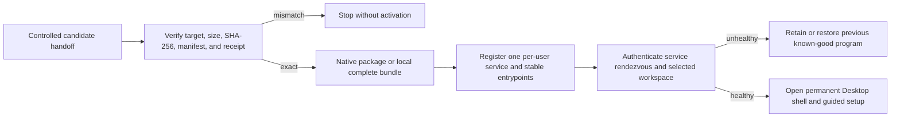

# Installation and bootstrap

This runbook defines the verified V1 installation flow. No public package is available yet, so the
current source tree does not advertise a live curl endpoint. Follow an installation route only when
its distribution includes the exact target receipt and every identity required below.

| Field | Value |
| --- | --- |
| Document type | Operations runbook |
| Audience | Operators and release engineers |
| Status | Current installation contract; public packages are not yet available |
| Product version | `1.0.0` |
| Last substantive review | 2026-08-03 |
| Authorities | Rust installer, complete-release manifest, installed service, and package receipts |

## Contents

- [Scope and safety boundary](#scope-and-safety-boundary)
- [Complete installed inventory](#complete-installed-inventory)
- [Supported package targets](#supported-package-targets)
- [Obtain and verify controlled artifacts](#obtain-and-verify-controlled-artifacts)
- [Native installation](#native-installation)
- [Local terminal installation](#local-terminal-installation)
- [First launch and guided setup](#first-launch-and-guided-setup)
- [Verify the installed service and clients](#verify-the-installed-service-and-clients)
- [Program and data locations](#program-and-data-locations)
- [Updates, repair, and program rollback](#updates-repair-and-program-rollback)
- [Backup and workspace recovery](#backup-and-workspace-recovery)
- [Data-preserving removal](#data-preserving-removal)
- [Failure and recovery](#failure-and-recovery)
- [Trust and publication boundary](#trust-and-publication-boundary)
- [Contributor source mode](#contributor-source-mode)
- [Related documentation and sources](#related-documentation-and-sources)

## Scope and safety boundary

This procedure covers one immutable distribution delivered either as a controlled pre-release
artifact or an immutable public release. A public download, stable curl command, or publisher-
signing claim is valid only after those exact hosted artifacts are independently verified.

Do not proceed when any of these facts is absent or inconsistent:

- exact candidate commit and tree SHA;
- target triple and supported operating-system floor;
- component-manifest and Python source-closure identities;
- package or complete-bundle filename, byte length, and SHA-256;
- package receipt and installed-smoke receipt;
- explicit target trust state;
- controlled artifact location bound to the same candidate.

The installation lifecycle is fail-closed:



## Complete installed inventory

The native and terminal routes must carry the same product capability set. Platform packaging may
differ, but the release manifest must close the same roles:

- Obsidian Signal Desktop;
- `market-squawk` CLI/application;
- one per-user `market-squawk-service`;
- `market-squawk-mcp-relay` for named Claude Code and Codex clients;
- capture helper and ONNX worker;
- model validator and training driver;
- Rust installer and maintenance authority;
- uv and managed CPython with the locked Python analytics/modeling product;
- schemas, notices, licenses, trust/update metadata, and lifecycle assets.

[`distribution/release-components.json`](../../distribution/release-components.json) is the
current external-component authority. It currently records managed CPython `3.14.6`, uv `0.12.1`,
and target-specific PyArrow `25.0.0` artifacts. The final receipt must bind the exact manifest used;
this runbook does not override it.

Installation does not configure providers, import private data, or mint user credentials. Guided
setup performs those actions later with explicit operator choices. Rust, Node.js, pnpm, system
Python, a database service, a container runtime, and a paid service are not installed-product
prerequisites.

## Supported package targets

| Target | Operating-system floor | Package families |
| --- | --- | --- |
| `x86_64-unknown-linux-gnu` | Ubuntu 24.04-compatible x64 | AppImage, DEB, complete ZIP/bootstrap |
| `x86_64-pc-windows-msvc` | Windows 10 1809+ x64 | Guided installer, MSI, complete ZIP/bootstrap |
| `x86_64-apple-darwin` | macOS 12+ Intel | Application, DMG, complete ZIP/bootstrap |
| `aarch64-apple-darwin` | macOS 12+ Apple Silicon | Application, DMG, complete ZIP/bootstrap |

A distribution is supported only when the package receipt proves native install, service, Desktop,
CLI, both MCP clients, useful data/model/portfolio flows, recovery, repair, and data-preserving
removal from the same immutable source identity.

## Obtain and verify controlled artifacts

Pre-release distributions use SHA-bound GitHub Actions artifacts. Public distributions use an
immutable GitHub Release. In either case, obtain the exact run/release and artifact set named by the
package receipt. Do not substitute a local rebuild, moving branch tip, prior version, or similarly
named file.

Create a private working directory, download only the named target artifact, and compare all facts
to the handoff receipt. On POSIX systems:

```bash
umask 077
mkdir -p ./market-squawk-install
cd ./market-squawk-install

shasum -a 256 <artifact-file>
# Linux may use: sha256sum <artifact-file>
```

On Windows PowerShell:

```powershell
New-Item -ItemType Directory -Force .\market-squawk-install | Out-Null
Set-Location .\market-squawk-install
Get-FileHash .\<artifact-file> -Algorithm SHA256
```

Then verify:

1. The observed digest is the receipt digest.
2. The observed byte length is the receipt length.
3. The release index selects the current target exactly once.
4. The target manifest, complete ZIP, native package set, SBOM/provenance inputs, and checksums all
   name the same candidate commit, tree, version, component manifest, and source closure.
5. The target trust state matches the receipt; do not infer signing from an operating-system icon
   or prompt.

Any mismatch stops the procedure. Preserve the files for diagnosis; do not run, rename, recompress,
or repair them manually.

## Native installation

The native package is the normal Desktop route. Perform this section only for a target whose table
row and handoff receipt are verified.

### macOS

1. Verify the DMG digest and trust state from the handoff.
2. Open the DMG and move Obsidian Signal to Applications, or use the package's documented local
   test mount procedure.
3. Launch Obsidian Signal from the normal application entrypoint.
4. Accept only the operating-system prompt documented by the receipt's actual trust state.
5. Confirm the managed-install handoff completes and the installed service becomes healthy.

### Windows

1. Verify the guided-installer or MSI digest and trust state.
2. Run the selected installer as the current user.
3. Launch Obsidian Signal from the installed application entrypoint.
4. Confirm the installer-owned per-user service is registered once and reaches authenticated
   readiness.

The Windows program store is rooted beneath the operating system's per-user Local AppData known
folder. Market Squawk rejects reparse points throughout the supplied path and verifies its owned
descendants against replacement, creation, deletion, and permission changes. Windows-managed
ancestors above that known-folder boundary retain their normal inherited access controls; a custom
root outside that boundary must satisfy the stricter complete-ancestor policy.

### Linux

1. Verify the AppImage or DEB digest and trust state.
2. For DEB, install the local package with the operating system's package UI or local-package
   command. For AppImage, apply executable permission only after digest verification.
3. Launch the installed application entrypoint.
4. Confirm the installer-owned user service and stable entrypoints are present and healthy.

Native package success is not inferred from extraction alone. The candidate receipt must prove the
package entrypoint, immutable release activation, service registration, and managed Desktop handoff.

## Local terminal installation

The eventual public `curl ... | sh` asset is not available before publication. Use the downloaded
target bootstrap, manifest, and complete ZIP from the same controlled artifact set:

```bash
chmod 700 ./market-squawk-bootstrap-<target>

./market-squawk-bootstrap-<target> install \
  --manifest ./market-squawk-release-<target>.json \
  --bundle ./market-squawk-complete-1.0.0-<target>.zip
```

The installer prints stable Desktop, CLI, and Updates/repair paths on POSIX systems. Windows owner
testing uses the native package route. The installer must not alter shell profiles, replace system
Python, or expose a raw program directory as mutable product state.

The generated `distribution/install.sh` is tested as a release asset, but its repository copy
contains release-builder tokens and intentionally exits. It becomes a documented one-command
installer only after separately authorized publication and verification of its exact hosted bytes.

## First launch and guided setup

First launch opens the permanent Obsidian Signal shell. Guided setup previews all selected changes
before acceptance and evaluates completion from durable owner evidence. The recommended complete
plan covers these outcomes in order:

1. goals and starter plan;
2. workspace and storage;
3. data sources;
4. owned files and portfolio imports;
5. model and forecast readiness;
6. paper execution and risk;
7. Claude Code and Codex MCP registration;
8. verified backup inventory;
9. capability and gap review;
10. first useful result;
11. system/governance readiness shown by the shipped plan.

The Desktop may report installed, available, configured, data ready, running, needs attention, or
recovery required. Skipped steps stay visible and resumable. Plan acceptance alone is not source,
model, client, backup, or system readiness.

Provider accounts or free API keys are requested only for selected providers that require them.
Secrets go directly to the protected credential boundary and are not copied into logs, request
history, configuration prose, or the WebView.

## Verify the installed service and clients

Use the exact stable paths printed by the installer or recorded in its JSON receipt. Do not call a
build-tree binary.

```bash
INSTALLER="/exact/installed/path/market-squawk-installer"
MSQ="/exact/installed/path/market-squawk"

"$INSTALLER" status
"$INSTALLER" service status
"$MSQ" service status
"$MSQ" service start
"$MSQ" doctor
"$MSQ" setup status
```

Successful evidence identifies one installation, one selected workspace, one current service
generation, one healthy owner-only rendezvous, and no duplicate service process.

Guided setup owns normal MCP registration. It must independently connect and verify one
`market-squawk` entry for Claude Code and one for Codex, each using its own credential and stateless
relay. A manual diagnostic may run:

```bash
"$MSQ" mcp serve --client claude-code
"$MSQ" mcp serve --client codex
```

Those commands relay stdio to the one service; they do not create another catalog, model runtime,
paper account, or MCP backend. Verification requires a real initialize handshake and safe read from
each named client, followed by clean relay exit without stopping the service.

## Program and data locations

Program state and workspace data are separate authorities:

- the installer owns immutable program versions, the active selector, one previous known-good
  version, stable entrypoints, service registration, and installation receipts;
- the selected workspace owns configuration, credentials, catalogs, portfolios, datasets, models,
  logs, artifacts, backups, and audit state;
- the service rendezvous contains identities and endpoint metadata but no credential;
- secrets live in native protected storage where available, with the configured encrypted local
  fallback.

Do not document or guess a platform path from memory. Use the installer status receipt, Desktop
Settings, or the installed CLI to resolve the current code-owned location. A workspace switch is a
preview-bound service operation; changing `--data-dir` on an arbitrary client is not a workspace
switch.

## Updates, repair, and program rollback

The production update channel truthfully reports unavailable when no signed release metadata is
configured. Release verification proves update preflight and rollback with a repository-controlled
signed fixture that cannot become a production trust root.

Use the Desktop **Updates** workspace or installed maintenance authority for program lifecycle:

```bash
"$INSTALLER" status
"$INSTALLER" repair
"$INSTALLER" rollback
```

Application-level update operations use status/check, preview, explicit digest-bound start, safe
drain, service restart, health verification, and program rollback. A failed new generation must not
replace the previous healthy version. Repair reconstructs derived program files from the retained
exact bundle; it does not alter workspace data.

Do not route program repair or removal through Backup & Recovery. That workspace owns data backup
and restore, not installed-program lifecycle.

## Backup and workspace recovery

Use **Backup & Recovery** or the `operations backup` CLI hierarchy to:

1. list backups;
2. create a durable backup job;
3. watch it to terminal completion;
4. verify the exact backup;
5. preview retention or restore;
6. review conflicts, disk requirements, and target workspace identity;
7. explicitly confirm the preview digest;
8. watch restore progress and reconnect to the new service generation;
9. verify the selected workspace and post-restore health.

Restore creates a fresh inactive workspace, validates the complete product state, and activates it
through the service-owned workspace authority. It never overwrites an active workspace in place.
Program rollback changes executable generations; data restore changes selected workspace state.
They are separate operations and evidence.

See [Backup and recovery](backup-and-recovery.md) for exact commands and failure handling.

## Data-preserving removal

Default removal deletes program versions, stable entrypoints, and installer-owned service/client
registration while preserving user data. Use the Desktop **Updates** workspace, the native package
uninstaller, or:

```bash
"$INSTALLER" uninstall
```

Success evidence must prove the program store and owned registrations are gone while the exact
configuration, credentials, catalogs, portfolios, datasets, models, logs, artifacts, backups, and
test sentinel remain. Data deletion is a separate operation requiring the exact code-owned
directory confirmation options. Never use recursive manual deletion as an uninstall shortcut.

## Failure and recovery

| Failure | Meaning | Safe response |
| --- | --- | --- |
| Artifact size or SHA-256 mismatch | Handoff bytes are not the admitted candidate | Stop; preserve evidence and obtain the exact artifact again |
| Target or OS floor rejected | Package is not admitted for this host | Use a supported target; do not force installation |
| Trust prompt differs from receipt | Signing/provenance state is not what was reviewed | Stop and reconcile the package receipt |
| Manifest or bundle rejected | Closed component set, identity, or path contract failed | Do not edit the archive; obtain the exact manifest/bundle pair |
| Service registration conflict | Another owner or stale generation occupies the identity | Use installed repair/status; do not replace an unrelated service |
| Service readiness fails | Installed generation did not prove authenticated health | Keep/restore the known-good version and inspect redacted logs |
| Stale workspace generation | Client observed a retired service/workspace identity | Reconnect through the current rendezvous and re-read state |
| MCP registration conflict | Same logical name is not owned by this installation | Preserve the unrelated entry; choose repair only for owned state |
| Update unavailable | No admitted production trust root/channel exists | Keep the current version; use only the isolated signed fixture during release verification |
| No previous program version | Program rollback has no retained target | Repair current version or reinstall the same verified candidate |
| Restore lacks disk or conflicts | Preview cannot prove a safe fresh workspace | Resolve the exact preview finding and generate a new preview |
| Default removal deletes data | Data-preservation invariant failed | Stop acceptance; restore from verified backup and retain evidence |

Use bounded redacted logs from the Desktop **Logs** workspace or `operations logs`. Do not attach
credentials, provider payloads, private portfolios, or uncontrolled workspace archives to issues.

## Trust and publication boundary

Every package receipt states one proven trust mode. Without separately configured and verified
publisher credentials, the package remains unsigned/provenance-only and may show an operating-
system warning. Do not claim Developer ID, notarization, Authenticode, Store identity, a GitHub
attestation, or public availability unless the exact package has that independently verified
evidence.

The public curl command, moving `latest` links, public checksums, and GitHub Release attestations are
not part of the current unpublished distribution. They may be documented only after the user authorizes publication
and the hosted script, manifests, packages, and endpoint redirects are downloaded and reverified.

## Contributor source mode

Source development is separate from installed-product evidence. Contributors need exact `just`
`1.57.0`, the pinned Rust/Node.js/pnpm/uv inputs, and the host Tauri prerequisites, then run:

```bash
just setup
just dev
```

The repository `.nvmrc` pins Node.js `24.18.0`. On macOS or Linux, when `nvm` is available,
`just setup` loads it inside the setup process, installs the pinned version if necessary, and uses
it for the frozen pnpm install. On Windows, the setup recipe uses `nvm-windows` when its `nvm`
command is available. An interactive terminal may run `nvm use` explicitly before other direct
Node or pnpm commands.

The setup command is repeatable: it preserves the managed Python environment, reapplies the
hash-locked dependency set, and rebuilds and installs the repository's Rust-backed Python package.
Signed training-environment checks remain part of sealed installed-product verification and are
not weakened for source development.

The complete development desktop uses the ignored repository-local
`.market-squawk/development` data root. It builds and discovers its required debug sibling programs
without admitting that fallback into non-debug packages. The shared development service may outlive
the desktop so CLI and MCP clients can use the same runtime. Stop the desktop and service before
using the confirmed `just reset-dev` command. `just dev-web` runs only Vite and cannot demonstrate
service, MCP, data, model, risk, or execution readiness.

See the repository [Development instructions](../../README.md#development) for installation and the
complete command index. A source build may demonstrate a code path; it does not inherit package
receipt, trust, clean-machine, service-registration, uninstall, or cross-platform evidence.

## Related documentation and sources

- [Architecture overview](../architecture/overview.md)
- [Deployment architecture](../architecture/deployment.md)
- [Configuration and secrets](configuration-and-secrets.md)
- [Source operations](source-operations.md)
- [MCP reference](../reference/mcp.md)
- [CLI reference](../reference/cli.md)
- [Backup and recovery](backup-and-recovery.md)
- [Delivery ledger](../plans/delivery-ledger.md)
- [Rust installer command authority](../../apps/market-squawk-installer/src/command.rs)
- [Complete-release builder](../../scripts/build_complete_release.py)
- [Tauri updater and distribution guidance](https://v2.tauri.app/distribute/)
- [GitHub Actions workflow-artifact documentation](https://docs.github.com/en/actions/concepts/workflows-and-actions/workflow-artifacts)
- [GitHub CLI artifact attestation verification](https://cli.github.com/manual/gh_attestation_verify)
- [Microsoft Known Folder IDs](https://learn.microsoft.com/en-us/windows/win32/shell/knownfolderid)
- [Microsoft access-control inheritance](https://learn.microsoft.com/en-us/windows/win32/ad/access-control-inheritance)
- [Microsoft `SetSecurityInfo`](https://learn.microsoft.com/en-us/windows/win32/api/aclapi/nf-aclapi-setsecurityinfo)

External sources were reviewed on 2026-08-03. They describe distribution mechanics; the repository's
closed manifests, installer authority, and exact package receipts remain the product truth.
