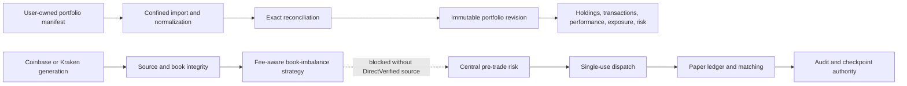

# Portfolio and paper-execution operations

This runbook covers the shipping local workflows for importing portfolio evidence, reading
revision-bound portfolio analytics, and operating the risk-enforced paper runtime.

| Field | Value |
| --- | --- |
| Document type | Operations runbook |
| Audience | Local operators, portfolio analysts, and execution reviewers |
| Status | Current |
| Last substantive review | 2026-07-25 |
| Reviewed commit | `041175590bd2e4a357ea28d75c675c252d3b3746` |

## Contents

- [Scope](#scope)
- [Operating boundaries](#operating-boundaries)
- [Preconditions](#preconditions)
- [Import a portfolio revision](#import-a-portfolio-revision)
- [Read portfolio state and analytics](#read-portfolio-state-and-analytics)
- [Operate the paper runtime](#operate-the-paper-runtime)
- [Success evidence](#success-evidence)
- [Failure and recovery](#failure-and-recovery)
- [Local state and audit locations](#local-state-and-audit-locations)
- [Related documentation and code](#related-documentation-and-code)
- [External sources](#external-sources)

## Scope

This page documents behavior available through the current CLI and the same typed application
services exposed by local stdio MCP. It covers:

- versioned local portfolio-manifest admission and raw-evidence preservation;
- immutable, point-in-time portfolio revisions and reconciliation evidence;
- holdings, transactions, performance, exposure, and risk reads;
- paper-runtime start, status, stop, order/fill inspection, cancellation, and reconciliation; and
- durable paper audit and checkpoint recovery.

Portfolio imports and paper accounts are currently separate authorities. Importing a broker
portfolio does not fund or configure the paper runtime. The paper runtime creates its own virtual
account from the supplied initial-cash and fee assumptions and publishes that cash as an immutable,
evidence-bound sandbox portfolio revision consumed by central risk.

Public Coinbase and Kraken are `DirectUnverified`, so their observations stop before strategy
authority. The separate authenticated Coinbase Direct composition binds an exact current
onboarding session and can qualify observations as `DirectVerified` before the existing fee-aware
book-imbalance strategy, central risk, dispatcher, audit, checkpoint, and realistic paper engine.
Any source, credential-generation, freshness, integrity, or supervisor failure cancels the run and
denies market/execution operations until bounded stop completes. Release acceptance still requires
the authorized unchanged-head live-to-paper evidence recorded in the
[delivery ledger](../plans/delivery-ledger.md).

## Operating boundaries



All monetary input is parsed as checked decimal text. Orders, balances, positions, cost basis,
fees, and accounting values are not admitted as binary floating point. Mutating operations require
explicit confirmation, and execution mutations remain dispatcher- and risk-owned.

## Preconditions

Use one explicit data root for the entire procedure. The examples use a shell variable only to
avoid repeating the path:

```bash
export MARKET_SQUAWK_DATA_DIR="$PWD/.market-squawk"
market-squawk init
market-squawk config validate
market-squawk doctor
```

Before a portfolio import:

- obtain a user-owned manifest that conforms to portfolio manifest schema version 1;
- ensure its `account_id` values agree with the destination account passed to the CLI;
- retain the original broker/export file outside the Market Squawk data root as source evidence;
- verify the manifest is a regular file no larger than 8 MiB; and
- review any supplied totals and reconciliation tolerance as financial evidence, not defaults to
  be invented during import.

The manifest envelope is closed and rejects unknown fields. It contains `schema_version`,
`dataset`, `object_id`, effective and availability timestamps, and one or more revision-bound raw
record payloads. Supported normalized record kinds include accounts, holdings, transactions, and
supplied totals. The exact wire contracts are owned by
[`source.rs`](../../adapters/market-squawk-adapter-portfolio/src/source.rs) and
[`wire.rs`](../../adapters/market-squawk-adapter-portfolio/src/wire.rs).

Before a paper run:

- complete the provider configuration and source-operations procedure for the selected provider;
- choose positive virtual initial cash and a fee assumption from 0 through 10,000 basis points;
- confirm that no other process owns the same data root or paper-checkpoint writer;
- ensure the artifact and control roots have sufficient free space; and
- treat `DirectUnverified`, quarantine, incomplete reconciliation, unhealthy export drains, or an
  incomplete prior shutdown as a no-action condition.

## Import a portfolio revision

Set the destination account to the exact UUID represented by the manifest, then import with local
mutation confirmation:

```bash
ACCOUNT_ID="aaaaaaaa-aaaa-4aaa-8aaa-aaaaaaaaaaaa"
MANIFEST="/absolute/path/portfolio-manifest.json"

market-squawk --output json \
  portfolio import "$MANIFEST" \
  --account "$ACCOUNT_ID" \
  --confirm
```

The command performs one bounded pipeline:

1. open the manifest under a user-authorized input-directory capability without following a file
   replacement;
2. hash and validate the exact manifest and ownership evidence;
3. activate the local portfolio extraction profile for that exact payload;
4. normalize checked account, holding, transaction, and supplied-total records;
5. reconcile calculated values against supplied totals with explicit currency and tolerance;
6. persist the extraction batch as an immutable content-addressed artifact; and
7. publish the account revision and current authority only after durable verification.

The result's `data.disposition` is `applied` for a new revision and `replay` when the same account
and artifact digest were already admitted. Record the returned `revisionId`, `artifactSha256`,
`sourceId`, effective/availability times, and `reconciliationDiscrepancies` count.

Do not delete or replace the source manifest merely because import succeeded. Market Squawk retains
raw payload evidence and a normalized immutable artifact, while the operator-owned original remains
the independent source record.

## Read portfolio state and analytics

Read the current revision for the exact account:

```bash
market-squawk --output json portfolio holdings --account "$ACCOUNT_ID"
market-squawk --output json portfolio transactions --account "$ACCOUNT_ID"
```

Each row includes revision identity, effective and availability time, source identity, and artifact
digest. A result also reports source coverage, completeness, data quality, and the reconciliation
discrepancy count.

Performance, exposure, and risk use a confined JSON request. This example selects the latest
revision available by the end of the requested interval:

```json
{
  "accountId": "aaaaaaaa-aaaa-4aaa-8aaa-aaaaaaaaaaaa",
  "timeRange": {
    "start": "2026-01-01T00:00:00Z",
    "end": "2026-07-01T00:00:00Z"
  }
}
```

Save that object as `/absolute/path/portfolio-read.json`, then run:

```bash
market-squawk --output json portfolio performance /absolute/path/portfolio-read.json
market-squawk --output json portfolio exposure /absolute/path/portfolio-read.json
market-squawk --output json portfolio risk /absolute/path/portfolio-read.json
```

The optional `instrumentIds` array narrows instrument scope, and `sourceCoverage` requires the
selected revision to include every requested source. `timeRange.start` and `timeRange.end` must both
be RFC 3339 timestamps with `start < end`. The CLI injects its fixed result ceilings; callers do not
need to add `resultLimits` to the request file.

Performance requires comparable admitted revisions. With only one revision, the result truthfully
reports `insufficient_history`; it does not manufacture a return. Exposure is revision-bound. Risk
uses the admitted portfolio image and returns bounded historical/scenario measures with its policy
and revision evidence.

## Operate the paper runtime

### Foreground CLI session

Start a bounded foreground run for operational source, lifecycle, audit, and recovery validation:

```bash
market-squawk --output json bot start \
  --provider coinbase \
  --seconds 60 \
  --initial-cash 100000 \
  --fee-basis-points 100 \
  --confirm
```

Use `--provider kraken` for the configured Kraken profile. Omitting `--seconds` runs until Ctrl-C.
The CLI starts the local runtime, waits for the duration or interrupt, requests a confirmed stop,
and returns both start and stop results only after bounded shutdown.

To run the authenticated Direct path, first complete
`source setup coinbase.exchange-direct-market-data --confirm` and retain the resulting active
session UUID. Then start the paper runtime with that exact authority:

```bash
market-squawk --output json bot start \
  --provider coinbase-direct \
  --provider-session-id <ACTIVE-SESSION-UUID> \
  --seconds 60 \
  --initial-cash 100000 \
  --fee-basis-points 100 \
  --confirm
```

The setup portal accepts one versioned secret envelope containing the View-only Exchange
`api_key`, `passphrase`, and `signing_secret`; secret values are never command-line arguments or
status output. The Direct run does not persist or export market observations under the current
scoped rights.

The one-shot CLI creates one `LocalProduct` per process. Consequently, a separate `bot status` or
`execution` CLI process does not attach to an already-running foreground CLI process. Use the local
stdio MCP session when lifecycle status, order/fill reads, cancellation, or reconciliation must be
performed against the same live runtime owner. The corresponding typed operations are:

| Operation | Purpose |
| --- | --- |
| `Bot.GetStatus` | Read lifecycle, checkpoint completeness, and reconciliation state |
| `Bot.Start` | Start the configured provider and virtual paper account |
| `Execution.GetOrders` | Read bounded paper orders and transitions |
| `Execution.GetFills` | Read bounded paper fills |
| `Execution.Cancel` | Cancel one tracked order through dispatcher authority |
| `Execution.Reconcile` | Reconcile orders, fills, balances, and positions |
| `Bot.Stop` | Stop, flush audits, reconcile, and publish the terminal checkpoint |

The exact MCP tool names and schemas are in the [MCP reference](../reference/mcp.md). The CLI
equivalents `execution orders`, `execution fills`, `execution cancel`, and
`execution reconcile` are valid only when their process owns a running paper controller; otherwise
they return an unavailable service result.

### Stop and emergency authority

A persistent MCP owner stops the active runtime through `Bot.Stop`, supplying an audit reason and
local confirmation. The CLI exposes the equivalent syntax:

```bash
market-squawk bot stop --reason "operator requested shutdown" --confirm
```

Because each public CLI invocation owns a new process, that standalone command cannot stop a paper
runtime owned by another CLI or MCP process. A foreground `bot start` handles its own duration or
Ctrl-C stop. Within a persistent MCP session, `Risk.TriggerKillSwitch` and `Bot.Stop` both stop only
that session's current paper run and retain the supplied reason. Neither command deletes audits or
checkpoints. Process shutdown also invalidates new execution authority before draining and
checkpointing the runtime.

## Success evidence

### Portfolio import

A successful import has all of the following evidence:

- command exit status `0`;
- `disposition` equal to `applied` or the exact idempotent `replay`;
- non-empty `revisionId`, `artifactSha256`, and `sourceId`;
- `rawEvidenceRetained: true`;
- explicit `reconciliationDiscrepancies`; and
- subsequent holdings/transactions reads bound to the same revision and artifact digest.

A nonzero discrepancy count is successful ingestion evidence, not proof that the portfolio agrees
with supplied totals. Review each discrepancy before using the revision for financial decisions.

### Paper operation

A successful lifecycle validation has:

- a running transition for the selected provider;
- no quarantine or unhealthy export-drain failure;
- complete audit persistence;
- `shutdownComplete: true` at stop; and
- a durable terminal checkpoint whose configuration and recovery digest validate on the next run.

Zero orders and fills are the expected current result because the shipping strategy emits no
intents and current provider quality is not execution eligible.

## Failure and recovery

| Failure | Interpretation | Recovery |
| --- | --- | --- |
| Manifest unavailable, replaced, linked, oversized, or malformed | Input capability or schema admission failed | Preserve the original; correct the export/manifest producer and retry the exact intended file |
| Account mismatch or invalid decimal/tick/lot/currency | Domain normalization failed | Correct the producer record; do not coerce the value after ingestion |
| Reconciliation discrepancies | Calculated and supplied totals differ outside the declared tolerance | Compare source statements, currencies, timestamps, basis status, and revisions; import a corrected newer revision |
| Existing content-addressed artifact has different bytes | Durable artifact authority is corrupt or colliding | Stop mutation, preserve the data root, and follow backup/recovery diagnosis before retrying |
| Portfolio analytics reports not found | No revision satisfies account, time, or source coverage | Inspect holdings and revision metadata; broaden only the intended filter or import the required revision |
| `insufficient_history` | Fewer than two comparable point-in-time revisions exist | Import genuine subsequent revisions before calculating performance |
| Paper start unavailable | Configuration, source admission, checkpoint ownership, audit startup, or lifecycle admission failed | Run `config validate`, `doctor`, and source health checks; inspect local logs and retained checkpoint evidence |
| Paper checkpoint reports an unclean prior run | Prior terminal state was not durably proved | Keep execution stopped; reconcile exact audit/checkpoint evidence and restart only after recovery succeeds |
| Execution operation unavailable | The caller does not own a running controller, or the runtime/export drain is unhealthy | Use the same persistent MCP session; otherwise repair source/runtime health and start a new run |
| Reconciliation required or incomplete shutdown | Paper state cannot be treated as current | Stop new action, invoke same-owner reconciliation, then perform a bounded stop and verify its terminal checkpoint |
| Disk full or root identity changed | Durable publication authority is unavailable | Stop mutation, restore space/ownership without replacing the root, then rerun validation and exact recovery |

Never repair a publication by manually editing content-addressed artifacts, current manifests,
audit JSONL, or paper checkpoints. Those files are evidence consumed by owning services.

## Local state and audit locations

Paths below are relative to the configured data root:

| Path | Contents |
| --- | --- |
| `artifacts/portfolio/imports/` | Immutable normalized portfolio extraction artifacts |
| `control/sources/portfolio-manifests/` | Exact local portfolio source/archive authority |
| `control/portfolio/publication/` | Current portfolio publication authority |
| `artifacts/paper-checkpoints/v1/` | Content-addressed paper recovery objects and current manifest |
| `control/paper-execution-audit-v2.jsonl` | Execution decisions, transitions, and no-action evidence |
| `control/paper-state-audit-v1.jsonl` | Paper-ledger state-transition evidence |

The directory map describes service-owned state. Use supported commands and recovery procedures to
read or change authority; do not treat these paths as editable configuration.

## Related documentation and code

- [CLI reference](../reference/cli.md)
- [MCP reference](../reference/mcp.md)
- [Source coverage reference](../reference/source-coverage.md)
- [Live execution plane](../architecture/live-execution-plane.md)
- [Data, time, and provenance](../architecture/data-time-and-provenance.md)
- [Backup and recovery](backup-and-recovery.md)
- [Troubleshooting](troubleshooting.md)
- [Portfolio import boundary](../../apps/market-squawk/src/local_product/cli_portfolio.rs)
- [Portfolio application service](../../apps/market-squawk/src/portfolio_application.rs)
- [Paper application service](../../apps/market-squawk/src/application/paper.rs)
- [Paper runtime composition](../../apps/market-squawk/src/paper_bot/defaults.rs)
- [Paper adapter](../../adapters/market-squawk-adapter-paper/src/lib.rs)

## External sources

| Source | Operational relevance | Reviewed |
| --- | --- | --- |
| [Coinbase Exchange WebSocket channels](https://docs.cdp.coinbase.com/exchange/websocket-feed/channels) | Provider channel and message semantics used by the Coinbase runtime | 2026-07-23 |
| [Kraken Spot WebSocket v2 book checksum](https://docs.kraken.com/api/docs/guides/spot-ws-book-v2/) | Provider checksum and book synchronization semantics used by the Kraken runtime | 2026-07-23 |
