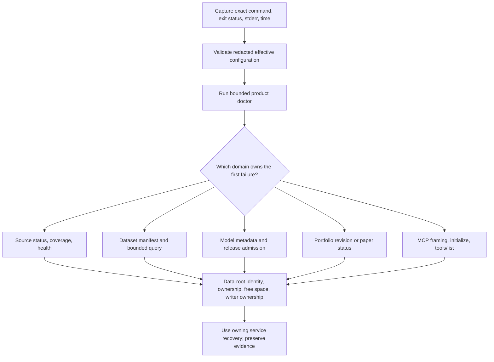

# Troubleshooting

This runbook provides a bounded first-response path for current Market Squawk configuration,
source, research, portfolio, model, paper-execution, MCP, storage, and development-build failures.

| Field | Value |
| --- | --- |
| Document type | Operations runbook |
| Audience | Local operators, incident responders, integrators, and maintainers |
| Status | Current |
| Last substantive review | 2026-07-24 |
| Reviewed commit | `3ef05dc8724ec2be808f98543e0bc695f2ae0937` |

## Contents

- [Scope](#scope)
- [First response](#first-response)
- [Configuration and startup](#configuration-and-startup)
- [Sources and live integrity](#sources-and-live-integrity)
- [Research, datasets, and queries](#research-datasets-and-queries)
- [Models and Python](#models-and-python)
- [Portfolio and paper execution](#portfolio-and-paper-execution)
- [MCP](#mcp)
- [Storage and recovery](#storage-and-recovery)
- [Maintainer build diagnostics](#maintainer-build-diagnostics)
- [Escalation evidence](#escalation-evidence)
- [Related documentation and code](#related-documentation-and-code)
- [External sources](#external-sources)

## Scope

Use this page to identify the owning subsystem, preserve evidence, and select the corresponding
recovery operation. It does not authorize manual changes to SQLite, immutable artifacts, authority
state, audits, or paper checkpoints. Those files are inputs to application-owned recovery and must
remain unchanged during diagnosis.

CLI success writes a result to stdout and exits `0`. Clap usage failures exit `2`. Configuration,
admission, service, I/O, lifecycle, and shutdown failures exit `1` with a diagnostic chain on
stderr. Diagnostic text is not a versioned machine-readable error API.

## First response

Follow this order before changing configuration or deleting generated state:



Run the first two probes against the same config and data-root arguments as the failing command:

```bash
market-squawk --config /absolute/path/market-squawk.toml \
  --output json config validate

market-squawk --config /absolute/path/market-squawk.toml \
  --output json doctor
```

For local diagnostic detail, add a temporary tracing filter and keep stdout separate from stderr:

```bash
market-squawk --config /absolute/path/market-squawk.toml \
  --log market_squawk=debug \
  --json-logs \
  --output json \
  doctor >doctor-result.json 2>doctor-trace.jsonl
```

Do not post unreviewed traces publicly. Although structured diagnostics redact known secret types,
provider identifiers, account identifiers, instrument identities, paths, and financial metadata may
still be sensitive.

## Configuration and startup

| Symptom | Likely boundary | Action |
| --- | --- | --- |
| Clap exits `2` | Command spelling, enum, required flag, or option placement | Use `market-squawk --help` and the command-specific `--help`; correct syntax before domain diagnosis |
| `config validate` exits `1` | Explicit TOML, accepted environment, CLI override, or merged invariant | Remove unknown `MARKET_SQUAWK_*` keys, validate closed provider JSON, and correct the highest-precedence source |
| Effective value differs from the file | Environment or CLI has higher precedence | Inspect only the documented environment keys and supplied CLI overrides; `config show` reports redacted effective values |
| Secret locator is rejected | Locator syntax or configured backend | Use a 1–512-byte `keyring:` or `encrypted-file:` locator; never place resolved secret material in TOML |
| Product construction reports a catalog writer lock | Another process owns the same prepared root | Identify and gracefully stop that owner; do not remove `.catalog.writer.lock` to defeat an active OS lock |
| Prepared root identity changed | The configured root was renamed, replaced, linked, or its identity changed after opening | Stop all users, restore the exact directory identity/ownership, or recover a complete backup into a fresh root |
| Durable model admissions require the signed training release | Restored model authority exists but `training_release_root` is absent or mismatched | Install and configure the exact verified training release before reopening those admissions |

Configuration is immutable for a process lifetime. After correction, start a new command; there is
no hot reload.

## Sources and live integrity

Inspect source state with the same optional provider filter:

```bash
market-squawk --output json source status coinbase.public-market-data
market-squawk --output json source coverage coinbase.public-market-data
market-squawk --output json source health coinbase.public-market-data
```

Use `kraken.spot-public-market-data` or another exact registered profile identifier as applicable.

| Symptom | Interpretation | Recovery |
| --- | --- | --- |
| Provider not found or not ready | Registration/onboarding/activation is incomplete | Resume `source setup`, complete the local portal evidence, then run the exact confirmed activation request |
| Setup browser did not open | Browser launch failed, not necessarily the portal | Use the loopback URL printed by the command before its bounded lifetime expires |
| Activation recipe is rejected at restart | Durable recipe, rights, secret, endpoint, or adapter identity no longer matches | Refresh the evidence and perform an explicit activation; do not edit the recipe |
| Connected but `DirectUnverified` | Shipping adapter metadata and runtime qualification retain the lower ceiling | This is the truthful current Coinbase/Kraken status, not a freshness bug; immediate automated action remains unavailable |
| Heartbeats continue but market data is stale | Connection liveness is not market-price freshness | Reconnect/resynchronize; a heartbeat cannot refresh price authority |
| Sequence gap, checksum mismatch, crossed book, invalid precision, or snapshot violation | The current connection generation is quarantined | Close/reap it, allocate a newer generation, obtain a new snapshot, and requalify all applicable evidence |
| Reconnect loop | Provider, endpoint, network, authorization, or resynchronization remains invalid | Preserve the first causal error and source-health transitions; avoid treating repeated disconnect messages as separate root causes |
| Capture helper or bounded queue fails | Exact frame/capture or route admission is incomplete | Invalidate the generation, stop/reap the helper, repair capacity/storage, and start a new generation |

Coinbase and Kraken commands use official provider semantics but Market Squawk's source metadata,
coverage, quality, generation, and capture evidence remain the application's authority.

## Research, datasets, and queries

Start from durable dataset authority rather than scanning the artifact directory:

```bash
market-squawk --output json dataset list
market-squawk --output json dataset manifest <DATASET_ID>
market-squawk --output json query dataset <DATASET_ID> --maximum-rows 100
```

| Symptom | Interpretation | Recovery |
| --- | --- | --- |
| Research provider is unavailable after restart | Activation recipe or adapter evidence could not be restored | Inspect source status and re-run explicit provider activation with current evidence |
| Ingest rights fail | Source rights are missing, expired, incompatible with persistence, or do not match the payload | Obtain and record a valid current rights basis; retry the exact payload only after admission succeeds |
| FRED durable ingest is denied | Current FRED/ALFRED rights evidence does not admit durable persistence | Treat it as the tracked release blocker; do not substitute successful extraction for persistence authority |
| Dataset not found | No current catalog/manifest authority exists for that identity | Confirm ingest/build publication and use the exact returned dataset identity |
| Point-in-time build rejects the request | Knowledge cutoff, revision, source closure, universe, corporate action, or fixed resource contract failed | Correct the governed request or inputs; do not remove cutoff/revision semantics to obtain output |
| Query is truncated | Result ceiling is below available rows or bytes | Narrow time/instrument scope or deliberately raise `--maximum-rows` within the fixed process limits |
| DataFusion query is rejected | SQL is not read-only/single-dataset or exceeds SQL, plan, work, time, memory, or result bounds | Reduce the statement against the pinned dataset; SQL is CLI-only |
| Artifact publication is interrupted | Staged bytes did not become current authority | Restart through the owning service; orphan/publication recovery validates exact object and catalog evidence |

Never infer a current generation from filenames under `artifacts/`. The manifest and catalog define
reader authority.

## Models and Python

```bash
market-squawk --output json model list
market-squawk --output json model metadata <MODEL_ID>
```

| Symptom | Interpretation | Recovery |
| --- | --- | --- |
| No admitted model generation | Admission has not completed for that model identity | Produce a sealed training candidate, configure the verified training release, and run confirmed model admission |
| Bundle hash/schema/backend policy mismatch | Candidate bytes or metadata differ from the closed request | Rebuild and sign the complete bundle; never update only the recorded digest |
| Training release verification fails | Python/package/native-library closure differs from its signed manifest | Restore or rebuild the exact sealed release; mutable environment repair is not admission evidence |
| Tract inference fails | Graph/operator/shape/resource, input, warm-up, or runtime contract rejected the request | Inspect bundle metadata and bounded input; inference failure produces no automated action |
| Optional ONNX Runtime is unavailable | Platform, library, evidence, digest, policy, loader, warm-up, or parity admission failed | Continue with required tract or re-admit the exact supported optional runtime following the model runbook |
| Helper disposition is uncertain | Worker termination could not be proved | Produce no output, retain cleanup ownership, and wait for bounded reap before allowing fallback |

Python is a research/training boundary and is not called from the live event-to-action path.

## Portfolio and paper execution

| Symptom | Interpretation | Recovery |
| --- | --- | --- |
| Portfolio manifest unavailable/routing invalid | File capability, schema version, dataset, object identity, or size failed | Correct the producer manifest and retry the exact intended regular file |
| Portfolio reconciliation discrepancies | Calculated totals differ from supplied totals outside declared tolerance | Compare account/currency/time/basis/source revisions; import a corrected later revision |
| Performance says `insufficient_history` | Fewer than two comparable admitted revisions exist | Import genuine later point-in-time revisions; do not synthesize history |
| `bot start` is unavailable | Provider config, runtime composition, checkpoint, audit, or lifecycle admission failed | Validate config/source state, check single-writer ownership and disk, then retry only after the first cause is resolved |
| Paper run has zero orders/fills | Current strategy emits no intents and provider data is not execution eligible | Expected current behavior; this does not prove a broken matching engine |
| Separate CLI `bot status` shows stopped | CLI processes do not attach to another process's controller | Use the same persistent stdio MCP session for status/execution calls, or inspect foreground run result and durable audits |
| Reconciliation required | Orders/fills/balances/positions are not current as one state | Keep action stopped and invoke same-owner execution reconciliation before terminal shutdown |
| Paper checkpoint reports an unclean prior run | A complete terminal checkpoint was not durably established | Preserve audits/checkpoint, recover exact state, reconcile, and publish a clean terminal checkpoint |

See the [portfolio and paper-execution runbook](portfolio-and-paper-execution.md) before operating
these mutations.

## MCP

MCP uses stdio. Stdout is reserved for protocol frames; local tracing belongs on stderr.

| Symptom | Interpretation | Action |
| --- | --- | --- |
| Client receives no tools | Initialization handshake or `tools/list` did not complete | Send a supported initialize request, initialized notification, then `tools/list` in order |
| JSON parse/frame failure | A non-protocol writer contaminated stdout or the frame exceeded bounds | Remove wrapper output from stdout, preserve stderr separately, and restart a fresh session |
| Unknown tool | Name differs from the exact 62-tool registry | Read `tools/list` or the MCP reference; do not derive names from CLI labels |
| Tool argument rejected | Closed JSON schema, identifier, range, confirmation, or result limit failed | Correct the typed arguments; unknown fields are not accepted as extensions |
| Mutation is unavailable after valid schema | Durable audit admission, local confirmation, domain authority, or risk failed | Repair the owning authority; transport validity does not grant mutation authority |
| Large result is returned by reference | Inline item/byte ceiling selected artifact publication | Retain the complete reference and read bounded chunks with `Analysis.ReadArtifact` or `query artifact`; never derive or open a filesystem path |
| Session shutdown is incomplete | One domain/helper failed its bounded drain | Preserve stderr and audit evidence, reconcile the named domain, and start a fresh session only after ownership is resolved |

Do not send ordinary CLI output through an MCP client's protocol stdout stream.

## Storage and recovery

Check capacity without traversing or modifying the root:

```bash
df -h /absolute/path/to/.market-squawk
du -sh /absolute/path/to/.market-squawk
```

| Symptom | Action |
| --- | --- |
| Disk nearly full | Stop capture/publication, free unrelated storage, preserve the root, and retry through the owning service |
| Permission denied | Restore intended owner-only access; do not use broad recursive permissions as a repair |
| Root or artifact identity mismatch | Stop all processes; recover a complete known-good root into a fresh location |
| Catalog corruption or catalog/artifact disagreement | Preserve evidence and restore a coherent whole-root backup; do not splice recovery points |
| Stale-looking lock file | Determine whether an OS lock is active; the persistent file itself is not proof and should not be manually removed during diagnosis |
| Interrupted immutable object | Let exact publication/orphan recovery decide whether it is current, staged, or removable |

Use [Backup and recovery](backup-and-recovery.md) for the complete cold-backup and fresh-restore
procedure.

## Maintainer build diagnostics

Generated Cargo output is not product size. Each active Git worktree owns one default local
`target/`; `CARGO_TARGET_DIR`, custom build-directory overrides, and the retired
`target/agent-shared` layout are outside the repository's verification policy.

Routine dev/test profiles use line-table debug information, no dependency debug information, and
incremental compilation. Agent, CI, benchmark, and approval gates set `CARGO_INCREMENTAL=0`.
Full variable-level debugging is opt-in through `cargo build --profile debugging`.
The tracked VS Code workspace settings disable rust-analyzer's automatic on-save
workspace/all-target flycheck and incremental analyzer builds; use focused on-demand diagnostics so
editor background work does not duplicate release gates or silently expand `target/`.

Monitor generated storage at meaningful integration boundaries:

```bash
du -sh target .worktrees/*/target 2>/dev/null
df -h .
```

The verification boundary rejects a local target above 20 GiB. Completed worktree targets are
generated and should be removed with the completed worktree after its branch is integrated. Do not
run broad all-feature/all-target gates after every small edit; use focused affected tests, an
affected-package gate, and the complete gate once at the actual review/release checkpoint.

On macOS arm64, Rust 1.97 may report that oversized debug/test executables cannot encode some
compact-unwind entries because their `__eh_frame` offsets exceed the format's 24-bit field. Five
measured crate roots carry narrowly scoped `linker_messages` allowances. The release executable is
below that measured boundary and release linker diagnostics remain enabled. If another target emits
the warning, measure its executable and `__eh_frame` before changing any lint; do not add a
workspace-wide suppression or disable compact unwind. See the
[measured diagnostic](../research/2026-07-21-macos-eh-frame-linker-warning.md).

## Escalation evidence

Preserve the smallest complete evidence set that identifies the first failure:

- wall-clock time and timezone;
- application version, Git commit/tree when locally built, OS, architecture, and Rust toolchain for
  build failures;
- exact command with secret values removed, exit status, and complete stderr chain;
- redacted `config show`/`config validate` result;
- `doctor` result;
- affected source status/coverage/health or dataset/model/portfolio/paper identity;
- data-root free-space and ownership state;
- current generation, revision, manifest, artifact, receipt, or checkpoint digest returned by the
  application; and
- whether shutdown and reconciliation completed.

Do not attach the SQLite database, portfolio exports, raw journals, resolved credentials, model
artifacts, or full audit logs to a public issue without an explicit data-handling review.

## Related documentation and code

- [CLI reference](../reference/cli.md)
- [Configuration reference](../reference/configuration.md)
- [MCP reference](../reference/mcp.md)
- [Source coverage reference](../reference/source-coverage.md)
- [Source operations](source-operations.md)
- [Research ingestion](research-ingestion.md)
- [Datasets and query](datasets-and-query.md)
- [Model inference](model-inference.md)
- [Portfolio and paper execution](portfolio-and-paper-execution.md)
- [Backup and recovery](backup-and-recovery.md)
- [Control-plane failure model](../architecture/control-plane.md#failure-and-recovery)
- [Deployment failure model](../architecture/deployment.md#failure-and-recovery)
- [Rust dev/test storage decision](../research/2026-07-21-rust-dev-test-storage-hardening.md)
- [macOS linker-warning evidence](../research/2026-07-21-macos-eh-frame-linker-warning.md)

## External sources

| Source | Diagnostic relevance | Reviewed |
| --- | --- | --- |
| [Cargo build cache](https://doc.rust-lang.org/cargo/reference/build-cache.html) | Defines worktree-local `target/` as generated Cargo/rustc output and explains its layout | 2026-07-23 |
| [Cargo profiles](https://doc.rust-lang.org/cargo/reference/profiles.html) | Defines the debug, incremental, package-override, and custom-profile controls used by this workspace | 2026-07-23 |
| [Rust issue #159105](https://github.com/rust-lang/rust/issues/159105) | Tracks the macOS arm64 compact-unwind diagnostic exposed by Rust 1.97 linker-message reporting | 2026-07-23 |
