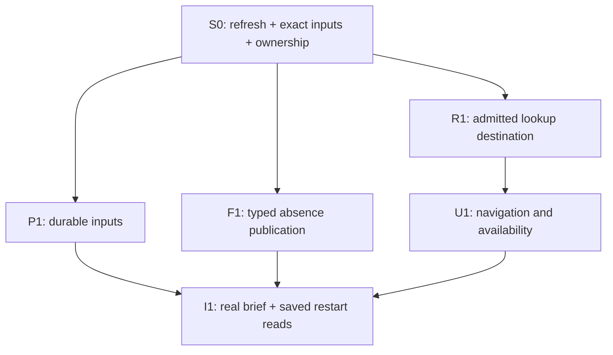

# First complete stock workflow — execution wave

**Goal:** From normal Desktop selection, produce a real evidence-backed Investment Brief, reopen
the same saved result after service restart, and read it through the shared CLI/MCP capabilities.

**Spec and audit base:** [Completion plan](v1-workflow-completion-plan.md) and
[owner-test contract](v1-owner-test-goal.md), inspected at
`523da3b94826eaa47cba59b0bff7e85f5b2e09c7`. Source inspection is not live verification.
**Implementation is paused.** Checkboxes below authorize no work until explicit owner resume.

## Start barrier and disjoint ownership

Root first refreshes intervening source changes and the existing findings register, confirms the
single branch/worktree and assigns the ledger's current execution table. Do not repeat planning
on unchanged code or run broad CI to establish that a documentation-only commit changed no code.
Use existing credentials through native setup; never print them or introduce another secret store.

| Task | Writer/model | Exclusive writable scope after resume | Start and finish boundary |
| --- | --- | --- | --- |
| S0: existing candidate/input preparation | Lead | Ledger/evidence; shared contracts/composition/transports/locks only when an identified prerequisite demands a coherent change | First; publish selected subject/benchmark, input coverage and exact run recipe; product code edits require a concrete failure |
| P1: required durable stock inputs | Provider / GPT-6.1 Sol High | `apps/market-squawk/src/application/research/corporate_actions/preflight/history.rs` if the actual acquisition/read path fails; evidence-only work otherwise | After S0 identities/configuration; first attempt existing acquisition; finish with exact published/readable stock and benchmark inputs or a precise external blocker |
| F1: valid absence publication | Financial / Astra High | `apps/market-squawk/src/application/analytical_workflow/workflow_driver.rs`, including one local critical regression in its existing library target | After S0; independent of live P1. Finish with coherent publication arguments for both forecast-present and typed-absence paths, preserving request admission |
| R1: admitted lookup destination | Lead | `apps/market-squawk/src/service/analysis.rs`; `apps/market-squawk/src/application/contracts/output.rs`; Desktop `src/features/lookup/schemas.ts` and existing `src/test/app.test.tsx` | After S0; publish required selection-token contract before U1 navigation; integrate R1/U1 atomically |
| U1: instrument navigation and truthful availability | Desktop / GPT-6.1 Sol High | `apps/market-squawk-desktop/src/features/lookup/lookup-surface.tsx`; `apps/market-squawk-desktop/src/features/markets/markets-page.tsx`; `apps/market-squawk-desktop/src/features/advanced/advanced-overview-page.tsx` | After R1 contract; independent of P1/F1. Availability-only work may start after S0. Finish with routed instrument selected and analysis availability matching backend state |
| I1: integrated saved brief and restart | Lead | Existing `apps/market-squawk/tests/production_mcp_composition.rs` and `decision_persistence.rs` only if their critical journey needs extension; affected shared bindings/transport/service wiring exclusively root-owned | After P1/F1/R1/U1 as applicable; perform the real journey and capture exact saved readback; stop no unrelated lane |

These are proposed ownership reservations, not permission to edit every listed file. On a newly
demonstrated failure outside them, root assigns its exact owner before editing; adjacent files do
not become implicitly owned. No other writer touches these paths until their owner hands off.
Financial/model contract design is Astra work even when root integrates the shared-file changes.

Shared hotspots reserved to root include `service/market_evidence.rs`,
`service/market_evidence/preparation.rs`, provider activation composition,
`application/decision/investment_request.rs`,
`application/contracts/`, `service/mod.rs`, `service/decision/investment_generation.rs`,
`application/analytical_workflow.rs`, `application/analytical_workflow/host.rs`, Desktop
`src/lib/transport.ts`, `src/lib/tauri-transport.ts`, `src-tauri/src/bridge.rs`, schemas, manifests,
lockfiles and generated bindings. Do not expand F1 into a workflow-controller refactor.



## S0 — Prepare the existing journey, not another framework

- [ ] Record source HEAD, current configured workspace and managed runtime availability. The target
  cache was deliberately cleaned; a missing debug executable is not missing product implementation.
  Root schedules the first necessary cold build alone, with one compiler job and no incremental state.
- [ ] Select one genuinely supported common stock with adequate admitted history and fiscal evidence,
  plus the configured benchmark (SPY default; VTI companion). Resolve canonical identities through
  the existing reference/Markets operations, never a hardcoded frontend ticker-to-UUID mapping.
- [ ] Record usable date range, adjustment/session semantics, historical knowledge cutoffs, current
  quote readiness, financial profile, explicitly selected portfolio/account and confirmed recommendation allocation setup,
  and available training/calibration evidence. Never fabricate cash/account settings to get a run
  admitted. A current quote
  is insufficient proof of historical source readiness.
- [ ] Classify inputs using current receipts: present, acquisition required, or external unavailable.
  A supported alternative source may close coverage through existing selection; do not silently
  reinterpret another provider's price basis or authority. Schwab and Tiingo are not mandatory for
  this base stock journey. Preserve every later optional-provider implementation obligation.
- [ ] Reconcile any still-open substantiated finding affecting this path against current code and
  its closure evidence. A historical rejected head is not automatically a current defect, and a
  newer commit is not automatically proof that a finding was fixed.

## P1 — Required data-to-consumer closure

The current `service/market_evidence/preparation.rs` acquisition path already prepares H.15,
benchmark/subject history and corporate-action evidence. Its history path includes admitted Alpaca
fallback; do not introduce a mandatory Tiingo dependency. SEC company acquisition/publication also
exists through provider activation; selected published fiscal generations remain a prerequisite
for the analytical consumers rather than something React acquires.

- [ ] Use current provider activation/import and market evidence preparation under root-scheduled
  service execution. Retain subject and
  comparison canonical identities, admitted request/receipt, exact history generation, source-action
  reference, selected fiscal/rate evidence and coverage/missing reasons. Invoke only existing
  read-only provider paths with the user's settled authority.
- [ ] Reopen the exact published inputs through the typed selector used by analysis, including after
  service restart. Confirm complete selected pages and basis/cutoff consistency; an HTTP success or
  row count alone does not establish usable financial evidence.
- [ ] If acquisition/read fails, repair only the first proven failure in the assigned files; involve
  root for reference/activation/composition changes. Keep provider-original evidence and existing
  streamed/indexed processing. No new adapter stack, giant preload or arbitrary row truncation.
- [ ] Hand off exact references and readiness to I1. Missing credentials or provider refusal is an
  explicit connection/setup state, not a reason for deterministic tests or ordinary startup to fail.
  Continue F1/U1 and other independent provider work while an external prerequisite is unavailable.

## F1 — Make successful forecast absence publishable

**Observed failure:** `workflow_driver.rs` correctly advances from `PreparePriceForecast` to
independent probability/fiscal/historical work when the prepared price forecast is unavailable.
However, `publication_arguments` emits `sourceActionReference` and `currentShareActionReference`
even with a null `priceForecast`. `validate_canonical_request` in
`application/decision/investment_request.rs` rejects those combinations. This is an inconsistent
producer/consumer contract, not evidence that all forecasting needs rewriting.

- [ ] Correct publication argument construction: emit the chart's `sourceActionReference` only when
  a price forecast exists; emit `currentShareActionReference` only when that forecast, original
  action reference and final market reference exist. Apply the same values to the publication
  binding digest and outgoing request, using one local construction rather than duplicated logic.
- [ ] Keep original action evidence inside the workflow and independently completed probability/
  historical authorities. Do not skip those jobs, erase their provenance, invent a forecast/chart,
  weaken clock/instrument validation, or relax the existing canonical request validator.
- [ ] Add one critical regression in the existing application library test target. Drive a genuine
  typed forecast-absence receipt through publication construction and the actual request admission
  path. Assert the forecast-present/market-present branch retains its required references. Within
  that same regression, cover forecast-present/final-market-null: preserve the original chart
  action reference, clear only the current-share reference, check binding/request agreement, and
  require successful actual canonical admission. These are the two independent rejection
  predicates of this defect, not a new suite or broad matrix. Direct persistence fixtures bypass
  this producer/consumer seam.
- [ ] Use existing saved-publication/readback coverage in I1 to prove unavailable/abstain output can
  persist without inventing values. Its success does not replace the positive forecasting journey.

The consumed type remains `GenerateRequest`; emitted operation remains
`Decision.GenerateInvestmentAnalysis`. No new public schema, migration or alternate publisher.

## R1 — Reuse the admitted selection authority for lookup

- [ ] Extend the existing `Analysis.Lookup` investment destination with required `selectionToken`,
  retaining its canonical `instrumentId`. Update `product_lookup_match` and the closed Desktop
  lookup schema together. No new endpoint, token registry or UUID-as-token shortcut.
- [ ] In `service/analysis.rs`, pin only the matched canonical IDs at one current knowledge/effective
  cutoff using existing `MarketDataInstrumentReadCapability::pin_population_as_of` and
  `MarketDataInstrumentPopulationQuery`. Lookup is bounded to 64 results and this existing query
  admits up to 256 IDs; no whole-universe population load is needed. Execute via existing
  `research.run_owned_research_io` with propagated deadline and cancellation.
- [ ] Derive tokens only with existing `individual_selection_token(record)` from the actual admitted
  records. Handle exclusions and aggregate unavailability truthfully; an unadmitted UUID must not
  become a navigable investment hit. Do not derive capabilities from a bare symbol/definition.
- [ ] Root extends the existing lookup/market critical journey fixture and assertions for R1/U1,
  including actual requested-detail read and stale selection handling. Update any affected schema
  snapshots/generated bindings through their existing mechanism, with root-only ownership.

## U1 — Open the requested instrument and report actual availability

**Observed failures:** `lookupRoute` supplies `/markets?instrumentId=...`, while Markets initializes
selection independently of that URL. Advanced profile status always renders “New analysis is
unavailable”, even when the backend profile projection says the workflow is available.

- [ ] Route the backend-supplied token from lookup to `/markets?selectionToken=...`, read that query
  in Markets and call existing `Market.GetInstrument(selectionToken)`. Handle back/forward
  navigation, stale tokens, changed workspace and cancelled reads without showing another
  instrument's detail. A stale selection requires a fresh lookup, never fuzzy/default substitution.
- [ ] Render the existing `workflowAvailability` and `nextAction` projection faithfully. Preserve
  recommended/custom profile selection and saved-result versioning; React must not calculate
  financial readiness itself. This correction needs no separate routine component test.
- [ ] Hand off to root for the existing critical lookup/market journey to verify the destination actually selects
  and reads the requested investment, not merely that navigation produced a URL. Reuse existing
  transport fixtures; no new component-test suite or harness.
- [ ] Keep the current lazy history/forecast/benchmark/harmonic/action charts. Confirm their real
  data flow in I1; do not rebuild the chart or copy formulas into React.

## I1 — Integrated real journey and restart evidence

- [ ] Start analysis using the normal native workflow controller from Markets. Retain the workflow
  identity and source cutoff, training/model identities and chronological evaluation/calibration
  evidence. Observe progress/cancellation through existing job/workflow operations.
- [ ] Require a positive supported case: real price forecast with uncertainty, separately evidenced
  price-up/benchmark-outperformance/after-cost-profit probabilities, fiscal/valuation evidence and
  realistic out-of-sample backtest. Display seven range slots with each value or a defensible
  backend unavailability reason. Do not force a trade or qualifying harmonic pattern.
- [ ] Open original chart observations, selected benchmark, forecast/range/action layers and any
  backend-confirmed pattern evidence. Verify values come from the saved brief; retain observation
  and confirmation dates. The later forming/invalidated/expired harmonic contract work remains
  mandatory even when this first case contains only a confirmed pattern or no qualifying pattern.
- [ ] Save and reopen the analysis through `Decision.GetInvestmentAnalysis`. Compare immutable
  identity, cutoff, profile/benchmark/cost assumptions, reference digest and original evidence before
  and after orderly service shutdown/restart. Reopening must not silently retrain or regenerate it.
- [ ] Read the same saved result from the shared CLI/MCP operations with concurrent clients and the
  same installation root. Use `market-squawk analysis show --action-token <saved-action-token>` and the MCP
  `Decision.GetInvestmentAnalysis` operation with `{ "actionToken": "<saved-action-token>" }
  through the existing tool envelope; record actual responses and invocation identities. This
  reads the saved brief, not its separate chart viewport. CLI chart access is an explicit Wave 4
  adapter task; the first-stock brief proof does not claim full chart parity.
- [ ] Exercise cancellation/disconnect using existing critical coverage: closing a read must not
  cancel independent durable work; explicit workflow cancellation must not publish a completed
  result. Also retain the corrected unavailable-forecast readback separately from the positive case.
- [ ] Record any first failing edge as a bounded task owned by the relevant module, fix it and rerun
  the affected critical path. Finish with the pushed coherent checkpoint and remaining acceptance
  rows. Do not call a library fixture an installed Desktop journey.

## Thin verification menu — root schedules, never all per task

Existing commands below were located in current manifests/test sources but were not run in planning.
Use pinned Node/pnpm versions from Desktop `package.json`. New regression naming is selected in F1;
its test lives in the existing library binary. No broad matrix or release build belongs in this wave.

```bash
# F1: existing library target, restricted to workflow module tests including its new critical case.
CARGO_BUILD_JOBS=1 CARGO_INCREMENTAL=0 cargo test --locked --offline -p market-squawk --lib application::analytical_workflow:: -- --test-threads=1

# I1: existing saved-decision fixture; confirms its scope, not a live financial journey.
CARGO_BUILD_JOBS=1 CARGO_INCREMENTAL=0 cargo test --locked --offline -p market-squawk --test control_plane decision_persistence::decision_append_is_durable_idempotent_and_recovers_under_one_writer_lease -- --exact --test-threads=1

# I1: existing shared-client/service restart fixture, when shared lifecycle behavior is affected.
CARGO_BUILD_JOBS=1 CARGO_INCREMENTAL=0 cargo test --locked --offline -p market-squawk --features board-installed-fixture --test control_plane production_mcp_composition::service_runtime_is_the_single_authority_for_native_and_mcp_clients -- --exact --test-threads=1

# U1: existing critical journey checks and affected TypeScript boundary.
pnpm --dir apps/market-squawk-desktop test run src/test/app.test.tsx -t 'lookup output|market journey'
pnpm --dir apps/market-squawk-desktop typecheck
```

If a command reports zero selected tests, it supplies no verification. Deterministic fixture success,
real provider publication, actual Desktop interaction and installed restart are separate evidence
categories. Reuse each where it proves the required edge; do not run every command after every edit.

## Handoff order

F1 can be integrated independently after its focused check. R1 and U1 navigation form one
producer/schema/consumer checkpoint and must land together; availability-only U1 work can land
independently when coherent. P1 can complete with evidence only when existing behavior works. Root integrates any actual
shared contract producer/consumer change atomically. I1 follows their required edges, not a wait for
all supplementary providers. Commit/push each accepted coherent slice; release file ownership after
handoff. The next wave closes discovery/portfolio/paper, advanced valuation and broader evidence
coverage under the master plan. No implementation begins as part of planning or plan review.
