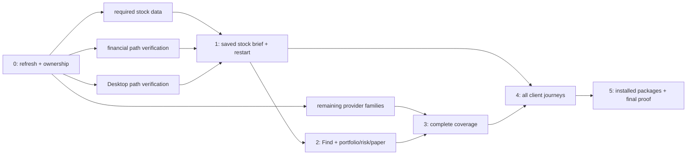

# V1 workflow completion plan

**Goal:** Complete the existing installed investment product through real owner workflows, without
rebuilding working subsystems or turning feature completion into an open-ended hardening program.

**Spec:** [Approved owner-test contract](v1-owner-test-goal.md),
[provider architecture](../architecture/market-data-provider-architecture.md), and
[project operating decisions](../project-memory.md).

**Architecture:** Keep the existing Rust shared service, durable normalized store and native workflow
controller. Python trains admitted models; backend authorities calculate financial results; Tauri
owns local workflow access; React renders product projections. Desktop, CLI and MCP share the same
service and saved evidence. No new runtime, compatibility stack or migration layer is proposed.

**Audit base:** `523da3b94826eaa47cba59b0bff7e85f5b2e09c7`, whose latest product-code checkpoint is
`9543ed357349a83715079ba0720b0f4789f9da58`. This is a source-inspection anchor, not product approval.
Planning performs no builds, tests, acquisition or installed journeys. Current status and assignments
belong in the [delivery ledger](delivery-ledger.md). Implementation requires explicit owner resume.

## Planning boundary

This plan covers all seven acceptance items. Only the first stock wave receives executable task
briefs now, in [the first-stock wave](v1-first-stock-wave.md). Later waves have concrete outcomes,
dependencies and evidence boundaries; their exact writer assignments are refreshed just before
dispatch. Do not invent patches for behavior not yet shown to be wrong.

Superpowers writing-plans contributes explicit files, interfaces and independently useful outcomes.
Owner instructions override blanket TDD, two-to-five-minute task fragmentation, worktree creation,
per-task fresh review and repetitive full-code listings. Reuse existing critical checks; extend one
only for an otherwise uncovered critical failure. This owner-requested plan review is separate from
the existing four delivery-quarter reviews and does not restart their numbering.

## What is already present

The current source has substantial implementation, so these are starting points, not rebuild tasks:

| Existing implementation/evidence | Meaning for remaining work |
| --- | --- |
| Resource checkpoint `9543ed35`: streamed storage, indexed filing/PIT processing, disk-backed backtests, paged inventories, selected model activation and demand-loaded charts | Reuse it. Focused checks in the resource plan are historical evidence, not proof of a complete installed financial journey. |
| `application/analytical_workflow/workflow_driver.rs` sequences price and probability models, fiscal preparation, historical studies, final evidence and publication | Prove the real orchestrated path; change only demonstrated failures. Do not introduce another controller. |
| `service/decision/investment_generation.rs` and investment-analysis projections bind the saved financial result | Preserve original cutoffs and evidence through consumers and restart. |
| Desktop opportunities/Markets components contain analyze/find, saved brief and chart interactions | Verify actual service-backed behavior; mock screens and component fixtures are not installed acceptance. |
| `tests/production_mcp_composition.rs` contains shared-service/restart coverage and explicit live-provider cases | Reuse its critical coverage. It does not by itself prove the complete Desktop stock-analysis journey. |

Application source paths in this table are relative to `apps/market-squawk/src/`; test paths are
relative to `apps/market-squawk/`, and Desktop components live under
`apps/market-squawk-desktop/src/features/`.
The authoritative historical focused results are in
[resource processing remediation](resource-processing-remediation.md#implementation-evidence-resource-checkpoint-not-release-acceptance).

## Acceptance map and dependency sequence

All Waves 0–5 below belong to the existing **Quarter 4 of 4**. Earlier quarters retain their
historical status. These are dependency milestones, not new quarters or per-wave fresh reviews;
the final grouped review and required finding remediation remain in place.

| Wave | Required outcome | Dependencies | Completion evidence |
| --- | --- | --- | --- |
| 0 — Refresh | Classify the seven items as missing, implemented/unproven, critically verified, live verified or installed complete; identify the first failed edge | Explicit resume; unchanged source or a scoped refresh of intervening changes | Exact file ownership, input readiness, operation/check names and first-stock run recipe in the ledger; no repeated repository-wide audit |
| 1 — First stock | Real admitted stock and benchmark data produce forecast, three distinct probabilities, valuation, causal harmonic evidence, chronological backtest and seven action ranges in a saved brief; reopen after service restart | Required identity/history/fundamental/rate inputs and managed model runtime; parallel provider/financial/Desktop work follows the first-wave DAG | A successful real-data result with available analytical evidence where supported; explicit abstention/absence reasons; identical saved identity/evidence after restart through shared clients |
| 2 — Find and practice | Discovery ranks comparable completed results by estimated gain; saved recommendations, portfolio impact, risk and explicit virtual paper work together | Wave 1 publication and its required market/account evidence; independent preparation may proceed earlier | Complete/excluded coverage, expiry, portfolio/cash/corporate actions, realistic paper fills/costs, idempotent accounting and restart proof |
| 3 — Full coverage | Every selected provider family and agreed asset/model family has its intended consumer and truthful availability | Provider lanes proceed concurrently with Waves 1–2; shared selector/contracts serialize with lead | Two separate statuses per provider: durable source and full product vertical; model-family train/admit/infer/readback proof; no required capability permanently disconnected |
| 4 — Complete client journeys | Every Everyday, Advanced and connection/system operation works through Desktop, CLI and MCP where contracted | Corresponding Wave 1–3 outputs; implementation can run alongside them on stable interfaces | Service-backed navigation, forms, chart/evidence interaction, lazy detail/cursors, cancellation, reconnect and saved results; no provider plumbing on ordinary screens |
| 5 — Installed owner handoff | Complete packages, lifecycle, whole-app measurement and final grouped verification | All functional items complete; frozen candidate | Four native-platform packages and receipts, installation/restart/restore/update/repair/removal, whole-app 500 MB–1.5 GB objective / 2 GB maximum, required findings closed, PR #43 evidence |

Wave 1 is the first completion milestone, not a reduction of V1 scope. An all-unavailable result
cannot establish forecasting/modeling completion. Conversely, a correctly reported absence of a
particular harmonic pattern is not a reason to fabricate one or delay unrelated capabilities.

## Provider coverage that must survive scheduling

The provider architecture owns exact data-family requirements. This table is the finite completion
inventory, not a claim of current live completion. Each row needs acquisition/publication/typed-read
evidence and its named product consumer, with restart; optional credentials must not gate the base
application. Track remaining family-level gaps within the row instead of opening endless new lanes.

| Selected source | Required family and consumer closure | Scheduling |
| --- | --- | --- |
| Nasdaq Trader | Listed instrument identity and lifecycle → search and symbol resolution | Wave 1 prerequisites, then remaining coverage |
| OCC and Cboe | Option products/series/reference events → discovery and contract validation | Wave 3 alongside options |
| Alpaca Paper Only/Basic | IEX current data/history/gap repair → Markets, analysis, portfolio marks and paper; entitled indicative options → option evidence | Wave 1 core, remaining family proof Wave 3 |
| SEC EDGAR/XBRL | Company filing facts with exact contexts → financial history, models and valuation | Wave 1 core |
| SEC N-PORT/N-CEN | Fund holdings/metadata and truthful incomplete bulk coverage → exposures, concentration and overlap | Wave 3 |
| Federal Reserve Board H.15 and selected DDP releases | Durable rates and selected release evidence → macro context, valuation and historical analysis | Wave 1 useful rate input; finish full vertical |
| FRED/ALFRED | Series/releases/vintages → point-in-time research and model inputs | Wave 1 where selected; remaining coverage Wave 3 |
| BLS | Labor/inflation evidence → research/model inputs | Wave 3 |
| BEA | National-account evidence → research/model inputs | Wave 3 |
| Census | Demographic/trade evidence → research/model inputs | Wave 3 |
| EIA | Energy evidence → research/model inputs | Wave 3 |
| Treasury daily-rate XML and Fiscal Data | All five selected daily-rate families and separate Fiscal Data lane → research/valuation/model context | Wave 1 where selected; both closures Wave 3 |
| Schwab, owner enabled | Read-only multi-asset REST and one shared Streamer, options/history/reference/hours/movers → complementary Markets/analysis | Wave 3 concurrently; native OAuth and expired-session recovery, never core account/order authority |
| Coinbase public and Kraken public | Separate venue-qualified books/trades → crypto Markets/research and separately admitted paper | Wave 3 |
| Coinbase Exchange Direct, owner enabled | Distinct authenticated market data → crypto Markets/research/paper evidence | Wave 3; do not promote public feed authority |
| Tiingo, optional | NAV and separate EOD bars → fund detail/history and validation | Wave 3; preserve already implemented publication/restart work |
| Yahoo/yfinance | Explicit-demand experimental enrichment → supported market/history/fund/options detail | Wave 3; never broad scheduled or sole decision evidence |
| IEX HIST | Explicitly selected T+1 archive → retained original, decoded events and historical research | Wave 3; no automatic archive sweep |

Do not reopen settled personal-use permissions. A live credential/entitlement limitation is recorded
separately from implementation completeness. Disabled optional providers must have working setup,
recovery and truthful disabled states; they must not silently disappear from required implementation.
Tradier, real brokerage orders, money movement and account-data acquisition from Schwab remain out
of scope. Imported portfolio data and virtual cash stay within the existing product boundaries.

## Concrete remaining behavior and later task boundaries

These findings were source-confirmed at the audit base, not discovered by a new runtime test.
They have named completion waves so a first successful stock does not hide missing screens or
advanced capabilities.

| Finding / required proof | Owning source boundary | Planned closure |
| --- | --- | --- |
| Successful price-forecast absence still sends chart action references rejected by canonical request validation | `application/analytical_workflow/workflow_driver.rs` and unchanged `application/decision/investment_request.rs` | Wave 1 F1: correct producer arguments/digest while retaining independent probability/study evidence; one cross-boundary critical regression |
| Lookup navigates with instrument ID, but Markets requires an opaque selection token | Desktop lookup/Markets and native lookup/market projection | Wave 1 root-owned resolution contract before U1; never manufacture a token in React |
| Advanced overview always says new analysis is unavailable | Desktop `features/advanced/advanced-overview-page.tsx` | Wave 1 U1: render backend availability |
| Valuation page unconditionally renders unavailable | Desktop `features/fair-value/fair-value-page.tsx`; saved investment-analysis projection | Wave 2: explicit saved investment selection, four method-specific cases, assumptions, seven ranges and original evidence. Existing `FairValue.GetWorkspace` governed aggregate measurements must not be mislabeled as per-share investment value. Root owns any projection/transport change; GPT-6.1 Sol High owns rendering after it stabilizes. |
| Selected Portfolio account always shows detailed analysis unavailable; history is static and scenario/planning choices are null | Desktop `features/portfolio/portfolio-page.tsx`, `portfolio-history.tsx` and existing account read/choice consumers | Wave 2: demand-load selected-account holdings/cash/performance/exposure/risk and connect history/attribution, scenarios and position/rebalance choices through existing authorities. Root owns missing typed projection/transport; GPT-6.1 Sol High renders after stabilization. Require an account with available evidence and saved/reopened results, not permanent unavailable placeholders. |
| CLI saved-analysis Show does not expose the separate saved-chart operation | `cli.rs`, `local_product/cli_transport.rs` and existing `Decision.GetInvestmentChart` | Wave 4: a thin installed-service CLI adapter for saved action token, supported layer, exact time window and point limit, returning structured evidence. Compare the same saved viewport/original observations across Desktop/CLI/MCP after restart; no CLI renderer, extra financial logic or whole-series preload. |
| Harmonic history has no forming disposition, and invalidated/expired classification drops geometry | `application/research/market_history/harmonic.rs`, saved harmonic codec, service chart projection and Desktop chart contract | Wave 3 Astra designs and implements causal evidence/status retention; root serializes schema/codec/transport changes; GPT-6.1 Sol High renders supplied geometry. Keep incomplete forming evidence distinct from confirmed patterns and never imply a trade/probability. |
| All required estimator, strategy and interval families need product proof beyond the default model | Forecast contracts, Python forecasting/calibration, training/admission/native inference and saved outputs | Wave 3 Astra: existing-family inventory below, compatibility and chronological evidence, no speculative new model family |
| Full default/Find/portfolio/paper/shared-client/installed journey lacks current integrated proof | Existing workflow driver, decision repository, portfolio/paper service and client paths | Waves 1–5: exercise real consumers; correct only demonstrated defects and retain exact evidence |

Application paths above are relative to `apps/market-squawk/src/`. Proposed later tasks must inspect
those files and affected consumers before assigning exact writable paths; this table is not blanket
permission to rewrite a domain or justification for ignoring an already identified defect.

The finite existing model inventory is: sealed direct least squares, sealed direct Ridge, sealed
out-of-bag mean block-bootstrap Ridge, and sealed binary logistic (`ForecastEstimatorProfile` in
`crates/market-squawk-modeling/src/forecast/contracts.rs`). The current default prepared path uses
linear price/fiscal forecasts and independent logistic probability models. Python's existing
`ForecastStrategy` supports direct, recursive, multi-output and chained forecasts; existing interval
methods include residual quantiles and MAPIE time-series conformal EnbPI/ACI. Retain native
linear/logistic and the selected tract ONNX path; optional Linux ORT is not a newly mandatory runtime.
Map each required strategy/output to its admitted model contract before claiming compatibility;
standalone Python output is not evidence that the installed registry can use it. Do not add ARIMA,
GARCH or neural-model scope merely because it is technically possible.

Retain DCF, comparables, residual-income and forecast-distribution valuation with method-specific
assumptions and unavailability; preserve the current default horizon and accurately distinguish
Advanced multi-horizon research. Harmonic families are AB=CD, Gartley, Bat, Butterfly, Crab, Deep
Crab, Cypher and Shark, with causal observation/confirmation, forming/confirmed/invalidated/expired
meaning and retained original geometry where applicable. Review current taxonomies and update
producers, codecs, backend projections and renderers in place as one coherent change.

Portfolio completion must preserve named values, units and dates, explicit account/scenario choices,
account/workspace isolation, demand loading, cancellation and recovery. Reuse existing holdings,
transactions, performance, exposure, risk, revisions, attribution, candidate-impact and planning
contracts; first inspect the affected producer and consumer before assigning later-wave files.
Backend financial calculations stay in their owning services. A missing-data state remains valid
when supported by evidence; a permanently disconnected composition does not satisfy this task.

## Complete screen coverage

`apps/market-squawk-desktop/src/lib/navigation.ts` and `src/app/routes.tsx` define these 17 screens.
Each needs real service behavior, clear empty/error/availability states and relevant saved recovery;
being routed or present in the mock is not completion. The same approved Obsidian Signal hierarchy,
accessibility, provider-neutral wording and backend financial authority apply throughout.

| Screen | Required owner journey | Principal wave |
| --- | --- | --- |
| Home | Current summary and useful next action lead to the actual selected investment/result | 1, 4 |
| Markets | Search/select, current/history evidence, correct deep link, launch analysis and chart interaction | 1 |
| Opportunities | Find, complete/excluded coverage, ranking, saved brief and original evidence | 1–2 |
| Portfolio | Explicit account/import, holdings/cash/actions, performance/exposure/risk, history/attribution, admitted scenario and position/rebalance choices | 2 |
| Paper Execution | Explicit virtual plan, current checks, fill/cost/accounting and restart | 2 |
| Advanced Overview | Actual profile availability, custom controls and saved profile identity | 1, 4 |
| Research & Data | Selected provider-neutral research, exact historical input/coverage and demand-loaded detail | 3–4 |
| Models & Forecasts | Managed training/admission, complete supported model/forecast families, intervals/calibration and saved outcomes | 3–4 |
| Backtests | Chronological simulation, assumptions/costs and durable results | 1, 3–4 |
| Valuation & Targets | Selected saved investment's method-specific values, assumptions and action ranges | 2 |
| Risk & Recommendation Policy | Current portfolio/candidate risk, recommendation policy and explicit supported controls | 2, 4 |
| AI Connections | Native client registration/repair and actual concurrent shared-service access | 4–5 |
| Operations & Jobs | Real progress, explicit cancellation, disconnect/reconnect and durable recovery | 1, 4 |
| Updates & Repair | Local owner-test package preflight, rollback fixture and repair, without publication | 5 |
| Backup & Recovery | Backup verification, restore preview and actual preserved results/workspace recovery | 5 |
| Logs & Diagnostics | Useful redacted diagnostics and controlled export; technical provenance stays here | 4–5 |
| Settings | Native onboarding/import/OAuth, reconnect/unlock and workspace/settings persistence | 1, 4–5 |

Settings' `/system/settings/onboarding` route and lookup/saved-detail flows are required subflows,
not extra screens. Research/Markets also cover the required fund/option/crypto details; do not drop
those consumers because the navigation has no dedicated provider screen. Each screen's implemented
versus verified status is recorded in the ledger when its execution wave completes; no blanket
screen-complete claim is made by this planning inventory.

## Execution controls

- Stay on `feature/v1-installed-product-experience` in the primary worktree. No extra branches or
  worktrees. Source audit/readers may overlap; writers may not overlap files.
- Start with three finishable lanes: provider integration (GPT-6.1 Sol High), financial workflow (Astra
  High), Desktop workflow (GPT-6.1 Sol High). Every brief uses `fork_turns="none"`, explicit files,
  dependencies, expected result and a critical check. Advanced debugging/optimization goes to Astra.
- Lead owns schemas/shared contracts, application/service composition, transports, manifests,
  lockfiles, generated bindings, integration, Git and test/build scheduling. An agent needing those
  files requests a lead-owned change; it does not edit around another writer.
- Provider and consumer changes that cannot work independently land together. A worker completes
  by handing over actual diff and evidence; the lead inspects both, integrates, commits/pushes the
  coherent slice and updates the ledger before reassigning those files. No giant all-V1 commit.
- One scheduled compiler at a time, `CARGO_BUILD_JOBS=1 CARGO_INCREMENTAL=0`; no agent builds in
  parallel. The Rust target was cleaned after the audit base, so the first build is a cold build.
  Inspect disk/process state and compile only the selected existing target. Preserve package and
  recovery evidence outside disposable compiler output.
- No ordinary-task CI/CD, release builds, whole-app RAM runs or repeated review ceremonies. Final
  verification occurs once on the unchanged complete candidate; actual failures require correction
  and the applicable rerun. Existing substantiated findings cannot be waived.
- A stalled task reports the first failed operation, owner and next dependency. Continue independent
  work, but do not replace an unfinished lane with a fresh audit or count adapters as completion.

## Final verification boundary

Functional completion precedes whole-app measurements and final package verification. Measure
Desktop/WebView, the shared service and active model/Python helpers together without disabling
features or using data/model rejection to achieve a memory number. No minimum allocation is implied.

Use the existing package builders and `distribution/release-components.json` for Linux x64,
Windows x64, macOS Intel and Apple Silicon. Preserve managed-runtime installation, native credential
setup/OAuth, shared service plus concurrent clients, saved analysis and paper restart, backup/restore,
workspace switching, update preflight/rollback, repair and data-preserving uninstall. Missing actual
platform proof remains a visible blocker, not a mocked success or implicit waiver.

The older [installed-product plan](../superpowers/plans/2026-08-01-market-squawk-v1-installed-product-experience.md)
Tasks 25–26 and [release gate](../verification/usable-release-gate.md) locate existing producers and
required evidence. Their old worktree paths, release-branch/publication prerequisites, settled
permission blockers and obsolete numeric resource objectives do not override the current goal.
Before executing final commands, the lead reconciles their arguments against the current CLI and
owner-test boundary. Retain required deterministic/network/fuzz/security/dependency checks and
applicable Quarter 4 remediation; do not run public publication or merge into main/release.

Source closures, package identities and final evidence must bind the same clean committed candidate.
Record review approval externally in PR #43, so recording approval does not mutate the reviewed
product head. An actual remediation creates a new candidate and invalidates affected approval.

## Planning handoff

The [independent plan review record](../reports/2026-09-29-v1-completion-plan-review.md) identifies
the exact reviewed document hashes, independent reviewer scopes, valid findings and dispositions. Plan approval is neither implementation authority
nor product acceptance. After committing/pushing the reviewed planning checkpoint, stop for owner
review and explicit implementation resume.
