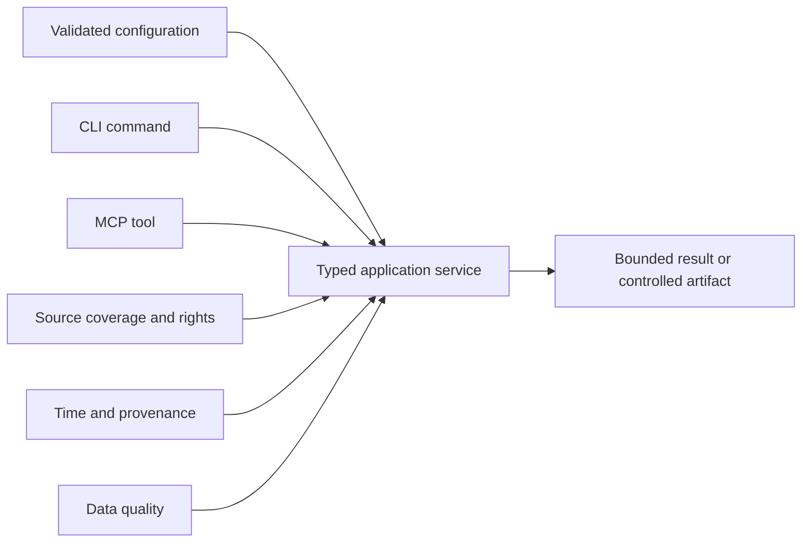

# Reference

These pages define the exact public commands, configuration, local MCP surface, source coverage,
quality semantics, and time/provenance contract at the reviewed product commit.

| Field | Value |
| --- | --- |
| Document type | Reference index |
| Audience | Operators, integration authors, maintainers, and reviewers |
| Status | Current |
| Last substantive review | 2026-07-24 |
| Reviewed product commit | `3ef05dc8724ec2be808f98543e0bc695f2ae0937` |

## References

| Reference | Contract |
| --- | --- |
| [Command-line interface](cli.md) | Command hierarchy, global options, confirmations, limits, output, and authority mapping |
| [Configuration and secrets](configuration.md) | Precedence, keys, defaults, environment, provider profiles, secret locators, and reporting |
| [Model Context Protocol](mcp.md) | Stdio lifecycle, exact 60-tool registry, schemas, annotations, limits, artifacts, audits, and cancellation |
| [Source coverage](source-coverage.md) | Supported adapters, current coverage/quality ceilings, rights, credentials, and health semantics |
| [Data quality](data-quality.md) | Independent quality classes, `DirectVerified` evidence, transitions, and execution eligibility |
| [Time and provenance](time-and-provenance.md) | Canonical identifiers, event/research time fields, revision/supersession, and point-in-time rules |

## How the contracts relate

CLI and MCP are transports over the same application-domain services except for explicitly
documented CLI-owned operations such as local initialization, confined input admission, and bounded
read-only DataFusion SQL. Neither transport creates financial authority merely by admitting a
well-formed request.

## Reference conventions

- JSON field names use the exact external spelling.
- Byte and count limits are exact integers unless a page states otherwise.
- Time values identify their format and clock semantics; similarly named timestamps are not
  interchangeable.
- Source coverage, data quality, market depth, and fair-value hierarchy remain distinct types.
- Mutable release completion belongs in the [delivery ledger](../plans/delivery-ledger.md), not in
  these contracts.
- Examples illustrate schema shape unless explicitly identified as measured command output.

## Task-oriented guidance

Use the [operations portal](../operations/README.md) for procedures. Use the
[architecture portal](../architecture/README.md) for rationale, ownership, runtime flow, deployment,
and decisions.
