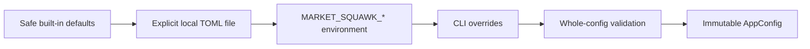

# Configuration and secrets reference

This page defines the configuration sources, precedence, validated settings, production live-source
profiles, provenance, and local secret-storage boundary implemented by Market Squawk.

| Field | Value |
| --- | --- |
| Document type | Reference |
| Audience | Operators, integrators, security reviewers, and maintainers |
| Status | Current |
| Last substantive review | 2026-07-26 |
| Reviewed commit | `4edc8adf4425ffed44235b614d9607aef30fd585` |

## Contents

- [Scope](#scope)
- [Composition and precedence](#composition-and-precedence)
- [Settings](#settings)
- [TOML file contract](#toml-file-contract)
- [Environment contract](#environment-contract)
- [Production live-source profiles](#production-live-source-profiles)
- [Secrets](#secrets)
- [Provenance and reporting](#provenance-and-reporting)
- [Loading, failure, and recovery behavior](#loading-failure-and-recovery-behavior)
- [Related documentation and code](#related-documentation-and-code)
- [External sources](#external-sources)

## Scope

The application composes one immutable, validated `AppConfig` at process startup. Configuration
determines local paths, bounded runtime resources, source shutdown behavior, optional training
release admission, secret locators, and closed Coinbase and Kraken production profiles.

Configuration does not contain resolved credential material, grant source or execution authority,
qualify observations as `DirectVerified`, or hot-reload a running process. Provider registration,
evidence-backed activation, source qualification, model admission, and risk remain separate
authorities.

## Composition and precedence

Effective values are composed in this fixed low-to-high precedence order:



The configuration file is optional and is read only when `--config <PATH>` is supplied. There is
no home-directory, current-directory, XDG, or platform-default configuration-file discovery.
Process environment is captured once at the application boundary. A higher layer replaces only the
settings it supplies; the final merged object is then validated as one unit.

The `--log` option and `MARKET_SQUAWK_LOG` configure tracing through Clap. They are consumed before
the environment is passed to `AppConfig`, so `MARKET_SQUAWK_LOG` is not an `AppConfig` setting and
does not trigger the unknown-key failure described below.

## Settings

All byte ceilings are exact integer byte counts. All timing values are milliseconds.

| TOML key | Environment key | CLI override | Safe default | Validation and semantics |
| --- | --- | --- | --- | --- |
| `data_dir` | `MARKET_SQUAWK_DATA_DIR` | `--data-dir` | `.market-squawk` | Nonempty local path; it need not already exist when configuration is loaded |
| `products` | `MARKET_SQUAWK_PRODUCTS` | Command-specific product override | `["BTC-USD"]` | Nonempty, unique list; at most 128 entries; each is 1–128 bytes and contains only ASCII alphanumeric characters or `-`, `.`, `_`, `/` |
| `stale_after_ms` | `MARKET_SQUAWK_STALE_AFTER_MS` | Internal override only | `5000` | `250..=600000`; market-price freshness, not connection-heartbeat health |
| `capture_queue_capacity` | `MARKET_SQUAWK_CAPTURE_QUEUE_CAPACITY` | `--capture-queue-capacity` | `16384` | `1..=1048576`; fixed raw-capture queue capacity |
| `capture_memory_ceiling_bytes` | `MARKET_SQUAWK_CAPTURE_MEMORY_CEILING_BYTES` | `--capture-memory-ceiling-bytes` | `67108864` | `1..=4294967295`; per-channel fixed, resident-generation, and queued-record ceiling |
| `capture_destination_registry_memory_ceiling_bytes` | `MARKET_SQUAWK_CAPTURE_DESTINATION_REGISTRY_MEMORY_CEILING_BYTES` | `--capture-destination-registry-memory-ceiling-bytes` | `1048576` | `1..=67108864`; process-wide capture-destination registry ceiling |
| `paper_bot_enabled` | `MARKET_SQUAWK_PAPER_BOT_ENABLED` | Command-specific diagnostic override | `false` | Boolean; enables paper behavior only and grants no live execution authority |
| `capture_flush_interval_ms` | `MARKET_SQUAWK_CAPTURE_FLUSH_INTERVAL_MS` | Internal override only | `1000` | Positive and no greater than `capture_shutdown_ms` |
| `capture_shutdown_ms` | `MARKET_SQUAWK_CAPTURE_SHUTDOWN_MS` | Internal override only | `5000` | Positive, no greater than `60000`, and no less than the flush interval |
| `source_shutdown_ms` | `MARKET_SQUAWK_SOURCE_SHUTDOWN_MS` | `--source-shutdown-ms` | `5000` | `1..=60000`; independent source-supervisor shutdown deadline |
| `training_release_root` | `MARKET_SQUAWK_TRAINING_RELEASE_ROOT` | `--training-release-root` | Unset | When present, must be a nonempty absolute path; model composition verifies that the running application and sibling ONNX worker are the exact signed files installed there |
| `source_secret` | `MARKET_SQUAWK_SOURCE_SECRET` | Internal override only | Unset | Redacted locator, 1–512 bytes, no control characters, prefixed by `keyring:` or `encrypted-file:` |
| `coinbase` | `MARKET_SQUAWK_COINBASE_JSON` | Internal typed override only | Unset | Complete closed Coinbase profile; the environment value is JSON at most 128 KiB |
| `kraken` | `MARKET_SQUAWK_KRAKEN_JSON` | Internal typed override only | Unset | Complete closed Kraken profile; the environment value is JSON at most 128 KiB |

`MARKET_SQUAWK_PRODUCTS` is a literal comma-separated list. Whitespace is not trimmed; an empty,
duplicate, oversized, or syntactically invalid element rejects the whole configuration.

## TOML file contract

The explicit file must be UTF-8 TOML and no larger than 1 MiB. Its root is a closed object: an
unknown key, malformed value, invalid UTF-8, or oversized file rejects the entire configuration.
Every setting is optional in the file because omitted values continue from the lower-precedence
defaults.

```toml
data_dir = "/absolute/or/relative/local/path"
products = ["BTC-USD"]
stale_after_ms = 5000
capture_queue_capacity = 16384
capture_memory_ceiling_bytes = 67108864
capture_destination_registry_memory_ceiling_bytes = 1048576
paper_bot_enabled = false
capture_flush_interval_ms = 1000
capture_shutdown_ms = 5000
source_shutdown_ms = 5000
training_release_root = "/absolute/path/to/installed-training-release"
source_secret = "keyring:opaque-local-reference"
```

Provider tables, when present, use the exact closed schemas in the next section. Secret material
must not be placed in this file; `source_secret` is only a locator.

## Environment contract

Only the fourteen `MARKET_SQUAWK_*` keys in the settings table are accepted by `AppConfig`.
An unknown key with that prefix, a non-UTF-8 in-scope key or value, an unparseable scalar, an
oversized provider JSON profile, or an invalid merged value fails startup without echoing the
rejected value. Unrelated environment variables are ignored.

Boolean environment values use Rust's `bool` parser (`true` or `false`). Integer values use
unsigned decimal parsing. Coinbase and Kraken profiles are complete JSON objects, not partial
patches over a TOML table.

## Production live-source profiles

Both live profiles are closed schemas with `deny_unknown_fields` semantics. They bind provider
symbols to canonical instrument definitions and carry explicit, finite, content-hashed
authorization evidence. A configured profile enables construction; it does not itself establish
verified execution-quality observations.

### Shared authorization object

Each profile contains an `authorization` object with these exact fields:

| Field | Contract |
| --- | --- |
| `mode` | `public_interface` |
| `provider` | Exactly `coinbase-exchange` for Coinbase or `kraken` for Kraken |
| `basis` | Valid bounded source identifier naming the locally reviewed basis |
| `evidence_sha256` | Exactly 64 hexadecimal characters |
| `evidence_reference` | Valid bounded, version-pinned source locator component |
| `evidence_version` | Valid bounded version identifier |
| `effective_from_unix_nanos` | Signed Unix nanoseconds |
| `effective_until_unix_nanos` | Signed Unix nanoseconds, strictly after the start |

The finite half-open interval must cover the instant at which the authorization is relied upon.
The digest and version-pinned locator retain exact evidence identity without placing evidence
payloads in configuration.

### Coinbase profile

| Field | Required value or bound |
| --- | --- |
| `endpoint` | Exactly `wss://ws-feed.exchange.coinbase.com` |
| `authorization` | Shared object above, provider `coinbase-exchange` |
| `event_classes` | Exactly one each of `book_snapshot`, `book_delta`, and `trade` |
| `depth` | `price_level` |
| `freshness_ms` | `250..=600000` |
| `max_frame_bytes` | `1..=4194304` |
| `subscription_ack_timeout_ms` | `1..=60000` |
| `control_message_capacity` | `1..=4096` |
| `control_byte_capacity` | `1..=4194304` |
| `instruments` | `1..=100` unique products and unique internal instrument identities |

Every Coinbase instrument entry contains `product`, `instrument_id`, `definition_revision`,
`asset_class`, exactly one of `primary_currency` or `primary_asset`, `quote_currency`, `tick_size`,
`lot_size`, `contract_multiplier`, `venue`, and `trading_status`. The asset class must be `crypto`,
the venue must be `coinbase-exchange`, and the product is 1–64 bytes using only ASCII alphanumeric
characters, `-`, or `_`. The encoded subscription request is also capped at 16 KiB.

### Kraken profile

| Field | Required value or bound |
| --- | --- |
| `endpoint` | Exactly `wss://ws.kraken.com/v2` |
| `authorization` | Shared object above, provider `kraken` |
| `channel` | `book` |
| `depth` | Exactly `10`, the admitted checksum scope |
| `freshness_ms` | `250..=600000` |
| `max_frame_bytes` | `1..=4194304` |
| `subscription_ack_timeout_ms` | `1..=60000` |
| `control_message_capacity` | `1..=4096` |
| `control_byte_capacity` | `1..=4194304` |
| `instrument` | Exactly one canonical instrument mapping |

The Kraken instrument contains `symbol` plus the same canonical definition fields listed for
Coinbase. The asset class must be `crypto`, the venue must be `kraken`, and the symbol is 1–64
bytes using only ASCII alphanumeric characters, `/`, `-`, `_`, or `.`.

## Secrets

Configuration retains a redacted `SecretReference`, never the resolved value. The legacy
configuration reference syntax accepts only `keyring:` and `encrypted-file:` locators. The fuller
secret-store subsystem uses an opaque `SecretRef` carrying an exact backend and generation; reads,
replacements, and deletion are routed only to that recorded backend.

Production secret creation probes the operating-system keyring first. The supported primary
backends are Apple Keychain, Windows Credential Manager, and a Secret Service implementation. An
encrypted-file fallback is eligible only when it was explicitly configured and unlocked and the
pre-mutation primary probe reports the backend unavailable, the session unavailable, or the exact
lifecycle unsupported. An existing reference is never moved between backends by fallback routing.

The production `LocalProduct` configures that fallback at the code-owned
`<data-root>/control/secrets/provider-credentials/` root in a locked state. Its only public unlock
surface is the bounded foreground onboarding portal; configuration files, environment variables,
CLI arguments, and restart recovery cannot supply the unlock.

Secret material is admitted into `SecretValue` only when it is 1–65536 bytes. Its debug
representation is redacted and its allocation is zeroized on drop. Secret keys and opaque
references also redact their debug representations. Backend operations carry explicit interaction,
cancellation, deadline, and generation authority; indeterminate mutations fail into reconciliation
rather than being guessed successful.

## Provenance and reporting

`AppConfig` records one origin for every setting: `safe_default`, `local_file`, `environment`, or
`cli`. `market-squawk config show`, `config validate`, and `doctor` serialize the same
`market-squawk-effective-config-v1` redacted view. Every setting is represented as
`{"value": ..., "origin": ...}`. Secret references and live-source profiles are represented only by
configured/not-configured booleans; their locators, credentials, authorization evidence, and
profile bodies are not exposed.

## Loading, failure, and recovery behavior

Configuration is read before the requested command acquires authority. Any file, environment,
provider-profile, cross-setting, path, secret-reference, or bound violation fails closed and
prevents initialization, inspection, or runtime startup. Error variants intentionally omit file
contents, rejected environment values, secret locators, and resolved material. `doctor` then uses
the validated configuration only for query-only existing-layout inspection; it does not compose a
runtime.

There is no in-process reload or rollback operation. Correct the explicit source, restart the
command, and re-run `market-squawk config validate`. Configuration success confirms parsing and
whole-object validation only; source activation, source health, datasets, models, and execution
must still pass their own admission and recovery boundaries.

## Related documentation and code

- [CLI reference](cli.md)
- [Source coverage reference](source-coverage.md)
- [Configuration and secrets operations](../operations/configuration-and-secrets.md)
- [Control-plane architecture](../architecture/control-plane.md)
- [Security and trust boundaries](../architecture/security-and-trust-boundaries.md)
- [Configuration implementation](../../crates/market-squawk-platform/src/config.rs)
- [Production source-profile validation](../../crates/market-squawk-platform/src/config/instruments.rs)
- [Redacted provenance view](../../crates/market-squawk-platform/src/config/report.rs)
- [Local secret-store boundary](../../crates/market-squawk-platform/src/secrets.rs)
- [OS-first routing](../../crates/market-squawk-platform/src/secrets/preferred.rs)
- [Accepted-head delivery evidence](../plans/delivery-ledger.md)

## External sources

| Source | Applied fact | Reviewed |
| --- | --- | --- |
| [TOML v1.1.0 specification](https://toml.io/en/v1.1.0) | Syntax and data-model reference for the explicit configuration file | 2026-07-23 |
| [Serde container attributes](https://serde.rs/container-attrs.html) | Closed-structure `deny_unknown_fields` behavior used by configuration and provider profiles | 2026-07-23 |
| [Apple Keychain Services](https://developer.apple.com/documentation/security/keychain-services) | Platform credential-store boundary used by the macOS backend | 2026-07-23 |
| [Windows Credentials Management](https://learn.microsoft.com/en-us/windows/win32/secauthn/credentials-management) | Platform credential-store boundary used by the Windows backend | 2026-07-23 |
| [Secret Service API specification](https://specifications.freedesktop.org/secret-service-spec/latest/) | Desktop secret-service contract used by the Linux/Unix backend | 2026-07-23 |

External sources define upstream formats and platform facilities. The reviewed Market Squawk code
head remains the authority for precedence, accepted keys, exact bounds, routing, and failure
behavior.
