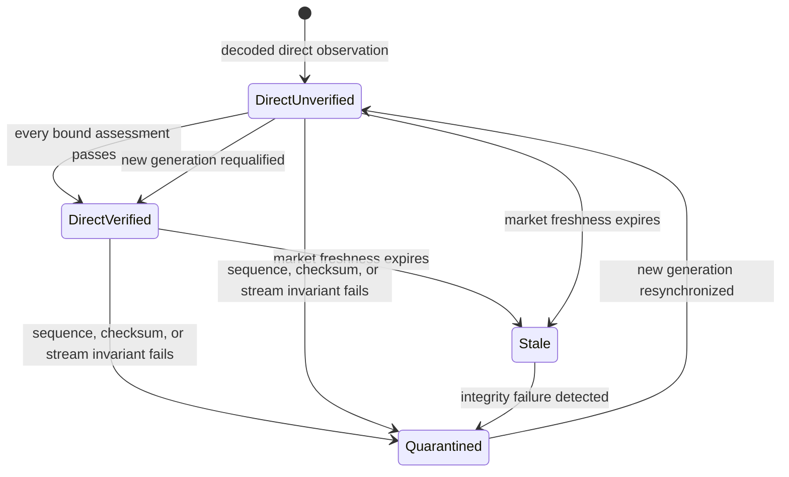

# Data quality and live qualification reference

This page defines Market Squawk's independent classification axes and the evidence required for a
live observation to receive `DirectVerified` quality and short-lived automated-action authority.

| Field | Value |
| --- | --- |
| Document type | Reference |
| Audience | Source-adapter authors, strategy and risk engineers, auditors, and operators |
| Status | Current |
| Last substantive review | 2026-07-23 |
| Reviewed commit | `836aae662dfbbc3cf40e94e6da6c5c37cd3b57bd` |

## Contents

- [Scope](#scope)
- [Three independent classification axes](#three-independent-classification-axes)
- [Data-quality classes](#data-quality-classes)
- [DirectVerified qualification](#directverified-qualification)
- [Quality derivation and transitions](#quality-derivation-and-transitions)
- [Archive evidence and runtime authority](#archive-evidence-and-runtime-authority)
- [Coverage semantics](#coverage-semantics)
- [Failure and recovery behavior](#failure-and-recovery-behavior)
- [Related documentation and code](#related-documentation-and-code)
- [External sources](#external-sources)

## Scope

`DataQuality` describes evidentiary confidence in an observation. `MarketDepth` describes how much
of a market a source exposes. `FairValueHierarchy` describes the valuation-input hierarchy. These
types are deliberately separate; no conversion among them exists.

This page covers the canonical types and current live qualification policy. Provider coverage
declarations are summarized here and specified fully in [Source coverage](source-coverage.md).
Fair-value measurement and approval commands are specified in the [CLI reference](cli.md).

## Three independent classification axes

| Axis | Variants | Question answered |
| --- | --- | --- |
| `FairValueHierarchy` | `level1`, `level2`, `level3`, `unclassified` | What ASC 820/IFRS 13 input hierarchy applies to this valuation evidence? |
| `MarketDepth` | `top_of_book`, `price_level`, `order_level` | Does the source provide best prices, aggregated price levels, or individual orders? |
| `DataQuality` | Nine classes below | What evidence supports this observation, and may it enter immediate automated-action qualification? |

A price-level book is not “Level 2” valuation evidence. A Level 1 fair-value candidate is not
necessarily current execution-quality data. A modeled value remains `modeled` even if its estimate
is numerically close to a venue quote.

## Data-quality classes

| Serialized value | Meaning | Default use boundary |
| --- | --- | --- |
| `direct_verified` | Authorized direct venue or broker delivery with every required integrity, timing, market-state, and coverage assessment satisfied | Eligible to enter the short-lived runtime authority path |
| `direct_unverified` | Direct delivery for which one or more required capabilities or assessment results are absent or insufficient | Display, comparison, diagnostics, and research |
| `official_delayed` | Official-source observation with an explicit delivery delay | Research and delayed display |
| `aggregated` | Observation combined or redistributed by an aggregator | Research, comparison, and fallback display |
| `indicative` | Non-firm or otherwise indicative observation | Research and manual review |
| `modeled` | Model output rather than a direct observation | Modeling, valuation, and research |
| `estimated` | Estimated input or value | Research, valuation, and manual review |
| `stale` | Observation older than its configured freshness limit | Historical/display use after explicit staleness handling |
| `quarantined` | Observation isolated because a stream-integrity invariant failed | Audit, diagnosis, and resynchronization only |

These values are semantic classes, not a user-selectable execution priority. Current automated
order intents must require `direct_verified`, and central risk independently requires the market
state to carry the same quality.

## DirectVerified qualification

Qualification evaluates one immutable `LiveEvidenceBinding` that ties together source, venue,
instrument, provider product and channel, event class, connection generation, metadata revision,
payload digest, and bound book state. Every component assessment must use that same binding and
have an overlapping validity window.

The recorded result is `DirectVerified` only when all of these conditions hold at the evaluation
instant:

| Component | Passing condition |
| --- | --- |
| Source policy ceiling | The admitted source policy permits `DirectVerified` |
| Source authorization | `authorized` |
| Delivery | `direct_venue` or `authorized_broker` |
| Sequence | Provider capability is `provided` and progression is `valid` |
| Snapshot | For metadata-declared snapshot-dependent events, state is initialized and `consistent` |
| Checksum | `provided` plus `valid`, or metadata-backed `unsupported` plus `not_supported` |
| Event timing | Atomic source, receive, and evaluation timing assessment is `valid` |
| Market freshness | `fresh` under the configured price-freshness policy |
| Trading status | `active` |
| Precision | Price and quantity exactly satisfy the bound instrument's tick and lot definitions |
| Coverage | Bound source coverage is `sufficient` and effective at the evaluation instant |
| Book integrity | `consistent` for book events; `not_applicable` for non-book events |
| Stream integrity | `healthy` |
| Raw capture integrity | If capture is enabled, it is not known `incomplete`; disabled capture is not itself a market-quality failure |

Connection-heartbeat activity does not establish market freshness. The freshness assessment uses
market-event timing, and the validity deadline is bounded by the intersection of all component
assessment windows.

## Quality derivation and transitions

The qualifier derives quality from evidence; an adapter or decoder cannot simply label decoded
payloads `DirectVerified`.

For one assessment, quality derivation applies this precedence:

1. An invalid sequence, failed checksum, or gap/checksum/divergence/quarantine stream state yields
   `quarantined`.
2. Otherwise, stale timing yields `stale`.
3. Otherwise, an empty failure set yields `direct_verified`.
4. Otherwise, a lower source-policy ceiling is retained.
5. Otherwise, the result is `direct_unverified`.

Resynchronization starts a new connection generation and rebuilds the required evidence. It does
not restore a prior execution token or promote archived observations.

## Archive evidence and runtime authority

`LiveProvenance` is serializable audit/research evidence. Decoder construction rejects a
`DirectVerified` label. A recorded assessment may retain that label only with an assessment
reference, but the record remains archive-facing and always reports execution eligibility as
`ineligible`.

Current automated-action authority is a private, short-lived live-plane capability minted from a
currently satisfied assessment and live source scope. It is bound to source health, subscription,
generation, metadata revision, and deadline. The action path rechecks those bindings and central
risk consumes a one-use dispatch lease before the execution adapter receives an approved order.

Consequently, serializing, replaying, copying, or querying a `DirectVerified` archival label cannot
recreate current authority.

## Coverage semantics

Live coverage binds source, venue, provider product, provider channel, event class, market depth,
effective interval, and metadata revision. It independently records:

- delivery delay: real time or a positive nanosecond delay;
- venue consolidation: single venue, partial, or consolidated; and
- result status: sufficient, insufficient, or unknown.

A sufficient record must be real time and cannot declare partial consolidation. It is downgraded
to insufficient outside its effective interval. Every duplicated dimension must match the complete
live binding, preventing coverage evidence for one venue, channel, depth, metadata revision, or
event class from qualifying another observation.

## Failure and recovery behavior

Relational mismatches, contradictory capabilities, non-overlapping validity windows, invalid
timing, incomplete capture, and market-state failures produce explicit qualification failures.
Critical stream-integrity failures quarantine the affected generation. While quarantined, the
stream cannot mint current live authority.

Recovery requires a provider-specific reconnect/resnapshot procedure, a new consistent generation,
and a fresh complete qualification assessment. Risk, strategy, CLI, MCP, and execution adapters do
not contain alternate quality-promotion paths.

## Related documentation and code

- [Source coverage](source-coverage.md)
- [Time and provenance](time-and-provenance.md)
- [Live execution plane](../architecture/live-execution-plane.md)
- [Data, time, and provenance architecture](../architecture/data-time-and-provenance.md)
- [Source operations](../operations/source-operations.md)
- [Canonical classifications](../../crates/market-squawk-domain/src/classification.rs)
- [Live qualification policy](../../crates/market-squawk-domain/src/classification/qualification.rs)
- [Live provenance](../../crates/market-squawk-domain/src/provenance/live.rs)
- [Current live authority](../../crates/market-squawk-live/src/authority.rs)
- [Central risk gate](../../crates/market-squawk-execution/src/risk.rs)
- [Accepted-head delivery evidence](../plans/delivery-ledger.md)

## External sources

| Source | Applied fact | Reviewed |
| --- | --- | --- |
| [Coinbase Exchange WebSocket channels](https://docs.cdp.coinbase.com/exchange/websocket-feed/channels) | Provider event and level-2 channel semantics interpreted only through the pinned adapter profile | 2026-07-23 |
| [Kraken Spot WebSocket v2 book checksum guide](https://docs.kraken.com/api/docs/guides/spot-ws-book-v2/) | Provider checksum and depth semantics implemented by the Kraken adapter | 2026-07-23 |
| [IFRS 13 Fair Value Measurement](https://www.ifrs.org/issued-standards/list-of-standards/ifrs-13-fair-value-measurement/) | Fair-value hierarchy is a valuation-input concept, independent of market-depth and execution-quality classifications | 2026-07-23 |

External sources define provider protocols and the valuation standard. The reviewed Market Squawk
code head remains the authority for classification, qualification, coverage binding, and runtime
authority behavior.
