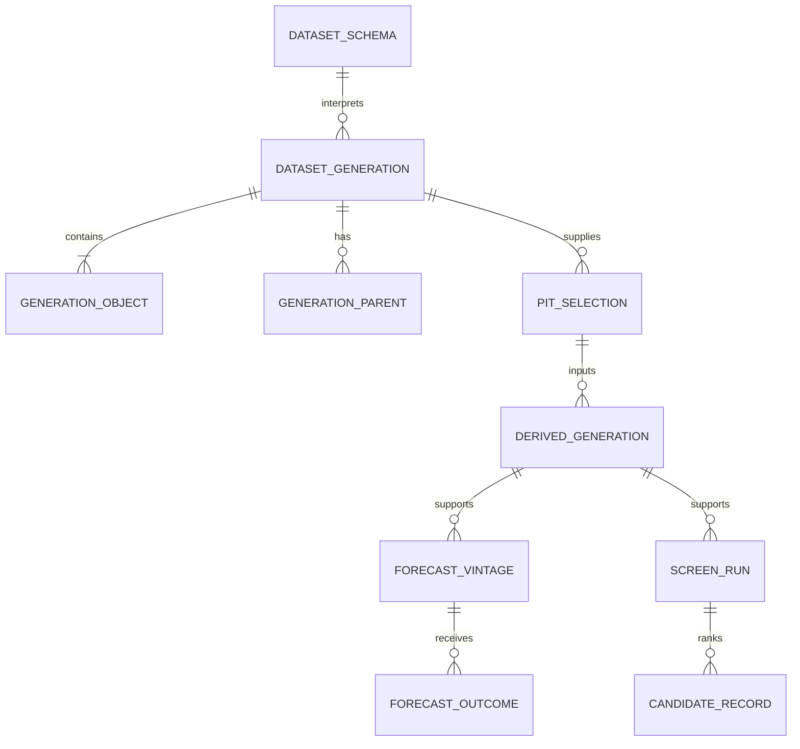

# Market-data canonical schemas and shared evidence contract

This reference defines the maintained logical data contract between source adapters, durable
storage, point-in-time research, analytics, and bounded application reads. It is a target/evidence
contract: it identifies what already exists, what must be extended without breaking existing
authority, and what is still absent.

| Field | Value |
| --- | --- |
| Document type | Maintained canonical data and evidence contract |
| Audience | Financial-data engineers, domain/schema maintainers, quantitative researchers, application integrators, and reviewers |
| Status | Target contract with current implementation evidence and explicit gaps |
| Last substantive review | 2026-08-11 |
| Repository basis | `3a2f24ddbe88a886d9ba6458dd141774e3716a9d` plus the preserved shared working-tree overlay |
| Scope | Non-order research data, derived evidence, and typed application reads |

The status labels in this document are normative:

- **PRESENT** — the named Rust type, registry entry, authority, or durable table exists now.
- **EXTEND** — preserve the existing identity and invariants, then add compatible fields,
  variants, persistence, or projection behavior through its owning module.
- **ADD** — no adequate closed contract exists; add one through the existing domain, schema
  registry, manifest, and application-operation architecture.

`PRESENT` does not mean that every provider or frontend workflow is integrated. `ADD` does not
authorize an adapter-local substitute. Physical Arrow columns remain owned by the code registry;
this document fixes logical meaning and relationships, not an unreviewed second schema registry.

## Contents

1. [Non-negotiable invariants](#1-non-negotiable-invariants)
2. [Authoritative flow](#2-authoritative-flow)
3. [Common observation envelope](#3-common-observation-envelope)
4. [Financial clock contract](#4-financial-clock-contract)
5. [Exact values, decimals, units, and nullable semantics](#5-exact-values-decimals-units-and-nullable-semantics)
6. [Closed logical schema families](#6-closed-logical-schema-families)
7. [Keys, deduplication, revisions, and supersession](#7-keys-deduplication-revisions-and-supersession)
8. [Arrow and Parquet contract](#8-arrow-and-parquet-contract)
9. [Manifests, generations, and parent relationships](#9-manifests-generations-and-parent-relationships)
10. [SQLite authority, atomic publication, and recovery](#10-sqlite-authority-atomic-publication-and-recovery)
11. [Point-in-time selection](#11-point-in-time-selection)
12. [Derived evidence bindings](#12-derived-evidence-bindings)
13. [Bounded typed application reads](#13-bounded-typed-application-reads)
14. [Current repository foundations and exact gaps](#14-current-repository-foundations-and-exact-gaps)
15. [Acceptance rules for future implementation](#15-acceptance-rules-for-future-implementation)

## 1. Non-negotiable invariants

1. A frontend never reads provider-native payloads or calls a source directly.
2. Every observation retains source, product/channel, venue, instrument, time, quality,
   completeness, entitlement generation, and raw-evidence lineage when applicable.
3. Provider-native, canonical, and derived records are different evidence classes. They cannot be
   relabeled in place.
4. Missing is not zero. Estimated is not observed. Indicative is not direct. Single-venue is not
   consolidated. Top-of-book is not market depth beyond the represented level.
5. Corrections and revisions append. Published canonical or derived generations are immutable.
6. A point-in-time read may use only evidence knowable at its cutoff. Later corrections, filings,
   releases, revisions, mappings, and memberships remain excluded unless the policy explicitly
   requests revision history.
7. Every executable analytical claim binds exact manifest, schema, policy, universe, feature,
   model, and evidence identities. Display order is never ranking or currentness.
8. Raw payload retention does not make raw fields canonical. A field becomes canonical only after
   a closed typed decoder and mapping contract admits it.
9. Source or adapter code cannot register schemas dynamically. Unknown schema identities,
   fingerprints, enum values, and incompatible revisions fail closed.
10. Application reads are bounded, typed, recursively closed, and explicit about unavailable,
    partial, stale, truncated, and degraded results.

## 2. Authoritative flow

```mermaid
flowchart LR
    SC[Source contract and entitlement generation]
    R[Bounded content-addressed raw object]
    N[Closed provider-native record]
    C[Closed canonical observation family]
    A[Arrow validation boundary]
    P[Immutable Parquet object]
    M[SQLite manifest and generation authority]
    PIT[Point-in-time selection receipt]
    D[Derived feature, model, forecast, valuation, and decision evidence]
    Q[Bounded typed application read]

    SC --> R --> N --> C --> A --> P --> M --> PIT --> D --> Q
    M --> Q
```



The boundaries are:

| Layer | Status | Contract |
| --- | --- | --- |
| Source contract | **PRESENT / EXTEND** | `SourceId`, source revisions, provider capability/onboarding evidence, provider product/channel, and durable rate declarations identify the admitted source surface. Entitlement-probe generation and exact dataset scope must be added to every active surface. |
| Raw evidence | **EXTEND** | Preserve exact bounded response pages, reference files, or stream micro-batches by digest with retrieval/receipt chronology and secret-free request identity. Raw bytes are never an application read model. |
| Provider-native | **ADD** | Each endpoint, file, or stream protocol receives a closed, versioned source-owned decoder type. Unknown fields may be retained in the raw object and diagnostics, but not exposed as an open canonical map. |
| Canonical | **PRESENT / EXTEND / ADD** | Existing domain observations are reused. Structurally different families receive separate closed domain and Arrow schemas below. |
| Derived | **PRESENT / EXTEND** | Features, labels, forecasts, outcomes, valuations, screens, dossiers, portfolio analytics, and advisories bind immutable canonical generations and their policies. They never overwrite source observations. |
| Application read | **PRESENT / EXTEND / ADD** | An application service selects exact evidence and returns a bounded typed canonical product projection. Exact selection/evidence receipts remain internal or are exposed only through Settings/Connections and Logs/Diagnostics; ordinary product DTOs never expose provider identities or provider-runtime plumbing. |

The current `payload_json` binary field in `market_squawk.research_observations` serializes the
closed `ResearchObservation` enum. It is not permission to introduce arbitrary provider JSON or a
generic property bag. New structural families use closed schemas and code-owned projections.

## 3. Common observation envelope

The envelope is a logical contract assembled from existing types. A family may store it inline,
through a typed context, or through manifest-bound columns, but no semantic coordinate may be
discarded.

### 3.1 Identity and source surface

| Logical field | Type and null rule | Status | Meaning |
| --- | --- | --- | --- |
| `source_id` | `SourceId`, required | **PRESENT** | Stable source authority; never inferred from a file path. |
| `source_revision` | revision/content digest, required | **EXTEND** | Exact source-contract revision used by the decoder. |
| `provider_product` | `ProviderProduct`, required for current-market evidence | **PRESENT / EXTEND** | Commercial/technical product identity represented by the observation. |
| `provider_channel` | `ProviderChannel`, required for current-market evidence | **PRESENT / EXTEND** | REST resource, stream service, or reference channel identity; it is the canonical feed coordinate. |
| `venue_id` | `VenueId`; nullable only when the source fact is genuinely venue-independent | **PRESENT** | Represented market or reporting venue. |
| `instrument_id` | `InstrumentId`; nullable only for global macro or account-wide observations | **PRESENT** | Stable canonical instrument, never a ticker-only identity. |
| `provider_instrument_id` | `ProviderInstrumentId` or `SourceIdentifier`; required when the source names an instrument | **PRESENT / EXTEND** | Exact source symbol/key at the observation time. |
| `source_identifier` | `SourceIdentifier`, required | **PRESENT** | Source record, series, accession, contract, page-row, or observation identity. |
| `observation_kind` | closed family/variant enum, required | **PRESENT / EXTEND** | Selects the only valid payload contract for the row. |
| `entitlement_generation` | nonzero generation plus evidence digest, required for credential-gated data | **ADD** | Exact probe/authorization generation that proved the product/channel was available. It contains no credential or account number. |
| `coverage_scope` | `CoverageScope` and `CoverageStatus`, required for live market evidence | **PRESENT / EXTEND** | Delay, consolidation, event class, depth, venue, and metadata revision supporting the observation. |

### 3.2 Request, stream, and raw lineage

| Logical field | Type and null rule | Status | Meaning |
| --- | --- | --- | --- |
| `request_id` | opaque operation identity; nullable for unsolicited stream events | **EXTEND** | Correlates a bounded request without retaining credentials or sensitive query material. |
| `request_digest` | `EvidenceDigest`/SHA-256; required for request responses | **PRESENT / EXTEND** | Canonical redacted request and parameter identity. |
| `raw_object_digest` | payload digest, required after durable raw publication | **PRESENT / EXTEND** | Exact response page, file, or stream micro-batch evidence. |
| `native_schema` | name, nonzero version, fingerprint; required | **ADD** | Closed provider-native decoder identity. |
| `page_or_cursor` | typed opaque source cursor; nullable outside paged resources | **EXTEND** | Resume and completeness evidence, not a canonical instrument key. |
| `connection_generation` | `ConnectionGeneration`; required for stream events | **PRESENT** | Prevents event transplantation across reconnects. |
| `sequence` | typed source sequence; nullable only if absent from the source contract | **PRESENT / EXTEND** | Ordering/dedup evidence scoped to source, product, channel, and connection generation. |
| `row_digest` | canonical content digest, required at publication | **EXTEND** | Identity of the complete canonical row including evidence state, excluding storage location. |

### 3.3 Quality, completeness, and state

| Logical field | Type and null rule | Status | Meaning |
| --- | --- | --- | --- |
| `data_quality` | `DataQuality`, required | **PRESENT** | One of direct verified/unverified, official delayed, aggregated, indicative, modeled, estimated, stale, or quarantined. |
| `coverage_status` | `CoverageStatus`, required for live; explicit not-applicable state elsewhere | **PRESENT / EXTEND** | Whether scoped source coverage is sufficient. |
| `completeness` | closed scope-specific completeness record, required | **EXTEND / ADD** | Complete, partial, truncated, unavailable, or unknown for the exact requested universe, page set, interval, components, and contract revision. |
| `quality_flags` | bounded closed set, may be empty | **ADD** | Structured anomalies such as out-of-order, duplicate receipt, crossed market, missing side, correction, cancellation, stale component, provider disagreement, or repaired gap. |
| `revision` | `RevisionNumber`, required for revisable families | **PRESENT / EXTEND** | One-based source/canonical revision within a stable natural family. |
| `supersession` | typed predecessor/successor identity and knowable time; nullable only while current | **PRESENT / EXTEND** | Appended correction relationship; never an in-place edit. |
| `field_state` | family-specific closed state, required beside every evidence-null value | **EXTEND / ADD** | Distinguishes not applicable, source missing, not yet published, omitted, invalid, unobserved, estimated, and superseded. |

`SnapshotCompleteness` currently supplies `Complete`, `Truncated`, and `Unavailable` for bounded live
snapshot dimensions. Extend that concept with request scope and expected/returned counts; do not
replace it with a nullable Boolean. A multi-page result is complete only after every admitted page
has been received, validated, and durably published.

## 4. Financial clock contract

`Timestamp` is a signed UTC Unix-nanosecond instant. `CalendarDate` and source-reported periods
retain date/period precision. A date-only or period-only fact must not be converted to midnight or
another invented instant.

### 4.1 Universal local chronology

| Clock | Type | Null rule | Status |
| --- | --- | --- | --- |
| `source_timestamp` | `Timestamp` | Nullable only when the source supplies no exact instant | **PRESENT** |
| `received_at` | `Timestamp` | Required for network/file receipt | **PRESENT** |
| `decoded_at` | `Timestamp` | Required when decode completion differs materially from receipt | **ADD** |
| `available_at` | `AvailabilityEvidence` | Required as evidenced, local-first-observed, inferred, or unknown | **PRESENT** |
| `ingested_at` | `Timestamp` | Required for canonical admission | **PRESENT** |
| `published_at` | `Timestamp` | Required for durable generation/application visibility | **EXTEND** |

Chronology is normally:

```text
source_timestamp <= received_at <= decoded_at <= ingested_at <= published_at
```

`available_at` is the conservative knowledge boundary, not merely server event time. If the source
does not evidence availability, retain `LocalFirstObserved`, `Inferred`, or `Unknown`; do not
upgrade it. `available_at <= ingested_at <= published_at` is required when availability is an exact
local instant.

### 4.2 Live-market clocks

- **PRESENT:** event/source time, receive time, available/evaluated time, ingest/publication time,
  source-valid-until, qualification-valid-until, connection generation, and source sequence.
- **EXTEND:** retain independent bid, ask, trade, summary, book, and underlying component times.
  A chain or snapshot time does not prove all components were simultaneous.
- **ADD:** retain disconnect start/end, recovery interval, snapshot synchronization boundary,
  source heartbeat time, and gap-repair publication receipt where the protocol exposes them.
- Session classification uses a versioned calendar/ruleset plus venue-local trading date. It never
  replaces UTC event time.

### 4.3 Research, filing, macro, and fund clocks

The existing `ResearchTime` and `ResearchTemporalCoordinate` remain authoritative:

- `effective`: exact timestamp, calendar date, or source-reported period.
- `published`: exact timestamp/date/period when supplied.
- `revision`: one-based revision.
- `superseded`: exact timestamp/date/period when knowable.

Family extensions retain these additional coordinates without collapsing them:

| Family | Required coordinates when supplied |
| --- | --- |
| Filing/fundamental | report-period start/end or instant; filing date; acceptance timestamp; amendment/revision; source context/unit; first local availability. |
| Macro/rates | observation/effective period; release timestamp/date; realtime/vintage start and end; revision/correction time; seasonal-adjustment and frequency basis. |
| Fund NAV | source valuation/NAV date; source publication time/date when supplied; first availability; receipt, ingestion, canonical publication, correction, and supersession coordinates. A date-only NAV remains a date. |
| Fund holdings | reporting period end; filing/acceptance time; public availability; holding effective date; amendment/supersession. |
| Corporate action | announcement, ex, record, effective, election, payable, and local availability coordinates, each with original precision. |
| Universe membership | membership effective start/end, source publication, first availability, and supersession. |

### 4.4 Instrument, option, and fixed-income clocks

- Instrument definitions retain `effective_start` and optional exclusive `effective_end`, source
  revision time, observed time, and publication time.
- Options retain contract listing/effective dates, `CalendarDate` expiration, component quote/trade
  times, chain request/response times, open-interest as-of date, and underlying observation time.
- Fixed income retains issue, auction, dated, settlement, first coupon, coupon schedule, call/put,
  maturity, quote/trade, and reference-publication coordinates as applicable. Date-only terms stay
  dates.

### 4.5 Derived and decision clocks

- Feature/label rows retain cutoff, observed-effective, label-effective, and exact input
  availability/PIT identity.
- Model evidence retains training period, dataset cutoff, bundle generation, and model admission
  identity.
- `ForecastPath` retains observed cutoff, complete-input availability, exact future target times,
  publication/creation, and expiry.
- `ForecastOutcome` retains target, observed, and available times and appends without changing the
  vintage.
- Screens, dossiers, valuations, recommendations, portfolio revisions, and risk advisories retain
  their own `as_of`, selected/assembled/evaluated/published, and validity/expiry coordinates.

## 5. Exact values, decimals, units, and nullable semantics

### 5.1 Values and units

| Value class | Canonical rule |
| --- | --- |
| Live executable-scale price | **PRESENT:** `PriceTicks` plus exact `InstrumentExecutionTerms`/tick revision. Never convert through binary float. |
| Live quantity | **PRESENT:** `QuantityLots` plus exact lot-size revision. |
| Research money | **PRESENT:** `Money` with `rust_decimal::Decimal` and `Currency`. |
| General exact decimal | Mantissa and explicit base-10 scale; Arrow representation is code-registry-owned. Current research rows use `Decimal128(38, 0)` plus a scale column. |
| Statistical value | `StatisticalF64` or another finite typed scalar only where the meaning is statistical, a provider-supplied binary statistic, or a model output. NaN and infinity are invalid. |
| Probability/ratio/rate | Closed measurement plus exact unit/basis: decimal fraction, percent, basis points, annualization/day-count/compounding convention where applicable. |
| Count | Unsigned integer when inherently integral: trades, quote size after lot normalization, open interest, returned rows, page count, or sequence. |
| Research volume | Exact decimal where the source can report non-integral or pre-normalized values; unit and adjustment basis are mandatory. |
| Currency | Existing `Currency`, required for monetary values; absent only for dimensionless values. |
| Date/time | `CalendarDate`, source period, or UTC-nanosecond `Timestamp` according to original precision. |

Price, strike, net asset value, cash flow, coupon amount, principal, valuation, cost basis, and fees
are exact decimal/money values. Greeks and implied volatility may remain finite statistical values,
but retain source/method, scale convention, underlying price/time, and component availability.

### 5.2 Null and missing rules

Nullability is structural, never shorthand for zero or an empty string:

- An absent bid does not imply a zero bid. A midpoint exists only when both admitted sides exist and
  the derived policy accepts their chronology and market state.
- An absent Greek carries a closed missing/unavailable reason and cannot be converted to zero.
- An absent fund NAV carries a closed not-yet-published, unsupported, source-missing, invalid, or
  unavailable state. It is never converted to zero, a market close, or fabricated intraday OHLC.
- A macro missing marker remains the existing `MacroMissingValue`; do not replace it with a generic
  nullable number.
- Existing `FeatureValidity`, `BasisMeasurement`, forecast interval absence, and similar closed
  states retain their meaning. A shared application projection may map them into a closed
  availability union, but must not erase the source-domain state.
- `Option<T>` is valid for truly inapplicable source fields only when the containing variant makes
  that inapplicability unambiguous. Evidence absence requires a state/reason.
- Imputed, modeled, and estimated values are derived records with lineage and quality. They never
  fill a canonical source-observation null in place.

## 6. Closed logical schema families

The names below are stable logical/registry families. Physical columns, dictionary encodings, and
partition layouts are added only through `DatasetSchemaRegistry` and a migration that binds exact
name, nonzero version, and fingerprint.

### 6.1 `market_squawk.instrument_lifecycle`

**PRESENT foundations:** `InstrumentId`, `InstrumentDefinition`, instrument revisions,
provider-instrument mappings, symbol history, lifecycle transitions, listing-reference
generations, market-data instrument identities/revisions/current pointers/search terms, and
company/security link events.

**EXTEND target payload:**

- stable instrument, issuer, security/share-class, listing, and contract identities;
- closed asset/security/listing/relationship kinds;
- venue, currency, country/jurisdiction, tick, lot, multiplier, and execution/reference terms;
- typed identifiers and aliases with source, validity interval, and revision;
- provider symbol mapping with effective interval;
- lifecycle status and transitions: listed, active, halted, inactive, delisted, merged, converted,
  renamed, successor/predecessor, and contract expiration where supported;
- source revision, effective interval, observed/available/ingested/published chronology, and raw
  lineage;
- mapping confidence is not sufficient by itself: direct crosswalk and operator-authorized
  resolution remain distinct evidence.

**Natural family:** stable canonical identity plus definition/lifecycle facet and effective-start
coordinate. A successor appends a contiguous revision and advances a current pointer atomically.
Ticker and display name are attributes, not identities.

### 6.2 `market_squawk.market_events`

**PRESENT domain:** reuse `MarketEvent` and its existing variants: `Trade`, `Quote`,
`BookSnapshot`, `BookDelta`, `Auction`, `TradingHalt`, `InstrumentStatus`, and `CorporateAction`.
Reuse `LiveProvenance`, `CoverageScope`, `DataQuality`, `MarketDepth`, stream generation/sequence,
and the bounded snapshot contracts.

**ADD durable schema:** archive admitted event fields plus the common envelope, component
timestamps, cancel/correction state, source conditions, capture integrity, and raw micro-batch
lineage. Do not create a second quote/trade DTO. A top-of-book quote remains a quote. Book variants
are populated only when the admitted product/channel actually supplies the represented depth.

**Event key:** source + product + channel + venue + instrument + connection generation + event
variant + source sequence. When sequence is contractually absent, use the bounded source event
identifier or raw payload digest plus event/component time and exact payload. Dedup occurs only
within the same source surface; similar observations from different surfaces remain separate.

### 6.3 Historical bars in `market_squawk.research_observations`

**PRESENT:** reuse `ResearchObservation::MarketBar`/`MarketBarObservation`, including instrument,
venue, provider symbol, feed, interval, exact OHLC `Money`, exact volume, optional trade count/VWAP,
adjustment, session evidence, timestamp basis, completion/availability rules, and
`ResearchContext`.

**EXTEND:** add request/page completeness, expected interval/session evidence, gap status,
repair lineage, and explicit source bar revision/correction where supported.

**Natural family:** source + instrument + venue + provider instrument + feed + interval +
adjustment + timestamp basis + session + effective coordinate. Revision is excluded from the
family and selected separately by PIT policy.

### 6.4 `market_squawk.option_snapshots`

**ADD:** a closed family is required; do not encode an option chain in alternative-data rows.

Required identity/reference fields:

- option `InstrumentId`, underlying `InstrumentId`, provider/OCC contract identifier;
- expiration `CalendarDate`, exact strike, call/put, multiplier, exercise/style/settlement terms
  when evidenced, and exact instrument-definition revision;
- source, product/channel, venue, entitlement generation, chain/snapshot identity, page/cursor,
  requested scope, and completeness.

Required observation components, each with its own value state and source time when supplied:

- bid/ask price and size, last trade price/size, trade conditions;
- volume and open interest with their distinct as-of semantics;
- implied volatility, delta, gamma, theta, vega, rho, and any admitted additional Greek;
- underlying price/evidence identity and underlying source time;
- chain snapshot request/receipt/availability/ingest/publication chronology.

**Natural family:** source + product/channel + option instrument + snapshot/chain observation
coordinate + revision. Page identity is ingestion evidence, not part of the financial contract key.
A chain generation is complete only when every page for its request scope is present and the
returned contract count reconciles. Quotes, trades, open interest, and Greeks may have different
times and must not inherit the outer response time silently.

### 6.5 Filing and fundamental observations

**PRESENT:** reuse `ResearchObservation::Filing` and `ResearchObservation::Fundamental`,
`FilingObservation`, `FundamentalObservation`, `FundamentalContext`, XBRL evidence, exact concept,
unit, period/context, accession, filing/amendment facts, `ResearchContext`, revisions, and PIT
selection.

**EXTEND:** add typed statement and ratio *derived views* that reference exact fact occurrences,
context-selection policy, source manifests, and formula/version digests. Do not collapse filings
into a rigid preselected statement or overwrite reported facts with derived values.

**Natural families:** retain the existing PIT keys: filing source + instrument + accession;
fundamental source + instrument + concept + unit + exact fundamental period/context family.

### 6.6 Macro and rate observations

**PRESENT:** reuse `ResearchObservation::Macro`, `MacroObservation`, exact decimal or
`MacroMissingValue`, `ResearchTemporalCoordinate`, revision/supersession, and PIT evidence.

**EXTEND:** retain frequency, unit, seasonal-adjustment, release, realtime/vintage interval,
transformation, observation status, and correction metadata through closed types. Cross-source
series remain separate unless a derived mapping policy explicitly joins them.

**Natural family:** source + series + effective coordinate; revisions and vintage availability are
selected rather than overwritten.

### 6.7 Fund NAV in `market_squawk.research_observations`

**ADD:** extend the closed research enum with
`ResearchObservation::FundNav(FundNavObservation)`. Daily fund NAV is low-volume, revisable,
instrument-scoped research evidence and belongs in the existing research observation/PIT path. It
must not be represented as a trade, quote, intraday bar, generic alternative-data row, or provider
JSON property bag.

Required fields:

- exact fund/share-class `InstrumentId`, provider instrument identifier, and the admitted
  instrument-definition/reference revision;
- source, product/channel, entitlement generation when gated, source-contract/native-schema
  identity, and exact raw object/row lineage;
- `nav_date` as `CalendarDate`, valuation basis/unit (normally per share), exact currency, and a
  closed value union of observed `Money` or an explicit not-yet-published, unsupported,
  source-missing, invalid, or unavailable state;
- source publication timestamp/date when supplied, conservative `available_at`, `received_at`,
  `ingested_at`, and canonical `published_at` without inventing midnight precision;
- source revision/correction/finality evidence when supplied, canonical `RevisionNumber`, typed
  predecessor/successor identity, completeness, and quality flags; and
- request/page/checkpoint identity and returned/missing disposition sufficient to distinguish a
  supported missing NAV from an unsupported fund or incomplete collection.

**Natural family:** source + product/channel + fund/share-class instrument + provider instrument +
NAV date + valuation basis/unit + currency. Revision is excluded from the natural family and is
selected separately. Same-date values from different sources remain independent evidence; a
correction appends and supersedes only within its exact source family.

**Arrow and PIT contract:** add the closed `FundNav` kind/tag, canonical serializer/deserializer,
family-key encoder, and validation rules to the current unreleased
`market_squawk.research_observations` schema release as one code-owned change. Update every writer,
reader, manifest summary, and PIT selector together. Latest-known selection chooses only the
highest revision whose availability is within the requested cutoff; all-known selection retains
every knowable revision and conflict. A mutual-fund market price, ETF market price, or provider EOD
bar remains a separate `MarketBarObservation` and can never silently replace NAV.

### 6.8 `market_squawk.fund_holdings`

**ADD:** a closed family is required for fund reports and portfolio holdings.

Required fields:

- fund/share-class `InstrumentId`, registrant/series/class identifiers, report identity, form and
  amendment revision;
- reporting period, acceptance/publication/availability chronology, source/raw lineage;
- holding identity, issuer/security description, mapped `InstrumentId` when exact, otherwise typed
  unresolved identifier evidence;
- quantity, value, currency, percentage/net-assets basis, asset category, country, restricted/
  affiliated state, maturity/coupon terms when applicable, and derivatives terms/exposure where
  reported;
- report- and section-level completeness, pagination/filing-document closure, mapping status, and
  quality.

**Natural family:** source + fund series/class + report period + filing/accession revision + holding
source identity. A holding correction appends; report amendments do not mutate the original.

Derived concentration, issuer exposure, overlap, holdings change, and derivative exposure belong
to separate derived generations.

### 6.9 Corporate actions and universe membership

**PRESENT:** reuse `CorporateActionObservation` and `UniverseMembershipObservation` inside the
closed `ResearchObservation` enum. Also reuse the existing live `MarketEvent::CorporateAction`
where it is a source market event. Do not introduce replacement DTOs.

**EXTEND only:** add missing action-date components, terms, lifecycle mappings, source revision,
and completeness through the owning types. Corporate-action adjustment plans remain separately
versioned derived policy/evidence. Universe membership retains effective intervals and source
publication/availability so historical constituents cannot be inferred from a current list.

### 6.10 `market_squawk.fixed_income_observations`

**ADD:** a closed family is required for security terms, auction/reference observations, quotes,
and transaction evidence. Do not overload equity quotes or macro observations.

Required fields by closed variant:

- instrument/issuer identity and typed identifiers;
- principal/currency, coupon type/rate, day-count, payment frequency, dated/issue/maturity dates,
  call/put/sinking-fund terms, seniority/security type, and rating observations with agency/time;
- auction announcement/result/issue/settlement terms where applicable;
- quote side/type, clean/dirty price, yield value and convention, accrued interest, evaluated-price
  state, venue/source time, and quality;
- transaction price/yield/par, side/condition/status/correction identifiers and report time;
- coverage and completeness that explicitly distinguish transaction tape, evaluated/reference
  value, and executable quote.

**Natural family:** variant-specific source identity + instrument + effective/event coordinate;
revision and corrections append.

### 6.11 `market_squawk.feature_label_components`

**PRESENT:** reuse the registered v3 schema, `FeatureLabelComponentSpec`, `FeatureMetadata`,
`FeatureKey`, semantic/implementation/input-schema digests, exact cutoff and target coordinates,
split, closed scalar representation, unit/currency, missing reason, and lineage digest.

**EXTEND:** every batch binds exact source manifest(s), PIT content/audit identities, universe,
corporate-action policy, feature semantic digest, implementation digest, build policy, and label
horizon. Never publish a value whose `FeatureValidity` is warming, unavailable, overflowed,
timestamp-regressed, or stale as if it were ready.

### 6.12 Live feature evidence

**PRESENT:** reuse `LiveFeatureValueSnapshot`, `LiveFeatureSetSnapshot`, and
`LiveFeatureSnapshot`; do not add a duplicate live-feature DTO. They already bind feature name,
version, semantic and implementation digests, output type/unit, observation/validity, source,
venue, instrument, product/channel, connection generation, availability, and content digest.

**EXTEND:** add durable derived generations only when historical retention is required. The
retained rows must bind the exact input event generation/window and cannot imply that a transient
snapshot existed before its publication time.

## 7. Keys, deduplication, revisions, and supersession

### 7.1 Identity layers

Every family has four distinct identities:

1. **Natural family key** — stable economic/source identity excluding revision and payload.
2. **Payload identity** — canonical typed value/content digest.
3. **Provenance identity** — source surface, clocks, entitlement, coverage, raw lineage, and
   quality digest.
4. **Evidence/row identity** — commitment to family + payload + provenance + schema revision.

Storage path, Parquet row group, request batching, page ordinal, and display position are not
economic identities.

### 7.2 Dedup rules

- Exact duplicate receipts within the same family/revision/payload/provenance collapse
  idempotently and retain duplicate-count diagnostics.
- Same family and revision with divergent payloads is a conflict, not a winner-selection problem.
  The current PIT selector already fails closed and reports such conflicts.
- Same economic value from different sources/products/channels/venues remains separate evidence.
- Repeated identical quotes or trades with distinct source sequence/event identities are distinct
  events; value equality alone is not deduplication.
- A reconnect can replay events. Dedup includes connection generation and protocol sequence rules,
  and recovery records the replay decision.
- Compaction changes physical objects, never row/evidence identity or semantic lineage.

### 7.3 Revision and supersession

**PRESENT:** `RevisionNumber`, `ResearchTime`, observed-revision authority tables, PIT
`LatestKnown`/`AllKnown`, conflict reports, and immutable successor/parent relationships.

**EXTEND:** new families receive variant-specific natural-key encoders and the same fail-closed
revision semantics. A correction records predecessor/successor, correction type, source-known time,
and local availability. Cancellation does not delete the original event. Supersession is evaluated
at the requested knowledge cutoff, not at present time.

## 8. Arrow and Parquet contract

### 8.1 Closed registry

**PRESENT:** `DatasetSchemaRegistry` currently recognizes only:

- `market_squawk.research_observations` v3;
- `market_squawk.feature_label_components` v3.

Each `DatasetSchemaRef` binds canonical lowercase name, nonzero `SchemaVersion`, and SHA-256
fingerprint of the exact Arrow fields and metadata. Unknown identities and fingerprint drift fail
closed.

**ADD:** register the structural families defined above only when their Rust domain/native
contracts and Arrow layouts are implemented. A registry change and its SQLite admission migration
are one atomic release concern. Adapter code cannot register a runtime schema.

`FundNavObservation` is intentionally a new closed `ResearchObservation` variant, not a separate
physical dataset family. Its addition must update the code-owned observation-kind/tag mapping,
canonical payload codec, schema semantic identity/version metadata, manifest admission, writers,
readers, and PIT key registry together. No generation produced under the older closed variant set
may be relabeled as if it already admitted NAV.

**Current verified shape:** the v3 research Arrow definition contains one `observation_kind` field
and one `payload_json` binary field. The payload is the canonical serialization of a closed
`ResearchObservation` variant, not an open provider JSON extension point. Preserve that invariant;
if a future release replaces the payload with closed family columns, make the change through an
explicit versioned schema decision and update every writer/reader together.

### 8.2 Stable physical rules

- UTC instants use Arrow nanosecond timestamps with `+00:00`; dates use `Date32`; source periods
  retain scheme/year/ordinal/code.
- Exact decimals preserve mantissa and scale under a family-declared bound. Monetary columns never
  pass through `Float64`.
- Statistical `Float64` values are finite and typed by component metadata.
- Digests use exact 32-byte representations; stable IDs use the representation fixed by the owning
  schema.
- Nullability follows Section 5 and is validated with closed value-state invariants.
- Enum encodings, field order, metadata, and decimal policy participate in the fingerprint.
- An incompatible field/type/null/semantic change creates a new schema version; readers never
  substitute a local fingerprint for a retained one.

### 8.3 Parquet objects and partitioning

Parquet objects are immutable analytical payloads, not authority. Every object binds schema
identity, row count, byte count, content digest, lineage digest, and owning manifest generation.
Writers buffer bounded micro-batches and produce reasonably sized objects; compaction publishes a
new generation and parent edge.

Partitioning is a code-owned performance contract and never part of natural identity. A schema's
registered partition specification may use only semantically safe routing dimensions, such as
family/variant, UTC event or effective date, interval/session/adjustment, source surface, expiration
bucket, reporting period, or stable instrument hash bucket. It must:

- carry a versioned partition-spec digest in build/manifest evidence;
- avoid raw ticker/display names and mutable provider paths as identity;
- avoid high-cardinality tiny-file layouts;
- allow a reader to reconstruct a complete generation from the manifest alone;
- preserve rows unchanged through compaction.

## 9. Manifests, generations, and parent relationships



**PRESENT:**

- `DatasetManifestRef` binds dataset ID, nonzero manifest version, exact schema reference, and
  content hash.
- `ManifestObject` binds artifact identity, content hash, row count, byte size, and lineage hash.
- `ManifestPlan` admits append, compaction, and derived publication.
- `GenerationParentRelation` is closed to `append_predecessor`, `compaction_predecessor`, and
  `derived_input`.
- Analytical generations bind dataset/version, content and lineage hashes, row/byte totals, schema
  identity, kind, build-spec digest when derived, and up to 256 canonical parents.

**EXTEND manifest summaries:** family-aware min/max financial coordinates, instrument/series
coverage, exact requested/returned/missing counts, page closure, quality/completeness summary,
partition-spec digest, and raw/native decoder identities. These are manifest indexes and audits;
they do not replace row evidence.

Generation rules:

- first ingest has no predecessor; later append has exactly the preceding generation;
- compaction has exactly the preceding same-dataset generation and identical semantic rows;
- derived generations have one to 256 exact `derived_input` parents and a nonzero build-spec
  digest;
- parent generations must precede the child and retain exact dataset, version, schema, and content
  identities;
- a manifest becomes visible only after every declared object exists and verifies.

## 10. SQLite authority, atomic publication, and recovery

SQLite owns mutable coordination and immutable publication authority; it does not become the bulk
market-data store.

### 10.1 Present authority records

| Concern | Existing authority |
| --- | --- |
| Source/run/checkpoint | `sources`, `source_revisions`, `ingest_runs`, `source_cursors`, `catalog_authority_clock`, `audit_events` |
| Raw/manifest anchor | `artifacts`, `dataset_manifests` |
| Analytical publication | `analytical_generations`, `analytical_generation_objects`, `analytical_generation_parents` |
| Revision authority | `observed_revision_families`, `observed_revision_versions`, `observed_revision_batches`, `observed_revision_batch_members` |
| Instrument/reference | `instruments`, `instrument_revisions`, `venues`, `instrument_identifiers`, `provider_instrument_ids`, `symbol_history`, `lifecycle_transitions`, `corporate_actions`, listing-reference tables, market-data instrument identities/revisions/current/search terms, and company/security link events/current |
| Provider capacity | `provider_rate_runs`, `provider_rate_groups`, `provider_rate_declarations`, `provider_rate_permits`, `provider_authorization_subjects` in the separate hardened provider-rate store |
| Provider readiness | provider capability revisions and onboarding sessions/events |

The provider-rate authority already supports fixed/sliding windows, concurrency, cooldowns,
declaration/policy digests, account-subject collision identity, fresh restore, compare-and-swap state
versions, and abandoned-run/permit reconciliation. New adapters use it; they do not introduce local
sleep-based limiters.

### 10.2 Authority extensions

**EXTEND / ADD through existing stores, not a parallel database:**

- credential-free entitlement/feed probe generations and expiry/status;
- scheduled job/run identity, requested scope, priority, durable page/cursor checkpoint, and retry
  disposition;
- desired stream subscriptions, acknowledged subscriptions, connection generation, disconnect
  interval, and gap-repair linkage;
- raw-object receipt/seal identity and native-decoder revision;
- scope-level completeness/quality summaries and data-gap lifecycle;
- dataset/application-read pins needed to prevent collection or compaction races.

Table names and physical columns are migration-owned implementation choices. Before adding one,
map the logical record against existing onboarding, source cursor, ingest run, artifact, manifest,
and revision authorities so the same state is not stored twice.

### 10.3 Atomic publication protocol

1. Atomically admit provider capacity and reserve an idempotent run/checkpoint generation.
2. Retrieve or receive bounded bytes; write to a temporary object; hash, length-check, flush, and
   seal to its content-addressed raw location.
3. Decode with the exact closed native schema, validate chronology/scope/completeness, and map to
   closed canonical records.
4. Build Arrow under the exact registered schema; write a temporary Parquet object; verify schema,
   row count, bytes, content hash, and lineage hash; seal it.
5. In one immediate SQLite transaction, publish artifact/manifest/generation/object/parent/revision
   records, advance only valid current/checkpoint pointers, and complete the run.
6. Commit before exposing the generation or application read. A path existing on disk is not
   publication authority.
7. On restart, reconcile reserved runs, permits, temporary objects, sealed-but-unpublished objects,
   and manifest/object existence. Never advance a cursor past durable publication; never delete an
   unknown sealed object until its digest has been reconciled.

Failure before step 5 leaves no visible generation. Failure during step 5 rolls back all authority
changes. Replaying the same idempotency/content identity is a no-op or exact recovery, never a
second semantic generation.

## 11. Point-in-time selection

**PRESENT:** the selector already provides:

- exact `PointInTimeRequest` with versioned policy, knowledge `as_of`, optional publication cutoff,
  precision-preserving effective cutoff, optional label cutoff, and explicit limits;
- `LatestKnown` and `AllKnown` revision modes;
- variant-specific natural family keys for every current `ResearchObservation`;
- content, provenance, payload, family, evidence, selection-content, and audit identities;
- explicit exclusions for unavailable-after-cutoff, inferred/unknown availability,
  publication/effective-window failures, supersession, lower revision, and duplicate revision;
- fail-closed same-revision conflicts and bounded retained memory.

**EXTEND:** new canonical families need family-specific key encoders and selection adapters that
preserve the same policy semantics. Do not coerce option, fund-holding, fixed-income, or live-event
payloads into `AlternativeData` merely to reuse the current selector. A common selection receipt
must bind:

- request/policy identity and all cutoffs;
- exact input manifest references and schema identities;
- selected row/evidence identities, exclusions, conflicts, and completeness;
- content and audit digests;
- resolver/instrument/universe revision and application-read publication time.

For historical reads, instrument mappings, corporate actions, universe membership, fundamentals,
and macro vintages are selected as of the same knowledge boundary or an explicitly recorded
separate boundary. Current lookup tables cannot leak into historical decisions.

## 12. Derived evidence bindings

The canonical lineage is:

```text
selected canonical manifests + PIT receipt + universe/mapping/action policies
    -> feature/label generation
    -> training/validation split and model bundle
    -> backtest evidence
    -> forecast vintage and later outcome
    -> valuation evidence
    -> screen run and CandidateRecord
    -> dossier + portfolio/risk context
    -> recommendation, no-action, or unavailable result
```

### 12.1 Feature and label binding

**PRESENT:** `FeatureMetadata` binds key/version, input schema, typed parameters, time semantics,
warmup, null policy, output type/unit, semantic digest, implementation digest, and compatibility.
The v3 feature/label dataset binds example, instrument, cutoff, observed/label coordinates, split,
component kind/name/version, typed value, unit/currency/missing reason, and lineage digest.

**EXTEND:** the generation and every row group bind exact PIT content/audit, universe generation,
corporate-action plan, source manifests, build specification, and feature closure. Label time must be
strictly beyond the feature cutoff under the declared target policy.

### 12.2 Model, backtest, and forecast binding

**PRESENT:** reuse `ModelMetadata`, `ModelBundle`, `TrainingDatasetIdentity`, exact feature semantic
digests, output binding, horizon, calibration evidence, `ForecastPath`, `ForecastVintage`, and
`ForecastOutcome`. Do not create a second outcome schema in this contract.

A forecast path already binds instrument, effective cutoff, complete-input availability, observed
history with source/PIT hashes, target path, model/bundle/version, metadata/artifact/training hashes,
output measurement/label contract, dataset, universe, training period, feature semantics,
calibration, modeled quality, limitations, and fallback reason. An outcome appends actual,
target/observed/available times, source PIT hash, and non-modeled quality against the immutable
vintage.

**EXTEND:** persistent backtest and forecast publications bind exact build/model/policy digests,
split/generation identities, evaluation window, fees/slippage/benchmark assumptions, metrics and
their units, and any exclusion/abstention. No forecast price is admitted unless its existing
`ForecastOutputBinding` proves price measurement, currency, target meaning, estimator objective,
and fixed horizon.

### 12.3 Valuation, candidates, recommendations, and risk

**PRESENT:**

- fair-value/valuation records and authorities bind exact inputs, methods, measurements,
  decisions, overrides/approvals, and audit identities;
- `ScreenRun` binds saved-screen revision, `as_of`, dataset, universe, and feature semantics;
- reuse `CandidateRecord`, `CandidateAssessment`, `ScreenExecution`, `Dossier`, and
  `DossierEvidence`; do not create duplicate candidate records;
- `PortfolioRevision`, `RevisionEvidence`, `PortfolioAnalyticsEvidence`, `ValuationSet`, and exact
  policy/feature/corporate-action bindings preserve portfolio evidence;
- reuse `RiskAdvisoryEvidence`, its exact generation, market-input digest, checks, outcome, reasons,
  validity, and permanent `AnalysisOnly` authority; do not duplicate or upgrade it.

**EXTEND:** a recommendation publication binds the current screen run and ranked candidate, exact
forecast vintage/outcomes available at decision time, valuation decision, portfolio revision/risk
advisory when used, source/PIT completeness, policy/profile revision, generated/valid-until times,
and content digest. It returns a closed conclusion or explicit no-action/unavailable reason. Append
order is not rank, and a later candidate run cannot silently update an older recommendation.

## 13. Bounded typed application reads

Every read request carries caller limits, pagination where applicable, an `as_of`/currentness
policy, and optional expected manifest/revision precondition. Every response carries exact
publication/evidence identity, source/feed/venue semantics, freshness, completeness, quality, and a
closed availability/degradation reason. No response embeds arbitrary JSON.

| Workflow | Status and target projection |
| --- | --- |
| Markets | **PRESENT / EXTEND:** reuse `MarketSelectionReceipt` and `MarketInvestmentObservation` for exact source-selected current marks/features. Add bounded instrument search, current quote/trade/components, chart/history pages, session state, corporate-action markers, and visible selection/completeness receipts. Current evidence must retain source/product/channel/venue and cannot borrow features from another generation. |
| Options | **ADD:** bounded expiration list, chain page, contract detail, and history projection over `option_snapshots` plus instrument identity. Return contract/page counts, next cursor, completeness, entitlement, component times/states, source semantics, and underlying evidence. |
| Funds | **ADD:** bounded fund/share-class search, overview, `FundNavObservation` NAV history, separately typed EOD/market-price history, holdings pages, exposure/overlap/change derived views, filing period, mapping coverage, and completeness. The response binds exact manifest/PIT receipts and distinguishes observed NAV, unsupported fund, not-yet-published, source-missing, invalid, and unavailable states. NAV and market price are never substituted for one another. |
| Fundamentals | **ADD / EXTEND:** bounded filings, exact fact occurrences, context-aware statement projection, trend/ratio derived views, amendments, source/PIT receipt, and formula/context-selection identities. Reported and derived values remain visually and structurally distinct. |
| Macro | **ADD / EXTEND:** bounded series metadata, observations, releases/vintages, latest-known and all-known revision views, transformation/feature projections, and PIT receipt. Calendar/period precision remains visible. |
| Opportunities | **PRESENT / EXTEND:** project `ScreenExecution`, `CandidateRecord`, contributions, `Dossier`, forecast/valuation/portfolio bindings, rank, score, evidence quality, limitations, validity, and closed no-action/unavailable outcome. Do not infer current ranking from storage order. |
| Portfolio | **PRESENT / EXTEND:** project immutable `PortfolioRevision`, positions/lots/basis state, exact `ValuationSet`, analytics evidence, source/PIT/feature/action bindings, scenario/candidate impact, and non-reserving risk advisory. Missing marks, FX, basis, or settlement evidence remain unavailable, not estimated silently. |
| Paper | **PRESENT / EXTEND:** bind selected `MarketInvestmentObservation`, virtual ledger/revision, fill/slippage/fee model revision, central risk evidence, and `RiskAdvisoryEvidence`. Return virtual cash/positions/orders/fills and restart/reconciliation receipts only from their owning paper domain; source data supplies evidence, not authority. |

Projection limits are code-owned hard ceilings plus caller-selected smaller bounds. A limit hit
returns a typed truncation/page cursor; it never drops rows while claiming completeness.

## 14. Current repository foundations and exact gaps

### 14.1 Foundations to reuse

| Foundation | Status | Repository authority |
| --- | --- | --- |
| Market events and exact live units | **PRESENT** | [`market.rs`](../../crates/market-squawk-domain/src/market.rs), domain instrument/execution terms, and live stream snapshots |
| UTC/date time types | **PRESENT** | [`time.rs`](../../crates/market-squawk-domain/src/time.rs) |
| Quality, depth, capture integrity, and coverage | **PRESENT** | [`classification.rs`](../../crates/market-squawk-domain/src/classification.rs) and [`coverage.rs`](../../crates/market-squawk-domain/src/classification/coverage.rs) |
| Live provenance and research provenance/time | **PRESENT** | [`live.rs`](../../crates/market-squawk-domain/src/provenance/live.rs) and [`research.rs`](../../crates/market-squawk-domain/src/provenance/research.rs) |
| Closed research observations | **PRESENT** | [`research.rs`](../../crates/market-squawk-domain/src/research.rs) and [`observations.rs`](../../crates/market-squawk-domain/src/research/observations.rs) |
| Arrow schema registry | **PRESENT, incomplete** | [`schema.rs`](../../crates/market-squawk-data/src/schema.rs) |
| Immutable manifests/generations | **PRESENT** | [`manifest.rs`](../../crates/market-squawk-data/src/manifest.rs), [`0001_control.sql`](../../crates/market-squawk-data/migrations/0001_control.sql), and [`0007_derived_generation_lineage.sql`](../../crates/market-squawk-data/migrations/0007_derived_generation_lineage.sql) |
| Instrument/reference authority | **PRESENT, extend** | [`0002_instruments.sql`](../../crates/market-squawk-data/migrations/0002_instruments.sql), [`0020_listing_references.sql`](../../crates/market-squawk-data/migrations/0020_listing_references.sql), and [`0021_market_data_instruments.sql`](../../crates/market-squawk-data/migrations/0021_market_data_instruments.sql) |
| Revision and PIT selection | **PRESENT for `ResearchObservation`** | [`model.rs`](../../crates/market-squawk-data/src/pit/model.rs) and [`select.rs`](../../crates/market-squawk-data/src/pit/select.rs) |
| Durable provider capacity/checkpoints | **PRESENT** | [`provider_rate.rs`](../../crates/market-squawk-data/src/provider_rate.rs) and [`checkpoint.rs`](../../crates/market-squawk-sources/src/policy/budget/checkpoint.rs) |
| Feature semantics and live feature evidence | **PRESENT** | analytics feature metadata/catalog/value modules and [`features.rs`](../../crates/market-squawk-live/src/snapshot/features.rs) |
| Forecast vintage/outcome | **PRESENT** | [`contracts.rs`](../../crates/market-squawk-modeling/src/forecast/contracts.rs) and [`evidence.rs`](../../crates/market-squawk-modeling/src/forecast/evidence.rs) |
| Candidate/dossier decision evidence | **PRESENT** | [`contracts.rs`](../../crates/market-squawk-decisions/src/contracts.rs) and [`candidate.rs`](../../crates/market-squawk-decisions/src/candidate.rs) |
| Portfolio evidence | **PRESENT** | [`evidence.rs`](../../crates/market-squawk-portfolio/src/evidence.rs) and [`analytics_evidence.rs`](../../crates/market-squawk-portfolio/src/analytics_evidence.rs) |
| Analysis-only risk evidence | **PRESENT** | [`risk.rs`](../../crates/market-squawk-execution/src/risk.rs) |
| Current selected market observation | **PRESENT internally** | [`investment.rs`](../../apps/market-squawk/src/application/market_selection/investment.rs) |

### 14.2 Implementation gaps in dependency order

1. **ADD native contract registry:** closed source response/file/stream decoders, entitlement
   generation, request/raw receipts, and scope completeness.
2. **EXTEND instrument authority:** reconcile legacy/general instrument tables with the stronger
   market-data identity/lifecycle records and expose one PIT resolver contract.
3. **ADD canonical domain families and variants:** add option snapshots, fund holdings, fixed-income
   observations, and the closed `ResearchObservation::FundNav(FundNavObservation)` variant; extend
   rather than replace current events, bars, corporate actions, universe membership, and live
   features.
4. **ADD/EXTEND Arrow identities and layouts:** register market events, instrument lifecycle,
   options, fund holdings, and fixed income; update the unreleased research-observation kind/tag,
   codec, schema semantic identity, writers, readers, manifests, and PIT registry together for
   `FundNavObservation`. The implemented research Arrow layout already has exactly one
   `observation_kind` field; preserve that verified shape.
5. **EXTEND publication authority:** raw receipt/native decoder/completeness summaries, durable
   stream/gap state, and atomic publication/recovery linkage.
6. **EXTEND PIT:** family-specific natural keys and selection receipts for every new schema family,
   without using `AlternativeData` as a structural escape hatch.
7. **EXTEND derived lineage:** exact multi-manifest/PIT/universe/action bindings for feature,
   backtest, model, forecast, valuation, screen, recommendation, portfolio, and paper evidence.
8. **ADD/EXTEND typed application reads:** the eight projections in Section 13, with bounds,
   currentness, completeness, degradation, and exact evidence receipts.
9. **Compose workflows only after end-to-end evidence exists:** configured source, proven
   entitlement, exact canonical production, durable generation, typed selector/read, frontend
   consumption, and restart-safe recovery must all be true before a workflow is reported
   available.

## 15. Acceptance rules for future implementation

A schema family or application projection is complete only when all of the following are true:

- one owning Rust domain/native contract exists and rejects unknown/inconsistent states;
- its exact Arrow schema is in the closed registry with version and fingerprint;
- canonical mapping preserves identity, every applicable clock, values/units, source semantics,
  entitlement, completeness, quality, raw lineage, and revision state;
- durable publication is immutable, atomic, resumable, and manifest-complete;
- natural family, dedup, conflict, revision, correction, and supersession behavior are explicit;
- PIT selection and audit identities cover the family;
- any derived output binds exact parent generations and versioned policies;
- bounded typed reads expose complete or explicitly degraded evidence without arbitrary JSON;
- existing `CorporateActionObservation`, `UniverseMembershipObservation`, live feature evidence,
  `ForecastOutcome`, `CandidateRecord`, `MarketInvestmentObservation`, portfolio evidence, and
  `RiskAdvisoryEvidence` are reused rather than cloned.

This contract is the shared semantic authority. Provider-specific documents determine which source
fields can populate it; they cannot weaken or bypass it.
