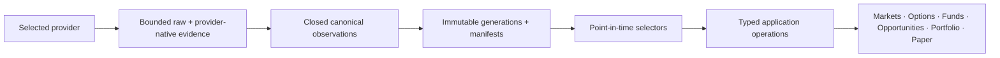

# Selected provider contracts

This index is the maintained contract map for every source selected by Market Squawk's market-data
data architecture. Each provider page records the exact upstream surface, feed semantics, capacity
evidence, canonical destination, scheduling role, implementation status, and product acceptance
gate. These pages define target contracts; they do not claim that every adapter or workflow ships.

| Field | Value |
| --- | --- |
| Document type | Provider-contract index |
| Audience | Operators, data engineers, quantitative researchers, application integrators, and reviewers |
| Status | Selected target architecture; implementation readiness is stated per provider |
| Evidence cutoff | 2026-08-11, America/New_York |
| Audit basis | `3a2f24ddbe88a886d9ba6458dd141774e3716a9d` plus the preserved working-tree overlay |

Every numeric or contractual statement uses one evidence class:

- **VERIFIED PROVIDER FACT** — stated by a current first-party source.
- **APPLICATION POLICY** — a Market Squawk safety, capacity, scheduling, or product decision.
- **RUNTIME-MEASURED VALUE** — a dated observation from the configured environment, not a promise.
- **UNVERIFIED ENTITLEMENT/ASSUMPTION** — a boundary that requires a current probe or benchmark.

## Selected providers

| Provider | Selected role | Primary canonical destination |
| --- | --- | --- |
| [Charles Schwab Trader API — Individual](charles-schwab.md) | Optional owner-enabled multi-asset REST and Streamer complement | `market_squawk.market_events`, `option_snapshots`, `research_observations`, instrument identity |
| [Alpaca Paper Only / Basic](alpaca.md) | Free email-signup Paper Only IEX equity/ETF current-data and history core; no live brokerage onboarding required; indicative options for proven entitlement | `market_squawk.market_events`, `option_snapshots`, historical `research_observations` |
| [Yahoo Finance / yfinance](yahoo-finance.md) | Adaptive explicit-demand enrichment only | Experimental provider-native market/history evidence |
| [Nasdaq Trader](nasdaq-trader.md) | Current listed security and exchange reference | `market_squawk.instrument_lifecycle` |
| [OCC](occ.md) | Option product, series, and operative contract-event reference | `market_squawk.instrument_lifecycle`, option contract events |
| [Cboe](cboe.md) | Venue-specific option-series and symbology reference | `market_squawk.instrument_lifecycle`, option contract identity |
| [IEX HIST](iex-hist.md) | Selected, byte-admitted T+1 IEX feed/date research | Raw PCAP, validated `market_squawk.market_events`, derived bars |
| [SEC EDGAR/XBRL/N-PORT/N-CEN](sec.md) | Company filings/facts and fund/ETF holdings/metadata | `market_squawk.research_observations`, `fund_holdings` |
| [FRED/ALFRED](fred-alfred.md) | Macro series, releases, observations, and historical vintages | Macro `market_squawk.research_observations` |
| [BLS](bls.md) | Labor, inflation, employment, wage, and productivity series | Macro `market_squawk.research_observations` |
| [BEA](bea.md) | National, regional, industry, income, and international accounts | Macro `market_squawk.research_observations` |
| [Census Data API](census.md) | Demographic, geographic, trade, household, and business evidence | Macro/reference `market_squawk.research_observations` |
| [EIA API v2](eia.md) | Energy production, inventory, consumption, and price evidence | Macro/commodity `market_squawk.research_observations` |
| [Treasury Fiscal Data](treasury-fiscal-data.md) | Auctions, debt, fiscal, and dataset-specific Treasury evidence | Fiscal/rate `market_squawk.research_observations` |
| [Treasury daily rates](treasury-daily-rates.md) | Five official nominal, bill, long-term, and real-rate families | Rate `market_squawk.research_observations` |
| [Federal Reserve Board DDP](federal-reserve-board.md) | Direct current-definition statistical releases | Macro/rate `market_squawk.research_observations` |
| [Tiingo Starter](tiingo.md) | Optional supported mutual-fund NAV and curated EOD validation | Fund NAV/EOD observations |

## Common data path

No frontend calls a provider or parses a provider payload. Every source must complete the same
evidence path before its data can enable a user workflow:



The readiness chain is:

```text
documented -> configured -> entitled -> producing -> published -> queryable
           -> workflow-composed -> restart/release-proven
```

An enabled field or successful HTTP response is not the same as an available product capability.
Missing entitlement, incomplete pagination, ambiguous identity, stale evidence, unsupported feed
semantics, or absent frontend composition remains visible as Probe required, Degraded, or
Unavailable.

## Shared storage and selection contract

| Layer | Responsibility |
| --- | --- |
| Bounded memory | Current subscriptions, sequence/gap state, latest observations, and live feature windows |
| Raw objects | Exact bounded response pages or stream micro-batches, secret-free and content-addressed |
| Arrow | Provider-native and canonical schema validation/conversion |
| Immutable Parquet | Canonical and derived generations with schema, clock, source, quality, and parent identity |
| SQLite | Profiles, entitlements, quota permits, jobs, cursors, checkpoints, health, manifests, pins, and recovery |
| PIT selectors | Evidence available at an exact decision cutoff, with missing/conflict/degraded state |
| Typed operations | Bounded provider-independent results shared by Desktop, CLI, and MCP |

Provider, product, feed, venue/book, delivery mode, delay, account realm, schema/field dictionary,
event/reference/release/availability clocks, and connection generation remain explicit. A selector
may prefer one observation for one workflow, but it must retain the selected evidence and every
rejection or downgrade reason.

## Related authorities

- [Market-data provider architecture](../../architecture/market-data-provider-architecture.md)
- [Canonical schema and evidence contract](../market-data-canonical-schemas.md)
- [Provider account and credential setup](../../operations/provider-account-setup.md)
- [Provider credential input template](../market-squawk-provider-credentials.env.example)
- [Shipping source coverage](../source-coverage.md)
- [Data quality](../data-quality.md)
- [Time and provenance](../time-and-provenance.md)
- [Research data plane](../../architecture/research-data-plane.md)
- [Delivery ledger](../../plans/delivery-ledger.md)
