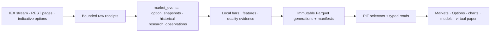

# Alpaca Paper Only / Basic market data

| Field | Value |
| --- | --- |
| Document type | Selected-provider target and evidence contract |
| Audience | Operators, financial-data engineers, quantitative researchers, application integrators, and reviewers |
| Status | Core IEX equity/ETF current-data and historical foundation; indicative options are entitlement-gated; adapter foundations exist, but broad scheduling and complete product composition do not yet ship |
| Evidence cutoff | 2026-08-11, America/New_York |
| Audit basis | `3a2f24ddbe88a886d9ba6458dd141774e3716a9d` plus the preserved working-tree overlay |
| Refresh gate | Re-probe the configured realm, response schemas, headers, effective batch size, and option entitlement before changing scheduler defaults or claiming end-to-end availability |

Numeric and contractual statements use the evidence labels defined in the
[provider index](README.md).

## Role and product workflows

Alpaca supplies the base current and historical market-data plane for equities and ETFs.
Its option surfaces are admitted only after the exact Paper credential proves the entitlement.

| Data family | Intended workflows |
| --- | --- |
| IEX quotes, trades, status, and bars | Markets current view, portfolio marks, local features, watchlists, and virtual-paper evidence |
| Batched latest quotes and snapshots | Priority and broad-universe current views, screening, freshness repair, and model inputs |
| Historical stock/ETF bars | Charts, gap repair, forecasts, factor research, and backtests |
| Indicative option stream and snapshots | Options workspace, IV/Greeks research, and selected live validation |
| Historical option bars/trades | Volatility studies, option backtests within available history, and gap repair |
| Corporate-action endpoint | Split/dividend/reference validation when exact event coverage is proven |

The frontend consumes canonical typed reads. It never sends provider requests or treats Alpaca
credentials as order authority.

## Authentication and setup

- **VERIFIED PROVIDER FACT:** Alpaca Paper Only is free, can be opened with an email address, does
  not require a live brokerage account, and receives IEX market data. Paper Only is the selected
  base account; option access remains a separate runtime entitlement decision.
- **VERIFIED PROVIDER FACT:** Market-data requests authenticate with
  `APCA-API-KEY-ID` and `APCA-API-SECRET-KEY` headers.
- **APPLICATION POLICY:** Import one complete protected credential envelope containing `key_id`,
  `secret_key`, and the realm that issued the pair: `paper` or `live`.
- **APPLICATION POLICY:** Paper is the selected base realm. The realm field determines
  authentication routing; it does not enable order endpoints in Market Squawk.
- **APPLICATION POLICY:** Permit only code-owned `https://data.alpaca.markets` and
  `wss://stream.data.alpaca.markets` market-data surfaces. No order route belongs to this
  provider contract.
- **APPLICATION POLICY:** Keep secrets in bounded, zeroizing credential types and the protected
  secret store. Redact authentication headers and account digests from raw receipts and logs.

## Endpoint and data-family contract

| Evidence | Exact endpoint | Admitted data |
| --- | --- | --- |
| **VERIFIED PROVIDER FACT** | `wss://stream.data.alpaca.markets/v2/iex` | Real-time IEX stock/ETF trades, quotes, bars, status, LULD, corrections, and cancels exposed by the stream |
| **VERIFIED PROVIDER FACT** | `GET https://data.alpaca.markets/v2/stocks/quotes/latest` | Multi-symbol latest stock quotes |
| **VERIFIED PROVIDER FACT** | `GET https://data.alpaca.markets/v2/stocks/{symbol}/quotes/latest` | One-symbol latest stock quote |
| **VERIFIED PROVIDER FACT** | `GET https://data.alpaca.markets/v2/stocks/snapshots` | Multi-symbol latest trade, quote, minute bar, daily bar, and previous daily bar |
| **VERIFIED PROVIDER FACT** | `GET https://data.alpaca.markets/v2/stocks/{symbol}/snapshot` | One-symbol composite snapshot |
| **VERIFIED PROVIDER FACT** | `GET https://data.alpaca.markets/v2/stocks/bars` | Paginated multi-symbol historical bars |
| **VERIFIED PROVIDER FACT** | `GET https://data.alpaca.markets/v2/stocks/{symbol}/bars` | Paginated one-symbol historical bars |
| **VERIFIED PROVIDER FACT** | `wss://stream.data.alpaca.markets/v1beta1/indicative` | Indicative option quote stream and delayed option trades when entitled |
| **VERIFIED PROVIDER FACT** | `GET https://data.alpaca.markets/v1beta1/options/snapshots` | Multi-contract option snapshots |
| **VERIFIED PROVIDER FACT** | `GET https://data.alpaca.markets/v1beta1/options/snapshots/{underlying_symbol}` | Paginated option-chain snapshots for one underlying |
| **VERIFIED PROVIDER FACT** | `GET https://data.alpaca.markets/v1beta1/options/quotes/latest` | Latest option quotes |
| **VERIFIED PROVIDER FACT** | `GET https://data.alpaca.markets/v1beta1/options/trades/latest` | Latest option trades subject to feed delay |
| **VERIFIED PROVIDER FACT** | `GET https://data.alpaca.markets/v1beta1/options/bars` | Paginated historical option bars |
| **VERIFIED PROVIDER FACT** | `GET https://data.alpaca.markets/v1beta1/options/trades` | Paginated historical option trades |
| **VERIFIED PROVIDER FACT** | `GET https://data.alpaca.markets/v1/corporate-actions` | Corporate-action announcements exposed by the endpoint |

All paginated routes must continue until `next_page_token` is absent and must publish requested,
returned, missing, page, and completion evidence.

## Feed provenance and clocks

- **VERIFIED PROVIDER FACT:** Basic current equity/ETF data is IEX.
- **VERIFIED PROVIDER FACT:** The Basic equity WebSocket permits at most `30 symbol
  subscriptions`.
- **VERIFIED PROVIDER FACT:** The selected option stream is `indicative`, permits at most
  `200 quote subscriptions`, does not allow a wildcard quote subscription, and uses MessagePack
  data frames.
- **VERIFIED PROVIDER FACT:** Indicative option quotes are not OPRA observations; indicative
  option trades are delayed by `15 minutes`.
- **APPLICATION POLICY:** Canonical feed values are `ALPACA_IEX` at `DirectUnverified` quality and
  `ALPACA_INDICATIVE_OPTIONS` at `Indicative` quality. Never upgrade either during normalization.
- **APPLICATION POLICY:** Preserve provider symbol, canonical `InstrumentId`, feed, exchange,
  event/component timestamp, receive/ingest/availability timestamps, sequence, conditions,
  correction/cancel relationship, LULD/status state, and connection generation.
- **UNVERIFIED ENTITLEMENT/ASSUMPTION:** Alpaca documentation has used conflicting stock quote-size
  descriptions. Size units must be bound to the exact endpoint and frozen schema rather than one
  universal multiplier.

## Official limits and coverage

- **VERIFIED PROVIDER FACT:** The Basic market-data API allocation is `200 requests per minute`.
- **VERIFIED PROVIDER FACT:** Basic stock history is available from `2016`, while the most recent
  `15 minutes` of historical data is restricted.
- **VERIFIED PROVIDER FACT:** Historical option data begins in `February 2024`.
- **VERIFIED PROVIDER FACT:** Multi-contract option snapshots accept up to `100 option symbols per
  request`.
- **VERIFIED PROVIDER FACT:** An option-chain page can return up to `1,000 snapshots`.
- **VERIFIED PROVIDER FACT:** Historical option requests accept up to `100 symbols` and up to
  `10,000 data points per page`.
- **UNVERIFIED ENTITLEMENT/ASSUMPTION:** The current first-party stock latest/snapshot contract does
  not establish a numeric multi-symbol maximum usable as a static application constant.
- **UNVERIFIED ENTITLEMENT/ASSUMPTION:** Paper-key indicative option and fixed-income entitlement
  must be determined by the configured credential at runtime.

## Application budgets and adaptive admission

All values in this section are planning controls, not provider promises.

| Evidence | Initial policy |
| --- | --- |
| **APPLICATION POLICY** | Hard application ceiling: `150 requests/minute` across all admitted Alpaca REST work |
| **APPLICATION POLICY** | Recurring target: at most `120 requests/minute`, leaving headroom for interactive work, retries, pagination, and repair |
| **APPLICATION POLICY** | Initial stock batch: `50 symbols`; expand or shrink from returned rows, payload bytes, latency, headers, partial results, and `429` evidence |
| **APPLICATION POLICY** | LIVE: at most `30` priority equities/ETFs on the IEX stream |
| **APPLICATION POLICY** | FAST planning target: up to `300` promoted symbols at approximately `15-second` snapshots |
| **APPLICATION POLICY** | WARM-1 planning target: `500` higher-priority symbols at approximately `60 seconds` |
| **APPLICATION POLICY** | WARM-2 planning target: `7,500` disjoint broad-universe symbols at approximately `120 seconds` |
| **APPLICATION POLICY** | OPTIONS planning target: about `50` underlyings at approximately `300-second` chain cadence, only after entitlement and page-count proof |

**APPLICATION POLICY:** The proposed combined scheduler is not admitted merely because the
arithmetic fits. It requires an effective complete stock batch of at least `50 symbols` and
measured shared-queue headroom.
`X-RateLimit-*` headers, `Retry-After`, `429` responses, missing symbols, latency, bytes, queue lag,
CPU, memory, and write throughput override static targets.

## Runtime measurements

These configured-environment observations are diagnostics, not capacity guarantees:

| Evidence | Observation |
| --- | --- |
| **RUNTIME-MEASURED VALUE** | AAPL latest IEX quote returned `200` with rate-limit value `200` and remaining value `199` |
| **RUNTIME-MEASURED VALUE** | AAPL/MSFT/SPY composite snapshots all returned |
| **RUNTIME-MEASURED VALUE** | Stock batches returned `50/50`, `100/100`, `200/200`, `500/500`, and `1,000/1,000` |
| **RUNTIME-MEASURED VALUE** | Those batch probes took approximately `201/252/308/358/417 ms` and returned approximately `28/57/113/282/563 KiB` |
| **RUNTIME-MEASURED VALUE** | A SPY indicative option-chain request with `limit=1` returned one snapshot and a continuation token |
| **RUNTIME-MEASURED VALUE** | The configured credential received HTTP `403` on the sampled fixed-income route; that capability is unavailable for this credential |

## Canonical schema, storage, and PIT destination

- Stream quotes/trades/bars/status/corrections target `market_squawk.market_events`.
- Complete option-chain and contract-snapshot generations target `option_snapshots`.
- Historical bars/trades and corporate-action evidence target versioned
  `research_observations` until their exact domain schema is closed.
- **APPLICATION POLICY:** Locally derive `1s`, `5s`, `15s`, `30s`, `1m`, `5m`, `15m`, `1h`, and
  `1d` bars/features from suitable current events; do not request redundant derived values.
- Raw pages/micro-batches are content-addressed; SQLite owns profile, entitlement, quota permits,
  cursors, checkpoints, subscriptions, jobs, manifests, health, and recovery.
- PIT selection uses provider event/component, receive, ingestion, and availability clocks plus the
  exact immutable generation. A paginated dataset is not selectable until complete.

## Scheduling and degradation

LIVE owns the bounded IEX stream. FAST and WARM use information-dense snapshots where one response
replaces separate latest quote/trade/bar calls. OPTIONS prefers complete chain pages instead of
simultaneously collecting equivalent per-contract snapshots and Greeks. COLD owns history,
corporate actions, and repair.

When capacity tightens, reduce cold catch-up, then FAST cadence, WARM-2 cadence/breadth, and option
refresh. Preserve interactive requests, active research/positions, watchlists, gap repair, LIVE,
and WARM-1. Never burst above the configured maximum to catch up. Missing entitlement disables only
that family.

## Repository integration seams and current status

| Seam | Current status |
| --- | --- |
| Adapter and credentials | `adapters/market-squawk-adapter-alpaca` implements bounded credential parsing, IEX and indicative stream foundations, native decoders, and historical client foundations |
| Onboarding | `alpaca.basic-market-data` is defined in `crates/market-squawk-sources/src/onboarding/built_in_profiles.rs` and probed through the existing activation service |
| Activation and rate authority | `apps/market-squawk/src/provider_activation/alpaca.rs` binds account authority and the shared provider-rate store |
| Live composition | Alpaca dispatch exists in `apps/market-squawk/src/live_source/provider.rs` and `apps/market-squawk/src/application/market_runtime/group.rs` |
| Historical path | Preflight, pagination, raw-page retention, header evidence, market-calendar checks, and research-ingestion foundations exist in the adapter/runtime |
| Remaining composition | Broad latest/snapshot scheduling, complete option-chain REST publication, adaptive admission, product typed reads, and release/restart journeys remain incomplete |

Existing code is a substantive foundation, not proof that the source is available in every product
workflow.

## Doctor and end-to-end acceptance gates

Doctor must report, without secrets:

1. configured credential generation and paper/live realm;
2. IEX quote and stream entitlement;
3. option stream/REST entitlement separately;
4. observed rate-limit headers, application permits, effective complete batch, and circuit state;
5. fixed-income and corporate-action capability as available, degraded, or unavailable;
6. latest successful publication/checkpoint and data freshness.

Availability requires:

- multi-symbol quote/snapshot returned-versus-requested evidence and adaptive batch behavior;
- IEX stream subscription ceiling, reconnect, correction/cancel, status/LULD, gap, and duplicate
  tests on static fixtures plus a focused runtime journey;
- complete stock/option pagination and durable restart from checkpoints;
- raw -> canonical -> immutable manifest -> PIT selection -> typed Markets/Options/chart read;
- visible IEX/indicative/delay/freshness labels and clean degradation under `429`, entitlement loss,
  partial results, or provider outage;
- a focused process-restart journey proving no stale observation is silently presented as current.

## Hard gaps

- A sustainable combined FAST/WARM/OPTIONS workload has not been measured during a regular session.
- **RUNTIME-MEASURED VALUE:** The stock multi-symbol maximum remains unpublished; `1,000`-symbol
  success is only a dated probe.
- Configured Paper option entitlement and every option field/clock need an end-to-end product proof.
- **VERIFIED PROVIDER FACT:** Historical options before `February 2024` are unavailable from this
  source.
- **VERIFIED PROVIDER FACT:** The most recent `15 minutes` of Basic historical stock data cannot
  serve immediate gap repair.
- Corporate-action lifecycle completeness and fixed-income availability are not established.
- Broad snapshot scheduling, option-chain publication, typed product composition, and complete
  restart/release acceptance remain unfinished.

## First-party sources

- [Paper Trading and Paper Only accounts](https://docs.alpaca.markets/us/docs/paper-trading)
- [About the Market Data API](https://docs.alpaca.markets/us/docs/about-market-data-api)
- [Real-time stock data](https://docs.alpaca.markets/us/docs/real-time-stock-pricing-data)
- [Real-time option data](https://docs.alpaca.markets/us/docs/real-time-option-data)
- [Historical option data](https://docs.alpaca.markets/us/docs/historical-option-data)
- [Single-stock snapshot](https://docs.alpaca.markets/us/reference/stocksnapshotsingle)
- [Multi-contract option snapshots](https://docs.alpaca.markets/us/reference/optionsnapshots)
- [Underlying option-chain snapshots and pagination](https://docs.alpaca.markets/us/reference/optionchain)
- [Historical option bars](https://docs.alpaca.markets/us/reference/optionbars)

## Related maintained contracts

- [Provider architecture](../../architecture/market-data-provider-architecture.md)
- [Provider setup](../../operations/provider-account-setup.md)
- [Credential input template](../market-squawk-provider-credentials.env.example)
- [Canonical schema and evidence contract](../market-data-canonical-schemas.md)
- [Shipping source coverage](../source-coverage.md)
