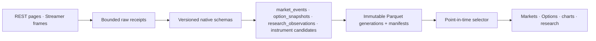

# Charles Schwab Trader API — Individual

| Field | Value |
| --- | --- |
| Document type | Selected-provider target and evidence contract |
| Audience | Operators, financial-data engineers, quantitative researchers, application integrators, and reviewers |
| Status | Optional owner-enabled provider; bounded authenticated evidence exists; no Schwab adapter or product composition ships yet |
| Evidence cutoff | 2026-08-11, America/New_York |
| Audit basis | `3a2f24ddbe88a886d9ba6458dd141774e3716a9d` plus the preserved working-tree overlay |
| Refresh gate | Re-freeze the authenticated OpenAPI/schema, repeat regular-session capacity and reconnect measurements, and pass the acceptance chain below before implementation can be called available |

Numeric and contractual statements use the evidence labels defined in the
[provider index](README.md).

## Role and product workflows

Schwab is a complementary, user-enabled source for current multi-asset market evidence. Its
admission does not make it a product dependency.

| Data family | Intended workflows |
| --- | --- |
| Quotes and reference data | Markets current view, instrument search, portfolio marks, and cross-source diagnostics |
| Price history | Charts, gap repair, features, forecasts, and backtests |
| Option chains and expiration chains | Options contract discovery, chain workspace, volatility features, and strategy research |
| Market hours and movers | Session state, market context, and explicit-demand discovery |
| Streamer level-one, charts, and books | Selected live Markets/Options observations and venue-specific microstructure research |

The frontend never authenticates with Schwab or parses Schwab payloads. It consumes typed,
provider-independent reads after canonical publication and point-in-time selection.

## Authentication and setup

- **VERIFIED PROVIDER FACT:** Individual applications use a three-legged OAuth flow with user
  consent and account selection.
- **VERIFIED PROVIDER FACT:** Token exchange and refresh use
  `POST https://api.schwabapi.com/v1/oauth/token` with HTTP Basic client authentication and a
  form-encoded body.
- **VERIFIED PROVIDER FACT:** Access tokens expire after `30 minutes` and refresh tokens after
  `7 days`.
- **RUNTIME-MEASURED VALUE:** The configured authorization flow used
  `GET https://api.schwabapi.com/v1/oauth/authorize` successfully.
- **UNVERIFIED ENTITLEMENT/ASSUMPTION:** Its current parameter schema must still be re-frozen from
  the approved application's documentation/OpenAPI before adapter admission.
- **APPLICATION POLICY:** The exact callback is `https://127.0.0.1:8182`, without a trailing slash.
  It is a code-owned loopback OAuth receiver, not an operator-tunable data endpoint.
- **APPLICATION POLICY:** Store the client identifier, client secret, refresh-token generation,
  scopes, and expiry metadata in the existing protected secret/session system. Never place tokens
  or authorization codes in logs, manifests, raw market receipts, or provider pages.
- **APPLICATION POLICY:** Refresh in advance of expiry, rotate the refresh-token generation
  atomically, and retain only the newest valid generation after a verified handoff.

Streamer bootstrap is intentionally narrow:

- **VERIFIED PROVIDER FACT:** `GET https://api.schwabapi.com/trader/v1/userPreference` supplies
  `streamerInfo` needed to build the stream login.
- **APPLICATION POLICY:** Extract only streamer connection coordinates and market-data
  permission/offer fields; discard unrelated account-preference fields.
- **APPLICATION POLICY:** Obtain the WebSocket URL and login coordinates dynamically. Do not
  hard-code a Streamer host.

## Endpoint and data-family contract

**VERIFIED PROVIDER FACT:** The authenticated market-data base is
`https://api.schwabapi.com/marketdata/v1`.

| Evidence | Method and path | Admitted data |
| --- | --- | --- |
| **RUNTIME-MEASURED VALUE** | `GET /quotes` | Batched quotes for supported symbols |
| **RUNTIME-MEASURED VALUE** | `GET /{symbol_id}/quotes` | One-symbol quote |
| **RUNTIME-MEASURED VALUE** | `GET /chains` | Option-chain contracts, quotes, and analytics exposed by the response schema |
| **RUNTIME-MEASURED VALUE** | `GET /expirationchain` | Expiration inventory |
| **RUNTIME-MEASURED VALUE** | `GET /pricehistory` | Candle history |
| **RUNTIME-MEASURED VALUE** | `GET /movers/{symbol_id}` | Market/index mover set |
| **RUNTIME-MEASURED VALUE** | `GET /markets` and `GET /markets/{market_id}` | Market-hours evidence |
| **RUNTIME-MEASURED VALUE** | `GET /instruments` | Symbol-description and fundamental/reference search |
| **RUNTIME-MEASURED VALUE** | `GET /instruments/{cusip_id}` | CUSIP-addressed instrument detail |

The currently selected Streamer services are:

- **VERIFIED PROVIDER FACT:** `LEVELONE_EQUITIES`, `LEVELONE_OPTIONS`,
  `LEVELONE_FUTURES`, `LEVELONE_FUTURES_OPTIONS`, and `LEVELONE_FOREX`.
- **VERIFIED PROVIDER FACT:** `NYSE_BOOK`, `NASDAQ_BOOK`, and `OPTIONS_BOOK`.
- **VERIFIED PROVIDER FACT:** `CHART_EQUITY`, `CHART_FUTURES`,
  `SCREENER_EQUITY`, and `SCREENER_OPTION`.
- **VERIFIED PROVIDER FACT:** `SUBS` replaces a service's subscribed symbol set; `ADD` preserves
  the existing set and adds keys.
- **APPLICATION POLICY:** One serialized desired-state controller owns login, subscriptions,
  reconnect, and replacement/addition commands.

**APPLICATION POLICY:** No other `trader/v1` route is part of this data contract.

## Feed provenance and clocks

Every raw and canonical observation retains:

- provider, endpoint or Streamer service, response/field-dictionary version, and account realm;
- provider symbol, canonical `InstrumentId`, asset class, venue or named book, and delivery mode;
- event/component timestamp, local receive timestamp, ingestion timestamp, and local availability
  timestamp;
- stream sequence, command/request identifier, connection generation, reconnect gap, and
  delay/indicative fields exposed by the payload;
- raw bid, ask, sizes, trade, candle, chain, or book components without fabricating missing values.

**APPLICATION POLICY:** Do not infer consolidated, SIP, NBBO, OPRA, or consolidated full-depth
semantics from a route or service name. A Schwab book remains a named, provider-delivered book.
Preserve one-sided, crossed, locked, stale, partial, and out-of-order observations with quality
flags.

## Official limits, non-findings, and application admission

- **VERIFIED PROVIDER FACT:** Schwab documents one simultaneous Streamer connection per user.
- **VERIFIED PROVIDER FACT:** Streamer response code `19` identifies a symbol-limit failure, but
  the reviewed first-party material does not publish the numeric ceiling.
- **UNVERIFIED ENTITLEMENT/ASSUMPTION:** No current numeric market-data REST RPM, quote batch
  maximum, command rate, frame/byte ceiling, replay guarantee, or numeric per-service subscription
  ceiling was established from first-party sources.
- **APPLICATION POLICY:** Start REST quote batches at `50 symbols` and adapt only from complete
  return counts, response bytes, latency, `429`/retry evidence, queue lag, and write throughput.
- **APPLICATION POLICY:** Admit one Streamer connection and small explicit service/symbol sets.
  Do not assign a recurring numeric REST budget until a regular-session soak establishes one.
- **APPLICATION POLICY:** A successful HTTP status is not a capacity result; requested, returned,
  missing, duplicate, and malformed instruments are counted separately.

## Runtime measurements

The following are dated diagnostics, not guarantees:

| Evidence | Configured-environment observation |
| --- | --- |
| **RUNTIME-MEASURED VALUE** | OAuth token exchange returned `200` with `expires_in=1800` seconds |
| **RUNTIME-MEASURED VALUE** | AAPL/MSFT/SPY quotes: `3,436 bytes` in `386.325 ms` |
| **RUNTIME-MEASURED VALUE** | SPY chain: `350 contracts` across `35` call/put expiration groups, `420,823 bytes` in `638.746 ms` |
| **RUNTIME-MEASURED VALUE** | Expiration chain: `35` entries, `4,661 bytes` in `474.629 ms` |
| **RUNTIME-MEASURED VALUE** | AAPL one-minute history: `12,963 candles`, `1,260,404 bytes` in `693.558 ms` |
| **RUNTIME-MEASURED VALUE** | Quote batches returned `50/50`, `100/100`, `200/200`, and `500/500`; the `500` response was `559,087 bytes` in `729.003 ms` |
| **RUNTIME-MEASURED VALUE** | Stream login and selected subscriptions returned code `0`; level-one equity/option, Nasdaq book, option book, and equity chart data arrived within `5,558.070 ms` in an after-hours probe |
| **RUNTIME-MEASURED VALUE** | Successful sampled REST responses exposed neither `Retry-After` nor `X-RateLimit-*` headers |

**RUNTIME-MEASURED VALUE:** Observed support also included equity, ETF, mutual-fund, index, forex,
and futures identifiers, market hours, movers, instrument fundamentals, and option-chain data.
Each family still needs schema and entitlement proof before product admission.

## Canonical schema, storage, and PIT destination

- Quotes, trades, charts, and validated book events target `market_squawk.market_events`.
- Chain generations target `option_snapshots` with page/completeness and underlying-price context.
- Price history targets historical `research_observations` and locally derived bars/features.
- Instrument search/detail remains provider-native evidence until exact canonical identity resolves.
- Raw REST pages and bounded Streamer micro-batches are content-addressed; SQLite owns OAuth
  sessions, entitlement, rate permits, subscriptions, cursors, health, jobs, and recovery.
- PIT selection uses source/event/component/receive/availability clocks. A later response must not
  become evidence for an earlier cutoff.

## Scheduling and degradation

- Interactive quote/search/history requests use a shared priority queue.
- Selected current symbols may use Streamer; REST supplies explicit-demand snapshots, chain pages,
  history, and repair.
- Reconnect uses bounded backoff, a new connection generation, desired-state replay, duplicate
  suppression, and explicit gap intervals.
- Capacity pressure reduces background history, movers, broad REST batches, and lower-priority
  subscriptions before active research and interactive requests.
- Token refresh failure, account unlink, entitlement rejection, schema drift, repeated partial
  batches, or an open circuit makes Schwab `Degraded` or `Unavailable` without blocking other
  canonical data.

## Repository integration seams and current status

**APPLICATION POLICY:** Reuse the existing architecture; do not introduce a Schwab-specific
configuration, storage, scheduler, or frontend data path.

| Seam | Current status and required integration |
| --- | --- |
| Provider onboarding and secret store | No Schwab profile/adapter currently exists; add OAuth session activation through the existing onboarding and protected session authorities |
| Shared provider rate authority | Reuse `crates/market-squawk-sources/src/policy/provider_rate.rs` and `crates/market-squawk-data/src/provider_rate.rs` |
| Live source and capture | Add one Schwab controller/decoder behind `apps/market-squawk/src/live_source/provider.rs` and the existing bounded capture path |
| Canonical schemas | Map through `crates/market-squawk-data/src/schema.rs` and `crates/market-squawk-domain/src/market.rs`; version the Streamer field dictionary |
| Runtime composition | Add typed activation and group ownership under `apps/market-squawk/src/provider_activation/` and the Market runtime |
| Product reads | Add provider-independent typed reads; never expose raw Schwab JSON or socket frames to Desktop |

## Doctor and end-to-end acceptance gates

Doctor must prove, without displaying secrets or account data:

1. configured application and exact callback;
2. authorization/refresh session state and next expiry;
3. authenticated market-data schema/OpenAPI digest;
4. quote, history, chain, instrument, market-hours, and Streamer entitlement by data family;
5. observed limits/non-findings, partial results, and circuit health.

Availability requires all of:

- normal-session REST batch and Streamer soak with returned/missing counts, bytes, latency, queue
  depth, ingestion lag, and write throughput;
- token refresh and process-restart recovery without a second interactive login while refresh is
  valid;
- one-socket reconnect, desired-state restore, sequence/gap evidence, and duplicate handling;
- raw receipt -> versioned decode -> canonical validation -> immutable manifest -> PIT selector;
- bounded typed Markets and Options reads, visible feed/freshness/degradation, and a focused
  restart journey;
- account unlink/revocation producing a clean Schwab-unavailable state without stale-current data.

## Hard gaps

- Current authenticated OpenAPI/schema export and hash are not frozen.
- Sustainable regular-session REST and Streamer capacity is not measured.
- Numeric Streamer symbol/service ceilings, replay behavior, and book completeness are unpublished.
- Book-field semantics, sequence recovery, corrections, and every asset-family clock need
  versioned fixture coverage.
- No Schwab adapter, scheduler lane, canonical mapper, typed application read, or frontend
  composition currently ships.

## First-party sources

- [Trader API — Individual product](https://developer.schwab.com/products/trader-api--individual)
- [Individual developer role](https://developer.schwab.com/user-guides/individual-developer/about-individual-developer-role)
- [OAuth restart versus refresh token](https://developer.schwab.com/user-guides/apis-and-apps/oauth-restart-vs-refresh-token)
- [Callback URL requirements](https://developer.schwab.com/user-guides/apis-and-apps/app-callback-url-requirements)
- [Trader API production documentation](https://contentdelivery.schwab.com/api/content/rtcontent/asset/retail-trader-api-production--trader-api--individual--documentation)
- [Market-data production documentation](https://contentdelivery.schwab.com/api/content/rtcontent/asset/market-data-production--trader-api--individual--documentation)

## Related maintained contracts

- [Provider architecture](../../architecture/market-data-provider-architecture.md)
- [Provider setup](../../operations/provider-account-setup.md)
- [Credential input template](../market-squawk-provider-credentials.env.example)
- [Canonical schema and evidence contract](../market-data-canonical-schemas.md)
- [Shipping source coverage](../source-coverage.md)
