# IEX HIST feed files

| Field | Value |
| --- | --- |
| Document type | Selected-provider target and evidence contract |
| Audience | Operators, financial-data engineers, quantitative researchers, application integrators, and reviewers |
| Status | Selected cold-research source; public catalog evidence exists; no downloader, feed decoder, canonical publisher, or product composition ships yet |
| Evidence cutoff | 2026-08-11, America/New_York |
| Audit basis | `3a2f24ddbe88a886d9ba6458dd141774e3716a9d` plus the preserved working-tree overlay |
| Refresh gate | Freeze the selected feed/date descriptor and matching transport/feed specification, then prove bounded download, decode, continuity, publication, PIT selection, and restart before use |

Numeric and contractual statements use the evidence labels defined in the
[provider index](README.md).

## Role and product workflows

IEX HIST is a selected, byte-admitted cold source for venue-specific historical microstructure and
validation. It is not a live feed and is never an automatic full-archive mirror.

**VERIFIED PROVIDER FACT:** IEX describes HIST as T+1 historical feed-file access.

| Feed evidence | Intended workflows |
| --- | --- |
| TOPS | IEX top-of-book, last-sale, status, auction, quote/trade validation, and derived bars |
| DEEP | IEX displayed price-level depth and microstructure research |
| DEEP+ | IEX displayed order-by-order depth and queue/order-flow research |
| Selected decoded events | Historical studies, data-quality diagnostics, model features, and gap analysis |

Product reads must say IEX, selected feed, venue-specific, and historical local availability. The
frontend never opens PCAP files or assumes they describe the consolidated market.

## Authentication and setup

- **VERIFIED PROVIDER FACT:** The selected IEX HIST public-file discovery and download path requires
  no API key.
- **APPLICATION POLICY:** The credential template contains only an enabled flag and bounded
  operational controls. Catalog and file URLs are adapter-owned evidence, not operator-tunable
  secrets.
- **APPLICATION POLICY:** Enabling the provider makes explicit feed/date jobs eligible; it does not
  start downloading an archive.
- **APPLICATION POLICY:** Each job binds catalog receipt digest, descriptor, trade date, feed name,
  transport version, feed-spec version, advertised compressed bytes, decoder version, and local
  limits before network admission.

## Discovery, files, and data families

| Evidence | Exact surface | Contract |
| --- | --- | --- |
| **RUNTIME-MEASURED VALUE** | `GET https://iextrading.com/api/1.0/hist` | JSON catalog of dated file descriptors and download links |
| **VERIFIED PROVIDER FACT** | IEX-TP historical PCAP files | Packet captures whose filename/descriptor identifies date, transport, feed, and feed-spec version |
| **VERIFIED PROVIDER FACT** | TOPS specification | IEX top-of-book plus IEX last-sale, status, and auction messages defined by the matching version |
| **VERIFIED PROVIDER FACT** | DEEP specification | Displayed IEX price-level depth defined by the matching version |
| **VERIFIED PROVIDER FACT** | DEEP+ specification | Displayed IEX order-by-order depth defined by the matching version |

**UNVERIFIED ENTITLEMENT/ASSUMPTION:** The catalog route is runtime-served but is not admitted as a
documented, stable API contract. Its schema, URL, retention, and descriptor fields require a fresh
receipt and validation before every discovery generation.

The downloader follows only the exact file URL returned by the admitted catalog descriptor. It
does not construct archive paths from memory.

## Feed provenance and clocks

- **VERIFIED PROVIDER FACT:** TOPS represents IEX top-of-book and IEX last sale, not a consolidated
  quote or tape.
- **VERIFIED PROVIDER FACT:** DEEP and DEEP+ cover displayed liquidity; hidden and reserve
  liquidity are absent.
- **APPLICATION POLICY:** Preserve provider, venue `IEX`, feed, transport/feed-spec versions, file
  trade date, packet/message type, source timestamp, sequence, local decode time, file discovery
  time, download completion time, publication time, and local availability time.
- **APPLICATION POLICY:** The source becomes PIT-available only when the T+1 file is locally
  complete, validated, decoded, and published. Event time alone must not backdate availability.
- **APPLICATION POLICY:** Detect and retain sequence gaps, duplicates, resets, out-of-order
  messages, unsupported versions, truncation, corrupt packets, and clock anomalies. Quarantine
  affected ranges; never silently fill them.
- **APPLICATION POLICY:** Do not label TOPS as NBBO, DEEP as consolidated depth, or DEEP+ as a
  complete market-wide order book.

## Official limits and non-findings

- **VERIFIED PROVIDER FACT:** IEX presents HIST as recent `12-month` historical access.
- **UNVERIFIED ENTITLEMENT/ASSUMPTION:** No first-party numeric requests/day, files/day, bytes/day,
  concurrency, retry, maximum-file-size, checksum, pagination, or stable retention contract was
  established.
- **UNVERIFIED ENTITLEMENT/ASSUMPTION:** Catalog dates older than the advertised recent window are
  discoverability observations, not a retention promise.

## Application budgets and adaptive admission

No recurring numeric request budget is admitted. Every job passes these independent gates:

- **APPLICATION POLICY:** Exact feed and date are explicitly selected by a user or research job.
- **APPLICATION POLICY:** Advertised compressed bytes, conservative expanded-output ceiling, free
  disk reserve, temporary-file reserve, deadline, network permit, parser memory, and decoder
  version are known before download.
- **APPLICATION POLICY:** One conservative shared transfer lane owns catalog and file work until
  runtime evidence safely admits more concurrency.
- **APPLICATION POLICY:** Download to an incomplete generation, checkpoint verified progress where
  the server permits it, compute a local digest, then atomically promote only after byte and
  structural validation.
- **APPLICATION POLICY:** Decode incrementally with bounded buffers. A full file must never be held
  in memory.
- **APPLICATION POLICY:** No daily full-feed mirror, automatic historical catch-up, or “download
  everything” operation is admitted.

Admission shrinks or stops on descriptor drift, insufficient disk, deadline pressure, unexpected
expansion, transfer failure, unsupported versions, sequence faults, decode lag, queue lag, or
publication pressure.

## Runtime measurements

These catalog observations are dated diagnostics, not future guarantees:

| Evidence | Observation |
| --- | --- |
| **RUNTIME-MEASURED VALUE** | Catalog returned HTTP `200`, `1,346,124 bytes`, an ETag, and local SHA-256 `fe397b0c70fb0a01b0e529c129c0431fbf1e645e2e18368800125aa4d469ac9a` |
| **RUNTIME-MEASURED VALUE** | The parsed catalog contained `2,443 dates` from `2016-12-12` through `2026-08-10` |
| **RUNTIME-MEASURED VALUE** | It contained `5,261 file descriptors` with advertised compressed bytes totaling `22,257,553,998,469` |
| **RUNTIME-MEASURED VALUE** | Descriptors for the newest observed date advertised `32,439,134,082 compressed bytes` in total |

These measurements demonstrate why source admission is by exact feed/date and bytes. No historical
file download, decode, continuity, or canonical-publication claim was established by the catalog
probe.

## Canonical schema, storage, and PIT destination

```mermaid
flowchart LR
    Catalog["Dated catalog receipt"] --> Admit["Feed/date/version/byte admission"]
    Admit --> PCAP["Immutable raw PCAP + digest"]
    PCAP --> Decode["Version-matched incremental decoder"]
    Decode --> Events["Validated IEX market_events"]
    Events --> Derived["Bars · microstructure features · quality evidence"]
    Derived --> Publish["Immutable generations + manifests"]
    Publish --> PIT["PIT selector using local availability"]
```

- The raw PCAP is the primary evidence object; the catalog receipt and selected descriptor are its
  parents.
- Decoded trades, quotes, status, auction, price-level, or order-level messages target
  `market_squawk.market_events` only after the matching schema is closed.
- Bars and microstructure features are derived datasets with parent raw/canonical digests,
  calculation version, event range, and quality summary.
- Arrow is the validation boundary; Parquet stores immutable canonical/derived generations;
  SQLite owns catalog generations, jobs, byte permits, checkpoints, decoder versions, manifests,
  health, and recovery.
- PIT selectors require the exact local availability/publication timestamp and completeness state.
  A partial or quarantined generation is not silently selectable as complete.

## Scheduling and degradation

IEX HIST runs only in the COLD lane. Catalog refresh is bounded and coalesced. File jobs yield to
interactive/current-data work and are independently cancellable and resumable. Capacity pressure
delays unstarted jobs, pauses at a durable checkpoint, lowers transfer/decode concurrency, or
rejects the job before download. Missing dates, descriptor drift, unsupported feed versions,
truncated files, or sequence gaps make only the affected generation `Degraded` or `Unavailable`.

## Repository integration seams and current status

No IEX HIST profile, adapter, downloader, PCAP decoder, schema registry entry, publisher, typed
query, or frontend workflow currently exists.

| Seam | Required integration |
| --- | --- |
| Job ownership | Use `crates/market-squawk-jobs` for explicit, cancellable, checkpointed catalog/download/decode/publication jobs |
| Transfer and admission | Add a bounded adapter using the shared provider-rate authority plus disk/byte/deadline admission |
| Raw evidence | Reuse `crates/market-squawk-platform/src/capture.rs` generation, accounting, digest, and atomic lifecycle patterns |
| Decode/schema | Add version-keyed IEX-TP and TOPS/DEEP/DEEP+ decoders with frozen fixture corpora and `crates/market-squawk-data/src/schema.rs` registration |
| Publication/PIT | Publish immutable Parquet generations and manifests through the existing data plane; bind exact local availability |
| Product reads | Add bounded historical/microstructure typed reads; no PCAP path or decoder object reaches Desktop |

## Doctor and end-to-end acceptance gates

Doctor must report:

1. latest catalog receipt time, status, ETag/digest, schema, and descriptor counts;
2. selected feed/date/version compatibility and matching specification/decoder digest;
3. advertised bytes, required reserve, current free disk, deadline, and admission decision;
4. active checkpoint, transferred/decoded bytes, message counts, continuity faults, quarantine,
   publication, and circuit health.

Availability for one feed/date requires:

- a fresh content-addressed catalog receipt and an exact selected descriptor;
- bounded download with cancellation, failure recovery, digest, byte validation, and atomic
  completion;
- version-matched incremental decode against frozen normal, corrupt, truncated, gap, duplicate,
  reset, out-of-order, and unknown-message fixtures;
- packet/message accounting and sequence/clock continuity evidence;
- raw PCAP -> canonical events -> derived generation -> manifest -> PIT selector -> typed query;
- process-restart recovery from every durable boundary and a focused product journey that visibly
  identifies IEX, feed, trade date, historical local availability, and completeness.

## Hard gaps

- The current catalog schema and retention are not stable first-party API contracts.
- Exact decoder support has not been selected or implemented for the discovered transport/feed
  versions.
- No file download, server resume behavior, checksum source, expansion ratio, or end-to-end decode
  has been measured.
- Full-feed archives can be extremely large; practical scope remains selected feed/date jobs.
- IEX HIST does not provide live data, consolidated quotes/tape/depth, hidden liquidity, or a
  complete market-wide order book.
- No repository integration or product read currently ships.

## First-party sources

- [IEX market data](https://iextrading.com/trading/market-data/index.html)
- [IEX equities market-data connectivity](https://www.iex.io/products/equities/market-data-connectivity)
- [IEX market-data resources](https://www.iex.io/resources/trading/market-data)
- [TOPS specification](https://www.iex.io/documents/tops-v1-66)
- [DEEP specification](https://www.iex.io/documents/deep-v1-08)
- [DEEP+ specification](https://www.iex.io/documents/iex-deep-plus-specification)

## Related maintained contracts

- [Provider architecture](../../architecture/market-data-provider-architecture.md)
- [Provider setup](../../operations/provider-account-setup.md)
- [Credential input template](../market-squawk-provider-credentials.env.example)
- [Canonical schema and evidence contract](../market-data-canonical-schemas.md)
- [Shipping source coverage](../source-coverage.md)
