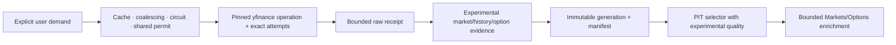

# Yahoo Finance / pinned yfinance integration

| Field | Value |
| --- | --- |
| Document type | Selected-provider target and evidence contract |
| Audience | Operators, financial-data engineers, quantitative researchers, application integrators, and reviewers |
| Status | Provider-local explicit-demand adapter, durable cache/circuit, raw handoff, and canonical publication candidate implemented; application and frontend composition remain open; scheduled ingestion is prohibited |
| Evidence cutoff | 2026-08-11, America/New_York |
| Audit basis | `0a1cee1e6f7cce477ad37028cb6a05a109a4c2ad` plus the preserved working-tree overlay |
| Refresh gate | Re-audit the pinned yfinance release/commit and frozen effective requests before upgrade; require dated measurements before any provider-capacity claim |

Numeric and contractual statements use the evidence labels defined in the
[provider index](README.md).

## Role and product workflows

Yahoo Finance is selected only for bounded, explicit-demand enrichment:

| Data family | Intended workflow |
| --- | --- |
| Current quote components | A user-opened Markets instrument view with explicit experimental provenance |
| Index and fund facts | Bounded instrument detail enrichment |
| Price history and actions | On-demand chart/research validation |
| Option expirations and chains | On-demand Options enrichment when governed sources are incomplete |
| Search/lookup | Discovery hints that still require canonical identity resolution |

It is not a broad scheduled market-data lane, a sole decision input, or an authoritative current
feed. Experimental evidence cannot silently replace or upgrade another selected observation.

## Authentication and setup

- **UNVERIFIED ENTITLEMENT/ASSUMPTION:** The pinned yfinance client currently exposes no-key public
  read paths, but Yahoo does not publish a supported Yahoo Finance API or authentication contract
  for those paths.
- **APPLICATION POLICY:** Operators configure only an enabled flag and application safety controls.
  REST URLs, cookies, crumbs, WebSocket details, retry behavior, repair behavior, and request
  construction are adapter-owned, not credential-file endpoint overrides.
- **APPLICATION POLICY:** Pin the exact yfinance version and source commit, record its hash and
  effective arguments with every raw generation, and re-audit before upgrade.
- **APPLICATION POLICY:** Do not place a Python/yfinance subprocess in the quote hot path. Any
  implementation must use a bounded adapter and the same provider-rate, raw-receipt, schema, and
  typed-read authorities as other sources.

## Endpoint and data-family contract

Yahoo does not publish a supported public market-data REST contract for this use. The table below
is pinned-client implementation evidence, not a Yahoo provider contract. Every row remains
**UNVERIFIED ENTITLEMENT/ASSUMPTION** at the provider level and must be frozen with exact requests,
fixtures, and runtime admission before use.

| Evidence | Exact selected surface | Admitted data |
| --- | --- | --- |
| **UNVERIFIED ENTITLEMENT/ASSUMPTION** | `yfinance.download(tickers, ...)` | One- or multi-ticker price history |
| **UNVERIFIED ENTITLEMENT/ASSUMPTION** | `yfinance.Ticker.history(...)` | One-ticker price history |
| **UNVERIFIED ENTITLEMENT/ASSUMPTION** | `yfinance.Ticker.get_info()` and `fast_info` | Provider-native quote/reference fields |
| **UNVERIFIED ENTITLEMENT/ASSUMPTION** | `yfinance.Ticker.actions`, `dividends`, and `splits` | Provider-native action history |
| **UNVERIFIED ENTITLEMENT/ASSUMPTION** | `yfinance.Ticker.options` and `option_chain(expiration)` | Expirations and call/put chain tables |
| **UNVERIFIED ENTITLEMENT/ASSUMPTION** | `yfinance.Ticker.funds_data` | Provider-native fund facts and holdings exposed by the client |
| **UNVERIFIED ENTITLEMENT/ASSUMPTION** | `yfinance.Search` and `yfinance.Lookup` | Search/lookup hints |
| **UNVERIFIED ENTITLEMENT/ASSUMPTION** | `yfinance.WebSocket` and `yfinance.AsyncWebSocket` | Live message interface exposed by the client |
| **UNVERIFIED ENTITLEMENT/ASSUMPTION** | `wss://streamer.finance.yahoo.com/?version=2` | Current pinned-client streaming target |
| **UNVERIFIED ENTITLEMENT/ASSUMPTION** | `GET /v8/finance/chart/{ticker}` | Per-ticker chart/history request used by the pinned client lineage |

- **UNVERIFIED ENTITLEMENT/ASSUMPTION:** Pinned-client inspection shows `download` accepts multiple
  tickers while current chart work is performed per ticker; one logical call is not necessarily one
  upstream HTTP attempt.
- **UNVERIFIED ENTITLEMENT/ASSUMPTION:** Pinned-client documentation limits intraday history to the
  most recent `60 days`; this is not a Yahoo quota or retention guarantee.
- **UNVERIFIED ENTITLEMENT/ASSUMPTION:** Pinned-client defaults include `auto_adjust=true`,
  `actions=false`, `prepost=false`, `repair=false`, `keepna=false`, threaded execution, and a
  `10-second` timeout.
- **APPLICATION POLICY:** Record every effective argument and every actual upstream attempt,
  including fallback, repair, crumb/cookie refresh, cache hit, and retry. Never budget logical calls
  as if they were HTTP requests.
- **UNVERIFIED ENTITLEMENT/ASSUMPTION:** All observed REST paths and response shapes are unstable
  implementation details until frozen against the pinned source and fixtures.

## Feed provenance and clocks

Every accepted record retains `YAHOO_FINANCE_EXPERIMENTAL`, pinned client identity, actual request
target family, provider symbol, canonical identity resolution, provider/exchange/delay fields
present in the response, component timestamps, receive/ingest/availability timestamps, cache age,
and raw-field presence.

**APPLICATION POLICY:** Keep bid and ask as independent components. Do not derive a midpoint unless
both sides are present, positive, temporally compatible, and not crossed. Preserve one-sided,
crossed, stale, missing, and internally inconsistent responses with quality flags. No value may be
described as SIP, NBBO, consolidated, OPRA, or authoritative simply because the client returned it.

Yahoo does not expose enough stable correction, sequence, venue, or source-clock metadata for this
source to become the canonical tick record.

## Official limits and non-findings

- **UNVERIFIED ENTITLEMENT/ASSUMPTION:** No numeric requests-per-second, requests-per-minute,
  requests-per-day, reset interval, REST batch ceiling, safe concurrency, WebSocket symbol/socket
  ceiling, replay guarantee, stable rate-limit header, or stable response-schema contract was found
  in current Yahoo or yfinance sources.
- **UNVERIFIED ENTITLEMENT/ASSUMPTION:** There is no admitted numeric watchlist maximum. Any such
  value must come from dated runtime admission, not an unrelated client default.
- **APPLICATION POLICY:** Do not translate yfinance screening defaults or result caps into market
  data capacity limits.

## Application budgets and adaptive admission

- **APPLICATION POLICY:** Only a user-visible, explicit-demand operation can enqueue Yahoo work.
- **APPLICATION POLICY:** Coalesce identical in-flight requests and prefer a fresh bounded cache
  before making a network attempt.
- **APPLICATION POLICY:** Use one application-owned session and one serialized provider lane with
  `zero automatic transient retries`. The pinned cookie-strategy fallback is bounded, separately
  receipted, and stops immediately on a rate-limit signal.
- **APPLICATION POLICY:** Track logical operations, actual HTTP attempts, requested/returned/missing
  symbols, response bytes, latency, cache outcome, fallback/repair attempts, `429`, `Retry-After`,
  parse failures, and circuit state.
- **APPLICATION POLICY:** One HTTP `429`, or a case-insensitive `Too Many Requests` response body,
  opens the provider circuit immediately. A usable `Retry-After` value is authoritative and used
  exactly, including when it is shorter than the local fallback. Only when Yahoo supplies no usable
  recovery value does the configured delay apply, subject to a code-owned one-hour safety floor.
  That missing-header fallback is a conservative application safeguard, not a Yahoo capacity or
  reset-window claim. Recovery uses a single bounded half-open probe; the application never tries
  to catch up.
- **APPLICATION POLICY:** No recurring daily request target is admitted until a dated,
  normal-session benchmark establishes sustainable behavior.

## Runtime measurements

These closed-market diagnostics prove data shapes, not capacity:

| Evidence | Observation |
| --- | --- |
| **RUNTIME-MEASURED VALUE** | `25` concurrent `Ticker.get_info()` calls completed in `1.171 seconds` |
| **RUNTIME-MEASURED VALUE** | Positive bid/ask values were returned for most sampled symbols, but `4` were crossed |
| **RUNTIME-MEASURED VALUE** | Five daily rows were returned for sampled index and mutual-fund symbols |
| **RUNTIME-MEASURED VALUE** | AAPL option data included contract, bid, ask, volume, open interest, and implied-volatility fields |
| **RUNTIME-MEASURED VALUE** | A `10-second` WebSocket observation window received no messages while the market was closed |

None of these values sets a scheduler, concurrency, watchlist, or reliability guarantee.

## Canonical schema, storage, and PIT destination

- Current quote components may map to `market_squawk.market_events` only with experimental source
  quality and component-level clocks/presence.
- Option tables may map to `option_snapshots` only when the expiration generation and returned
  contract set are explicit; incompleteness remains visible.
- History/actions/fund facts remain provider-native `research_observations` until their schemas and
  identity are closed.
- Raw receipts are content-addressed. SQLite owns cache metadata, circuit/health, permits, jobs,
  request attempts, manifests, and refresh evidence.
- PIT selection uses the local availability clock and the response's component clocks. Absence of a
  reliable provider publication clock remains an explicit limitation.

## Scheduling and degradation

Yahoo has one ENRICHMENT lane. It does not run on a broad timer and does not perform background
catch-up. Interactive demand may use a fresh cache, join an existing request, or receive a bounded
probe. Slow, partial, crossed, stale, schema-drifted, or circuit-open results remain visibly
`Experimental`, `Degraded`, or `Unavailable`. They never block the base Markets or Options
workflow and never overwrite a governed observation silently.

## Repository integration seams and current status

The provider-local Rust adapter now owns explicit-demand planning, bounded request execution,
fresh-cache and in-flight reuse, a persistent circuit/telemetry snapshot, typed parsing, raw-sealer
handoff, and provider-local canonical publication preparation. It deliberately has no scheduler.
Application ownership of the single session, manifest/PIT composition, typed product operation,
doctor surface, and frontend composition remain open.

| Seam | Required integration |
| --- | --- |
| Profile/admission | Provider-local admission exists; add one application-owned experimental session through onboarding and activation so independently constructed sessions cannot create parallel lanes |
| Provider rate/circuit | Durable provider-local circuit and actual-attempt accounting exist; compose their health truth into shared application status |
| Bounded request worker | Implemented for the admitted REST families with cache/coalescing, cancellation, fixed output/deadline limits, and no automatic transient retries |
| Raw and canonical data | Provider-local sealed-capture rejoin and canonical preparation exist; shared immutable manifest and PIT publication remain an application-owned seam |
| Application composition | Add a bounded typed enrichment operation and explicit provenance/freshness/circuit UI; no raw provider object crosses the boundary |

## Doctor and end-to-end acceptance gates

Doctor must report the pinned version/commit/hash, reachable client surfaces, cache/circuit state,
last schema digest, actual-attempt counters, and current normal/degraded/unavailable state. It must
not issue a broad watchlist probe.

Availability requires:

- frozen request/response fixtures and effective-argument receipts for every admitted family;
- normal-session quote and WebSocket measurement with returned/missing/crossed/stale counts,
  messages, bytes, latency, `429`, retry, fallback, and repair evidence;
- strict deadline/output bounds, cancellation, cache coalescing, circuit open/half-open behavior,
  and restart recovery;
- raw -> canonical experimental record -> immutable manifest -> PIT selector -> bounded typed
  Markets/Options enrichment;
- visible experimental provenance and a focused journey proving it cannot silently override,
  enable, or current-date a missing governed observation.

## Hard gaps

- There is no stable upstream market-data API, quota, schema, correction, replay, or availability
  clock contract for this integration.
- Normal-session sustainable request and stream capacity is unmeasured.
- Quote component consistency, venue/feed semantics, fund coverage, option-chain completeness, and
  action-history point-in-time behavior are not established.
- The provider-local implementation is not yet composed into application-owned manifest/PIT reads,
  doctor, or Desktop workflows.
- This source cannot close consolidated quote, authoritative option quote, survivorship-safe
  identity, or complete point-in-time corporate-action gaps.

## Sources

- [Yahoo developer API catalog](https://developer.yahoo.com/api/)
- [Yahoo Finance exchange and data delays](https://help.yahoo.com/kb/finance/article-exchanges-data-delays-sln2310.html)
- [yfinance API reference](https://ranaroussi.github.io/yfinance/reference/index.html)
- [yfinance configuration and retry defaults](https://ranaroussi.github.io/yfinance/advanced/config.html)
- [Pinned yfinance request/session implementation](https://github.com/ranaroussi/yfinance/blob/beac22d981ab37362a70c9e4e49261ac622acbe4/yfinance/data.py)
- [yfinance download reference](https://ranaroussi.github.io/yfinance/reference/api/yfinance.download.html)
- [yfinance Ticker reference](https://ranaroussi.github.io/yfinance/reference/api/yfinance.Ticker.html)
- [yfinance WebSocket reference](https://ranaroussi.github.io/yfinance/reference/api/yfinance.WebSocket.html)

## Related maintained contracts

- [Provider architecture](../../architecture/market-data-provider-architecture.md)
- [Provider setup](../../operations/provider-account-setup.md)
- [Credential input template](../market-squawk-provider-credentials.env.example)
- [Canonical schema and evidence contract](../market-data-canonical-schemas.md)
- [Shipping source coverage](../source-coverage.md)
