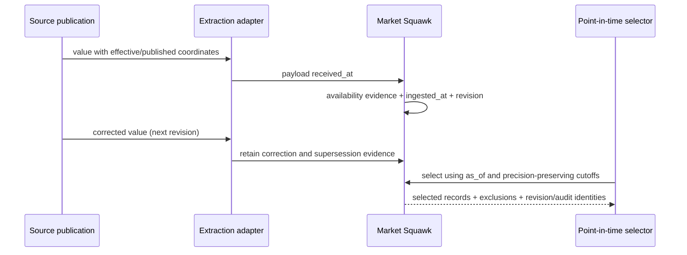

# Time and provenance reference

This page defines the canonical live and research provenance fields, precision-preserving temporal
coordinates, availability evidence, revision semantics, and point-in-time selection policy.

| Field | Value |
| --- | --- |
| Document type | Reference |
| Audience | Adapter authors, research engineers, model and backtest authors, auditors, and maintainers |
| Status | Current |
| Last substantive review | 2026-07-23 |
| Reviewed commit | `836aae662dfbbc3cf40e94e6da6c5c37cd3b57bd` |

## Contents

- [Scope](#scope)
- [Canonical time vocabulary](#canonical-time-vocabulary)
- [Scalar and precision contracts](#scalar-and-precision-contracts)
- [Live provenance](#live-provenance)
- [Research provenance](#research-provenance)
- [Availability evidence](#availability-evidence)
- [Research revision time](#research-revision-time)
- [Point-in-time selection](#point-in-time-selection)
- [Analytical storage projection](#analytical-storage-projection)
- [Failure and recovery behavior](#failure-and-recovery-behavior)
- [Related documentation and code](#related-documentation-and-code)
- [External sources](#external-sources)

## Scope

Live and research records share stable identities, source and local timestamps, quality, schema
version, and payload evidence. They do not share one artificial event type or identical time
semantics. Live provenance binds an observation to one connection generation and current market
evidence; research provenance carries explicit availability and revision history for point-in-time
analysis.

This page defines code-owned record and selector contracts. Provider-specific timestamp parsing,
release calendars, and period mappings remain adapter responsibilities. Dataset publication and
query procedures belong in [Datasets and query](../operations/datasets-and-query.md).

## Canonical time vocabulary

| Field or coordinate | Meaning | Required |
| --- | --- | --- |
| `source_timestamp` | Timestamp authored by the provider or venue; absent when the source did not supply one | Optional |
| `received_at` | Instant the source payload reached this Market Squawk process | Required |
| `available_at` | Conservative instant the observation became knowable to the relevant local consumer | Required for live; evidence-derived and optional in analytical research projection |
| `ingested_at` | Instant the canonical record was admitted locally | Required |
| `effective` | Economic, accounting, market, or reference coordinate to which a research observation applies | Required for research |
| `published` | Coordinate at which the source states the research value was published | Optional; never manufactured |
| `revision` | One-based version within a natural research-observation family | Required for research |
| `superseded` | Coordinate at which the revision ceased to be current | Optional; never manufactured |
| `as_of` | Exact knowledge cutoff applied by point-in-time selection | Required for a selection |
| `publication_cutoff` | Optional same-precision upper bound on published coordinates | Optional |
| `effective_cutoff` | Feature/reference boundary applied without changing source precision | Required for a selection |
| `label_cutoff` | Optional upper boundary creating the label window `(effective_cutoff, label_cutoff]` | Optional |

`received_at`, `available_at`, and `ingested_at` are different local facts. `effective` and
`published` are source/business coordinates. Equal values are permitted when evidence supports
them, but no field substitutes for another.

## Scalar and precision contracts

`Timestamp` is a UTC instant represented as signed `i64` nanoseconds from the Unix epoch. It has no
wall-clock access and exposes checked addition and subtraction. `CalendarDate` is a valid proleptic
Gregorian date with year 1 or later; converting it to Arrow `Date32` preserves day precision and
does not assign midnight or a time zone.

`ResearchTemporalCoordinate` retains exactly one of three precision classes:

| Precision | Stored value | Comparison domain |
| --- | --- | --- |
| `exact_timestamp` | UTC `Timestamp` | Other exact timestamps |
| `calendar_date` | `CalendarDate` | Other calendar dates |
| `source_period` | Provider scheme, year, one-based ordinal, and original code | Periods from the same scheme |

Coordinates of different precision are unordered. Source periods from different schemes are also
unordered. A selector therefore excludes an incomparable candidate instead of converting a date or
period into an invented instant.

## Live provenance

Every canonical live event carries:

- current canonical schema version;
- a complete `LiveEvidenceBinding` containing source, venue, instrument, provider product/channel,
  event class, connection generation, metadata revision, payload digest, and applicable book state;
- optional source timestamp;
- required `received_at`, `available_at`, and `ingested_at`;
- recorded data quality and coverage status;
- a content hash or bounded source-side record reference; and
- an optional assessment reference for an archival assessed classification.

Construction enforces `received_at <= available_at <= ingested_at`. When provenance carries a
content hash, its algorithm and digest must equal the payload digest in the complete binding.
Decoder output cannot claim `DirectVerified`; an archival `DirectVerified` record must retain an
assessment reference and still carries no current execution authority.

The source timestamp is optional by design. Neither receive time nor heartbeat time is substituted
when a venue omits event time.

## Research provenance

Every canonical research observation carries:

- current canonical schema version;
- source namespace and source-native record identifier;
- optional stable instrument and venue identities where applicable;
- optional source timestamp;
- required `received_at` and `ingested_at`;
- data-quality class;
- content hash or bounded source-side record reference; and
- explicit `AvailabilityEvidence`.

Research construction requires `received_at <= ingested_at`. Any reported availability instant,
including an inferred one retained for analysis, must be no later than ingestion. A source reference
is an opaque identity only; unlike a content hash, it does not by itself prove existence,
immutability, or future retrievability.

## Availability evidence

| Serialized kind | Retained fields | Default point-in-time treatment |
| --- | --- | --- |
| `evidenced` | `available_at` plus source/audit evidence identity | Admitted when `available_at <= as_of` |
| `local_first_observed` | Conservative local `observed_at` | Admitted when `observed_at <= as_of` |
| `inferred` | `inferred_at` plus versioned inference method | Retained but excluded by default |
| `unknown` | None | Excluded by default |

Only evidenced variants and records first observed locally yield `conservative_available_at()`.
This is why
the analytical `available_at` column is nullable even though the availability classification is
always present. Inferred time is projected separately as reported/inferred evidence and is not
silently promoted into the conservative column.

When both an exact publication instant and a reported availability instant exist, availability
must not precede publication.

## Research revision time

`ResearchTime` combines required `effective`, optional `published`, one-based `revision`, and
optional `superseded` coordinates. Revision zero is invalid. If publication and supersession are
both present, supersession must be provably later; equal, earlier, or incomparable coordinates are
rejected.

All revisions are retained in immutable research storage. Supersession marks currentness under a
policy; it does not erase the prior value.

## Point-in-time selection

Policy version 1 supports two explicit revision modes:

| Mode | Behavior |
| --- | --- |
| `LatestKnown` | Within each natural observation family, select the highest non-conflicting revision that is available, current, and otherwise admissible at the cutoffs |
| `AllKnown` | Retain every admissible revision and label it current, superseded, or supersession-incomparable |

The selector first applies availability, publication, effective/label, and supersession predicates.
It then groups candidates by a variant-specific natural family identity and revision. Divergent
payloads for the same family and revision produce a fail-closed conflict report; identical
duplicates are deduplicated deterministically.

The complete exclusion vocabulary is:

- availability after `as_of`, inferred availability, or unknown availability;
- publication after `as_of`, after the publication cutoff, or incomparable to that cutoff;
- effective coordinate after the feature cutoff, not inside the requested label window, or
  incomparable to its cutoff;
- superseded by knowledge time or incomparable supersession;
- a lower revision or an identical duplicate revision.

The selection retains exact source-manifest references, family/payload/provenance/evidence digests,
complete exclusions and counts, revision-state counts, a content identity, and a distinct audit
identity. Cancellation, deadline, allocation, checked-accounting, row, family, conflict, candidate,
and retained-byte bounds are part of the operation contract.

Fixed process ceilings are 1,000,000 candidates, 1,000,000 families, 100,000 conflict groups,
1,000,000 result rows, and 512 MiB selector-owned retained memory. Every request supplies equal or
narrower nonzero limits.

## Analytical storage projection

Canonical observations are converted to Arrow with UTC nanosecond timestamps, date columns for
calendar precision, and structured period columns for source-period precision. The common research
schema retains:

- source, instrument, venue, request, schema, extraction-lineage, and observation identities;
- source, receive, conservative availability, reported/inferred availability, and ingestion time;
- availability kind plus evidence or inference method;
- precision-specific effective, published, and superseded columns;
- one-based revision and data quality;
- exact decimal value state, unit, and currency; and
- payload digest plus canonical payload bytes.

Nullable temporal columns indicate unavailable precision, not a fabricated zero or epoch. Dataset
manifests bind schema name, version, fingerprint, content identity, source generation, and lineage
outside the row values.

## Failure and recovery behavior

Invalid time order, unsupported temporal schema versions, zero revisions, precision-incomparable
supersession, availability before publication, and conflicting same-revision payloads fail closed.
Point-in-time selection returns typed exclusions for inadmissible candidates and a typed conflict
report when immutable evidence diverges.

Recovery preserves evidence: correct the adapter mapping or source-manifest authority, ingest a new
immutable generation or revision, and rebuild from explicit cutoffs. Existing datasets and prior
revisions are not rewritten in place.

## Related documentation and code

- [Data quality](data-quality.md)
- [Source coverage](source-coverage.md)
- [Research data plane](../architecture/research-data-plane.md)
- [Data, time, and provenance architecture](../architecture/data-time-and-provenance.md)
- [Research ingestion](../operations/research-ingestion.md)
- [Datasets and query](../operations/datasets-and-query.md)
- [Canonical time scalars](../../crates/market-squawk-domain/src/time.rs)
- [Live provenance](../../crates/market-squawk-domain/src/provenance/live.rs)
- [Research provenance and time](../../crates/market-squawk-domain/src/provenance/research.rs)
- [Point-in-time policy and limits](../../crates/market-squawk-data/src/pit/model.rs)
- [Point-in-time selector](../../crates/market-squawk-data/src/pit/select.rs)
- [Research Arrow schema](../../crates/market-squawk-data/src/schema.rs)
- [Accepted-head delivery evidence](../plans/delivery-ledger.md)

## External sources

| Source | Applied fact | Reviewed |
| --- | --- | --- |
| [Apache Arrow columnar format](https://arrow.apache.org/docs/format/Columnar.html) | Durable distinction among timestamp, date, decimal, and metadata-bearing columnar values | 2026-07-23 |
| [ALFRED vintage dates](https://fred.stlouisfed.org/docs/api/fred/series_observations.html) | Official real-time-period parameters motivating retention of macro publication vintages and revisions | 2026-07-23 |
| [SEC EDGAR APIs](https://www.sec.gov/search-filings/edgar-application-programming-interfaces) | Official filing and company-facts source contracts interpreted by the SEC adapter without replacing local availability evidence | 2026-07-23 |

External sources define upstream storage and provider semantics. The reviewed Market Squawk code
head remains the authority for local time fields, evidence admission, precision, revisions, and
point-in-time selection.
