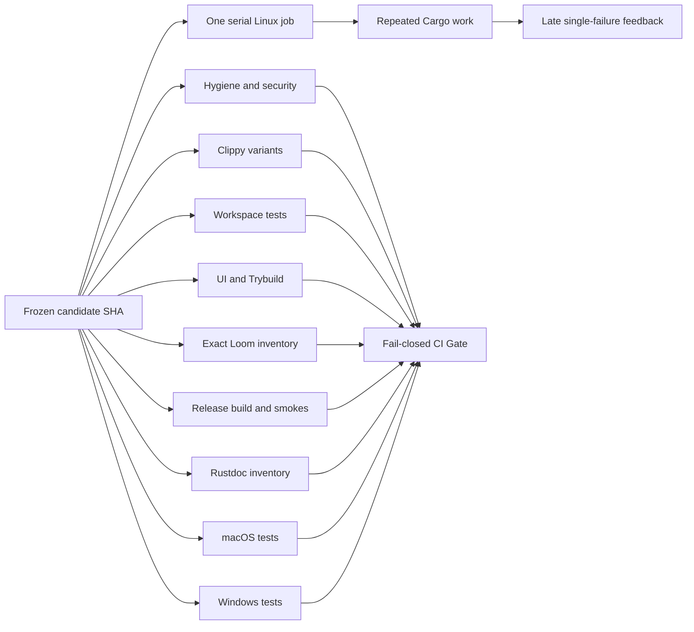

# CI verification runtime and build-cache diagnosis

Purpose: preserve the measured root-cause investigation and correction design for Market Squawk's
approximately one-hour Linux verification feedback loop.

| Metadata | Value |
| --- | --- |
| Document type | Research and diagnostic decision record |
| Audience | Maintainers, CI owners, release reviewers |
| Status | Audited decision input; cross-platform correctness follow-up accepted; pipeline runtime correction not yet implemented or measured |
| Research date | 2026-07-27 |
| Last substantive review | 2026-07-28 |
| Repository audit anchor | `75de7d43a74b0a1b7a5e9cd2f19e311a7ae2ed45` |
| Latest completed correctness candidate | `f8c2569ee4addcfbd8d93553d6b4c541dbdb00ae` |
| Evidence audit | [PASS_WITH_NOTES](../audits/2026-07-27-ci-verification-runtime-evidence-audit.md) |

## Table of Contents

- [Scope](#scope)
- [Executive finding](#executive-finding)
- [Measured runtime](#measured-runtime)
- [Root causes](#root-causes)
- [Current candidate correctness follow-up](#current-candidate-correctness-follow-up)
- [Correction design](#correction-design)
- [Acceptance evidence](#acceptance-evidence)
- [Risks and rejected shortcuts](#risks-and-rejected-shortcuts)
- [Sources](#sources)
- [Related documentation](#related-documentation)

## Scope

This investigation answers two questions:

1. Why does a complete Linux verification candidate take approximately one hour?
2. How can feedback time be reduced without deleting tests, weakening release settings, changing
   exact-head authority, relying on paid runners, or treating cached output as approval evidence?

It covers the current GitHub Actions workflow, local verification scripts, Cargo invalidation,
Loom execution, cache policy, GitHub run history, and current official Cargo and GitHub guidance.
It does not approve a release or claim post-change performance before measurement. The correctness
follow-up below records subsequent root-cause evidence for the Linux and Windows failures so this
maintained report does not preserve an obsolete diagnosis.

## Executive finding

The one-hour duration is reproducible work, not a hung runner and not the size of the shipping
application.

One successful Linux job spent approximately 26 minutes in the required optimized release build.
The remaining time was consumed by other mandatory checks running sequentially, with repeated work
made worse by two concrete defects:

1. pull-request runs cannot populate the configured Rust cache, and the repository currently has
   no cache entries; and
2. the platform build script watches a nonexistent package-relative `.git/HEAD`, which makes Cargo
   rebuild that package during otherwise identical invocations.

The exact Loom gate amplifies the second defect by starting Cargo separately for every model. The
single Linux job then hides independent failures until their earlier phases pass.

The durable correction is to fix the invalidation defect, retain the exact Loom inventory while
executing it once, safely populate scoped pull-request caches, run independent verification groups
concurrently at the same commit, and aggregate every result through one fail-closed `CI Gate`.



## Measured runtime

The Linux `verify` job in
[run 30329093586](https://github.com/Sawmonabo/market-squawk/actions/runs/30329093586/job/90180354327)
completed successfully at commit `4f221d6a720acf15c7236c3728b388bb0e1705bf`. Its verification
step ran for approximately 60 minutes 27 seconds.

| Phase | Observed duration | Finding |
| --- | ---: | --- |
| Python, preflight, security, and formatting | ~2m03s | Required but not dominant |
| Three Clippy configurations | ~5m29s | Separate feature/configuration graphs |
| Workspace all-feature tests | ~8m35s | Approximately 6m51s was compilation |
| Explicit UI and Trybuild gate | ~8m47s | Separate construction plus three required UI roots |
| Two exact Loom gates | ~7m08s | Repeated Cargo processes and platform rebuilds |
| Full optimized release build | 26m08s | Current cold critical path |
| Rustdoc contract inventory | 2m15s | Separate Cargo/rustdoc graph |
| Product smoke checks | <1s | Not material |

The workspace at the audit anchor contains 24 packages, 81 Cargo targets, 48 integration-test
targets, 7 binaries, and 1 benchmark. Cargo documents that each integration-test file is a separate
executable and that multiple test executables run serially under ordinary `cargo test`
([Cargo targets](https://doc.rust-lang.org/cargo/reference/cargo-targets.html#integration-tests),
[`cargo test`](https://doc.rust-lang.org/cargo/commands/cargo-test.html)).

At the audit date, the most recent 20 release-branch CI runs consisted of 13 failures and 7
cancellations. Their summed run duration was 8.236 hours. This is not proof that every minute was
wasted; it demonstrates the operational cost of repeatedly learning one late failure and then
submitting another cold candidate.

## Root causes

### 1. Pull-request caches are restore-only, but no cache exists

All three current jobs configure:

```yaml
save-if: ${{ github.event_name == 'push' && github.ref == 'refs/heads/main' }}
```

The workflow runs for pull requests and for pushes to `main`. Release work is occurring in a pull
request, so every release candidate is restore-only. The successful Linux log records:

```text
save-if: false
No cache found.
```

The repository cache inventory returned zero entries and zero bytes at the audit time. The cache
step therefore exists in YAML but provides no acceleration to the current correction loop.

GitHub documents that caches created by a pull request are scoped to that pull request's merge ref
and cannot be restored by the base branch or unrelated pull requests. Cache contents must still be
treated as untrusted input
([GitHub dependency caching](https://docs.github.com/en/actions/reference/workflows-and-actions/dependency-caching)).
The pinned Rust cache action documents `save-if`, its default removal of incremental and workspace
output, and its normal `CARGO_INCREMENTAL=0` behavior
([Swatinem/rust-cache](https://github.com/Swatinem/rust-cache)).

### 2. The platform build script watches the wrong Git path

`crates/market-squawk-platform/build.rs` asks Git for `--git-path HEAD` and passes the returned
`.git/HEAD` directly to `cargo:rerun-if-changed`.

Cargo runs a build script from the package root and tracks the supplied path from that context
([Cargo build scripts](https://doc.rust-lang.org/cargo/reference/build-scripts.html)). The emitted
relative path is therefore interpreted as:

```text
crates/market-squawk-platform/.git/HEAD
```

That file does not exist. Two identical focused checks with Cargo fingerprint diagnostics proved
the result. The second check reported:

```text
stale: missing ".../crates/market-squawk-platform/.git/HEAD"
fingerprint dirty
MissingFile
Compiling market-squawk-platform
```

Cargo recommends fingerprint logging for unexplained rebuild diagnosis
([Cargo FAQ](https://doc.rust-lang.org/cargo/faq.html#why-is-cargo-rebuilding-my-code)).
This is a reproduced repository defect, not a general performance hypothesis.

A correct implementation must emit only absolute, existing Git metadata paths and must handle a
normal checkout, linked worktrees, symbolic refs, detached `HEAD`, and packed refs. Simply joining
the repository root with `.git/HEAD` would not cover all of those Git layouts.

### 3. Loom repeats the invalidated build

`scripts/run_exact_loom_gate.sh` correctly compares the discovered reserved models with an explicit
expected inventory. After that comparison passes, it launches one `cargo test` process for each
model.

The platform gate declares eight models. The successful Linux log shows the platform crate
rebuilding for approximately 23.3 seconds before each model execution. The inventory authority can
remain unchanged while all discovered `loom_model` tests execute through one Cargo process with
one test thread.

### 4. Independent evidence is serialized

`scripts/verify.sh` is one `set -e` shell program inside one Linux job. It runs hygiene, security,
three Clippy graphs, workspace tests, UI tests, Loom, release construction, Rustdoc inspection, and
product smokes in sequence.

Cargo normally stops after the first failing test executable; `--no-fail-fast` continues running
the remaining executables while preserving a failing result
([`cargo test`](https://doc.rust-lang.org/cargo/commands/cargo-test.html#test-options)).
GitHub supports independent concurrent jobs and a final job that depends on every leaf
([workflow syntax](https://docs.github.com/en/actions/reference/workflows-and-actions/workflow-syntax),
[using jobs](https://docs.github.com/en/actions/how-tos/write-workflows/choose-what-workflows-do/use-jobs)).

The current topology therefore delays unrelated evidence and tends to expose one failure per
candidate.

## Current candidate correctness follow-up

The runtime diagnosis did not make the exact release candidate green. The first frozen run at
`75de7d43a74b0a1b7a5e9cd2f19e311a7ae2ed45`,
[run 30332098992](https://github.com/Sawmonabo/market-squawk/actions/runs/30332098992),
completed with:

| Job | Result | Initial finding |
| --- | --- | --- |
| macOS | Passed | Complete current macOS job succeeded |
| Linux verify | Failed | Platform authority-state test returned `AlreadyLocked` |
| Windows | Failed | Analytical backup/evidence tests returned indeterminate or invalid evidence |

The follow-up exact candidate
`c7b045fcf09553b934d388a62ca9fe7e0ea36b82` completed in
[run 30340497944](https://github.com/Sawmonabo/market-squawk/actions/runs/30340497944):

| Job | Result | Evidence |
| --- | --- | --- |
| macOS | Passed | Complete job `90214783636` passed in 17m35s |
| Linux verify | Passed | Complete job `90214783685` passed in 58m54s |
| Windows | Failed | Job `90214783655` repeated four backup and one analytical-evidence failures |

This run confirms the Linux lock-lifetime and file-adapter fixture corrections under the hosted
gates. It is not release approval because Windows failed.

The next exact candidate,
`05b406f12a62dd4938b0d6ebe7013d9c607132ba`, completed in
[run 30344656257](https://github.com/Sawmonabo/market-squawk/actions/runs/30344656257):

| Job | Result | Evidence |
| --- | --- | --- |
| macOS | Passed | Complete job `90227935405` passed in 18m07s |
| Linux verify | Failed | Job `90227935404` reached MCP tests, where one session inherited another session's process-global reaper state |
| Windows | Failed | Job `90227935382` passed the five intended backup/evidence corrections, then exposed catalog-lock contention misclassification |

This run is important narrowing evidence. All four analytical-backup cases, the
allocator-sensitive derived-evidence case, and the earlier file-adapter clock case passed on
Windows. The two remaining failures are independent production authority defects described below;
neither is a regression in the analytical corrections.

Candidate `f7c7712a95654230abc40f6e6d43a297e0dab210` completed in
[run 30348918829](https://github.com/Sawmonabo/market-squawk/actions/runs/30348918829):

| Job | Result | Evidence |
| --- | --- | --- |
| Linux verify | Passed | Complete job `90241570286` passed in 59m14s |
| macOS | Passed | Complete job `90241570407` passed in 26m44s |
| Windows | Failed | Job `90241570389` passed the previously failing boundaries reached before modeling, then reached the Windows ONNX worker for the first time |

The Windows modeling harness ran 13 tests: 10 passed and three helper-backed tests returned
`WarmUp`. The previous Windows job `90227935382` did not run this harness; its earlier
13-test entry was the Coinbase unit suite, and the job stopped in the data catalog tests.
Candidate `f7c7712` is therefore the first retained hosted Windows evidence for this worker
boundary, not a regression from a prior Windows modeling pass. It stopped at modeling before
Cargo reached the later platform `configuration_security` harness, so it did not establish that
the platform authority-residue, replacement, or build-input mutation cases passed on Windows.

Candidate `605362c495e6b139ccdbbdda85d86a69de96eb18` ran in
[run 30354812388](https://github.com/Sawmonabo/market-squawk/actions/runs/30354812388):

| Job | Result | Evidence |
| --- | --- | --- |
| macOS | Passed | Complete job `90260430125` passed in 17m47s |
| Linux verify | Passed | Complete job `90260430159` passed in 58m22s |
| Windows | Failed | Job `90260430186` passed all 13 modeling contracts, then exposed four later platform failures |

This candidate confirms unchanged Linux and macOS behavior after the ONNX correction. The Windows
run is positive hosted evidence for the corrected ONNX committed-memory profile: the modeling
harness passed 13 of 13 tests in 4.26 seconds. It then reached
`configuration_security`, where 44 tests passed and four failed. Two authority-residue cases
returned the wrong public classification, one repair path could not replace an open destination,
and one build-input check did not detect a same-length rewrite. These are newly reached
cross-platform defects rather than ONNX regressions.

Candidate `0039429a756f475e12e21083e7b91570830aba34` ran in
[run 30359382270](https://github.com/Sawmonabo/market-squawk/actions/runs/30359382270):

| Job | Result | Evidence |
| --- | --- | --- |
| macOS | Passed | Complete job `90275079124` passed in 21m33s |
| Linux verify | Passed | Complete job `90275079203` passed in 52m52s |
| Windows | Failed | Job `90275079128` reached the application library, where one of 51 tests exhausted its existing Kraken acknowledgement deadline |

The Linux and macOS jobs provide hosted evidence for the authority-residue, open-destination, and
build-input corrections. Windows stopped in the earlier Kraken production vertical before reaching
the platform configuration/security harness, so this candidate did not establish their Windows
behavior.

Candidate `d02a2f14bd9e999ef1206b528d79528c72263016` ran in
[run 30363692902](https://github.com/Sawmonabo/market-squawk/actions/runs/30363692902):

| Job | Result | Evidence |
| --- | --- | --- |
| macOS | Passed | Complete job `90289414582` passed in 27m19s |
| Windows | Passed | Complete job `90289414559` passed in 16m02s, including 51 of 51 application-library tests and 48 of 48 platform configuration/security tests |
| Linux verify | Failed | Job `90289414652` reached the Kraken production vertical, where paper recovery returned `RecoveryInitialization(Control(Adapter(NotAttemptedBusy)))` |

This candidate supplies the previously missing hosted Windows proof for the platform and ONNX
corrections. It also demonstrates that matching the Kraken vertical to the shipping multi-thread
runtime exposed a real paper-recovery sequence handoff race on Linux. The sequence correction was
initially verified locally; acceptance required a later unchanged candidate to pass the complete
hosted Linux, macOS, and Windows jobs.

Candidate `f8c2569ee4addcfbd8d93553d6b4c541dbdb00ae`, tree
`0a8d5ab177b53d0496d6fecb8672f3262ae8e533`, ran unchanged in
[run 30366976240](https://github.com/Sawmonabo/market-squawk/actions/runs/30366976240):

| Job | Result | Evidence |
| --- | --- | --- |
| Linux verify | Passed | Complete job `90300620390` passed `scripts/verify.sh` in 49m20s |
| Windows | Passed | Complete job `90300620276` passed in 15m19s, including both Kraken production verticals and 48 of 48 platform configuration/security tests |
| macOS | Passed | Complete all-feature job `90300620453` passed in 25m50s, including both Kraken production verticals |

This unchanged candidate accepts the paper-recovery sequence correction on all three hosted
operating systems and closes the correctness follow-up described in this report. It does not
implement or measure the proposed CI topology and cache changes, and it is not the terminal V1
release approval.

### Linux authority-state lock lifetime

The Linux failure was a production lock-lifecycle defect exposed by concurrent process creation.
The authority-state store relied on closing its lock-file descriptor to release an `fs2` advisory
lock. On Linux, `flock` locks belong to an open-file description shared by descriptors duplicated
across `fork`; closing one descriptor does not release the lock while another duplicate remains
open. An immediate successor could therefore receive `AlreadyLocked` after the logical owner had
already dropped. The Linux contract also establishes that an explicit `LOCK_UN` through any
duplicate releases the shared lock
([Linux `flock(2)`](https://man7.org/linux/man-pages/man2/flock.2.html)).

The correction uses a private RAII guard created immediately after acquisition. Its non-panicking
drop explicitly unlocks before closing, covering normal destruction and every later
post-acquisition error path. Genuine contention remains rejected while the guard is alive. The
existing 64-test platform configuration/security harness and focused Clippy gate pass locally with
this correction.

### Windows backup paths and retained lease

The initial Windows backup diagnosis identified a genuine path-conversion defect but incorrectly
treated it as the complete cause of four coarsened `BundleCreationIndeterminate` failures.
`LocalPaths::prepare` canonicalizes its root, and Rust documents that Windows canonicalization
returns extended-length syntax such as `\\?\D:\...`
([`std::fs::canonicalize`](https://doc.rust-lang.org/std/fs/fn.canonicalize.html)). The former
immutable SQLite URI builder rejected every double-backslash prefix as UNC, even though Rust
distinguishes a local `VerbatimDisk` prefix from `UNC`, `VerbatimUNC`, `DeviceNS`, and generic
verbatim forms
([`std::path::Prefix`](https://doc.rust-lang.org/std/path/enum.Prefix.html)).

Candidate `c7b045fcf09553b934d388a62ca9fe7e0ea36b82` corrected that boundary by accepting only absolute
`Disk` and `VerbatimDisk` paths, emitting SQLite's documented `/D:/...` URI-path form, and
continuing to reject network, device, generic verbatim, relative, and non-UTF-8 paths
([SQLite URI filenames](https://www.sqlite.org/uri.html),
[SQLite open flags and URI parameters](https://sqlite.org/c3ref/open.html)). However,
[Windows job 90214783655](https://github.com/Sawmonabo/market-squawk/actions/runs/30340497944/job/90214783655)
reproduced all four public backup failures after that correction. The hosted evidence therefore
proved the path correction valid but incomplete.

The remaining deterministic failure was a self-conflicting database lease. Retained verification
took an exclusive `fs2` whole-file lock on the SQLite database and immediately reopened the same
database through another handle to hash and verify it. On Windows, `fs2 0.4.3` implements that lock
with `LockFileEx`. Microsoft documents that a locking process cannot access the locked range
through a second handle and that an exclusive range lock denies both reads and writes
([Microsoft `LockFileEx`](https://learn.microsoft.com/en-us/windows/win32/api/fileapi/nf-fileapi-lockfileex)).
The receipt read therefore failed with a lock violation before immutable SQLite verification, and
the public backup service coarsened that I/O failure to `BundleCreationIndeterminate`.

The production correction retains exclusivity on the existing private `.catalog.writer.lock`
sidecar instead of byte-locking the database against its own verifier. The retained catalog file
still provides exact identity and no-delete protection; receipt hashing and immutable SQLite
verification remain unchanged. The sidecar acquisition is capability-relative, no-follow,
open-existing, and noncreating, so read-only verification cannot manufacture missing authority
state. Its guard explicitly unlocks during drop, matching the Linux logical-owner lifetime
correction. The existing exact backup test passed locally, and all four affected backup cases
passed in Windows job `90227935382`.

### Windows clock-fault fixture

A rerun of only the unchanged Windows job exposed an independent test-fixture race before the data
crate ran:
[job 90209089614](https://github.com/Sawmonabo/market-squawk/actions/runs/30332098992/job/90209089614)
failed in
`control::discovery_control_path_fails_closed_without_blocking_the_runtime`. The original Windows
job had passed the same executable at the same source, runner, image, and toolchain.

The fault-injection clock captured its monotonic origin before durable representation-authority
initialization, then requested a synthetic wall deadline only about one second later. On the slower
run, initialization and scheduling consumed that budget, so the production deadline control
correctly returned `DeadlineExceeded` before injected clock observation 15 could return
`ClockFailure`. The assertion label `call 15` identified the configured fault point; it did not
prove that observation 15 occurred.

The correction changes only those injected clock-failure scenarios to use the standard 60-second
elapsed ceiling as a noncompeting deadline. It preserves the strict `ClockFailure` assertions and
does not change production code. The same harness separately retains immediate-expiry,
one-second saturation, cancellation, and blocking-worker-panic coverage. The exact focused test
passed locally after this fixture correction and the complete Windows file-adapter harness passed
in job `90227935382`. The adjacent hostile-clock panic in the earlier failed log was intentional
output from an earlier subcase that the test harness buffered; it was not a second causal failure.

### Windows analytical-evidence allocation contract

The fifth Windows data failure,
`derived_commit_retains_canonical_multi_object_and_parent_evidence`, repeated in
job `90214783655` and is independent of SQLite data semantics. The stored evidence is valid; the
failure arose while reconstructing its two-object derived manifest.

The locked `rustc 1.97.1` reports source commit
`8bab26f4f68e0e26f0bb7960be334d5b520ea452`. That toolchain collects `Result<Vec<_>, _>` through
`GenericShunt`, whose lower size hint is zero
([exact Rust 1.97.1 `GenericShunt`](https://github.com/rust-lang/rust/blob/8bab26f4f68e0e26f0bb7960be334d5b520ea452/library/core/src/iter/adapters/mod.rs)).
The generic `Vec::from_iter` implementation therefore selects its minimum nonzero capacity rather
than the fixture's exact two-object length
([exact Rust 1.97.1 `Vec` collection](https://github.com/rust-lang/rust/blob/8bab26f4f68e0e26f0bb7960be334d5b520ea452/library/alloc/src/vec/spec_from_iter_nested.rs)).
`ManifestPlan::from_objects` then converted that spare-capacity vector into a boxed slice and
rejected the plan if the allocation moved. Rust documents that `into_boxed_slice` discards excess
capacity, while a vector whose length equals capacity can convert without reallocation
([Rust `Vec` allocation contract](https://doc.rust-lang.org/std/vec/struct.Vec.html#capacity-and-reallocation)).

Rust 1.97.1's Windows allocator performs the shrink with `HeapReAlloc` and flags zero
([exact Rust 1.97.1 Windows allocator](https://github.com/rust-lang/rust/blob/8bab26f4f68e0e26f0bb7960be334d5b520ea452/library/std/src/sys/alloc/windows.rs)).
Microsoft documents that `HeapReAlloc` may move the block unless
`HEAP_REALLOC_IN_PLACE_ONLY` is requested
([Microsoft `HeapReAlloc`](https://learn.microsoft.com/en-us/windows/win32/api/heapapi/nf-heapapi-heaprealloc)).
When Windows moved the allocation, the manifest returned `AllocationContract`; evidence mapping
coarsened it to `AnalyticalEvidenceInvalid`. The macOS pass reflected allocator behavior, not a
portable guarantee.

The correction is centralized in `ManifestPlan::from_objects`: any spare-capacity input is moved
into a fallibly reserved exact-capacity vector, capacity equality is checked before conversion,
and the post-conversion pointer check remains as defense in depth. This preserves the immutable
allocation contract for every caller without changing the fixture, SQL ordering, evidence
semantics, or error acceptance. The existing exact evidence test passed locally and in Windows job
`90227935382`.

### Windows catalog-lock contention classification

After the intended Windows corrections passed, `tests/catalog.rs` exposed a preexisting typed-error
defect. The first catalog retained its writer guard correctly. A second open reached `fs2 0.4.3`,
whose Windows implementation uses `LockFileEx` and returns `ERROR_LOCK_VIOLATION` (raw error 33)
for the contended whole-file range
([`fs2 0.4.3` Windows source](https://github.com/danburkert/fs2-rs/blob/e1d4843b7c19e3ce1ecbae92255223de31b36d3b/src/windows.rs#L89-L112),
[Microsoft system error 33](https://learn.microsoft.com/en-us/windows/win32/debug/system-error-codes--0-499-)).

Rust 1.97.1 classifies that raw general I/O error as `Uncategorized`; the old catalog code checked
only `io::ErrorKind::WouldBlock`. Contention consequently became `PathError::Io` and then the public
`CatalogError::UnsafePath`, rather than the required `WriterAlreadyOpen`
([exact Rust 1.97.1 Windows error mapping](https://github.com/rust-lang/rust/blob/8bab26f4f68e0e26f0bb7960be334d5b520ea452/library/std/src/sys/io/error/windows.rs#L16-L90)).
The new explicit catalog-guard unlock was not involved: the first guard was still live, and the
second attempt never constructed a guard.

The correction uses Rust's stable standard-library `File::try_lock`, which maps platform
contention into the dedicated `TryLockError::WouldBlock` variant before returning it. Rust has
provided this typed API since 1.89, and its documented implementation retains nonblocking
exclusive `flock` semantics on Unix and `LockFileEx` semantics on Windows
([`File::try_lock`](https://doc.rust-lang.org/std/fs/struct.File.html#method.try_lock),
[`TryLockError`](https://doc.rust-lang.org/std/fs/enum.TryLockError.html)).

The same focused correction covers every remaining production site that performed the same
`ErrorKind::WouldBlock` comparison: catalog writer/backup-sidecar authority, provider-rate
ownership, both analytical-root authority acquisition paths, and durable MCP audit ownership.
Private RAII guards explicitly unlock at the logical final-owner boundary, including
post-acquisition error paths. The existing catalog, publication-recovery, data-library, and MCP
audit tests passed locally, and Windows job `90241570389` carried these corrected boundaries
through to the later modeling harness.

### MCP session-specific SDK reaping

The Linux failure was a separate session-isolation defect. Every `McpServer` clones a handle to one
bounded process-global SDK-thread reaper. One adjacent hostile-boundary test intentionally aborts a
session whose still-running SDK thread is transferred to that reaper. Rust executes tests within
one test executable concurrently by default
([Rust test execution](https://doc.rust-lang.org/book/ch11-02-running-tests.html#running-tests-in-parallel-or-consecutively)).

The failing session had already joined its own SDK thread, but `SessionSupervisor::shutdown`
unconditionally drained the process-global pending count. It therefore waited on the unrelated
aborted session's thread. When that unrelated work exceeded the current session's 500ms shutdown
budget, the clean session produced `TransportError::WriteTimedOut`; the server coarsened that into
`ServerError::Transport`.

The hosted timeline supports the ownership chain: the adjacent abort test returned at
09:11:31.332 UTC, the clean session exhausted its shutdown budget and failed at 09:11:32.450 UTC,
and three neighboring sessions using the default five-second budget completed together at about
09:11:33.335 UTC. The MCP implementation and dependency lock were unchanged from five earlier
passing Linux jobs, so runner scheduling exposed an existing ownership defect rather than creating
a source regression.

The hardened correction keeps the process-global capacity and exact `JoinHandle` ownership, but a
transfer now returns a one-worker completion receipt. A session waits only for its own receipt;
when its SDK thread was already joined, it performs no reaper wait. The reaper resolves a receipt
only after joining that exact thread, so no thread is detached and an unrelated pending worker or
historical failure cannot affect the session result
([Rust `JoinHandle`](https://doc.rust-lang.org/std/thread/struct.JoinHandle.html),
[Tokio 1.53.1 oneshot receiver](https://docs.rs/tokio/1.53.1/tokio/sync/oneshot/struct.Receiver.html)).
The receipt wait remains bounded and cancellation-safe. Existing MCP unit, hostile-boundary, and
lifecycle tests pass locally without retry, sleep, timeout inflation, or test serialization.
Linux job `90241570286` subsequently passed the complete verification gate with this ownership
model.

### Windows ONNX committed-memory containment

Windows job `90241570389` exposed a deterministic production defect in the helper's Job Object
profile. The worker called `limit_working_memory(0, 3 GiB)`. Microsoft requires a nonzero minimum
when the maximum working-set size is nonzero
([Job Object basic limits](https://learn.microsoft.com/en-us/windows/win32/api/winnt/ns-winnt-jobobject_basic_limit_information)).
The pinned `win32job 2.0.3` implementation forwards that pair to `SetInformationJobObject` before
assigning the process
([exact `win32job` job construction](https://github.com/ohadravid/win32job-rs/blob/v2.0.3/src/job.rs)).
Every Windows helper therefore exited during containment setup, before reading initialization or
emitting a protocol response. The parent observed EOF as `WorkerError::Unavailable`, which the
public tract backend correctly coarsened to `OnnxBackendError::WarmUp`.

That one causal chain explains all three failures. The valid model never reached warm-up, while
the oversized-intermediate and compute-heavy models never reached worker-side static admission
that would have returned `Resource` and then `IntermediateLimit`. The one-nanosecond deadline test
passed only because it also expects `WarmUp`; it did not prove helper startup.

Changing the minimum to a token nonzero value would make the profile syntactically valid but would
retain only a working-set ceiling. Working-set limits do not bound committed virtual memory. The
hardened correction instead applies both per-process and job-wide 3 GiB committed-memory limits
with kill-on-close. Microsoft documents that `JOB_OBJECT_LIMIT_PROCESS_MEMORY` caps each process's
committed memory and `JOB_OBJECT_LIMIT_JOB_MEMORY` caps the job-wide sum
([Job Object extended limits](https://learn.microsoft.com/en-us/windows/win32/api/winnt/ns-winnt-jobobject_extended_limit_information)).

Upstream `win32job 2.0.3` exposes neither committed-memory setter, and its general extended-limit
request remains open
([upstream issue 6](https://github.com/ohadravid/win32job-rs/issues/6)). Market Squawk therefore
patches that exact licensed source locally with only the two safe setters. Cargo resolves the
patched source through the lockfile, the Python release builder now admits local Cargo patches into
its complete source closure, and the resource-semantics digest advances to version 2. This retains
the workspace's `unsafe_code = "forbid"` boundary and makes the stronger containment behavior part
of runtime evidence. No new test target, retry, sleep, deadline increase, or test serialization is
required; the existing 13-test Windows modeling harness is the authoritative hosted proof.

Release authority still requires one unchanged candidate to pass the complete Linux, macOS, and
Windows jobs. These corrections remove cross-platform classification and cross-session ownership
defects; they do not normalize or retry the failures.

### Windows authority residue and open-destination replacement

Two newly reached authority-state cases had one direct classification defect. Windows publication
uses a rename-based temporary rather than Unix's hard-link installation protocol. An unexpected
reserved temporary at store-open time therefore has no retained identity proof tying it to a
completed publication. Returning `RecoveryRequired` treated both a user-created orphan and a
hard-linked reserved entry as recoverable state. The fail-closed contract is
`UnsafeFileType`: Windows accepts no open-time publication residue that it cannot prove.

The trailing-byte repair failure had a separate cause. Its destination remained open through a
handle created with Rust's default Windows share flags, which include read, write, and delete
sharing
([Rust Windows `OpenOptionsExt`](https://doc.rust-lang.org/std/os/windows/fs/trait.OpenOptionsExt.html)).
The pinned `atomicwrites 0.4.4` replacement calls `MoveFileExW` directly, and its upstream tracker
records the same Windows overwrite failure with access-denied error 5
([exact `atomicwrites 0.4.4` implementation](https://github.com/untitaker/rust-atomicwrites/blob/0.4.4/src/lib.rs),
[`atomicwrites` issue 35](https://github.com/untitaker/rust-atomicwrites/issues/35)).

Rust 1.97.1's `std::fs::rename` first calls `MoveFileExW`. On access denied, it reopens the source
for delete access and attempts `SetFileInformationByHandle(FileRenameInfoEx)` with replace-existing
and POSIX-semantics flags
([Rust `rename`](https://doc.rust-lang.org/std/fs/fn.rename.html),
[exact Rust 1.97.1 Windows implementation](https://github.com/rust-lang/rust/blob/8bab26f4f68e0e26f0bb7960be334d5b520ea452/library/std/src/sys/fs/windows.rs)).
Microsoft documents that the POSIX-semantics flag permits replacement while handles to the
destination remain open; those handles continue to address the replaced file while subsequent
opens use the new file
([`FILE_RENAME_INFO`](https://learn.microsoft.com/en-us/windows/win32/api/winbase/ns-winbase-file_rename_info),
[`FileRenameInformationEx`](https://learn.microsoft.com/en-us/openspecs/windows_protocols/ms-fscc/4217551b-d2c0-42cb-9dc1-69a716cf6d0c)).

The correction retains the existing write-through `atomicwrites` path first. Only its
`PermissionDenied` replacement failure falls back to the capability-relative directory rename,
which reaches Rust's modern Windows fallback. The authority root identity is checked before and
after publication, and the fixed temporary must be absent while the destination must be a safe
regular file before success is returned. Other errors remain fail-closed as
`RecoveryRequired`.

### Windows build-input identity and mutation detection

The build-input boundary previously used device, inode, and hard-link identity only on Unix. Its
non-Unix fallback compared length, modification time, and read-only state and ignored the
single-link requirement. A same-length Windows rewrite can preserve every one of those observable
values at filesystem timestamp granularity, so the test mutation was accepted.

The correction opens the final path component without following links, obtains metadata from the
opened capability handle, and uses `cap-fs-ext 4.0.2` device, file-index, and link-count metadata
on both Unix and Windows. The library explicitly provides these handle-backed values on Windows
([`cap-fs-ext` metadata extension](https://github.com/bytecodealliance/cap-std/blob/v4.0.2/cap-fs-ext/src/metadata_ext.rs)).
Microsoft's underlying handle-information contract exposes the volume serial number, file index,
and number of links
([`GetFileInformationByHandle`](https://learn.microsoft.com/en-us/windows/win32/api/fileapi/nf-fileapi-getfileinformationbyhandle),
[`BY_HANDLE_FILE_INFORMATION`](https://learn.microsoft.com/en-us/windows/win32/api/fileapi/ns-fileapi-by_handle_file_information)).

Every individual input is then reopened without following the final component and rehashed. The
second digest, bounded length, single-link rule, and handle identity must all agree with the first
read. Rust source-tree inventory applies the same two-read proof to each source and retains the
root directory handle while checking that the named root still has the same identity at the end.
This closes both same-length content substitution and path-replacement windows without trusting
timestamp precision. Candidate `d02a2f1` subsequently passed all 48 Windows platform
configuration/security tests, supplying the hosted evidence that candidate `0039429` could not
reach.

### Tokio runtime topology and paper-recovery sequence handoff

The Kraken production verticals formerly used plain `#[tokio::test]`. Tokio 1.53.1 documents that
this creates a separate single-threaded current-thread runtime for each test, while
`flavor = "multi_thread"` uses the same scheduler family as `Builder::new_multi_thread` in the
shipping application
([Tokio test runtime](https://docs.rs/tokio/1.53.1/tokio/attr.test.html)).
Candidate `0039429` exhausted the existing Kraken acknowledgement deadline on Windows under that
nonrepresentative topology. The correction changed only the two production verticals to a
two-worker multi-thread runtime. Candidate `d02a2f1` then passed the complete Windows job and both
verticals without increasing deadlines, adding retries, serializing tests, or relaxing assertions.

The representative scheduler exposed a production race in the paper adapter. A producer held the
shared event-sequence mutex while placing `InitializeRecovery` on the bounded worker queue. On
another runtime worker, the receiver could process that command before the producer returned and
dropped the mutex guard. Recovery used a nonblocking `try_lock`, so a valid in-flight handoff became
public `NotAttemptedBusy`. The current-thread test runtime had hidden the ordering because the
receiver could not run until the sender yielded.

The bounded correction uses a Tokio mutex for the shared sequence. Live market and dispatcher
producers retain nonblocking `try_lock` behavior. Only startup recovery may await the short
producer critical section, and that wait remains inside the existing control cancellation and
deadline using a biased `tokio::select!` with cancellation and deadline first. Tokio documents that
its async mutex yields rather than blocking a runtime thread, that `try_lock` remains nonblocking,
and that canceling `lock` loses only queue position
([Tokio mutex](https://docs.rs/tokio/1.53.1/tokio/sync/struct.Mutex.html),
[`tokio::select!` cancellation behavior](https://docs.rs/tokio/1.53.1/tokio/macro.select.html)).
On paths that reach this wait, no recovery state is mutated before acquisition, so cancellation or
deadline expiry remains a no-op at this boundary.

The existing paper-adapter library passed 15 of 15 tests and the complete application library
passed 56 of 56 tests locally with the correction. Exact candidate `f8c2569` then passed the
complete hosted Linux, Windows, and macOS jobs without a deadline increase, retry, test
serialization, queue change, or assertion relaxation. This accepts the correction at that exact
code head; it does not approve the terminal V1 release or transfer exact-head evidence to a later
commit.

## Correction design

### 1. Repair Git metadata invalidation

- Resolve Git metadata to absolute, existing paths.
- Track `HEAD`, the active symbolic ref when present, and packed-reference state where applicable.
- Preserve normal checkout, linked-worktree, and detached-`HEAD` behavior.
- Do not watch a nonexistent fallback path.

### 2. Collapse exact Loom execution

- Keep the expected-versus-discovered inventory comparison.
- Fail on missing, unexpected, or duplicate reserved models.
- After inventory equality passes, run the complete `loom_model` filter once with
  `--test-threads=1`.
- Do not add, remove, retry, or skip a model.

### 3. Permit bounded trusted cache writes

Allow cache saves only for:

- pushes to `main`; and
- pull requests whose head repository exactly equals the current repository.

Keep failure saves disabled, exclude workspace and incremental output, store no secrets, retain the
immutable action pin, and make every cache miss execute a normal complete build. Measure each
cache's compressed size, restore time, save time, hit behavior, and eviction before broadening the
policy.

### 4. Run independent leaves concurrently

Use separate same-commit jobs for:

- hygiene, security, formatting, dependency, license, and credential checks;
- the required Clippy configurations;
- complete locked workspace tests with `--no-fail-fast`;
- the existing explicit UI and Trybuild roots;
- both exact Loom inventories;
- the full locked all-feature release build and release-binary smokes;
- the Rustdoc contract inventory;
- macOS tests; and
- Windows tests.

Each leaf remains mandatory and runs independently. No leaf may be conditionally skipped because
another leaf failed.

### 5. Add one fail-closed result

Add a stable `CI Gate` job that:

- declares every mandatory leaf in `needs`;
- runs with `if: always()`; and
- fails unless every required leaf result is exactly `success`.

Skipped, failed, or canceled mandatory leaves must fail the aggregate. After the workflow is proven,
the repository can require this single stable check name for protected changes.

### 6. Preserve local release authority

The complete local `scripts/verify.sh` gate remains the clean, unchanged, exact-head release
authority. Hosted sharding improves feedback and collects cross-platform evidence; it does not turn
focused lane tests, partial caches, or the aggregate job into a substitute for local approval.

### 7. Measure the corrected pipeline

Add stable Cargo `--timings` to the release build and retain the small HTML timing report as
diagnostic evidence
([Cargo timings](https://doc.rust-lang.org/cargo/reference/timings.html)).
Record both the first cold run and subsequent same-pull-request warm runs.

The first corrected cold run is projected at 28–32 minutes because the measured release build is
26m08s and the independent leaves can run concurrently. This is a planning estimate, not a
performance claim. Cache benefit remains unquantified until measured.

## Acceptance evidence

The correction is acceptable only when all of the following are true:

1. Two identical focused Cargo checks prove the second platform build is fresh unless a real input
   changed.
2. Normal checkout, linked-worktree, symbolic-ref, detached-`HEAD`, and packed-ref Git metadata
   handling is reviewed and exercised.
3. The Loom expected inventory is byte-for-byte unchanged and one invocation executes every
   reserved model.
4. Every prior Linux verification surface appears in exactly one mandatory leaf or in a clearly
   documented shared setup.
5. The final gate fails for failed, canceled, or skipped mandatory leaves.
6. Cache writes are limited to trusted events, contain no workspace output or secrets, and a cache
   miss remains fully reconstructive.
7. Linux, macOS, and Windows jobs all report the same exact commit.
8. The prior Linux and Windows correctness failures are root-caused rather than retried away.
9. One unchanged candidate completes all required leaves before another candidate is submitted.
10. Cold and warm wall time, cache transfer time, archive size, hit behavior, and release Cargo
    timing are recorded before any speedup is claimed.

## Risks and rejected shortcuts

- Parallel jobs reduce wall time but can increase total runner work. Market Squawk must measure both.
- Cache archives can consume the repository quota or cost more to transfer than they save. Retain
  only measured beneficial caches.
- A restored cache is untrusted acceleration, never approval evidence.
- Integration-test consolidation may later reduce linking overhead, but it requires a
  behavior-preserving inventory audit and is not part of this immediate correction.
- Do not weaken ThinLTO, optimization, or code-generation settings before paired product
  benchmarks.
- Do not adopt paid larger runners or the 1-CPU `ubuntu-slim` runner.
- Do not introduce nightly-only diagnostics.
- Do not install `sccache` as the default compiler wrapper.
- Do not replace Cargo with nextest without complete test, doctest, custom-harness, UI, Loom, and
  feature-parity evidence.
- Do not delete tests, add retries, or normalize failures to make the pipeline green.

GitHub currently documents free, unlimited standard hosted-runner usage for public repositories and
lists the standard public Linux runner at 4 CPUs and 16 GB
([GitHub-hosted runners](https://docs.github.com/en/actions/reference/runners/github-hosted-runners),
[billing and usage](https://docs.github.com/en/actions/concepts/billing-and-usage)).
The correction therefore does not require a paid runner under the current public-repository terms.

## Sources

The platform-contract sources added during the correctness follow-up were reviewed on 2026-07-28.

### Cargo, Rust, and toolchain documentation

- [Cargo build scripts and invalidation](https://doc.rust-lang.org/cargo/reference/build-scripts.html)
- [Cargo rebuild diagnosis](https://doc.rust-lang.org/cargo/faq.html#why-is-cargo-rebuilding-my-code)
- [Cargo build cache](https://doc.rust-lang.org/cargo/reference/build-cache.html)
- [Cargo test behavior](https://doc.rust-lang.org/cargo/commands/cargo-test.html)
- [Cargo test targets](https://doc.rust-lang.org/cargo/reference/cargo-targets.html#integration-tests)
- [Cargo build timings](https://doc.rust-lang.org/cargo/reference/timings.html)
- [Cargo profiles](https://doc.rust-lang.org/cargo/reference/profiles.html)
- [Rust Performance Book: compile times](https://nnethercote.github.io/perf-book/compile-times.html)
- [Rust Windows canonicalization](https://doc.rust-lang.org/std/fs/fn.canonicalize.html)
- [Rust Windows path-prefix classification](https://doc.rust-lang.org/std/path/enum.Prefix.html)
- [Rust `Vec` capacity and boxed-slice conversion](https://doc.rust-lang.org/std/vec/struct.Vec.html#capacity-and-reallocation)
- [Rust `File::try_lock`](https://doc.rust-lang.org/std/fs/struct.File.html#method.try_lock)
- [Rust `TryLockError`](https://doc.rust-lang.org/std/fs/enum.TryLockError.html)
- [Rust Windows `OpenOptionsExt` sharing contract](https://doc.rust-lang.org/std/os/windows/fs/trait.OpenOptionsExt.html)
- [Rust `rename`](https://doc.rust-lang.org/std/fs/fn.rename.html)
- [Rust parallel test execution](https://doc.rust-lang.org/book/ch11-02-running-tests.html#running-tests-in-parallel-or-consecutively)
- [Rust `JoinHandle`](https://doc.rust-lang.org/std/thread/struct.JoinHandle.html)
- [Exact Rust 1.97.1 `GenericShunt` implementation](https://github.com/rust-lang/rust/blob/8bab26f4f68e0e26f0bb7960be334d5b520ea452/library/core/src/iter/adapters/mod.rs)
- [Exact Rust 1.97.1 generic `Vec` collection](https://github.com/rust-lang/rust/blob/8bab26f4f68e0e26f0bb7960be334d5b520ea452/library/alloc/src/vec/spec_from_iter_nested.rs)
- [Exact Rust 1.97.1 Windows allocator](https://github.com/rust-lang/rust/blob/8bab26f4f68e0e26f0bb7960be334d5b520ea452/library/std/src/sys/alloc/windows.rs)
- [Exact Rust 1.97.1 Windows error mapping](https://github.com/rust-lang/rust/blob/8bab26f4f68e0e26f0bb7960be334d5b520ea452/library/std/src/sys/io/error/windows.rs)
- [Exact Rust 1.97.1 Windows rename implementation](https://github.com/rust-lang/rust/blob/8bab26f4f68e0e26f0bb7960be334d5b520ea452/library/std/src/sys/fs/windows.rs)
- [Tokio 1.53.1 oneshot receiver](https://docs.rs/tokio/1.53.1/tokio/sync/oneshot/struct.Receiver.html)
- [Tokio 1.53.1 test runtime](https://docs.rs/tokio/1.53.1/tokio/attr.test.html)
- [Tokio 1.53.1 mutex](https://docs.rs/tokio/1.53.1/tokio/sync/struct.Mutex.html)
- [Tokio 1.53.1 `select!`](https://docs.rs/tokio/1.53.1/tokio/macro.select.html)

### Operating-system and analytical-storage contracts

- [Linux `flock(2)`](https://man7.org/linux/man-pages/man2/flock.2.html)
- [Microsoft `LockFileEx`](https://learn.microsoft.com/en-us/windows/win32/api/fileapi/nf-fileapi-lockfileex)
- [Microsoft system errors 0–499](https://learn.microsoft.com/en-us/windows/win32/debug/system-error-codes--0-499-)
- [Microsoft `HeapReAlloc`](https://learn.microsoft.com/en-us/windows/win32/api/heapapi/nf-heapapi-heaprealloc)
- [Microsoft Job Object basic limits](https://learn.microsoft.com/en-us/windows/win32/api/winnt/ns-winnt-jobobject_basic_limit_information)
- [Microsoft Job Object extended limits](https://learn.microsoft.com/en-us/windows/win32/api/winnt/ns-winnt-jobobject_extended_limit_information)
- [Microsoft `MoveFileExW`](https://learn.microsoft.com/en-us/windows/win32/api/winbase/nf-winbase-movefileexw)
- [Microsoft `CreateFileW` sharing](https://learn.microsoft.com/en-us/windows/win32/api/fileapi/nf-fileapi-createfilew)
- [Microsoft `GetFileInformationByHandle`](https://learn.microsoft.com/en-us/windows/win32/api/fileapi/nf-fileapi-getfileinformationbyhandle)
- [Microsoft `BY_HANDLE_FILE_INFORMATION`](https://learn.microsoft.com/en-us/windows/win32/api/fileapi/ns-fileapi-by_handle_file_information)
- [Microsoft `FILE_RENAME_INFO`](https://learn.microsoft.com/en-us/windows/win32/api/winbase/ns-winbase-file_rename_info)
- [Microsoft `FileRenameInformationEx`](https://learn.microsoft.com/en-us/openspecs/windows_protocols/ms-fscc/4217551b-d2c0-42cb-9dc1-69a716cf6d0c)
- [SQLite URI filenames](https://www.sqlite.org/uri.html)
- [SQLite opening connections and immutable URI parameters](https://sqlite.org/c3ref/open.html)
- [`atomicwrites 0.4.4` source](https://github.com/untitaker/rust-atomicwrites/blob/0.4.4/src/lib.rs)
- [`atomicwrites` Windows overwrite issue](https://github.com/untitaker/rust-atomicwrites/issues/35)
- [`cap-fs-ext 4.0.2` metadata extension](https://github.com/bytecodealliance/cap-std/blob/v4.0.2/cap-fs-ext/src/metadata_ext.rs)
- [`fs2 0.4.3` Windows locking implementation](https://github.com/danburkert/fs2-rs/blob/e1d4843b7c19e3ce1ecbae92255223de31b36d3b/src/windows.rs#L89-L112)
- [`win32job 2.0.3` source](https://github.com/ohadravid/win32job-rs/tree/v2.0.3)
- [`win32job` extended-limit issue](https://github.com/ohadravid/win32job-rs/issues/6)

### Official GitHub documentation and maintained tools

- [GitHub Actions dependency caching](https://docs.github.com/en/actions/reference/workflows-and-actions/dependency-caching)
- [GitHub Actions workflow syntax](https://docs.github.com/en/actions/reference/workflows-and-actions/workflow-syntax)
- [GitHub Actions job variations](https://docs.github.com/en/actions/how-tos/write-workflows/choose-what-workflows-do/run-job-variations)
- [GitHub-hosted runners](https://docs.github.com/en/actions/reference/runners/github-hosted-runners)
- [GitHub Actions billing and usage](https://docs.github.com/en/actions/concepts/billing-and-usage)
- [Swatinem/rust-cache](https://github.com/Swatinem/rust-cache)
- [actions/cache](https://github.com/actions/cache)
- [Mozilla sccache](https://github.com/mozilla/sccache)
- [cargo-nextest](https://github.com/nextest-rs/nextest)

### Academic evidence

- Bouzenia and Pradel,
  [Resource Usage and Optimization Opportunities in Workflows of GitHub Actions](https://software-lab.org/publications/icse2024_workflows.pdf),
  ICSE 2024.
- Hasan et al.,
  [How Developers Adopt, Use, and Evolve CI/CD Caching](https://arxiv.org/abs/2604.13129),
  2026 preprint.
- Ghaleb et al.,
  [The Promise and Reality of Continuous Integration Caching](https://arxiv.org/abs/2601.19146),
  2026 preprint.
- Zheng, Adams, and Hassan,
  [Does Using Bazel Help Speed Up Continuous Integration Builds?](https://doi.org/10.1007/s10664-024-10497-x),
  2024.

The academic sources establish evaluation factors and workload dependence. They do not provide a
Rust-specific or Market Squawk-specific numerical speedup.

## Related documentation

- [Rust development and test storage hardening](2026-07-21-rust-dev-test-storage-hardening.md)
- [Build evidence authority boundary](2026-07-17-q2-build-evidence-authority-boundary.md)
- [Project operating memory](../project-memory.md)
- [Verification reference](../verification.md)
- [CI runtime evidence audit](../audits/2026-07-27-ci-verification-runtime-evidence-audit.md)
