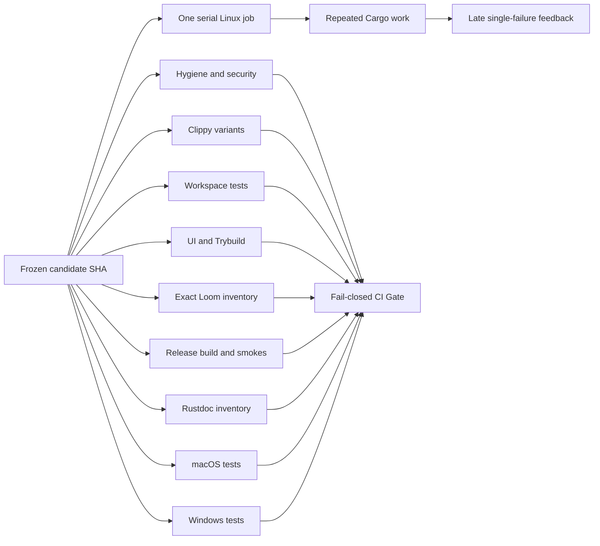

# CI verification runtime and build-cache diagnosis

Purpose: preserve the measured root-cause investigation and correction design for Market Squawk's
approximately one-hour Linux verification feedback loop.

| Metadata | Value |
| --- | --- |
| Document type | Research and diagnostic decision record |
| Audience | Maintainers, CI owners, release reviewers |
| Status | Audited decision input; runtime correction not yet implemented or measured |
| Research date | 2026-07-27 |
| Last substantive review | 2026-07-28 |
| Repository audit anchor | `75de7d43a74b0a1b7a5e9cd2f19e311a7ae2ed45` |
| Evidence audit | [PASS_WITH_NOTES](../audits/2026-07-27-ci-verification-runtime-evidence-audit.md) |

## Table of Contents

- [Scope](#scope)
- [Executive finding](#executive-finding)
- [Measured runtime](#measured-runtime)
- [Root causes](#root-causes)
- [Current candidate correctness follow-up](#current-candidate-correctness-follow-up)
- [Correction design](#correction-design)
- [Acceptance evidence](#acceptance-evidence)
- [Risks and rejected shortcuts](#risks-and-rejected-shortcuts)
- [Sources](#sources)
- [Related documentation](#related-documentation)

## Scope

This investigation answers two questions:

1. Why does a complete Linux verification candidate take approximately one hour?
2. How can feedback time be reduced without deleting tests, weakening release settings, changing
   exact-head authority, relying on paid runners, or treating cached output as approval evidence?

It covers the current GitHub Actions workflow, local verification scripts, Cargo invalidation,
Loom execution, cache policy, GitHub run history, and current official Cargo and GitHub guidance.
It does not approve a release or claim post-change performance before measurement. The correctness
follow-up below records subsequent root-cause evidence for the Linux and Windows failures so this
maintained report does not preserve an obsolete diagnosis.

## Executive finding

The one-hour duration is reproducible work, not a hung runner and not the size of the shipping
application.

One successful Linux job spent approximately 26 minutes in the required optimized release build.
The remaining time was consumed by other mandatory checks running sequentially, with repeated work
made worse by two concrete defects:

1. pull-request runs cannot populate the configured Rust cache, and the repository currently has
   no cache entries; and
2. the platform build script watches a nonexistent package-relative `.git/HEAD`, which makes Cargo
   rebuild that package during otherwise identical invocations.

The exact Loom gate amplifies the second defect by starting Cargo separately for every model. The
single Linux job then hides independent failures until their earlier phases pass.

The durable correction is to fix the invalidation defect, retain the exact Loom inventory while
executing it once, safely populate scoped pull-request caches, run independent verification groups
concurrently at the same commit, and aggregate every result through one fail-closed `CI Gate`.



## Measured runtime

The Linux `verify` job in
[run 30329093586](https://github.com/Sawmonabo/market-squawk/actions/runs/30329093586/job/90180354327)
completed successfully at commit `4f221d6a720acf15c7236c3728b388bb0e1705bf`. Its verification
step ran for approximately 60 minutes 27 seconds.

| Phase | Observed duration | Finding |
| --- | ---: | --- |
| Python, preflight, security, and formatting | ~2m03s | Required but not dominant |
| Three Clippy configurations | ~5m29s | Separate feature/configuration graphs |
| Workspace all-feature tests | ~8m35s | Approximately 6m51s was compilation |
| Explicit UI and Trybuild gate | ~8m47s | Separate construction plus three required UI roots |
| Two exact Loom gates | ~7m08s | Repeated Cargo processes and platform rebuilds |
| Full optimized release build | 26m08s | Current cold critical path |
| Rustdoc contract inventory | 2m15s | Separate Cargo/rustdoc graph |
| Product smoke checks | <1s | Not material |

The workspace at the audit anchor contains 24 packages, 81 Cargo targets, 48 integration-test
targets, 7 binaries, and 1 benchmark. Cargo documents that each integration-test file is a separate
executable and that multiple test executables run serially under ordinary `cargo test`
([Cargo targets](https://doc.rust-lang.org/cargo/reference/cargo-targets.html#integration-tests),
[`cargo test`](https://doc.rust-lang.org/cargo/commands/cargo-test.html)).

At the audit date, the most recent 20 release-branch CI runs consisted of 13 failures and 7
cancellations. Their summed run duration was 8.236 hours. This is not proof that every minute was
wasted; it demonstrates the operational cost of repeatedly learning one late failure and then
submitting another cold candidate.

## Root causes

### 1. Pull-request caches are restore-only, but no cache exists

All three current jobs configure:

```yaml
save-if: ${{ github.event_name == 'push' && github.ref == 'refs/heads/main' }}
```

The workflow runs for pull requests and for pushes to `main`. Release work is occurring in a pull
request, so every release candidate is restore-only. The successful Linux log records:

```text
save-if: false
No cache found.
```

The repository cache inventory returned zero entries and zero bytes at the audit time. The cache
step therefore exists in YAML but provides no acceleration to the current correction loop.

GitHub documents that caches created by a pull request are scoped to that pull request's merge ref
and cannot be restored by the base branch or unrelated pull requests. Cache contents must still be
treated as untrusted input
([GitHub dependency caching](https://docs.github.com/en/actions/reference/workflows-and-actions/dependency-caching)).
The pinned Rust cache action documents `save-if`, its default removal of incremental and workspace
output, and its normal `CARGO_INCREMENTAL=0` behavior
([Swatinem/rust-cache](https://github.com/Swatinem/rust-cache)).

### 2. The platform build script watches the wrong Git path

`crates/market-squawk-platform/build.rs` asks Git for `--git-path HEAD` and passes the returned
`.git/HEAD` directly to `cargo:rerun-if-changed`.

Cargo runs a build script from the package root and tracks the supplied path from that context
([Cargo build scripts](https://doc.rust-lang.org/cargo/reference/build-scripts.html)). The emitted
relative path is therefore interpreted as:

```text
crates/market-squawk-platform/.git/HEAD
```

That file does not exist. Two identical focused checks with Cargo fingerprint diagnostics proved
the result. The second check reported:

```text
stale: missing ".../crates/market-squawk-platform/.git/HEAD"
fingerprint dirty
MissingFile
Compiling market-squawk-platform
```

Cargo recommends fingerprint logging for unexplained rebuild diagnosis
([Cargo FAQ](https://doc.rust-lang.org/cargo/faq.html#why-is-cargo-rebuilding-my-code)).
This is a reproduced repository defect, not a general performance hypothesis.

A correct implementation must emit only absolute, existing Git metadata paths and must handle a
normal checkout, linked worktrees, symbolic refs, detached `HEAD`, and packed refs. Simply joining
the repository root with `.git/HEAD` would not cover all of those Git layouts.

### 3. Loom repeats the invalidated build

`scripts/run_exact_loom_gate.sh` correctly compares the discovered reserved models with an explicit
expected inventory. After that comparison passes, it launches one `cargo test` process for each
model.

The platform gate declares eight models. The successful Linux log shows the platform crate
rebuilding for approximately 23.3 seconds before each model execution. The inventory authority can
remain unchanged while all discovered `loom_model` tests execute through one Cargo process with
one test thread.

### 4. Independent evidence is serialized

`scripts/verify.sh` is one `set -e` shell program inside one Linux job. It runs hygiene, security,
three Clippy graphs, workspace tests, UI tests, Loom, release construction, Rustdoc inspection, and
product smokes in sequence.

Cargo normally stops after the first failing test executable; `--no-fail-fast` continues running
the remaining executables while preserving a failing result
([`cargo test`](https://doc.rust-lang.org/cargo/commands/cargo-test.html#test-options)).
GitHub supports independent concurrent jobs and a final job that depends on every leaf
([workflow syntax](https://docs.github.com/en/actions/reference/workflows-and-actions/workflow-syntax),
[using jobs](https://docs.github.com/en/actions/how-tos/write-workflows/choose-what-workflows-do/use-jobs)).

The current topology therefore delays unrelated evidence and tends to expose one failure per
candidate.

## Current candidate correctness follow-up

The runtime diagnosis did not make the exact release candidate green. The first frozen run at
`75de7d43a74b0a1b7a5e9cd2f19e311a7ae2ed45`,
[run 30332098992](https://github.com/Sawmonabo/market-squawk/actions/runs/30332098992),
completed with:

| Job | Result | Initial finding |
| --- | --- | --- |
| macOS | Passed | Complete current macOS job succeeded |
| Linux verify | Failed | Platform authority-state test returned `AlreadyLocked` |
| Windows | Failed | Analytical backup/evidence tests returned indeterminate or invalid evidence |

### Linux authority-state lock lifetime

The Linux failure was a production lock-lifecycle defect exposed by concurrent process creation.
The authority-state store relied on closing its lock-file descriptor to release an `fs2` advisory
lock. On Linux, `flock` locks belong to an open-file description shared by descriptors duplicated
across `fork`; closing one descriptor does not release the lock while another duplicate remains
open. An immediate successor could therefore receive `AlreadyLocked` after the logical owner had
already dropped. The Linux contract also establishes that an explicit `LOCK_UN` through any
duplicate releases the shared lock
([Linux `flock(2)`](https://man7.org/linux/man-pages/man2/flock.2.html)).

The correction uses a private RAII guard created immediately after acquisition. Its non-panicking
drop explicitly unlocks before closing, covering normal destruction and every later
post-acquisition error path. Genuine contention remains rejected while the guard is alive. The
existing 64-test platform configuration/security harness and focused Clippy gate pass locally with
this correction.

### Windows canonical backup paths

Four Windows analytical-backup failures shared one production path-conversion defect.
`LocalPaths::prepare` canonicalizes its root, and Rust documents that Windows canonicalization
returns extended-length syntax such as `\\?\D:\...`
([`std::fs::canonicalize`](https://doc.rust-lang.org/std/fs/fn.canonicalize.html)). The immutable
SQLite URI builder rejected every double-backslash prefix as UNC, even though Rust distinguishes a
local `VerbatimDisk` prefix from `UNC`, `VerbatimUNC`, `DeviceNS`, and generic verbatim forms
([`std::path::Prefix`](https://doc.rust-lang.org/std/path/enum.Prefix.html)).

The correction classifies parsed Windows path prefixes, accepts only absolute `Disk` and
`VerbatimDisk` paths, converts them to SQLite's `/D:/...` URI-path form, and continues rejecting
network, device, generic verbatim, relative, and non-UTF-8 paths. SQLite documents the drive-letter
URI form and the `immutable=1` read contract
([SQLite URI filenames](https://www.sqlite.org/uri.html),
[SQLite open flags and URI parameters](https://sqlite.org/c3ref/open.html)). The existing
38-test data library suite and focused Clippy gate pass locally with this correction.

### Windows clock-fault fixture

A rerun of only the unchanged Windows job exposed an independent test-fixture race before the data
crate ran:
[job 90209089614](https://github.com/Sawmonabo/market-squawk/actions/runs/30332098992/job/90209089614)
failed in
`control::discovery_control_path_fails_closed_without_blocking_the_runtime`. The original Windows
job had passed the same executable at the same source, runner, image, and toolchain.

The fault-injection clock captured its monotonic origin before durable representation-authority
initialization, then requested a synthetic wall deadline only about one second later. On the slower
run, initialization and scheduling consumed that budget, so the production deadline control
correctly returned `DeadlineExceeded` before injected clock observation 15 could return
`ClockFailure`. The assertion label `call 15` identified the configured fault point; it did not
prove that observation 15 occurred.

The correction changes only those injected clock-failure scenarios to use the standard 60-second
elapsed ceiling as a noncompeting deadline. It preserves the strict `ClockFailure` assertions and
does not change production code. The same harness separately retains immediate-expiry,
one-second saturation, cancellation, and blocking-worker-panic coverage. The exact focused test
passes locally after this fixture correction. The adjacent hostile-clock panic in the failed log
was intentional output from an earlier subcase that the test harness buffered; it was not a second
causal failure.

### Remaining Windows evidence failure

The fifth original Windows data failure,
`derived_commit_retains_canonical_multi_object_and_parent_evidence`, is separate from backup-path
handling. Its path is SQLite queries plus pure semantic validation, and the current error mapping
coarsens multiple internal evidence causes into `AnalyticalEvidenceInvalid`. The focused local
data suite passes, but the Windows-only cause is not yet substantiated. The Windows rerun stopped in
the file-adapter harness before it reached the data crate, so it neither reproduced nor cleared
this finding. No ordering change, retry, serialization, fixture rewrite, or semantic correction is
justified without a repeated failure that preserves a bounded exact cause.

These corrections have focused local evidence only. Release authority still requires one unchanged
candidate to pass the complete Linux, macOS, and Windows jobs. The runtime correction must make
future failures easier to see; it must not mask them.

## Correction design

### 1. Repair Git metadata invalidation

- Resolve Git metadata to absolute, existing paths.
- Track `HEAD`, the active symbolic ref when present, and packed-reference state where applicable.
- Preserve normal checkout, linked-worktree, and detached-`HEAD` behavior.
- Do not watch a nonexistent fallback path.

### 2. Collapse exact Loom execution

- Keep the expected-versus-discovered inventory comparison.
- Fail on missing, unexpected, or duplicate reserved models.
- After inventory equality passes, run the complete `loom_model` filter once with
  `--test-threads=1`.
- Do not add, remove, retry, or skip a model.

### 3. Permit bounded trusted cache writes

Allow cache saves only for:

- pushes to `main`; and
- pull requests whose head repository exactly equals the current repository.

Keep failure saves disabled, exclude workspace and incremental output, store no secrets, retain the
immutable action pin, and make every cache miss execute a normal complete build. Measure each
cache's compressed size, restore time, save time, hit behavior, and eviction before broadening the
policy.

### 4. Run independent leaves concurrently

Use separate same-commit jobs for:

- hygiene, security, formatting, dependency, license, and credential checks;
- the required Clippy configurations;
- complete locked workspace tests with `--no-fail-fast`;
- the existing explicit UI and Trybuild roots;
- both exact Loom inventories;
- the full locked all-feature release build and release-binary smokes;
- the Rustdoc contract inventory;
- macOS tests; and
- Windows tests.

Each leaf remains mandatory and runs independently. No leaf may be conditionally skipped because
another leaf failed.

### 5. Add one fail-closed result

Add a stable `CI Gate` job that:

- declares every mandatory leaf in `needs`;
- runs with `if: always()`; and
- fails unless every required leaf result is exactly `success`.

Skipped, failed, or canceled mandatory leaves must fail the aggregate. After the workflow is proven,
the repository can require this single stable check name for protected changes.

### 6. Preserve local release authority

The complete local `scripts/verify.sh` gate remains the clean, unchanged, exact-head release
authority. Hosted sharding improves feedback and collects cross-platform evidence; it does not turn
focused lane tests, partial caches, or the aggregate job into a substitute for local approval.

### 7. Measure the corrected pipeline

Add stable Cargo `--timings` to the release build and retain the small HTML timing report as
diagnostic evidence
([Cargo timings](https://doc.rust-lang.org/cargo/reference/timings.html)).
Record both the first cold run and subsequent same-pull-request warm runs.

The first corrected cold run is projected at 28–32 minutes because the measured release build is
26m08s and the independent leaves can run concurrently. This is a planning estimate, not a
performance claim. Cache benefit remains unquantified until measured.

## Acceptance evidence

The correction is acceptable only when all of the following are true:

1. Two identical focused Cargo checks prove the second platform build is fresh unless a real input
   changed.
2. Normal checkout, linked-worktree, symbolic-ref, detached-`HEAD`, and packed-ref Git metadata
   handling is reviewed and exercised.
3. The Loom expected inventory is byte-for-byte unchanged and one invocation executes every
   reserved model.
4. Every prior Linux verification surface appears in exactly one mandatory leaf or in a clearly
   documented shared setup.
5. The final gate fails for failed, canceled, or skipped mandatory leaves.
6. Cache writes are limited to trusted events, contain no workspace output or secrets, and a cache
   miss remains fully reconstructive.
7. Linux, macOS, and Windows jobs all report the same exact commit.
8. The current Linux and Windows correctness failures are root-caused rather than retried away.
9. One unchanged candidate completes all required leaves before another candidate is submitted.
10. Cold and warm wall time, cache transfer time, archive size, hit behavior, and release Cargo
    timing are recorded before any speedup is claimed.

## Risks and rejected shortcuts

- Parallel jobs reduce wall time but can increase total runner work. Market Squawk must measure both.
- Cache archives can consume the repository quota or cost more to transfer than they save. Retain
  only measured beneficial caches.
- A restored cache is untrusted acceleration, never approval evidence.
- Integration-test consolidation may later reduce linking overhead, but it requires a
  behavior-preserving inventory audit and is not part of this immediate correction.
- Do not weaken ThinLTO, optimization, or code-generation settings before paired product
  benchmarks.
- Do not adopt paid larger runners or the 1-CPU `ubuntu-slim` runner.
- Do not introduce nightly-only diagnostics.
- Do not install `sccache` as the default compiler wrapper.
- Do not replace Cargo with nextest without complete test, doctest, custom-harness, UI, Loom, and
  feature-parity evidence.
- Do not delete tests, add retries, or normalize failures to make the pipeline green.

GitHub currently documents free, unlimited standard hosted-runner usage for public repositories and
lists the standard public Linux runner at 4 CPUs and 16 GB
([GitHub-hosted runners](https://docs.github.com/en/actions/reference/runners/github-hosted-runners),
[billing and usage](https://docs.github.com/en/actions/concepts/billing-and-usage)).
The correction therefore does not require a paid runner under the current public-repository terms.

## Sources

### Official Cargo and Rust documentation

- [Cargo build scripts and invalidation](https://doc.rust-lang.org/cargo/reference/build-scripts.html)
- [Cargo rebuild diagnosis](https://doc.rust-lang.org/cargo/faq.html#why-is-cargo-rebuilding-my-code)
- [Cargo build cache](https://doc.rust-lang.org/cargo/reference/build-cache.html)
- [Cargo test behavior](https://doc.rust-lang.org/cargo/commands/cargo-test.html)
- [Cargo test targets](https://doc.rust-lang.org/cargo/reference/cargo-targets.html#integration-tests)
- [Cargo build timings](https://doc.rust-lang.org/cargo/reference/timings.html)
- [Cargo profiles](https://doc.rust-lang.org/cargo/reference/profiles.html)
- [Rust Performance Book: compile times](https://nnethercote.github.io/perf-book/compile-times.html)
- [Rust Windows canonicalization](https://doc.rust-lang.org/std/fs/fn.canonicalize.html)
- [Rust Windows path-prefix classification](https://doc.rust-lang.org/std/path/enum.Prefix.html)

### Operating-system and analytical-storage contracts

- [Linux `flock(2)`](https://man7.org/linux/man-pages/man2/flock.2.html)
- [SQLite URI filenames](https://www.sqlite.org/uri.html)
- [SQLite opening connections and immutable URI parameters](https://sqlite.org/c3ref/open.html)

### Official GitHub documentation and maintained tools

- [GitHub Actions dependency caching](https://docs.github.com/en/actions/reference/workflows-and-actions/dependency-caching)
- [GitHub Actions workflow syntax](https://docs.github.com/en/actions/reference/workflows-and-actions/workflow-syntax)
- [GitHub Actions job variations](https://docs.github.com/en/actions/how-tos/write-workflows/choose-what-workflows-do/run-job-variations)
- [GitHub-hosted runners](https://docs.github.com/en/actions/reference/runners/github-hosted-runners)
- [GitHub Actions billing and usage](https://docs.github.com/en/actions/concepts/billing-and-usage)
- [Swatinem/rust-cache](https://github.com/Swatinem/rust-cache)
- [actions/cache](https://github.com/actions/cache)
- [Mozilla sccache](https://github.com/mozilla/sccache)
- [cargo-nextest](https://github.com/nextest-rs/nextest)

### Academic evidence

- Bouzenia and Pradel,
  [Resource Usage and Optimization Opportunities in Workflows of GitHub Actions](https://software-lab.org/publications/icse2024_workflows.pdf),
  ICSE 2024.
- Hasan et al.,
  [How Developers Adopt, Use, and Evolve CI/CD Caching](https://arxiv.org/abs/2604.13129),
  2026 preprint.
- Ghaleb et al.,
  [The Promise and Reality of Continuous Integration Caching](https://arxiv.org/abs/2601.19146),
  2026 preprint.
- Zheng, Adams, and Hassan,
  [Does Using Bazel Help Speed Up Continuous Integration Builds?](https://doi.org/10.1007/s10664-024-10497-x),
  2024.

The academic sources establish evaluation factors and workload dependence. They do not provide a
Rust-specific or Market Squawk-specific numerical speedup.

## Related documentation

- [Rust development and test storage hardening](2026-07-21-rust-dev-test-storage-hardening.md)
- [Build evidence authority boundary](2026-07-17-q2-build-evidence-authority-boundary.md)
- [Project operating memory](../project-memory.md)
- [Verification reference](../verification.md)
- [CI runtime evidence audit](../audits/2026-07-27-ci-verification-runtime-evidence-audit.md)
