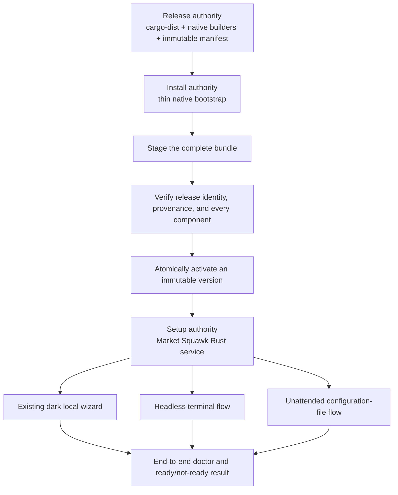
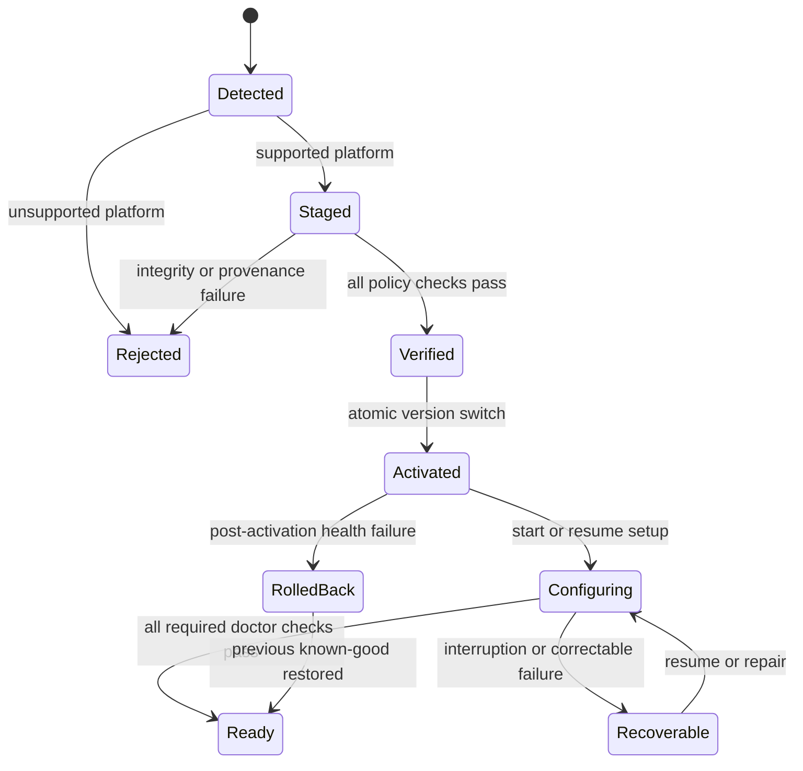
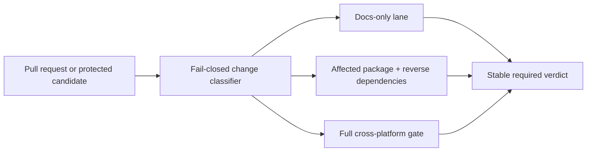

# Cross-platform installation and guided setup

Purpose: preserve the evidence-backed comparison and recommended design direction for a complete,
beginner-friendly Market Squawk installation on Windows, macOS, and Linux.

| Metadata | Value |
| --- | --- |
| Document type | Research and architectural decision input |
| Audience | Product owners, maintainers, release engineers, security reviewers |
| Status | Research complete; design decision pending; no implementation authority |
| Research date | 2026-07-28 |
| Repository audit anchor | `f9b8b4e5cfb84b30a0a682fd7952e766a14b4ba1` |
| Evidence audit | [PASS_WITH_NOTES](../audits/2026-07-28-cross-platform-installation-evidence-audit.md) |
| Refresh gate | Refresh repository state, tool versions, platform signing rules, and Python artifact coverage before implementation planning if the audit anchor or external requirements materially change |

## Table of Contents

- [Scope](#scope)
- [Executive finding](#executive-finding)
- [Required user outcome](#required-user-outcome)
- [Candidate comparison](#candidate-comparison)
- [Recommended architecture](#recommended-architecture)
- [Complete default installation](#complete-default-installation)
- [Installation lifecycle](#installation-lifecycle)
- [Platform entrypoints](#platform-entrypoints)
- [Python environment](#python-environment)
- [Security and release trust](#security-and-release-trust)
- [CI and release-evidence boundary](#ci-and-release-evidence-boundary)
- [Decisions still required](#decisions-still-required)
- [Rejected shortcuts](#rejected-shortcuts)
- [Primary sources](#primary-sources)
- [Related documentation](#related-documentation)

## Scope

This research answers:

1. Which current installation and setup-wizard architecture best fits a self-hosted Rust product
   with a sealed Python research/modeling environment, local analytical storage, provider
   onboarding, MCP, and beginner-facing setup?
2. How should one complete installation behave on Windows, macOS, and Linux?
3. Which responsibilities belong to release tooling, native installation, and Market Squawk?
4. Which trust, repair, upgrade, rollback, uninstall, offline, and headless contracts are required?

It compares cargo-dist 0.32, Qt Installer Framework 4.11, Tauri 2, cargo-packager 0.11.8, Zero
Install, uv, platform-native packaging, and the existing Market Squawk secure local portal.

This report does not approve an implementation, freeze a platform/architecture matrix, authorize a
signing expense, or claim that current Python artifacts cover all three operating systems.

## Executive finding

The recommended direction is a hybrid with three deliberately separate authorities:

- **cargo-dist** should plan, build, and publish complete versioned release artifacts.
- A **thin native bootstrap** should detect the platform, stage one immutable bundle, verify it, and
  atomically activate it.
- The existing **Market Squawk dark local portal**, backed by one Rust setup state machine, should
  own the beginner-facing guided setup. The same state machine should support headless and
  unattended operation.
- A pinned **uv** executable should assemble a Market Squawk-owned Python environment from
  release-bound managed CPython and wheel artifacts without modifying system Python.

No reviewed single tool safely owns the entire required lifecycle. The hybrid keeps provider,
Python, data, portfolio, MCP, paper-execution, repair, and readiness logic in the product instead of
duplicating it across shell, PowerShell, Qt scripts, Tauri commands, and Rust.

## Required user outcome

Each guided recommended installation must produce the same complete supported product. “Recommended”
must never mean a reduced or partial installation.

The default experience is:

1. Download or open the normal installer for the user's operating system.
2. Confirm a plain-language summary rather than choose technical components.
3. Install all product components without requiring an existing Rust or Python toolchain.
4. Open the welcoming dark setup wizard.
5. Use safe native defaults for program, configuration, data, cache, log, credential, and artifact
   locations.
6. Guide the user through required zero-fee provider setup and any user authorization.
7. Validate live data, research data, Python/modeling, MCP, portfolio, paper execution, and storage.
8. Finish with a clear **Ready** result or specific recovery actions.

An advanced custom flow may expose component or location controls, but it must be an explicit
departure from the complete default.

## Candidate comparison

| Candidate | Strengths | Material limitation for Market Squawk | Decision |
| --- | --- | --- | --- |
| cargo-dist 0.32 | Rust workspace releases, platform archives, shell/PowerShell installers, MSI, GitHub Releases, checksums, auditable metadata, optional attestations | Generated installers do not own sealed Python, provider/data setup, whole-bundle activation, rollback, or data-safe uninstall | Use as release foundation |
| Qt Installer Framework 4.11 | One customizable GUI/CLI framework on Windows, macOS, and Linux; online/offline components; add/update/remove maintenance tool | Adds Qt/QJSEngine installer behavior and a second product-lifecycle implementation; duplicates the current portal; does not remove signing or product-specific security work | Strong fallback, not recommended |
| Tauri 2 | Modern Rust-backed web UI; MSI/NSIS, DMG/app, AppImage and native Linux packages; signed updater | Adds WebView, IPC, Windows WebView2 choices, and Linux WebKitGTK surface solely to display setup; duplicates the current portal | Use only if Market Squawk intentionally becomes a desktop application |
| cargo-packager 0.11.8 | Rust-native platform packaging and external-binary support | Packaging tool rather than complete setup, repair, upgrade, and rollback authority | Consider only for a proven cargo-dist format gap |
| Zero Install | Open-source cross-platform, per-user execution, signed feeds, dependencies, updates | Requires another package manager and does not provide Market Squawk onboarding | Architecture reference or secondary channel |
| Existing local portal + Rust service | Reuses current dark beginner-facing UX; one product-owned state machine; browser, terminal, and automation parity | Requires native bootstrap and release engineering | Guided-setup authority |

### cargo-dist

cargo-dist is the strongest maintained Rust release-orchestration candidate reviewed. It supports
workspace release planning, cross-platform artifacts, several installer families, custom artifact
builders, checksums, GitHub workflows, auditable metadata, and optional GitHub attestations
([documentation](https://axodotdev.github.io/cargo-dist/),
[configuration](https://axodotdev.github.io/cargo-dist/book/reference/config.html),
[supply-chain security](https://axodotdev.github.io/cargo-dist/book/supplychain-security/index.html)).

Its MSI support uses WiX 3 and supplies normal Windows install, upgrade, PATH, and Add or Remove
Programs behavior. Its own documentation notes rough edges
([MSI installer](https://axodotdev.github.io/cargo-dist/book/installers/msi.html)).

cargo-dist should be subordinate to a Market Squawk release manifest and custom complete-bundle
builder. It should not own domain configuration.

### Qt Installer Framework

Qt Installer Framework 4.11 creates customizable guided installers for Windows, macOS, and Linux,
including online, offline, and hybrid delivery
([overview](https://doc.qt.io/qtinstallerframework/ifw-overview.html),
[4.11 release](https://www.qt.io/blog/qt-online-installer-and-qt-installer-framework-4.11.0-released)).
Its maintenance tool supports add, update, remove, purge, defaults, forced components, interactive
CLI, and unattended operation
([end-user workflows](https://doc.qt.io/qtinstallerframework/ifw-use-cases.html),
[CLI workflows](https://doc.qt.io/qtinstallerframework/ifw-use-cases-cli.html)).

Qt IFW is the best fallback if the project requires one embedded GUI before any Market Squawk
binary can run. It is not recommended because it would move important setup behavior into a second
Qt/QJSEngine implementation and duplicate the existing portal.

### Tauri

Tauri 2 provides modern Rust-backed desktop UI and platform distribution
([distribution](https://v2.tauri.app/distribute/)). Windows packages can use MSI/WiX or NSIS, and
the default NSIS mode is per-user. Tauri documents several WebView2 delivery modes, including large
offline and fixed-runtime options
([Windows installer](https://v2.tauri.app/distribute/windows-installer/)). Linux AppImage
compatibility depends on the build baseline and WebKitGTK requirements
([AppImage](https://v2.tauri.app/distribute/appimage/)).

Tauri is appropriate if the product adopts a desktop shell for broader reasons. Adding it only for
installation would introduce runtime and security surface without removing any of the hard
installation responsibilities.

## Recommended architecture

### Release authority

Use cargo-dist with repository-owned custom artifact construction. Each platform bundle contains:

- `market-squawk`;
- the capture helper;
- the ONNX worker;
- all required adapter and setup assets;
- the pinned uv executable;
- a supported managed CPython distribution;
- the complete locked platform wheelhouse;
- schemas, licenses, notices, and artifact metadata;
- the release manifest, component digests, and required provenance.

Build and smoke-test each platform artifact on its corresponding operating system. The release
manifest is the only authority for which component versions form one product release.

### Install authority

The native bootstrap performs only:

1. supported operating-system and architecture detection;
2. immutable manifest acquisition;
3. complete-bundle staging;
4. expected release identity and provenance verification;
5. verification of every staged component;
6. pre-activation checks;
7. atomic activation of an immutable version directory;
8. per-user command and uninstall registration;
9. launch of `market-squawk setup`.

It does not implement provider, portfolio, model, strategy, or financial setup.

### Setup authority

One Rust setup service should expose:

- the existing local dark web wizard for normal desktop users;
- a terminal interface for headless systems;
- a noninteractive configuration-file interface for automation.

The interfaces are views over one desired-state model, step graph, checkpoint store, validation
engine, and recovery policy. Secrets must not appear in command-line arguments or logs.

## Complete default installation

The complete default contract applies equally to:

- online guided installation;
- offline guided installation;
- desktop local-wizard setup;
- headless terminal setup;
- unattended deployment using the recommended profile.

Those paths may differ in interaction and artifact source, but not in installed capability.

Default installation includes the software and small deterministic health fixtures. It does not
silently download unbounded market history or alternative datasets. The setup wizard should let the
user select storage and begin permitted ingestion after explaining size and source coverage.

## Installation lifecycle

Program versions are immutable. Download and verification occur in staging. Activation changes a
single version selector only after complete validation. The previous known-good version remains
available for rollback.

Uninstall must offer separate operations:

- remove program files while preserving configuration and user datasets by default;
- remove configuration and credentials;
- delete datasets and artifacts only after separate explicit confirmation.

## Platform entrypoints

The design direction is:

- **Windows:** signed per-user setup executable for beginners; MSI and WinGet as additional
  supported channels.
- **macOS:** signed and notarized package/app distribution for beginners; Homebrew and a verified
  archive as additional channels.
- **Linux:** verified portable bundle plus selected native packages; use the local wizard where a
  browser is available and the same setup service through the terminal when headless.

This is not the final support matrix. Cross-platform source does not replace native build,
installation, signing, and smoke evidence.

Apple direct distribution normally requires Developer ID signing and notarization. Windows
publisher trust also requires a signing/channel decision. Framework selection does not remove those
requirements
([Apple notarization](https://developer.apple.com/documentation/security/notarizing_macos_software_before_distribution),
[Microsoft Authenticode inspection](https://learn.microsoft.com/en-us/powershell/module/microsoft.powershell.security/get-authenticodesignature)).

## Python environment

uv supports Windows, macOS, and Linux without requiring a preinstalled Rust or Python toolchain. It
can install managed CPython, require managed Python, and perform exact locked synchronization.
CPython 3.12 and 3.13 are Tier 1 supported
([uv](https://docs.astral.sh/uv/),
[managed Python](https://docs.astral.sh/uv/guides/install-python/),
[locking and syncing](https://docs.astral.sh/uv/concepts/projects/sync/),
[support policy](https://docs.astral.sh/uv/reference/policies/python/)).

Market Squawk should:

1. admit a pinned uv executable through the same release manifest;
2. use only the release-bound managed CPython artifact for the target platform;
3. perform an exact locked sync from the complete release wheelhouse;
4. install under the versioned product root;
5. never modify system Python;
6. verify the final Python environment before activation;
7. support the same result from the online and offline bundles.

Current sealed Python product evidence is narrower than the desired OS matrix. The product cannot
claim complete cross-platform installation until every supported pair has a complete built,
installed, and exercised Python artifact set.

## Security and release trust

HTTPS and checksums do not establish complete release authority. The installer must verify:

- immutable manifest identity and freshness;
- expected publisher, signer, issuer, or trusted-root policy;
- required build provenance;
- the complete expected component inventory;
- every component digest;
- platform signature where applicable;
- schema and product compatibility;
- absence of unapproved additional components.

SLSA defines provenance structures, Sigstore verifies signed bundles, in-toto represents
attestations, and TUF supplies patterns for role separation, expiry, threshold authorization,
rollback protection, and key recovery
([SLSA v1.2](https://slsa.dev/spec/v1.2/build-provenance),
[Sigstore verification](https://docs.sigstore.dev/cosign/verifying/verify/),
[in-toto attestations](https://github.com/in-toto/attestation),
[TUF](https://theupdateframework.github.io/specification/latest/)).

Those systems do not decide which Market Squawk components form a complete release. That admission
policy belongs to Market Squawk.

Use per-user native directories and separate immutable programs from mutable state:

- XDG locations on Linux
  ([XDG Base Directory Specification](https://specifications.freedesktop.org/basedir-spec/latest/));
- Local AppData and other known folders on Windows
  ([Known Folder IDs](https://learn.microsoft.com/en-us/windows/win32/shell/knownfolderid));
- Application Support and related native locations on macOS
  ([Application Support](https://developer.apple.com/documentation/foundation/url/applicationsupportdirectory)).

PATH changes must be per-user, idempotent, reversible, delimiter-safe, and free of current-directory
entries.

## CI and release-evidence boundary

Installer and package changes require native installed-product smoke evidence, but affected-change
CI remains only a scheduling optimization.

The recommended workflow shape is:

- Trigger the required workflow for every relevant pull request and protected integration event.
- Classify inside the workflow rather than skipping the entire required workflow through path
  filters.
- Skip heavy Rust jobs only for confidently unaffected changes.
- Escalate incomplete, truncated, unknown, shared, generated, manifest, lockfile, build, workflow,
  release, installer, or packaging changes to the full gate.
- Keep one stable aggregate verdict that directly depends on every conditional required job.
- Preserve clean, unchanged, exact-head Linux/macOS/Windows evidence at protected integration,
  merge queue, main, tag, release, and delivery-quarter checkpoints.

This is consistent with the maintained
[CI verification runtime research](2026-07-27-ci-verification-runtime.md); implementation and
measured improvement remain separate work.

## Decisions still required

1. **Signing policy:** does the zero-mandatory-cost rule prohibit maintainer-funded Apple and
   Windows publisher signing, or only fees imposed on the user/runtime?
2. **Support matrix:** which exact Windows, macOS, and Linux versions and architectures must V1
   support?
3. **Primary channel:** should double-click native installers and package-manager channels receive
   equal support, or is one primary?
4. **Rollback retention:** how many previous immutable versions should remain installed?
5. **Offline budget:** what maximum complete bundle size is acceptable per platform?
6. **Linux baseline:** which minimum glibc/distribution baseline and native package formats are
   supported?
7. **Schema recovery:** which local catalog and dataset changes can roll back safely?
8. **Provider readiness:** how should the wizard distinguish installed capability from a provider
   still awaiting user authorization or third-party approval?

The first two decisions materially shape the release matrix and must be settled before the
implementation plan.

## Rejected shortcuts

- Do not make a shell or PowerShell script the full setup authority.
- Do not use `cargo install` as the beginner installation path.
- Do not resolve Python dependencies from the network during installation.
- Do not mutate system Python.
- Do not treat successful file copying as product readiness.
- Do not activate a partially verified bundle.
- Do not overwrite a running version in place.
- Do not delete user datasets during ordinary uninstall.
- Do not add Qt or Tauri solely to avoid reusing the existing portal.
- Do not let affected-only CI become release approval evidence.
- Do not claim performance, cross-platform coverage, rollback, or offline parity before native
  measurement.

## Primary sources

### Release and packaging

- [cargo-dist documentation](https://axodotdev.github.io/cargo-dist/)
- [cargo-dist configuration](https://axodotdev.github.io/cargo-dist/book/reference/config.html)
- [cargo-dist supply-chain security](https://axodotdev.github.io/cargo-dist/book/supplychain-security/index.html)
- [cargo-dist MSI installer](https://axodotdev.github.io/cargo-dist/book/installers/msi.html)
- [cargo-packager](https://docs.rs/cargo-packager/latest/cargo_packager/)

### Guided installer candidates

- [Qt Installer Framework 4.11](https://doc.qt.io/qtinstallerframework/)
- [Qt IFW overview](https://doc.qt.io/qtinstallerframework/ifw-overview.html)
- [Qt IFW command-line workflows](https://doc.qt.io/qtinstallerframework/ifw-use-cases-cli.html)
- [Tauri distribution](https://v2.tauri.app/distribute/)
- [Tauri Windows installer](https://v2.tauri.app/distribute/windows-installer/)
- [Tauri AppImage](https://v2.tauri.app/distribute/appimage/)
- [Zero Install](https://0install.net/)

### Python

- [uv documentation](https://docs.astral.sh/uv/)
- [uv managed Python](https://docs.astral.sh/uv/guides/install-python/)
- [uv locking and syncing](https://docs.astral.sh/uv/concepts/projects/sync/)
- [uv Python support](https://docs.astral.sh/uv/reference/policies/python/)

### Platform and security

- [GitHub artifact attestations](https://docs.github.com/en/actions/concepts/security/artifact-attestations)
- [Apple notarization](https://developer.apple.com/documentation/security/notarizing_macos_software_before_distribution)
- [SLSA Build Provenance v1.2](https://slsa.dev/spec/v1.2/build-provenance)
- [TUF specification](https://theupdateframework.github.io/specification/latest/)
- [Sigstore verification](https://docs.sigstore.dev/cosign/verifying/verify/)
- [in-toto attestation framework](https://github.com/in-toto/attestation)
- [OpenSSF project security baseline](https://baseline.openssf.org/)
- [NIST SSDF](https://csrc.nist.gov/pubs/sp/800/218/final)

## Related documentation

- [Installation and bootstrap](../operations/installation-and-bootstrap.md)
- [Security and trust boundaries](../architecture/security-and-trust-boundaries.md)
- [Local deployment model](../architecture/deployment.md)
- [Configuration and secrets](../operations/configuration-and-secrets.md)
- [Provider onboarding research](2026-07-22-zero-fee-provider-onboarding/final-report.md)
- [Python product dependency admission](2026-07-22-python-product-dependency-admission.md)
- [CI verification runtime and build-cache diagnosis](2026-07-27-ci-verification-runtime.md)
- [Delivery ledger](../plans/delivery-ledger.md)
