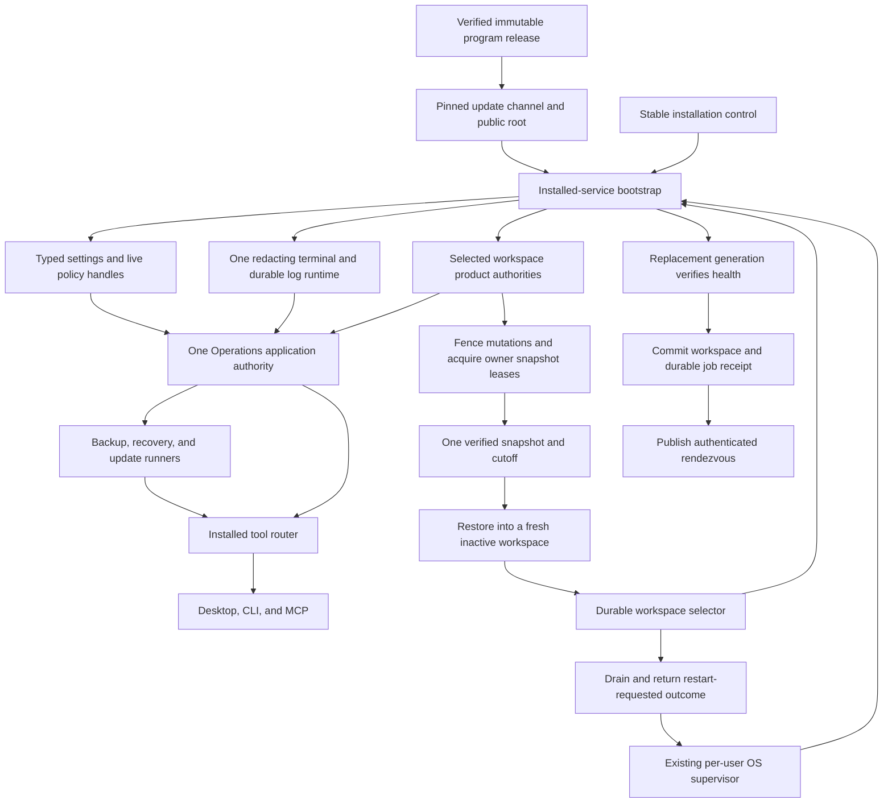

# Installed Operations authority boundaries

Purpose: preserve the source-audited design findings required to make backup, restore, update,
settings, and structured logs real installed-product capabilities rather than advertised but
unreachable contracts.

| Metadata | Value |
| --- | --- |
| Document type | Date-anchored implementation research and authority decision input |
| Audience | Application, installer, platform, operations, and release maintainers |
| Status | Audited design input; Operations remains release-blocking and uncomposed |
| Audit date | 2026-08-02 |
| Exact audit base | `ef34dbc251eacc213291c9f184176f4db83f5cdb` |
| Approval meaning | The audit base is a source locator, not Quarter 4 or release approval |
| Refresh gate | Before implementation or approval at another head, re-audit every path, constructor, package input, runtime handoff, and shutdown edge changed since this commit |

## Contents

- [Executive finding](#executive-finding)
- [Current implementation truth](#current-implementation-truth)
- [Required authority model](#required-authority-model)
- [Backup and restore](#backup-and-restore)
- [Trusted updates](#trusted-updates)
- [Settings and structured logs](#settings-and-structured-logs)
- [Recovery across service generations](#recovery-across-service-generations)
- [Composition and lifecycle order](#composition-and-lifecycle-order)
- [Implementation constraints](#implementation-constraints)
- [Code evidence](#code-evidence)

## Executive finding

Market Squawk defines 24 typed `Operations.*` descriptors and a complete transport-neutral
`OperationsApplicationServices` contract, but the installed service does not construct or route
that domain. The generic application registry intentionally excludes Operations, the installed
tool router has no `InstalledOperations` owner, and the installed runner set omits the backup,
recovery, and update runners
([contracts](../../apps/market-squawk/src/application/contracts.rs#L1231),
[application registry](../../apps/market-squawk/src/application.rs#L72),
[tool router](../../apps/market-squawk/src/service/tool_services.rs#L36),
[runner set](../../apps/market-squawk/src/jobs/mod.rs#L56)).

This is not a presentation defect. Desktop, CLI, and MCP cannot make these capabilities usable
until the sole installed service owns their durable stores, lifecycle controls, job runners,
trusted package inputs, and shutdown behavior. Wiring the existing adapter alone would also be
incorrect: the current backup component source, update package producer, settings restart, terminal
logger, and workspace handoff do not yet satisfy their production contracts.

## Current implementation truth

| Capability | What exists at the audit base | What remains required |
| --- | --- | --- |
| Operations routing | Typed contracts, previews, approvals, bounded results, `OperationsApplicationServices`, and `InstalledOperations` exist. | Construct one exact Operations instance, register its three runners, and route it from the sole installed tool service. |
| Analytical backup | Catalog-consistent SQLite and immutable-object backup, verification, and restore are implemented. | Bind it into one workspace-wide cutoff with every non-analytical authority. |
| Product backup | Nine component kinds, manifests, inventory, and a filesystem materializer exist. | Replace caller-supplied live-file copying with owner-produced snapshot receipts and implement fresh-workspace restore. |
| Trusted update | The installer verifies pinned root metadata, root rotation, role thresholds, expiry, rollback, consistent snapshots, and exact targets; the application can retrieve and stage admitted updates. | Package a verified channel descriptor and public root, produce the signed repository layout, and compose the consumer only from the immutable installed release. |
| Settings | Typed values, origins, revisions, previews, rollback, persistence, and a receipt journal exist. | Seed from effective configuration, bind every mutable value to a real consumer, and separate live reload from cross-process restart. |
| Structured logs | Bounded segmented storage, query/export, a nonblocking writer, and controlled artifact publication exist. At `ef34dbc`, durable-event admission also redacts credential-shaped values in neutral fields and rejects credential-shaped indexed labels. | Install one redacting subscriber for terminal/JSON and durable output, enforce live severity/retention, and retain drain/join ownership through shutdown. |
| Recovery | Workspace inventory, lifecycle journal, durable recovery state, runtime identities, rendezvous, and OS-owned service registration exist. | Replace the process-local handoff and synchronous restart/health sequence with a durable two-generation transition completed by the replacement process. |

The current `InstalledService::start_prepared` constructs runtime identity, `LocalProduct`, ordinary
job runners, the job authority, transport, and rendezvous in that order; it constructs none of the
Operations authorities
([service startup](../../apps/market-squawk/src/service/mod.rs#L213)). The correct integration seam
is therefore the installed-service composition, not another dashboard-only backend or a second
process holding the same state.

## Required authority model

One installed service must own stable installation control and one selected workspace. All
presentations call that service. Backup coordinates the workspace authorities; update trust comes
only from the verified immutable program release; and any workspace or restart-required settings
transition crosses the OS supervisor through durable state.



The stable installation-control area owns service identity, rendezvous, native registration,
workspace inventory, and pending transition state. The selected workspace owns product data,
catalogs, portfolios, models, decisions, jobs, logs, and domain receipts. Public records retain
opaque identities and controlled references, never ambient filesystem authority.

## Backup and restore

The analytical path is the reference implementation. `AnalyticalBackupService::create` holds its
operation and publication gates, captures catalog evidence, verifies the referenced immutable
inventory, uses the catalog backup authority, materializes exact objects, and re-verifies the
bundle
([analytical backup](../../crates/market-squawk-data/src/analytical_backup.rs#L228)).

The product wrapper currently completes that analytical backup and then asks a component writer to
materialize the remaining state
([product backup](../../apps/market-squawk/src/application/backup.rs#L86)). The installed writer
accepts pre-existing files and explicitly ignores its `cutoff` argument
([component writer](../../apps/market-squawk/src/local_product/operations/backup.rs#L169)). Separate
double-read file checks cannot turn independently changing databases, authority documents, and
object graphs into one coherent snapshot. No implementation of `ProductRestoreComponentAuthority`
exists at the audit base
([restore contract](../../apps/market-squawk/src/application/backup.rs#L512)).

The production boundary is one `WorkspaceBackupAuthority` with this behavior:

1. Fence new workspace mutations and job admissions; bring in-flight work to documented safe
   checkpoints.
2. Acquire non-cloneable snapshot leases from each owning authority in one fixed order.
3. Allocate the snapshot identity and cutoff only after every lease is held.
4. Have owners emit bounded, versioned artifacts binding producer identity, generation or journal
   sequence, cutoff, schema, size, digest, sensitivity, and referenced-object inventory.
5. Use online SQLite backup under the owning lease for decisions, jobs, and provider-rate state.
   Export authenticated authority documents only through their typed owners.
6. Bind analytical evidence and all required product components to one manifest. Portfolio and
   transaction projections share one portfolio generation; fair-value evidence is an attestation
   over the analytical catalog, not a duplicate database.
7. Restore only into a fresh inactive workspace, reopen the normal production authorities, verify
   every cross-component relationship, then make that workspace eligible for activation.

Unencrypted backups exclude secret payloads. They may preserve bounded credential references and
evidence needed to guide reactivation. Exporting secret material requires a distinct explicitly
encrypted contract; it must not appear accidentally through a generic component file.

## Trusted updates

The existing consumer boundary should be retained. `TrustedRoot::from_pinned` and
`TrustedUpdateStore::open_or_bootstrap` implement the public trust-anchor and monotonic metadata
store
([update metadata](../../apps/market-squawk-installer/src/update_metadata.rs#L101)).
`TrustedUpdateRepository::try_new` accepts only one pinned public root, one closed HTTPS directory,
and two distinct target paths
([managed update repository](../../apps/market-squawk/src/local_product/operations/update.rs#L65)).

The missing boundary is package-owned production input. The complete release builder currently
stages desktop, capture helper, installer, and uv as native inputs; it does not stage the service,
MCP relay, update-channel descriptor, or pinned public root
([release native inputs](../../scripts/build_complete_release.py#L159)). No production
`channel.json`, root, targets, snapshot, or timestamp metadata is generated.

Every installed release must add two fixed, verified components:

```text
share/market-squawk/update/channel.json
share/market-squawk/update/1.root.json
```

The descriptor binds the exact HTTPS repository base, manifest target, archive target, and pinned
root length and SHA-256. Release-authority tooling, outside the runtime and installed product,
produces signed root/targets/snapshot/timestamp metadata plus hash-prefixed consistent-snapshot
copies of the exact manifest and archive. The same Rust verifier must admit the produced repository
before package acceptance. Private signing keys never enter the repository, build staging tree, or
installed release.

Source and development executions without an admitted installed-release descriptor remain usable,
but update status must report a typed unavailable state and update mutations must fail closed. They
must not infer trust from mutable settings, environment variables, a source checkout, unit-test
metadata, or the current unsigned `releases/latest` manifest URL in
[`install.sh`](../../distribution/install.sh#L30).

## Settings and structured logs

The service binary currently installs a global `tracing_subscriber::fmt` subscriber before it loads
configuration
([service entrypoint](../../apps/market-squawk/src/bin/market-squawk-service.rs#L54)). That sink is
not governed by the structured-log sanitizer, and an already-installed global subscriber cannot
later be replaced by the durable log layer.

The durable event admission was tightened at the audit base: neutral field values containing known
credential patterns are redacted, and `operation`, `source_id`, `job_id`, and `correlation_id`
reject those patterns
([event admission](../../apps/market-squawk/src/application/logs.rs#L143),
[label admission](../../apps/market-squawk/src/application/logs.rs#L362)). This closes the identified
durable-record cases. It does not protect the independent terminal/JSON formatter or establish one
shared live severity policy.

Installed bootstrap must therefore load validated configuration before installing logging, derive
`SettingsSeed` with exact configuration origins, open one settings store, derive log policy, open
one structured store, spawn one layer/drain/worker trio, and install one subscriber that applies the
same bounded redaction policy to terminal/JSON and durable output. `InstalledService` retains the
drain and worker through startup cleanup and normal shutdown. The controlled log-artifact publisher
must reuse `LocalProduct`'s concrete artifact repository, not open another repository.

Settings lifecycle has two distinct paths:

- A true in-process reload is permitted only for a consumer with a real live handle. The operation
  verifies that consumer against the exact active settings revision and digest.
- A setting requiring service recomposition creates a durable supervisor transition. The current
  process persists the accepted operation, drains, and exits; the replacement generation loads the
  snapshot, verifies every affected consumer, and completes or rolls back the journal.

`ProductionSettingsOperations` currently calls reload/restart/health synchronously inside the
request that persisted the change
([settings lifecycle](../../apps/market-squawk/src/local_product/operations/settings.rs#L60),
[apply path](../../apps/market-squawk/src/local_product/operations/settings.rs#L103)). A supervisor
restart can terminate that caller, so the synchronous restart branch must not be composed with a
no-op or process-terminating callback. A setting becomes mutable only when its actual consumer is
bound.

## Recovery across service generations

The installer already owns fixed, per-user native service registration and authenticated status,
verification, and same-workspace restart. The current restart authority intentionally advances the
service generation while retaining the workspace identity
([service restart](../../apps/market-squawk-installer/src/service_registration.rs#L307)). That API
should remain unchanged.

Workspace recovery needs a separate durable transition. The current implementation is not
restart-durable:

- `RecoveryWorkspaceHandoff` keeps prepared restores in a process-local `Mutex<BTreeMap<...>>`
  ([handoff](../../apps/market-squawk/src/local_product/operations/recovery.rs#L113));
- `InstalledServiceRecoveryHooks` has no production implementation
  ([hooks](../../apps/market-squawk/src/local_product/operations/recovery.rs#L164));
- `SupervisorRestartWorkspaceTransition` awaits restart and then health in the process being
  replaced
  ([transition](../../apps/market-squawk/src/local_product/operations/recovery.rs#L697));
- service startup advances runtime generation without consuming
  `DurableRecoveryState::startup_identity`, `startup_healthy`, or `startup_failed`
  ([runtime preparation](../../apps/market-squawk/src/service/runtime.rs#L170),
  [recovery startup state](../../apps/market-squawk/src/local_product/operations/recovery.rs#L345));
  and
- `RecoveryJobRunner` reopens every interrupted job as `MarkInterrupted`, so a replacement process
  cannot publish a successful durable recovery result
  ([runner recovery](../../apps/market-squawk/src/jobs/recovery.rs#L148)).

The replacement contract is a durable selector below application composition. It binds the
installation, operation and evidence identity, previous and candidate runtime identities, selected
workspace reference, transition phase, and one idempotent terminal receipt. The current service
fences and drains, persists the selector, returns a typed restart-requested result, completes normal
shutdown, and exits with the supervisor-recognized disposition. It does not invoke `systemctl`,
`launchctl`, `schtasks`, or the installer restart function from inside itself.

The replacement generation consumes the selector before rendezvous publication, opens and
revalidates the selected workspace, composes product and runners, performs internal authenticated
readiness, commits the workspace/recovery/job receipts idempotently, and only then publishes the
new rendezvous. Candidate failure writes a strictly newer rollback selector. Failure of that
rollback persists `recovery_required` and stops automatic retry so the existing repair path can
take over without a restart loop.

## Composition and lifecycle order

The serialized integration order is:

1. Separate stable installation control from the authority-selected workspace root and add the
   durable cross-generation selector.
2. Add the pre-subscriber settings/log bootstrap and real live policy handles.
3. Add owner-issued backup snapshot/restore contracts and the package-owned update descriptor/root
   producer. These ownership areas may progress independently until they touch service composition
   or release manifests.
4. Construct exactly one `OperationsApplicationServices`; retain the same instance in its backup,
   recovery, and update runners and in `InstalledOperations`.
5. Register those runners with `InstalledJobAuthority`, add `InstalledOperations` to
   `InstalledToolServices`, and dispatch it before generic application routing.
6. On shutdown, fence transport, drain job/domain work, reconcile paper/execution, persist final
   operation and audit facts, flush/join structured logging, close the job repository, and retire
   the rendezvous. Startup-failure cleanup follows the same ownership order in reverse.

Operations remains separate from `ApplicationDomainServices`, just as the existing Job and
Decision adapters are special installed-service routes. Expanding the generic registry is neither
necessary nor sufficient.

## Implementation constraints

- Do not present descriptors, adapters, or constructors as working product capability before the
  installed service owns and routes their actual authorities.
- Do not copy live SQLite databases, WAL files, mutable authority documents, or arbitrary component
  files as backup.
- Do not overwrite the active workspace during restore.
- Do not let the dashboard, CLI, MCP, environment, or mutable settings choose update trust roots or
  repository origins.
- Do not install a second tracing subscriber, logger process, artifact repository, or competing
  direct-CLI state owner.
- Do not synchronously restart the serving process and then expect its request future to verify the
  replacement generation.
- Keep proof focused on real boundaries: coherent snapshot and fresh restore, signed-update
  producer-to-consumer admission, settings apply/rollback across the required lifecycle, log
  redaction and final drain, and child-process workspace transition/rollback. No prose tests,
  file-existence checks, or new test executable are justified by this record.

## Code evidence

This record consolidates five read-only source audits refreshed at the exact audit base:

- Operations construction and routing:
  [`application/operations.rs`](../../apps/market-squawk/src/application/operations.rs#L91),
  [`service/operations.rs`](../../apps/market-squawk/src/service/operations.rs#L21), and
  [`service/tool_services.rs`](../../apps/market-squawk/src/service/tool_services.rs#L36).
- Backup and restore:
  [`application/backup.rs`](../../apps/market-squawk/src/application/backup.rs#L49),
  [`local_product/operations/backup.rs`](../../apps/market-squawk/src/local_product/operations/backup.rs#L75),
  and
  [`analytical_backup.rs`](../../crates/market-squawk-data/src/analytical_backup.rs#L228).
- Trusted updates:
  [`update_metadata.rs`](../../apps/market-squawk-installer/src/update_metadata.rs#L101),
  [`local_product/operations/update.rs`](../../apps/market-squawk/src/local_product/operations/update.rs#L65),
  and [`build_complete_release.py`](../../scripts/build_complete_release.py#L159).
- Settings and logs:
  [`application/settings.rs`](../../apps/market-squawk/src/application/settings.rs#L432),
  [`local_product/operations/settings.rs`](../../apps/market-squawk/src/local_product/operations/settings.rs#L76),
  [`application/logs.rs`](../../apps/market-squawk/src/application/logs.rs#L128), and
  [`application/logs/tracing_layer.rs`](../../apps/market-squawk/src/application/logs/tracing_layer.rs#L84).
- Cross-generation recovery:
  [`local_product/operations/recovery.rs`](../../apps/market-squawk/src/local_product/operations/recovery.rs#L113),
  [`service/runtime.rs`](../../apps/market-squawk/src/service/runtime.rs#L146), and
  [`service_registration.rs`](../../apps/market-squawk-installer/src/service_registration.rs#L307).

When the implementation head differs from `ef34dbc`, the refresh gate must first compare these
files and their callers against the audit base, recount the advertised Operations descriptors,
reconcile package roles and fixed paths, and update any changed current-state claim. The resulting
implementation still requires focused behavioral evidence and the normal clean exact-head release
gate; this research record grants no approval by itself.
