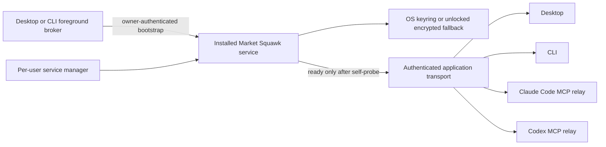
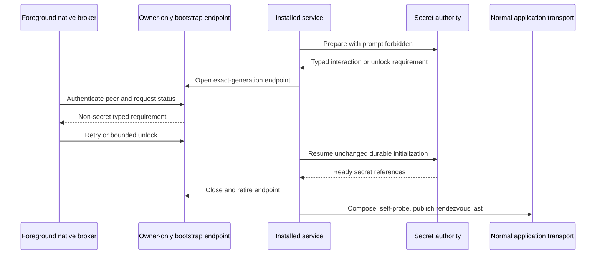

# Installed service credential bootstrap and Python integrity

| Metadata | Value |
| --- | --- |
| Document type | Maintained research decision |
| Audience | Runtime, platform, Desktop, CLI, installer, packaging, and security maintainers |
| Status | Evidence verified; implementation and exact-head platform proof required |
| Research date | 2026-08-03 |
| Evidence review | `PASS_WITH_NOTES` on 2026-08-03 |

This report preserves the durable conclusions from the decision-grade investigation into two V1
failures: an installed service that could not pass credential initialization without a foreground
prompt, and sealed Python packages whose valid external launcher paths were rejected. It records
the production boundary and selected maintained dependencies without tracking the much larger raw
research workspace.

## Contents

- [Decision](#decision)
- [Evidence method](#evidence-method)
- [Credential authority](#credential-authority)
- [Bootstrap transport](#bootstrap-transport)
- [Platform composition](#platform-composition)
- [Python installed-state authority](#python-installed-state-authority)
- [Failure and recovery rules](#failure-and-recovery-rules)
- [Implementation consequences](#implementation-consequences)
- [Known limits and refresh gates](#known-limits-and-refresh-gates)
- [Primary sources](#primary-sources)

## Decision

Market Squawk uses one logged-in-user installed service per operating-system user. The normal
Desktop, CLI, Claude Code, Codex, and MCP traffic continues through the existing authenticated
loopback application transport. Those clients share one service but **do not share a bearer
credential**; each retains an independently scoped credential.

If runtime-secret initialization cannot complete without user interaction, the service remains in
a bounded `bootstrap_required` state. It opens one short-lived native endpoint that accepts only
status, foreground-keyring retry, or encrypted-fallback unlock. The endpoint closes before normal
readiness is published. The WebView never receives endpoint identity, runtime credentials, or
secret bytes.

Python release authority has three distinct layers:

1. admitted and hashed uv, CPython, lock, and wheel artifacts;
2. wheel and installed-distribution `RECORD` validation; and
3. a product-owned closed manifest and deterministic receipt for the complete immutable installed
   generation.

Neither successful installation nor `RECORD` alone proves the final product tree.

## Evidence method

The research was frozen on 2026-08-03 and independently verified. Its fixed inventory contained
55 unique sources: 22 official-documentation records, eight maintained GitHub repositories, eight
academic or research papers, and 17 standards or reputable engineering sources. Thirteen bounded
batch reports were reconciled through four category syntheses and one final report.

The evidence audit found no unsupported material external fact and passed structural validation.
It required three clarifications that are normative here:

- relative installed `RECORD` paths resolve from the directory containing the distribution's
  `.dist-info` directory before classification under admitted roots;
- the four local clients share the service, not a bearer credential; and
- native-store probe cleanup is idempotent and recoverable, not assumed infallible.

Official specifications and pinned implementation source control behavior. Popularity and recent
activity are maintenance signals, not security proof. Architecture statements below that combine
several sources are Market Squawk decisions, not claims that one upstream library implements the
whole boundary.

## Credential authority

Constructing a keyring entry does not prove that an unattended process can later read or write it.
Credential availability is an operation result bound to the current user and session.

The service retains `SecretInteractionPolicy::Forbid`. Concrete adapters enforce that policy:

- Windows Credential Manager CRUD used by Market Squawk is treated as non-interactive.
- macOS operations under `Forbid` run inside a serialized Keychain no-interaction guard; an
  operation that would display UI returns an interaction-required result, and the process-global
  setting is restored on every exit.
- Linux Secret Service remains prompt-capable. The unattended service never follows a prompt
  object; a foreground broker may complete the prompt and request an exact retry.

An already-unlocked encrypted fallback may own a **new** planned generation only when the primary
store proves, before mutation, that it cannot complete non-interactively. Existing `SecretRef`
values remain bound to their original backend. Indeterminate mutation, conflicting state, corrupt
state, or failed reconciliation never triggers migration or blind retry.

A real capability probe uses a dedicated namespace and typed lifecycle evidence. Its cleanup is
idempotent, bounded, and recoverable. Interrupted deletion yields a typed residue state for later
reconciliation; it is not reported as clean success.

## Bootstrap transport

The selected cross-platform transport is `interprocess` 2.4.3 with its Tokio feature. It provides
safe local sockets, Unix peer credentials, Windows security-descriptor attachment, local-only
named pipes, first-instance protection, and safe named-pipe impersonation. Bounded framing uses
`tokio-util` 0.7.19 with `codec` and `rt`. Windows SID handling uses
`win-security-identifier` 0.2.0; checked UTF-16 SDDL input uses `widestring` 1.2.1.

The protocol is deliberately small:

- one fixed versioned preface;
- one length-prefixed request and one fixed typed response;
- a 64 KiB frame ceiling, with a much smaller domain limit for the unlock itself;
- exact installation, bootstrap-generation, command, and deadline binding;
- finite connections, authentication workers, queued work, aggregate bytes, and total lifetime;
- no trailing frames or generic secret-bearing JSON; and
- zeroization on every secret success and failure path.

Endpoint permissions and peer identity are admission controls, not product authorization. The
bootstrap generation and command contract provide the additional authority boundary. Malware
already executing with the same UID or Windows logon SID remains inside the declared trust
boundary; the product does not claim that a local socket defeats a same-principal compromise.

## Platform composition

| Platform | Endpoint admission | Peer proof | Required implementation detail |
| --- | --- | --- | --- |
| Linux | Filesystem socket inside validated owner-private control root; mode `0600` applied before bind | Bilateral effective-UID equality | Reject abstract sockets, blind overwrite, wrong owner, and stale/live ambiguity |
| macOS | Filesystem socket inside validated `0700` parent; set and verify node as `0600` | Bilateral effective-UID equality through kernel peer credentials | Do not claim `interprocess` pre-bind mode support on macOS; the private parent is the creation-race boundary |
| Windows | Local-only first-instance named pipe with protected DACL for the exact current logon SID | Connection-bound impersonated effective token contains that logon SID | Authenticate a fixed preface on the synchronous stream, then safely transfer the admitted handle to Tokio |

The Windows synchronous step is required because `interprocess` exposes its safe RAII
`impersonate_client()` guard on the synchronous stream, not its Tokio stream. A PID lookup is useful
for audit evidence but is not an authentication substitute. Default pipe security is prohibited:
Microsoft documents that it grants read access to Everyone and anonymous users. The duplex client
requests generic write access, so Market Squawk does not claim a smaller same-logon-session trust
boundary than the dependency and Windows APIs enforce.

## Python installed-state authority

The installed-project specification permits absolute, relative, and parent-relative `RECORD`
paths. Parent-relative rows are normal for launchers installed outside `site-packages`. Validation
must therefore be semantic rather than a blanket text rejection.

For each installed distribution, Market Squawk:

1. parses `RECORD` with strict CSV, size, row-count, encoding, and duplicate limits;
2. interprets a relative row from the directory containing that distribution's `.dist-info`
   directory;
3. normalizes the resulting identity without rebasing it onto a guessed scripts directory;
4. classifies the resolved target under an exact product-owned purelib, platlib, scripts, or
   admitted external-launcher root;
5. rejects escape, unsafe aliases, unsupported links, wrong file type, missing file, wrong digest,
   wrong size, unstable read, duplicate ownership, and unexpected files;
6. permits only explicit specification-backed hashless/generated exceptions; and
7. reconciles every installed file against the outer closed component manifest before publishing
   the immutable receipt.

The repaired external-script rule admits only an exact direct child of the release-owned Unix
`bin`, macOS `bin`, or Windows `Scripts` directory. Two distributions cannot claim the same
external launcher even when its bytes and digest match.

Installation and repair always materialize a fresh generation under an exclusive lock. Validation
finishes before an atomic active-selector change. Repair never edits the active environment in
place, and the previous verified generation remains available for rollback.

## Failure and recovery rules

- A prompt requirement is recoverable foreground work, not installed-service health success and
  not automatic package rollback.
- Normal rendezvous publication is impossible while the bootstrap endpoint exists.
- A malformed, oversized, stale-generation, wrong-owner, wrong-session, timed-out, cancelled, or
  replayed bootstrap request has no credential effect.
- A credential mutation with uncertain completion enters reconciliation and cannot fall back or
  retry blindly.
- Endpoint cleanup removes only the exact generation-owned object under the protected namespace.
- Fallback unlock material remains only in zeroizing process memory. A fallback-backed service
  restart truthfully requires foreground unlock again.
- Python activation never occurs after incomplete `RECORD`, installed-tree, or closed-manifest
  evidence.

## Implementation consequences

- Keep OS FFI inside pinned, reviewed dependencies and retain `unsafe_code = "forbid"` for Market
  Squawk crates.
- The Rust Desktop layer owns bootstrap transport. Tauri capabilities expose only a narrow
  window-scoped action and never the endpoint or runtime credential.
- `market-squawk service bootstrap` reads a secret only from a no-echo terminal or explicitly
  selected bounded standard input; never from arguments or environment variables.
- Installer activation and repair distinguish `ready`, `bootstrap_required`, and terminal failure.
- Installed smoke tests use the installed CLI path, keep the unlock process-local, and emit only
  bounded redacted early-exit diagnostics.
- Acceptance requires the same clean, pushed, unchanged commit to pass Ubuntu x64, Windows x64,
  macOS Intel, and macOS Apple Silicon installed-product jobs before the grouped review.

## Known limits and refresh gates

The 2026-08-03 evidence does not by itself approve an implementation or release. Exact versions,
licenses, advisories, source identities, and platform behavior must be refreshed at the unchanged
candidate head. The four-platform proof must exercise the Windows sync-authentication-to-Tokio
handoff and both macOS architectures.

The local endpoint does not isolate processes already running as the same OS principal. Stronger
same-principal isolation would require a separately designed sandbox, code-signing policy, or
privileged broker and is not implied by this transport.

Portable race-safe traversal of hostile Python trees remains governed by the product's existing
controlled-root and stable-file mechanisms. A platform result that cannot prove containment,
identity, and stable bytes fails closed; it cannot be converted into release evidence.

## Primary sources

Reviewed 2026-08-03:

- Apple, [`SecKeychainSetUserInteractionAllowed`](https://developer.apple.com/documentation/security/seckeychainsetuserinteractionallowed%28_%3A%29)
  and [TN3137: On Mac keychains](https://developer.apple.com/documentation/technotes/tn3137-on-mac-keychains).
- freedesktop.org, [Secret Service API](https://specifications.freedesktop.org/secret-service/latest/)
  and [Locking and unlocking](https://specifications.freedesktop.org/secret-service/latest/unlocking.html).
- Microsoft, [Named Pipe Security and Access Rights](https://learn.microsoft.com/en-us/windows/win32/ipc/named-pipe-security-and-access-rights)
  and [`ImpersonateNamedPipeClient`](https://learn.microsoft.com/en-us/windows/win32/api/namedpipeapi/nf-namedpipeapi-impersonatenamedpipeclient).
- `interprocess` 2.4.3, [crate documentation](https://docs.rs/interprocess/2.4.3/interprocess/)
  and [version-pinned source](https://github.com/kotauskas/interprocess/tree/2.4.3).
- `win-security-identifier` 0.2.0,
  [crate documentation](https://docs.rs/win-security-identifier/0.2.0/win_security_identifier/).
- `tokio-util` 0.7.19,
  [`LengthDelimitedCodec`](https://docs.rs/tokio-util/0.7.19/tokio_util/codec/length_delimited/struct.LengthDelimitedCodec.html).
- PyPA, [Recording installed projects](https://packaging.python.org/en/latest/specifications/recording-installed-packages/)
  and [Binary distribution format](https://packaging.python.org/en/latest/specifications/binary-distribution-format/).
- Astral, [uv installer reference](https://docs.astral.sh/uv/reference/installer/) and
  [Python version management](https://docs.astral.sh/uv/concepts/python-versions/).
- MITRE, [CWE-73: External Control of File Name or Path](https://cwe.mitre.org/data/definitions/73.html).

The complete 55-source inventory, category syntheses, and independent evidence audit remain in the
ignored research workspace used to produce this maintained decision.
