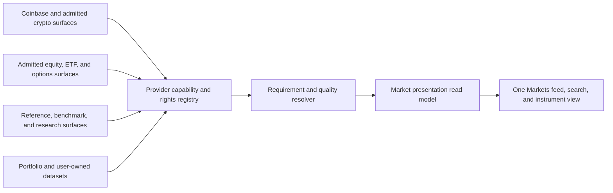

# Unified Markets Provider Ecosystem

Document type: decision research
Audience: product, architecture, data, desktop, and release engineering
Status: approved V1 design input
Research cutoff: 2026-08-08
Last substantive review: 2026-08-13

This record preserves the evidence and resulting product decision for Market Squawk's unified
Markets experience. It is based on 69 reviewed sources: 16 maintained repositories, 12 research
papers, 15 official-documentation families, and 26 regulatory, exchange, standards, and
first-party engineering source sets.

## Contents

- [Decision](#decision)
- [User experience](#user-experience)
- [Architecture](#architecture)
- [Provider posture](#provider-posture)
- [Depth and quality boundary](#depth-and-quality-boundary)
- [Implementation acceptance](#implementation-acceptance)
- [Evidence](#evidence)

## Decision

Market Squawk V1 provides one unified, non-technical Markets feed, search surface, and instrument
workspace. Users select investments and questions, not upstream providers. A bounded local resolver
chooses the richest currently admitted observation that meets the requested asset, timing, depth,
quality, and operation requirements.

The simple presentation sits above independently governed provider surfaces. Every result retains
its exact provider, product/feed, venue, coverage, depth, timestamps, quality, rights decision,
integrity generation, selection reason, and downgrade state. Market Squawk does not anonymously
blend unlike quotes, trades, books, bars, benchmark values, or reference records.

The product remains usable with no mandatory paid data service. It provides the best available
depth from the user's admitted sources, including order-level depth where a venue supplies it under
the configured account and current operation rights. It does not claim universal free order-level
coverage: the reviewed evidence does not establish a free, rights-cleared order-level feed for all
US equities, options, futures, foreign exchange, and crypto. A calculated index is a benchmark, not
a tradable order book.

## User experience

The Markets route has one primary flow:

1. A market pulse summarizes actual benchmarks, clearly labelled tradable ETF proxies, material
   portfolio movements, and source/freshness gaps.
2. A personalized feed ranks holdings, watchlists, active screens, forecasts, targets, catalysts,
   and risk changes by decision value.
3. One search field resolves stocks, ETFs, options, indexes, crypto, companies, identifiers, and
   supported research records.
4. One instrument workspace joins qualified live state with historical charts, fundamentals,
   filings, macro context, features, forecasts, buy/add/trim/sell targets, backtest evidence,
   portfolio impact, and risk.
5. Plain labels such as `Live`, `Delayed`, `Stale`, `Best available depth`, `Account required`, and
   `Stored data` answer the immediate question. An expandable **Data confidence** view exposes the
   underlying provider, venue, depth, quality, timing, coverage, and downgrade evidence.

The full admitted instrument universe is searchable locally. Live subscriptions remain bounded and
prioritize holdings, open positions and paper orders, watchlists, active candidate screens, the
currently viewed instrument, and a small benchmark set. Opening or analyzing another instrument
can temporarily promote it into the live set without streaming the entire universe continuously.

## Architecture

One long-running per-user Market Squawk service owns provider connections, subscription budgets,
caches, cursors, and recovery generations for Desktop, CLI, MCP, models, and jobs. Provider-native
actors retain their own sequencing, checksum, snapshot, reconnect, and quarantine rules. A failure
or downgrade in one source cannot mutate another source's book, quality, or provenance.

The resolver produces an explicit selection receipt containing the request requirements, eligible
and rejected candidates, selected source, policy revision, health/budget state, and any admitted
downgrade. An interactive request has priority over background refresh. Streaming, batching,
request coalescing, caching, durable cursors, provider reset headers, bounded backoff with jitter,
and circuit breaking protect provider budgets without duplicating requests across product clients.

## Provider posture

This table records the evidence-bounded selected V1 candidate set plus the historical Tradier
evaluation that informed it. Endpoint reachability alone does not admit a provider for any
operation.

| Surface | V1 role | Required presentation |
| --- | --- | --- |
| Official regulatory, macro, and history sources | Default research/reference baseline after source-specific admission | Exact publication/vintage time, rights, coverage, and revision state |
| Alpaca Basic | Optional free-account IEX equity and indicative-options display/chart candidate | `IEX only` or `Indicative`; never consolidated US or OPRA coverage |
| Tradier (historical evaluation only) | Evaluated but not selected for V1; it has no built-in profile and does not participate in activation, scheduling, fallback, workflow composition, or release gates | Not presented as an available provider or V1 candidate |
| Nasdaq Trader directories | Rights-gated reference candidate, not a price feed | Reference identity and freshness only; never quote/book quality |
| Coinbase Advanced Trade public market data | Selected no-key venue-specific crypto specialist, with Coinbase Exchange Direct remaining a distinct optional owner-enabled complement | Exact channel, venue, depth, quality, and permitted operation; never represented as non-crypto or account/trading authority |
| Kraken Spot public market data | Selected no-key venue-specific crypto specialist for the admitted pair set | Finite-depth price-level book, trade, and checksum scope; never represented as L3, consolidated crypto, or non-crypto coverage |
| Separately licensed market data | Optional coverage/depth improvement through the same adapter contracts | Exact entitlement and cost; no authority or quality bypass |

The Tradier sources below remain solely as historical research evidence. They do not place Tradier
in the selected stack or authorize product advertisement, credentials, runtime activation, or a V1
release claim.

Open-source implementations inform the architecture but do not become Market Squawk's authority.
OpenBB demonstrates provider-model registries; LEAN separates live and historical acquisition;
NautilusTrader retains protocol and venue ownership; Hummingbot demonstrates book recovery; Qlib
and Zipline separate ingestion from analytical reads; CCXT demonstrates provider capability
matrices. Any code reuse requires dependency, license, security, performance, failure-containment,
and implementation-fit review, and never grants upstream data rights.

## Depth and quality boundary

Depth and quality remain independent:

| Product label | Domain classification | Meaning |
| --- | --- | --- |
| Best quote | `MarketDepth::TopOfBook` | Best bid and ask only |
| Price-level book | `MarketDepth::PriceLevel` | Aggregated size at each supplied price |
| Order-level book | `MarketDepth::OrderLevel` | Individual visible orders where supplied |
| Benchmark | Not a market book | Calculated index or official benchmark observation |

None of these classifications grants `DirectVerified`. Immediate automated action still requires
the complete source, venue, instrument, sequence, snapshot, checksum where supported, time,
freshness, status, precision, and coverage qualification contract plus central risk approval.

## Implementation acceptance

The V1 goal is not complete until the installed product demonstrates all of the following:

- more than one bounded provider runtime can operate concurrently without shared mutable book
  state, duplicate connections, or global failure;
- the searchable universe includes the admitted multi-asset reference records and does not expose
  raw UUIDs as its primary product identity;
- the resolver returns deterministic source-selection and downgrade receipts;
- Desktop, CLI, MCP, research, screening, forecasting, backtesting, portfolio analytics, targets,
  and paper-risk workflows consume the same source-preserving market read authority;
- the Markets desktop route works as one feed/search/instrument journey without provider tabs;
- every observation exposes truthful freshness, delay, coverage, depth, and quality;
- source budgets are shared across clients and interactive requests are protected from background
  consumption;
- restart restores admitted sources, retained data, cursors, and subscriptions without duplicating
  service or provider processes; and
- one thin critical integration path proves selection, explicit downgrade, source isolation,
  restart recovery, and the non-technical desktop journey. Existing test harnesses are extended;
  no new broad or cosmetic test matrix is created.

## Evidence

Primary decision sources include:

- [OpenBB provider architecture](https://docs.openbb.co/odp/python/developer/architecture_overview)
- [OpenBB provider extensions](https://docs.openbb.co/odp/python/extensions/providers)
- [LEAN live data providers](https://www.quantconnect.com/docs/v2/lean-cli/live-trading/data-providers)
- [NautilusTrader adapter guide](https://nautilustrader.io/docs/latest/developer_guide/adapters/)
- [Hummingbot 2.12 shared services](https://hummingbot.org/release-notes/2.12.0/)
- [Alpaca market-data plans and coverage](https://docs.alpaca.markets/us/docs/about-market-data-api)
- [Alpaca redistribution guidance](https://alpaca.markets/support/redistribute-alpaca-api)
- [Tradier market data](https://docs.tradier.com/docs/market-data)
- [Tradier rate limits](https://docs.tradier.com/docs/rate-limiting)
- [Nasdaq symbol-directory definitions](https://www.nasdaqtrader.com/trader.aspx?id=symboldirdefs)
- [Nasdaq Trader terms](https://www.nasdaqtrader.com/Trader.aspx?id=CopyDisclaimMain)
- [Nasdaq US equities price list](https://www.nasdaqtrader.com/content/ProductsServices/PriceList/Nasdaq_US_Equities_Price_List_2025_2026_2027.pdf)
- [Coinbase Exchange channels](https://docs.cdp.coinbase.com/exchange/websocket-feed/channels)
- [Coinbase market-data terms](https://www.coinbase.com/legal/market_data)
- [Kraken Spot L2 book](https://docs.kraken.com/api/docs/websocket-v2/book/)
- [Kraken Global Terms](https://www.kraken.com/legal/global-terms)
- [SEC MIDAS market-data description](https://www.sec.gov/securities-topics/market-structure-analytics/midas-market-information-data-analytics-system)
- [OPRA FAQ](https://www.opraplan.com/faqs)
- [CME market-data policy center](https://www.cmegroup.com/market-data/license-data/market-data-policy-education-center.html)
- [Cboe Global Indices specification](https://cdn.cboe.com/resources/membership/CBOEStreamingIndex-pdf.pdf)

The complete audited research remains available in the local evidence workspace used for this
decision. This maintained record captures the approved decision and its direct source basis without
turning public product documentation into an implementation journal.
