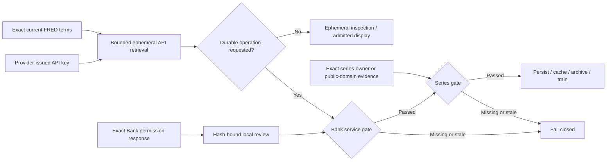

# FRED and ALFRED service-use authority — 2026-07-26

Document type: provider release-authority decision  
Audience: source, research, release, and operations maintainers  
Status: current fail-closed decision; durable FRED/ALFRED release remains blocked  
Last substantive review: 2026-07-26

## Decision

Market Squawk may support bounded ephemeral retrieval from the official FRED API while the exact
reviewed terms remain current. Durable storage, caching, archival, database incorporation, and
software or model training are not admitted by an API key, public-domain series status, or series
owner permission.

The current official FRED Services and FRED API terms expressly prohibit those durable and training
uses. Durable activation therefore requires both authorities below at the same time:

1. Exact written Federal Reserve Bank of St. Louis permission covering Market Squawk, the FRED API,
   every selected series, and every requested durable or training operation.
2. Exact public-domain or series-owner permission evidence covering the same series and operations.

The first authority must retain the exact Bank response and a separate local review decision. The
review identifies the reviewer, issuer, grantee, service, exact series, confirmed operations,
conditions, effective date, optional document-stated expiry, and a finite local revalidation
deadline. A contact-form receipt is not permission. Caller-supplied scope fields without an explicit
review bound to the raw response hash are not permission.

The reviewed `UNRATE` evidence satisfies only the second authority. It cannot authorize FRED API
storage or training. The zero-fee durable path for the same underlying unemployment series is
direct BLS acquisition of `LNS14000000`, with BLS provenance. True point-in-time unemployment
vintages additionally require the relevant archived BLS releases rather than relabeling FRED
vintages as BLS records.

## Authority flow

The shipping release admits a Bank response only when it is downloaded from an official
`stlouisfed.org` HTTPS location. Activation reacquires the exact URL through the hardened local
onboarding client and requires a byte-for-byte match with the imported response. Email headers are
not accepted as delivery authenticity evidence.

The official contact form exposes a FRED API permissions topic and is the documented request route.
It does not promise an exception and its submission acknowledgement does not pass the service gate.

## Runtime and release controls

- Use only the documented FRED API endpoints and a user-owned API key.
- Revalidate the exact terms bundle at its finite local deadline.
- Never let legacy activation requests bypass the current terms or Bank service-permission gate.
- Reject empty, duplicated, mismatched, expired, stale, or operation-incomplete evidence.
- Intersect terms, Bank permission, local review, and series-rights validity windows.
- Keep raw Bank evidence, the local review decision, exact series evidence, and activation request
  content-addressed and restart recoverable.
- Keep unrestricted export and redistribution closed unless separately and exactly authorized.

FRED/ALFRED remains a mandatory V1 capability and a release blocker. It is complete only after a
real official-API path demonstrates retrieval, revision preservation, durable publication, restart
query recovery, and analytics or modeling use under both valid authority gates. Until exact written
Bank permission exists, no durable FRED/ALFRED proof can pass. Direct BLS is the zero-fee working
route for the unemployment-data release predicate.

## Official source basis

- [FRED legal notices and full terms](https://fred.stlouisfed.org/legal/) — the FRED Services and
  API-specific storage, caching, archival, database-incorporation, software-development, and
  model-training prohibitions; reviewed 2026-07-26.
- [FRED API terms of use](https://fred.stlouisfed.org/docs/api/terms_of_use.html) — incorporated API
  terms and third-party series-owner boundary; reviewed 2026-07-26.
- [FRED permissions contact route](https://fred.stlouisfed.org/contactus/) — official request route;
  a request or receipt is not permission; reviewed 2026-07-26.
- [2024 FRED terms-update notice](https://news.research.stlouisfed.org/2024/06/weve-updated-our-terms-of-use-action-requested/)
  — official notice directing users to review the changed terms; reviewed 2026-07-26.
- [BLS copyright information](https://www.bls.gov/opub/copyright-information.htm) — direct BLS
  public-domain and attribution boundary; reviewed 2026-07-26.
- [BLS public data API](https://www.bls.gov/developers/) — direct zero-fee programmatic source for
  `LNS14000000`; reviewed 2026-07-26.

The 2021 [“Ethical Use of Data With FRED” article](https://www.stlouisfed.org/publications/page-one-economics/2021/10/15/ethical-use-of-data-with-fred)
is retained only as historical context. It recommends the API instead of scraping, but does not
override the current legal terms and is not admission authority.
