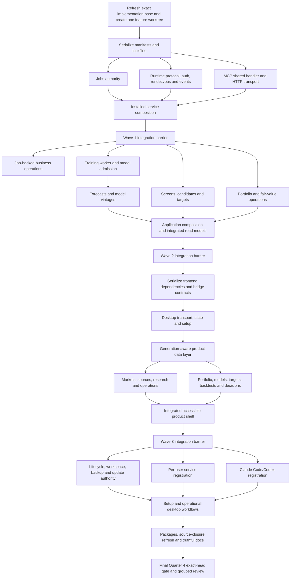
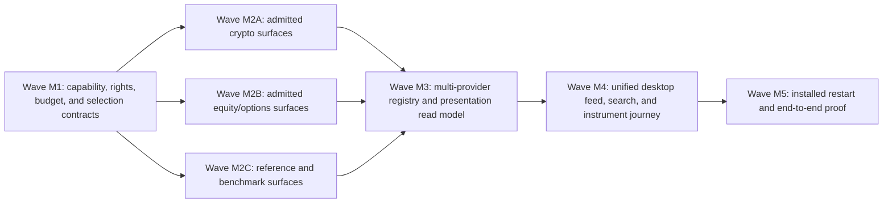

# Market Squawk V1 Installed Product Experience Implementation Plan

> **For agentic workers:** REQUIRED SUB-SKILL: Use
> `superpowers:subagent-driven-development` to execute this plan inside the single feature worktree.
> Use `superpowers:executing-plans` for each assigned lane, `superpowers:systematic-debugging` for
> failures, and `superpowers:verification-before-completion` before every barrier or completion
> claim. Steps use
> checkbox (`- [ ]`) syntax for tracked execution.

**Goal:** Deliver the complete owner-testable Market Squawk V1 installed product: one shared
per-user service, concurrent Desktop/CLI/Claude Code/Codex access, durable long-running work,
curated decision workflows, multi-horizon forecasts and targets, complete setup and lifecycle
operations, and identical native/curl installation contents.

**Architecture:** Move `LocalProduct` ownership into one authenticated per-user service while
preserving the existing application, source, data, model, portfolio, valuation, risk, paper, and
execution authorities. Desktop and CLI become typed service clients. RMCP provides the shared
Streamable HTTP MCP endpoint; stateless stdio relays provide secure client compatibility without
duplicating the heavy product runtime. Durable jobs own training, backtest, ingest, backup, update,
and recovery lifecycles independently of client connections. The Tauri WebView receives only
validated product read models and narrow commands through Rust.

**Tech Stack:** Rust 1.97.1 and Edition 2024; Tokio 1.53.1/Tokio-util 0.7.19; Axum
0.8.9/Tower 0.5.3/Tower HTTP 0.7.0/Hyper 1; RMCP 3.1 with explicit stable MCP `2026-07-28`;
SQLite/rusqlite; Arrow 58.3, Parquet 58.3, and DataFusion 54; Tauri 2.11; React 19; TanStack Query
5.101.4 and Table 8.21.3; Lightweight Charts 5.2.0 and Recharts 3.10.1; Python 3.14 managed by uv; PyArrow 25;
scikit-learn 1.9.0; MAPIE 1.4.1; ONNX 1.22.0 and skl2onnx 1.20.0; PyPA packaging 26.2; the existing
native/tract/ONNX Runtime
inference paths; and the existing verified complete-release installer.

## Global Constraints

- Approved design:
  `docs/superpowers/specs/2026-08-01-market-squawk-v1-installed-product-experience-design.md`.
- Frozen audit base: commit `4d8674d00becf9d1e39fd3bb570ff32613101c57`, tree
  `efb462bd309d2d4a38ab1b626a8dea63b6e9b0ad`.
- The frozen base is a planning anchor, not implementation or release approval. Task 0 must
  refresh every named path, signature, dependency, lock, package contract, and open finding against
  the exact pushed implementation base before code changes.
- Commit and push this plan on `release/market-squawk-v0.1.0`. All implementation then occurs on
  exactly one new branch, `feature/v1-installed-product-experience`, created from the exact pushed
  release head that contains this plan. Use exactly one worktree,
  `.worktrees/v1-installed-product-experience`.
- Do not create task branches, agent branches, nested worktrees, or per-lane target directories.
  Parallel workers edit the single feature worktree only when the DAG declares their paths
  disjoint. Only the integration owner stages, commits, pushes, changes manifests/lockfiles, or
  resolves cross-lane conflicts.
- Serialize `Cargo.toml`, `Cargo.lock`, every package manifest, `package.json`, `pnpm-lock.yaml`,
  Python locks/wheel manifests, the workspace-boundary map, application composition, job-runner
  registries, installer/release manifests and build scripts, shared route/test registries, CI,
  risk/execution authority, and release evidence. These files belong only to the integration owner.
- The service owns exactly one active `LocalProduct`, `Application`, source/live authority,
  model/admission authority, paper controller, risk/dispatcher path, artifact authority, audit sink,
  job authority, and active workspace. Transports, clients, relays, jobs, and UI code never
  mint or bypass these authorities.
- Preserve the current working ingestion, point-in-time, Arrow/Parquet/DataFusion, finance,
  portfolio, fair-value, backtesting, paper, risk, execution, native inference, and ONNX inference
  implementations. Extend their public application seams; do not replace them with parallel stacks.
- Python remains outside the live event-to-action path. Python workers train and research through a
  versioned, bounded, cancellable process protocol. Rust remains the final model admission authority.
- Market and investment forecasts are research evidence, never `DirectVerified` execution evidence.
  Forecasts and target sets must carry model/data/version/time/uncertainty/approval evidence and must
  never become orders without the existing strategy, pre-trade risk, one-use approval, and execution
  dispatch path.
- Keep tests thin and critical. Extend existing unit modules or consolidated harnesses. Do not add
  snapshot suites, prose tests, documentation-checker scripts, one-test integration executables,
  raw UI fixture matrices, or tests that merely repeat type/schema validation.
- Use `rg`/`rg --files` for repository search. Do not add wrapper scripts whose only purpose is to
  search prose or run one existing command.
- Before adding any dependency, refresh its stable version, maintenance, license, MSRV/runtime
  support, supply-chain posture, transitive cost, and fit from primary sources. Pin exact runtime and
  release-critical versions. Record each accepted or rejected dependency in the implementation
  commit and update lock/evidence files atomically.
- Set `CARGO_INCREMENTAL=0` for agent, CI, Wave, and approval gates. Do not share Cargo targets
  across worktree paths. Record target size at each wave; stop new compiles at 20 GiB and clean only
  completed/generated targets when the budget is crossed.
- Historical delivery Quarters 1-3 are already accepted. This plan is remediation inside the one
  existing final Quarter 4; it does not restart quarter numbering or create another review cycle.
  Run focused lane gates and independent implementation reviews at three internal Wave barriers.
  Run the repository-owned complete release-evidence gate and one fresh grouped Quarter 4 review
  only on the final clean, unchanged candidate. A re-review closes that Quarter 4's findings; it is
  remediation, not Quarter 5. Every substantiated Critical, Important, and Minor finding blocks
  progression.
- Before every freeze, require empty `git status --porcelain`, record `HEAD` and `HEAD^{tree}`, and
  prove the feature head equals its origin. Commit all tracked product, documentation, lock, and
  evidence-input changes before that freeze. Reviews and post-freeze status reporting are external
  GitHub issue/PR/project records only. Any later tracked change creates a new head and repeats the
  affected gates and exact-head review.
- Public publication, signing with paid credentials, creating a GitHub Release, and merging to
  `main` are outside this plan. V1 feature completion, local/native package construction, install
  smoke evidence, and an owner-testable feature-branch candidate are in scope.

---

## Research-backed dependency decisions

The following choices were refreshed as of 2026-08-01. Task 0 repeats the freshness check before
lockfile mutation.

| Capability | Decision | Reason and source |
| --- | --- | --- |
| Loopback application API | Add exact Axum 0.8.9, Tower 0.5.3, and Tower HTTP 0.7.0 to the existing exact Hyper stack | Axum is Tokio-maintained, composes with Tower, provides typed routing/extractors/SSE, and can nest RMCP's Tower service. Tower HTTP supplies the admitted body/request-ID/sensitive-header/trace/validation policies. Use minimal direct features and omit the dependency if production code does not install its layers. [Axum 0.8.9](https://github.com/tokio-rs/axum/releases/tag/axum-v0.8.9), [Tower 0.5.3](https://github.com/tower-rs/tower/releases/tag/tower-0.5.3), [Tower HTTP 0.7.0](https://github.com/tower-rs/tower-http/releases/tag/tower-http-0.7.0) |
| MCP | Upgrade to exact RMCP 3.1.0 behind a narrow stable-2026 protocol facade | RMCP is the maintained official Rust SDK and supplies the protocol transport/metadata machinery. Market Squawk explicitly selects `V_2026_07_28`, a singleton admitted-version set, stateless metadata, modern POST-only HTTP, and closed Host/Origin/auth/limit policy. It does not use RMCP's legacy/default lifecycle, implicit protocol sessions, GET/DELETE, or resumable `Last-Event-ID` state. Named-client legacy compatibility may exist only at the stateless stdio relay boundary. [RMCP 3.1.0](https://github.com/modelcontextprotocol/rust-sdk/releases/tag/rmcp-v3.1.0), [stable MCP 2026-07-28](https://modelcontextprotocol.io/specification/2026-07-28/basic), [Streamable HTTP](https://modelcontextprotocol.io/specification/2026-07-28/basic/transports/streamable-http) |
| Durable jobs | Build one domain-specific authority over existing Tokio, SQLite, `CancellationToken`, `ProgressReporter`, and process supervision | Effectum is stable but its generic state model does not cover Market Squawk's authority snapshots, confirmation, immutable outputs, progress generations, and recovery rules. Apalis SQLite remained release-candidate quality during research. Adding either would create a second job authority. [Effectum](https://docs.rs/effectum/latest/effectum/), [Tokio TaskTracker](https://docs.rs/tokio-util/latest/tokio_util/task/struct.TaskTracker.html), [SQLite transactions](https://www.sqlite.org/lang_transaction.html), [SQLite WAL](https://sqlite.org/wal.html) |
| Desktop server state | Add exact TanStack Query 5.101.4 and TanStack Table 8.21.3 | Query supplies cancellation, invalidation, bounded caching, mutation state, and reconnect/refetch semantics; Table supplies accessible headless table state without replacing the existing visual system. Do not adopt Table 9 beta. [TanStack Query](https://tanstack.com/query/v5/docs/framework/react/guides/queries), [TanStack Table](https://tanstack.com/table/latest/docs/introduction) |
| Market/predictive charts | Add exact Lightweight Charts 5.2.0, Recharts 3.10.1, and `react-is` 19.2.8 | Lightweight Charts handles financial time series efficiently. Recharts covers portfolio/risk/scenario/attribution charts using React-native composition. Keep chart data bounded and provide equivalent text/tables. [Lightweight Charts](https://tradingview.github.io/lightweight-charts/docs/5.1), [Recharts](https://recharts.github.io/), [WAI complex images](https://www.w3.org/WAI/tutorials/images/complex/) |
| Native desktop integration | Add exact Rust `tauri-plugin-dialog` 2.7.2; use Tauri `Channel` and current capability/CSP controls | The Rust side opens files and returns opaque staged tickets; the WebView never receives ambient filesystem authority or service credentials. The JS dialog binding is unnecessary and is not added. [Tauri dialog](https://v2.tauri.app/plugin/dialog/), [Tauri Channel](https://docs.rs/tauri/latest/tauri/ipc/struct.Channel.html), [Tauri capabilities](https://v2.tauri.app/security/capabilities/) |
| Forecasting/training | Add exact scikit-learn 1.9.0, MAPIE 1.4.1, skl2onnx 1.20.0, ONNX 1.22.0, and packaging 26.2 to the four-platform Python closure; implement bounded horizon orchestration over maintained primitives | `skforecast` 0.23.0 is rejected because its mandatory Numba/llvmlite chain has no CPython 3.14 Intel-macOS wheel. MLForecast is the best ready-made reduction framework but expands the closure to 26-28 distributions and introduces unnecessary Optuna/Tqdm licensing and runtime surface. Scikit-learn supplies estimator, direct/multi-output/chained, time-split, and quantile primitives. MAPIE adds the explicitly required time-series conformal calibration path with only one pure-Python package beyond that graph; its method assumptions and realized coverage remain visible evidence, never a guarantee. Market Squawk owns only domain-specific lag/horizon/cutoff/leakage/backtest coordination. Use packaging's public wheel-tag APIs instead of filename substrings. [scikit-learn 1.9.0](https://pypi.org/project/scikit-learn/), [MAPIE 1.4.1](https://pypi.org/project/mapie/), [skl2onnx 1.20.0](https://pypi.org/project/skl2onnx/), [ONNX 1.22.0](https://pypi.org/project/onnx/), [packaging 26.2](https://pypi.org/project/packaging/) |
| Python dependency lock | Retain the exact sealed `requirements.lock`/wheel manifests and use pinned uv's universal `pip compile --generate-hashes` plus strict `pip sync`; do not introduce `uv.lock` | uv officially supports universal resolution, hash generation, exact `requirements.txt` output, target-platform resolution, and strict environment synchronization. Keeping one shipping lock authority avoids disagreement with `build_python_release.py`. [uv locking](https://docs.astral.sh/uv/pip/compile/), [uv resolution](https://docs.astral.sh/uv/concepts/resolution/), [uv command reference](https://docs.astral.sh/uv/reference/cli/) |
| Search | Reuse `cmdk`, bounded SQLite/DataFusion queries, and in-memory indexing; do not add Tantivy/Nucleo initially | The product corpus is structured, authority-backed, and already queryable. A second persistent search index would duplicate storage, point-in-time, and recovery responsibilities. Add an external index only if measured V1 lookup acceptance fails after the structured implementation. [cmdk](https://github.com/dip/cmdk), [DataFusion SQL](https://datafusion.apache.org/library-user-guide/using-the-sql-api.html) |
| Backup/update | Reuse `AnalyticalBackupService`, immutable installer generations, existing release hashes/attestations, and platform-native lifecycle; implement TUF-equivalent metadata admission in that authority | Do not add a competing repository engine, but do implement separated root/targets/snapshot/timestamp key roles, threshold verification, metadata expiry, monotonic version admission, consistent snapshots, and rollback/freeze protection before installer activation. Program-generation rollback remains a separate recovery feature. [SQLite backup](https://www.sqlite.org/backup.html), [TUF specification](https://theupdateframework.github.io/specification/latest/), [SLSA 1.2](https://slsa.dev/spec/v1.2/) |
| Per-user startup | Implement closed platform adapters for macOS LaunchAgent/modern registration where supported, Linux systemd user units, and Windows current-user scheduled startup | The heavy service is not a GUI autostart concern. Registration must be per user, unprivileged, health-checked, repairable, and removed with program uninstall. [Apple background tasks](https://support.apple.com/guide/deployment/manage-login-items-and-background-tasks-on-mac-depdca572563/web), [systemd.service](https://www.freedesktop.org/software/systemd/man/latest/systemd.service.html), [Windows installation context](https://learn.microsoft.com/en-us/windows/win32/msi/installation-context) |
| Client registration | Use each installed client's official CLI and an owned stateless relay entry by default | `codex mcp add` and Claude's MCP command own their configuration formats. The relay reads a distinct credential from the OS secret store and connects to the one shared service, so no bearer is placed in argv/config and no duplicate heavy backend is created. Direct HTTP remains available only when the client can protect/inject its credential. [Codex MCP](https://developers.openai.com/codex/mcp/), [Claude Code MCP](https://docs.anthropic.com/en/docs/claude-code/mcp) |

The forecast design follows calibrated-probability and interval evidence, not an unqualified line:
[calibration and sharpness](https://academic.oup.com/jrsssb/article/69/2/243/7109375),
[conformalized quantile regression](https://proceedings.neurips.cc/paper_files/paper/2019/hash/5103c3584b063c431bd1268e9b5e76fb-Abstract.html),
[adaptive conformal inference](https://papers.neurips.cc/paper_files/paper/2021/hash/0d441de75945e5acbc865406fc9a2559-Abstract.html),
and [backtest-overfitting control](https://doi.org/10.3905/jfds.2019.1.064).

---

## File and authority map

| Path | Responsibility after this plan |
| --- | --- |
| `crates/market-squawk-jobs/` | Transport-neutral durable job identities, states, events, repository, scheduler, cancellation, recovery, and controlled outputs |
| `crates/market-squawk-runtime/` | Authority-neutral app protocol, authenticated loopback application router/client, rendezvous, credential registry, event hub, replay guard, and runtime limits |
| `crates/market-squawk-mcp/` | Shared RMCP handler/request factory, stateless Streamable HTTP service, stdio relay adapter, MCP resources/job projection, and MCP-specific limits/audit |
| `apps/market-squawk/src/service/` | Installed-service composition that owns one `LocalProduct`, request dispatch, workspace/lifecycle coordination, and shutdown |
| `apps/market-squawk/src/jobs/` | Application-specific job runners for training, backtest, ingestion, backup, update, recovery, forecasts, and scenarios |
| `apps/market-squawk/src/application/` | Typed Job/Analysis/Model/Portfolio/FairValue/Source operations and read models over existing authorities |
| `crates/market-squawk-modeling/` | Forecast/model bundle schema, admitted multi-horizon output, calibrated interval metadata, native/ONNX inference contracts |
| `python/market_squawk/` | Versioned worker event protocol, research/training/forecasting implementation, deterministic evaluation and ONNX export |
| `crates/market-squawk-analytics/` | Pure screening/candidate metrics, financial calculations, forecast evaluation, and outcome kernels |
| `crates/market-squawk-decisions/` | Immutable saved screens, candidate funnels, dossiers, investment-target revisions, review/invalidation policy, and evidence indexes |
| `apps/market-squawk-desktop/src-tauri/` | Native service client, credential custody, file tickets, client registration/lifecycle bridges, window-scoped typed channels |
| `apps/market-squawk-desktop/src/` | Curated dashboard, setup, lookup, decision workspaces, operations, MCP, update, backup, logs, and settings |
| `apps/market-squawk-installer/` | Verified service/relay component admission, platform registration, activation health, repair, rollback, and removal |
| `scripts/build_complete_release.py` and release manifests | Exact four-platform closure containing Desktop, service, CLI, relay, workers, Python, uv, helpers, and installer |
| `docs/` and `README.md` | Truthful user/operations/reference documentation for only working V1 behavior |

### Required core contracts

These names are the intended seams. Task 0 may adjust a name only when the accepted-head API moved;
the invariant and owner must remain unchanged.

```rust
pub struct JobId(pub Uuid);
pub struct JobGeneration(pub NonZeroU64);
pub struct JobEventSequence(pub u64);

pub enum JobState {
    Queued,
    Preparing,
    Running,
    AwaitingConfirmation,
    Cancelling,
    Completed,
    Failed,
    Cancelled,
    Interrupted,
    Recovering,
}

pub trait JobRepository: Send + Sync {
    async fn create(&self, spec: &AdmittedJobSpec) -> Result<JobSnapshot, JobRepositoryError>;
    async fn append(
        &self,
        expected: JobEventSequence,
        event: JobEvent,
    ) -> Result<JobSnapshot, JobRepositoryError>;
    async fn get(&self, id: JobId) -> Result<JobSnapshot, JobRepositoryError>;
    async fn events_after(
        &self,
        id: JobId,
        after: JobEventSequence,
        limits: EventPageLimits,
    ) -> Result<JobEventPage, JobRepositoryError>;
    async fn recover_nonterminal(&self) -> Result<Box<[JobSnapshot]>, JobRepositoryError>;
}

pub trait JobRunner: Send + Sync {
    fn kind(&self) -> JobKind;
    async fn run(&self, context: JobRunContext) -> Result<JobCompletion, JobRunError>;
    fn recover(&self, snapshot: &JobSnapshot) -> JobRecoveryDisposition;
}
```

```rust
pub const APP_PROTOCOL_VERSION: u16 = 1;

pub struct AppRequestEnvelope {
    pub protocol_version: u16,
    pub installation_id: InstallationId,
    pub service_generation: ServiceGeneration,
    pub workspace_id: WorkspaceId,
    pub client_id: ClientId,
    pub request_id: RequestId,
    pub correlation_id: CorrelationId,
    pub deadline_unix_nanos: i64,
    pub operation: Box<str>,
    pub arguments: serde_json::Map<String, serde_json::Value>,
}

#[async_trait]
pub trait ApplicationClient: Send + Sync {
    async fn invoke(
        &self,
        request: AppRequestEnvelope,
    ) -> Result<AppResponseEnvelope, AppClientError>;
    async fn stage_input(
        &self,
        input: AdmittedClientInput,
    ) -> Result<InputTicket, AppClientError>;
    async fn watch_events(
        &self,
        cursor: EventCursor,
        limits: EventPageLimits,
    ) -> Result<EventPage, AppClientError>;
}
```

```rust
pub struct ForecastPath {
    pub instrument_id: InstrumentId,
    pub as_of: DateTime<Utc>,
    pub available_at: DateTime<Utc>,
    pub horizon: ForecastHorizon,
    pub points: Box<[ForecastPoint]>,
    pub model_bundle: ModelBundleIdentity,
    pub feature_set: FeatureSetIdentity,
    pub dataset: DatasetIdentity,
    pub calibration: CalibrationEvidence,
    pub quality: DataQuality,
}

pub struct ForecastPoint {
    pub target_at: DateTime<Utc>,
    pub central: Decimal,
    pub interval_50: ForecastInterval,
    pub interval_80: ForecastInterval,
    pub interval_95: ForecastInterval,
}

pub struct InvestmentTargetSet {
    pub id: InvestmentTargetSetId,
    pub version: NonZeroU64,
    pub instrument_id: InstrumentId,
    pub portfolio_id: Option<PortfolioId>,
    pub account_id: Option<AccountId>,
    pub created_by: PrincipalId,
    pub created_at: DateTime<Utc>,
    pub effective_at: DateTime<Utc>,
    pub as_of: DateTime<Utc>,
    pub source_mark_at: DateTime<Utc>,
    pub currency: Currency,
    pub reference_mark: TargetReferenceMark,
    pub method: TargetMethod,
    pub assumptions: Box<[TargetAssumption]>,
    pub decision_context: DecisionContextReference,
    pub horizon: ForecastHorizon,
    pub expires_at: DateTime<Utc>,
    pub reviewed_at: Option<DateTime<Utc>>,
    pub supersedes: Option<InvestmentTargetSetId>,
    pub cases: TargetCases,
    pub entry: TargetRange,
    pub trim: TargetRange,
    pub exit: TargetRange,
    pub invalidation: Box<[TargetCondition]>,
    pub catalysts: Box<[TargetCatalyst]>,
    pub review_triggers: Box<[TargetCondition]>,
    pub risks: Box<[TargetRisk]>,
    pub evidence: TargetEvidenceSet,
    pub model_evidence: Option<ForecastReference>,
    pub fair_value_evidence: Option<FairValueEvidenceReference>,
    pub status: TargetSetStatus,
    pub review_reason: Option<TargetReviewReason>,
    pub override_record: Option<TargetOverride>,
    pub approval: Option<TargetApproval>,
    pub warnings: Box<[TargetWarning]>,
    pub ruleset_version: TargetRulesetVersion,
}

pub struct TargetCases {
    pub add: TargetCase,
    pub base: TargetCase,
    pub upside: TargetCase,
    pub downside: TargetCase,
}
```

---

## Dependency DAG and parallel ownership



| Wave | Parallel lanes after barrier | Exclusive file ownership | Start barrier | Integration order |
| --- | --- | --- | --- | --- |
| 0 | Integration owner only | Root/package manifests, all locks, plan refresh record | Exact clean pushed plan head | Refresh, branch/worktree, dependency freeze |
| 1 | Jobs; runtime; MCP | `market-squawk-jobs`; `market-squawk-runtime`; `market-squawk-mcp` | Wave 0 dependency commit | Jobs -> runtime -> MCP -> service composition |
| 2 | Job runners; training/modeling; decision domain; portfolio/valuation | Disjoint task-owned modules; integration owner owns all application registries/composition | Wave 1 integrated | Job runners, training, decision, and portfolio lanes in parallel; training -> forecast; all -> application composition |
| 3 | Desktop bridge, state, operational pages, decision pages | Task 15 native bridge; Task 16 shared state; Tasks 17-18 disjoint feature roots | Wave 2 integrated and frontend lock committed | Bridge -> shared state -> pages -> owner-owned routes/tests |
| 4 | Lifecycle, installer, MCP clients, setup, packages/docs | Disjoint backend/platform roots; integration owner owns operations registry, routes, build scripts/manifests | Wave 3 integrated | Tasks 21-23 -> Task 24 -> Task 25 -> final Quarter 4 gate |

No worker in a parallel lane may modify `Cargo.lock`, `pnpm-lock.yaml`, root manifests, route/test
composition, application composition or contract registries, job-runner registries, installer
manifest/build-script closure, CI, release evidence, or another lane's files. Workers return patches
and focused-gate evidence; the integration owner alone reconciles those shared seams at each named
barrier and commits in dependency order.

### Task patch and commit protocol

After a lane's focused gate passes, the worker stops and reports exact changed paths and evidence;
the worker does not stage or commit. At the next declared integration barrier, the integration owner
refreshes the feature head, reviews the patch for ownership/authority/ripple effects, stages only that
task's paths, commits it, and pushes the wave after all dependent commits are assembled. Use these
commit subjects so history remains product/feature based rather than agent/workspace based:

| Task | Integration-owner commit subject |
| --- | --- |
| 2 | `feat(jobs): add durable operation authority` |
| 3 | `feat(runtime): add authenticated per-user application protocol` |
| 4 | `feat(mcp): serve stateless requests and client relays` |
| 5 | `feat(service): centralize installed product ownership` |
| 8 | `feat(application): expose durable product jobs` |
| 9 | `feat(modeling): add governed training worker lifecycle` |
| 10 | `feat(modeling): add calibrated multi-horizon forecasts` |
| 11 | `feat(decisions): add screens candidates and target governance` |
| 12 | `feat(application): close portfolio valuation source and analysis workflows` |
| 15 | `feat(desktop): add native shared-service bridge` |
| 16 | `feat(desktop): add generation-aware product state` |
| 17 | `feat(desktop): add market research source and operations workspaces` |
| 18 | `feat(desktop): add investment decision workspaces` |
| 19 | `feat(desktop): assemble v1 navigation and critical journeys` |
| 21 | `feat(operations): add governed product lifecycle services` |
| 22 | `feat(installer): install and supervise the per-user service` |
| 23 | `feat(mcp): connect Claude Code and Codex to the shared service` |
| 24 | `feat(desktop): complete setup and lifecycle operations` |
| 25 | `docs(v1): document the complete installed product` |

Tasks 1, 7, and 14 already contain their serialized build/lock commit. All tracked evidence inputs
must be committed before an exact-head freeze. No evidence-only commit may follow a reviewed head;
review results are recorded in the draft PR/project externally. Remediation uses the affected
product commit scope and repeats the affected barrier or final candidate gate.

---

## Stage 0 — Exact-base refresh and one-branch bootstrap

### Task 0: Refresh the plan and create the only implementation worktree

**Files:**

- Read: `docs/project-memory.md`
- Read: the approved design and this plan
- Read: all paths named in the file/authority map
- No product modification before the refresh record passes

- [ ] **Step 1: Prove the release branch is the exact pushed plan head**

  ```bash
  df -h .
  du -sh target .worktrees 2>/dev/null || true
  pgrep -alf 'cargo|rustc|rustfmt|clippy|pnpm|node|uv|build_complete_release|build_python_release' || true
  git fetch origin release/market-squawk-v0.1.0
  test -z "$(git status --porcelain)"
  git rev-parse HEAD
  git rev-parse origin/release/market-squawk-v0.1.0
  git rev-parse HEAD^{tree}
  ```

  Expected: empty status and identical local/remote commits. Record the exact commit/tree as
  `IMPLEMENTATION_BASE`; it must contain this plan and approved design.

- [ ] **Step 2: Refresh repository seams and external dependencies**

  Use `rg` to verify every named file/type/operation and compare the base to audit commit
  `4d8674d`. Re-run the approved design's capability-to-dashboard map against the current delivery
  ledger, open GitHub findings, and application/CLI/MCP registry. Inspect current clean-system
  packaging, per-user service, startup, client registration, repair, rollback, removal, and
  workspace-switch behavior on each platform abstraction. Refresh exact stable library versions
  and four-platform/Python 3.14 wheels from the primary links above. Record every changed seam,
  stale baseline claim, uncovered capability, and rejected version in the Task 1 dependency note
  and tracking issue; do not silently reinterpret the design or begin parallel work with an
  unresolved refresh finding. In particular, resolve the repository's RMCP 2.2 line against the
  current MCP transport/protocol specification before locking that dependency, and either prove the
  supported macOS 12 per-user service mechanism or explicitly revise the supported operating-system
  floor before native-package approval.

- [ ] **Step 3: Create one product feature worktree**

  ```bash
  git worktree add -b feature/v1-installed-product-experience \
    .worktrees/v1-installed-product-experience "$IMPLEMENTATION_BASE"
  git -C .worktrees/v1-installed-product-experience status --short --branch
  ```

  Expected: exactly one clean feature branch/worktree. All subsequent commands run there.

- [ ] **Step 4: Record build-storage baseline**

  ```bash
  df -h .worktrees/v1-installed-product-experience
  du -sh .worktrees/v1-installed-product-experience/target 2>/dev/null || true
  git worktree list --porcelain
  pgrep -alf 'cargo|rustc|rustfmt|clippy|pnpm|node|uv|build_complete_release|build_python_release' || true
  ```

  Do not create `target/agent-shared` or set a cross-worktree `CARGO_TARGET_DIR`. Do not start a
  heavy build while another Cargo, native-package, uv, or frontend dependency build owns the host.

### Task 1: Freeze manifests, dependencies, crate boundaries, and package identities

**Files:**

- Modify: `Cargo.toml`
- Modify: `Cargo.lock`
- Create: `crates/market-squawk-jobs/Cargo.toml`
- Create: `crates/market-squawk-jobs/src/lib.rs`
- Create: `crates/market-squawk-jobs/src/contracts.rs`
- Create: `crates/market-squawk-runtime/Cargo.toml`
- Create: `crates/market-squawk-runtime/src/lib.rs`
- Create: `crates/market-squawk-runtime/src/contracts.rs`
- Modify: `crates/market-squawk-mcp/Cargo.toml`
- Modify: `crates/market-squawk-mcp/src/server.rs`
- Modify: `crates/market-squawk-mcp/src/framing.rs`
- Modify: `crates/market-squawk-mcp/src/isolation.rs`
- Modify: affected existing `crates/market-squawk-mcp/tests/` fixtures and snapshots
- Modify: `apps/market-squawk/Cargo.toml`
- Modify: `apps/market-squawk-desktop/src-tauri/Cargo.toml`
- Modify: `apps/market-squawk-installer/Cargo.toml`
- Modify: `scripts/check_workspace_boundaries.py`
- Create: `docs/research/2026-08-01-v1-dependency-admission.md`

**Produces:** one reviewed dependency closure and non-cyclic crate graph before parallel code work.

- [ ] **Step 1: Write the dependency admission note**

  For every new direct dependency, record exact selected version, latest-stable check date, license,
  maintenance signal, MSRV/Python/platform support, transitive cost, intended module, security
  considerations, and the rejected alternatives. Include direct links from the decision table.
  Mark rolling sources with an implementation refresh date. Do not copy the temporary research
  inventory into tracked docs.

- [ ] **Step 2: Add crate/package identities and exact dependency features**

  Add `market-squawk-jobs` and `market-squawk-runtime` as workspace dependencies. Upgrade RMCP to
  exact 3.1.0 and enable only the server, stdio, and Streamable HTTP server features actually used.
  The relay reuses `ApplicationClient`; do not add RMCP HTTP-client/Reqwest, OAuth, or TLS features.
  Add Axum/Tower/Tower HTTP features required for typed JSON, body limits, SSE, trace-safe request
  IDs, closed request validation, and graceful shutdown. Add the official
  Tauri dialog plugin without filesystem/shell plugins. Keep all workspace metadata/lints inherited.
  Add real documented crate roots and their smallest closed contract modules so both crates compile
  without placeholders. Tasks 2 and 3 extend these files rather than creating them.

  Migrate the existing RMCP 2.2 source boundary in this serialized task: adopt the 3.1 response and
  metadata types, remove `ProtocolVersion::LATEST`, explicitly select `V_2026_07_28`, override the
  server's supported versions to the admitted singleton, and preserve the existing bounded tool,
  framing, isolation, and stdio behavior. Do not advertise optional MCP capabilities that are not
  implemented. Configure the shared HTTP seam as modern, stateless, and POST-only; legacy client
  lifecycle handling belongs only to the later named-client relay adapter.

- [ ] **Step 3: Confirm the crate DAG has no authority cycle**

  The allowed direction is:

  ```text
  domain/platform/services -> jobs
  domain/platform/services/jobs -> runtime
  domain/platform/services/jobs/runtime -> mcp
  domain engines/runtime/mcp -> market-squawk application composition
  market-squawk runtime client -> desktop Rust bridge
  ```

  Neither `jobs`, `runtime`, nor `mcp` may depend on the `market-squawk` application package.
  `runtime` must not depend on `mcp`; the application composition mounts the MCP service beside the
  runtime's app router. This permits the stateless MCP relay to reuse the runtime client without a
  cycle.

  Atomically add `jobs` and `runtime` to `scripts/check_workspace_boundaries.py`'s exact package map
  and allowed local-dependency graph. The direct checker execution below is the acceptance gate; do
  not add a new policy test file or wrapper merely to repeat its result.

- [ ] **Step 4: Resolve and inspect the Rust lock once**

  ```bash
  CARGO_INCREMENTAL=0 cargo check -p market-squawk-jobs -p market-squawk-runtime \
    -p market-squawk-mcp
  CARGO_INCREMENTAL=0 cargo check -p market-squawk-jobs -p market-squawk-runtime \
    -p market-squawk-mcp --locked
  CARGO_INCREMENTAL=0 cargo test -p market-squawk-mcp --test lifecycle_protocol --locked
  CARGO_INCREMENTAL=0 cargo test -p market-squawk-mcp --test hostile_boundaries --locked
  cargo tree -p market-squawk-runtime --edges normal
  cargo deny check
  python3 scripts/check_workspace_boundaries.py
  ```

  The first check is the sole lock resolution. The second and every later Cargo command use
  `--locked`. No placeholder API or empty crate is permitted.

- [ ] **Step 5: Commit and push the serialized boundary**

  ```bash
  git add Cargo.toml Cargo.lock crates/market-squawk-jobs crates/market-squawk-runtime \
    crates/market-squawk-mcp apps/market-squawk/Cargo.toml \
    apps/market-squawk-desktop/src-tauri/Cargo.toml \
    apps/market-squawk-installer/Cargo.toml \
    scripts/check_workspace_boundaries.py \
    docs/research/2026-08-01-v1-dependency-admission.md
  git commit -m "build(v1): freeze installed product dependency boundaries"
  git push -u origin feature/v1-installed-product-experience
  ```

---

## Stage 1 — Shared service, jobs, and MCP foundation

### Task 2: Implement the transport-neutral durable job authority

**Files:**

- Modify: `crates/market-squawk-jobs/src/lib.rs`
- Modify: `crates/market-squawk-jobs/src/contracts.rs`
- Create: `crates/market-squawk-jobs/src/repository.rs`
- Create: `crates/market-squawk-jobs/src/scheduler.rs`
- Create: `crates/market-squawk-jobs/src/authority.rs`
- Create: `crates/market-squawk-jobs/src/process.rs`
- Create: `crates/market-squawk-jobs/src/tests.rs`

**Consumes:** admitted immutable job specifications, retained local directory capabilities,
application-supplied runners, bounded resources, and `CancellationToken`.

**Produces:** durable create/get/list/watch/cancel/confirm/retry/recover behavior with immutable
controlled outputs and monotonic reconnectable events.

- [ ] **Step 1: Write four critical failing unit scenarios**

  In the single crate unit-test module prove: valid state/event transitions reject stale sequences;
  explicit cancellation survives client disconnect and reaches one terminal state; reopen recovers
  or interrupts nonterminal jobs according to runner policy; and a crashed/oversized/invalid worker
  event cannot publish a partial output.

  ```bash
  CARGO_INCREMENTAL=0 cargo test -p market-squawk-jobs --lib --locked
  ```

  Expected: compile failure for the missing contracts.

- [ ] **Step 2: Implement closed job contracts**

  Use private fields/constructors, `serde(deny_unknown_fields)` on wire records, typed per-kind
  phases, bounded diagnostics, `JobGeneration`, monotonic `JobEventSequence`, immutable input hash,
  authority snapshot, timestamps, progress units, artifact references, and recovery disposition.
  Reject arbitrary executable/path/network authority in `JobInput`.

- [ ] **Step 3: Implement the SQLite repository**

  Use one writer task, WAL, foreign keys, busy timeout, bounded pages, schema migrations, exact
  compare-and-append transactions, durable cancellation intent, immutable terminal output rows, and
  crash-safe reopen. Readers never hold a transaction while waiting. Do not store unbounded stdout,
  stderr, secrets, ambient paths, or full artifacts in SQLite.

- [ ] **Step 4: Implement scheduler, process tree, and recovery**

  Bound global/per-kind queued and running work, use fair admission, `TaskTracker`, cancellation
  tokens, existing `process-wrap` job-object/process-group containment, phase deadlines, output byte
  limits, and bounded shutdown. Reopen asks the registered runner's closed recovery policy whether
  to resume from an admitted checkpoint, retry from immutable input, or mark interrupted.

- [ ] **Step 5: Pass focused quality gates**

  ```bash
  CARGO_INCREMENTAL=0 cargo test -p market-squawk-jobs --lib --locked
  CARGO_INCREMENTAL=0 cargo clippy -p market-squawk-jobs --lib --locked -- -D warnings
  cargo fmt --all --check
  ```

### Task 3: Implement the authenticated runtime protocol, rendezvous, and event hub

**Files:**

- Modify: `crates/market-squawk-runtime/src/lib.rs`
- Modify: `crates/market-squawk-runtime/src/contracts.rs`
- Create: `crates/market-squawk-runtime/src/auth.rs`
- Create: `crates/market-squawk-runtime/src/rendezvous.rs`
- Create: `crates/market-squawk-runtime/src/replay.rs`
- Create: `crates/market-squawk-runtime/src/events.rs`
- Create: `crates/market-squawk-runtime/src/router.rs`
- Create: `crates/market-squawk-runtime/src/client.rs`
- Create: `crates/market-squawk-runtime/src/tests.rs`

**Produces:** one loopback-only, generation-aware application protocol and client with credential
custody outside JSON/WebView state.

- [ ] **Step 1: Write four critical failing unit scenarios**

  Prove wrong installation/workspace/service generation fails closed; mutation replay accepts the
  same terminal disposition but rejects a changed digest; event overflow reports a sequence gap and
  requires snapshot resync; and a rendezvous contains no credential and rejects tampering/stale PID
  identity.

- [ ] **Step 2: Implement closed envelopes and limits**

  Define the approved `AppRequestEnvelope`, `AppResponseEnvelope`, `ApplicationClient`,
  `InputTicket`, event cursor/page, protocol negotiation, and safe error types. Reject unknown
  fields, expired deadlines, excessive bytes/depth/collections/strings, wrong generations, and
  unsupported versions before application dispatch.

- [ ] **Step 3: Implement credential/rendezvous authority**

  Publish an owner-only, atomic, authenticated rendezvous containing loopback endpoint, installation
  identity, service/workspace generation, protocol range, and process-start identity—but never a
  bearer value. Store separate Desktop, CLI, Claude, and Codex credentials in the existing
  OS-keyring-first/encrypted-fallback secret authority. Support rotate/revoke with auditable
  non-secret generations and constant-time token comparison.

- [ ] **Step 4: Implement loopback routing and event fan-out**

  Bind only `127.0.0.1`; validate exact Host, method, content type, body limit, authorization,
  client/generation, and native Origin policy. Expose `/health`, `/app/v1/invoke`,
  `/app/v1/inputs`, and `/app/v1/events`; provide a closed composition seam for the application to
  mount `/mcp` on the same listener. Use bounded per-client event cursors; a slow client loses its
  projection and must resync, never backpressure a source/live/job authority.

- [ ] **Step 5: Pass focused quality gates**

  ```bash
  CARGO_INCREMENTAL=0 cargo test -p market-squawk-runtime --lib --locked
  CARGO_INCREMENTAL=0 cargo clippy -p market-squawk-runtime --lib --locked -- -D warnings
  cargo fmt --all --check
  ```

### Task 4: Refactor MCP into stateless HTTP requests, resources, and compatible relays

**Files:**

- Modify: `crates/market-squawk-mcp/src/server.rs`
- Modify: `crates/market-squawk-mcp/src/isolation.rs`
- Modify: `crates/market-squawk-mcp/src/limits.rs`
- Modify: `crates/market-squawk-mcp/src/audit.rs`
- Create: `crates/market-squawk-mcp/src/handler.rs`
- Create: `crates/market-squawk-mcp/src/http.rs`
- Create: `crates/market-squawk-mcp/src/resources.rs`
- Create: `crates/market-squawk-mcp/src/jobs.rs`
- Create: `crates/market-squawk-mcp/src/relay.rs`
- Modify: `crates/market-squawk-mcp/src/lib.rs`
- Modify: `crates/market-squawk-mcp/tests/lifecycle_protocol.rs`

**Produces:** independently authenticated stateless MCP requests over one application/service
owner; stable resources and explicit durable Job compatibility; a stateless relay compatible with
named stdio clients.

- [ ] **Step 1: Extend one existing lifecycle test root**

  Prove two credentials can independently discover/list tools/resources, run a bounded safe read,
  and disconnect; one client's cancellation/EOF must not stop the other, a durable job, or the
  application. Prove missing/wrong auth, Host/Origin, protocol metadata, version, and header/body
  disagreement fail before MCP dispatch. Prove modern GET/DELETE return 405 and legacy
  `Mcp-Session-Id`/`Last-Event-ID` never create shared-service state.

- [ ] **Step 2: Split handler/request ownership from application ownership**

  Extract a reusable RMCP handler factory over shared `ToolServices`, artifacts, audit, limits, and
  authenticated client/request identity. Delete MCP ownership of `Application::begin_shutdown`.
  Request/relay shutdown cancels or drains only its own nondurable requests and progress bridges.

- [ ] **Step 3: Mount RMCP Streamable HTTP without reimplementing the protocol**

  Configure RMCP 3.1 for exact `V_2026_07_28`, a singleton supported-version set, stateless
  protocol metadata, legacy-session mode disabled, POST-only routing, closed Host/Origin rules,
  global/per-credential/request ceilings, cancellation, and bounded request-scoped SSE. Preserve
  the existing application schema projection, result bounds, artifact fallback, redaction, and
  audit phases. Do not add a protocol session/event store or `Last-Event-ID` replay. Cross-call
  product state uses explicit authenticated handles with independent expiry and bounds.

- [ ] **Step 4: Add stable resources and job compatibility**

  Add bounded resource templates for service/workspace/source/model/job/artifact metadata and
  `market-squawk://jobs/{job_id}/generations/{generation}` event/result inspection. Do not advertise RMCP Tasks, MRTR,
  input-required, subscriptions, or request-state capabilities unless a later task in this plan
  implements and proves that exact stable capability. The typed `Job.*` tools/resources are the V1
  durable-operation authority.

- [ ] **Step 5: Implement the stateless stdio relay**

  The relay reads the rendezvous and its named client credential through native Rust/secret-store
  authority, adapts one bounded stdio client connection to the shared modern service, and holds no
  `LocalProduct`, SQLite catalog, data engine, model runtime, protocol-session store, or paper
  state. Its client-facing lifecycle may admit legacy `2025-11-25` only for a named current Claude
  or Codex compatibility requirement; it translates requests into independently authenticated
  service calls and cannot transfer implicit legacy session authority.

- [ ] **Step 6: Pass focused gates**

  ```bash
  CARGO_INCREMENTAL=0 cargo test -p market-squawk-mcp --test lifecycle_protocol --locked
  CARGO_INCREMENTAL=0 cargo test -p market-squawk-mcp --test hostile_boundaries --locked
  CARGO_INCREMENTAL=0 cargo clippy -p market-squawk-mcp --all-targets --locked -- -D warnings
  ```

### Task 5: Compose the installed service and migrate CLI/Desktop ownership

**Files:**

- Create: `apps/market-squawk/src/service/mod.rs`
- Create: `apps/market-squawk/src/service/runtime.rs`
- Create: `apps/market-squawk/src/service/dispatch.rs`
- Create: `apps/market-squawk/src/service/shutdown.rs`
- Create: `apps/market-squawk/src/jobs/mod.rs`
- Create: `apps/market-squawk/src/bin/market_squawk_service.rs`
- Create: `apps/market-squawk/src/bin/market_squawk_mcp_relay.rs`
- Modify: `apps/market-squawk/src/lib.rs`
- Modify: `apps/market-squawk/src/main.rs`
- Modify: `apps/market-squawk/src/cli.rs`
- Modify: `apps/market-squawk/src/local_product/cli_transport.rs`
- Modify: `apps/market-squawk/src/mcp.rs`
- Modify: `apps/market-squawk-desktop/src-tauri/src/bridge.rs`
- Modify: `apps/market-squawk-desktop/src-tauri/src/lib.rs`
- Modify: `apps/market-squawk/tests/harnesses/control_plane.rs`

**Produces:** exactly one installed authority with Desktop/CLI/MCP as concurrent clients.

- [ ] **Step 1: Add consolidated failing service scenarios**

  Extend the existing control-plane harness to prove single-instance acquisition; concurrent
  Desktop/CLI/two MCP clients share one workspace/application; CLI exit and MCP EOF do not stop the
  service; and service shutdown follows the approved bounded order while preserving recoverable
  jobs/data.

- [ ] **Step 2: Implement `InstalledService` ownership**

  Construct one `LocalProduct`, `Application`, jobs repository/authority, MCP handler factory,
  audit sink, source/live event adapter, loopback listener, credential registry, rendezvous, and
  active workspace. Compose the runtime application router and MCP `/mcp` service on that one
  listener. Publish the rendezvous only after every required authority is ready. On
  shutdown: stop admission; drain requests/client connections; checkpoint/interrupt jobs; stop source/live
  projections; reconcile/stop paper; run application shutdown; flush audit; remove only the matching
  rendezvous generation.

- [ ] **Step 3: Migrate CLI product commands to `ApplicationClient`**

  Preserve Clap and result rendering, but remove product-command `LocalProduct::try_new` and direct
  getters. File inputs become size/hash/media-type-checked staged tickets. Add `service status`,
  `service start`, and `job list/get/watch/cancel/confirm/retry` commands. `mcp serve` becomes the
  relay alias; a diagnostic explicit in-process mode may exist only under tests.

- [ ] **Step 4: Migrate Desktop Rust ownership**

  Replace `DesktopState`'s `LocalProduct` with the runtime client, service supervisor, native secret
  handles, input staging, and typed channel registry. The WebView receives no endpoint credential,
  filesystem path authority, or generic network client.

- [ ] **Step 5: Pass the integrated foundation gates**

  ```bash
  CARGO_INCREMENTAL=0 cargo test -p market-squawk --test control_plane service_runtime --locked
  CARGO_INCREMENTAL=0 cargo test -p market-squawk --test control_plane production_mcp_composition --locked
  CARGO_INCREMENTAL=0 cargo clippy -p market-squawk -p market-squawk-runtime \
    -p market-squawk-jobs -p market-squawk-mcp --all-targets --locked -- -D warnings
  ```

### Task 6: Integrate and review the Wave 1 barrier

- [ ] **Step 1: Integrate in authority order**

  Integration owner reviews/stages Jobs -> Runtime -> MCP -> Installed Service/clients, resolves
  only serialized files, runs `cargo fmt`, commits coherent boundaries, pushes, and records exact
  commit/tree and target size.

- [ ] **Step 2: Run the focused Wave 1 gate on an unchanged head**

  ```bash
  CARGO_INCREMENTAL=0 cargo test -p market-squawk-jobs --lib --locked
  CARGO_INCREMENTAL=0 cargo test -p market-squawk-runtime --lib --locked
  CARGO_INCREMENTAL=0 cargo test -p market-squawk-mcp --tests --locked
  CARGO_INCREMENTAL=0 cargo test -p market-squawk --test control_plane service_runtime --locked
  CARGO_INCREMENTAL=0 cargo clippy -p market-squawk-jobs -p market-squawk-runtime \
    -p market-squawk-mcp -p market-squawk --all-targets --locked -- -D warnings
  cargo fmt --all --check
  test -z "$(git status --porcelain)"
  test "$(git rev-parse HEAD)" = "$(git rev-parse origin/feature/v1-installed-product-experience)"
  git rev-parse HEAD
  git rev-parse HEAD^{tree}
  ```

- [ ] **Step 3: Conduct the integration-owner focused review**

  Review protocol/auth/request/handle isolation, service ownership/shutdown, job crash/recovery/cancel,
  source/paper/risk authority, file staging, secret exposure, resource bounds, API documentation,
  and dependency admission. Close every substantiated Critical/Important/Minor finding, rerun the
  affected gates, then rerun the Wave gate on the remediated exact head. This is an internal
  Quarter 4 remediation barrier, not a new delivery-quarter approval.

- [ ] **Step 4: Push the integrated Wave and update project tracking externally**

  Push the already reviewed unchanged implementation head. Update the draft integration PR and
  relevant GitHub issues/project items with outcome, exact commit/tree, remaining blocker, and next
  barrier. Do not make a post-review evidence or documentation commit.

---

## Stage 2 — Durable research, forecasts, targets, and decision services

### Task 7: Freeze the decision/model dependency and schema boundary

**Files:**

- Modify: `Cargo.toml`
- Modify: `Cargo.lock`
- Create: `crates/market-squawk-decisions/Cargo.toml`
- Create: `crates/market-squawk-decisions/src/lib.rs`
- Create: `crates/market-squawk-decisions/src/identity.rs`
- Modify: `python/pyproject.toml`
- Modify: `python/requirements.lock`
- Modify: `python/wheelhouse-lock.json`
- Modify: `python/wheelhouse/*.json`
- Modify: `distribution/release-components.json`
- Modify: `scripts/build_python_release.py`
- Modify: `scripts/check_workspace_boundaries.py`
- Modify: `docs/research/2026-08-01-v1-dependency-admission.md`

**Produces:** exact four-platform Python 3.14 forecast/training closure and a dedicated decision
authority that cannot be confused with portfolio allocation or fair-value classification.

- [ ] **Step 1: Verify and lock the Python dependency graph**

  Admit scikit-learn 1.9.0, MAPIE 1.4.1, skl2onnx 1.20.0, ONNX 1.22.0, packaging 26.2, and the exact
  compatible numpy/scipy/joblib transitive versions for all four supported Python 3.14
  targets. Reject any package without the required wheel, compatible license, maintained release,
  or reproducible hash. Do not silently build from source in the installer.
  Refresh packaged uv from 0.12.0 to exact 0.12.1 and atomically replace every target archive and
  executable identity, size, hash, release URL, component record, and builder version assertion.

- [ ] **Step 2: Add `market-squawk-decisions`**

  The crate may depend on domain/analytics/modeling/portfolio/valuation identities and services, but
  it owns only immutable screens, candidates, dossiers, target sets, reviews, invalidators, and
  read-side decision calculations. It must not depend on application, transports, jobs, or
  execution. Add a documented nonempty crate root and real identity/value contracts sufficient to
  compile; Task 11 extends that root rather than creating it.
  Atomically add the package and its exact allowed dependency edges to
  `scripts/check_workspace_boundaries.py`; do not add a redundant checker test target.

- [ ] **Step 3: Rebuild and verify the sealed Python release closure**

  ```bash
  uv pip compile python/pyproject.toml --all-extras --python-version 3.14 \
    --universal --generate-hashes --only-binary :all: --upgrade \
    --output-file python/requirements.lock
  python3 -I scripts/build_python_release.py --refresh-lock-manifests \
    --requirements python/requirements.lock --lock python/wheelhouse-lock.json \
    --targets aarch64-apple-darwin,x86_64-apple-darwin,x86_64-unknown-linux-gnu,x86_64-pc-windows-msvc
  uv venv --python 3.14 python/.venv
  uv pip sync --python python/.venv/bin/python --require-hashes --strict \
    python/requirements.lock
  python/.venv/bin/python -c \
    "import sklearn, mapie, skl2onnx, onnx, packaging; print(sklearn.__version__)"
  CARGO_INCREMENTAL=0 cargo check -p market-squawk-decisions
  CARGO_INCREMENTAL=0 cargo check -p market-squawk-decisions --locked
  python3 scripts/check_workspace_boundaries.py
  python3 -m unittest scripts/tests/test_build_python_release.py
  ```

  Add the narrowly scoped `--refresh-lock-manifests` mode to the existing release builder; it uses
  uv's universal resolver output and authoritative package metadata to rewrite the shipping hashed
  `requirements.lock`, master wheel lock, and four target inventories deterministically. It must
  reject missing Python 3.14 wheels, source distributions, mutable URLs, digest/license ambiguity,
  incomplete dependency closure, and cross-file disagreement. Do not create `python/uv.lock` or a
  second lock authority. The serialized owner updates every wheel URL/hash/platform inventory and
  complete-release manifest together. Each native package matrix lane later materializes its exact
  inventory offline through the existing builder.

  Replace filename-substring compatibility checks with packaging 26.2's public
  `parse_wheel_filename`, `Requirement`, `SpecifierSet`, `Marker.evaluate`, `cpython_tags`,
  `compatible_tags`, and `mac_platforms` APIs plus an explicit supported-target and OS-floor tag
  policy. Generate cross-target tags explicitly; `sys_tags()` is valid only for the running host.
  Admit ordinary CPython ABI3 wheels such as ONNX's `cp312-abi3` on CPython 3.14 when the explicit
  target tags allow them, and reject free-threaded `cp314t`, too-new macOS floors, bare/unsupported
  Linux tags, wrong architectures, and source archives.

  The first decisions-crate check is the sole serialized Cargo lock resolution for this boundary;
  the immediately repeated locked check proves the written lock. Also add a separate
  `--refresh-source-closure` builder mode for Task 25. It atomically replaces only the sorted,
  normalized, digest-bound `sources` array using the builder's existing
  `expected_source_paths`/path-admission logic and rejects symlinks, escaping paths, duplicate
  identities, concurrent source changes, or any change to interpreter/artifact/platform semantics.

- [ ] **Step 4: Commit and push the serialized boundary**

  ```bash
  git add Cargo.toml Cargo.lock crates/market-squawk-decisions python \
    distribution/release-components.json scripts/build_python_release.py \
    scripts/check_workspace_boundaries.py \
    docs/research/2026-08-01-v1-dependency-admission.md
  git commit -m "build(modeling): lock v1 forecast and decision dependencies"
  git push origin feature/v1-installed-product-experience
  ```

### Task 8: Expose the durable Job domain and job-backed application runners

**Files:**

- Create: `apps/market-squawk/src/application/job.rs`
- Create: `apps/market-squawk/src/jobs/backtest.rs`
- Create: `apps/market-squawk/src/jobs/research.rs`
- Create: `apps/market-squawk/src/jobs/scenario.rs`
- Modify: `apps/market-squawk/src/application/analysis/backtest.rs`
- Modify: `apps/market-squawk/src/backtest_service.rs`
- Modify: `apps/market-squawk/src/application/research/ingest.rs`
- Modify: `apps/market-squawk/tests/backtest_vertical.rs`

**Produces:** `Job.List/Get/Watch/Cancel/Confirm/Retry`; job-starting ingestion, dataset/feature
build, training, backtest, scenario, and export operations; terminal results still published by
their existing authorities.

- [ ] **Step 1: Write three critical failing vertical scenarios**

  Prove `Analysis.StartBacktest` returns before completion and reconnects by job ID; transport
  disconnect does not cancel; explicit cancel cannot publish a completed governed record. Add one
  restart scenario where an admitted research job resolves to its documented recovery state without
  changing input identity.

- [ ] **Step 2: Add the closed Job application domain**

  Register typed bounded operations and schemas for list/get/watch/cancel/confirm/retry. Every
  mutation is audited and generation/replay protected. Results expose safe phases, objective units,
  warnings, controlled artifacts, and recovery evidence—not process handles, paths, raw logs, or
  authority snapshots.

- [ ] **Step 3: Wrap existing business authorities in runners**

  `BacktestJobRunner` reuses governed input resolution/repository and `BacktestService`;
  `ResearchJobRunner` reuses the ingest/dataset/feature publication authorities; scenario runners
  reuse deterministic analytics. Cancellation is explicit job cancellation. Terminal publication
  remains atomic and idempotent under the existing authority; no runner writes a competing index.

- [ ] **Step 4: Change blocking operations without silent semantic breakage**

  Add new `Start*` operation names returning `JobReceipt`. Keep old terminal operations only as
  bounded compatibility wrappers that start then wait under their existing deadline, and document
  their deprecation. MCP/CLI/Desktop use `Start*` plus Job operations.

- [ ] **Step 5: Pass focused gates**

  ```bash
  CARGO_INCREMENTAL=0 cargo test -p market-squawk --test control_plane backtest_vertical --locked
  CARGO_INCREMENTAL=0 cargo test -p market-squawk --test control_plane research_vertical --locked
  CARGO_INCREMENTAL=0 cargo test -p market-squawk --test control_plane job_domain --locked
  ```

### Task 9: Implement the versioned Python worker protocol and Rust-owned model lifecycle

**Files:**

- Modify: `crates/market-squawk-modeling/src/bin/market_squawk_train.rs`
- Modify: `crates/market-squawk-modeling/src/training_environment.rs`
- Create: `crates/market-squawk-modeling/src/training_protocol.rs`
- Modify: `python/market_squawk/training_driver.py`
- Modify: `python/market_squawk/training.py`
- Create: `python/market_squawk/worker_protocol.py`
- Modify: `python/tests/test_training_bundle.py`
- Create: `apps/market-squawk/src/jobs/training.rs`
- Modify: `apps/market-squawk/tests/production_mcp_composition.rs`

**Produces:** governed train/evaluate/compare/admit/reject with bounded progress, cancellation,
candidate evidence, and immediately consistent service-owned model reads.

- [ ] **Step 1: Extend one Python test file with three protocol cases**

  Prove worker events are deterministic, ordered, size-bounded, and terminal exactly once; explicit
  cancellation terminates the process tree without a candidate admission; and a Python-produced
  candidate/receipt grants no admission until Rust validates and admits it.

- [ ] **Step 2: Define the NDJSON worker envelope**

  Use a versioned closed envelope containing run ID, generation, sequence, kind, phase, safe message,
  objective units, bounded diagnostic code, and one terminal result/error. Parse stdout only as the
  protocol, bound each frame/stream/deadline, capture bounded redacted stderr diagnostics, and reject
  gaps, duplicates, result-after-terminal, unknown fields, invalid UTF-8, or wrong run identity.

- [ ] **Step 3: Remove recursive CLI admission**

  Python validates/trains/evaluates/exports one candidate and returns exact hashes. The service job
  revalidates the sealed training environment, dataset/feature identities, artifact, output schema,
  and receipt; then calls the single `ProductionModelRuntime::admit`. No subprocess starts a second
  `market-squawk model admit` or `LocalProduct`.

- [ ] **Step 4: Make admitted model state atomically visible**

  Replace the one-time `ModelDomainService` snapshot with an atomically replaceable immutable read
  image owned by the service. Admission publishes the new image only after durable registry commit.
  Failed/rejected candidates never appear in `ListBundles`, metadata, inference, or forecast reads.

- [ ] **Step 5: Pass focused gates**

  ```bash
  python/.venv/bin/python -m pytest -q python/tests/test_training_bundle.py
  CARGO_INCREMENTAL=0 cargo test -p market-squawk-modeling --tests --locked
  CARGO_INCREMENTAL=0 cargo test -p market-squawk --test control_plane production_mcp_composition::model --locked
  ```

### Task 10: Implement multi-horizon forecasts, calibration, vintages, and outcomes

**Files:**

- Create: `crates/market-squawk-modeling/src/forecast.rs`
- Modify: `crates/market-squawk-modeling/src/lib.rs`
- Modify: `crates/market-squawk-modeling/src/bundle.rs`
- Modify: `crates/market-squawk-modeling/src/bundle/validation.rs`
- Modify: `crates/market-squawk-modeling/src/metadata.rs`
- Modify: `crates/market-squawk-modeling/src/onnx.rs`
- Modify: `crates/market-squawk-modeling/tests/native.rs`
- Modify: `crates/market-squawk-modeling/tests/onnx.rs`
- Create: `python/market_squawk/forecasting.py`
- Modify: `python/market_squawk/training.py`
- Create: `apps/market-squawk/src/application/model/forecast.rs`
- Create: `apps/market-squawk/src/jobs/forecast.rs`

**Produces:** `Model.StartForecast`, `Model.GetForecast`, `Model.ListForecasts`, and
`Model.GetForecastOutcomes` backed by admitted bundles and point-in-time data.

- [ ] **Step 1: Add two backend contract tests**

  Extend existing native/ONNX test roots to prove the exact horizon/output shape and identity; 50,
  80, and 95 percent intervals are finite, ordered, nested, and calibration-bound; unsupported or
  missing calibration yields no interval, never a fabricated band.

- [ ] **Step 2: Add a research forecast contract separate from live scalar inference**

  Preserve current `InferenceBackend::infer` and `ModelOutput` for live decisions. Add a separate
  research forecast backend/output with exact horizons, decimal/time conversion policy, observed
  cutoff, model/feature/dataset/PIT identities, calibration digest/method/window/coverage, quality,
  and fallback behavior.

- [ ] **Step 3: Implement deterministic Python forecasting**

  Use scikit-learn's direct/multi-output/chained estimator and time-split primitives plus MAPIE's
  admitted time-series conformal path behind one bounded Market Squawk lag/horizon/cutoff adapter
  for direct and recursive multi-step baselines,
  exogenous admitted features, rolling-origin temporal validation, quantile bands, and conformal
  intervals. Keep quantile and conformal outputs distinctly typed and labelled. Record the selected
  conformal method, dependence assumptions, calibration window, target coverage, and realized
  coverage; do not describe marginal empirical coverage as a per-observation guarantee. Calculate
  proper loss/coverage and backtest-selection evidence.
  Seed all stochastic components and record versions/parameters.
  Export the central path to admitted ONNX through sklearn-onnx; retain calibration residuals and
  interval policy as hashed bundle artifacts.

- [ ] **Step 4: Persist forecast vintages and outcomes**

  Append an immutable forecast vintage before its horizon becomes observed. Later append outcome
  evidence against exact source/PIT/available-at data. Never rewrite history. Bounded indexes point
  to controlled Arrow/Parquet/artifact payloads and expose calibration, error, drift, and expiry.

- [ ] **Step 5: Enforce model-risk presentation facts in the API**

  Return uncertainty, model/data age, horizon, validation period, coverage, observed-through time,
  known limitations, and unavailable reason. The API cannot return a naked future price as complete
  evidence.

- [ ] **Step 6: Pass focused gates**

  ```bash
  python/.venv/bin/python -m pytest -q python/tests/test_training_bundle.py -k forecast
  CARGO_INCREMENTAL=0 cargo test -p market-squawk-modeling --test modeling_contracts native --locked
  CARGO_INCREMENTAL=0 cargo test -p market-squawk-modeling --test modeling_contracts onnx --locked
  CARGO_INCREMENTAL=0 cargo test -p market-squawk --test control_plane production_mcp_composition::forecast --locked
  ```

### Task 11: Implement saved screens, candidate funnels, dossiers, and investment targets

**Files:**

- Modify: `crates/market-squawk-decisions/src/lib.rs`
- Create: `crates/market-squawk-decisions/src/screen.rs`
- Create: `crates/market-squawk-decisions/src/candidate.rs`
- Create: `crates/market-squawk-decisions/src/dossier.rs`
- Create: `crates/market-squawk-decisions/src/target.rs`
- Create: `crates/market-squawk-decisions/src/repository.rs`
- Create: `crates/market-squawk-decisions/src/authority.rs`
- Create: `crates/market-squawk-decisions/src/tests.rs`
- Create: `apps/market-squawk/src/application/decision.rs`
- Create: `apps/market-squawk/src/jobs/screen.rs`
- Modify: `apps/market-squawk/tests/research_vertical.rs`

**Produces:** `Decision.SaveScreen/RunScreen/ListScreens/GetCandidates/GetDossier`, immutable
`Create/Get/List/Review/ReevaluateTargetSet`, and target invalidation evidence.

- [ ] **Step 1: Write four critical domain scenarios**

  Prove screen execution binds exact PIT dataset/feature semantic/universe identities; candidate
  scoring cannot inject formulas or arbitrary SQL; target revision history is append-only and
  distinct from `RebalanceTarget`; corporate action/model/data/mark/assumption invalidation appends
  `NeedsReview` without mutating or silently replacing an approved target.

- [ ] **Step 2: Define closed screen/candidate/dossier contracts**

  Screens select code-owned features, comparison operators, null policy, universe, as-of semantics,
  ranking, and bounded result count. Candidate records include score contributions, coverage,
  liquidity/data-quality constraints, portfolio impact reference, flags, and evidence. Dossiers
  assemble authoritative references; they do not copy or forge source values.

- [ ] **Step 3: Implement immutable target governance**

  Implement the frozen `InvestmentTargetSet` seam: currency and reference mark evidence; target
  method and assumptions; decision context; horizon, expiry, review, and supersession times;
  add/base/upside/downside cases; separate entry/trim/exit ranges; thesis, risks, invalidation
  conditions; forecast and fair-value evidence; mark quality; author/reviewer; status, approval, and
  ruleset version. Require explicit review for activation. No target operation submits an order or
  changes valuation classification.

- [ ] **Step 4: Implement durable persistence and invalidators**

  Use one writer, compare-and-append revisions, stable IDs, bounded indexes, controlled evidence
  artifacts, restart recovery, and idempotent invalidation jobs. Reuse existing dataset/model/fair-
  value/portfolio identities rather than creating parallel copies.

- [ ] **Step 5: Pass focused gates**

  ```bash
  CARGO_INCREMENTAL=0 cargo test -p market-squawk-decisions --lib --locked
  CARGO_INCREMENTAL=0 cargo test -p market-squawk --test control_plane research_vertical::decision --locked
  ```

### Task 12: Expose portfolio, fair-value, source, and analysis capability closure

**Files:**

- Modify: `apps/market-squawk/src/application/analysis.rs`
- Modify: `apps/market-squawk/src/portfolio_application.rs`
- Modify: `apps/market-squawk/src/portfolio_application/analytics.rs`
- Modify: `apps/market-squawk/src/application/fair_value.rs`
- Modify: `apps/market-squawk/src/application/source.rs`
- Modify: `crates/market-squawk-portfolio/tests/analytics.rs`
- Modify: `crates/market-squawk-valuation/tests/cases/workflow.rs`

**Produces:** task-owned typed operations already supported by core engines. The integration owner
adds their shared application registry/contracts plus overview/lookup composition only after Tasks
8-12 are complete. This task does not expose arbitrary SQL or raw internal command composition.

- [ ] **Step 1: Add missing portfolio operations**

  Expose accounts/revisions, attribution, typed scenario, scenario batch, rebalance proposal, and
  candidate-impact evaluation. Preserve pinned portfolio revision/evidence, mark source/quality,
  missing classification disclosures, currency basis, and bounded scenario inputs. A rebalance is a
  proposal with no execution authority.

- [ ] **Step 2: Add missing fair-value operations**

  Expose override proposal, approval revocation, and bounded audit-event listing through existing
  `FairValueService` methods. Preserve separation of duties, hash-chain/audit evidence, market-access
  authority, and Level 1 qualification rules.

- [ ] **Step 3: Close source lifecycle operations**

  Add typed start/stop/retry/resync/verify/reconfigure/remove around the existing source authority.
  Results and events expose coverage, rate budget, connection generation, integrity, freshness,
  quality, rights/availability evidence, and blocker—but never mutable leases or credentials.

- [ ] **Step 4: Add integrated lookup and overview services**

  `Analysis.Lookup` searches normalized instruments/identifiers, providers, datasets, portfolios,
  models, screens, targets, jobs, and commands using bounded typed repositories. `Analysis.GetDecisionOverview`
  returns live market/portfolio truth, data/model age, source health, active jobs, candidate/target
  attention, risk/paper state, and honest unavailable reasons. No LLM is required.

- [ ] **Step 5: Add capability coverage verification in the consolidated harness**

  Verify every user-visible capability has one registered application operation/read model and the
  same operation is projected to CLI/MCP where appropriate. This is a typed registry assertion in
  the existing harness, not a prose/documentation test.

- [ ] **Step 6: Pass focused gates**

  ```bash
  CARGO_INCREMENTAL=0 cargo test -p market-squawk-portfolio --test portfolio analytics --locked
  CARGO_INCREMENTAL=0 cargo test -p market-squawk-valuation --test fair_value workflow --locked
  CARGO_INCREMENTAL=0 cargo test -p market-squawk --test control_plane capability_coverage --locked
  CARGO_INCREMENTAL=0 cargo test -p market-squawk --test control_plane production_mcp_composition::operations --locked
  ```

### Task 13: Integrate and review the Wave 2 barrier

**Integration-owner shared files:**

- Modify: `apps/market-squawk/src/application.rs`
- Modify: `apps/market-squawk/src/application/contracts.rs`
- Modify: `apps/market-squawk/src/application/contracts/output.rs`
- Modify: `apps/market-squawk/src/application/model.rs`
- Modify: `apps/market-squawk/src/application/model/runtime.rs`
- Modify: `apps/market-squawk/src/jobs/mod.rs`
- Modify: the existing CLI/MCP operation registries and consolidated application test harness

- [ ] **Step 1: Integrate in dependency order**

  Integration owner reconciles decision/model locks -> job operations -> training/model state ->
  forecast -> decision and portfolio/valuation authorities -> shared application contracts,
  registries, job registry, model read-image publication, overview, lookup, CLI, and MCP projection.
  Tasks 9 then 10 are serialized. Run no concurrent Cargo/pnpm/uv lock writers. Update the workspace
  boundary map with the decisions crate before any commit. Commit coherent wired boundaries, push,
  and record commit/tree and target size.

- [ ] **Step 2: Run the focused Wave 2 gate**

  ```bash
  uv pip sync --python python/.venv/bin/python --require-hashes --strict python/requirements.lock
  python/.venv/bin/python -m pytest -q python/tests/test_training_bundle.py
  CARGO_INCREMENTAL=0 cargo test -p market-squawk-decisions --lib --locked
  CARGO_INCREMENTAL=0 cargo test -p market-squawk-modeling --tests --locked
  CARGO_INCREMENTAL=0 cargo test -p market-squawk-portfolio --test portfolio analytics --locked
  CARGO_INCREMENTAL=0 cargo test -p market-squawk-valuation --test fair_value workflow --locked
  CARGO_INCREMENTAL=0 cargo test -p market-squawk --test control_plane backtest_vertical --locked
  CARGO_INCREMENTAL=0 cargo test -p market-squawk --test control_plane research_vertical --locked
  CARGO_INCREMENTAL=0 cargo test -p market-squawk --test control_plane production_mcp_composition --locked
  cargo fmt --all --check
  python3 scripts/check_workspace_boundaries.py
  test -z "$(git status --porcelain)"
  test "$(git rev-parse HEAD)" = "$(git rev-parse origin/feature/v1-installed-product-experience)"
  git rev-parse HEAD
  git rev-parse HEAD^{tree}
  ```

- [ ] **Step 3: Conduct the integration-owner focused review**

  Review PIT/leakage/revision semantics, calibration/forecast shape, Python process containment,
  model admission/read consistency, backtest overfitting evidence, target governance and
  invalidation, portfolio/valuation separation, cancellation/recovery, artifacts, API/MCP coverage,
  and dependency wheels. Close all substantiated findings and rerun the Wave gate on the exact
  remediated head. This is an internal Quarter 4 remediation barrier, not a new quarter approval.

- [ ] **Step 4: Push the integrated Wave and update project tracking externally**

  Push the unchanged reviewed head and record outcome, exact commit/tree, remaining blocker, and
  next barrier in the draft PR and GitHub issues/project items. Make no post-review tracked commit.

---

## Stage 3 — Curated, usable decision dashboard

### Task 14: Freeze the frontend data, chart, table, and native-dialog dependencies

**Files:**

- Modify: `apps/market-squawk-desktop/package.json`
- Modify: `apps/market-squawk-desktop/pnpm-lock.yaml`
- Modify: `apps/market-squawk-desktop/src-tauri/src/lib.rs`
- Modify: `apps/market-squawk-desktop/src-tauri/capabilities/main.json`
- Create/Modify: generated Tauri permission files required by the exact command/plugin set
- Modify: `docs/research/2026-08-01-v1-dependency-admission.md`

**Produces:** one exact, minimal frontend/native dependency closure before parallel page work.

- [ ] **Step 1: Refresh and pin stable versions**

  Reconfirm TanStack Query 5.101.4, TanStack Table 8.21.3, Lightweight Charts 5.2.0, Recharts
  3.10.1, `react-is` 19.2.8, and Rust `tauri-plugin-dialog` 2.7.2 against React 19/Tauri 2.11 and
  the repository's browser/OS floors. Record bundle size, license, maintenance, purpose, and
  alternatives. If a newer stable release exists at execution, refresh the admission note and all
  exact commands/locks before proceeding; never substitute a prerelease.

- [ ] **Step 2: Install only selected dependencies**

  ```bash
  pnpm --dir apps/market-squawk-desktop add \
    @tanstack/react-query@5.101.4 @tanstack/react-table@8.21.3 \
    lightweight-charts@5.2.0 recharts@3.10.1 react-is@19.2.8
  ```

  Use the exact Rust `tauri-plugin-dialog = "=2.7.2"` dependency already admitted by Task 1; do not
  resolve or edit a Rust manifest/lock again and do not add its JS binding because native Rust owns
  file selection and staging. Generate only required permission/capability entries. Do not add a
  generic state store, HTTP client in TypeScript, filesystem plugin, shell plugin, browser
  persistence library, or another chart suite.

- [ ] **Step 3: Prove dependency and permission admission**

  ```bash
  pnpm --dir apps/market-squawk-desktop install --frozen-lockfile
  pnpm --dir apps/market-squawk-desktop typecheck
  CARGO_INCREMENTAL=0 cargo check -p market-squawk-desktop --locked
  cargo deny check
  ```

- [ ] **Step 4: Commit and push the serialized lock boundary**

  Integration owner stages the frontend manifest/lock, capability/permission outputs, plugin
  registration, and dependency note; commits `build(desktop): lock v1 dashboard dependencies`;
  then pushes.

### Task 15: Implement the native Desktop service bridge and controlled input tickets

**Files:**

- Modify: `apps/market-squawk-desktop/src-tauri/src/contracts.rs`
- Modify: `apps/market-squawk-desktop/src-tauri/src/bridge.rs`
- Modify: `apps/market-squawk-desktop/src-tauri/src/installation.rs`
- Create: `apps/market-squawk-desktop/src-tauri/src/service_client.rs`
- Create: `apps/market-squawk-desktop/src-tauri/src/input_staging.rs`
- Create: `apps/market-squawk-desktop/src-tauri/src/events.rs`
- Create: `apps/market-squawk-desktop/src-tauri/src/mcp_clients.rs`
- Modify: `apps/market-squawk-desktop/src/lib/transport.ts`
- Modify: `apps/market-squawk-desktop/src/lib/tauri-transport.ts`

**Produces:** narrow typed commands and window-scoped service events; no generic JSON executor or
WebView service credential/filesystem authority.

- [ ] **Step 1: Define the narrow native command surface**

  Implement typed bootstrap/resync, allowlisted application request, job control, source control,
  provider onboarding, staged file import, MCP status/test, and current lifecycle status commands.
  Keep lifecycle mutation and client registration commands reserved for Task 23. Redact errors and
  attach installation/service/workspace generation, request/correlation identity, and deadlines.

- [ ] **Step 2: Add native file admission**

  Open the official dialog through Rust, validate allowed media/extension, open the selected file
  without returning its path to TypeScript, enforce size and symlink/no-follow rules, hash while
  staging, and return an opaque `InputTicket`. Imports consume the ticket once or by explicit
  bounded policy.

- [ ] **Step 3: Forward typed service events**

  Use Tauri `Channel`/window-scoped events for job/source/runtime/product notices. The Rust bridge
  validates each event. TypeScript receives generation/workspace/sequence plus a closed body. On a
  gap, stale generation, or reconnect it must request a full bootstrap rather than guessing state.

- [ ] **Step 4: Enforce capability/CSP boundaries**

  The primary window can invoke only the named commands and dialog permission. No WebView route
  receives arbitrary shell, filesystem, global network, updater, credential, or raw localhost
  access. Verify the previously missing installation-control permission is either generated and
  admitted or the old command is removed before the Wave barrier.

- [ ] **Step 5: Pass focused gates**

  ```bash
  CARGO_INCREMENTAL=0 cargo test -p market-squawk-desktop --lib --locked
  CARGO_INCREMENTAL=0 cargo clippy -p market-squawk-desktop --all-targets --locked -- -D warnings
  pnpm --dir apps/market-squawk-desktop typecheck
  ```

### Task 16: Replace raw operation state with one generation-aware product data layer

**Files:**

- Modify: `apps/market-squawk-desktop/src/lib/schemas.ts`
- Modify: `apps/market-squawk-desktop/src/app/product-context.tsx`
- Create: `apps/market-squawk-desktop/src/app/query-client.ts`
- Create: `apps/market-squawk-desktop/src/app/product-events.ts`
- Create: `apps/market-squawk-desktop/src/lib/formatters.ts`
- Create: `apps/market-squawk-desktop/src/lib/time.ts`
- Create: `apps/market-squawk-desktop/src/lib/quality.ts`
- Modify: `apps/market-squawk-desktop/src/components/domain-page.tsx`

**Produces:** bounded cached queries, typed mutations/jobs/events, honest readiness, and shared
financial/time/quality presentation without duplicating business calculations.

- [ ] **Step 1: Define closed WebView schemas**

  Replace `.loose()`/string dispositions that hide authority evidence with closed discriminated
  unions for readiness, source health/quality, onboarding next action, job state/event, result/error,
  forecast/targets, lifecycle stage, and product notices. Money always includes currency; market
  values include source/venue/as-of/quality/staleness; unavailable data has a reason.

- [ ] **Step 2: Add one Query client and cache-key registry**

  Scope keys by installation/service/workspace generation. Apply bounded stale/cache times per data
  class; invalidate from admitted events; cancel on generation change; never place secrets or large
  artifacts in the cache. Live market price freshness is independent from connection heartbeat.

- [ ] **Step 3: Centralize product events/resync**

  `ProductProvider` owns subscribe/unsubscribe, sequence checks, resync, mutation notices, and route
  attention state. A gap discards affected projections and refetches authoritative snapshots.

- [ ] **Step 4: Retire raw-operation UI from product routes**

  Keep a bounded technical diagnostic renderer only behind an explicit developer disclosure if it
  remains useful. Remove the operation picker/raw JSON argument editor from every normal V1 route.

- [ ] **Step 5: Pass type/build gates**

  ```bash
  pnpm --dir apps/market-squawk-desktop typecheck
  pnpm --dir apps/market-squawk-desktop build
  ```

### Task 17: Implement Overview, Lookup, Markets, Sources, Research, and Operations

**Files:**

- Create: `apps/market-squawk-desktop/src/features/overview/`
- Create: `apps/market-squawk-desktop/src/features/lookup/`
- Create: `apps/market-squawk-desktop/src/features/markets/`
- Create: `apps/market-squawk-desktop/src/features/sources/`
- Create: `apps/market-squawk-desktop/src/features/research/`
- Create: `apps/market-squawk-desktop/src/features/operations/`
- Modify: `apps/market-squawk-desktop/src/components/overview-page.tsx`
- Modify: `apps/market-squawk-desktop/src/components/status-rail.tsx`
- Modify: `apps/market-squawk-desktop/src/components/setup/provider-step.tsx`

**Produces:** beginner-readable product truth, global lookup, live/research workflows, provider
health/coverage, and reconnectable job control.

**Binding V1 Markets expansion — approved 2026-08-09:** implement one unified Markets experience
over a bounded federation of independently admitted providers. This is a release blocker, not a
future enhancement. The implementation follows this dependency DAG:



Only the disjoint provider-adapter waves may run concurrently. Shared domain contracts, manifests,
lockfiles, application composition, source selection, and desktop transport remain serialized.
The evidence and acceptance boundary are maintained in
[`Unified Markets provider ecosystem`](../../research/2026-08-08-unified-markets-provider-ecosystem.md).

- [ ] **Step 1: Build the decision-oriented Overview**

  Render total portfolio/market truth with mark provenance; watchlist/candidate/target attention;
  live source freshness/quality; active/failed/recoverable jobs; model/data age; paper/risk status;
  and a next useful action. Use compact charts only where they improve comparison. Every missing
  value has a direct setup/import/retry/open action.

- [ ] **Step 2: Build global Lookup**

  Search instruments by ticker/name/venue/identifier plus datasets, filings, macro series,
  portfolios, models, screens, targets, jobs, and commands. Group results, show type/coverage/quality,
  support keyboard navigation, and open a useful dossier/workspace. Bound query length, result count,
  and request rate; no arbitrary SQL or LLM is required.

- [ ] **Step 3: Build Markets and Sources**

  Replace the one-instrument/one-provider projection with a bounded concurrent provider registry,
  locally searchable multi-asset universe, deterministic requirement/quality resolver, explicit
  selection and downgrade receipts, and one presentation read model. Markets presents one feed,
  one search, and one instrument journey containing market pulse, holdings/watchlists, ranked
  opportunities, quotes/trades/books/bars, charts, features, forecasts, buy/add/trim/sell targets,
  backtest evidence, fundamentals/filings, portfolio impact, risk, and `Data confidence`. It shows
  best available depth without inventing free order-level coverage or index books. Sources retains
  the advanced provider controls: credentials, exact coverage, budgets, lineage, connection
  generation, freshness/integrity, and typed start/stop/retry/resync/verify/reconfigure/remove.

  Reuse the existing test targets. Add only one consolidated critical path covering concurrent
  source isolation, deterministic source selection, an explicit downgrade, restart restoration,
  and the usable desktop journey. Do not add per-provider UI tests, screenshot tests, prose checks,
  or a broad live-network matrix during implementation.

- [ ] **Step 4: Build Research**

  Support source/object discovery, controlled file imports, ingestion jobs, dataset/PIT/feature
  builds, filings/fundamental/macro exploration, lineage/revisions, saved screens, controlled
  artifact export, and Python-compatible dataset receipts. Do not expose unrestricted SQL in the UI.

- [ ] **Step 5: Build Operations**

  Show jobs, source/runtime status, storage/artifact pressure, schedules, recovery state, and bounded
  logs/diagnostic references. Permit only valid cancel/confirm/retry/open/export actions derived from
  job state. Display objective progress where known and honest phase-only progress otherwise.

- [ ] **Step 6: Verify accessibility and performance manually**

  Keyboard/focus, status announcements, high contrast, reduced motion, empty/error/loading states,
  chart/table text alternatives, bounded virtualized data, and resize/reconnect behavior must work.
  Do not add screenshot/golden tests.

### Task 18: Implement Portfolio, Models, Targets, Forecasts, Backtests, and decision support

**Files:**

- Create: `apps/market-squawk-desktop/src/features/portfolio/`
- Create: `apps/market-squawk-desktop/src/features/models/`
- Create: `apps/market-squawk-desktop/src/features/decisions/`
- Create: `apps/market-squawk-desktop/src/features/backtests/`
- Create: `apps/market-squawk-desktop/src/features/paper/`
- Create: `apps/market-squawk-desktop/src/features/risk/`
- Create: `apps/market-squawk-desktop/src/features/fair-value/`
- Create: `apps/market-squawk-desktop/src/components/charts/market-price-chart.tsx`
- Create: `apps/market-squawk-desktop/src/components/charts/portfolio-chart.tsx`
- Create: `apps/market-squawk-desktop/src/components/charts/risk-chart.tsx`
- Create: `apps/market-squawk-desktop/src/components/tables/data-table.tsx`

**Produces:** end-to-end investment exploration and paper decision features over existing business
authorities, not projections or raw command forms.

- [ ] **Step 1: Build Portfolio**

  Support import/reconciliation jobs, accounts/holdings/transactions/cash flow/cost basis, realized
  and unrealized gains, performance, attribution, exposure, risk, typed scenarios, candidate impact,
  and rebalance proposals. Show mark waterfall, source/quality/currency/time, and supplied-versus-
  calculated reconciliation. A proposal cannot submit an order.

- [ ] **Step 2: Build Models and forecast review**

  Support dataset/model selection, train/evaluate/compare/admit/reject jobs, immutable bundle facts,
  validation period/metrics, drift/coverage, versions, inference status, and forecast vintages versus
  actual outcomes. Model admission requires explicit evidence/review; failures produce no action.

- [ ] **Step 3: Build candidate, dossier, targets, and predictive price chart**

  Provide saved screens and candidate funnel, global dossier, thesis/evidence/risks, portfolio impact,
  versioned entry/trim/exit ranges, invalidators, review state, and expired/stale evidence. The price
  chart renders observed history through the exact cutoff, central forecast strictly after it,
  separate 50/80/95 bands, targets, actual outcomes/vintages, and separately labelled scenarios.
  Never blend modeled values with live prices or label targets as predictions.

- [ ] **Step 4: Build Backtests and Scenarios**

  Configure admitted universe/PIT dataset/strategy/assumptions/period/splits, start durable jobs,
  reconnect to progress, compare outcomes/cohorts, surface fees/slippage/delisting/corporate-action
  policies, deflated performance and overfitting evidence, and open controlled reports. Scenarios are
  deterministic inputs distinct from forecasts.

- [ ] **Step 5: Build Paper Execution and Risk**

  Display balances/positions/orders/fills/P&L, paper lifecycle, source requirements, limits,
  rejections, kill switch, reconciliation, fees/latency/slippage/partial fills. Typed intents still
  flow through central risk and one-use dispatch; UI controls cannot create an approved order.

- [ ] **Step 6: Build Fair Value**

  Show measurements, inputs, methods, hierarchy/reason/evidence, market access, approvals, overrides,
  revocations, audit, and stale/disqualified Level 1 reasons. Keep fair-value hierarchy, market depth,
  and data quality visually and semantically distinct.

### Task 19: Assemble navigation and keep only three critical frontend behavior tests

**Files:**

- Modify: `apps/market-squawk-desktop/src/lib/navigation.ts`
- Modify: `apps/market-squawk-desktop/src/app/routes.tsx`
- Modify: `apps/market-squawk-desktop/src/components/app-sidebar.tsx`
- Modify: `apps/market-squawk-desktop/src/components/app-header.tsx`
- Modify: `apps/market-squawk-desktop/src/app/app.tsx`
- Modify: `apps/market-squawk-desktop/src/test/app.test.tsx`

- [ ] **Step 1: Assemble the permanent product navigation**

  Keep the approved hierarchy and theme: Overview, Lookup, Markets, Sources, Research, Portfolios,
  Models, Backtests, Paper Execution, Risk, Fair Value, MCP; then Operations, Updates, Backup &
  Recovery, Logs, Settings. Lookup has a dedicated route and remains available from the header/
  command palette. Add an explicit Targets/Decisions entry or Models sub-navigation according to
  the approved design. Preserve responsive/mobile and accessible semantics.

- [ ] **Step 2: Refocus the existing test file to exactly three critical journeys**

  1. Generation-aware bootstrap/events render honest Overview/Lookup/Sources/Operations and resync
     after a gap without treating heartbeat/operation presence as fresh data.
  2. Research -> screen -> dossier -> forecast/targets -> backtest/portfolio impact renders distinct
     observed, modeled, target, scenario, and unavailable states and reconnects to a job.
  3. Provider secret rejection clears the field; MCP setup never requires Desktop exit and never
     exposes a credential; a typed resume action follows only the admitted onboarding state.

  Do not add more frontend test files, snapshots, chart pixel tests, or mocked copies of backend
  business logic.

- [ ] **Step 3: Run the frontend gate**

  ```bash
  pnpm --dir apps/market-squawk-desktop test --run src/test/app.test.tsx
  pnpm --dir apps/market-squawk-desktop typecheck
  pnpm --dir apps/market-squawk-desktop build
  ```

### Task 20: Integrate and review the Wave 3 barrier

- [ ] **Step 1: Integrate in presentation-authority order**

  Integration owner serializes Task 15 before Task 16, then starts disjoint Tasks 17 and 18. It
  reconciles native bridge -> product state -> operational pages -> decision pages -> owner-only
  routes/navigation/tests. Ensure no raw application executor remains on normal routes. Commit,
  push, and record exact commit/tree and target size.

- [ ] **Step 2: Run the focused Wave 3 gate**

  ```bash
  pnpm --dir apps/market-squawk-desktop install --frozen-lockfile
  pnpm --dir apps/market-squawk-desktop test --run src/test/app.test.tsx
  pnpm --dir apps/market-squawk-desktop typecheck
  pnpm --dir apps/market-squawk-desktop build
  CARGO_INCREMENTAL=0 cargo test -p market-squawk-desktop --lib --locked
  CARGO_INCREMENTAL=0 cargo test -p market-squawk --test control_plane dashboard_contracts --locked
  cargo fmt --all --check
  test -z "$(git status --porcelain)"
  test "$(git rev-parse HEAD)" = "$(git rev-parse origin/feature/v1-installed-product-experience)"
  git rev-parse HEAD
  git rev-parse HEAD^{tree}
  ```

- [ ] **Step 3: Conduct the integration-owner focused review**

  Review user usefulness and honest states; frontend/backend capability wiring; finance/time/quality
  semantics; target/forecast/scenario separation; risk/fair-value authority; event resync; secret/file
  isolation; accessibility/keyboard/screen reader/reduced motion; bounded rendering; and package
  cost. Close every substantiated finding and rerun the exact remediated Wave gate. This is an
  internal Quarter 4 remediation barrier, not a new quarter approval.

- [ ] **Step 4: Push the integrated Wave and update project tracking externally**

  Push the unchanged reviewed head and record outcome, exact commit/tree, remaining blocker, and
  next barrier in the draft PR and GitHub issues/project items. Make no post-review tracked commit.

---

## Stage 4 — Close the existing Quarter 4 with lifecycle, packaging, and owner acceptance

### Task 21: Implement product backup, restore, update, logs, settings, and workspace coordination

**Files:**

- Create: `apps/market-squawk/src/application/backup.rs`
- Create: `apps/market-squawk/src/application/lifecycle.rs`
- Create: `apps/market-squawk/src/application/workspace.rs`
- Create: `apps/market-squawk/src/application/logs.rs`
- Create: `apps/market-squawk/src/application/settings.rs`
- Create: `apps/market-squawk/src/jobs/backup.rs`
- Create: `apps/market-squawk/src/jobs/update.rs`
- Create: `apps/market-squawk/src/jobs/recovery.rs`
- Modify: `apps/market-squawk/src/service/runtime.rs`
- Modify: `crates/market-squawk-data/src/analytical_backup.rs`
- Modify: `crates/market-squawk-platform/src/config.rs`
- Modify: `apps/market-squawk/src/doctor.rs`
- Modify: `apps/market-squawk/tests/harnesses/control_plane.rs`

**Produces:** job-backed operational lifecycle with preview, fencing, evidence, rollback, and honest
recovery—not immediate installer buttons or raw config editing.

- [ ] **Step 1: Add product-level backup inventory and jobs**

  Reuse `AnalyticalBackupService` for exact catalog/artifact materialization. Add a versioned product
  manifest for configuration, source/provider metadata, selected source data, portfolios,
  transactions, models, targets, jobs/receipts, and explicit secret-reference handling. Support
  create/verify/list/retention/preview/restore with encryption/ownership evidence and controlled
  artifacts. Never copy secrets into an unencrypted backup by default.

- [ ] **Step 2: Add restore/workspace fencing**

  Add bounded `Operations.ListWorkspaces`, `Operations.PreviewWorkspaceSwitch`, and
  `Operations.SwitchWorkspace` services. Preview reports incompatible/running jobs, source and paper
  activity, execution reconciliation, disk, schema, and client impact. Explicit approval drains and
  fences requests, blocks new jobs, stops/reconciles active authorities, changes exactly one active
  workspace, advances the workspace generation, audits the transition, health-checks the new
  application, and forces every connected client to resync. A failure restores the prior active
  workspace under a newly allocated generation greater than both the old and attempted generations,
  audits the failed switch and rollback, and forces every client to resynchronize; it never makes an
  old request or event cursor current again. Restore uses this same switch authority after staging a
  fresh exact workspace; current active data is never overwritten in place.

- [ ] **Step 3: Add staged update orchestration**

  Separate check -> trusted-metadata admission -> download -> digest/length verification ->
  compatibility preflight -> drain -> approval -> installer activation -> service restart/health ->
  success or automatic program rollback. Preserve immutable current/known-good generations and
  application data. No UI/CLI client performs installer mutations directly.

- [ ] **Step 4: Add structured logs and typed settings**

  Write local redacted structured logs with bounded rotation/retention and indexed query/export by
  time/severity/domain/source/job/correlation. Settings expose typed values, origin, validation,
  restart impact, safe persistence, and rollback; no raw TOML editor or secret readback. Reuse doctor
  for inspection evidence, not mutation.

- [ ] **Step 5: Pass focused gates**

  ```bash
  CARGO_INCREMENTAL=0 cargo test -p market-squawk-data --lib analytical_backup --locked
  CARGO_INCREMENTAL=0 cargo test -p market-squawk --test control_plane lifecycle --locked
  CARGO_INCREMENTAL=0 cargo test -p market-squawk --test control_plane backup_restore --locked
  ```

### Task 22: Add per-user service/relay registration and trusted update admission

**Files:**

- Modify: `apps/market-squawk-installer/src/platform.rs`
- Modify: `apps/market-squawk-installer/src/manifest.rs`
- Modify: `apps/market-squawk-installer/src/contracts.rs`
- Modify: `apps/market-squawk-installer/src/lifecycle.rs`
- Create: `apps/market-squawk-installer/src/service_registration.rs`
- Create: `apps/market-squawk-installer/src/service_registration/macos.rs`
- Create: `apps/market-squawk-installer/src/service_registration/linux.rs`
- Create: `apps/market-squawk-installer/src/service_registration/windows.rs`
- Create: `apps/market-squawk-installer/src/update_metadata.rs`
- Modify: `apps/market-squawk-installer/src/lib.rs`

**Produces:** one per-user service registration that is activated and health-checked, plus fail-
closed update-metadata admission used by the existing installer activation authority. Task 25 owns
the serialized complete package manifest/build-script closure.

- [ ] **Step 1: Extend the installer component contracts**

  Add explicit `Service` and `McpRelay` roles/program names to the stable required set, fixed paths,
  hashes, sizes, platform receipts, launchers, repair/rollback, and default program-only uninstall.
  The integration owner wires those roles into the serialized release manifests in Task 25.

- [ ] **Step 2: Implement closed per-platform registration adapters**

  - macOS: owner-scoped LaunchAgent/modern service registration appropriate to the supported OS,
    exact immutable service path, restart policy, owner-only state, and bounded `launchctl`/API argv.
  - Linux: owner-scoped systemd user unit with exact `ExecStart`, restart/backoff, hardened service
    options compatible with the product, daemon reload/enable/start/health, and no mandatory linger.
  - Windows: current-user unprivileged scheduled/logon startup with exact executable/arguments,
    stable identity, restart/health/repair, and no admin/service-account requirement.

  Each adapter uses structured argv/native APIs, validates owned existing entries before changing
  them, writes an exact receipt, and can repair/remove only its own registration.

- [ ] **Step 3: Make activation service-aware**

  New version activation registers/updates the exact service path, starts it, validates rendezvous,
  protocol/component/workspace generation and `/health`, then marks installation success. Failure
  stops/removes the failed registration and restores the known-good program selector/registration.

- [ ] **Step 4: Enforce trusted update-metadata semantics**

  Reuse the existing release manifest/installer authority but implement the TUF security model:
  pinned and rotatable root trust; separate root/targets/snapshot/timestamp roles and thresholds;
  canonical signed metadata; target path/length/digest binding; consistent snapshots; expiry and
  trusted-time handling; monotonic metadata/version counters; and rollback/freeze/mix-and-match
  rejection before download activation. Store the last trusted metadata versions transactionally.
  Program-generation rollback after a failed health check remains separate and cannot weaken update
  admission. Test rotated/threshold keys, expired metadata, old-version replay, frozen timestamp,
  wrong target digest, and interrupted activation in the existing installer unit harness only.

- [ ] **Step 5: Extend only existing installer lifecycle tests**

  Prove service/relay role admission; failed service health triggers program rollback; repair
  preserves valid data/registration; and default uninstall stops/removes owned service registration
  and programs while preserving user data. Complete package-role inventory is proven in Task 25.
  Do not build release-sized fixtures.

- [ ] **Step 6: Pass focused gates**

  ```bash
  CARGO_INCREMENTAL=0 cargo test -p market-squawk-installer --lib --locked
  CARGO_INCREMENTAL=0 cargo clippy -p market-squawk-installer --all-targets --locked -- -D warnings
  ```

### Task 23: Implement Claude Code/Codex discovery, registration, verification, and repair

**Files:**

- Create: `apps/market-squawk/src/mcp/clients.rs`
- Create: `apps/market-squawk/src/mcp/clients/claude.rs`
- Create: `apps/market-squawk/src/mcp/clients/codex.rs`
- Modify: `apps/market-squawk/src/mcp.rs`
- Modify: `apps/market-squawk-desktop/src-tauri/src/mcp_clients.rs`
- Modify: `apps/market-squawk-desktop/src-tauri/src/bridge.rs`
- Modify: `apps/market-squawk-desktop/src/components/mcp-page.tsx`
- Create: `apps/market-squawk-desktop/src/features/mcp/`
- Modify: `apps/market-squawk/tests/production_mcp_composition.rs`

**Produces:** idempotent owned setup for installed Claude Code and Codex; both clients and multiple
client connections share one service without duplicate business runtimes.

- [ ] **Step 1: Discover supported clients without guessing config files**

  Locate installed `claude`/`codex` executables through controlled platform discovery, query their
  versions/help/capabilities under bounds, and classify absent/unsupported/ready/owned/conflict.
  Refresh official commands at implementation time. Never parse or rewrite unowned config when an
  official CLI can manage it.

- [ ] **Step 2: Register distinct owned relay entries by default**

  Use official CLI commands to register `market-squawk` as an stdio command invoking
  `market-squawk-mcp-relay --client claude` or `--client codex`. Use Claude's explicit user scope;
  Codex's host configuration is already user-level and must not receive Claude's flag. Store each
  relay credential only in the native secret store. Record exact owned-entry/client/version/command
  digest receipts. Do not place secrets in argv, environment persisted by Market Squawk, URLs,
  config output, logs, or UI.

- [ ] **Step 3: Handle idempotence and conflicts**

  Re-running setup verifies and preserves an exact owned entry. An unowned same-name entry is shown
  as a conflict and is never overwritten without explicit reviewed replacement. Rotate/revoke and
  disconnect update only owned entries/credentials. Repair uses the receipt and official client CLI.

- [ ] **Step 4: Perform a real protocol verification**

  After registration, use the installed relay/client-compatible path to complete the client's
  admitted handshake/discovery, list tools and resources, run one bounded safe read, verify distinct
  audit/client identities, and disconnect. Desktop remains open. Two simultaneous clients must
  share one service/application/job/model/data authority and have independent request/handle limits.

- [ ] **Step 5: Replace the MCP status page**

  Show service/endpoint/workspace/resource facts, detected client state, owned/conflict receipts,
  separate credential/client status, real verification result, rotate/revoke/disconnect/reconnect/
  repair actions, limits, and blockers. Remove `requiresDesktopExit` and generated raw JSON setup.

- [ ] **Step 6: Pass focused gates**

  ```bash
  CARGO_INCREMENTAL=0 cargo test -p market-squawk --test control_plane production_mcp_composition::client_registration --locked
  pnpm --dir apps/market-squawk-desktop test --run src/test/app.test.tsx -t MCP
  ```

### Task 24: Complete first-run setup and operational Desktop pages

**Files:**

- Modify: `apps/market-squawk-desktop/src/components/setup/setup-overview.tsx`
- Modify: `apps/market-squawk-desktop/src/components/setup/setup-flow.tsx`
- Modify: `apps/market-squawk-desktop/src/components/setup/verification-panel.tsx`
- Modify: `apps/market-squawk-desktop/src/components/installation-page.tsx`
- Create: `apps/market-squawk-desktop/src/features/lifecycle/`
- Create: `apps/market-squawk-desktop/src/features/backup/`
- Create: `apps/market-squawk-desktop/src/features/logs/`
- Create: `apps/market-squawk-desktop/src/features/settings/`

**Integration-owner shared files after Tasks 21-23:**

- Create: `apps/market-squawk/src/application/operations.rs`
- Modify: `apps/market-squawk/src/application.rs`
- Modify: `apps/market-squawk/src/jobs/mod.rs`
- Modify: the existing CLI/MCP operation registries and consolidated application test harness
- Modify: `apps/market-squawk-desktop/src/app/routes.tsx`
- Modify: `apps/market-squawk-desktop/src/test/app.test.tsx`

**Produces:** a guided default-complete setup, resumable operations, and real Updates/Backup/Logs/
Settings/Repair/Remove experiences.

- [ ] **Step 1: Integrate the Stage 4 backend barrier**

  The integration owner first finishes Tasks 21-23, then alone wires their application operation
  registry, job registry, CLI/MCP projections, native bridge commands, and shared tests. Run the
  focused backend gates and push a clean exact head before Task 24 begins. Tasks 21-23 may develop in
  parallel only in their disjoint paths; Task 24 never consumes an uncommitted sibling seam.

- [ ] **Step 2: Complete setup as durable service facts**

  Guide goals/starter plan; storage/retention/time/disk; public/free providers and credentials;
  file/portfolio imports; model runtime; paper/risk; Claude/Codex; backup; review; and first useful
  result. Recommended components are installed by default. A step may be skipped only when the
  capability remains installed/available and setup can resume later. Each step states outcome,
  required input, external contact, reversible change, expected time/disk, current evidence, and
  primary action.

- [ ] **Step 3: Build Updates and recovery controls**

  Render staged update job, compatibility/preflight, active-work blockers, approval, restart health,
  receipts, and automatic rollback evidence. Repair/rollback/remove all show preview, exact scope,
  data preservation, and current service/client/workspace blockers before explicit approval.

- [ ] **Step 4: Build Backup & Recovery**

  Support create/verify/inventory/retention, restore preview/conflicts/disk, explicit approval,
  progress/reconnect, post-restore generation/health, and rollback. Clearly separate program rollback
  from data restore.

- [ ] **Step 5: Build Logs and Settings**

  Logs provide bounded redacted filters/search/details and controlled export. Settings provide typed
  fields, source/origin, validation, restart impact, update/retention/storage/limits, save receipt,
  and rollback. No raw log tail, arbitrary path, raw TOML editor, or secret value is exposed.

  Settings also lists local workspaces and exposes preview/switch only through the service-owned
  workflow. It must show conflicts, draining/reconciliation requirements, data location, active
  generation, audit receipt, rollback outcome, and forced client resync; it cannot swap paths or
  mutate a workspace directly.

- [ ] **Step 6: Complete the three frontend journeys and build**

  The integration owner composes routes and extends the existing three Task 19 journeys only where
  lifecycle/setup/workspace-switch functionality changes their acceptance. Then run the complete
  single-file frontend gate from Task 19. Do not add another test file.

### Task 25: Produce identical owner-testable packages, update truthful docs, and close V1 gaps

**Files:**

- Modify: `distribution/install.sh`
- Modify: `scripts/build_complete_release.py`
- Modify: `scripts/build_python_release.py`
- Modify: `apps/market-squawk-desktop/scripts/stage-sidecars.mjs`
- Modify: `distribution/release-components.json`
- Modify: `dist-workspace.toml`
- Modify: `.github/workflows/ci.yml`
- Modify: `.github/workflows/release.yml`
- Modify: `README.md`
- Modify: `docs/README.md`
- Modify: `docs/architecture/*.md` where service/runtime views changed
- Modify: `docs/operations/installation-and-bootstrap.md`
- Modify: `docs/operations/configuration-and-secrets.md`
- Modify: `docs/operations/model-inference.md`
- Modify: `docs/operations/portfolio-and-paper-execution.md`
- Modify: `docs/operations/backup-and-recovery.md`
- Modify: `docs/operations/troubleshooting.md`
- Modify: `docs/reference/cli.md`
- Modify: `docs/reference/configuration.md`
- Modify: `docs/reference/mcp.md`
- Modify: `docs/plans/gap-analysis.md`
- Modify: `docs/plans/implementation-plan.md`
- Modify: `docs/project-memory.md`

**Produces:** one feature-complete package per supported target and documentation that teaches the
working product. This task does not publish or merge it.

- [ ] **Step 1: Keep CI affected-first and storage-bounded**

  Documentation-only changes run documentation/link/secret checks only. Rust/Python/Desktop/package
  lanes run only when affected; shared manifests/locks/release workflows expand scope. Do not build
  fuzz/release/native packages on ordinary feature pushes. At the explicit final candidate barrier,
  run the complete locked matrix once. Keep cache keys isolated by OS/toolchain/lock/profile and
  enforce target/disk budgets.

- [ ] **Step 2: Rewrite docs around real use, not implementation tracking**

  README leads with what Market Squawk does, verified local/native owner-test artifact installation,
  what opens after install, first-run flow, dashboard use, CLI/MCP use, architecture diagram,
  support, and docs links. Build and test the curl bootstrap asset for later publication, but do not
  advertise a live `curl ... | sh` endpoint until the exact hosted script and immutable package
  assets are actually published and reverified; publication is outside this plan. Architecture
  diagrams show one service/multiple clients/jobs/authorities. Operations pages contain
  prerequisites, procedure, success evidence, rollback/recovery, failures, paths, and related
  references. Reference pages document exact commands/schemas/limits. No page claims a feature not
  proven by current code/package evidence.

- [ ] **Step 3: Reconcile the delivery ledger**

  Re-audit every approved-design capability as Implemented/Partial/Missing/Incorrect/Unsafe or
  Intentionally deferred. In this scope, no required installed-product capability may remain Partial,
  Missing, Incorrect, Unsafe, or deferred. Preserve historical audit identifiers but update active
  release predicates and GitHub issues/project items from exact evidence.

- [ ] **Step 4: Verify documentation without adding prose tests/scripts**

  ```bash
  git diff --check
  rg -n "TODO|TBD|placeholder|later stage|requiresDesktopExit|raw JSON" README.md docs \
    apps/market-squawk-desktop/src
  ```

  Inspect every hit in context; accepted historical records remain historical. Render/inspect changed
  Mermaid diagrams using the existing documentation toolchain if present. Do not add a new checker.

- [ ] **Step 5: Refresh the final Python source closure before package construction**

  After every tracked Rust/Python/TypeScript/build-script/documentation source is final, refresh only
  the `sources` identities in `python/wheelhouse-lock.json` through the source-only mode added in
  Task 7:

  ```bash
  python3 -I scripts/build_python_release.py \
    --refresh-source-closure --lock python/wheelhouse-lock.json
  python3 -m unittest \
    scripts.tests.test_build_python_release.PythonReleaseBuilderContracts.test_source_refresh_changes_only_the_complete_source_closure \
    scripts.tests.test_build_python_release.PythonReleaseBuilderContracts.test_repository_source_closure_contains_required_inputs
  ```

  The mode uses the existing deterministic complete-source inventory and atomically writes only the
  source identities; it cannot alter interpreter, artifact, wheel, or platform semantics. The
  integration owner stages that exact lock with the final Task 25 source set, commits and pushes,
  then requires empty porcelain status. Only then may Step 6 build the Python/native candidates.
  Any later source change repeats this refresh and invalidates prior packages/evidence.

- [ ] **Step 6: Build identical complete bundles without publication**

  Before each native/release build, from the feature worktree run `df -h .`, measure its canonical
  `target`, `fuzz/target`, release-evidence, frontend, Python, and package outputs, and inspect active
  Cargo/rustc/pnpm/uv/native builders. Serialize heavy builds, stop before the 20 GiB Cargo ceiling,
  and reclaim only proven reproducible ignored output that no process owns.

  Build/stage all required service/relay/workers/Python/Desktop/CLI/install components for the four
  targets, generate exact manifests/hashes/SBOM/provenance/attestation inputs, and build native
  packages plus curl bootstrap assets. Signing/notarization state must be explicit; no success claim
  depends on paid credentials. Do not upload a GitHub Release.

- [ ] **Step 7: Run installed smoke scenarios on each target**

  Prove clean install, first service start/rendezvous, Desktop+CLI+two MCP clients, public/free
  provider setup or deterministic offline fixture, data ingest/query, forecast/targets/backtest,
  portfolio/paper/risk/fair value, restart/recovery, backup/restore preview, update preflight/rollback
  fixture, repair, and default data-preserving uninstall. Store bounded receipts/artifact references,
  exact hardware/OS/toolchain/component versions, and logs.

### Task 26: Close the existing Quarter 4 and freeze the owner-testable candidate

- [ ] **Step 1: Integrate, push, open the draft handoff PR, and freeze**

  Integration owner reconciles product operations -> service registration/trusted updates -> client
  registration -> operational UI/setup/workspace switching -> package/CI -> docs/ledger -> final
  Python source closure. Resolve all locks/manifests/composition in one writer. Commit every tracked
  change, push `feature/v1-installed-product-experience`, create or update its draft integration PR
  to `release/market-squawk-v0.1.0`, and record the candidate `HEAD`/tree there. Then stop mutation.

- [ ] **Step 2: Prove clean exact-head and preflight the heavy evidence run**

  From the feature worktree:

  ```bash
  set -euo pipefail
  export CARGO_INCREMENTAL=0
  FEATURE_WORKTREE="$(pwd -P)"
  test "$FEATURE_WORKTREE" = "/Users/sawmonabo/dev/market-squawk/.worktrees/v1-installed-product-experience"
  git fetch origin feature/v1-installed-product-experience
  test -z "$(git status --porcelain)"
  test "$(git rev-parse HEAD)" = "$(git rev-parse origin/feature/v1-installed-product-experience)"
  HEAD_SHA="$(git rev-parse HEAD)"
  TREE_SHA="$(git rev-parse HEAD^{tree})"
  df -h "$FEATURE_WORKTREE"
  du -sh "$FEATURE_WORKTREE/target" "$FEATURE_WORKTREE/fuzz/target" \
    "$FEATURE_WORKTREE/apps/market-squawk-desktop/node_modules" 2>/dev/null || true
  pgrep -alf 'cargo|rustc|rustfmt|clippy|pnpm|node|uv|build_complete_release|build_python_release' || true
  ```

  Inspect process ownership before starting. Serialize the exact Python, fuzz, performance, native-
  package, and supervised full-gate builds; do not overlap heavy builders. Stop if the Cargo target
  is at or above 20 GiB or if available space cannot contain the measured build/evidence closure.

- [ ] **Step 3: Produce the repository-owned exact-head evidence set**

  Use the exact CPython 3.14 release binary, never a debug or separately built executable. Task 0
  refreshes the current target/profile and authorized provider input values, but the command names,
  evidence topology, six-target campaign, fixed benchmark workload, and supervised gate remain the
  repository authorities in `docs/verification/usable-release-gate.md`:

  ```bash
  EVIDENCE_DIR="$FEATURE_WORKTREE/target/release-evidence/$HEAD_SHA"
  mkdir -p "$EVIDENCE_DIR"

  MARKET_SQUAWK_PYTHON_WHEEL_PREPARE_NETWORK=1 \
  python3 -I scripts/build_python_release.py \
    --lock python/wheelhouse-lock.json \
    --target "$MARKET_SQUAWK_RELEASE_TARGET" \
    --artifact-root "$EVIDENCE_DIR/python" \
    --component-root "$MARKET_SQUAWK_RELEASE_COMPONENT_ROOT" \
    --prepare-cache-only
  python3 -I scripts/build_python_release.py \
    --lock python/wheelhouse-lock.json \
    --target "$MARKET_SQUAWK_RELEASE_TARGET" \
    --artifact-root "$EVIDENCE_DIR/python" \
    --component-root "$MARKET_SQUAWK_RELEASE_COMPONENT_ROOT" \
    --offline

  SELECTED_BINARY="$EVIDENCE_DIR/python/release-cp314/bin/market-squawk"
  test -x "$SELECTED_BINARY"
  test "$MARKET_SQUAWK_EXTERNAL_NETWORK" = "1"
  test "$MARKET_SQUAWK_PROVIDER_TERMS_ACCEPTED" = "1"
  PROVIDERS="coinbase.public-market-data,coinbase.exchange-direct-market-data,kraken.spot-public-market-data,sec.edgar-public,fred-alfred.api-v1-v2,bls.v1-unregistered,treasury.daily-rates-xml,treasury.fiscal-data"

  "$SELECTED_BINARY" release evidence providers \
    --head "$HEAD_SHA" --tree "$TREE_SHA" --providers "$PROVIDERS" \
    --sec-cik "$SEC_CIK" --fred-dataset "$FRED_DATASET" \
    --fred-training-request "$FRED_TRAINING_REQUEST" \
    --bls-dataset "$BLS_DATASET" --bls-training-request "$BLS_TRAINING_REQUEST" \
    --require-direct-verified-action --require-fred-alfred-rights \
    --output-directory "$EVIDENCE_DIR/providers"
  "$SELECTED_BINARY" release evidence fuzz \
    --head "$HEAD_SHA" --tree "$TREE_SHA" --toolchain nightly-2026-07-15 \
    --seconds-per-target 120 --rss-limit-mib 2048 \
    --output-file "$EVIDENCE_DIR/fuzz.json"
  "$SELECTED_BINARY" release evidence benchmark \
    --head "$HEAD_SHA" --tree "$TREE_SHA" --warm-up-events 1000000 \
    --events 60000000 --storage-rows 10000000 --max-tail-growth-mib 32 \
    --max-tail-growth-percent 1 --min-events-per-second 100000 \
    --max-warmed-p99-ns 999999 --output-file "$EVIDENCE_DIR/performance.json"
  "$SELECTED_BINARY" release demonstrate --offline \
    --head "$HEAD_SHA" --tree "$TREE_SHA" \
    --provider-evidence "$EVIDENCE_DIR/providers" \
    --python-evidence "$EVIDENCE_DIR/python/market-squawk-release.json" \
    --output-file "$EVIDENCE_DIR/demo.json"
  "$SELECTED_BINARY" release evidence gate \
    --head "$HEAD_SHA" --tree "$TREE_SHA" --binary "$SELECTED_BINARY" \
    --gate-log "$EVIDENCE_DIR/full-gate.log" \
    --output-file "$EVIDENCE_DIR/full-gate.json"
  "$SELECTED_BINARY" release evidence close \
    --head "$HEAD_SHA" --tree "$TREE_SHA" --evidence-dir "$EVIDENCE_DIR" \
    --binary "$SELECTED_BINARY" --output-file "$EVIDENCE_DIR/manifest.json"
  test -z "$(git status --porcelain)"
  test "$HEAD_SHA" = "$(git rev-parse HEAD)"
  test "$TREE_SHA" = "$(git rev-parse HEAD^{tree})"
  ```

  `release evidence gate` is the only terminal supervisor of checked-in `scripts/verify.sh`; its
  receipt covers workspace boundaries, generated artifacts, Cargo Deny/Audit policy, both working-
  tree and Git-history Gitleaks scans, formatting, both Clippy modes, tests, release build, offline
  product smoke, and MCP smoke. Manually rerunning those commands is diagnostic only. The closer
  must also reconcile the exact six-target fuzz, measured performance, providers, Python product,
  demonstration, supervised gate, and complete no-clobber manifest.

- [ ] **Step 4: Reconcile four-platform installed-package evidence**

  Bind the Task 25 Linux x64, Windows x64, Intel macOS, and Apple Silicon macOS native package
  receipts to the same `HEAD_SHA`, tree, component manifest, Python source closure, update trust
  metadata, and package digest. Each target proves clean install, service start, Desktop/CLI/two MCP
  clients, first useful data flow, forecast/backtest/portfolio/paper/risk/fair-value workflow,
  restart/recovery, backup/restore preview, update rollback fixture, repair, and data-preserving
  uninstall. Missing real platform evidence blocks the candidate; it is not replaced by a mocked
  local result.

- [ ] **Step 5: Conduct the one final Quarter 4 grouped review**

  Fresh parallel reviewers inspect the complete unchanged candidate and closed manifest against the
  approved design: install/first run; single service and multi-client MCP; authority/risk/security;
  jobs/recovery; data/PIT; models/forecasts/targets; dashboard usefulness/accessibility; trusted
  update, backup, workspace switching, removal; package parity; docs/ledger; CI/storage; and exact-
  head evidence. Close every substantiated Critical, Important, or Minor finding. Any remediation
  commit creates a new candidate and requires the affected focused gates, entire Step 3 evidence
  set, package reconciliation, and grouped Quarter 4 re-review again. Approval is recorded only in
  the draft PR/project, never by mutating the reviewed head.

- [ ] **Step 6: Hand off—not publish—the owner-testable V1 candidate**

  Confirm the exact reviewed feature head is already pushed; attach controlled local/native package
  and manifest references to the draft PR/project; close completed issues/project items; and list
  only genuine external owner-test blockers. Do not create a public release, merge to `main`, or
  advertise the unpublished curl endpoint.

- [ ] **Step 7: Clean completed development state from the surviving release worktree**

  After the installed candidate and controlled package artifacts are handed off, stop all processes
  using the feature worktree. Preserve the pushed feature branch and draft PR. From the surviving
  release worktree, prove the feature tree has no tracked/untracked source changes, inspect ignored
  output, clean only the audited generated Cargo/fuzz/frontend/Python/package paths, then remove the
  worktree without force and prune metadata:

  ```bash
  ROOT_WORKTREE="/Users/sawmonabo/dev/market-squawk"
  FEATURE_WORKTREE="$ROOT_WORKTREE/.worktrees/v1-installed-product-experience"
  test -z "$(git -C "$FEATURE_WORKTREE" status --porcelain)"
  pgrep -alf "$FEATURE_WORKTREE" || true
  git -C "$FEATURE_WORKTREE" clean -ndX
  # Compare the preview to the approved generated-output allowlist before `git clean -fdX`.
  git -C "$FEATURE_WORKTREE" clean -fdX
  git -C "$ROOT_WORKTREE" worktree remove "$FEATURE_WORKTREE"
  git -C "$ROOT_WORKTREE" worktree prune
  git -C "$ROOT_WORKTREE" worktree list --porcelain
  ```

  Never force-remove a dirty or active worktree. Never delete the unmerged feature branch. The user
  tests the installed candidate and retained controlled packages; later merge/publication is a
  separate explicit decision.

---

## V1 completion traceability

| Approved outcome | Implemented by | Acceptance barrier |
| --- | --- | --- |
| One shared per-user product service | Tasks 2-5, 22 | Wave 1 and final Quarter 4 |
| Desktop, CLI, Claude Code, and Codex concurrent access | Tasks 4-5, 15, 23 | Waves 1/3 and final Quarter 4 |
| Durable jobs, progress, cancellation, reconnect, recovery | Tasks 2, 8-10, 21 | Waves 1/2 and final Quarter 4 |
| Live markets, sources, research data, and operations | Tasks 12, 17 | Waves 2/3 and final Quarter 4 |
| Research, screens, candidates, dossiers, and lookup | Tasks 11-12, 17-19 | Waves 2/3 and final Quarter 4 |
| Python training, model admission, native/ONNX inference | Tasks 7, 9-10 | Wave 2 and final Quarter 4 |
| Predictive path, intervals, versioned targets, outcomes | Tasks 10-11, 18 | Waves 2/3 and final Quarter 4 |
| Backtests, scenarios, portfolio impact, and analytics | Tasks 8, 12, 18 | Waves 2/3 and final Quarter 4 |
| Paper execution and enforced risk | Tasks 5, 12, 18 | Waves 1-3 and final Quarter 4 |
| Fair-value workflow and audit | Tasks 12, 18 | Waves 2/3 and final Quarter 4 |
| Guided setup and controlled file imports | Tasks 15, 17, 24 | Wave 3 and final Quarter 4 |
| Trusted update, backup, restore, logs, settings, repair, removal | Tasks 21-22, 24 | Final Quarter 4 |
| Audited workspace list/preview/switch/resync | Tasks 21, 24 | Final Quarter 4 |
| Identical native packages and verified curl bootstrap asset | Tasks 22, 25 | Final Quarter 4 |
| Truthful README/architecture/operations/reference/ledger | Task 25 | Final Quarter 4 |

The terminal condition is the accepted, clean, exact-head, owner-testable feature candidate at Task
26. A task number, progress percentage, scaffold, contract, mocked state, diagnostic path, or passing
focused test does not authorize a halfway stop.
