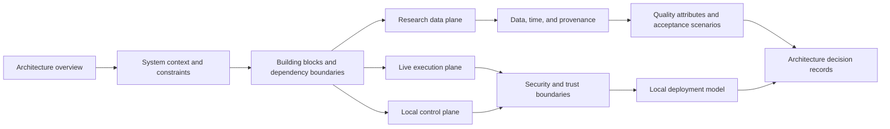

# Market Squawk Documentation System Design

## Document control

| Field | Value |
| --- | --- |
| Document type | Product documentation architecture specification |
| Audience | Maintainers, operators, integrators, reviewers, and research users |
| Design approved | 2026-07-22 |
| Written specification status | Reviewed and accepted for implementation planning |
| Last substantive review | 2026-07-23 |
| Audit base | `46f86d9496287e1995f584537153ecb3fcb271ac` |
| Release boundary | Required for the first complete local release on `release/market-squawk-v0.1.0` |
| Governing product memory | [`docs/project-memory.md`](../../project-memory.md) |
| Delivery status authority | [`docs/plans/delivery-ledger.md`](../../plans/delivery-ledger.md) |

This specification defines the production documentation system for Market Squawk. It turns the
current small collection of architecture and operations artifacts into a navigable, GitHub-native
portal without inventing behavior that the application does not provide. The design is approved;
the committed written specification must be reviewed before a concrete migration plan is produced.
The audit base above is an evidence anchor for this specification, not implementation approval or
release approval. Because the product remains under active integration, execution must begin with
the accepted-head refresh barrier defined below.

## Contents

- [Problem and desired outcome](#problem-and-desired-outcome)
- [Goals and non-goals](#goals-and-non-goals)
- [Reader and document-type model](#reader-and-document-type-model)
- [Information architecture](#information-architecture)
- [Architecture reading flow](#architecture-reading-flow)
- [Page responsibilities](#page-responsibilities)
- [Diagram system](#diagram-system)
- [Page contracts](#page-contracts)
- [Capability-truth contract](#capability-truth-contract)
- [Source and citation policy](#source-and-citation-policy)
- [Artifact migration and history](#artifact-migration-and-history)
- [Implementation sequencing and ownership](#implementation-sequencing-and-ownership)
- [Acceptance and verification](#acceptance-and-verification)
- [Risks and controls](#risks-and-controls)
- [External design basis](#external-design-basis)

## Problem and desired outcome

The present documentation tree has useful content but does not provide a coherent product manual:

- `docs/architecture/current-state.md` is a dated, explicitly rejected audit anchor rather than a
  current architecture entry point;
- `docs/architecture/target-state.md` combines many abstraction levels in one long target-state
  document;
- `docs/operations/onnx-runtime.md` is the only operator runbook and is isolated from installation,
  configuration, source, dataset, portfolio, execution, and recovery guidance;
- there is no documentation home page, architecture index, operations index, reference section, or
  architecture-decision index; and
- delivery state, historical evidence, architecture explanation, and operating guidance are too
  easy for a reader to confuse.

The desired outcome is a version-controlled documentation portal that a reader can enter at
`docs/README.md` and follow according to intent:

1. understand why the system is structured as it is;
2. operate a capability that exists at the reviewed code head;
3. look up an exact CLI, configuration, MCP, source, quality, or time contract;
4. inspect historical architecture audits without mistaking them for current behavior; or
5. inspect delivery, research, test, and verification evidence in their existing dedicated areas.

The documentation is part of the release product. Its completion is therefore an explicit release
lane, not an optional polish item.

## Goals and non-goals

### Goals

- Provide one indexed entry point and predictable navigation across architecture, operations,
  reference, audits, plans, reports, research, testing, and verification.
- Separate explanation, task-oriented operating procedures, factual reference, historical
  evidence, and release tracking so each page has one primary job.
- Present the architecture at consistent levels: context, runtime building blocks, focused plane
  behavior, trust boundaries, deployment, quality attributes, and significant decisions.
- Use stable GitHub-rendered Mermaid forms for relationships and sequences that are materially
  clearer visually than in prose.
- Make every operational claim traceable to current code, current CLI behavior, current schemas, or
  exact accepted release evidence.
- Preserve useful history through Git moves and retain dated audit anchors.
- Keep source links direct, authoritative, relevant, and review-dated.
- Keep the tree maintainable without new documentation generators, prose-checking automation, or
  test targets.

### Non-goals

- The portal does not replace the root README's concise product and capability summary.
- Architecture pages do not duplicate the live delivery ledger or report task progress.
- Operations and reference pages do not describe a desired interface before it exists.
- Historical plans and reports are not rewritten to resemble current documentation.
- The migration does not add a website generator, hosting requirement, analytics, search service,
  diagram server, or container runtime.
- The work does not create a separate documentation repository or GitHub Project.
- The work does not add redirect-only files, empty directories, content-free pages, prose tests, or
  documentation policy scripts.

## Reader and document-type model

The portal follows the Diataxis separation between explanation, how-to guidance, reference, and
learning material while retaining Market Squawk's existing evidence collections.

| Reader intent | Canonical area | Content contract |
| --- | --- | --- |
| Understand the system and its trade-offs | `docs/architecture/` | Explanatory views, boundaries, runtime flows, quality attributes, and ADRs |
| Perform a supported operating task | `docs/operations/` | Preconditions, safe procedures, success evidence, and recovery |
| Look up an exact current contract | `docs/reference/` | Factual CLI, configuration, MCP, source, quality, and time semantics |
| Learn from a guided end-to-end example | Root README and any substantive guided examples | Tested, runnable paths only; no empty tutorial section is created now |
| Inspect a historical architecture assessment | `docs/audits/architecture/` | Dated snapshots whose status and anchor cannot be mistaken for current truth |
| Inspect incomplete work and release blockers | `docs/plans/` | Canonical plans, gap analysis, and delivery ledger |
| Inspect completed evaluation or research | `docs/reports/`, `docs/research/` | Dated results, methods, sources, and evidence |
| Inspect testing or release evidence | `docs/testing/`, `docs/verification/` | Test strategy, immutable evidence, and exact-head verification records |

`docs/README.md` explains these boundaries and routes readers; it does not copy the contents of
every section. Each section-level `README.md` indexes only its area and recommends a reading order.

## Information architecture

The implemented tree will be:

```text
docs/
├── README.md
├── architecture/
│   ├── README.md
│   ├── overview.md
│   ├── building-blocks.md
│   ├── live-execution-plane.md
│   ├── research-data-plane.md
│   ├── control-plane.md
│   ├── data-time-and-provenance.md
│   ├── security-and-trust-boundaries.md
│   ├── deployment.md
│   ├── quality-attributes.md
│   └── decisions/
│       ├── README.md
│       ├── 0001-separate-live-and-research-planes.md
│       ├── 0002-evidence-derived-execution-quality.md
│       ├── 0003-single-writer-live-state.md
│       ├── 0004-local-analytical-storage-stack.md
│       └── 0005-central-risk-and-execution-authority.md
├── operations/
│   ├── README.md
│   ├── installation-and-bootstrap.md
│   ├── configuration-and-secrets.md
│   ├── source-operations.md
│   ├── research-ingestion.md
│   ├── datasets-and-query.md
│   ├── model-inference.md
│   ├── portfolio-and-paper-execution.md
│   ├── backup-and-recovery.md
│   └── troubleshooting.md
├── reference/
│   ├── README.md
│   ├── cli.md
│   ├── configuration.md
│   ├── mcp.md
│   ├── source-coverage.md
│   ├── data-quality.md
│   └── time-and-provenance.md
├── audits/
│   └── architecture/
│       ├── 2026-07-15-current-state-anchor.md
│       └── 2026-07-16-target-state-baseline.md
├── plans/
├── reports/
├── research/
├── testing/
└── verification/
```

Only files with substantive reviewed content are added. Existing populated directories continue to
own their current evidence. The migration does not manufacture index files for those areas unless
an index is necessary to make existing content discoverable and contains useful routing content.

## Architecture reading flow

The architecture index presents the recommended path and links every node directly to its page:



The overview starts at system context and the runtime-container view. It does not jump directly into
crate internals. The building-block page maps those runtime responsibilities to cohesive crates and
adapters only after the reader understands the system boundary.

## Page responsibilities

### Architecture

| Page | Primary responsibility | Required substantive views |
| --- | --- | --- |
| `architecture/README.md` | Orientation, notation, and reading paths | Index, reader routes, diagram legend, status meaning |
| `overview.md` | Product context, constraints, system boundary, and runtime containers | System-context and runtime-container diagrams |
| `building-blocks.md` | Runtime responsibilities, crate boundaries, dependency direction, and hot-path exclusions | Building-block and dependency diagrams |
| `live-execution-plane.md` | Source decoding, qualification, sharding, books, features, strategy/model, risk, and execution | Live sequence and integrity state machine |
| `research-data-plane.md` | Discovery, extraction, normalization, publication, storage, query, Python, and point-in-time construction | Research flow and publication authority |
| `control-plane.md` | Composition root, CLI/MCP application services, catalog, lifecycle, bounded artifacts, and audit | Control request flow and authority ownership |
| `data-time-and-provenance.md` | Canonical identities, timestamps, revisions, availability, supersession, lineage, and anti-leakage semantics | Point-in-time sequence and core entity relationships |
| `security-and-trust-boundaries.md` | Credential, provider, parser, model, execution, MCP, and local-storage trust boundaries | Trust-boundary data flow and authority checks |
| `deployment.md` | Supported local processes, directories, stores, network boundaries, durability, backup surfaces, and optional Python environment | Local process/on-disk deployment diagram |
| `quality-attributes.md` | Measurable latency, throughput, bounded-memory, durability, portability, privacy, security, recovery, and audit scenarios | Scenario table tied to acceptance evidence |

Architecture pages describe both the invariant and the failure consequence. They link to source code
and operations pages for details but do not embed command-by-command runbooks.

### Architecture decisions

Each ADR captures one architecturally significant decision that is already binding in the product:

| ADR | Decision |
| --- | --- |
| `0001` | Live execution and research data remain separate pipelines over shared domain contracts. |
| `0002` | Execution quality is derived from complete source and stream evidence; it is not caller-assigned or inferred from fair-value hierarchy. |
| `0003` | Stable instrument shards provide deterministic single-writer ownership of mutable live state. |
| `0004` | SQLite owns control metadata, Arrow owns in-memory columnar exchange, Parquet owns durable analytical data, and DataFusion owns embedded analytical SQL. |
| `0005` | Strategies emit intents; central risk is mandatory; only the execution authority may call an adapter. |

ADR files use a small fixed structure: title, status, decision date, context, decision, consequences,
rejected alternatives, related architecture, and evidence or sources. Status is one of `Accepted`,
`Superseded`, or `Deprecated`. An ADR records a decision and rationale; it is not a progress report
or a mutable operating checklist.

### Operations

| Page | Operator outcome |
| --- | --- |
| `operations/README.md` | Select the correct runbook, understand safety conventions, and locate local evidence. |
| `installation-and-bootstrap.md` | Install the supported toolchain, initialize a local instance, and prove the bootstrap succeeded. |
| `configuration-and-secrets.md` | Apply precedence, configure local paths and endpoints, store credentials through supported mechanisms, and verify redaction. |
| `source-operations.md` | Register, start, inspect, stop, resynchronize, and diagnose sources supported by the current binary. |
| `research-ingestion.md` | Discover and ingest supported research objects idempotently and inspect provenance and publication results. |
| `datasets-and-query.md` | Build, inspect, and query admitted datasets using bounded local interfaces. |
| `model-inference.md` | Validate bundles, operate native and accepted optional inference runtimes, warm them, inspect evidence, and recover safely. |
| `portfolio-and-paper-execution.md` | Import and reconcile portfolio evidence, inspect analytics, and run risk-enforced paper execution. |
| `backup-and-recovery.md` | Back up and restore the catalog, datasets, model artifacts, execution journals, and controlled artifacts with consistency checks. |
| `troubleshooting.md` | Diagnose common source, catalog, dataset, model, MCP, paper-execution, filesystem, and build-storage failures. |

An operations page can cover multiple related commands when they form one operator workflow. It
must not duplicate CLI option tables that belong in reference.

### Reference

| Page | Factual contract |
| --- | --- |
| `reference/README.md` | Scope, versioning, source-of-truth links, and reference index. |
| `cli.md` | Current command hierarchy, parameters, defaults, limits, output modes, exit behavior, and application-service mapping. |
| `configuration.md` | Keys, types, defaults, precedence, validation, environment mapping, secret treatment, and reload behavior. |
| `mcp.md` | Local stdio framing, typed resources/tools, input/output schemas, bounds, cancellation, artifacts, audit, and errors. |
| `source-coverage.md` | Adapter status, asset/data coverage, authority, delivery class, authentication requirements, and known provider constraints. |
| `data-quality.md` | Quality classes, qualification evidence, transitions, quarantine/resynchronization, and permitted consumers. |
| `time-and-provenance.md` | Timestamp definitions, ordering, point-in-time selection, revisions, supersession, schema versions, and lineage fields. |

Reference pages favor tables, typed examples, and direct code/schema links. They do not contain
roadmaps, architecture rationale, or duplicated delivery status.

## Diagram system

The portal uses Mermaid's stable `flowchart`, `sequenceDiagram`, `stateDiagram-v2`, and `erDiagram`
forms because GitHub renders Mermaid fenced blocks and these forms are broadly supported. Beta C4
or architecture-specific Mermaid forms are not used.

The initial diagram inventory is:

| View | Location | Form | Question answered |
| --- | --- | --- | --- |
| System context | `architecture/overview.md` | Flowchart | Who and what interacts with Market Squawk across its local boundary? |
| Runtime containers | `architecture/overview.md` | Flowchart | Which local runtimes and stores own the major responsibilities? |
| Building blocks | `architecture/building-blocks.md` | Flowchart | How do cohesive crates and adapters map to runtime responsibilities? |
| Live event-to-action | `architecture/live-execution-plane.md` | Sequence | Which checks and authorities must an event cross before paper execution? |
| Live integrity lifecycle | `architecture/live-execution-plane.md` | State diagram | When can a stream become verified, degraded, quarantined, or resynchronized? |
| Research publication | `architecture/research-data-plane.md` | Flowchart | How does source evidence become an admitted analytical dataset? |
| Point-in-time observation | `architecture/data-time-and-provenance.md` | Sequence | How do effective, published, available, ingested, revision, and supersession times constrain a query? |
| Core provenance entities | `architecture/data-time-and-provenance.md` | Entity relationship | Which identities and lineage records bind datasets and observations? |
| Trust boundaries | `architecture/security-and-trust-boundaries.md` | Flowchart | Where do credentials, untrusted bytes, model authority, risk authority, MCP requests, and artifacts cross boundaries? |
| Local deployment | `architecture/deployment.md` | Flowchart | Which processes, local directories, stores, and provider connections exist on disk and at runtime? |

Every diagram has:

- a sentence stating the question the diagram answers;
- labels on relationships where direction alone is ambiguous;
- consistent names shared with surrounding prose and reference pages;
- no mixed context-, container-, and component-level boxes in one view;
- a prose interpretation that preserves the important information when Mermaid is unavailable; and
- no color-only semantics or decorative nodes.

## Page contracts

### Substantive page contract

Every substantive architecture, operations, and reference page contains, when applicable:

1. a title and one-paragraph purpose;
2. document metadata: type, audience, status, last substantive review date, and the exact reviewed
   commit or release tag for current product behavior;
3. a linked table of contents when the page is long enough to require scrolling across several
   sections;
4. scope and explicit non-goals;
5. the relevant architecture or operating flow;
6. components, responsibilities, interfaces, and invariants;
7. failure and recovery behavior;
8. security, trust, or authority considerations;
9. links to related architecture, operations, reference, code, ADR, and delivery evidence; and
10. direct relevant external sources with a review date.

Metadata is concise Markdown, not front matter requiring a documentation generator. A page is
`Current` only when it has been checked against the reviewed repository head. Historical and
decision records use their own status vocabularies.

### Operations page contract

Every runbook additionally contains:

1. prerequisites and the applicable supported platforms;
2. safety and authority checks before mutation;
3. exact commands or a local procedure using current interfaces;
4. expected success evidence, including the observable output or durable state;
5. rollback or recovery steps;
6. known failure modes and bounded diagnostic actions;
7. local log, data, configuration, secret, and artifact locations relevant to the procedure; and
8. links to the corresponding factual reference.

Destructive procedures identify their effect and require explicit operator intent. Examples never
contain real credentials, live account identifiers, or unbounded queries.

### Index contract

An index page contains an audience-oriented reading path, concise descriptions, and direct links.
It is not a second copy of the linked documents. The root documentation index includes a compact
map of existing audits, plans, reports, research, testing, and verification areas so historical or
delivery evidence remains discoverable without being mixed into the product manual.

## Capability-truth contract

Documentation truth is derived from accepted implementation and exact evidence, not aspiration.

1. An operations procedure is published only for behavior supported by the current code and
   reproducible on the documented platform.
2. Reference tables are derived from current public types, Clap command definitions, configuration
   parsing, MCP schemas, source metadata, and accepted runtime bounds.
3. Architecture may describe a binding invariant that is still being completed only when it labels
   the distinction and links the release blocker; it may not imply the unavailable path is runnable.
4. Mandatory incomplete capabilities remain classified in the delivery ledger and gap analysis as
   release blockers. They are not renamed as enhancements or copied into operating instructions.
5. Provider coverage distinguishes direct, official delayed, aggregated, indicative, modeled,
   estimated, stale, and quarantined data as implemented. Account or free-key requirements are
   stated separately from software or API cost.
6. Fair-value hierarchy, market depth, and data quality remain separate types and separate
   explanations.
7. A page changed after its supporting code changes is reviewed against the new exact head before
   it is marked `Current` again.

The root README remains the concise capability truth for users deciding whether the release is
usable. The delivery ledger remains the mutable operational truth. Product documentation links to
those authorities instead of copying their state tables.

## Source and citation policy

Sources serve two different purposes:

- Product and provider claims cite the most direct official specification, provider documentation,
  standard, or primary implementation source available.
- Documentation-architecture choices cite the official methods and renderer documentation listed
  in [External design basis](#external-design-basis).

Each external source entry includes a descriptive title, direct HTTPS link, the claim it supports,
and the date it was substantively reviewed. Pages avoid undated generic bibliographies. A source is
linked near the material it supports and may also appear in a compact page-level sources table.

Historical research remains under `docs/research/`; maintained product pages synthesize relevant
results and link to that research rather than copying large reports. Source links are not presented
as proof of current runtime behavior without corresponding code or release evidence.

## Artifact migration and history

The migration preserves useful content and Git history:

1. Reconcile durable architecture content from `docs/architecture/target-state.md` into the focused
   current architecture pages.
2. Move `docs/architecture/current-state.md` with Git history to
   `docs/audits/architecture/2026-07-15-current-state-anchor.md`.
3. Move the original target-state baseline with Git history to
   `docs/audits/architecture/2026-07-16-target-state-baseline.md` only after the focused current
   architecture pages have been reconciled from it.
4. Move `docs/operations/onnx-runtime.md` with Git history to
   `docs/operations/model-inference.md`, then broaden it only with current native/model-bundle and
   accepted optional-runtime operations.
5. Update maintained Markdown links in the root README, gap analysis, verification baseline, and
   maintained research/reference pages to the new destinations.
6. Leave literal file paths and command examples in frozen historical plans unchanged when they are
   part of the historical evidence. Update a historical Markdown link only when preserving its
   navigability does not rewrite the plan's meaning.
7. Do not leave redirect-only files at the old paths.

The integration owner performs the architecture-audit moves after reconciliation and adds concise
metadata to both archived documents stating that they are frozen historical evidence, have no
current execution or capability authority, and defer to the current architecture index and
delivery ledger. A reader opening either archive directly must not be able to mistake it for the
maintained architecture or current release state.

Git moves are performed before substantive rewrites where practical so `git log --follow` retains a
useful ancestry. The implementation plan will include a link inventory and a final maintained-link
audit, but no new repository script is added for that audit.

## Implementation sequencing and ownership

The documentation work is one cohesive release lane with internal slices, not one worktree or agent
per page. Before any documentation writer starts, the release owner must fix the accepted integrated
head and refresh this specification's implementation inventory against it. The refresh must cover
repository paths and line anchors, CLI/MCP/configuration schemas and interfaces, dependency
relationships, source metadata, runnable-capability evidence, and release-blocker state. Planned
capabilities and implemented capabilities remain distinct throughout the refresh. Operations and
reference pages cannot be marked `Current` until that refreshed head has been recorded.

1. Record the accepted integrated head and complete the mandatory refresh barrier above; inventory
   maintained links, current commands, schemas, configuration, source metadata, local paths,
   dependency edges, runnable evidence, and release blockers at that exact head.
2. Create the documentation and section indexes, then build the architecture overview, building
   blocks, plane pages, trust/deployment/quality pages, and five ADRs from accepted code and the
   still-present target-state source.
3. After that reconciliation, have the integration owner perform the two history-preserving
   architecture-audit moves, add their historical/no-current-authority metadata, and move the model
   runbook into `model-inference.md` before broadening it with current behavior.
4. Build reference pages from the same code head; verify command, configuration, MCP, source,
   quality, and time contracts directly against their implementation sources.
5. Build operations pages from runnable product paths and the completed reference; capture exact
   expected success evidence and bounded recovery procedures.
6. Repair maintained links, reconcile root README navigation, and perform the manual truth,
   diagram, navigation, history, and diff review.

The model-runtime remediation is accepted, integrated, and its worktree is closed. The current
`docs/operations/onnx-runtime.md` states the accepted runtime contract, so the documentation
migration may history-preservingly move and reconcile it into `model-inference.md` after this
written design passes its approval gate.

The implementation plan will group pages by shared source material and edit ownership to maximize
safe parallelism. Shared indexes, cross-links, the root README, moved history-bearing files, and
final reconciliation remain single-writer integration responsibilities.

## Acceptance and verification

The documentation lane is accepted only when all of the following are true at one committed head:

- `docs/README.md`, architecture, operations, reference, and ADR indexes provide complete reading
  paths with no orphaned maintained page.
- Every approved tree file contains substantive reviewed content; no redirect-only or content-free
  file exists.
- Architecture views use one abstraction level per diagram, label material relationships, and have
  accompanying prose.
- Operations procedures have been exercised against current local interfaces or explicitly limited
  to the accepted behavior they cover.
- CLI, configuration, MCP, source-coverage, data-quality, and time/provenance reference statements
  match current code and schemas.
- Mandatory unfinished product work remains visibly release-blocking in the ledger and is not
  described as runnable.
- Maintained relative Markdown links resolve after the moves; frozen historical literal paths have
  not been rewritten as if their original plans used the new layout.
- Both archived architecture documents are unmistakably labelled as frozen historical evidence
  with no current execution or capability authority, and link to the current architecture index
  and delivery ledger.
- `git log --follow` retains useful ancestry for the two architecture audit moves and the model
  runbook move.
- Mermaid blocks render using GitHub-supported stable syntax and are understandable from adjacent
  prose.
- External claims use direct relevant sources with a substantive review date.
- `git diff --check`, Markdown inspection, link navigation, exact command/schema comparison, and
  repository diff review pass.

No documentation checker, snapshot suite, prose assertion, file-existence test, or new Rust test
target is introduced. Verification is a bounded review of the actual content and its implementation
sources. Existing product gates are run only when documentation work changes code or build inputs;
a documentation-only commit does not trigger repetitive full-workspace compilation.

## Risks and controls

| Risk | Control |
| --- | --- |
| The portal becomes another status tracker | Keep mutable state in the delivery ledger; architecture, operations, and reference link rather than duplicate it. |
| Procedures claim unfinished behavior | Require implementation/source evidence before publication and preserve release blockers in the ledger. |
| Many pages duplicate the monolith | Give each page one primary reader question and keep cross-cutting facts in reference with links. |
| Diagrams mix abstraction levels or drift | Define a fixed view inventory, consistent names, relationship labels, prose interpretations, and substantive review dates. |
| History is lost during restructuring | Use Git moves before rewriting and verify ancestry with `git log --follow`. |
| Active model remediation conflicts with the move | Serialize `onnx-runtime.md` migration after accepted model integration. |
| Link repair rewrites historical evidence | Separate maintained links from frozen literal paths and update only navigability without changing historical meaning. |
| Documentation effort displaces release implementation | Treat it as one bounded lane, group related pages, avoid new tooling, and keep active product remediation running in parallel. |
| Sources become decorative or stale | Cite direct sources near supported claims and record the last substantive review date. |

## External design basis

The following primary sources were reviewed on 2026-07-22 and govern the documentation-system
choices in this specification:

| Source | Applied guidance |
| --- | --- |
| [Diataxis: Start here](https://diataxis.fr/start-here/) | Separate explanation, how-to guidance, reference, and learning-oriented material by reader need. |
| [Diataxis: Reference](https://www.diataxis.fr/reference/) | Keep reference factual, austere, accurate, and organized around the product's machinery. |
| [C4 model: Diagrams](https://c4model.com/diagrams) | Use hierarchical context and container views, consistent notation, labelled relationships, and one abstraction level per diagram. |
| [C4 model: Introduction](https://c4model.com/introduction) | Communicate software architecture through progressively detailed maps rather than one overloaded diagram. |
| [arc42: Introduction and goals](https://docs.arc42.org/section-1/) | State goals, quality goals, and stakeholders before architecture detail. |
| [arc42: Architecture decisions](https://docs.arc42.org/section-9/) | Record significant decisions with context, rationale, status, and consequences. |
| [arc42: Quality requirements](https://docs.arc42.org/section-10/) | Express quality attributes as concrete, testable scenarios rather than adjectives. |
| [ADR organization](https://adr.github.io/) | Preserve architecturally significant decisions and their trade-offs as durable records. |
| [GitHub: Creating diagrams](https://docs.github.com/en/get-started/writing-on-github/working-with-advanced-formatting/creating-diagrams) | Use fenced Mermaid diagrams that render directly in GitHub Markdown. |
| [Mermaid flowchart syntax](https://mermaid.js.org/syntax/flowchart) | Use stable flowchart syntax for context, container, dependency, trust, and deployment views. |
| [Mermaid sequence-diagram syntax](https://mermaid.js.org/syntax/sequenceDiagram.html) | Use stable sequence syntax for live event-to-action and point-in-time flows. |

These sources guide organization and notation. Market Squawk's product behavior remains governed by
its code, accepted architecture decisions, release requirements, and exact verification evidence.
