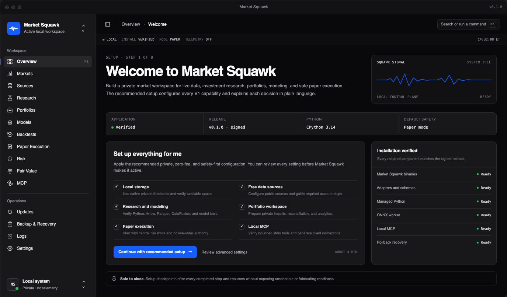
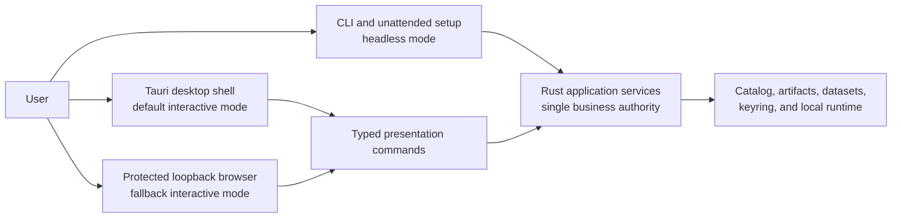

# Market Squawk Obsidian Signal Interface Design

## Document control

| Field | Value |
| --- | --- |
| Document type | Approved product interface and desktop-shell design specification |
| Audience | Product, design, desktop, frontend, platform, security, accessibility, and release reviewers |
| Status | Approved visual and interaction baseline; implementation not yet claimed |
| Design approved | 2026-07-28 |
| Last substantive review | 2026-07-28 |
| Audit base | `cfb902b007f66b49b366b3e7f5d03a640e11f9aa` |
| Visual baseline | [`assets/2026-07-28-market-squawk-obsidian-signal.png`](assets/2026-07-28-market-squawk-obsidian-signal.png) |
| Visual baseline SHA-256 | `13584db11237399eb7bafa638f9a34b7970b90c44443c62a76b34e7a9859fe43` |
| Release boundary | Required product experience for the first complete release |
| Governing product memory | [`docs/project-memory.md`](../../project-memory.md) |
| Delivery status authority | [`docs/plans/delivery-ledger.md`](../../plans/delivery-ledger.md) |

This specification locks the approved **Obsidian Signal** design for Market Squawk's guided setup
and permanent application shell. It records the exact visual reference, product navigation,
presentation architecture, reusable component choices, interaction rules, accessibility
requirements, security boundary, and acceptance criteria needed to implement the design without
guesswork or visual drift.

The audit base identifies the repository state against which this design was accepted. It is not
implementation evidence or release approval. Before implementation begins, the owner must run the
[refresh gate](#implementation-refresh-gate) against the accepted integration head.

## Contents

- [Decision summary](#decision-summary)
- [Scope and supersession](#scope-and-supersession)
- [Approved visual baseline](#approved-visual-baseline)
- [Experience model](#experience-model)
- [Application shell](#application-shell)
- [Navigation contract](#navigation-contract)
- [Obsidian Signal visual system](#obsidian-signal-visual-system)
- [Typography and iconography](#typography-and-iconography)
- [Squawk Signal identity](#squawk-signal-identity)
- [Guided setup experience](#guided-setup-experience)
- [Responsive behavior](#responsive-behavior)
- [Motion and feedback](#motion-and-feedback)
- [Accessibility](#accessibility)
- [Desktop and browser security boundary](#desktop-and-browser-security-boundary)
- [Maintained component strategy](#maintained-component-strategy)
- [Anti-drift rules](#anti-drift-rules)
- [Implementation refresh gate](#implementation-refresh-gate)
- [Acceptance criteria](#acceptance-criteria)
- [Related project material](#related-project-material)
- [External design and engineering basis](#external-design-and-engineering-basis)

## Decision summary

Market Squawk intentionally adopts a desktop product shell, not a disposable setup page:

- A **Tauri 2** desktop window is the default guided and interactive experience.
- The same bounded application services remain available through a protected loopback browser
  fallback and through terminal/headless workflows.
- The shell uses the information density and navigation composition of shadcn/ui's
  [`new-york-v4/sidebar-07`](https://ui.shadcn.com/view/new-york-v4/sidebar-07) as its structural
  foundation.
- The product theme is **Obsidian Signal**: near-black canvas, graphite surfaces, restrained
  cobalt interaction color, semantic operational colors, disciplined typography, and a thin
  market/broadcast signal motif.
- Setup occurs inside the permanent application navigation. Completing setup reveals the product;
  it does not discard the shell or move the user into a visually unrelated interface.
- The recommended path installs and configures the complete supported product while explaining
  decisions in plain language. Advanced controls remain available without dominating the normal
  path.
- The approved navigation, palette, typography, spacing character, status rail, signal motif, and
  screen composition in this specification are product contracts, not illustrative suggestions.

## Scope and supersession

This specification controls:

- the Tauri window and permanent application-shell presentation;
- guided setup inside that shell;
- navigation hierarchy and labels;
- colors, typography, iconography, density, borders, surfaces, and motion;
- responsive and reduced-motion behavior;
- accessibility requirements for the shell and setup;
- maintained frontend libraries and their ownership boundaries; and
- the desktop WebView, protected browser fallback, and Rust command boundary.

It does not redefine:

- provider authority, qualification, coverage, or activation;
- credential storage or secret lifecycle;
- installation artifact signing, verification, activation, rollback, or uninstall;
- live market-data quality or execution eligibility;
- centralized risk and execution authority;
- research time, revision, lineage, or point-in-time semantics; or
- release completion and exact-head evidence.

This specification supersedes the visual-system and presentation-implementation choices in
[`2026-07-26-provider-onboarding-ux-design.md`](2026-07-26-provider-onboarding-ux-design.md),
including its earlier teal palette, system-font-only choice, and framework-free portal
presentation. The earlier specification's provider workflow, plain-language guidance, durable
resume behavior, credential rules, status semantics, and authority boundaries remain requirements.

The cross-platform installation research recommended Tauri only if Market Squawk intentionally
became a desktop application. This approved decision satisfies that condition. Tauri is the
interactive product shell; it is not an additional implementation of installation, provider,
catalog, model, or execution business logic.

## Approved visual baseline



The tracked PNG above is the canonical visual acceptance reference for the first implementation.
Its digest is recorded in document control so an accidental binary replacement is detectable.

The image fixes the following composition:

1. restrained native title bar;
2. permanent left navigation and active-workspace identity;
3. breadcrumb and command entry in a compact application header;
4. narrow operational-status rail;
5. welcome copy paired with the Squawk Signal;
6. a compact row of verified environment facts;
7. one dominant recommended-setup panel;
8. one subordinate installation-verification panel; and
9. a durable-resume and safe-close notice.

The screenshot is a design baseline, not evidence that the interface or its displayed readiness
states are implemented. Production UI must render readiness from typed application state and must
never hard-code the example's successful values. The pictured `v0.1.0` is sample display content,
not release authority; production must show the verified signed artifact version. The active
package candidate at this audit base is `0.2.0`.

## Experience model

The supported presentation modes share application services and authority:



The desktop shell is preferred because it provides a cohesive install-to-use experience without
requiring the user to manage browser tabs or copy loopback addresses. Browser fallback preserves
accessibility and recovery when a supported system WebView is unavailable. The terminal remains a
first-class route for servers, automation, diagnostics, and users who prefer it.

No presentation mode receives a private bypass around validation, provider activation, risk,
execution, model admission, artifact control, or audit services.

## Application shell

### Desktop frame

The initial visual baseline uses:

| Element | Baseline |
| --- | --- |
| Reference capture | 1,375 × 806 pixels |
| Window shape | 12-pixel outer radius with a one-pixel strong border |
| Native bar | 38 pixels, quiet graphite surface, centered product name |
| Sidebar | 258 pixels expanded; 78 pixels compact |
| Application header | 55 pixels |
| Operational-status rail | 28 pixels |
| Main content padding | Approximately 28 pixels at desktop width |
| Main canvas | Near-black, independently scrollable content region |

These measurements define the intended density rather than forcing a fixed-size window. The
implementation must respect operating-system title-bar conventions, text scaling, localization,
and viewport constraints while retaining the same hierarchy.

### Header

The application header contains:

- sidebar collapse control;
- breadcrumb showing the current domain and page;
- command/search entry with the platform-correct keyboard hint; and
- space for bounded page actions when a route requires them.

It is compact working UI, not a marketing hero or global toolbar crowded with status badges.

### Operational-status rail

The rail surfaces only high-value, current operating context:

- local process health;
- installation verification;
- execution mode;
- telemetry state; and
- local market or workspace time.

Each state must have an accessible text label and truthful source. A heartbeat or connected process
must not imply fresh market data. Warnings and failures replace the corresponding value and expose
a direct route to diagnosis.

### Surfaces

Use a shallow surface hierarchy:

1. near-black canvas;
2. graphite sidebar and primary work surfaces;
3. slightly raised interactive or verification surfaces; and
4. one selected/hover neutral.

Avoid nested cards where spacing, a divider, table section, or simple region communicates the same
structure. Cards are for real grouped responsibility, not every paragraph or metric.

## Navigation contract

The permanent expanded navigation is:

```text
Market Squawk / active local workspace
──────────────────────────────────────
Workspace
  Overview
  Markets
  Sources
  Research
  Portfolios
  Models
  Backtests
  Paper Execution
  Risk
  Fair Value
  MCP
──────────────────────────────────────
Operations
  Updates
  Backup & Recovery
  Logs
  Settings
──────────────────────────────────────
Local system / privacy and health
```

Rules:

- Keep these labels and ordering unless a later approved design decision explicitly replaces them.
- Setup uses **Overview** as its initial route and preserves the rest of the navigation so users can
  understand the product they are configuring.
- Disabled or blocked destinations remain legible and explain their prerequisite; they are not
  silently hidden.
- The active destination uses a neutral graphite selection with a two-pixel cobalt edge marker.
- Each destination has a Lucide icon and an accessible text label.
- The compact state retains icon order, tooltips, keyboard access, active indication, and the
  workspace/system anchors.
- `⌘K` is shown on macOS; the correct platform shortcut is shown elsewhere.

## Obsidian Signal visual system

### Core tokens

| Role | Token | Value |
| --- | --- | --- |
| Main canvas | `--ms-background` | `#09090b` |
| Sidebar and primary surface | `--ms-surface` | `#18181b` |
| Raised surface | `--ms-surface-raised` | `#202024` |
| Neutral hover and selection | `--ms-surface-interactive` | `#27272a` |
| Quiet chrome | `--ms-chrome` | `#121214` |
| Primary text | `--ms-foreground` | `#fafafa` |
| Muted text | `--ms-muted` | `#a1a1aa` |
| Dim metadata | `--ms-dim` | `#71717a` |
| Standard border | `--ms-border` | `rgba(255, 255, 255, 0.09)` |
| Strong border | `--ms-border-strong` | `rgba(255, 255, 255, 0.14)` |
| Product/action accent | `--ms-cobalt` | `#155dfc` |
| Healthy/up/ready | `--ms-positive` | `#22c55e` |
| Critical/down/error | `--ms-negative` | `#ef4444` |
| Warning/stale/attention | `--ms-warning` | `#f59e0b` |

The final implementation must derive state variants that meet contrast requirements rather than
placing these raw colors indiscriminately on text.

### Color rules

- Cobalt is reserved for product identity, selected navigation, primary action, keyboard focus,
  links, and meaningful chart interaction.
- Green, red, and amber carry operational, market, and risk meaning only.
- Every semantic color has an icon, label, shape, or position cue.
- Neutral surfaces carry hierarchy; color does not decorate every panel.
- There is one dark theme in the first release. A light theme is not required.

## Typography and iconography

Use locally bundled, licensed font files:

- **Geist Sans** for navigation, labels, prose, controls, and headings;
- **Geist Mono** for symbols, prices, quantities, timestamps, versions, hashes, shortcuts, and
  machine-state labels; and
- tabular numerals for changing financial and operational values.

The system font stack is a failure-safe fallback while the bundled font loads or if it cannot be
used. No font is fetched from a remote CDN at runtime.

Typography is compact but readable:

- headings use clear weight and close tracking without oversized marketing scale;
- body copy uses short lines and plain language;
- uppercase monospaced metadata is limited to quiet operational context;
- critical values and controls meet accessible minimum sizes under system scaling; and
- financial columns align decimals and units predictably.

Use **Lucide** as the general icon set. Custom icons are limited to the Market Squawk mark and
domain marks that Lucide cannot express accurately. Icons do not replace labels for unfamiliar
financial, authority, or operational concepts.

## Squawk Signal identity

The Squawk Signal is a thin cobalt trace combining:

- a market-price line;
- a broadcast or audio waveform; and
- a heartbeat-like indication of active local state.

It appears sparingly:

- inside the Market Squawk logo;
- once in the setup welcome panel;
- during application startup;
- as an active-workspace or local-status cue;
- in purposeful empty/loading states; and
- as a chart crosshair or selection detail where it improves comprehension.

It must not become a decorative glowing background, continuous ambient animation, or substitute
for a real data-health indicator. The signal's status label always derives from the actual state
being represented.

## Guided setup experience

### Welcome route

The initial route has one clear outcome: begin the complete recommended setup.

It contains:

- `Setup · Step 1 of N` progress context;
- the heading **Welcome to Market Squawk**;
- a short explanation of the self-hosted market workspace in non-specialist language;
- the Squawk Signal and current local-control status;
- verified application, release, managed-Python, and default-safety facts;
- the primary **Set up everything for me** action;
- a subordinate **Review advanced settings** action;
- a truthful checklist of included setup areas;
- installation-component verification; and
- a notice that completed checkpoints are durable and setup can resume safely.

### Recommended contents

The recommended configuration covers:

- local private storage and storage-budget verification;
- supported zero-fee data sources and guided account/key steps where required;
- Arrow, Parquet, DataFusion, Python 3.14, analytics, and model tooling;
- private portfolio import and reconciliation;
- paper execution with centralized risk authority; and
- bounded local stdio MCP with generated client instructions.

Every successful status must come from the corresponding application authority. The UI must not
infer readiness from the existence of a file, process, account name, heartbeat, or partially
completed step.

### Progressive disclosure

People who are not financially experienced should receive:

- one recommended decision at a time;
- a brief explanation of why it matters;
- practical examples of what the data or capability enables;
- the expected time and any external human action;
- a truthful completion or recovery state; and
- optional technical details without raw internal JSON in the primary flow.

Advanced settings expose the complete supported control surface but use the same typed requests and
application services as the recommended path.

## Responsive behavior

The interface supports three layout states:

| State | Behavior |
| --- | --- |
| Wide desktop | 258-pixel expanded sidebar; two-column hero and setup regions; four-column facts |
| Compact desktop | 78-pixel icon sidebar; single-column hero/setup regions; two-column facts |
| Narrow fallback | Off-canvas or explicitly toggled navigation; single-column content; no clipped critical action or value |

The compact transition begins near the point at which the primary workspace would otherwise become
unreadable; the approved reference uses approximately 940 CSS pixels. The implementation must test
content fit rather than treat that number as a universal device boundary.

The desktop window defines a reasonable minimum size and remains resizable. Browser fallback
reflows rather than imitating a fixed desktop canvas. At 200% zoom, the primary setup action,
status explanation, recovery route, and navigation remain available without two-dimensional
scrolling.

## Motion and feedback

- Sidebar collapse/expand and normal route transitions target approximately 160 milliseconds.
- The Squawk Signal may draw once at startup or when a new signal context is intentionally
  introduced.
- Loading uses stable skeletons or localized progress, not layout-shifting spinners across the
  entire shell.
- Destructive, blocked, and authority-changing actions require clear state transitions and cannot
  rely on animation to communicate their consequence.
- There is no ambient pulsing, bouncing, parallax, ornamental particle motion, or repeated signal
  animation.
- `prefers-reduced-motion: reduce` removes nonessential animation and renders the signal in its
  final state immediately.

## Accessibility

Implementation acceptance requires:

- WCAG 2.2 AA contrast for text, controls, focus, and meaningful graphics;
- complete keyboard navigation with a logical focus order;
- visible focus that uses more than a subtle color shift;
- semantic landmarks, headings, navigation, lists, tables, forms, labels, and status regions;
- accessible names for icon-only compact-sidebar controls;
- text and non-color cues for ready, stale, warning, down, blocked, gain, and loss states;
- error messages programmatically associated with their field and recovery action;
- restrained live-region use for progress and completion;
- no placeholder-only field labels;
- practical pointer targets around 44 CSS pixels where density permits, with sufficient target
  spacing in denser tables and navigation;
- text zoom and reflow without clipped credentials, commands, prices, or risk limits;
- financial tables with meaningful headers and predictable reading order; and
- platform-correct shortcut labels that are not required to operate the product.

Accessibility is part of component acceptance, not a final visual-review pass.

## Desktop and browser security boundary

The desktop shell follows least privilege:

- Bundle application HTML, CSS, JavaScript, icons, and fonts; do not load runtime UI code from a
  remote origin.
- Use a strict content-security policy compatible with the compiled application.
- Expose narrow, typed, bounded Tauri commands backed by the same Rust application services used by
  the CLI and MCP.
- Grant each window only the Tauri capabilities it needs; setup does not receive unrestricted
  shell, filesystem, network, SQL, credential, or execution access.
- Validate every command payload in Rust and return typed, redacted failures.
- Open official provider pages in the user's system browser rather than embedding untrusted
  provider content in the privileged application WebView.
- Keep credentials write-only in presentation state and pass them directly to the established
  OS-keyring-first or encrypted-fallback service.
- Do not place credentials or durable authority tokens in URL parameters, DOM diagnostics, browser
  storage, logs, crash reports, or analytics.
- Preserve existing loopback protections for browser fallback: unpredictable session authority,
  same-origin policy, CSRF validation, bounded bodies/results, restrictive CSP, cancellation, and
  explicit lifecycle.
- Keep MCP, model execution, analytics, filesystem publication, and live event processing outside
  the WebView. The shell requests bounded application operations; it is not the authority itself.

The system WebView keeps the desktop distribution smaller than an Electron-style bundled browser,
but it does not reduce the need for platform compatibility testing or narrow IPC capabilities.

## Maintained component strategy

Use established libraries where they remove undifferentiated maintenance without transferring
product authority into frontend code:

| Capability | Selected foundation | Ownership boundary |
| --- | --- | --- |
| Desktop shell and system WebView | Tauri 2 | Windowing, secure typed IPC, platform packaging integration; Rust services retain business authority |
| UI composition and primitives | shadcn/ui `new-york-v4`, starting from `sidebar-07` | Source-owned accessible components adapted into Market Squawk tokens; not a hosted dependency |
| Accessible primitives used by shadcn | Radix UI where the selected component requires it | Focus, keyboard, overlay, and control mechanics; product semantics remain ours |
| Icons | Lucide | General interface icons; custom product mark remains source-owned |
| Fonts | Geist Sans and Geist Mono | Bundled locally under their license |
| Purposeful UI motion | CSS first; Motion only for interactions that materially benefit | No general animation layer or decorative motion |
| Market charts | TradingView Lightweight Charts | Time-series and market visualization, wrapped behind Market Squawk data contracts |
| Analytical charts | Recharts | Portfolio, factor, scenario, and research visualization |
| Command palette | cmdk | Keyboard command discovery over a typed, permission-aware command registry |

At implementation start, select the newest stable compatible versions, review their maintenance and
licenses, then lock resolved versions. Do not copy unmaintained snippets or duplicate mature
library behavior in custom code. Do not let a chart, command, or component library become a second
source of financial, risk, provider, or execution truth.

## Anti-drift rules

The following are explicitly outside the approved direction:

- teal, cyan, purple, or gradient-led branding;
- glassmorphism, bloom, neon glow, or translucent floating panels;
- large marketing-site typography inside operational routes;
- a dashboard composed of many isolated rounded cards;
- excessive badges or pills for ordinary metadata;
- always-running decorative waveform animation;
- unlabeled finance-specific icons;
- generic AI-generated illustration or abstract 3D artwork;
- remote fonts, remote UI assets, telemetry, or hidden outbound UI requests;
- a separate setup visual language that disappears after onboarding;
- frontend reimplementation of provider, risk, execution, catalog, installation, or model authority;
- hard-coded healthy or verified states;
- browser-only installation that leaves terminal/headless users without an equivalent supported
  path; and
- desktop-only behavior that cannot recover through the protected browser or CLI.

Any intentional deviation from the visual baseline must identify the user or platform problem it
solves and receive product-design review. Normal implementation details that preserve this
specification do not require a new design round.

## Implementation refresh gate

Before producing or executing the implementation plan:

1. Rebase the design audit against the accepted integration head.
2. Reconcile the shell with the current application composition, provider onboarding, installer,
   credential, update, backup, MCP, and release-authority contracts.
3. Confirm that Tauri 2 remains actively maintained and compatible with the supported Windows,
   macOS, and Linux targets and their WebView requirements.
4. Confirm the latest stable compatible releases, licenses, and security posture of shadcn/ui,
   Radix UI, Lucide, Geist, Motion, Lightweight Charts, Recharts, and cmdk.
5. Inventory every proposed Tauri capability and command; reject broad authority.
6. Map every displayed setup/health field to its typed source of truth and failure state.
7. Verify that desktop, protected browser fallback, and CLI call shared application services.
8. Define the minimum high-value verification set without creating screenshot-golden, prose,
   redundant integration, or visual-churn test suites.
9. Update the delivery ledger with the implementation lane, dependencies, accepted evidence, and
   release blocker.

A failed refresh changes the plan, not the approved product intent. A material change to the visual
or authority design returns to product review before implementation.

## Acceptance criteria

The design is implemented when:

- the signed installation opens the Tauri desktop shell by default on every supported interactive
  platform;
- protected browser fallback and terminal/headless operation remain functional;
- the first route matches the approved visual baseline in hierarchy, density, color discipline,
  typography, navigation, and setup composition;
- setup and normal product use share the same permanent shell and navigation;
- a financially inexperienced user can identify the recommended first action and understand each
  required step without separate documentation;
- every readiness, verification, source, model, risk, and execution state comes from its owning
  typed application authority;
- the recommended complete setup can pause, close, recover, and resume without losing accepted work
  or exposing credentials;
- advanced configuration remains available without overwhelming the recommended path;
- the desktop WebView loads only bundled product assets and has a reviewed least-privilege
  capability set;
- keyboard, screen-reader, reduced-motion, contrast, reflow, and zoom acceptance passes on the
  supported platforms;
- navigation and command discovery expose only operations the current user context and application
  state may request;
- charts retain exact units, time semantics, source, quality, and empty/error states;
- no disallowed visual patterns or hard-coded success states remain; and
- exact-head release evidence demonstrates the complete guided install-to-use workflow on the
  supported platform matrix.

## Related project material

- [Cross-platform installation and guided-setup research](../../research/2026-07-28-cross-platform-installation-and-guided-setup.md)
- [Provider onboarding UX design](2026-07-26-provider-onboarding-ux-design.md)
- [Provider onboarding research](../../research/2026-07-22-zero-fee-provider-onboarding/final-report.md)
- [Architecture overview](../../architecture/overview.md)
- [Security and trust boundaries](../../architecture/security-and-trust-boundaries.md)
- [Deployment architecture](../../architecture/deployment.md)
- [Installation and bootstrap operations](../../operations/installation-and-bootstrap.md)
- [Configuration and secrets operations](../../operations/configuration-and-secrets.md)
- [Delivery ledger](../../plans/delivery-ledger.md)

## External design and engineering basis

Sources were last reviewed on 2026-07-28. Direct primary project and official documentation links
are used so the implementation refresh can verify current behavior:

- [shadcn/ui sidebar-07, New York v4](https://ui.shadcn.com/view/new-york-v4/sidebar-07)
- [shadcn/ui source repository and license](https://github.com/shadcn-ui/ui)
- [Tauri 2 architecture](https://v2.tauri.app/concept/architecture/)
- [Tauri capabilities](https://v2.tauri.app/security/capabilities/)
- [Tauri content-security policy](https://v2.tauri.app/security/csp/)
- [Tauri platform distribution](https://v2.tauri.app/distribute/)
- [Radix UI primitives](https://www.radix-ui.com/primitives)
- [Lucide icon project](https://github.com/lucide-icons/lucide)
- [Geist font project and license](https://github.com/vercel/geist-font)
- [Motion documentation](https://motion.dev/docs)
- [TradingView Lightweight Charts](https://github.com/tradingview/lightweight-charts)
- [Recharts](https://github.com/recharts/recharts)
- [cmdk](https://github.com/dip/cmdk)
- [W3C WCAG 2.2](https://www.w3.org/TR/WCAG22/)
- [WAI-ARIA Authoring Practices Guide](https://www.w3.org/WAI/ARIA/apg/)
