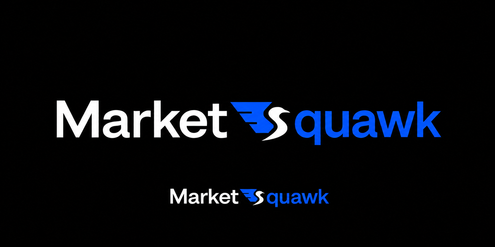

# Market Squawk Logo Design

## Document control

| Field | Value |
| --- | --- |
| Document type | Approved product-identity and logo specification |
| Audience | Product, design, desktop, frontend, packaging, accessibility, and release reviewers |
| Status | Approved design; production integration is not claimed by this document |
| Design approved | 2026-07-29 |
| Last substantive review | 2026-07-29 |
| Audit base | `968631aba5f71c85341876f905795eb71065ba61` |
| Approved visual source | [`assets/2026-07-29-market-squawk-logo.png`](assets/2026-07-29-market-squawk-logo.png) |
| Approved source SHA-256 | `567a3dc04acb791b67eb2a0bb5eed256cb6c9d84c0441ed2dcefc7ae9b7d6ee6` |
| Parent interface design | [`2026-07-28-market-squawk-obsidian-signal-interface-design.md`](2026-07-28-market-squawk-obsidian-signal-interface-design.md) |
| Governing product memory | [`docs/project-memory.md`](../../project-memory.md) |
| Implementation plan | [`2026-07-29-market-squawk-logo-integration.md`](../plans/2026-07-29-market-squawk-logo-integration.md) |

This specification locks the user-selected **Option 3, without an eye** as Market Squawk's product
identity. The approved visual source is the canonical acceptance reference. Its digest makes an
accidental binary replacement detectable; it is not implementation or release evidence.

## Decision

The Market Squawk identity is one symbiotic wordmark:

**`Market` + S-bird mark + `quawk`**

The custom mark replaces the capital **S** in “Squawk.” It is not a separate mascot beside the
complete product name. The white bird's body must read as both an S and a right-facing bird, while
the cobalt wing reads as a compact market structure. The open beak communicates “squawk” without
adding an eye, sound rays, speech bubble, microphone, or generic audio waveform.

The approved source contains a large and a small rendering of this same lockup on an Obsidian
canvas:

## Scope and supersession

This specification controls:

- the Market Squawk product mark and horizontal wordmark;
- product-name color split and casing;
- desktop, browser/WebView favicon, installer, and platform application-icon treatments;
- clear space, minimum display size, accessibility, and prohibited variants; and
- the production translation from the approved raster reference to flat source-owned SVG assets.

It supersedes only the earlier requirement that a thin Squawk Signal trace appear *inside* the
Market Squawk logo. The Squawk Signal remains the approved non-logo motif for startup, welcome,
local-state, loading, chart-selection, and other purposeful product contexts defined by the parent
interface design.

This specification does not redefine navigation, application authority, data health, provider
state, installation trust, release status, or any backend contract.

## Mark anatomy

The mark has two inseparable shapes.

### Cobalt market wing

- Three flat cobalt tiers travel from a broad upper leading edge into progressively shorter lower
  steps.
- The stepped silhouette suggests an order book, price bars, and forward market motion without
  reproducing a literal chart.
- The tiers visually join the bird at its back. They must not float as three unrelated speed lines.
- The upper tier is the longest; the middle and lower tiers reduce in a controlled rhythm.
- The wing remains a filled geometric form. Do not replace it with a stroke waveform.

### White S-bird

- The bird faces right.
- The head resolves into a clearly open beak through Obsidian negative space.
- The neck, chest, belly, and rising tail form one continuous capital-S silhouette.
- The lower tail sweeps left and upward enough to complete the S without becoming a second wing.
- The bird has **no eye**: no dot, cutout, cobalt point, highlight, or implied eye at any size.
- The bird remains filled white. Do not add feather lines, outlines, facial details, feet, or a
  separate tail.

The market wing and bird overlap tightly enough to read as one mark. Neither part is a standalone
alternate logo.

## Color

Production assets normalize the approved concept into the parent interface's flat tokens:

| Role | Value |
| --- | --- |
| Obsidian presentation canvas | `#09090b` |
| Market word fragment | `#fafafa` |
| S-bird | `#fafafa` |
| Market wing | `#155dfc` |
| `quawk` word fragment | `#155dfc` |

Compression, antialiasing, or incidental tonal variation in the approved raster is not permission
to introduce a gradient. There is no glow, bloom, drop shadow, bevel, texture, purple, cyan, teal,
or secondary blue.

## Lockups

### Primary horizontal wordmark

- Render `Market` in white.
- Place the complete S-bird mark immediately after `Market`, with optical spacing equivalent to a
  normal joined capital in the same word.
- Render only `quawk` after the mark in cobalt. Do not render a second typed S.
- Use the application's locally bundled Geist Sans at a compact semibold or bold weight.
- Align the mark optically to the type's cap height; allow the lower S-tail to descend slightly
  below the word baseline.
- Keep all three pieces on one line. Do not stack or center the mark above the name.

### Compact mark

Use the complete market-wing plus S-bird mark without word fragments when the horizontal lockup
cannot remain legible, including the collapsed sidebar, favicon, and application icon. Do not use
an `MS` monogram or the earlier waveform tile as a brand substitute.

### Application icon

The platform application icon uses the compact mark centered in an Obsidian rounded-square
container:

- preserve generous internal padding so the open beak and S-tail survive at 16–32 pixels;
- keep the mark flat cobalt and white;
- use the platform-generated masks and file formats rather than drawing per-platform variants; and
- do not add text to the icon.

## Spacing and size

Let `x` equal one quarter of the compact mark's rendered height.

- Keep at least `x` of clear space around the compact mark and around the horizontal wordmark.
- In product UI, render the compact mark at least 24 CSS pixels high; 32 pixels is preferred in the
  collapsed desktop sidebar.
- Render the horizontal lockup at least 136 CSS pixels wide. Below that width, switch to the
  compact mark instead of compressing the letters or closing the beak.
- Platform icon generation may rasterize below 24 pixels, but the simplified filled silhouette and
  prescribed padding must preserve the wing tiers, open beak, and S reading.

## Accessibility

- Give the containing link or control the accessible product/action name, such as
  `Market Squawk workspace`.
- Treat the SVG or image as decorative when the named container or adjacent text already supplies
  the complete accessible name.
- When the mark appears alone outside an already-named control, give it the accessible name
  `Market Squawk`.
- Do not rely on the white/cobalt split alone to communicate an operational state. Brand color is
  identity, not health or readiness.
- Keep the wordmark readable under 200% zoom, system text scaling, high-contrast review, and the
  supported compact-sidebar transition.

## Prohibited variants

Do not:

- restore an eye or eye-like cutout;
- make only the wing S-shaped while leaving the bird body generic;
- close the beak or turn it into an ordinary pointed head;
- place a generic bird beside the fully typed `Market Squawk`;
- type a second S before or after the mark;
- detach the wing tiers from the bird;
- substitute a chart line, candlestick, microphone, speaker, waveform, or speech bubble;
- rotate, mirror, outline, stretch, condense, skew, animate, or recolor the mark;
- add a badge, circle, cobalt tile, glow, gradient, texture, or shadow behind the in-product mark;
  or
- use the approved raster board directly as a runtime logo. Production surfaces use the derived,
  transparent SVG mark or generated platform icons.

## Production acceptance

The identity integration is accepted when:

- the repository preserves a byte-identical copy of the approved source at the recorded digest;
- the desktop workspace-home lockup visibly reads `Market` + S-bird + `quawk`;
- the compact sidebar, favicon, and generated platform icons use the same no-eye mark;
- the bird body remains the S and the open beak survives compact display;
- all runtime logo assets are bundled locally;
- no dependency, authority, readiness, provider, installation, or release behavior changes;
- the existing frontend accessibility behaviors, type check, production build, and locked desktop
  compile remain green on one clean committed head; and
- release approval continues to require the broader exact-head gates in project memory.
