# Market Squawk V1 Installed Product Experience Design

## Document control

| Field | Value |
| --- | --- |
| Document type | Consolidated V1 product, runtime, and interaction design specification |
| Audience | Product, desktop, frontend, platform, data, modeling, MCP, security, and release reviewers |
| Status | Approved product design; implementation governed by the linked plan |
| Design date | 2026-08-01 |
| Implementation refresh | 2026-08-01 against commit `f43da3aa5cbd887a35c9ef25c748b722c9d5c028` |
| Audit commit | `f35d67247c93c3ab253aedbf663f6cb4c1f80b3e` |
| Audit tree | `c958ff21cf11a67c6a9a189271e493c64ef26150` |
| Release boundary | Required V1 feature experience before owner testing and release preparation |
| Governing memory | [`docs/project-memory.md`](../../project-memory.md) |
| Delivery authority | [`docs/plans/delivery-ledger.md`](../../plans/delivery-ledger.md) |
| Implementation plan | [`2026-08-01-market-squawk-v1-installed-product-experience.md`](../plans/2026-08-01-market-squawk-v1-installed-product-experience.md) |

This specification consolidates the approved installation research, Obsidian Signal interface,
provider onboarding, complete local runtime, shared Model Context Protocol (MCP) service, and the
remaining user-facing V1 feature experience. It turns the product's backend capabilities into a
coherent installed application for people who may not have financial or technical expertise.

The audit identifiers freeze the repository inspected while writing this design. They are not
implementation evidence. Before implementation, refresh every current-state claim and external
version dependency against the accepted integration head. Public distribution, publication,
merging to `main`, and a V1 release declaration are deliberately outside this design's authority.

## Contents

- [Executive decision](#executive-decision)
- [Scope and completion boundary](#scope-and-completion-boundary)
- [Inputs and supersession](#inputs-and-supersession)
- [User outcomes and product principles](#user-outcomes-and-product-principles)
- [Installed-product architecture](#installed-product-architecture)
- [Complete installed product](#complete-installed-product)
- [Acquisition and installation](#acquisition-and-installation)
- [First-run setup and onboarding](#first-run-setup-and-onboarding)
- [Application shell and navigation](#application-shell-and-navigation)
- [Dashboard capability model](#dashboard-capability-model)
- [Overview](#overview)
- [Lookup](#lookup)
- [Markets and live portfolio truth](#markets-and-live-portfolio-truth)
- [Research, models, and investment decisions](#research-models-and-investment-decisions)
- [Targets and predictive charts](#targets-and-predictive-charts)
- [Backtests and scenarios](#backtests-and-scenarios)
- [Portfolio, risk, fair value, and paper execution](#portfolio-risk-fair-value-and-paper-execution)
- [Long-running work and progress](#long-running-work-and-progress)
- [Shared MCP service](#shared-mcp-service)
- [Updates and lifecycle operations](#updates-and-lifecycle-operations)
- [Security and trust boundaries](#security-and-trust-boundaries)
- [Capability coverage contract](#capability-coverage-contract)
- [Failure and recovery behavior](#failure-and-recovery-behavior)
- [Acceptance evidence](#acceptance-evidence)
- [Alternatives and rejected designs](#alternatives-and-rejected-designs)
- [Current gaps at the audit base](#current-gaps-at-the-audit-base)
- [Implementation refresh gate](#implementation-refresh-gate)
- [Related material and sources](#related-material-and-sources)

## Executive decision

V1 is one complete, self-hosted product installed for one operating-system user. It includes the
desktop application, CLI, shared background service and MCP endpoint, local research and analytics
runtimes, managed Python environment, model helpers, and lifecycle tooling. Configuration is staged
after installation; product components are not offered as a scavenger hunt of optional downloads.

The desktop dashboard presents intentional human workflows and decision-ready results. The CLI and
MCP expose the wider bounded application capability surface for advanced users and AI clients. The
dashboard does not mirror every command or show raw JSON as a feature.

One lightweight per-user service owns the active workspace and long-lived local authorities. The
desktop application, CLI, Claude Code, and Codex connect to that service. They do not create a full
duplicate backend, MCP server, database authority, data cache, or model runtime for each session.

The primary product loop is:

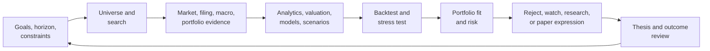

The product assists investment research and decision-making; it does not present model output as
certainty. Forecasts, targets, valuation evidence, market observations, and user judgments remain
visually and semantically distinct. No dashboard, model, strategy, CLI command, or MCP client can
bypass risk authority.

## Scope and completion boundary

### In scope

This design defines the required V1 experience for:

- complete native and terminal-based installation;
- first launch, guided setup, durable resume, and later reconfiguration;
- the permanent Obsidian Signal desktop shell;
- useful dashboard workflows over implemented Market Squawk capabilities;
- search, research, models, predictive views, backtests, portfolios, risk, valuation, and paper
  execution;
- honest live/delayed/stale/modeled/unavailable data presentation;
- long-running task progress, cancellation, recovery, and artifacts;
- a shared per-user local service and concurrent Claude Code/Codex MCP access;
- updates, repair, rollback, backup, restore, logs, settings, and uninstall behavior; and
- acceptance evidence required before the owner begins the separate test-and-use period.

### Explicitly outside this scope

- publishing public release assets or turning on a distribution channel;
- final Apple notarization, Windows signing, or Linux repository publication;
- merging the release candidate to `main`;
- declaring V1 released, complete, or generally available; and
- deciding the length or outcome of the owner's post-feature test-and-use period.

Those activities require a separate release decision after the designed V1 features work and the
owner has used them. This boundary does not defer any product capability required for that testing.

## Inputs and supersession

This design preserves and composes:

- the approved [Obsidian Signal interface](2026-07-28-market-squawk-obsidian-signal-interface-design.md);
- the approved [provider onboarding workflow](2026-07-26-provider-onboarding-ux-design.md);
- the evidence-backed [normal installation and first-run recommendation](../../research/2026-08-01-normal-installation-and-first-run.md);
- the [cross-platform installation research](../../research/2026-07-28-cross-platform-installation-and-guided-setup.md);
- existing architecture boundaries for live execution, research data, central risk, data quality,
  time semantics, provenance, and controlled local artifacts; and
- current MCP, installer, backup, security, and application-service contracts.

Where this document adds detail, it refines rather than replaces those authorities. It supersedes
only these previously unresolved points:

1. the installed runtime is one per-user product service, not one backend per UI or MCP session;
2. the dashboard exposes curated workflows, while CLI and MCP retain broader typed coverage;
3. long-running Python, model, dataset, and backtest work uses a shared durable job contract; and
4. the dashboard must consume real application services and data, not project future state or use
   a generic operation/JSON surface as the finished product.

## User outcomes and product principles

V1 must let a user:

1. install and launch Market Squawk without installing development toolchains;
2. complete recommended setup in plain language and resume skipped work later;
3. see exactly what data is connected, covered, fresh, delayed, stale, modeled, or unavailable;
4. import owned files with preview, validation, provenance, and reconciliation;
5. find an instrument, company, filing, macro series, portfolio item, model, or analysis quickly;
6. evaluate an idea using market, fundamental, macro, portfolio, model, scenario, and backtest
   evidence;
7. create and review versioned buy, add, trim, and sell targets with assumptions and risks;
8. see predictive paths and uncertainty honestly on the price chart when an admitted model supports
   them;
9. monitor, cancel, resume, and understand long-running research work;
10. express an approved idea through realistic paper execution under centralized risk controls;
11. use the same local capabilities from Claude Code and Codex without duplicate servers; and
12. update, repair, back up, restore, diagnose, and remove the product without risking user data.

The governing principles are:

- **Complete install, staged configuration.** All supported components are installed; accounts,
  keys, imports, and permissions are introduced when useful.
- **Guide first, disclose depth on demand.** Primary flows use plain language; evidence and
  technical details remain accessible.
- **Truth over polish.** A connected process is not fresh market data; a forecast is not an
  observation; a modeled value is not execution-quality evidence.
- **One authority, several presentations.** Desktop, CLI, and MCP use the same application
  services and security decisions.
- **Progress must be observable.** Multi-minute work cannot look frozen or require reading logs.
- **Reversible action.** Setup, imports, updates, MCP registration, paper operation, and data
  lifecycle have recovery paths.
- **Local control by default.** The product stores state on the user's machine and makes outbound
  provider contact explicit and attributable.
- **No decision automation by implication.** Viewing a signal or accepting setup never starts an
  execution bot or grants new authority.

## Installed-product architecture

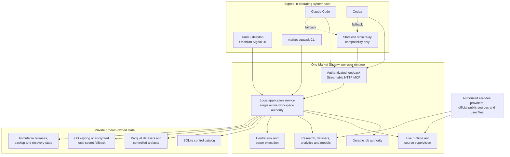

### Ownership invariant

The service owns application authority for the selected workspace. Desktop windows and AI-client
sessions are clients, not alternative authorities. Expensive and stateful resources—source
connections, catalog writers, dataset registration, model admission, paper accounts, risk state,
and durable jobs—exist once per active workspace.

V1 supports one active workspace runtime per signed-in user. Switching is explicit, audited, and
blocked while incompatible jobs or paper operations are active unless the user resolves them.
Supporting several simultaneous workspaces would multiply authority and resource-lifecycle
complexity and is not required for the first complete release.

### Presentation boundary

The service exposes one Hyper-based loopback listener with two independent protocol surfaces:

```text
/app/v1/...   private typed desktop/CLI application contract
/mcp          external Streamable HTTP MCP contract
```

The application surface provides bounded POST command/query envelopes, a bounded authenticated
event stream for job/source/runtime changes, and a minimal health/version handshake. Every envelope
carries protocol version, installation/service generation, workspace, client, request, deadline
and correlation identity. Unknown versions, oversized/invalid payloads, stale generations,
unauthorized clients and replayed mutation requests fail closed.

Desktop and CLI receive separate high-entropy application credentials through protected per-user
installation state. Those credentials are distinct from Claude Code and Codex MCP credentials.
The listener binds only to `127.0.0.1`; it validates host and applicable origin, accepts no cookie
authentication, emits no permissive CORS policy, and applies route-specific methods, media types,
limits and credentials. The stable port and authenticated generation are stored in the owner-only
rendezvous record.

The desktop's Rust layer holds the application credential and exposes only narrow, window-scoped
commands and events to the WebView. The WebView never receives the service token or direct network
authority. Desktop does not use MCP as its internal application API; `/app/v1` and `/mcp` are
separate transport adapters over the same application services. This prevents protocol
presentation concerns from becoming product business logic while preserving one underlying
authority. The live event-to-action path does not traverse either route.

One loopback listener is selected over an additional Unix-socket/Windows-named-pipe stack because
MCP already requires loopback HTTP, Hyper is already admitted in this repository, and the shared
listener avoids a second cross-platform lifecycle and security surface. If a future Windows package
identity changes loopback behavior, its manifest must declare and verify the required loopback
capability; the product must not add an administrator-only exemption. Microsoft's current IPC
guidance documents both named-pipe and packaged-loopback constraints:
[Windows interprocess communication](https://learn.microsoft.com/en-us/windows/apps/develop/communication/interprocess-communication).

## Complete installed product

The default installation contains every component required for the advertised V1 experience:

| Component | V1 responsibility |
| --- | --- |
| Desktop application | Guided setup, dashboard workflows, lifecycle and recovery UI |
| CLI | Complete typed operator and automation surface |
| Per-user service | Workspace authority, application services, MCP, jobs, source/model lifecycle |
| Capture helper | Bounded raw-frame capture outside the live decision path |
| Rust application/runtime libraries | Domain, live, data, analytics, portfolio, valuation, risk, execution |
| Managed Python 3.14 environment | Research, training, approved analytics and visualization helpers |
| Managed uv runtime | Reproducible product-owned Python environment management |
| Native and ONNX model helpers | Bundle validation, admission and local inference |
| Local data stores | SQLite catalog, Arrow exchange, Parquet datasets and artifact directory |
| Lifecycle tooling | Verify, activate, update, repair, rollback, backup, restore and uninstall |
| Notices and metadata | Licenses, component manifest, versions, checksums and provenance |

The user does not separately install Rust, Node.js, Python, uv, SQLite, DataFusion, a container
runtime, a database server, or telemetry infrastructure. A provider credential, account, portfolio
file, optional user model, or external MCP-client registration is configuration—not a missing
product component.

The approved managed-Python baseline at this design date is CPython 3.14.6 with uv 0.12.0. The
release refresh gate must select the latest compatible security/patch release available at the
frozen candidate, verify it across every supported target, and lock its exact artifact identities.
“Latest” never means an unbounded first-run download or an unreviewed runtime drift after the closed
release is built.

Readiness uses evidence-backed states:

| State | Meaning |
| --- | --- |
| Installed | Verified component bytes exist in the active product release |
| Available | The component can run on this system but has not been configured for a user purpose |
| Configured | Required user choices or credentials have been validated |
| Data ready | The relevant source, import, dataset, or model has produced verified usable state |
| Running | A runtime is active and its health evidence is current |
| Needs attention | A recoverable problem or user action blocks the intended outcome |
| Recovery required | The product cannot safely proceed until a documented recovery flow completes |

No screen may infer these states from a hard-coded version, a process heartbeat alone, or the
existence of a configuration field.

## Acquisition and installation

### Supported entry routes

Native packages are the primary ordinary-user path. The concise terminal route is a first-class
alternative:

```sh
curl https://<official-market-squawk-host>/install.sh | sh
```

The final hostname is a release-publication decision and therefore remains a placeholder in this
design. The command may appear in product documentation only when the exact hosted script and every
selected artifact have passed clean-machine verification.

Both routes invoke the same Rust-owned verification, component manifest, activation, registration,
and lifecycle logic. The shell script detects the supported operating system and architecture,
downloads the corresponding immutable installer, and hands off. It must not duplicate product
installation logic or install unpinned dependencies from the network.

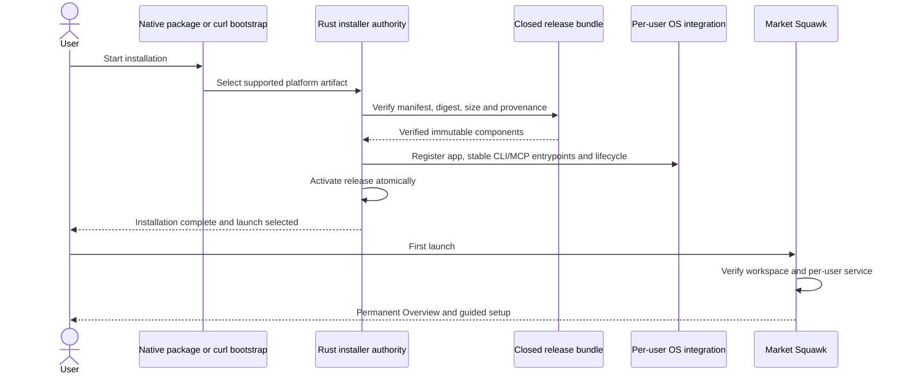

### Platform shape

- **macOS:** native application bundle and installer appropriate to the frozen release decision;
  per-user service via a LaunchAgent; no privileged daemon by default.
- **Windows:** native package with Start-menu and removal integration; current-user service startup
  through the selected package/startup mechanism; no machine-wide service by default.
- **Ubuntu Linux:** native package and desktop entry; `systemd --user` service where supported,
  with a documented user-session fallback.

Signing and notarization policy must be frozen before public distribution, but the lack of paid
publisher credentials does not justify lying about trust prompts. Clean-machine acceptance records
the exact unsigned or community-distributed experience during owner testing.

### Installation safety

Before activation, the installer validates system support, architecture, required disk space,
workspace permissions, closed component inventory, hashes, versions, provenance, executable
boundaries, licenses, and rollback availability. Activation is atomic. A failure leaves the
previous working release and user data intact.

Normal uninstall removes program components and OS registration but preserves user datasets,
portfolios, models, and backups by default. Permanent data deletion is a separate explicit action
with an inventory and confirmation.

## First-run setup and onboarding

Setup occurs inside the permanent application shell. It is not a temporary browser page and does
not disappear into a different product after completion.

The normal entry is **Set up everything for me**. **Review advanced settings** remains visible but
subordinate. Installation is already complete; setup configures the user's workspace and purposes.

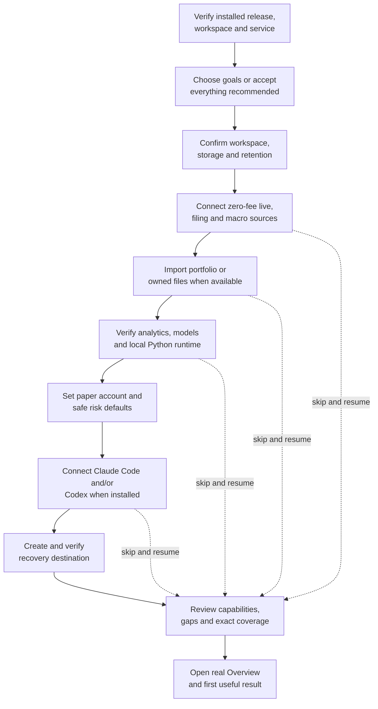

### Setup contract

Each step states:

- what outcome it enables;
- whether it needs no account, a zero-fee account, a provider-issued key, a file, or local disk;
- what Market Squawk will contact or change;
- the expected time and disk impact;
- the current evidence-backed readiness state;
- one primary action and an accessible back/cancel action; and
- how to resume or change the choice later.

The first useful result should normally appear within five minutes on supported hardware and
network conditions. Setup may continue afterward from a durable checklist on Overview. Closing the
application preserves completed checkpoints and never converts skipped work into success.

### Provider and credential steps

Provider setup uses named goals and recommended starter choices. It opens only official provider
pages when a human account or key action is required, returns through a protected loopback handoff
where supported, and stores secrets through the OS keyring first or the encrypted local fallback.
Secrets are write-only in the UI and never appear in normal logs, browser storage, artifacts, or
status payloads.

The setup portal removes the search-and-guesswork burden even when a provider controls account
creation. **Connect** opens the exact official enrollment or key page automatically, explains the
required fields in the Market Squawk window, preserves the setup checkpoint, and resumes at the
correct verification step. When a provider offers an official device-authorization, OAuth,
loopback-callback or key-management API suitable for installed applications, Market Squawk may use
that supported flow after provider-specific security review. Otherwise the human completes the
provider-controlled form and Market Squawk accepts only the returned credential or explicit user
paste. For providers without a supported account-creation interface, the portal still owns exact
navigation, instructions, durable resume, credential capture, verification and activation while
the provider owns the identity, consent and account form.

The UI reports actual provider coverage and data-quality limits. A successful Coinbase or Kraken
connection cannot imply live equity coverage. A source heartbeat cannot imply current prices.

### Controlled file imports

Desktop imports use the native file picker and return an opaque import ticket to the application.
Browser fallback uses a bounded staging area. The workflow is:

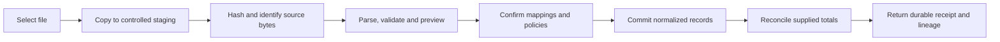

Original bytes or an immutable source reference, content hash, parser version, mappings,
normalization decisions, warnings, and reconciliation results are retained. Cancel before commit
leaves no partial authority publication. A failed commit is recoverable and idempotent.

## Application shell and navigation

The approved **Obsidian Signal** visual contract remains binding: shadcn/ui
`new-york-v4/sidebar-07` structure, near-black canvas, graphite surfaces, restrained cobalt
interaction color, Geist typography, Lucide icons, shallow surface hierarchy, no decorative
gradients or glow, and keyboard/accessibility parity.

The permanent navigation is:

```text
Market Squawk / active workspace
────────────────────────────────
Overview
Lookup
Markets
Sources
Research
Portfolios
Models
Backtests
Paper Execution
Risk
Fair Value
MCP
────────────────────────────────
Operations
Updates
Backup & Recovery
Logs
Settings
```

The title bar contains a persistent **Search or look up…** entry and the platform-correct
Command/Ctrl-K shortcut. Global health appears in the narrow status rail with exact text, not only
color. Page actions are contextual and bounded.

TradingView Lightweight Charts is used for market and forecast series. Recharts is used for
portfolio, attribution, exposure, and scenario visualizations. `cmdk` supplies the keyboard-first
command/search experience. These libraries provide presentation primitives; Market Squawk retains
domain truth, data qualification, accessibility, and security responsibility.

## Dashboard capability model

The dashboard is not a command catalog. A capability appears there only when it helps a person
complete an understandable task. CLI and MCP expose the broader typed service surface for advanced
composition and AI reasoning.

A dashboard workflow is complete only when it provides:

1. a clear user goal and required inputs;
2. typed validation and authority checks;
3. real application-service execution;
4. useful progress when work is not immediate;
5. success, empty, degraded, cancelled, and failure states;
6. a durable receipt, result, or artifact where applicable;
7. recovery or next-action guidance; and
8. links to provenance, quality, assumptions, and related work.

A generic selector that invokes one of many operations and prints raw JSON does not satisfy this
contract. Raw payloads may exist in an explicitly labelled diagnostic view.

## Overview

Overview is the user's permanent home, setup resume point, and decision queue. It is responsive to
the user's connected data and does not fabricate empty portfolio or live-market states.

It prioritizes:

- portfolio value, cash, daily and total change, realized/unrealized gains, income, and benchmark
  performance;
- the proportion of holdings with qualified live, delayed, stale, modeled, or unavailable marks;
- top positions, concentration, sector/factor/currency exposures, attribution, and cash needs;
- drawdown, volatility, VaR, expected shortfall, scenario losses, and breached limits;
- market regime, macro changes, rates and scheduled catalysts relevant to held or watched assets;
- candidate ideas and their screen/model/valuation/backtest state;
- targets or theses needing review because price, inputs, model, horizon, or assumptions changed;
- paper orders, fills, positions, rejections, risk decisions, and reconciliation state;
- source, dataset, model, MCP, backup, update, and job problems that require action; and
- remaining setup items with an honest explanation of what each unlocks.

The default ordering is attention and decision value, not a wall of equal-size metric cards. Every
number links to its source time, quality, and calculation details.

## Lookup

Lookup provides both a persistent quick entry and a dedicated workspace immediately after
Overview. It searches:

- instruments and identifiers, including ticker, venue symbol, CUSIP, ISIN, SEDOL, FIGI, OCC,
  futures identity, crypto pair, chain address, provider IDs, and symbol history;
- companies, funds, indexes, filings, facts, statements, and corporate actions;
- macro series, observations, vintages, yield curves, and releases;
- accounts, portfolios, holdings, transactions, orders, fills, and cash flows;
- datasets, features, labels, models, predictions, backtests, valuations, targets, artifacts, and
  lineage; and
- application settings, help, diagnostics, and bounded actions.

The deterministic local query layer handles identifier resolution, filters, dates, commands, and
typed closed queries without an LLM. Optional Claude Code or Codex use through MCP may interpret
richer natural language, but the user can access the full core product without an AI provider.

Search results state why they matched, the relevant date/venue/portfolio, current quality, and the
next useful actions. Lookup never becomes arbitrary filesystem access, unrestricted SQL, credential
search, or remote code execution.

## Markets and live portfolio truth

Markets combines qualified live state, venue comparison, research context, and portfolio relevance
without weakening the separation between live execution and research data.

### Unified feed and provider federation

Markets is one non-technical feed, search surface, and instrument workspace. Users choose an
investment or question, not an upstream provider. A bounded resolver selects the richest admitted
observation that satisfies the requested asset, timing, depth, quality, and operation requirements.
The normal UI exposes plain availability and confidence language; exact provider, venue, coverage,
depth, timestamps, rights, quality, integrity, selection reason, and downgrade evidence remain
available under **Data confidence**.

One per-user Market Squawk service owns all provider connections, shared request/subscription
budgets, caches, cursors, and recovery generations for Desktop, CLI, MCP, models, and jobs.
Provider-native actors retain their own snapshot, sequence, checksum, reconnect, and quarantine
rules. Failure of one source cannot mutate another source's state, and a fallback never inherits the
failed source's quality or coverage.

The full admitted instrument universe is locally searchable. Live subscriptions remain bounded and
prioritize holdings, open positions and paper orders, watchlists, active screens, the currently
viewed instrument, and a small benchmark set. This provides broad discovery without continuously
streaming thousands of unused instruments or duplicating requests across product clients.

The V1 installation requires no mandatory paid data service and provides the best available depth
from admitted sources. Order-level depth is shown only where the exact venue/product supplies it.
The reviewed evidence does not establish universal free order-level coverage for US equities,
options, futures, foreign exchange, and crypto; calculated indexes are benchmarks and have no
native order book. Market Squawk must show a truthful gap rather than inventing depth or silently
substituting a tradable ETF proxy for an index.

The binding provider and reuse evidence is recorded in
[`Unified Markets provider ecosystem`](../../research/2026-08-08-unified-markets-provider-ecosystem.md).

### Market workspace

For a selected instrument, the primary workspace shows:

- current trade, quote, spread, midpoint, microprice, venue and trading status;
- top-of-book or available depth with the explicit [`MarketDepth`](../../reference/data-quality.md)
  classification;
- source time, receive time, freshness, coverage, sequence/checksum state and data quality;
- historical price/volume, corporate actions and compatible total-return views;
- incremental spread, imbalance, order flow, VWAP, momentum, volatility, liquidity and slippage
  features where inputs qualify;
- cross-venue comparison without silently treating partial venues as consolidated coverage;
- filings, fundamentals, macro context, targets, forecasts and related portfolio positions; and
- actions to add to a watchlist, open Research, compare a model, review targets, run a backtest, or
  create a paper-order draft.

Heartbeat health and market freshness are separate. A disconnected, sequence-broken, crossed,
checksum-failed, out-of-date, or otherwise invalid stream is degraded or quarantined and cannot
produce executable signals. Only evidence-derived `DirectVerified` state is eligible for immediate
automated action by default.

### Portfolio mark waterfall

Every holding uses the following explicit mark policy:

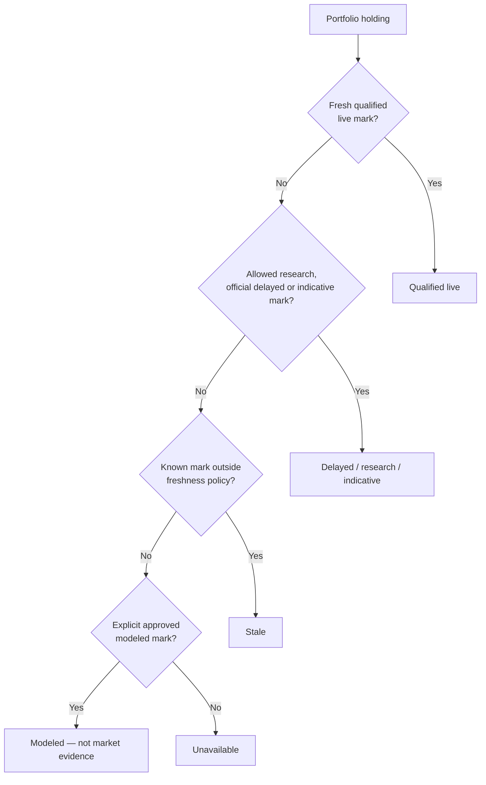

Portfolio totals show the percentage and notional value in each mark state. Holding rows expose the
source, venue, observation time, received/available time, quality, and fallback reason. A mixed-
quality portfolio total carries the weakest material classification and a visible coverage
breakdown rather than a false single “live” badge.

Coinbase and Kraken do not supply live equity holdings. A V1 claim of live stock-portfolio marking
therefore requires a working authorized zero-fee equity adapter whose documented coverage states
whether it is single venue, partial, delayed, or consolidated. Until that evidence exists, equity
marks are labelled by their actual research/delayed/stale state. The dashboard must never simulate
live equity coverage from crypto feeds or modeled values.

### Sources workspace

Sources is the permanent operating view for every configured and available source. It presents:

- purpose, asset/data class, account/key requirement and exact coverage;
- connection, extraction, cursor, schedule and last-success state;
- separate connection health, data freshness and quality/qualification state;
- current venue/instrument/series/object coverage and material gaps;
- sequence, checksum, snapshot/resynchronization and quarantine evidence for live sources;
- provider limits, backoff/cooldown, request budget and next eligible operation;
- stored source records, payload hash/reference, manifests, deduplication and lineage;
- credential-present/verified/rotation-required state without revealing the secret;
- start, stop, retry, resynchronize, verify, reconfigure and remove actions where safe; and
- direct links to affected markets, datasets, holdings, jobs, logs and setup steps.

Adding or changing a source returns to the guided provider workflow. Removing one previews affected
datasets, portfolio marks, models, schedules and paper eligibility before confirmation. Source
health changes produce typed events and attention items; they do not silently switch execution to
a lower-quality source.

## Research, models, and investment decisions

### Research workspace

Research organizes evidence around a question or instrument rather than exposing storage tables as
the primary experience. It includes:

- point-in-time price, corporate-action and total-return history;
- filings, XBRL facts, normalized statements, ratios, margins, growth and free-cash-flow measures;
- macro series and ALFRED vintages with publication, availability and revision history;
- comparable securities, factor exposures and valuation multiples;
- portfolio transactions, cost basis and supplied-total reconciliation;
- source coverage, quality results, schema versions, manifests, lineage and deduplication receipts;
- saved screens, feature datasets, labels, model predictions, backtests and valuation work; and
- export to controlled Arrow, Parquet, chart, table or report artifacts.

Point-in-time research uses effective, publication, availability, ingestion, revision and
supersession times deliberately. A screen, dataset, model or backtest must select only information
available at the simulated decision time. The data may come from sources different from the live
feed; historical replay is optional diagnostic tooling, not a prerequisite.

### Candidate discovery

The user can define a universe and screen using price/liquidity, quality/coverage, fundamental,
valuation, growth, profitability, leverage, earnings, macro, factor, portfolio-fit and model
criteria. The result explains inclusion/exclusion and the exact data vintage. Historical
constituents, delisted instruments, corporate actions and missing-value policy are explicit.

Candidates enter a funnel:

```text
Discovered → screened → evidence review → modeled/valued → tested
           → portfolio/risk review → watch / reject / paper expression
```

The funnel preserves rejected ideas and reasons so a failed thesis is not quietly rewritten after
the fact. Users can compare candidates across expected return, downside, uncertainty, liquidity,
portfolio diversification, factor/currency exposure, catalysts and evidence coverage.

### Models workspace

Models presents admitted and proposed model bundles with:

- artifact and hash, format/version, training code revision and admission state;
- feature schema/versions, normalization and missing-value rules;
- training period, dataset versions, universe, label definition and time semantics;
- train/validation/test or walk-forward boundaries;
- metrics by horizon, regime, instrument group and confidence bucket;
- calibration, residuals, drift, coverage and failure behavior;
- current and historical predictions with source inputs and model vintage;
- decisions or targets influenced by the model; and
- guided evaluate, compare, train, cancel, review, admit or reject workflows as authorized.

Native Rust and ONNX-compatible inference are supported in the product runtime. Python is used for
training, research and visualization and is not placed in the live event-to-action path. An
inference error produces no automated action.

### Model-risk presentation

Market Squawk applies the practical principles in the Federal Reserve's model-risk guidance:
effective challenge, validation independent from construction where practical, ongoing monitoring,
outcomes analysis, limitations, governance and controlled change. The dashboard therefore shows
model versions and limitations at the decision point instead of hiding them in a registry. The
same design also follows the NIST AI Risk Management Framework's emphasis on governing, mapping,
measuring and managing risk across the lifecycle. See
[Federal Reserve SR 11-7](https://www.federalreserve.gov/supervisionreg/srletters/sr1107.htm) and
[NIST AI RMF](https://www.nist.gov/itl/ai-risk-management-framework).

These sources inform product controls; they do not assert that Market Squawk or its users are
subject to banking supervision.

## Targets and predictive charts

### Versioned target sets

A target is a documented research judgment, not a free-floating price field. A target set may
contain:

- buy/entry range;
- add range;
- base case;
- upside case;
- downside case;
- trim range;
- exit/sell range; and
- invalidation, catalyst and review triggers.

Every version retains:

| Category | Required content |
| --- | --- |
| Identity | Target ID/version, instrument, relevant portfolio/account, creator and status |
| Time | Created, effective, source-mark, horizon, expiry, reviewed and superseded times |
| Value | Currency, target/range, current reference mark and reference-mark quality |
| Method | DCF, comparables, historical range, scenario-weighted, admitted model, or explicit compatible blend |
| Evidence | Dataset, statement, macro vintage, model, feature and valuation versions plus lineage |
| Assumptions | Revenue, margins, cash flow, multiples, rates, probabilities, catalyst and sensitivity inputs |
| Decision context | Expected return, downside, risk/reward, confidence, liquidity and portfolio impact |
| Governance | Review reason, override, approval where required, warnings and immutable history |

The product recomputes decision context when a qualified mark changes but never silently rewrites
the user's approved assumptions. Materially stale inputs, expired horizons, superseded data,
invalidated models, corporate actions or breached assumptions change the target to **Needs review**.

Targets can create alerts, watch items, review tasks and prefilled paper-order drafts. They do not
submit an order, bypass risk, promote modeled values to market evidence, or authorize live
execution.

### Predictive price chart

When a valid admitted model provides the required output, an instrument chart may show:

- observed historical prices as solid candles or lines;
- an explicit vertical **Forecast begins** boundary;
- a dashed central forecast;
- calibrated 50%, 80% and 95% intervals when the model genuinely supports them;
- deterministic scenario paths separately styled from statistical predictions;
- user target ranges and invalidation levels as separately labelled overlays;
- model and horizon comparison;
- hover details for model/version/vintage, as-of time, horizon, units, assumptions and uncertainty;
  and
- prior forecast vintages against subsequent actual outcomes.

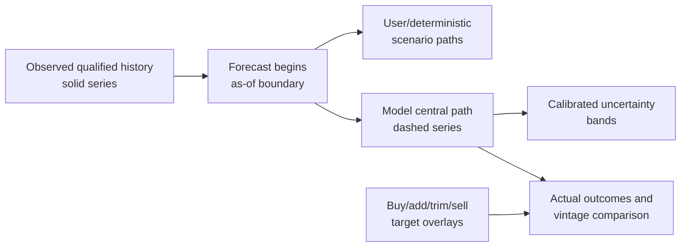

Observed prices, deterministic scenarios, statistical forecasts, valuation cases and user targets
must never share an indistinguishable line style or legend label. If the model lacks calibrated
intervals, compatible time semantics, admitted bundle state, required features, or a valid output,
the chart explains why no forecast is available; it does not manufacture a smooth projection.

TradingView Lightweight Charts 5.2 is the selected maintained chart primitive because it supports
financial time series, series markers, custom series primitives and performant interactive
rendering. Market Squawk supplies forecast semantics and accessibility. See the
[official documentation](https://tradingview.github.io/lightweight-charts/docs/api),
[series-marker guidance](https://tradingview.github.io/lightweight-charts/tutorials/how_to/series-markers),
and [series primitives](https://tradingview.github.io/lightweight-charts/docs/plugins/series-primitives).

## Backtests and scenarios

Backtesting is a user-facing validation workflow, not a hidden terminal task. The guided builder
selects:

- universe, historical membership and delisting policy;
- research datasets and point-in-time cutoff semantics;
- signal, feature, model, target or strategy version;
- train/evaluation boundaries and walk-forward schedule;
- corporate-action and missing-data policies;
- starting capital, position sizing and rebalancing;
- fees, spread, slippage, latency, partial fill and liquidity assumptions;
- benchmark, constraints and risk limits; and
- deterministic seed and reproducibility metadata where applicable.

Results cover return, drawdown, volatility, Sharpe, Sortino, tracking error, information ratio,
turnover, costs, exposures, attribution, VaR/expected shortfall, calibration and failure/rejection
statistics. Users can compare variants and periods, inspect trades and decisions, and see results
by regime, horizon and instrument group.

Backtests test the behavior of a decision rule or model under declared assumptions. They may inform
confidence, expected-return distribution, target context, portfolio sizing and risk limits, but do
not directly create a valuation price or prove future performance. The product explicitly compares
paper outcomes with backtest expectations so drift and unrealistic assumptions remain visible.

Scenario analysis remains distinct from statistical prediction. It lets users apply shocks to
prices, rates, curves, spreads, volatility, FX, factors, fundamentals or cash flows and inspect the
portfolio, valuation and risk consequences. Scenario probabilities are optional and explicit;
unweighted cases are not presented as forecasts.

## Portfolio, risk, fair value, and paper execution

### Portfolio

Portfolio workflows cover accounts, holdings, transactions, cash flows, cost basis, realized and
unrealized gains, income, performance, allocation, sector/factor/currency/instrument exposure,
attribution, rebalancing, risk and scenarios. Imports preserve source records and reconcile
calculated balances and totals against supplied values. Unresolved breaks remain visible and block
claims of reconciled readiness.

The candidate and target workflows show marginal portfolio impact: concentration, factor and
currency change, liquidity, risk contribution, capital usage, scenario loss and conflicts with
existing holdings. The product thereby connects security research to the user's actual portfolio
instead of showing isolated predictions.

Recharts is the selected maintained visualization library for portfolio and analytical charts; its
composable chart primitives suit allocation, attribution and scenario views while Market Squawk
retains calculation authority. See [Recharts official documentation](https://recharts.github.io/en-US/).

### Risk

Risk displays the limits and decisions enforced by the central risk service:

- source quality and freshness;
- instrument and account eligibility;
- position, notional, exposure, leverage and capital limits;
- price, slippage and liquidity bounds;
- order-rate and duplicate controls;
- loss and drawdown limits; and
- intent expiry and operating mode.

Every rejection or approval includes typed reason codes and supporting evidence. A dashboard action,
CLI request, MCP tool, strategy, model or execution adapter cannot bypass this service.

### Fair value

Fair Value manages measurements, inputs, methods, hierarchy classifications, reasons, evidence,
ruleset versions, overrides and approvals. Fair-value hierarchy, market depth and data quality use
separate types and language.

A Level 1 candidate requires an identical instrument, quoted price, active and accessible market,
measurement-date relevance, no disqualifying adjustment, valid source/venue evidence and sufficient
freshness. Delayed, stale, proxy, adjusted, modeled or similar-instrument values cannot silently
qualify. Level 2 and Level 3 evidence remains analytical and never becomes execution-quality data.

### Paper execution

Paper Execution is the safe expression and learning layer for research decisions. It shows order
intents, risk evaluation, approved orders, realistic fees/latency/slippage, partial fills,
rejections, cancellation, balances, positions, state transitions and reconciliation. Each order
links back to the target, thesis, model/strategy and market-quality evidence that caused it.

The default is controlled manual paper operation. Automated paper strategies require explicit
configuration, centralized risk, start/stop controls, health, loss limits and durable audit. Live
execution is optional, separately configured, and not activated by this V1 dashboard design.

## Long-running work and progress

Current Python training and current backtesting are blocking terminal-style operations at the audit
base. That is insufficient for a desktop application. V1 introduces one durable job authority for:

- source ingestion and normalization;
- dataset build, publication and compaction;
- features and labels;
- model training, evaluation, calibration and admission;
- backtests and scenario batches;
- portfolio reconciliation;
- controlled export;
- backup, restore, repair and update preflight; and
- other bounded application work that outlives an immediate request.

### Job contract

Every job has:

| Field | Meaning |
| --- | --- |
| Identity | Stable job ID, kind, workspace, initiating client and correlation/request ID |
| Inputs | Immutable input identities, parameters, dataset/model versions and authority snapshot |
| State | `Queued`, `Preparing`, `Running`, `AwaitingConfirmation`, `Cancelling`, `Completed`, `Failed`, `Cancelled`, `Interrupted` or `Recovering` |
| Progress | Current phase, monotonic event sequence, generation and timestamp |
| Units | Completed/total units only when objectively measurable; otherwise indeterminate |
| Diagnostics | Typed warnings and errors with redacted context and recommended action |
| Outputs | Receipts, result identity, artifact references, metrics and lineage |
| Recovery | Checkpoint/restart policy, cancellation boundary and terminal cleanup evidence |

The application service exposes `start`, `get`, `watch`, `cancel` and bounded `list` operations.
Desktop subscribes through the Rust presentation layer, which validates service events and forwards
only window-scoped typed events into the WebView. CLI exposes start/status/watch/cancel. MCP uses
standard task semantics when the negotiated protocol supports them and typed job tools/resources
otherwise.

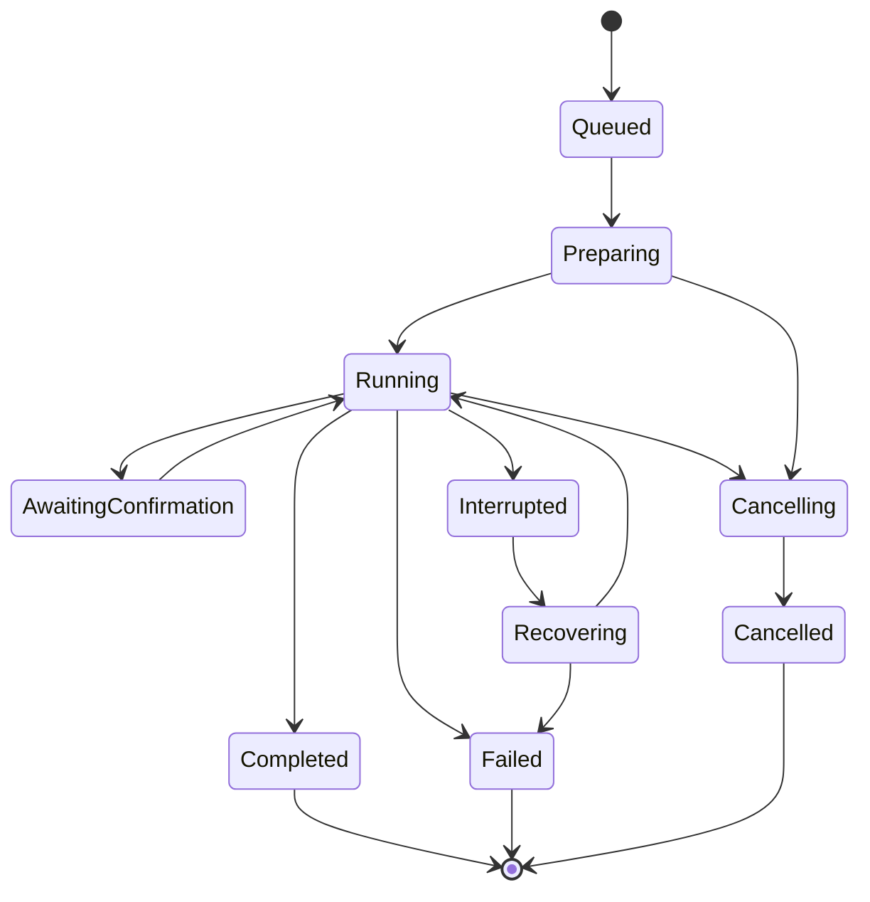

Percentage is shown only when meaningful units exist. Otherwise the UI shows the named phase,
elapsed time, current checkpoint and indeterminate activity. Cancellation is cooperative and
bounded; the UI distinguishes “requested” from “completed.” A lost window or client session does
not kill a durable job.

### Python worker protocol

Rust remains the job and authority owner. Python workers communicate through a versioned,
machine-readable bounded protocol with these event kinds:

```text
phase | progress | warning | result | error
```

Events include job ID, protocol version, monotonic sequence, phase, safe human message, optional
real units and redacted structured details. Human logs use a separate stream. Rust validates event
ordering, size, schema and terminal-result identity before publishing state.

Training phases are at least:

```text
validating environment
→ resolving dataset
→ verifying point-in-time inputs
→ building matrix
→ fitting
→ validating
→ calibrating
→ encoding bundle
→ validating candidate
→ awaiting confirmation when required
→ admitting
→ completed
```

Backtest phases are at least:

```text
resolving inputs
→ validating point-in-time and leakage policy
→ initializing strategy and execution assumptions
→ processing events
→ reconciling decisions, orders and fills
→ calculating metrics
→ writing artifact
→ indexing result
→ completed
```

Progress UI follows WCAG status-message guidance: changes are programmatically announced without
moving focus; blocking failures receive appropriate urgency; reduced-motion preferences are
respected. See [WCAG 2.2 status messages](https://www.w3.org/WAI/WCAG22/Understanding/status-messages.html).

### Operations workspace

Operations shows active and recent jobs, service/source runtimes, storage pressure, artifact use,
scheduled work and recovery state in one bounded view. Users can filter by domain/client/status,
open the owning workflow, inspect phase history and warnings, cancel when allowed, retry from a
declared boundary, or export a redacted diagnostic receipt. It does not expose process-kill,
arbitrary shell, raw database mutation or filesystem controls. Operational health remains local and
requires no telemetry service.

## Shared MCP service

### Service decision

V1 uses one lightweight background service per signed-in OS user. It runs with that user's
permissions, not as a privileged system daemon. It starts on demand and at user login after
installation, remains resource-light when no sources/jobs/paper operations are active, and owns one
active workspace.

Platform integration uses the operating system's established per-user lifecycle:

- an owner-scoped macOS LaunchAgent in `~/Library/LaunchAgents` across the macOS 12+ floor;
- `systemd --user` in supported Ubuntu sessions without mandatory linger; and
- a Task Scheduler 2.0 logon task bound to the exact current-user SID, interactive token, and
  least-privilege run level on Windows.

Relevant platform references are
[Apple's launchd guidance](https://developer.apple.com/library/archive/documentation/MacOSX/Conceptual/BPSystemStartup/Chapters/CreatingLaunchdJobs.html),
[`systemd` project guidance](https://www.freedesktop.org/wiki/Software/systemd/),
[`pam_systemd` user-manager behavior](https://www.freedesktop.org/software/systemd/man/252/pam_systemd.html),
and Microsoft's [logon-trigger documentation](https://learn.microsoft.com/en-us/windows/win32/taskschd/starting-an-executable-when-a-user-logs-on) and [least-privilege run-level documentation](https://learn.microsoft.com/en-us/windows/win32/taskschd/principal-runlevel).

The macOS 12 floor is retained: registering an unprivileged per-user LaunchAgent does not require a
paid Apple credential. `SMAppService` starts at macOS 13 and therefore cannot be the only path.
Paid Developer ID/notarization affects distribution trust and user friction, not whether the
signed-in user may register the LaunchAgent.

### Transport and authentication

The shared endpoint is modern MCP Streamable HTTP bound only to `127.0.0.1` on an install-selected
stable port. Market Squawk explicitly selects the stable `2026-07-28` protocol and its stateless,
per-request discovery and metadata model. The service accepts POST only, does not mint or require
`Mcp-Session-Id`, and does not implement standalone GET/DELETE or `Last-Event-ID` replay on its
primary path. See the stable [MCP base
protocol](https://modelcontextprotocol.io/specification/2026-07-28/basic), [versioning
rules](https://modelcontextprotocol.io/specification/2026-07-28/basic/versioning), and [Streamable
HTTP transport](https://modelcontextprotocol.io/specification/2026-07-28/basic/transports/streamable-http).

RMCP 3.1 is used behind a narrow Market Squawk protocol facade. The facade explicitly selects
`V_2026_07_28`, advertises only the admitted versions, disables legacy HTTP session mode, requires
modern stateless metadata, and closes Host, Origin, authorization, body, deadline, and admission
policy before handler dispatch. It does not rely on RMCP's `LATEST`, all-known-version, legacy
client, or automatic-fallback defaults. A named client compatibility path may accept the legacy
`2025-11-25` lifecycle only at its stateless stdio relay boundary; legacy protocol state never
becomes shared-service authority.

A single-instance guard and owner-only rendezvous record contain the active service generation,
endpoint, protocol range, installation identity, workspace identity and process identity. A second
launch verifies the authenticated owner and connects or exits without opening product state. A
port collision is a visible repair condition: the repair flow selects and persists a new admitted
endpoint and updates owned client registrations atomically; the service never silently changes
ports while clients retain the old endpoint.

Each client registration receives a separate high-entropy bearer credential. Credentials are
stored through protected per-user facilities, hashed or otherwise non-recoverably represented by
the service where possible, scoped, revocable and rotatable. Claude Code and Codex do not share a
single plaintext token. The service validates `Origin`, host, method, content type, protocol
version, per-request metadata, token, client identity, bounded request size and client limits before
dispatch. A present non-allowlisted Origin is rejected; a non-browser client may omit Origin.

The authorization model follows the stable MCP security boundary without requiring a remote
authorization server for this private loopback service. Product credentials, scopes, explicit
handles, job ownership, limits, and audit remain Market Squawk authorities on every request; no
connection or prior request conveys implicit authority.

### Client registration and discovery

Setup discovers supported Claude Code and Codex installations and offers an explicit, previewable,
idempotent **Connect** action. It invokes each installed client's official CLI to create one
user-level stdio registration pointing at the stable Market Squawk relay, records an owner-only
receipt, and verifies a real MCP exchange. It does not edit client configuration files directly.
Re-running setup updates the owned entry instead of creating duplicates. Disconnect removes only
configuration owned by Market Squawk.

The stable logical server name is `market-squawk`. Setup never creates suffixes such as
`market-squawk-1`. It preserves unrelated client settings and refuses to overwrite a same-name
user-owned entry; instead it shows the exact scope/location conflict and offers a minimal reviewed
repair. The registration receipt records client, logical name, endpoint identity, credential
identity, normalized relay command and arguments, observed registration and receipt version. It
stores no secret.

Codex registration uses the effective user configuration so its supported local surfaces see one
entry. Claude Code registration uses user scope so the service is available across projects and
sessions; project-local entries are not the normal installed-product route. Exact paths and editing
rules remain versioned client adapters because both clients can change their formats.

MCP itself is always installed. If the user skips client connection, the MCP page reports Claude
Code or Codex as **Ready to connect** when detected—not **Not installed**—and connection can be
completed later without reinstalling Market Squawk.

The implementation refresh gate verifies exact current `add`, `get`, `list`, and `remove` commands
through the official [Codex MCP guide](https://learn.chatgpt.com/docs/extend/mcp) and [Claude Code
MCP documentation](https://code.claude.com/docs/en/mcp).

The default installed integration is a stateless stdio relay because it keeps bearer credentials
out of client configuration and command arguments. The relay performs no catalog, model, source,
job, or application work; it resolves the admitted active service, reads only its named client's
credential through native secret authority, and adapts bounded MCP stdio requests to the shared
service. It accepts a named client's legacy lifecycle only when current client evidence requires
it, translates no implicit protocol session into product authority, and terminates without stopping
the shared service. Direct HTTP registration remains an advanced path only when the client can
protect and inject its distinct credential.

### Concurrency and resource boundaries

The service shares read-only caches and heavy runtimes but isolates credentials, requests,
cancellation, explicit product handles, subscriptions and audit identity per client. It enforces:

- bounded concurrent requests and jobs by class;
- per-client and global output, artifact, time and memory budgets;
- cancellation and disconnect cleanup;
- fair scheduling so one AI client cannot starve the desktop or another client;
- one writer for authority-critical state;
- explicit conflicts for workspace switching, update, restore and paper-operation boundaries; and
- no unbounded response retention or implicit sharing of conversation histories.

Claude Code and Codex may see the same underlying Market Squawk data and durable application
artifacts. Their prompts, conversation memory, request state and private client state are not
merged. If a durable research note or target should be shared, it is saved explicitly as a Market
Squawk domain artifact with provenance and permissions.

### MCP tool and resource experience

MCP exposes bounded typed tools and resources across Source, Market, Research, Fundamental, Macro,
Portfolio, Analysis, Model, FairValue, Bot and Execution domains. It does not expose arbitrary
shell, filesystem, network or SQL authority; unchecked order submission; risk bypass; credentials;
audit deletion; or remote code loading. Large outputs become controlled artifacts returned by
reference.

The dashboard MCP page shows:

- service version, endpoint, active workspace, health and resource use;
- Claude Code and Codex discovered/connected/verified state;
- active clients/relays, request/job counts and last activity without conversation contents;
- negotiated MCP version, available tool/resource domains and result limits;
- a real test action that performs current discovery, tool/resource listing and a safe read;
- credential rotation, revoke, reconnect and owned-config repair;
- blocked or rate-limited requests and typed reasons; and
- links to logs and audit records.

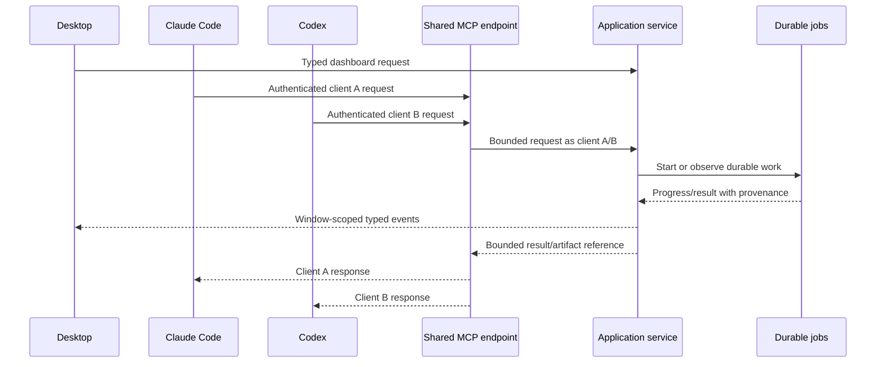

MCP remains outside the live market event-to-action path. An AI request cannot block socket
processing, book updates, strategy inference, risk or execution.

## Updates and lifecycle operations

Updates operate on one closed product release, not independently drifting components. The desktop
may check automatically after the user has reached first value and no more than once daily when it
opens. This behavior is disclosed and configurable. It never installs an update without explicit
user approval in V1.

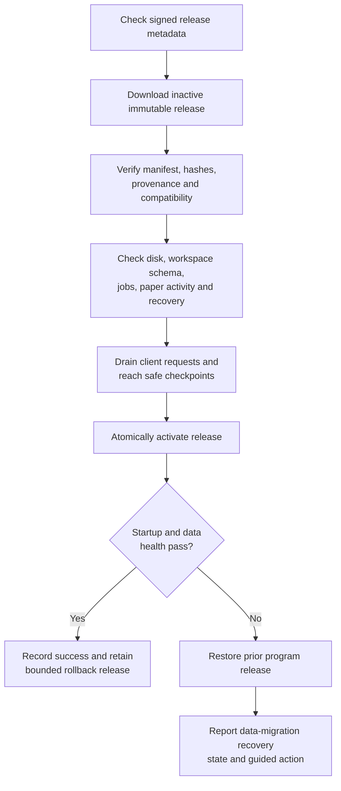

The stable service rendezvous and client registrations survive compatible updates. Update preflight
must not interrupt live capture, a durable data publication, paper operation, backup/restore or
model admission without reaching its declared safe boundary. Program rollback is automatic after
a failed startup health check; data migrations use forward-compatible backup/recovery rules and
are never blindly reversed.

The update model adopts The Update Framework's separation of trusted metadata roles, expiration,
versioning, hash/length verification and rollback/freeze protections. Exact release packaging may
use maintained Tauri and cargo-dist building blocks, but Market Squawk owns the closed component
manifest and activation evidence. See the [TUF specification](https://theupdateframework.github.io/specification/latest/)
and Tauri's [updater guidance](https://v2.tauri.app/plugin/updater/).

### Backup and recovery

Backup creates a coherent snapshot of the SQLite authority catalog, dataset manifests, controlled
artifacts, configuration and explicitly selected source data. It records included/excluded content,
versions, checksums, encryption state and verification evidence. The UI supports create, verify,
inventory, retention and preview-restore before an explicit restore.

Restore stops or fences incompatible writers, validates the backup, reports schema/product
compatibility, stages recovered state, verifies it and activates atomically. A failed restore leaves
the current workspace available or enters an explicit recoverable state; it never mixes partial
authority state into the active workspace.

### Logs, settings, repair and removal

- Logs are structured, redacted, bounded by retention, searchable by operation/job/source and
  exportable as a controlled diagnostic artifact.
- Settings use typed fields, validation, authority explanations and restart-impact labels; the
  normal UI is not a raw TOML editor.
- Repair verifies components, permissions, workspace/catalog state, client registrations, service
  lifecycle and recovery inventory before changing anything.
- Rollback shows the selected program version and data compatibility before activation.
- Uninstall removes the product while preserving user data by default; data purge is separate,
  explicit and inventory-driven.

## Security and trust boundaries

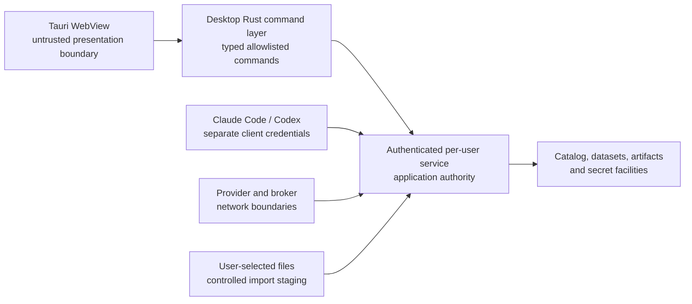

The WebView is not trusted with arbitrary native authority. Tauri capabilities and a restrictive
content-security policy expose only route-specific commands, events and file tickets. No remote
frontend code, remote assets, eval-like behavior or general shell/filesystem command crosses the
boundary. The guidance follows Tauri's current
[security model](https://v2.tauri.app/security/) and
[capability system](https://v2.tauri.app/security/capabilities/).

Other binding controls include:

- source and execution endpoint allowlists;
- known instrument/source/venue identity and explicit coverage;
- secret redaction and OS-keyring-first storage;
- bounded queues, requests, outputs, jobs, artifacts and controlled directories;
- durable audit identity for desktop, CLI, MCP client and automated strategy actions;
- no SQLite, DataFusion, Parquet, Python, MCP, LLM, filesystem or unrelated network call in the
  live event-to-action path;
- central risk authority for every order intent; and
- explicit quality/provenance/time semantics at every research or execution decision boundary.

## Capability coverage contract

The following matrix is the V1 product-usage contract. “Dashboard workflow” means a real workflow
meeting the success/failure/recovery definition above, not a placeholder page.

| Product capability | Required dashboard use | CLI/MCP use |
| --- | --- | --- |
| Instrument identity and resolution | Lookup, Markets, Research, Portfolio imports and target selection | Complete bounded resolve/search metadata |
| Provider onboarding and health | Setup, Sources and Overview attention queue | Register/configure/status/coverage/health |
| Multi-provider market data | Unified Markets feed/search/instrument view, portfolio marks, live features, opportunities, forecasts, targets, backtests, risk and paper decisions | Search, snapshots, trades, quotes, books, bars, benchmarks, source selection, quality, depth and comparison |
| SEC, FRED/ALFRED, BLS, Treasury | Sources, Research, filings/fundamentals/macro, models and decision dossiers | Discover/extract/status/query with vintages |
| CSV/JSON/NDJSON/Parquet and portfolio files | Guided import, preview, mapping, reconciliation and receipt | Bounded ingest and artifact operations |
| Arrow/Parquet/DataFusion datasets | Research datasets, screens, features, models, backtests and exports | Typed dataset build/query/manifest tools; no unrestricted MCP SQL |
| Point-in-time and revision semantics | Dataset builder, evidence panels, model/backtest validation | Typed time-bounded query/build operations |
| Live and research analytics | Markets, Research, Overview, Portfolio, targets and scenarios | Feature/analysis tools with provenance |
| Model bundles and inference | Models, forecast chart, candidate ranking, target evidence and risk context | Metadata/evaluate/predict/train/job tools |
| Python training | Guided Models workflow with durable progress, validation and admission review | Start/watch/cancel/result via job authority |
| Backtesting | Backtests workspace, model validation, target confidence, dossiers and paper comparison | Start/watch/cancel/result/artifact tools |
| Portfolio accounting and analytics | Overview, Portfolios, target portfolio-fit and scenarios | Holdings/transactions/performance/exposure/risk |
| Strategies, risk and paper execution | Paper Execution, Risk, order drafts, positions, fills and outcomes | Controlled operation; never risk bypass |
| Fair-value analysis | Fair Value and linked research evidence, kept distinct from market quality | Measurements/classification/explanation/evidence |
| MCP | Setup and MCP pages with real client verification, request/handle isolation, capabilities and repair | The external typed AI-client interface itself |
| Job authority | Global activity, page progress, notifications and recovery | Start/get/watch/cancel/list |
| Install/update/backup/log/settings | Setup, Updates, Backup & Recovery, Logs and Settings | Advanced lifecycle and diagnostics |

Every required backend capability must be reachable through CLI and, where safe and meaningful,
MCP. Not every backend operation needs a dashboard control. Conversely, every dashboard claim must
have a real application-service operation and verified data behind it.

## Failure and recovery behavior

| Failure | Required user-visible behavior | Recovery authority |
| --- | --- | --- |
| Per-user service unavailable | Desktop explains state, attempts bounded restart, preserves unsent input | Service lifecycle repair |
| Client MCP registration stale | MCP page identifies owned entry and previews repair | Idempotent client registration service |
| Source disconnected or invalid | Quality degrades/quarantines; live actions stop; exact reason shown | Source resynchronization and requalification |
| Equity live coverage absent | Portfolio explicitly shows delayed/stale/unavailable; no simulated live mark | Add and qualify authorized equity source |
| Dataset publication interrupted | Prior manifest remains authoritative; job becomes interrupted/recovering | Dataset publication recovery |
| Python worker crashes or emits invalid event | Job fails safely with captured phase; no model admission | Rust job/model authority |
| Model inference invalid | No forecast or automated action; limitation shown | Model evaluation/admission workflow |
| Backtest cancelled | Cooperative stop, partial work not published as final | Job authority and artifact cleanup |
| Portfolio reconciliation breaks | Imported source preserved; unreconciled state visible | Import/reconciliation workflow |
| Paper risk rejection | Intent retained with typed reasons; no order submission | Central risk service only |
| Update activation fails | Previous program release restored; migration state diagnosed | Lifecycle authority |
| Restore fails | Active state remains or explicit recovery state; no partial mix | Backup/restore authority |
| Disk budget threatened | New heavy work pauses before corruption; cleanup/recovery choices shown | Storage and job authority |

## Acceptance evidence

The design is satisfied only by clean, unchanged, exact-head evidence at the accepted candidate.
Screenshots, mocks, contracts and synthetic-only adapters are not production capability evidence.

### Installation and first run

- Native package and the terminal bootstrap install the same closed product on clean supported
  macOS, Windows and Ubuntu environments without preinstalled developer tools.
- Inventory proves every advertised component is installed and version-compatible.
- First launch creates/validates the workspace and service, opens the permanent shell and produces a
  real first useful result or an honest actionable unavailable state.
- Setup skips and resumes across process and machine restarts without losing completed evidence.

### Dashboard and data

- Each navigation route performs its intended real workflow and covers success, empty, degraded,
  failure, cancellation and recovery where relevant.
- Overview and portfolio marks prove source/time/quality coverage and never imply unsupported live
  equity data.
- Lookup resolves canonical and provider identifiers plus research/application objects with bounded
  response limits.
- Imports preserve source bytes/reference, hashes, lineage and reconciliation receipts.
- Research and backtests demonstrate point-in-time filtering and revision preservation.

### Models, targets and backtests

- A real managed-Python training job streams durable phases, supports cancellation, survives UI
  disconnection and results in a validated candidate bundle.
- Native and ONNX admitted bundles run local inference with typed failure behavior.
- A valid model renders forecast boundary/path/uncertainty and vintage-versus-actual evidence; an
  invalid model renders no forecast.
- Targets retain complete versioned evidence and become **Needs review** on material invalidation.
- A research backtest includes realistic costs and point-in-time semantics and links results to the
  model/target without presenting them as guaranteed outcomes.

### MCP and shared runtime

- Desktop, CLI, Claude Code and Codex concurrently use one per-user service and active workspace
  without duplicate stateful servers.
- Claude Code and Codex have distinct revocable credentials and isolated request/handle state.
- Setup registration is idempotent; repeated repair produces one owned entry per client.
- A real client-compatible handshake/discovery, capability listing and safe read succeeds from both
  clients, while the shared HTTP service proves stable `2026-07-28` discovery and stateless request
  metadata.
- Bounded concurrency, cancellation, disconnect cleanup and resource budgets are demonstrated.

### Lifecycle and security

- Update verify/preflight/drain/activate/health/rollback works against immutable test releases.
- Backup verify and staged restore preserve coherent catalog/dataset/artifact authority.
- Logs demonstrate redaction; WebView and MCP boundaries reject unauthorized access.
- Central risk prevents every tested bypass route and paper execution reconciles realistic state.
- Generated build and test artifacts remain within the repository's measured disk policy.

Verification stays thin and risk-focused: consolidate related integration scenarios, avoid
duplicate large harnesses, use focused lane gates during implementation, and run broad locked
workspace/release gates only at the defined delivery-quarter checkpoints and final candidate.

## Alternatives and rejected designs

### One backend per desktop or AI session — rejected

This superficially follows stdio MCP examples but duplicates catalogs, source connections, models,
jobs and memory; creates write conflicts; prevents a coherent desktop/client view; and makes
updates and recovery unsafe. Per-client request/handle state remains isolated, but heavy product
state is shared once.

### One machine-wide privileged daemon — rejected

It complicates permissions, multi-user isolation, installation and removal without providing a V1
benefit. A per-user service matches the private workspace and client-registration model.

### Shared MCP endpoint as the desktop's internal API — rejected

It would couple the product UI to an external AI protocol, widen the WebView boundary and force
dashboard semantics into MCP tool shapes. Desktop and MCP instead share application services.

### A second native IPC stack for desktop and CLI — rejected for V1

Unix-domain sockets and Windows named pipes were evaluated. They can provide strong local
boundaries, and Windows recommends named pipes for stream-based bidirectional IPC. However, V1
would still need loopback HTTP for Claude Code and Codex, so native IPC would add a second listener,
discovery path, framing implementation, Windows security-descriptor path, package-identity matrix
and recovery surface. A separately authenticated `/app/v1` route on the existing loopback listener
provides the required separation with already admitted Hyper infrastructure. The WebView remains
isolated by the Tauri Rust proxy and never receives the credential. Native IPC should be reconsidered
only if measured risk or platform restrictions invalidate this design.

### Direct shared mutable Cargo/target-style caches across worktree paths — rejected

The product runtime and development orchestration both require clear ownership. Mutable build
targets are not a product-state sharing model, and cross-path cache duplication previously caused
unbounded disk growth. Runtime sharing occurs through explicit service contracts; build reuse uses
the repository's bounded build policy.

### Raw command/JSON dashboard — rejected

It is useful as a diagnostic developer console but does not help a non-expert understand goals,
inputs, progress, results, provenance or recovery. CLI and MCP retain broad programmatic coverage;
the dashboard provides curated workflows.

### LLM-required search or dashboard — rejected

It adds an external dependency, cost/availability risk and non-determinism to core use. Typed local
search and workflows function independently. Claude Code and Codex are optional MCP clients.

### Independent component updates — rejected

Updating Python, models, desktop, service or schema independently creates incompatible product
states. V1 activates a verified closed release as one unit.

### Forecast line without uncertainty or vintage — rejected

It presents unjustified precision and prevents outcomes analysis. Missing required model semantics
means no forecast display, not a decorative extrapolation.

## Current gaps at the audit base

The following are design-input observations at the frozen audit base, not delivery-ledger status
updates:

- the current dashboard uses a generic domain operation selector and raw result presentation for
  many capabilities rather than the workflows defined here;
- the current MCP process model does not yet provide the required concurrent shared per-user service
  behavior for desktop, Claude Code and Codex;
- current Python training exposes synchronous propose/finalize/admit behavior and terminal JSON,
  not the durable progress protocol;
- the current Rust training launcher waits for Python completion and does not decode phase events;
- current model application operations cover list/metadata/evaluate/predict but not the complete
  train/watch/cancel/admit workflow;
- current prediction output does not yet provide the multi-horizon price paths and calibrated
  intervals required for the forecast chart;
- current backtest application flow returns terminal durable records but does not expose the full
  frontend job/progress contract;
- dashboard portfolio, investment-decision, target, forecast, backtest, lifecycle and MCP workflows
  require real service binding and acceptance evidence; and
- live equity coverage must be proven by an authorized zero-fee adapter before the product describes
  equity portfolio marks as live.

Implementation must refresh these claims against the integration head and remove an item only with
code and focused evidence. The delivery ledger remains the authoritative release-blocker record.

## Implementation refresh gate

Before writing or executing the implementation plan:

1. freeze and record the accepted integration commit and tree;
2. inspect all changes since this audit base for service, application operations, UI, installer,
   jobs, Python, backtest, MCP, lifecycle, dependencies and release packaging;
3. re-run the capability-to-dashboard mapping against actual code and ledger state;
4. verify the then-current stable MCP specification and Claude Code/Codex configuration formats;
5. verify supported Tauri, charting, frontend, Rust, uv, Python and ONNX dependency versions from
   their official sources and lock the chosen versions;
6. verify platform per-user service, packaging, trust-prompt and lifecycle behavior on clean current
   macOS, Windows and Ubuntu systems;
7. confirm that every implementation wave has disjoint file ownership except explicitly serialized
   manifests, lockfiles, application composition and authority hotspots;
8. define exactly four grouped delivery-quarter review checkpoints and exact-head evidence; and
9. preserve this design or record an explicit superseding decision for any changed product choice.

No item in this design is “implemented” because a contract, mock, screenshot or synthetic fixture
exists. The repository must remain runnable at the end of each integration wave.

## Related material and sources

### Internal product and architecture authority

- [`docs/project-memory.md`](../../project-memory.md)
- [`docs/plans/delivery-ledger.md`](../../plans/delivery-ledger.md)
- [Obsidian Signal interface design](2026-07-28-market-squawk-obsidian-signal-interface-design.md)
- [Provider onboarding design](2026-07-26-provider-onboarding-ux-design.md)
- [Normal installation and first-run research](../../research/2026-08-01-normal-installation-and-first-run.md)
- [Normal installation source matrix](../../research/2026-08-01-normal-installation-source-matrix.md)
- [Cross-platform installation research](../../research/2026-07-28-cross-platform-installation-and-guided-setup.md)
- [`docs/architecture/overview.md`](../../architecture/overview.md)
- [`docs/architecture/live-execution-plane.md`](../../architecture/live-execution-plane.md)
- [`docs/architecture/research-data-plane.md`](../../architecture/research-data-plane.md)
- [`docs/architecture/security-and-trust-boundaries.md`](../../architecture/security-and-trust-boundaries.md)
- [`docs/architecture/deployment.md`](../../architecture/deployment.md)
- [`docs/reference/mcp.md`](../../reference/mcp.md)
- [`docs/reference/data-quality.md`](../../reference/data-quality.md)
- [`docs/reference/time-and-provenance.md`](../../reference/time-and-provenance.md)
- [`docs/operations/backup-and-recovery.md`](../../operations/backup-and-recovery.md)

### Direct external decision sources

| Topic | Source and design use |
| --- | --- |
| Documentation structure | [Diátaxis](https://diataxis.fr/start-here/) for separating explanation, procedures, reference and learning |
| Desktop shell | [Tauri 2 security](https://v2.tauri.app/security/), [capabilities](https://v2.tauri.app/security/capabilities/), [sidecars](https://v2.tauri.app/develop/sidecar/), [single instance](https://v2.tauri.app/plugin/single-instance/), [dialog](https://v2.tauri.app/plugin/dialog/), [autostart](https://v2.tauri.app/plugin/autostart/) and [updater](https://v2.tauri.app/plugin/updater/) |
| UI foundation | [shadcn/ui sidebar-07](https://ui.shadcn.com/view/new-york-v4/sidebar-07), [cmdk](https://github.com/pacocoursey/cmdk), [Recharts](https://recharts.github.io/en-US/) |
| Financial charts | [Lightweight Charts API](https://tradingview.github.io/lightweight-charts/docs/api), [markers](https://tradingview.github.io/lightweight-charts/tutorials/how_to/series-markers), [primitives](https://tradingview.github.io/lightweight-charts/docs/plugins/series-primitives) |
| Accessibility | [WCAG 2.2 Quick Reference](https://www.w3.org/WAI/WCAG22/quickref/), [status messages](https://www.w3.org/WAI/WCAG22/Understanding/status-messages.html), [multi-page forms](https://www.w3.org/WAI/tutorials/forms/multi-page/) and [GOV.UK task-list pattern](https://design-system.service.gov.uk/patterns/task-list-pages/) |
| MCP transport and auth | Stable [MCP 2026-07-28 base protocol](https://modelcontextprotocol.io/specification/2026-07-28/basic), [versioning](https://modelcontextprotocol.io/specification/2026-07-28/basic/versioning), [stdio](https://modelcontextprotocol.io/specification/2026-07-28/basic/transports/stdio), [Streamable HTTP](https://modelcontextprotocol.io/specification/2026-07-28/basic/transports/streamable-http), and [changelog](https://modelcontextprotocol.io/specification/2026-07-28/changelog) |
| MCP clients | [Claude Code MCP](https://code.claude.com/docs/en/mcp) and [Codex MCP](https://learn.chatgpt.com/docs/extend/mcp.md) |
| Per-user services | [Apple launchd](https://developer.apple.com/library/archive/documentation/MacOSX/Conceptual/BPSystemStartup/Chapters/CreatingLaunchdJobs.html), [`systemd`](https://www.freedesktop.org/wiki/Software/systemd/), [`pam_systemd`](https://www.freedesktop.org/software/systemd/man/251/pam_systemd.html) and [Windows logon trigger](https://learn.microsoft.com/en-us/windows/win32/taskschd/logon-trigger-example--scripting-) |
| Private desktop/CLI transport | [Windows IPC and packaged-loopback guidance](https://learn.microsoft.com/en-us/windows/apps/develop/communication/interprocess-communication), stable [MCP loopback security requirements](https://modelcontextprotocol.io/specification/2026-07-28/basic/transports/streamable-http), and the repository's admitted Hyper transport; [XDG runtime directories](https://specifications.freedesktop.org/basedir-spec/latest/), [Tokio Unix sockets](https://docs.rs/tokio/latest/tokio/net/struct.UnixListener.html), [Tokio named pipes](https://docs.rs/tokio/latest/tokio/net/windows/named_pipe/) and [Windows pipe security](https://learn.microsoft.com/en-us/windows/win32/ipc/named-pipe-security-and-access-rights) document the native-IPC alternative reviewed but not selected |
| Managed Python | [uv Python management](https://docs.astral.sh/uv/concepts/python-versions/) and [Python 3.14 documentation](https://docs.python.org/3.14/) |
| Model governance | [Federal Reserve SR 11-7](https://www.federalreserve.gov/supervisionreg/srletters/sr1107.htm) and [NIST AI RMF](https://www.nist.gov/itl/ai-risk-management-framework) |
| Update security | [The Update Framework specification](https://theupdateframework.github.io/specification/latest/) |

### Installation ecosystem findings inlined into this design

The broader research reviewed 120 candidates and retained 108 current evidence items: 35
maintained repositories, 28 official platform/tool documents, 22 academic or industry papers, and
23 reputable operational/security sources. The repeated findings adopted here are:

1. native acquisition is the primary normal-user route, with a terminal bootstrap as an additive
   option;
2. the package installs a launchable complete product rather than asking users to assemble
   runtimes;
3. first run begins with a domain outcome while durable advanced setup remains available;
4. credentials and permissions are requested in context with effect and reversal explained;
5. program and user-data lifecycles are separate;
6. releases are verified and activated as coherent units with repair and rollback;
7. background helpers use platform lifecycle facilities and least per-user privilege; and
8. progress, cancellation and recovery are product features for long-running work.

Representative maintained projects studied for these patterns include
[GitHub Desktop](https://github.com/desktop/desktop),
[AppFlowy](https://github.com/AppFlowy-IO/AppFlowy),
[KeePassXC](https://github.com/keepassxreboot/keepassxc),
[Actual Budget](https://github.com/actualbudget/actual),
[GitButler](https://github.com/gitbutlerapp/gitbutler),
[Bruno](https://github.com/usebruno/bruno),
[Immich](https://github.com/immich-app/immich),
[Paperless-ngx](https://github.com/paperless-ngx/paperless-ngx),
[Ollama](https://github.com/ollama/ollama),
[Podman Desktop](https://github.com/podman-desktop/podman-desktop),
[Tailscale](https://github.com/tailscale/tailscale),
[RustDesk](https://github.com/rustdesk/rustdesk),
[rustup](https://github.com/rust-lang/rustup),
[uv](https://github.com/astral-sh/uv),
[cargo-binstall](https://github.com/cargo-bins/cargo-binstall),
[Tauri](https://github.com/tauri-apps/tauri), and
[cargo-dist](https://github.com/axodotdev/cargo-dist).

The complete selected source list, review dates and individual contribution notes are retained in
the tracked [source matrix](../../research/2026-08-01-normal-installation-source-matrix.md). The
design decisions and constraints derived from that research are fully stated in this document; the
matrix is audit evidence rather than required context for understanding the design.
