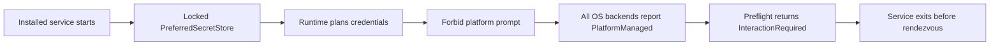
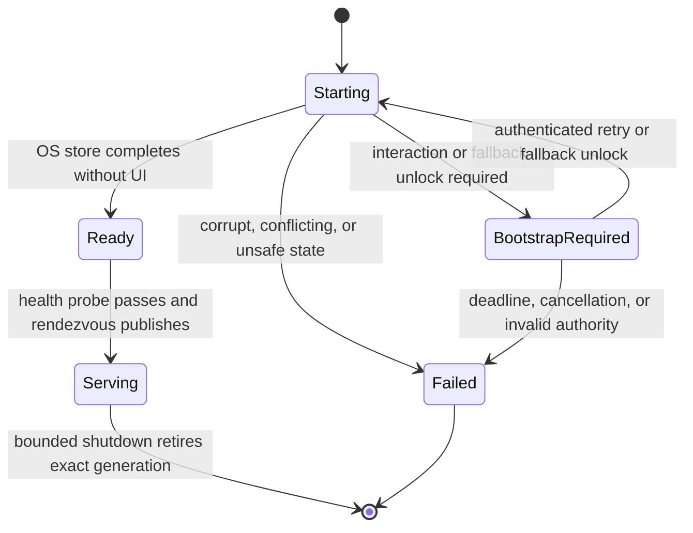
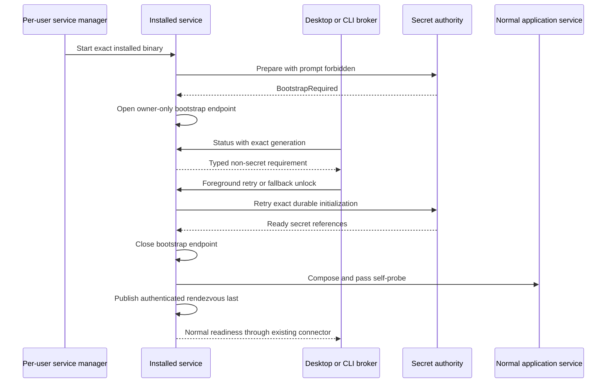

# Installed service credential-bootstrap repair

| Metadata | Value |
| --- | --- |
| Document type | Focused implementation amendment |
| Audience | Runtime, platform, installer, Desktop, CLI, packaging, and security maintainers |
| Status | Approved repair boundary; the user directed implementation on 2026-08-03 |
| Audit base | `2b93cdcdc03ab4107aabd93c15ad6c0e59746cc5` |
| Reviewed | 2026-08-03 |

This amendment repairs the credential bootstrap path within the approved
[V1 installed-product design](2026-08-01-market-squawk-v1-installed-product-experience-design.md).
The audit base is an implementation anchor, not release approval. Before implementation, the
worker must refresh every cited interface against the unchanged feature head.

## Contents

- [Problem and outcome](#problem-and-outcome)
- [Root cause](#root-cause)
- [Selected architecture](#selected-architecture)
- [Credential-store behavior](#credential-store-behavior)
- [Bootstrap protocol](#bootstrap-protocol)
- [Platform enforcement](#platform-enforcement)
- [Desktop, CLI, installer, and proof flows](#desktop-cli-installer-and-proof-flows)
- [Failure, recovery, and security invariants](#failure-recovery-and-security-invariants)
- [Acceptance evidence](#acceptance-evidence)
- [Sources](#sources)

## Problem and outcome

An installed `market-squawk-service` currently exits before readiness because the service requires
`SecretInteractionPolicy::Forbid`, while `OsKeyringSecretStore` describes every supported OS
backend as `PlatformManaged`. `SecretOperationControl::preflight` therefore returns
`InteractionRequired` before a real backend operation can run. The configured encrypted fallback
cannot help because it is deliberately locked until an explicit foreground unlock arrives.

The repaired product must:

1. start unattended when the OS credential store can complete without interaction;
2. remain alive in a bounded `bootstrap_required` state when foreground help is required;
3. accept that help only through an authenticated, owner-scoped, short-lived native channel;
4. preserve the existing crash-recoverable `Initializing` and `Active` runtime documents;
5. publish the normal authenticated rendezvous only after all authorities are ready;
6. keep every secret out of arguments, environment variables, configuration, general RPC,
   rendezvous data, logs, crash reports, and persistent plaintext files; and
7. support a real installed-package proof on Ubuntu x64, Windows x64, macOS Intel, and macOS Apple
   Silicon at one unchanged commit.

The completed Python-package repair remains a separate root-cause lane. It admits only closed,
release-owned external scripts referenced by installed wheel `RECORD` data and rejects ambiguous
cross-distribution ownership. This service amendment does not weaken that verifier.

## Root cause

The failure is a policy/adapter mismatch, not a service-manager failure:

`PreferredSecretStore` correctly refuses to copy an existing backend-bound secret into another
backend. It also correctly refuses to read an unlock from ambient process state. The repair must
therefore make non-interactive backend behavior truthful and provide an explicit bootstrap path;
it must not broaden the fallback predicate, silently migrate references, or relax `Forbid`.

## Selected architecture

The service keeps the existing normal Hyper loopback API for Desktop, CLI, and MCP. A second
long-lived application transport remains rejected. The repair adds one **ephemeral bootstrap
listener** that exists only while normal runtime preparation is blocked by a recoverable
credential-interaction condition.

The bootstrap listener is owned by the same service process and installation-global single-instance
guard. It never exposes application, provider, model, filesystem, SQL, MCP, or execution authority.
It supports exactly three commands:

- `status` — returns a typed, non-secret reason and retry deadline;
- `retry_after_foreground_keyring` — retries preparation after the foreground broker completed a
  platform keyring interaction; and
- `unlock_encrypted_fallback` — consumes one bounded unlock capability and retries preparation.

The listener closes and removes its endpoint before the normal rendezvous is published. If normal
startup succeeds, no bootstrap listener is created.

This is compatible with the approved single-listener decision because the native endpoint is a
credential-bootstrap control channel, not a parallel product API.

## Credential-store behavior

### Policy remains fail closed

`SecretInteractionPolicy::Forbid` remains the service default. The adapter—not a preflight guess—
must enforce whether the concrete operation can present UI. `InteractionRequired` means that no
mutation was attempted. Indeterminate mutation results remain distinct and never trigger fallback.

New secret planning may select an already-unlocked encrypted fallback only when the primary proves
before mutation that it cannot complete non-interactively. Existing `SecretRef` values remain
strictly backend-routed; no reference is copied, reclassified, or probed against a second backend.

### Platform behavior

- **Windows:** the v1 Credential Manager API is non-interactive for the CRUD operations used by
  Market Squawk, so the adapter reports `Never`. Native errors remain mapped to typed unavailable,
  locked, conflict, corrupt, or indeterminate states.
- **macOS:** every operation under `Forbid` is serialized through the maintained
  `security-framework` interaction-suppression guard. A call that would display Keychain UI returns
  `InteractionRequired`; the process-global guard is always restored. Foreground operations retain
  `AllowPlatformPrompt`.
- **Linux:** Secret Service may return locked objects and a prompt object at any time. The unattended
  service never invokes a prompt. A foreground broker may complete the platform prompt and request
  a retry; otherwise the user unlocks the encrypted fallback. The service never assumes a prior
  unlock remains valid.

The repair uses existing `EncryptedFileUnlockCapability` and `PreferredSecretStore` ownership. The
unlock remains only in zeroizing process memory; a fallback-backed service restart honestly returns
to `bootstrap_required` until a foreground broker unlocks it again.

## Bootstrap protocol

The protocol is versioned, binary, length-prefixed, and deliberately not JSON so secret material is
not copied into generic serialization values or diagnostic strings.

Each request binds:

- protocol version;
- exact installation and bootstrap generation;
- one command;
- a bounded payload length;
- a monotonic deadline; and
- the peer admitted by the platform transport.

Only `unlock_encrypted_fallback` carries a secret payload. Its buffer is capped, converted directly
to `SecretValue`, and zeroized on every success and failure path. Responses contain only fixed typed
status codes. The server accepts a bounded number of connections and bytes, applies read/write and
total bootstrap deadlines, rejects trailing data, and serializes the one credential transition.

## Platform enforcement

The implementation uses `interprocess` 2.4.3 with its Tokio feature rather than repository-owned
unsafe OS bindings. Bounded framing uses the already admitted `tokio-util` 0.7.19 with `codec` and
`rt`. Windows also uses `win-security-identifier` 0.2.0 and `widestring` 1.2.1 through safe APIs.

- **Linux:** a filesystem-namespaced local socket is created under the validated owner-only control
  root. `interprocess` applies mode `0600` before bind through its supported Linux path. The client
  and server each require the peer effective UID to match their own.
- **macOS:** the socket is created inside a prevalidated owner-only `0700` directory, then its node
  is set to and verified as `0600`; `interprocess` does not claim its pre-bind mode extension on
  macOS. The private directory is the creation-race boundary. Client and server each require the
  peer effective UID to match their own.
- **Windows:** a local-only named pipe uses a protected DACL containing only the current logon SID.
  The default Windows pipe DACL is prohibited because it grants read access to Everyone and
  anonymous users. The listener first accepts a synchronous `interprocess` stream, reads one fixed
  non-secret preface, verifies the impersonated client token contains the service logon SID under
  the dependency's RAII guard, then safely transfers the authenticated handle to the Tokio stream.
  The all-Tokio stream cannot perform that client-token check. Remote clients remain rejected and
  first-instance creation fails closed on name preemption.

`win-security-identifier` 0.2.0 supplies the safe current-user and logon-SID operations used to
construct and verify the Windows boundary. `widestring` 1.2.1 supplies the checked UTF-16 SDDL
boundary required by `interprocess`. The repository keeps `unsafe_code = "forbid"`; all OS FFI
stays inside reviewed dependencies. The Windows DACL admits the exact logon session, but the
duplex library client requests generic write access; the product therefore does not claim a
stronger same-session isolation boundary than the underlying API provides.

Endpoint names are deterministic only within an owner-protected namespace and include the
installation identity. Endpoint discoverability is not treated as authentication.

## Desktop, CLI, installer, and proof flows

### Desktop

Desktop first attempts the normal authenticated connector. When service startup reports the typed
bootstrap state, the Rust layer—not the WebView—opens the native bootstrap channel. The setup shell
explains whether the OS credential service needs foreground interaction or the encrypted fallback
needs an unlock. The WebView submits only one window-scoped unlock command to Rust; it never sees
the native endpoint, runtime bearer credentials, or filesystem paths. After successful bootstrap,
the Rust layer discards the unlock and establishes the normal `ApplicationClient`.

### CLI

`market-squawk service start` reports the typed condition instead of an opaque readiness timeout.
`market-squawk service bootstrap` prompts without echo on an interactive terminal or consumes a
bounded secret from standard input only when the caller explicitly selects that mode. It never
accepts the unlock as an argument or environment variable. Normal automation may use
`retry-after-foreground-keyring` without a secret.

### Installer and repair

Registration still uses LaunchAgent, `systemd --user`, or the current-user interactive-token task.
Activation and repair distinguish `ready`, `bootstrap_required`, and terminal failure. They do not
delete a valid runtime identity or existing vault merely because foreground unlock is required.
Rollback remains reserved for an invalid package, registration, protocol, component, health, or
authority result—not a truthful interactive bootstrap requirement.

### Installed-product proof

The package smoke invokes the same installed CLI bootstrap client. A test-only unlock is generated
inside the runner process, sent over standard input to the CLI, and never written to logs or
artifacts. Service stderr is captured and reported only through redacted diagnostics. The proof does
not inject a test secret into the service process environment or arguments.

## Failure, recovery, and security invariants

- `Initializing` remains the only crash-recoverable secret-mutation plan; `Active` remains the only
  normal runtime identity.
- Bootstrap does not mint separate client credentials or a second service generation.
- Normal rendezvous publication is impossible while the bootstrap endpoint exists.
- A malformed, stale-generation, wrong-owner, wrong-session, oversized, timed-out, cancelled, or
  replayed request has no credential effect.
- Keyring prompt cancellation and fallback authentication failure remain distinguishable and do
  not erase valid state.
- A mutation with uncertain completion enters existing reconciliation; it never falls back or
  retries blindly.
- Runtime secrets, provider secrets, and bootstrap unlocks remain separate typed authorities even
  when one `PreferredSecretStore` provides their backend routing.
- Logs and debug output expose fixed reason codes only.
- A bootstrap timeout closes the endpoint and lets the service manager apply its bounded backoff.
  The next foreground launch may retry without manual cleanup.
- Repair and uninstall remove only owned endpoint/registration state. Default uninstall preserves
  user data and encrypted credential material under the existing policy.

## Acceptance evidence

The repair is accepted only when all of the following hold at one clean, pushed, unchanged head:

1. the existing consolidated service scenario proves unattended OS-store startup and the
   locked-fallback bootstrap-to-ready path without publishing rendezvous early;
2. focused platform, application, installer, CLI, and Desktop gates pass without new redundant test
   targets;
3. the Python source closure is refreshed after the final tracked source change and the sealed
   Python build passes on all four target jobs;
4. Ubuntu x64, Windows x64, macOS Intel, and macOS Apple Silicon native packages each prove clean
   install, service bootstrap/readiness, Desktop/CLI/two MCP clients, restart/repair, and
   data-preserving uninstall at the same commit; and
5. the single grouped Quarter 4 review has no unresolved Critical, Important, or Minor findings.

Any source change after the four-platform proof invalidates the proof and final grouped review.

## Sources

Reviewed 2026-08-03:

- Apple documents the unattended-keychain failure behavior of
  [`SecKeychainSetUserInteractionAllowed`](https://developer.apple.com/documentation/security/seckeychainsetuserinteractionallowed%28_%3A%29),
  and recommends the Keychain as protected user-secret storage in
  [Using the keychain to manage user secrets](https://developer.apple.com/documentation/security/using-the-keychain-to-manage-user-secrets).
- The freedesktop [Secret Service API](https://specifications.freedesktop.org/secret-service/latest/)
  and [locking/unlocking guidance](https://specifications.freedesktop.org/secret-service/latest/unlocking.html)
  define locked objects, explicit prompt objects, cancellation, and relocking races.
- Microsoft documents why a named pipe needs an explicit DACL and recommends a logon SID for
  current-session isolation in
  [Named Pipe Security and Access Rights](https://learn.microsoft.com/en-us/windows/win32/ipc/named-pipe-security-and-access-rights).
- [`interprocess` 2.4.3](https://docs.rs/interprocess/2.4.3/interprocess/) supplies maintained Tokio
  local sockets, Unix peer credentials, Windows named-pipe security descriptors, local-only pipes,
  and safe synchronous client impersonation under Apache-2.0/0BSD licensing. Its
  [pinned Windows source](https://github.com/kotauskas/interprocess/tree/2.4.3/src/os/windows/named_pipe)
  establishes why authentication precedes the safe handoff to Tokio.
- [`win-security-identifier` 0.2.0](https://docs.rs/win-security-identifier/0.2.0/win_security_identifier/)
  supplies safe current-user/logon-SID handling under MIT/Apache-2.0 licensing.
- [`tokio-util` 0.7.19](https://docs.rs/tokio-util/0.7.19/tokio_util/codec/length_delimited/struct.LengthDelimitedCodec.html)
  supplies explicitly bounded framing; its default frame maximum is not used as product policy.
- [`keyring` 4.1.5](https://docs.rs/keyring/4.1.5/keyring/) is the admitted cross-platform credential
  abstraction; Market Squawk retains explicit operation policy because construction alone does not
  prove unattended usability.
- The Python Packaging User Guide documents installed
  [`RECORD`](https://packaging.python.org/en/latest/specifications/recording-installed-packages/)
  semantics. The product-owned final-tree receipt remains authoritative because `RECORD` permits
  missing hashes/sizes and is not a closed release manifest.
- uv documents its [installer](https://docs.astral.sh/uv/reference/installer/) and
  [Python-version management](https://docs.astral.sh/uv/concepts/python-versions/); acquisition
  verification does not replace Market Squawk's installed-tree verification.
