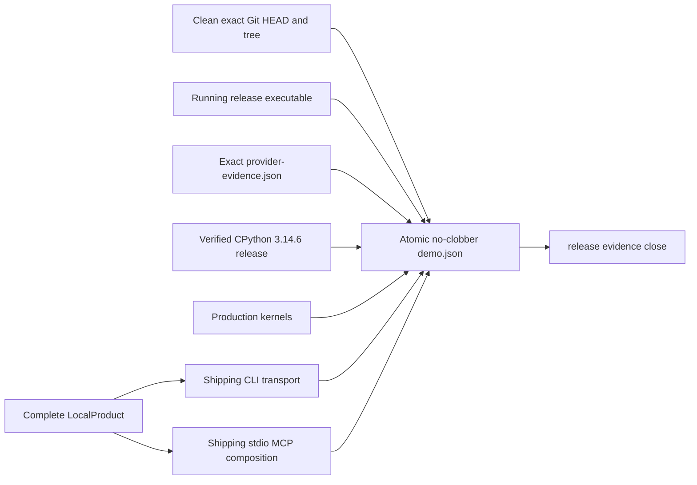

# Usable-release demonstration

This page defines the deterministic, offline all-vertical demonstration that must run against the
same executable and immutable evidence set later consumed by release closure.

| Field | Value |
| --- | --- |
| Document type | Release-verification methodology |
| Audience | Release engineers, reviewers, operators, and maintainers |
| Status | Producer implemented; exact-head acceptance pending |
| Last substantive review | 2026-07-26 |
| Implementation review base | `094172d4c6d32b73eecbdc6823ab284bdf09ad26` plus the release-demonstration change |

## Contents

- [Purpose and acceptance boundary](#purpose-and-acceptance-boundary)
- [Evidence topology](#evidence-topology)
- [Production paths exercised](#production-paths-exercised)
- [Immutable-input and publication contract](#immutable-input-and-publication-contract)
- [Exact invocation](#exact-invocation)
- [Success and failure evidence](#success-and-failure-evidence)
- [Current disposition](#current-disposition)
- [Related code and documentation](#related-code-and-documentation)
- [External sources](#external-sources)

## Purpose and acceptance boundary

The demonstration answers one bounded question:

> Can the release executable compose and exercise the implemented live, research, model,
> portfolio, valuation, execution, CLI, and MCP product boundaries without external network access,
> while preserving the authority and data-quality restrictions established by separately collected
> provider evidence?

It does not establish current provider availability, provider rights, authenticated source
qualification, production latency, dependency safety, or release approval. Those predicates are
owned by the provider, performance, security, full-gate, and final review evidence in the same
exact-HEAD directory.

## Evidence topology



The provider report, Python manifests, executable, repository identity, and directory topology are
checked before work starts and again at the publication barrier. The output records stable content
identities; transient scratch paths are not evidence.

## Production paths exercised

| Area | Demonstrated behavior | Required release predicate |
| --- | --- | --- |
| Coinbase public data | Production profile and decoder admit sealed snapshot, delta, and trade frames | Quality ceiling remains `DirectUnverified`; no automated action authority |
| Kraken live integrity | Production decoder and venue checksum kernel process the official sealed fixture | A nonzero checksum-qualified operation count |
| Live action path | Instrument-owned actor, features, strategy, central risk, one-use dispatcher, and realistic paper adapter run together | Dispatched terminal paper outcome, retained order evidence, bounded shutdown |
| Native and ONNX inference | Production native backend and supervised local ONNX worker run admitted fixtures | Nonzero operation counts and no Python call in the live path |
| Research storage | Canonical observations become Arrow, content-addressed Parquet, and a pinned DataFusion query | Exactly one immutable Parquet object and a verified query result |
| Point-in-time data | The production selector consumes manifest-bound candidates at explicit cutoffs | Nonempty current selection, no excluded or future-known record |
| Python handoff | Typed Rust export is independently admitted by the sealed Python release | Verified rows and content/catalog/selection identities |
| Backtesting | Production engine applies latency, fees, slippage, depth, and partial-fill assumptions | Two partial fills totaling four lots and independent accounting reconciliation |
| Local research CLI | File ingestion, manifest lookup, and bounded read-only SQL use shipping services | One ingested row and one returned query row |
| Portfolio | Sealed holdings/transactions import retains raw evidence and drives analytics | Exact account, zero reconciliation discrepancies, nonempty analytics |
| Fair value | Portfolio-derived evidence is measured, classified, explained, and retrieved | Classification is never Level 1 |
| Paper authority | Product starts with its paper bot stopped | Status is stopped and orders, fills, and reconciliation fail closed until a runtime owns authority |
| Doctor | Query-only inspection runs against the active local layout | No local mutation, remote exporter, or arbitrary artifact-path authority |
| MCP | Shipping composition initializes, lists the application registry, calls `Bot.GetStatus`, audits, and shuts down | Protocol `2025-11-25`, exact descriptor parity, durable audit, bounded shutdown |

Successful paper reconciliation is proved by the integrated production kernel. The local CLI
portion deliberately does not fabricate a running source: while the bot is stopped, execution
operations must return `Unavailable`.

## Immutable-input and publication contract

The command accepts only this layout:

```text
target/release-evidence/<HEAD>/
├── providers/
│   └── provider-evidence.json
├── python/
│   ├── market-squawk-release.json
│   ├── market-squawk-release-evidence.json
│   └── release-cp314/
└── demo.json                  # absent before the command
```

Admission requires:

- `--offline`, exact `--head`, and exact `--tree`;
- a clean repository that remains unchanged through publication;
- real, non-symlink evidence directories and bounded regular files;
- a provider report for the exact repository and current executable;
- the exact verified CPython 3.14.6 training environment;
- an output named `demo.json` in the same HEAD-keyed root;
- no parent traversal and no output overwrite; and
- no credential material in provider, Python, or demonstration evidence.

The command creates all working state under an automatically removed temporary directory. It does
not publish scratch state into the release evidence set.

## Exact invocation

Run only after the provider evidence and Python release for the same clean candidate exist:

```bash
set -euo pipefail
export CARGO_INCREMENTAL=0

HEAD_SHA="$(git rev-parse HEAD)"
TREE_SHA="$(git rev-parse HEAD^{tree})"
EVIDENCE_DIR="target/release-evidence/$HEAD_SHA"

test -z "$(git status --porcelain)"
cargo run -p market-squawk --release --all-features --locked -- \
  release demonstrate --offline \
  --head "$HEAD_SHA" --tree "$TREE_SHA" \
  --provider-evidence "$EVIDENCE_DIR/providers" \
  --python-evidence "$EVIDENCE_DIR/python/market-squawk-release.json" \
  --output-file "$EVIDENCE_DIR/demo.json"
test -z "$(git status --porcelain)"
```

The command is compiled only with the `release-evidence` feature, which is included by
`--all-features`. It fails closed in builds that omit that feature.

## Success and failure evidence

Success is a no-clobber JSON report of kind `market_squawk.release.demonstration` whose payload
contains:

- clean repository and exact input identities;
- production kernel results;
- complete application capability and domain inventory;
- CLI, doctor, and MCP behavioral predicates; and
- `offline: true` and `completed: true`.

Any failed sub-operation aborts publication. A partial scratch directory, successful parser call,
or local fixture is never converted into provider authority, performance approval, or a completed
release.

## Current disposition

The production demonstration runner and its strict closure predicates are implemented in the
current release lane. Focused compilation, Clippy, and the consolidated fail-closed admission case
are the lane gate. The terminal invocation still requires the current provider report and verified
CPython 3.14.6 release evidence from the same frozen clean candidate. No `demo.json` is currently
accepted as release evidence.

## Related code and documentation

- [Release demonstration entry point](../../apps/market-squawk/src/release/demonstrate.rs)
- [Complete local application demonstration](../../apps/market-squawk/src/release/demonstrate/local.rs)
- [Shipping MCP demonstration](../../apps/market-squawk/src/release/demonstrate/mcp.rs)
- [Production kernel composition](../../apps/market-squawk/src/release/benchmark.rs)
- [Strict release closure](../../apps/market-squawk/src/release/close.rs)
- [Performance methodology](usable-release-performance.md)
- [Exact-head release gate](usable-release-gate.md)
- [Delivery ledger](../plans/delivery-ledger.md)

## External sources

| Source | Applied fact | Reviewed |
| --- | --- | --- |
| [Git `rev-parse`](https://git-scm.com/docs/git-rev-parse) | Resolves the exact commit and tree identities bound into every report. | 2026-07-26 |
| [Cargo build cache](https://doc.rust-lang.org/cargo/reference/build-cache.html) | Distinguishes generated target state from source and explains worktree-path-sensitive dependency metadata. | 2026-07-26 |
| [MCP tools specification 2025-11-25](https://modelcontextprotocol.io/specification/2025-11-25/server/tools) | Defines `tools/list`, `tools/call`, tool schemas, and structured results exercised by the shipping stdio session. | 2026-07-26 |
| [Apache Arrow columnar format](https://arrow.apache.org/docs/format/Columnar.html) | Defines the canonical in-memory representation exercised by the analytical kernel. | 2026-07-26 |
| [Apache DataFusion SQL reference](https://datafusion.apache.org/user-guide/sql/) | Defines the SQL engine surface used by the pinned bounded analytical query. | 2026-07-26 |
