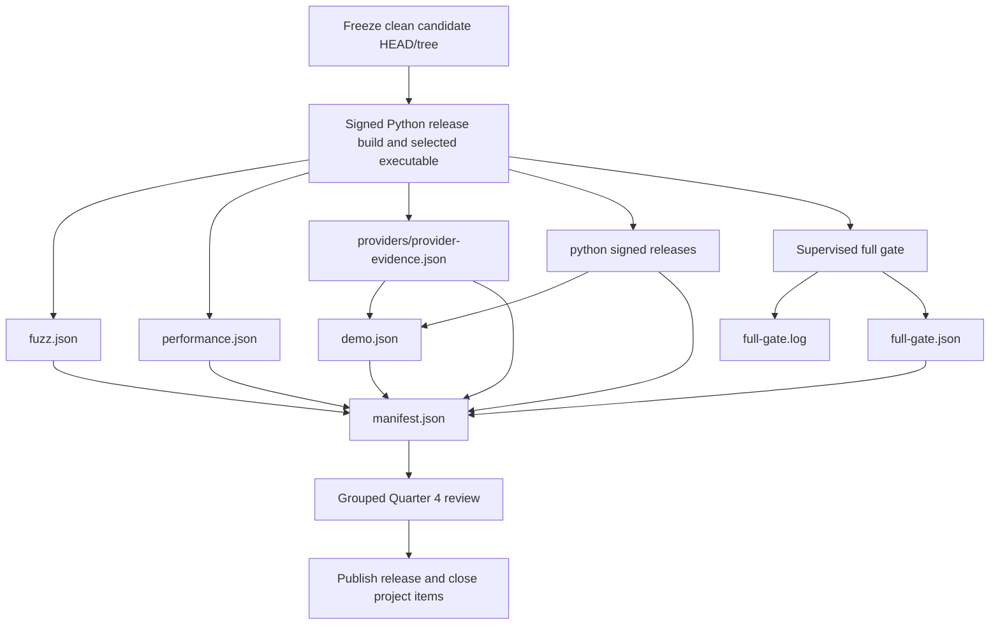

# Usable-release exact-head gate

This page defines the sole terminal gate for the first complete local Market Squawk release.

| Field | Value |
| --- | --- |
| Document type | Release gate and evidence contract |
| Audience | Release owner, reviewers, maintainers, and auditors |
| Status | Gate authority implemented; terminal execution blocked |
| Last substantive review | 2026-07-26 |
| Implementation review base | `d738500e8ad4d7b1ad4f19410ba3f64b573206db` plus the release-evidence authority change |

## Contents

- [Terminal decision](#terminal-decision)
- [Preconditions](#preconditions)
- [Evidence-set flow](#evidence-set-flow)
- [Required commands](#required-commands)
- [Closure invariants](#closure-invariants)
- [Failure and restart policy](#failure-and-restart-policy)
- [Current blockers](#current-blockers)
- [Related code and sources](#related-code-and-sources)

## Terminal decision

`usable_complete_local_release = true` is permitted only when one clean, unchanged candidate:

1. satisfies all provider and durable-use predicates;
2. produces signed Python 3.12 and 3.13 releases;
3. passes the offline complete-product demonstration;
4. passes fuzz, performance, security, dependency, license, credential, build, and test gates;
5. receives a grouped Quarter 4 review with no unresolved release-blocking finding; and
6. is sealed by `release evidence close` without changing Git or any evidence input.

No individual lane, test suite, documentation update, provider fixture, or provisional report can
make that decision.

## Preconditions

- The release branch and origin point to the reviewed candidate.
- `git status --porcelain` is empty.
- `HEAD` and `HEAD^{tree}` are recorded once and remain unchanged.
- The release binary and sibling ONNX worker are built with the locked dependency graph.
- The operator has explicitly authorized external provider collection and configured required
  contacts, credentials, queries, and rights evidence.
- CPython 3.12 and 3.13 interpreters and the sealed wheelhouse are available.
- One worktree-local Cargo target is below the 20 GiB release ceiling; `CARGO_INCREMENTAL=0`.
- Hosted CI and dependency-update pull requests have been reconciled, or an external service
  blocker is recorded without being mistaken for a code failure.

## Evidence-set flow



Any remediation returns the flow to `Freeze` with a new commit and invalidates all prior
exact-head artifacts.

## Required commands

The authoritative detailed block remains in
[Task 20 of the implementation plan](../superpowers/plans/2026-07-17-market-squawk-usable-complete-release.md#task-20-prove-review-publish-and-stop-at-the-usable-complete-local-release).
Its core sequence is:

```bash
set -euo pipefail
export CARGO_INCREMENTAL=0

test -z "$(git status --porcelain)"
HEAD_SHA="$(git rev-parse HEAD)"
TREE_SHA="$(git rev-parse HEAD^{tree})"
EVIDENCE_DIR="target/release-evidence/$HEAD_SHA"
mkdir -p "$EVIDENCE_DIR"

# Build both signed Python releases first. Use the immutable CPython 3.12
# application copy as SELECTED_BINARY for every Rust evidence producer.
SELECTED_BINARY="$EVIDENCE_DIR/python/release-cp312/bin/market-squawk"

"$SELECTED_BINARY" \
  release demonstrate --offline \
  --head "$HEAD_SHA" --tree "$TREE_SHA" \
  --provider-evidence "$EVIDENCE_DIR/providers" \
  --python-evidence "$EVIDENCE_DIR/python/market-squawk-release.json" \
  --output-file "$EVIDENCE_DIR/demo.json"

"$SELECTED_BINARY" \
  release evidence gate \
  --head "$HEAD_SHA" --tree "$TREE_SHA" \
  --binary "$SELECTED_BINARY" \
  --gate-log "$EVIDENCE_DIR/full-gate.log" \
  --output-file "$EVIDENCE_DIR/full-gate.json"

"$SELECTED_BINARY" \
  release evidence close \
  --head "$HEAD_SHA" --tree "$TREE_SHA" \
  --evidence-dir "$EVIDENCE_DIR" \
  --binary "$SELECTED_BINARY" \
  --output-file "$EVIDENCE_DIR/manifest.json"

git diff --exit-code
test -z "$(git status --porcelain)"
```

The grouped review starts only after `manifest.json` closes the exact artifact inventory. Review
approval is a read-only attestation over that unchanged HEAD, selected executable, manifest, and
artifact set; it is not inserted into the already closed directory.

`scripts/verify.sh` remains the sole checked-in build/security program. The Rust gate command is
its bounded authority supervisor and evidence publisher; no second shell wrapper, command-order
test, or prose validator is part of the release contract.

## Closure invariants

Before writing `manifest.json`, the closer requires exactly:

```text
<HEAD>/
├── demo.json
├── full-gate.json
├── full-gate.log
├── fuzz.json
├── performance.json
├── providers/
│   └── provider-evidence.json
└── python/
    ├── market-squawk-release.json
    ├── market-squawk-release-evidence.json
    ├── release-cp312/
    └── release-cp313/
```

It validates:

- report kinds, strict schemas, exact repository identities, and content hashes;
- the exact six-target fuzz campaign, bounded successful child processes, corpus limits, and
  immutable fuzz inputs;
- the fixed 60-million-event/10-million-row workload, measured latency and throughput, queue and
  RSS bounds, storage/PIT/Python predicates, threshold decisions, worker binding, and immutable
  benchmark inputs;
- mandatory provider surfaces, restart recovery, Coinbase Direct action authority, public-source
  non-promotion, and admitted FRED/ALFRED persistence/training rights;
- exact provider and demonstration binding to the release executable;
- signed Python environments plus exact Python-manifest binding to the selected application
  executable;
- production live/model/risk/paper, storage/PIT/Python/backtest, portfolio/fair-value, CLI/doctor,
  and MCP predicates;
- a typed `full-gate.json` receipt binding the selected executable, `scripts/verify.sh`, finalized
  no-clobber log, successful observed process evidence, fixed timeout/RSS limits, ordered
  timestamps, and target usage below 20 GiB;
- a log-only 64 MiB file-size ceiling, bounded UTF-8 full-gate output, and credential rejection;
- bounded file count and total bytes; and
- no missing, extra, symlinked, cross-HEAD, clobbered, or parent-traversing artifact.

The published closed manifest inventories every evidence artifact by relative path, SHA-256, and
byte count. Immediately before atomic publication, the closer revalidates the repository,
executable, verification script, gate log, exact root topology, and complete artifact inventory on
both sides of pending-file preparation.

## Failure and restart policy

- Preserve the first failing report and command output outside the next HEAD-keyed directory.
- Fix the owning production contract, not the report text.
- Commit the correction, collect a new HEAD/tree, and regenerate the entire evidence set.
- Do not copy, rename, or reuse an artifact from the previous candidate.
- Clean generated state only at a completed-lane boundary or when the measured disk ceiling is
  exceeded.
- A GitHub billing/spending failure is recorded as hosted-service unavailability; local exact-head
  gates still must pass, and the release is not published while required branch checks are absent.

## Current blockers

The terminal gate has not run. The current release remains blocked by:

- authorized unchanged-head Coinbase Direct provider acceptance;
- required external SEC, BLS, Treasury, and provider-recovery evidence;
- FRED/ALFRED durable persistence and model-training rights under the currently enforced release
  predicate;
- exact-head fuzz, performance, Python, demonstration, full security/build, and closure evidence;
  and
- the grouped Quarter 4 review and final publication.

The release-demonstration implementation can be integrated while those externally coordinated
inputs remain unresolved. It does not change their status.

## Related code and sources

- [Strict evidence closer](../../apps/market-squawk/src/release/close.rs)
- [Release command dispatch](../../apps/market-squawk/src/release/mod.rs)
- [Demonstration methodology](usable-release-demonstration.md)
- [Performance methodology](usable-release-performance.md)
- [Release review record](../reports/usable-release-review.md)
- [Delivery ledger](../plans/delivery-ledger.md)
- [Cargo `--locked`](https://doc.rust-lang.org/cargo/commands/cargo-build.html)
- [Cargo cache configuration](https://doc.rust-lang.org/cargo/reference/config.html#cache)
- [cargo-deny](https://embarkstudios.github.io/cargo-deny/)
- [RustSec cargo-audit](https://github.com/rustsec/rustsec/tree/main/cargo-audit)
- [Gitleaks](https://github.com/gitleaks/gitleaks)
