# Usable-release performance evidence

This page defines how Market Squawk measures the production live path, analytical storage, and
bounded memory before any release performance claim is accepted.

| Field | Value |
| --- | --- |
| Document type | Performance-verification methodology |
| Audience | Performance engineers, release reviewers, maintainers, and operators |
| Status | Producer implemented; exact-head measurement pending |
| Last substantive review | 2026-07-26 |
| Implementation review base | `094172d4c6d32b73eecbdc6823ab284bdf09ad26` |

## Contents

- [Acceptance targets](#acceptance-targets)
- [Measured boundary](#measured-boundary)
- [Measurement and supervision](#measurement-and-supervision)
- [Exact invocation](#exact-invocation)
- [Evidence interpretation](#evidence-interpretation)
- [Current disposition](#current-disposition)
- [Related code and sources](#related-code-and-sources)

## Acceptance targets

The unchanged release candidate must demonstrate:

| Predicate | Acceptance threshold |
| --- | ---: |
| Complete warmed live-path throughput | At least 100,000 measured events per second |
| Complete warmed live-path p99 | Strictly below 1,000,000 nanoseconds |
| Post-warm-up resident-memory growth | At most the greater of 32 MiB or 1% of the warm plateau |
| Queue behavior | No capacity violation; observed in-flight work remains within the configured bound |
| Storage path | Arrow conversion, Parquet publication/read, DataFusion query, and Python admission all complete |
| Worker process | Successful exit and process-tree RSS within the fixed supervisor ceiling |

These are release thresholds, not estimates. A focused benchmark, developer-profile run, failed
attempt, different commit, or result copied from another host cannot satisfy them.

## Measured boundary

```mermaid
flowchart LR
    Fixture["Hash-bound canonical fixture"]
    Decoder["Decoder and integrity"]
    Queue["Bounded actor queue"]
    Book["Order book"]
    Features["Online features"]
    Inference["Native or ONNX inference"]
    Strategy["Strategy"]
    Risk["Central risk"]
    Dispatch["One-use dispatch"]
    Paper["Observed paper terminal"]

    Fixture --> Decoder --> Queue --> Book --> Features --> Inference
    Inference --> Strategy --> Risk --> Dispatch --> Paper
```



The integrated distribution begins at admitted production-kernel input and records strategy
decision, complete action disposition, and the observed paper terminal. Component distributions
measure decoder/checksum, sequence, queue, book, features, native inference, and ONNX inference
separately without replacing the integrated acceptance boundary.

The analytical lane performs real canonical Arrow conversion, content-addressed Parquet
publication and read, pinned DataFusion SQL, point-in-time selection, and typed Python dataset
admission. It records row counts, content identities, operation counts, elapsed time, throughput,
and latency quantiles.

## Measurement and supervision

The public command supervises a hidden worker process. Before accepting its report, the parent
verifies:

- clean exact repository head/tree and unchanged executable identity;
- locked dependency and toolchain-file identities;
- exact compiled features and fixture hashes;
- documented host, operating system, CPU, memory, and Rust toolchain;
- fixed warm-up, event, row, queue, time, and RSS bounds;
- complete worker exit and process-tree RSS observation; and
- unchanged repository and executable at atomic no-clobber publication.

The fixed release workload is one million warm-up events, 60 million measured events, and ten
million analytical rows. Routine feature work must not run that workload; it runs once against the
frozen exact candidate.

## Exact invocation

```bash
set -euo pipefail
export CARGO_INCREMENTAL=0

HEAD_SHA="$(git rev-parse HEAD)"
TREE_SHA="$(git rev-parse HEAD^{tree})"
EVIDENCE_DIR="target/release-evidence/$HEAD_SHA"

test -z "$(git status --porcelain)"
cargo run -p market-squawk --release --all-features --locked -- \
  release evidence benchmark \
  --head "$HEAD_SHA" --tree "$TREE_SHA" \
  --warm-up-events 1000000 \
  --events 60000000 \
  --storage-rows 10000000 \
  --max-tail-growth-mib 32 \
  --max-tail-growth-percent 1 \
  --min-events-per-second 100000 \
  --max-warmed-p99-ns 999999 \
  --output-file "$EVIDENCE_DIR/performance.json"
test -z "$(git status --porcelain)"
```

The output file must not already exist. A rerun after any source, lockfile, toolchain, feature,
binary, fixture, or review change belongs to the new exact HEAD and must not overwrite prior
evidence.

## Evidence interpretation

The report of kind `market_squawk.release.performance` contains component and integrated
distributions, storage measurements, host/toolchain facts, current-process and process-tree memory
observations, fixed configuration, input identities, and a threshold decision. Release closure
requires a passing exact-head report; a human-readable summary cannot substitute for it.

Latency measures internal production processing and observed paper completion for the documented
fixture. It is not a claim about Internet transit, venue matching latency, broker latency, or every
consumer machine.

## Current disposition

The bounded benchmark producer and its threshold enforcement are implemented. No exact-head
60-million-event result has been accepted for the current release candidate, so Market Squawk does
not yet claim the performance targets. The final measurement is serialized after provider
acceptance and candidate freeze to avoid invalidating expensive evidence through implementation
churn.

## Related code and sources

- [Performance producer](../../apps/market-squawk/src/release/benchmark.rs)
- [Component measurements](../../apps/market-squawk/src/release/benchmark/components.rs)
- [Worker supervision](../../apps/market-squawk/src/release/benchmark/worker.rs)
- [Host evidence](../../apps/market-squawk/src/release/benchmark/host.rs)
- [Analytical storage runner](../../crates/market-squawk-data/src/benchmark_support.rs)
- [Quality attributes](../architecture/quality-attributes.md)
- [Release demonstration](usable-release-demonstration.md)
- [Cargo build cache](https://doc.rust-lang.org/cargo/reference/build-cache.html)
- [Apache DataFusion](https://datafusion.apache.org/)
- [Apache Parquet file format](https://parquet.apache.org/docs/file-format/)
